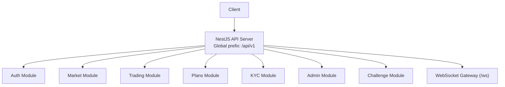
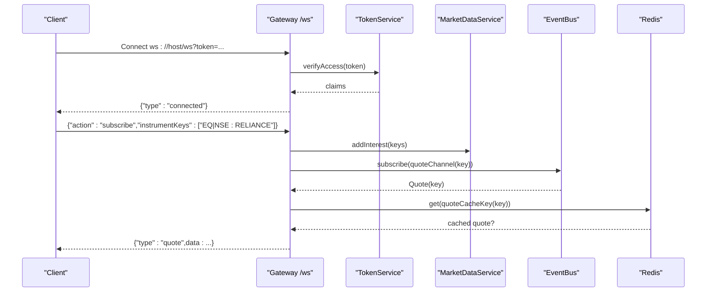
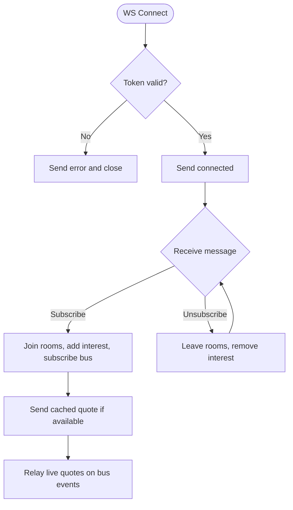
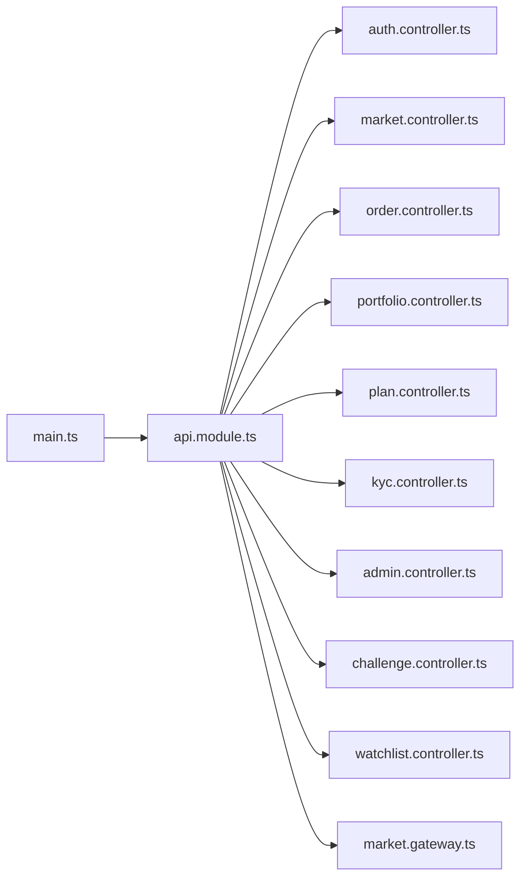

# API Reference

<cite>
**Referenced Files in This Document**
- [main.ts](file://backend/apps/api/src/main.ts)
- [api.module.ts](file://backend/apps/api/src/api.module.ts)
- [auth.controller.ts](file://backend/apps/api/src/modules/auth/presentation/auth.controller.ts)
- [market.controller.ts](file://backend/apps/api/src/modules/market/presentation/market.controller.ts)
- [order.controller.ts](file://backend/apps/api/src/modules/trading/presentation/order.controller.ts)
- [portfolio.controller.ts](file://backend/apps/api/src/modules/trading/presentation/portfolio.controller.ts)
- [plan.controller.ts](file://backend/apps/api/src/modules/plans/presentation/plan.controller.ts)
- [kyc.controller.ts](file://backend/apps/api/src/modules/kyc/presentation/kyc.controller.ts)
- [admin.controller.ts](file://backend/apps/api/src/modules/admin/presentation/admin.controller.ts)
- [challenge.controller.ts](file://backend/apps/api/src/modules/challenge/presentation/challenge.controller.ts)
- [watchlist.controller.ts](file://backend/apps/api/src/modules/market/presentation/watchlist.controller.ts)
- [market.gateway.ts](file://backend/apps/api/src/modules/market/presentation/market.gateway.ts)
</cite>

## Table of Contents
1. [Introduction](#introduction)
2. [Project Structure](#project-structure)
3. [Core Components](#core-components)
4. [Architecture Overview](#architecture-overview)
5. [Detailed Component Analysis](#detailed-component-analysis)
6. [Dependency Analysis](#dependency-analysis)
7. [Performance Considerations](#performance-considerations)
8. [Troubleshooting Guide](#troubleshooting-guide)
9. [Conclusion](#conclusion)
10. [Appendices](#appendices)

## Introduction
This document provides a comprehensive API reference for the REST endpoints and WebSocket interfaces exposed by the application. It covers authentication, authorization, market data, trading operations, KYC, plans/payments, admin functions, challenges/rewards, and real-time streaming via WebSockets. Each endpoint group includes HTTP methods, URL patterns (relative to the global prefix), request/response schemas, authentication requirements, error codes, rate limiting, pagination/filtering/sorting where applicable, and practical usage examples.

## Project Structure
The API server is bootstrapped with a global path prefix and security headers. Feature modules are registered at the root module level and each exposes its own controllers under distinct paths. A shared throttling guard and validation pipe are applied globally.

**Diagram sources**
- [main.ts:7-22](file://backend/apps/api/src/main.ts#L7-L22)
- [api.module.ts:23-41](file://backend/apps/api/src/api.module.ts#L23-L41)

**Section sources**
- [main.ts:7-22](file://backend/apps/api/src/main.ts#L7-L22)
- [api.module.ts:23-41](file://backend/apps/api/src/api.module.ts#L23-L41)

## Core Components
- Authentication and session management: login, register, OTP flows, refresh/logout, current user info, sessions, login history.
- Market data: instrument search, quotes, candles, option chain, expiries, segment listing, market status.
- Trading: place/cancel orders, order book, portfolio views (positions, holdings, trades).
- Plans and payments: list plans, create order, confirm checkout, subscription and payment history.
- KYC: status check and document submission with file uploads.
- Admin: employee and role management, user lifecycle, configuration, audit logs.
- Challenges and rewards: current challenge, history, reward details.
- Watchlists: per-user tabs/items CRUD and reorder.
- Real-time market data: WebSocket gateway for live quote streaming.

**Section sources**
- [auth.controller.ts:53-137](file://backend/apps/api/src/modules/auth/presentation/auth.controller.ts#L53-L137)
- [market.controller.ts:21-74](file://backend/apps/api/src/modules/market/presentation/market.controller.ts#L21-L74)
- [order.controller.ts:23-46](file://backend/apps/api/src/modules/trading/presentation/order.controller.ts#L23-L46)
- [portfolio.controller.ts:5-23](file://backend/apps/api/src/modules/trading/presentation/portfolio.controller.ts#L5-L23)
- [plan.controller.ts:25-62](file://backend/apps/api/src/modules/plans/presentation/plan.controller.ts#L25-L62)
- [kyc.controller.ts:37-63](file://backend/apps/api/src/modules/kyc/presentation/kyc.controller.ts#L37-L63)
- [admin.controller.ts:30-169](file://backend/apps/api/src/modules/admin/presentation/admin.controller.ts#L30-L169)
- [challenge.controller.ts:8-34](file://backend/apps/api/src/modules/challenge/presentation/challenge.controller.ts#L8-L34)
- [watchlist.controller.ts:32-74](file://backend/apps/api/src/modules/market/presentation/watchlist.controller.ts#L32-L74)
- [market.gateway.ts:19-133](file://backend/apps/api/src/modules/market/presentation/market.gateway.ts#L19-L133)

## Architecture Overview
The system uses a layered architecture:
- Controllers handle HTTP requests and map them to services.
- Services encapsulate business logic and interact with infrastructure (databases, external feeds, Redis).
- Global guards enforce authentication and rate limits; a global exception filter normalizes errors; an envelope interceptor standardizes responses.
- WebSocket gateway authenticates clients via JWT query parameter and fans out quotes per instrument using rooms and an event bus.

**Diagram sources**
- [market.gateway.ts:48-113](file://backend/apps/api/src/modules/market/presentation/market.gateway.ts#L48-L113)

## Detailed Component Analysis

### Authentication API
Base path: /api/v1/auth

- POST /auth/register
  - Auth: None
  - Body: RegisterDto
  - Rate limit: Strict throttle (5/min with block duration)
  - Response: User/session tokens
  - Errors: DUPLICATE, UNPROCESSABLE_ENTITY

- POST /auth/otp/request
  - Auth: None
  - Body: RequestOtpDto
  - Rate limit: Strict throttle
  - Response: Success acknowledgment
  - Errors: OTP_HOURLY_LIMIT, OTP_COOLDOWN

- POST /auth/otp/verify
  - Auth: None
  - Body: VerifyMobileDto
  - Rate limit: Strict throttle
  - Response: Success or token issuance
  - Errors: INVALID_CODE

- POST /auth/email/resend
  - Auth: None
  - Body: ResendEmailDto
  - Rate limit: Strict throttle
  - Response: Success acknowledgment

- GET /auth/email/verify
  - Auth: None
  - Query: token
  - Response: Verification result

- POST /auth/login
  - Auth: None
  - Body: LoginDto
  - Rate limit: Strict throttle
  - Response: Access token, refresh token
  - Errors: AUTH_FAILED, SESSION_REVOKED, TOKEN_INVALID

- POST /auth/refresh
  - Auth: None
  - Body: RefreshDto
  - Rate limit: 30/min
  - Response: New access token
  - Errors: TOKEN_INVALID

- POST /auth/logout
  - Auth: None
  - Body: RefreshDto
  - Response: Success

- POST /auth/logout-all
  - Auth: Required (JWT)
  - Response: Success

- POST /auth/password/forgot
  - Auth: None
  - Body: ForgotPasswordDto
  - Rate limit: Strict throttle
  - Response: Success acknowledgment

- POST /auth/password/reset
  - Auth: None
  - Body: ResetPasswordDto
  - Rate limit: Strict throttle
  - Response: Success

- GET /auth/me
  - Auth: Required (JWT)
  - Response: Current user profile

- GET /auth/sessions
  - Auth: Required (JWT)
  - Response: Active sessions

- GET /auth/login-history
  - Auth: Required (JWT)
  - Response: Recent logins

Authentication flow notes:
- JWT-based access tokens are required for protected routes.
- Refresh tokens support rotation and revocation.
- Strict throttling protects credential and OTP endpoints.

Example usage:
- curl -X POST https://host/api/v1/auth/login -H "Content-Type: application/json" -d '{"identifier":"...","password":"..."}'

**Section sources**
- [auth.controller.ts:53-137](file://backend/apps/api/src/modules/auth/presentation/auth.controller.ts#L53-L137)

### Market Data API
Base path: /api/v1/market
Auth: Required (JWT) for all endpoints except where noted.

- GET /market/search
  - Query: q, segment, limit, exchange
  - Response: Instrument search results

- GET /market/instruments/:instrumentKey
  - Path: instrumentKey (URL-encoded)
  - Response: Instrument detail
  - Errors: NOT_FOUND

- GET /market/segment/:segment
  - Path: segment
  - Query: limit, offset
  - Response: Paginated instrument list by segment

- GET /market/status
  - Response: Market open flags for segments

- GET /market/quotes
  - Query: keys (comma-separated, up to 200)
  - Response: Latest quotes for requested keys

- GET /market/candles
  - Query: instrumentKey, from, to, interval, limit
  - Response: Candle series

- GET /market/option-chain
  - Query: underlyingKey, expiry, atmSpan
  - Response: Option chain data

- GET /market/expiries/:underlyingKey
  - Path: underlyingKey (URL-encoded)
  - Response: Available expiries

Pagination and filtering:
- Segment listing supports limit and offset.
- Quotes accept multiple keys with a hard cap.

Rate limiting:
- Default throttler applies; specific endpoints may have stricter policies.

Example usage:
- curl -X GET "https://host/api/v1/market/quotes?keys=EQ%7CNSE%3ARELIANCE" -H "Authorization: Bearer <token>"

**Section sources**
- [market.controller.ts:21-74](file://backend/apps/api/src/modules/market/presentation/market.controller.ts#L21-L74)

### Trading API
Base path: /api/v1/orders and /api/v1/portfolio
Auth: Required (JWT)

Orders:
- POST /orders
  - Body: PlaceOrderDto (challengeId, instrumentKey, side, type, product, qty, limitPricePaise, trigger)
  - Rate limit: 60/min
  - Response: Order confirmation
  - Errors: CHALLENGE_NOT_TRADABLE, MARKET_CLOSED, INSTRUMENT_DISABLED, SEGMENT_NOT_ALLOWED, INSUFFICIENT_CAPITAL, FREEZE_QTY_EXCEEDED, NO_MARKET_DATA

- DELETE /orders/:orderId
  - Response: Cancellation result
  - Errors: NOT_CANCELLABLE

- GET /orders/:challengeId/book
  - Response: Order book for challenge

Portfolio:
- GET /portfolio/:challengeId/positions
  - Response: Positions view

- GET /portfolio/:challengeId/holdings
  - Response: Holdings view

- GET /portfolio/:challengeId/trades
  - Response: Recent trades

Error mapping highlights:
- Validation/business failures return UNPROCESSABLE_ENTITY.
- Not found returns NOT_FOUND.
- Conflicts for non-cancellable orders.

Example usage:
- curl -X POST https://host/api/v1/orders -H "Authorization: Bearer <token>" -H "Content-Type: application/json" -d '{"challengeId":"...","instrumentKey":"...","side":"BUY","type":"LIMIT","product":"MIS","qty":1,"limitPricePaise":123456}'

**Section sources**
- [order.controller.ts:23-46](file://backend/apps/api/src/modules/trading/presentation/order.controller.ts#L23-L46)
- [portfolio.controller.ts:5-23](file://backend/apps/api/src/modules/trading/presentation/portfolio.controller.ts#L5-L23)

### Plans and Payments API
Base path: /api/v1/plans
Auth: Some endpoints require JWT.

- GET /plans
  - Response: Public plan catalog

- GET /plans/:id
  - Response: Plan detail
  - Errors: NOT_FOUND

- POST /plans/order
  - Auth: Required (JWT)
  - Body: CreateOrderDto
  - Rate limit: 10/min
  - Response: Checkout order created

- POST /plans/confirm
  - Auth: Required (JWT)
  - Body: ConfirmCheckoutDto (orderId, paymentId, signature)
  - Response: Confirmation result
  - Errors: SIGNATURE_INVALID

- GET /plans/me/subscription
  - Auth: Required (JWT)
  - Response: Current subscription

- GET /plans/me/payments
  - Auth: Required (JWT)
  - Response: Payment history

Example usage:
- curl -X POST https://host/api/v1/plans/order -H "Authorization: Bearer <token>" -H "Content-Type: application/json" -d '{"planId":"..."}'

**Section sources**
- [plan.controller.ts:25-62](file://backend/apps/api/src/modules/plans/presentation/plan.controller.ts#L25-L62)

### KYC API
Base path: /api/v1/kyc
Auth: Required (JWT)

- GET /kyc/status
  - Response: KYC status

- POST /kyc/submit
  - Body: SubmitKycDto (panNumber)
  - Files: pan, idProof, addressProof, selfie (max 1 each, size limited)
  - Rate limit: 5/min with block duration
  - Response: Submission accepted
  - Errors: KYC_ALREADY_PENDING, KYC_ALREADY_APPROVED

File upload constraints:
- Max file size enforced by server configuration.
- Exactly one file per field when provided.

Example usage:
- curl -X POST https://host/api/v1/kyc/submit -F "pan=@/path/to/pan.jpg" -F "idProof=@/path/to/id.jpg" -F "addressProof=@/path/to/address.jpg" -F "selfie=@/path/to/selfie.jpg" -F "panNumber=ABCDE1234F" -H "Authorization: Bearer <token>"

**Section sources**
- [kyc.controller.ts:37-63](file://backend/apps/api/src/modules/kyc/presentation/kyc.controller.ts#L37-L63)

### Admin API
Base path: /api/v1/admin
Auth: Employee JWT + permissions guard

Employees and roles:
- GET /admin/employees
  - Permission: employees.view
  - Response: Employee list

- POST /admin/employees
  - Permission: employees.manage
  - Body: CreateEmployeeDto
  - Response: Created employee

- PATCH /admin/employees/:id
  - Permission: employees.manage
  - Body: UpdateEmployeeDto
  - Response: Updated employee

- POST /admin/employees/:id/reset-password
  - Permission: employees.manage
  - Body: ResetEmployeePasswordDto
  - Response: Success

- GET /admin/roles
  - Permission: employees.view
  - Response: Roles catalog

- PUT /admin/roles/:key
  - Permission: roles.manage
  - Body: UpdateRoleDto
  - Response: Updated role

- GET /admin/permissions
  - Permission: employees.view
  - Response: Permission catalog

Users:
- GET /admin/users
  - Permission: users.view
  - Query: search, page, pageSize, status
  - Response: Paginated user list

- GET /admin/users/:id
  - Permission: users.view
  - Response: User detail

- POST /admin/users/:id/approve
  - Permission: users.approve
  - Response: Approved

- POST /admin/users/:id/reject
  - Permission: users.approve
  - Body: RejectUserDto
  - Response: Rejected

- POST /admin/users/:id/suspend
  - Permission: users.suspend
  - Body: SuspendUserDto
  - Response: Suspended

- POST /admin/users/:id/unsuspend
  - Permission: users.suspend
  - Body: SuspendUserDto
  - Response: Unsuspended

Configuration:
- GET /admin/config
  - Permission: config.manage
  - Response: Configuration entries

- PUT /admin/config
  - Permission: config.manage
  - Body: SetConfigDto
  - Response: Updated configuration

Audit:
- GET /admin/audit-logs
  - Permission: audit.view
  - Query: entity, entityId OR actorId
  - Response: Audit entries

Permissions model:
- Endpoints enforce fine-grained permissions via a guard and decorator.

Example usage:
- curl -X GET https://host/api/v1/admin/users?page=1&pageSize=20 -H "Authorization: Bearer <employee-token>"

**Section sources**
- [admin.controller.ts:30-169](file://backend/apps/api/src/modules/admin/presentation/admin.controller.ts#L30-L169)

### Challenge and Rewards API
Base path: /api/v1/challenge
Auth: Required (JWT)

- GET /challenge/current
  - Response: Current challenge for user

- GET /challenge/history
  - Response: Challenge history

- GET /challenge/:challengeId
  - Response: Challenge detail

- GET /challenge/:challengeId/reward
  - Response: Reward details

Example usage:
- curl -X GET https://host/api/v1/challenge/current -H "Authorization: Bearer <token>"

**Section sources**
- [challenge.controller.ts:8-34](file://backend/apps/api/src/modules/challenge/presentation/challenge.controller.ts#L8-L34)

### Watchlist API
Base path: /api/v1/watchlist
Auth: Required (JWT)

- GET /watchlist
  - Response: Tabs for user

- POST /watchlist
  - Body: CreateWatchlistDto (name)
  - Response: Created tab

- PUT /watchlist/:tab/name
  - Body: RenameWatchlistDto (name)
  - Response: Renamed tab

- GET /watchlist/:tab
  - Response: Items in tab

- POST /watchlist/:tab
  - Body: WatchlistItemDto (instrumentKey)
  - Response: Added item

- DELETE /watchlist/:tab/:instrumentKey
  - Response: Removed item

- PUT /watchlist/:tab/reorder
  - Body: WatchlistReorderDto (orderedKeys)
  - Response: Updated order

Validation:
- Name fields validated for string and length constraints.

Example usage:
- curl -X POST https://host/api/v1/watchlist -H "Authorization: Bearer <token>" -H "Content-Type: application/json" -d '{"name":"My Watchlist"}'

**Section sources**
- [watchlist.controller.ts:32-74](file://backend/apps/api/src/modules/market/presentation/watchlist.controller.ts#L32-L74)

### WebSocket Interface
Endpoint: ws://host/ws
Authentication: JWT token passed as query parameter: ?token=<access_token>

Connection handling:
- On connect, server verifies token and sends {"type":"connected"}.
- Invalid token results in {"type":"error","message":"Authentication failed"} and connection close.

Message formats:
- Subscribe: {"action":"subscribe","instrumentKeys":["EQ|NSE:RELIANCE","..."]}
- Unsubscribe: {"action":"unsubscribe","instrumentKeys":["..."]}

Server events:
- Initial quote: {"type":"quote","data":{...}} (cached last quote)
- Live updates: {"type":"quote","data":{...}}

Behavior:
- One room per instrument key; first subscriber triggers upstream interest; last subscriber drops it.
- Bus subscriptions are maintained per instrument to avoid duplicates.
- Message payload caps instrumentKeys to 200 items.

**Diagram sources**
- [market.gateway.ts:48-133](file://backend/apps/api/src/modules/market/presentation/market.gateway.ts#L48-L133)

**Section sources**
- [market.gateway.ts:19-133](file://backend/apps/api/src/modules/market/presentation/market.gateway.ts#L19-L133)

## Dependency Analysis
- Global configuration sets the API versioned prefix and CORS settings.
- Throttling is configured globally with a default rule and can be overridden per route.
- ValidationPipe enforces DTOs and strips unknown fields to reduce injection surface.
- Guards enforce JWT authentication across protected routes.
- ExceptionFilter centralizes error formatting and maps domain errors to HTTP statuses.

**Diagram sources**
- [main.ts:7-22](file://backend/apps/api/src/main.ts#L7-L22)
- [api.module.ts:23-41](file://backend/apps/api/src/api.module.ts#L23-L41)

**Section sources**
- [main.ts:7-22](file://backend/apps/api/src/main.ts#L7-L22)
- [api.module.ts:23-41](file://backend/apps/api/src/api.module.ts#L23-L41)

## Performance Considerations
- Rate limiting:
  - Global default: 120 requests per minute per client.
  - Auth endpoints use strict throttling with block durations to prevent brute-force attacks.
  - Orders and plan creation have dedicated throttlers.
- Pagination and filtering:
  - Segment listing supports limit/offset.
  - Quotes accept multiple keys with a hard cap to protect resources.
- WebSocket scaling:
  - Per-instrument rooms minimize fan-out.
  - Interest management ensures upstream feeds are only subscribed when needed.
- Validation:
  - Whitelisting and strict transforms reduce invalid payloads early.

[No sources needed since this section provides general guidance]

## Troubleshooting Guide
Common error codes and meanings:
- AUTH_FAILED, SESSION_REVOKED, TOKEN_INVALID: Unauthorized or token issues.
- SUSPENDED, VERIFICATION_PENDING, APPROVAL_PENDING, REJECTED: Account state restrictions.
- NOT_FOUND: Resource not found.
- DUPLICATE: Conflict due to existing resource.
- OTP_HOURLY_LIMIT, OTP_COOLDOWN: Too many OTP requests.
- KYC_ALREADY_PENDING, KYC_ALREADY_APPROVED: KYC state conflicts.
- SIGNATURE_INVALID: Payment signature mismatch.
- CHALLENGE_NOT_TRADABLE, MARKET_CLOSED, INSTRUMENT_DISABLED, SEGMENT_NOT_ALLOWED, INSUFFICIENT_CAPITAL, FREEZE_QTY_EXCEEDED, NO_MARKET_DATA: Trading validations.
- WATCHLIST_FULL: Cannot add more items to watchlist.
- BAD_QUERY: Invalid query parameters.

Resolution tips:
- Ensure JWT is present and valid for protected endpoints.
- Check throttling limits and back off on rate-limited responses.
- Validate request bodies against documented DTOs.
- For WebSocket errors, verify token validity and re-establish connection.

**Section sources**
- [auth.controller.ts:25-51](file://backend/apps/api/src/modules/auth/presentation/auth.controller.ts#L25-L51)
- [order.controller.ts:11-21](file://backend/apps/api/src/modules/trading/presentation/order.controller.ts#L11-L21)
- [plan.controller.ts:12-23](file://backend/apps/api/src/modules/plans/presentation/plan.controller.ts#L12-L23)
- [kyc.controller.ts:14-25](file://backend/apps/api/src/modules/kyc/presentation/kyc.controller.ts#L14-L25)
- [admin.controller.ts:17-28](file://backend/apps/api/src/modules/admin/presentation/admin.controller.ts#L17-L28)
- [watchlist.controller.ts:12-22](file://backend/apps/api/src/modules/market/presentation/watchlist.controller.ts#L12-L22)

## Conclusion
This API reference documents all REST endpoints and the WebSocket interface, including authentication, authorization, rate limiting, and error handling. Use the provided patterns and examples to integrate securely and efficiently. For breaking changes, follow deprecation notices and migration guides communicated through versioned prefixes and release notes.

[No sources needed since this section summarizes without analyzing specific files]

## Appendices

### Authentication and Authorization
- JWT-based access tokens are required for protected routes.
- Refresh tokens support rotation and revocation.
- Admin endpoints require employee tokens and explicit permissions.

**Section sources**
- [auth.controller.ts:53-137](file://backend/apps/api/src/modules/auth/presentation/auth.controller.ts#L53-L137)
- [admin.controller.ts:30-169](file://backend/apps/api/src/modules/admin/presentation/admin.controller.ts#L30-L169)

### Rate Limiting Summary
- Global default: 120 req/min.
- Auth endpoints: strict throttling with block duration.
- Orders: 60 req/min.
- Plans order: 10 req/min.
- KYC submit: 5 req/min with block duration.

**Section sources**
- [api.module.ts:33-41](file://backend/apps/api/src/api.module.ts#L33-L41)
- [auth.controller.ts:22-24](file://backend/apps/api/src/modules/auth/presentation/auth.controller.ts#L22-L24)
- [order.controller.ts:28-30](file://backend/apps/api/src/modules/trading/presentation/order.controller.ts#L28-L30)
- [plan.controller.ts:39-44](file://backend/apps/api/src/modules/plans/presentation/plan.controller.ts#L39-L44)
- [kyc.controller.ts:47-49](file://backend/apps/api/src/modules/kyc/presentation/kyc.controller.ts#L47-L49)

### API Versioning and Deprecation
- Global prefix: /api/v1.
- Health endpoint excluded from prefix.
- Future versions should introduce new prefixes while maintaining backward compatibility during transition periods.

**Section sources**
- [main.ts:11-13](file://backend/apps/api/src/main.ts#L11-L13)