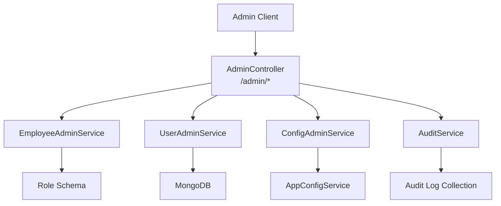
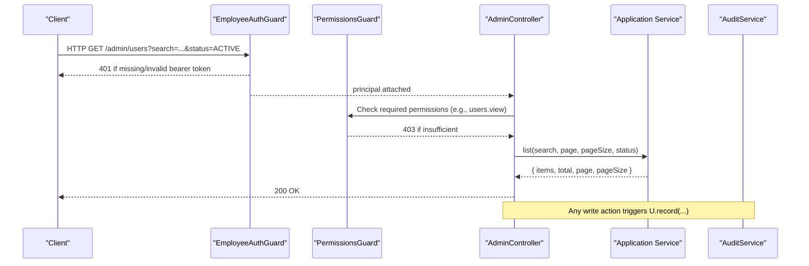
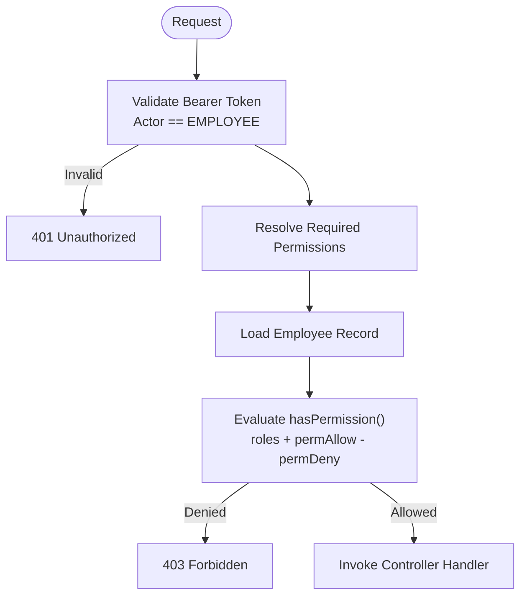
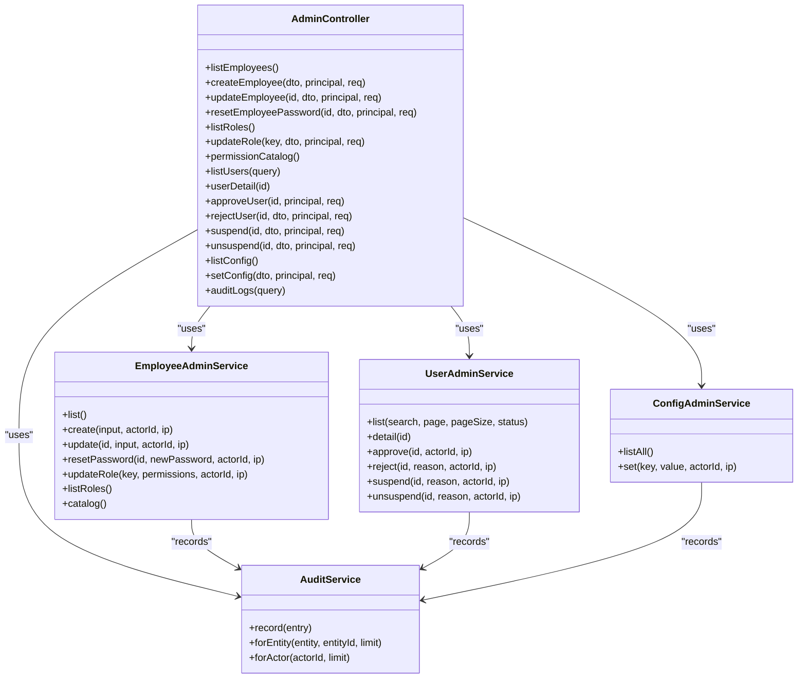

# Admin & Management APIs

<cite>
**Referenced Files in This Document**
- [admin.controller.ts](file://backend/apps/api/src/modules/admin/presentation/admin.controller.ts)
- [user-admin.service.ts](file://backend/apps/api/src/modules/admin/application/user-admin.service.ts)
- [employee-admin.service.ts](file://backend/apps/api/src/modules/admin/application/employee-admin.service.ts)
- [config-admin.service.ts](file://backend/apps/api/src/modules/admin/application/config-admin.service.ts)
- [admin.dtos.ts](file://backend/apps/api/src/modules/admin/presentation/dto/admin.dtos.ts)
- [permissions.ts](file://backend/apps/api/src/modules/admin/domain/permissions.ts)
- [permissions.guard.ts](file://backend/apps/api/src/modules/admin/presentation/permissions.guard.ts)
- [jwt-auth.guard.ts](file://backend/apps/api/src/modules/auth/presentation/jwt-auth.guard.ts)
- [audit.service.ts](file://backend/libs/shared/src/audit/audit.service.ts)
- [audit-log.schema.ts](file://backend/libs/shared/src/audit/audit-log.schema.ts)
- [role.schema.ts](file://backend/apps/api/src/modules/admin/infrastructure/role.schema.ts)
- [app-config.service.ts](file://backend/libs/shared/src/config/app-config.service.ts)
- [config-keys.ts](file://backend/libs/shared/src/config/config-keys.ts)
- [health.controller.ts](file://backend/libs/shared/src/health/health.controller.ts)
</cite>

## Table of Contents
1. Introduction
2. Project Structure
3. Core Components
4. Architecture Overview
5. Detailed Component Analysis
6. Dependency Analysis
7. Performance Considerations
8. Troubleshooting Guide
9. Conclusion

## Introduction
This document provides comprehensive API documentation for administrative and management endpoints exposed by the platform’s admin module. It covers:
- User management (list, detail, approve/reject, suspend/unsuspend)
- Employee administration (create, update, password reset, roles, permissions catalog)
- System configuration (view and set business config keys)
- Audit logging (query audit logs by entity or actor)
- Monitoring (health endpoint)

It also documents role-based access control (RBAC), permission validation, security measures for administrative access, and audit trail requirements. Request/response schemas are provided for all admin operations.

## Project Structure
The admin functionality is implemented as a NestJS module with clear separation between presentation (controllers), application services, domain logic, and infrastructure. Key files include:
- Controller exposing REST endpoints under /admin
- Application services handling user, employee, and config operations
- RBAC guard enforcing fine-grained permissions
- Audit service recording immutable audit entries
- Health controller providing liveness/readiness checks

**Diagram sources**
- [admin.controller.ts:30-170](file://backend/apps/api/src/modules/admin/presentation/admin.controller.ts#L30-L170)
- [employee-admin.service.ts:27-125](file://backend/apps/api/src/modules/admin/application/employee-admin.service.ts#L27-L125)
- [user-admin.service.ts:14-148](file://backend/apps/api/src/modules/admin/application/user-admin.service.ts#L14-L148)
- [config-admin.service.ts:5-38](file://backend/apps/api/src/modules/admin/application/config-admin.service.ts#L5-L38)
- [audit.service.ts:23-45](file://backend/libs/shared/src/audit/audit.service.ts#L23-L45)
- [role.schema.ts:4-22](file://backend/apps/api/src/modules/admin/infrastructure/role.schema.ts#L4-L22)
- [app-config.service.ts:18-88](file://backend/libs/shared/src/config/app-config.service.ts#L18-L88)

**Section sources**
- [admin.controller.ts:30-170](file://backend/apps/api/src/modules/admin/presentation/admin.controller.ts#L30-L170)
- [health.controller.ts:19-55](file://backend/libs/shared/src/health/health.controller.ts#L19-L55)

## Core Components
- AdminController: Exposes protected endpoints for employees, users, roles, config, and audit logs. All endpoints require an authenticated employee token and specific permissions.
- EmployeeAdminService: Manages employee lifecycle, roles, and permissions; validates roles and permissions against known catalogs.
- UserAdminService: Provides user listing, detailed view, approval/rejection workflows, and suspension/unsuspension with session invalidation on suspend.
- ConfigAdminService: Lists available configuration keys and updates values with schema validation and audit logging.
- PermissionsGuard + RequirePermissions decorator: Enforces RBAC at runtime using live employee data and role cache.
- AuditService: Immutable audit log writer and reader; never throws to avoid impacting business operations.
- HealthController: Liveness/readiness endpoint that checks MongoDB and Redis connectivity.

**Section sources**
- [admin.controller.ts:30-170](file://backend/apps/api/src/modules/admin/presentation/admin.controller.ts#L30-L170)
- [employee-admin.service.ts:27-125](file://backend/apps/api/src/modules/admin/application/employee-admin.service.ts#L27-L125)
- [user-admin.service.ts:14-148](file://backend/apps/api/src/modules/admin/application/user-admin.service.ts#L14-L148)
- [config-admin.service.ts:5-38](file://backend/apps/api/src/modules/admin/application/config-admin.service.ts#L5-L38)
- [permissions.guard.ts:18-42](file://backend/apps/api/src/modules/admin/presentation/permissions.guard.ts#L18-L42)
- [audit.service.ts:23-45](file://backend/libs/shared/src/audit/audit.service.ts#L23-L45)
- [health.controller.ts:19-55](file://backend/libs/shared/src/health/health.controller.ts#L19-L55)

## Architecture Overview
Administrative requests flow through authentication and authorization guards before reaching controllers and services. The system enforces RBAC via a permission catalog and per-user allow/deny overrides. All sensitive actions are recorded in an immutable audit log. Configuration changes are validated against registered schemas and broadcast across instances.

**Diagram sources**
- [jwt-auth.guard.ts:10-34](file://backend/apps/api/src/modules/auth/presentation/jwt-auth.guard.ts#L10-L34)
- [permissions.guard.ts:18-42](file://backend/apps/api/src/modules/admin/presentation/permissions.guard.ts#L18-L42)
- [admin.controller.ts:101-116](file://backend/apps/api/src/modules/admin/presentation/admin.controller.ts#L101-L116)
- [user-admin.service.ts:22-39](file://backend/apps/api/src/modules/admin/application/user-admin.service.ts#L22-L39)
- [audit.service.ts:29-43](file://backend/libs/shared/src/audit/audit.service.ts#L29-L43)

## Detailed Component Analysis

### Authentication and Authorization
- Bearer JWT required for all admin endpoints. Token must be valid and issued for the EMPLOYEE actor.
- PermissionsGuard enforces per-endpoint permissions declared via RequirePermissions decorator.
- Permission evaluation uses:
  - Role grants from the role cache
  - Per-user permAllow and permDeny overrides
  - Deny wins over any grant, including wildcard '*'

**Diagram sources**
- [jwt-auth.guard.ts:10-34](file://backend/apps/api/src/modules/auth/presentation/jwt-auth.guard.ts#L10-L34)
- [permissions.guard.ts:18-42](file://backend/apps/api/src/modules/admin/presentation/permissions.guard.ts#L18-L42)
- [permissions.ts:48-64](file://backend/apps/api/src/modules/admin/domain/permissions.ts#L48-L64)

**Section sources**
- [jwt-auth.guard.ts:10-34](file://backend/apps/api/src/modules/auth/presentation/jwt-auth.guard.ts#L10-L34)
- [permissions.guard.ts:18-42](file://backend/apps/api/src/modules/admin/presentation/permissions.guard.ts#L18-L42)
- [permissions.ts:5-64](file://backend/apps/api/src/modules/admin/domain/permissions.ts#L5-L64)

### Employee Administration
Endpoints:
- GET /admin/employees — List employees (requires employees.view)
- POST /admin/employees — Create employee (requires employees.manage)
- PATCH /admin/employees/:id — Update employee (requires employees.manage)
- POST /admin/employees/:id/reset-password — Reset employee password (requires employees.manage)
- GET /admin/roles — List roles (requires employees.view)
- PUT /admin/roles/:key — Update role permissions (requires roles.manage)
- GET /admin/permissions — Permission catalog (requires employees.view)

Request/Response Schemas:
- CreateEmployeeDto
  - email: string (email format)
  - name: string (length 2–100)
  - password: string (12–72 chars, upper, lower, digit)
  - roles: string[] (non-empty)
- UpdateEmployeeDto
  - name?: string (length 2–100)
  - roles?: string[]
  - permAllow?: string[]
  - permDeny?: string[]
  - status?: 'ACTIVE' | 'DISABLED'
- ResetEmployeePasswordDto
  - password: string (same rules as above)
- UpdateRoleDto
  - permissions: string[] (must exist in PERMISSIONS catalog)

Behavior:
- Duplicate email check on create
- Role existence validation
- Permission validation against catalog
- Self-lockout prevention when modifying own account
- Audit logging for create/update/password reset/role update

Example flows:
- Create employee: Validate DTO → validate roles → hash password → persist → record audit → return id
- Update role: Load role → validate permissions → update → refresh role cache → record audit

**Section sources**
- [admin.controller.ts:42-97](file://backend/apps/api/src/modules/admin/presentation/admin.controller.ts#L42-L97)
- [employee-admin.service.ts:36-125](file://backend/apps/api/src/modules/admin/application/employee-admin.service.ts#L36-L125)
- [admin.dtos.ts:9-48](file://backend/apps/api/src/modules/admin/presentation/dto/admin.dtos.ts#L9-L48)
- [permissions.ts:5-40](file://backend/apps/api/src/modules/admin/domain/permissions.ts#L5-L40)

### User Management
Endpoints:
- GET /admin/users — List users with search, pagination, and optional status filter (requires users.view)
- GET /admin/users/:id — Get user detail including active sessions and recent logins (requires users.view)
- POST /admin/users/:id/approve — Approve pending user (requires users.approve)
- POST /admin/users/:id/reject — Reject pending user with reason (requires users.approve)
- POST /admin/users/:id/suspend — Suspend user and revoke sessions (requires users.suspend)
- POST /admin/users/:id/unsuspend — Unsuspend user restoring appropriate status (requires users.suspend)

Query Parameters for /admin/users:
- search?: string (substring match across email, usernameLower, mobile, name)
- status?: enum ['PENDING_MOBILE','PENDING_EMAIL','PENDING_APPROVAL','ACTIVE','SUSPENDED','REJECTED']
- page?: number (min 1)
- pageSize?: number (min 1, max 100)

Request/Response Schemas:
- UserListQueryDto
  - search?: string (length 1–100)
  - status?: enum above
  - page?: number (>=1)
  - pageSize?: number (1–100)
- SuspendUserDto
  - reason: string (length 5–500)
- RejectUserDto
  - reason: string (length 5–500)

Behavior:
- Pagination with sort by createdAt descending
- Detail aggregates active sessions count and recent login history
- Approve/reject transitions enforced by current status
- Suspend sets status to SUSPENDED and revokes active sessions
- Unsuspend restores to ACTIVE or pending state based on verification flags
- All mutations record audit entries with before/after snapshots

Example flows:
- Approve user: Validate status → update to ACTIVE with approvedAt/approvedBy → record audit
- Suspend user: Set status to SUSPENDED → revoke sessions → record audit

**Section sources**
- [admin.controller.ts:101-145](file://backend/apps/api/src/modules/admin/presentation/admin.controller.ts#L101-L145)
- [user-admin.service.ts:22-148](file://backend/apps/api/src/modules/admin/application/user-admin.service.ts#L22-L148)
- [admin.dtos.ts:50-73](file://backend/apps/api/src/modules/admin/presentation/dto/admin.dtos.ts#L50-L73)

### System Configuration
Endpoints:
- GET /admin/config — List all configurable keys with descriptions, defaults, and current values (requires config.manage)
- PUT /admin/config — Set a configuration value (requires config.manage)

Request/Response Schemas:
- SetConfigDto
  - key: string (length 3–100)
  - value: unknown (validated against the key’s Zod schema)

Behavior:
- Only keys present in CONFIG_REGISTRY can be set
- Values are validated using the registered schema; invalid values return error
- Changes are persisted and broadcast to other instances via Redis pub/sub
- Audit entry records before/after values

Example flows:
- Set config: Validate key exists → parse and validate value → persist → publish invalidation → record audit

**Section sources**
- [admin.controller.ts:149-159](file://backend/apps/api/src/modules/admin/presentation/admin.controller.ts#L149-L159)
- [config-admin.service.ts:12-38](file://backend/apps/api/src/modules/admin/application/config-admin.service.ts#L12-L38)
- [config-keys.ts:9-107](file://backend/libs/shared/src/config/config-keys.ts#L9-L107)
- [app-config.service.ts:40-88](file://backend/libs/shared/src/config/app-config.service.ts#L40-L88)

### Audit Logging
Endpoint:
- GET /admin/audit-logs — Query audit logs by entity+entityId or actorId (requires audit.view)

Query Parameters:
- entity?: string (required with entityId)
- entityId?: string (required with entity)
- actorId?: string (alternative query)

Behavior:
- Must provide either entity+entityId or actorId
- Returns up to 100 most recent entries sorted by timestamp descending
- Entries are immutable; no update/delete paths exist in code

Example flows:
- Query by entity: Validate params → fetch by entity and entityId → return array
- Query by actor: Validate params → fetch by actorId → return array

**Section sources**
- [admin.controller.ts:163-169](file://backend/apps/api/src/modules/admin/presentation/admin.controller.ts#L163-L169)
- [audit.service.ts:29-43](file://backend/libs/shared/src/audit/audit.service.ts#L29-L43)
- [audit-log.schema.ts:6-41](file://backend/libs/shared/src/audit/audit-log.schema.ts#L6-L41)

### Monitoring
Endpoint:
- GET /health — Liveness/readiness check returning status, uptime, and dependency health

Behavior:
- Returns 200 with status ok only if both MongoDB and Redis respond
- Returns 503 with details if dependencies are down

Example response fields:
- status: 'ok'
- uptimeSec: number
- mongo: 'up'
- redis: 'up'

**Section sources**
- [health.controller.ts:19-55](file://backend/libs/shared/src/health/health.controller.ts#L19-L55)

## Dependency Analysis
Key relationships:
- AdminController depends on EmployeeAdminService, UserAdminService, ConfigAdminService, and AuditService
- EmployeeAdminService depends on Role schema and PasswordService; interacts with RoleCacheService
- UserAdminService depends on User, Session, LoginHistory schemas and AuditService
- ConfigAdminService depends on AppConfigService and AuditService
- PermissionsGuard depends on RoleCacheService and Employee schema
- AuditService writes to AuditLog collection

**Diagram sources**
- [admin.controller.ts:30-170](file://backend/apps/api/src/modules/admin/presentation/admin.controller.ts#L30-L170)
- [employee-admin.service.ts:27-125](file://backend/apps/api/src/modules/admin/application/employee-admin.service.ts#L27-L125)
- [user-admin.service.ts:14-148](file://backend/apps/api/src/modules/admin/application/user-admin.service.ts#L14-L148)
- [config-admin.service.ts:5-38](file://backend/apps/api/src/modules/admin/application/config-admin.service.ts#L5-L38)
- [audit.service.ts:23-45](file://backend/libs/shared/src/audit/audit.service.ts#L23-L45)

**Section sources**
- [admin.controller.ts:30-170](file://backend/apps/api/src/modules/admin/presentation/admin.controller.ts#L30-L170)
- [employee-admin.service.ts:27-125](file://backend/apps/api/src/modules/admin/application/employee-admin.service.ts#L27-L125)
- [user-admin.service.ts:14-148](file://backend/apps/api/src/modules/admin/application/user-admin.service.ts#L14-L148)
- [config-admin.service.ts:5-38](file://backend/apps/api/src/modules/admin/application/config-admin.service.ts#L5-L38)
- [audit.service.ts:23-45](file://backend/libs/shared/src/audit/audit.service.ts#L23-L45)

## Performance Considerations
- User listing uses parallel queries for items and total count to reduce latency.
- Suspensions invalidate sessions in bulk to prevent continued access.
- Configuration reads are synchronous after boot due to in-memory cache; writes trigger Redis pub/sub for cross-instance invalidation.
- Audit writes are fire-and-forget wrapped in try/catch to avoid impacting business operations.

[No sources needed since this section provides general guidance]

## Troubleshooting Guide
Common issues and resolutions:
- 401 Unauthorized: Missing or invalid bearer token; ensure token is present and valid for EMPLOYEE actor.
- 403 Forbidden: Insufficient permissions; verify employee roles and permAllow/permDeny overrides.
- 400 Bad Request: Invalid query parameters for audit logs; provide either entity+entityId or actorId.
- 409 Conflict: Duplicate employee email; choose a different email.
- 422 Unprocessable Entity: Validation errors in DTOs; correct field formats and constraints.
- 503 Service Unavailable: Health endpoint indicates dependencies down; check MongoDB and Redis connectivity.

Operational tips:
- Use /health to monitor system readiness.
- Use /admin/audit-logs to investigate who performed actions and what changed.
- For user suspensions, confirm sessions were revoked and status updated.
- For configuration changes, verify schema compliance and broadcast propagation.

**Section sources**
- [admin.controller.ts:17-28](file://backend/apps/api/src/modules/admin/presentation/admin.controller.ts#L17-L28)
- [admin.controller.ts:163-169](file://backend/apps/api/src/modules/admin/presentation/admin.controller.ts#L163-L169)
- [health.controller.ts:26-35](file://backend/libs/shared/src/health/health.controller.ts#L26-L35)
- [audit.service.ts:29-35](file://backend/libs/shared/src/audit/audit.service.ts#L29-L35)

## Conclusion
The admin module provides secure, auditable, and well-structured endpoints for managing users, employees, roles, permissions, and system configuration. RBAC ensures least-privilege access, while immutable audit logs support compliance and troubleshooting. The health endpoint enables operational monitoring. Following the documented request/response schemas and permission requirements will ensure reliable integration with the admin APIs.

[No sources needed since this section summarizes without analyzing specific files]