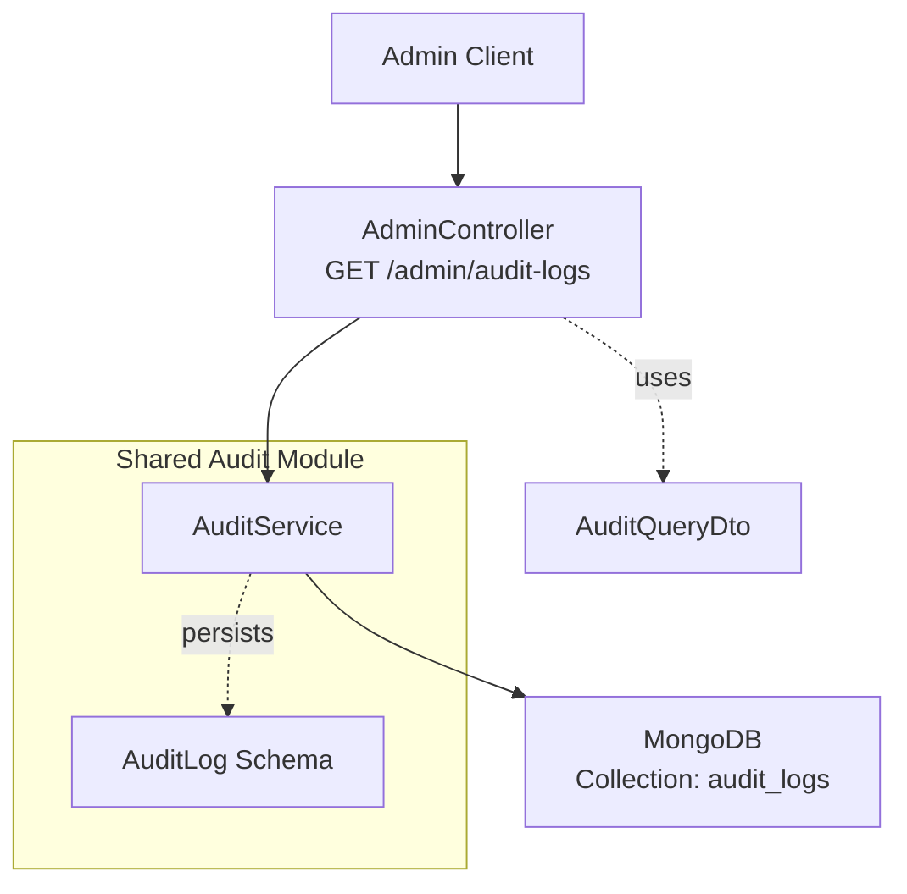
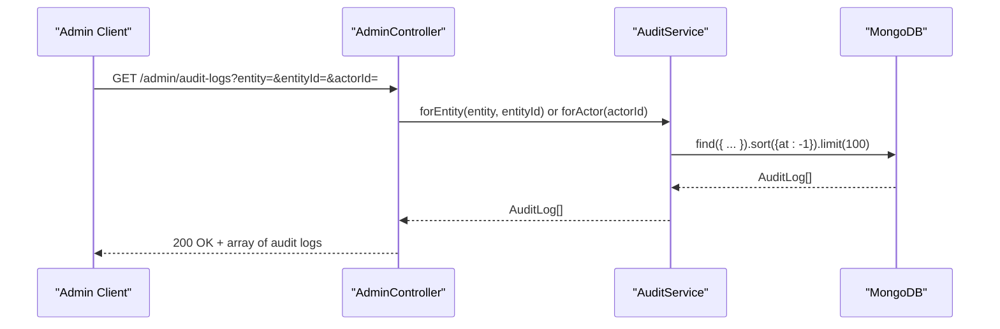
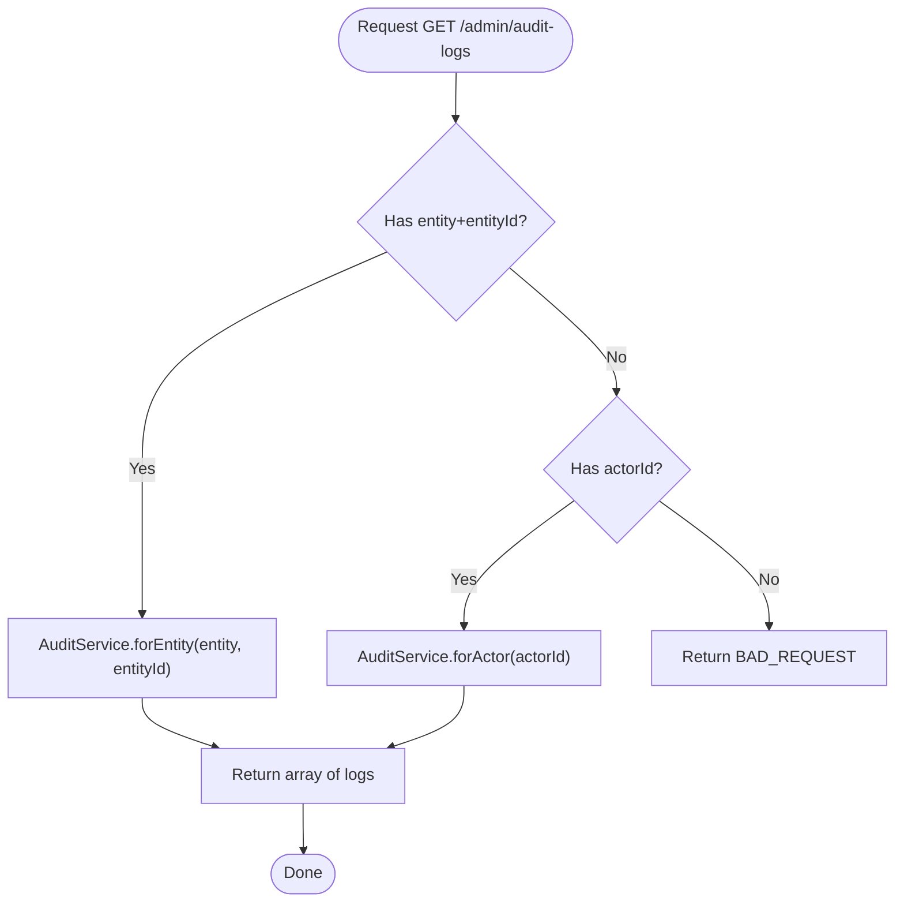
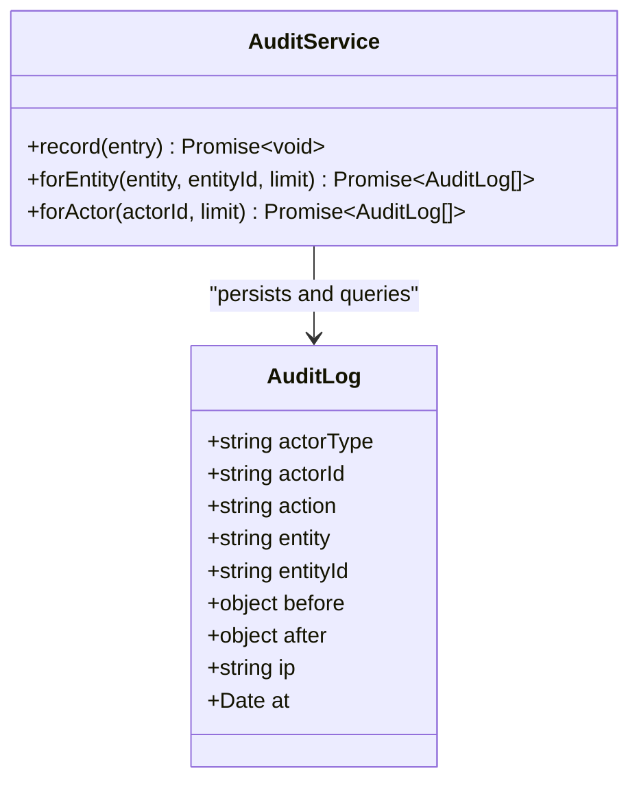
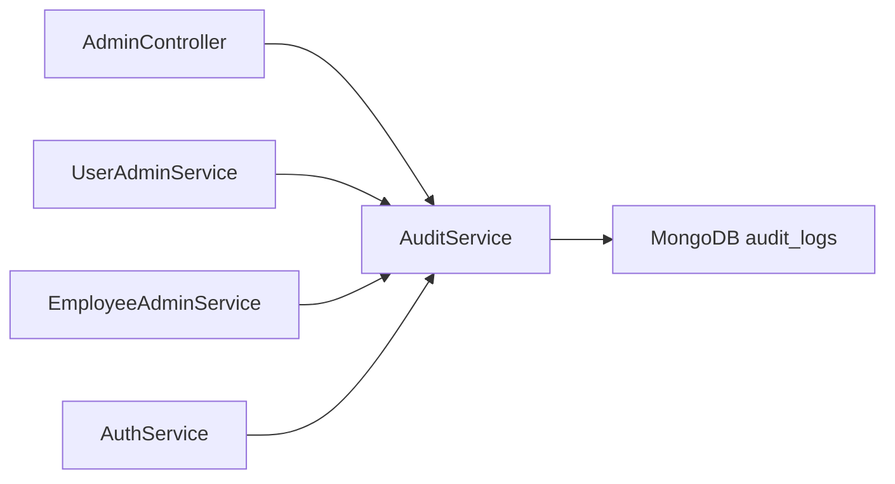

# Audit Logging

<cite>
**Referenced Files in This Document**
- [admin.controller.ts](file://backend/apps/api/src/modules/admin/presentation/admin.controller.ts)
- [admin.dtos.ts](file://backend/apps/api/src/modules/admin/presentation/dto/admin.dtos.ts)
- [audit.service.ts](file://backend/libs/shared/src/audit/audit.service.ts)
- [audit-log.schema.ts](file://backend/libs/shared/src/audit/audit-log.schema.ts)
- [audit.module.ts](file://backend/libs/shared/src/audit/audit.module.ts)
- [user-admin.service.ts](file://backend/apps/api/src/modules/admin/application/user-admin.service.ts)
- [employee-admin.service.ts](file://backend/apps/api/src/modules/admin/application/employee-admin.service.ts)
- [auth.service.ts](file://backend/apps/api/src/modules/auth/application/auth.service.ts)
</cite>

## Table of Contents
1. [Introduction](#introduction)
2. [Project Structure](#project-structure)
3. [Core Components](#core-components)
4. [Architecture Overview](#architecture-overview)
5. [Detailed Component Analysis](#detailed-component-analysis)
6. [Dependency Analysis](#dependency-analysis)
7. [Performance Considerations](#performance-considerations)
8. [Troubleshooting Guide](#troubleshooting-guide)
9. [Conclusion](#conclusion)
10. [Appendices](#appendices)

## Introduction
This document provides detailed API documentation for the audit logging system, focusing on querying capabilities via AuditQueryDto and the underlying audit trail design. It explains how to investigate user actions, administrative changes, and compliance events using entity type, entity ID, and actor ID filters. It also covers log entry structure, data retention considerations, query patterns, performance implications for large datasets, and indexing strategies.

## Project Structure
The audit feature is implemented as a shared module and exposed through the admin API:
- Shared audit module defines the immutable audit log schema and service methods for recording and querying logs.
- Admin controller exposes a single GET endpoint to retrieve audit logs with filtering parameters.
- Domain services across modules (users, employees, auth) record audit entries for key business events.

**Diagram sources**
- [admin.controller.ts:161-169](file://backend/apps/api/src/modules/admin/presentation/admin.controller.ts#L161-L169)
- [admin.dtos.ts:83-92](file://backend/apps/api/src/modules/admin/presentation/dto/admin.dtos.ts#L83-L92)
- [audit.service.ts:29-43](file://backend/libs/shared/src/audit/audit.service.ts#L29-L43)
- [audit-log.schema.ts:7-40](file://backend/libs/shared/src/audit/audit-log.schema.ts#L7-L40)

**Section sources**
- [admin.controller.ts:161-169](file://backend/apps/api/src/modules/admin/presentation/admin.controller.ts#L161-L169)
- [admin.dtos.ts:83-92](file://backend/apps/api/src/modules/admin/presentation/dto/admin.dtos.ts#L83-L92)
- [audit.service.ts:29-43](file://backend/libs/shared/src/audit/audit.service.ts#L29-L43)
- [audit-log.schema.ts:7-40](file://backend/libs/shared/src/audit/audit-log.schema.ts#L7-L40)

## Core Components
- AuditLog schema: Immutable audit record stored in MongoDB collection audit_logs with fields for actor type, actor ID, action, entity, entityId, before/after snapshots, IP, and timestamp at. Includes indexes for efficient queries by entity+entityId, actorId, and time.
- AuditService: Provides write-once recording and read-only queries for entity-scoped or actor-scoped logs. Record failures are logged but do not abort business operations.
- AdminController: Exposes GET /admin/audit-logs protected by permissions and requires either entity+entityId or actorId query parameters.
- AuditQueryDto: Query DTO supporting optional filters for entity, entityId, and actorId.

Key responsibilities:
- Recording immutable audit entries from domain services.
- Providing filtered retrieval for investigation and reporting.
- Enforcing access control via permissions.

**Section sources**
- [audit-log.schema.ts:7-40](file://backend/libs/shared/src/audit/audit-log.schema.ts#L7-L40)
- [audit.service.ts:29-43](file://backend/libs/shared/src/audit/audit.service.ts#L29-L43)
- [admin.controller.ts:161-169](file://backend/apps/api/src/modules/admin/presentation/admin.controller.ts#L161-L169)
- [admin.dtos.ts:83-92](file://backend/apps/api/src/modules/admin/presentation/dto/admin.dtos.ts#L83-L92)

## Architecture Overview
The audit system follows a write-once, append-only model:
- Domain services call AuditService.record() to persist immutable entries.
- The admin API retrieves logs via AuditService.forEntity() or AuditService.forActor().
- MongoDB indexes support fast lookups by entity+entityId and actorId, sorted by time descending.

**Diagram sources**
- [admin.controller.ts:161-169](file://backend/apps/api/src/modules/admin/presentation/admin.controller.ts#L161-L169)
- [audit.service.ts:37-43](file://backend/libs/shared/src/audit/audit.service.ts#L37-L43)
- [audit-log.schema.ts:37-40](file://backend/libs/shared/src/audit/audit-log.schema.ts#L37-L40)

## Detailed Component Analysis

### API Endpoint: GET /admin/audit-logs
- Purpose: Retrieve audit logs filtered by entity context or actor.
- Authorization: Requires permission audit.view.
- Query parameters (AuditQueryDto):
  - entity: Optional string (length 1–60). Used with entityId to scope logs.
  - entityId: Optional string (length 1–60). Required when entity is provided.
  - actorId: Optional string (length 1–60). Alternative filter to scope logs by actor.
- Validation rules:
  - Must provide either (entity AND entityId) OR actorId; otherwise returns BAD_REQUEST.
- Response: Array of audit log entries sorted by time descending, limited to default page size.

**Diagram sources**
- [admin.controller.ts:161-169](file://backend/apps/api/src/modules/admin/presentation/admin.controller.ts#L161-L169)
- [admin.dtos.ts:83-92](file://backend/apps/api/src/modules/admin/presentation/dto/admin.dtos.ts#L83-L92)
- [audit.service.ts:37-43](file://backend/libs/shared/src/audit/audit.service.ts#L37-L43)

**Section sources**
- [admin.controller.ts:161-169](file://backend/apps/api/src/modules/admin/presentation/admin.controller.ts#L161-L169)
- [admin.dtos.ts:83-92](file://backend/apps/api/src/modules/admin/presentation/dto/admin.dtos.ts#L83-L92)

### Audit Log Entry Model
- Collection: audit_logs
- Fields:
  - actorType: Enum USER | EMPLOYEE | SYSTEM
  - actorId: Indexed string identifying the actor
  - action: String describing the event
  - entity: String naming the affected domain entity
  - entityId: Identifier of the specific entity instance
  - before?: Object snapshot of state prior to change
  - after?: Object snapshot of state after change
  - ip?: Optional client IP address
  - at: Timestamp created automatically
- Indexes:
  - { entity: 1, entityId: 1, at: -1 }
  - { actorId: 1, at: -1 }
  - { at: -1 }

These indexes enable efficient filtering and sorting for common query patterns.

**Section sources**
- [audit-log.schema.ts:7-40](file://backend/libs/shared/src/audit/audit-log.schema.ts#L7-L40)

### Audit Service Behavior
- record(entry): Creates an immutable audit entry. Failures are caught and logged; they do not throw to avoid disrupting business flows.
- forEntity(entity, entityId, limit = 100): Returns recent logs for a given entity scope, sorted by time descending.
- forActor(actorId, limit = 100): Returns recent logs for a given actor, sorted by time descending.

**Diagram sources**
- [audit.service.ts:29-43](file://backend/libs/shared/src/audit/audit.service.ts#L29-L43)
- [audit-log.schema.ts:7-34](file://backend/libs/shared/src/audit/audit-log.schema.ts#L7-L34)

**Section sources**
- [audit.service.ts:29-43](file://backend/libs/shared/src/audit/audit.service.ts#L29-L43)

### Usage Patterns Across Modules
- User administration: Records approvals, rejections, suspensions, unsuspensions with before/after status snapshots.
- Employee administration: Records creation, updates, password resets, role permission changes with before/after details.
- Authentication: Records user registration and security-sensitive session events such as family revocation due to reuse.

Examples of recorded events include:
- USER_APPROVED, USER_REJECTED, USER_SUSPENDED, USER_UNSUSPENDED
- EMPLOYEE_CREATED, EMPLOYEE_UPDATED, EMPLOYEE_PASSWORD_RESET, ROLE_UPDATED
- USER_REGISTERED, SESSION_FAMILY_REVOKED_REUSE

These entries provide a comprehensive trail for investigating user actions, administrative changes, and compliance scenarios.

**Section sources**
- [user-admin.service.ts:70-146](file://backend/apps/api/src/modules/admin/application/user-admin.service.ts#L70-L146)
- [employee-admin.service.ts:53-107](file://backend/apps/api/src/modules/admin/application/employee-admin.service.ts#L53-L107)
- [auth.service.ts:71-78](file://backend/apps/api/src/modules/auth/application/auth.service.ts#L71-L78)
- [auth.service.ts:200-207](file://backend/apps/api/src/modules/auth/application/auth.service.ts#L200-L207)

## Dependency Analysis
- AdminController depends on AuditService for reading logs and enforces permissions via RequirePermissions('audit.view').
- AuditModule is global and exports AuditService, making it available across modules.
- Domain services inject AuditService to record immutable audit entries.
- MongoDB indexes align with query patterns used by AuditService methods.

**Diagram sources**
- [admin.controller.ts:161-169](file://backend/apps/api/src/modules/admin/presentation/admin.controller.ts#L161-L169)
- [audit.module.ts:6-11](file://backend/libs/shared/src/audit/audit.module.ts#L6-L11)
- [audit.service.ts:29-43](file://backend/libs/shared/src/audit/audit.service.ts#L29-L43)

**Section sources**
- [audit.module.ts:6-11](file://backend/libs/shared/src/audit/audit.module.ts#L6-L11)
- [admin.controller.ts:161-169](file://backend/apps/api/src/modules/admin/presentation/admin.controller.ts#L161-L169)

## Performance Considerations
- Default pagination: Queries return up to 100 entries per call. For large datasets, use targeted filters (entity+entityId or actorId) to minimize result sets.
- Index utilization:
  - Entity-scoped queries leverage { entity: 1, entityId: 1, at: -1 }.
  - Actor-scoped queries leverage { actorId: 1, at: -1 }.
  - Time-based scans benefit from { at: -1 }.
- Sorting: Results are sorted by at descending, which uses index order for efficient retrieval.
- Write resilience: Audit writes never throw; failures are logged, ensuring business operations remain unaffected even if audit persistence fails.

Recommendations:
- Always specify either entity+entityId or actorId to avoid broad scans.
- Combine with downstream application-level pagination if you need more than 100 records.
- Monitor MongoDB query plans to ensure indexes are used for your typical filters.

[No sources needed since this section provides general guidance]

## Troubleshooting Guide
Common issues and resolutions:
- BAD_REQUEST on GET /admin/audit-logs: Ensure you provide either (entity AND entityId) or actorId. Missing required filters will cause a bad request error.
- Empty results: Verify that the entity/entityId or actorId exists in the audit logs. Use broader filters temporarily to confirm data presence.
- Slow queries: Confirm that your filters match indexed fields (entity+entityId or actorId). Avoid unindexed wildcard searches.
- Missing audit entries: AuditService.record() catches errors and logs them without throwing. Check application logs for “AUDIT WRITE FAILED” messages to diagnose persistence issues.

Operational tips:
- Use actorId to trace all actions by a specific employee or system process.
- Use entity+entityId to reconstruct the full history of a specific resource.
- Inspect before/after fields to understand what changed during an operation.

**Section sources**
- [admin.controller.ts:161-169](file://backend/apps/api/src/modules/admin/presentation/admin.controller.ts#L161-L169)
- [audit.service.ts:29-35](file://backend/libs/shared/src/audit/audit.service.ts#L29-L35)

## Conclusion
The audit logging system provides an immutable, indexed trail of critical actions across the platform. The admin API supports targeted queries by entity context or actor, enabling efficient investigation and compliance reporting. With robust indexing and resilient write behavior, the system scales well for large datasets while preserving operational continuity.

[No sources needed since this section summarizes without analyzing specific files]

## Appendices

### API Reference: GET /admin/audit-logs
- Path: /admin/audit-logs
- Method: GET
- Authorization: Requires permission audit.view
- Query parameters:
  - entity: Optional string (1–60 chars)
  - entityId: Optional string (1–60 chars); required when entity is provided
  - actorId: Optional string (1–60 chars); alternative filter to entity+entityId
- Validation:
  - If neither (entity AND entityId) nor actorId is provided, returns BAD_REQUEST.
- Response:
  - Array of audit log entries sorted by at descending, limited to 100 per request.

Example usage patterns:
- Track user modifications:
  - Provide entity=user and entityId=<userId> to get the complete history of a user’s lifecycle events.
- Monitor administrative actions:
  - Provide actorId=<employeeId> to see all actions performed by a specific administrator.
- Generate compliance reports:
  - Combine entity+entityId for high-risk resources (e.g., roles, configurations) and export results for auditing.

**Section sources**
- [admin.controller.ts:161-169](file://backend/apps/api/src/modules/admin/presentation/admin.controller.ts#L161-L169)
- [admin.dtos.ts:83-92](file://backend/apps/api/src/modules/admin/presentation/dto/admin.dtos.ts#L83-L92)
- [audit.service.ts:37-43](file://backend/libs/shared/src/audit/audit.service.ts#L37-L43)

### Data Retention Policies
- Current implementation does not define automatic deletion or expiration policies for audit_logs.
- As audit logs are immutable and may grow over time, consider implementing a retention strategy (e.g., archival, partitioning, or cleanup jobs) aligned with compliance requirements.
- Monitor storage growth and query performance as the dataset expands.

[No sources needed since this section provides general guidance]