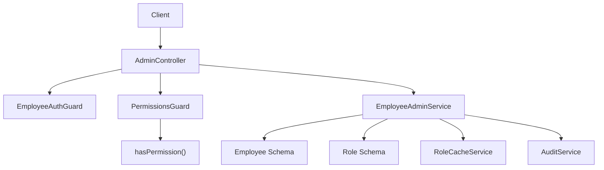
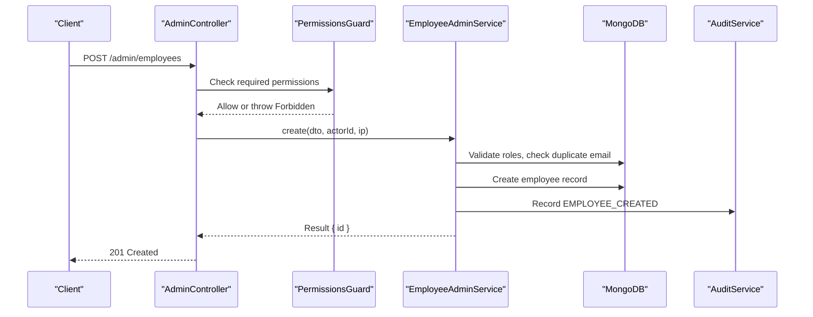
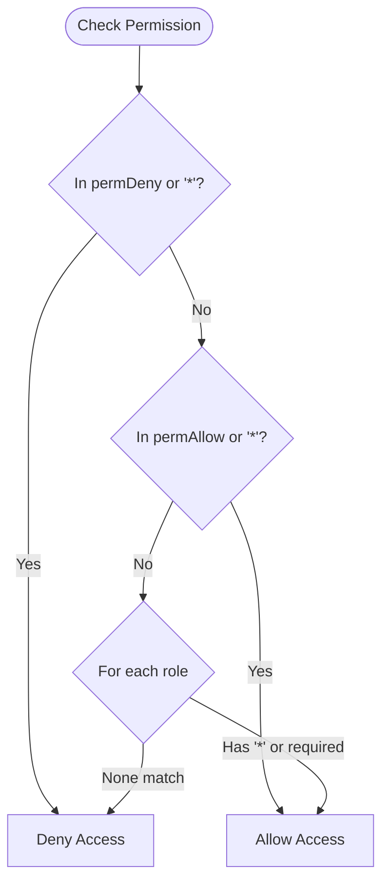
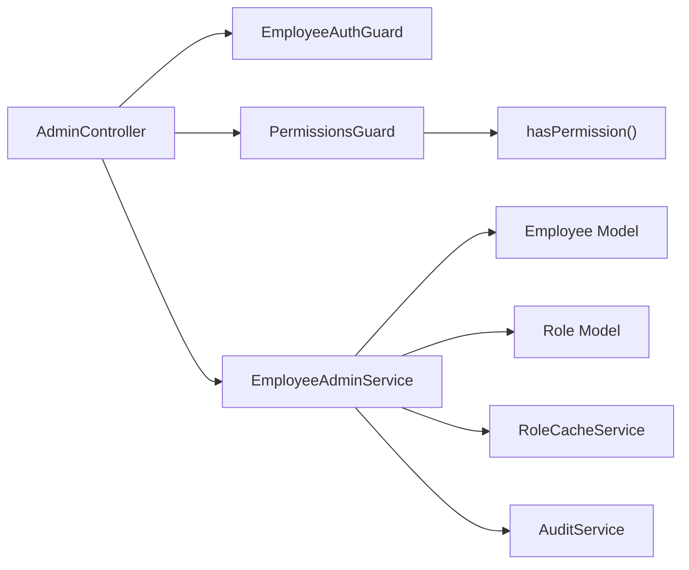

# Employee Management

<cite>
**Referenced Files in This Document**
- [admin.controller.ts](file://backend/apps/api/src/modules/admin/presentation/admin.controller.ts)
- [admin.dtos.ts](file://backend/apps/api/src/modules/admin/presentation/dto/admin.dtos.ts)
- [employee-admin.service.ts](file://backend/apps/api/src/modules/admin/application/employee-admin.service.ts)
- [permissions.ts](file://backend/apps/api/src/modules/admin/domain/permissions.ts)
- [permissions.guard.ts](file://backend/apps/api/src/modules/admin/presentation/permissions.guard.ts)
- [role.schema.ts](file://backend/apps/api/src/modules/admin/infrastructure/role.schema.ts)
- [employee.schema.ts](file://backend/apps/api/src/modules/auth/infrastructure/schemas/employee.schema.ts)
- [auth.types.ts](file://backend/apps/api/src/modules/auth/domain/auth.types.ts)
</cite>

## Table of Contents
1. [Introduction](#introduction)
2. [Project Structure](#project-structure)
3. [Core Components](#core-components)
4. [Architecture Overview](#architecture-overview)
5. [Detailed Component Analysis](#detailed-component-analysis)
6. [Dependency Analysis](#dependency-analysis)
7. [Performance Considerations](#performance-considerations)
8. [Troubleshooting Guide](#troubleshooting-guide)
9. [Conclusion](#conclusion)
10. [Appendices](#appendices)

## Introduction
This document provides comprehensive API documentation for employee management endpoints, including CRUD operations and role/permission administration. It covers:
- Listing employees
- Creating new employees
- Updating employee details
- Resetting employee passwords
- Listing roles
- Updating role permissions
- Accessing the permission catalog
It also explains the RBAC system integration, required permissions (employees.view, employees.manage, roles.manage), and security measures such as authentication guards, authorization checks, input validation, and audit logging. Practical examples are included to guide common workflows like onboarding employees, modifying roles, and managing access permissions.

## Project Structure
The employee management functionality is implemented under the admin module with a layered structure:
- Presentation layer: Controllers expose HTTP endpoints and enforce authentication and authorization via guards.
- Application layer: Services implement business logic, validate inputs, interact with persistence, and record audits.
- Domain layer: Permission catalog and evaluation logic define RBAC semantics.
- Infrastructure layer: Mongoose schemas model employees and roles.

**Diagram sources**
- [admin.controller.ts:30-97](file://backend/apps/api/src/modules/admin/presentation/admin.controller.ts#L30-L97)
- [permissions.guard.ts:18-41](file://backend/apps/api/src/modules/admin/presentation/permissions.guard.ts#L18-L41)
- [employee-admin.service.ts:26-117](file://backend/apps/api/src/modules/admin/application/employee-admin.service.ts#L26-L117)
- [permissions.ts:52-64](file://backend/apps/api/src/modules/admin/domain/permissions.ts#L52-L64)

**Section sources**
- [admin.controller.ts:30-97](file://backend/apps/api/src/modules/admin/presentation/admin.controller.ts#L30-L97)
- [employee-admin.service.ts:26-117](file://backend/apps/api/src/modules/admin/application/employee-admin.service.ts#L26-L117)
- [permissions.guard.ts:18-41](file://backend/apps/api/src/modules/admin/presentation/permissions.guard.ts#L18-L41)
- [permissions.ts:5-26](file://backend/apps/api/src/modules/admin/domain/permissions.ts#L5-L26)

## Core Components
- AdminController: Exposes REST endpoints for employees and roles, enforces authentication and authorization, and maps DTOs to service calls.
- EmployeeAdminService: Implements business logic for listing, creating, updating, password reset, role updates, and permission catalog retrieval.
- PermissionsGuard: Enforces per-endpoint permission requirements using the domain permission evaluator and live employee data.
- Permission Catalog and Evaluator: Centralized list of permissions and logic that computes effective permissions considering roles and per-user allow/deny overrides.
- Schemas: Employee and Role models persisted in MongoDB via Mongoose.

Key responsibilities:
- Input validation via DTOs
- Authorization via guards
- Business rules enforcement in services
- Auditing of administrative actions
- Immediate effect of role/permission changes through cache refresh

**Section sources**
- [admin.controller.ts:30-97](file://backend/apps/api/src/modules/admin/presentation/admin.controller.ts#L30-L97)
- [employee-admin.service.ts:36-117](file://backend/apps/api/src/modules/admin/application/employee-admin.service.ts#L36-L117)
- [permissions.guard.ts:18-41](file://backend/apps/api/src/modules/admin/presentation/permissions.guard.ts#L18-L41)
- [permissions.ts:5-26](file://backend/apps/api/src/modules/admin/domain/permissions.ts#L5-L26)

## Architecture Overview
The API follows a layered architecture with strict separation of concerns:
- Controllers handle HTTP requests, parameter binding, and response mapping.
- Guards ensure only authenticated and authorized requests proceed.
- Services encapsulate business logic and coordinate with persistence and external services.
- Domain functions provide pure permission evaluation logic.
- Infrastructure components persist data and manage caching.

**Diagram sources**
- [admin.controller.ts:48-52](file://backend/apps/api/src/modules/admin/presentation/admin.controller.ts#L48-L52)
- [permissions.guard.ts:26-39](file://backend/apps/api/src/modules/admin/presentation/permissions.guard.ts#L26-L39)
- [employee-admin.service.ts:40-58](file://backend/apps/api/src/modules/admin/application/employee-admin.service.ts#L40-L58)

## Detailed Component Analysis

### Endpoints and Request/Response Schemas

#### List Employees
- Method: GET
- Path: /admin/employees
- Required Permission: employees.view
- Response: Array of employee summaries including email, name, roles, permAllow, permDeny, totpEnabled, status, createdAt

Notes:
- Requires authentication and the employees.view permission.
- Returns non-sensitive fields suitable for listing.

**Section sources**
- [admin.controller.ts:42-46](file://backend/apps/api/src/modules/admin/presentation/admin.controller.ts#L42-L46)
- [employee-admin.service.ts:36-38](file://backend/apps/api/src/modules/admin/application/employee-admin.service.ts#L36-L38)

#### Create Employee
- Method: POST
- Path: /admin/employees
- Required Permission: employees.manage
- Request Body: CreateEmployeeDto
- Response: Object containing created employee id

CreateEmployeeDto schema:
- email: string, valid email format
- name: string, length 2–100
- password: string, 12–72 characters, must include uppercase, lowercase, and digit
- roles: array of strings, non-empty, each element is a string

Behavior:
- Validates roles exist in the role store
- Ensures unique email
- Hashes password before storage
- Sets initial status to ACTIVE
- Records an audit log entry

**Section sources**
- [admin.controller.ts:48-52](file://backend/apps/api/src/modules/admin/presentation/admin.controller.ts#L48-L52)
- [admin.dtos.ts:9-21](file://backend/apps/api/src/modules/admin/presentation/dto/admin.dtos.ts#L9-L21)
- [employee-admin.service.ts:40-58](file://backend/apps/api/src/modules/admin/application/employee-admin.service.ts#L40-L58)

#### Update Employee
- Method: PATCH
- Path: /admin/employees/:id
- Required Permission: employees.manage
- Request Body: UpdateEmployeeDto
- Response: Boolean success indicator

UpdateEmployeeDto schema:
- name?: string, optional, length 2–100
- roles?: string[], optional, array of strings
- permAllow?: string[], optional, array of strings
- permDeny?: string[], optional, array of strings
- status?: 'ACTIVE' | 'DISABLED', optional

Behavior:
- Validates provided roles if present
- Validates permAllow/permDeny entries against the permission catalog
- Prevents self-lockout when updating own account
- Persists changes and records audit log

**Section sources**
- [admin.controller.ts:54-63](file://backend/apps/api/src/modules/admin/presentation/admin.controller.ts#L54-L63)
- [admin.dtos.ts:23-38](file://backend/apps/api/src/modules/admin/presentation/dto/admin.dtos.ts#L23-L38)
- [employee-admin.service.ts:60-81](file://backend/apps/api/src/modules/admin/application/employee-admin.service.ts#L60-L81)

#### Reset Employee Password
- Method: POST
- Path: /admin/employees/:id/reset-password
- Required Permission: employees.manage
- Request Body: ResetEmployeePasswordDto
- Response: Boolean success indicator

ResetEmployeePasswordDto schema:
- password: string, 12–72 characters, must include uppercase, lowercase, and digit

Behavior:
- Locates employee by id
- Hashes new password and saves
- Records audit log

**Section sources**
- [admin.controller.ts:65-74](file://backend/apps/api/src/modules/admin/presentation/admin.controller.ts#L65-L74)
- [admin.dtos.ts:40-43](file://backend/apps/api/src/modules/admin/presentation/dto/admin.dtos.ts#L40-L43)
- [employee-admin.service.ts:83-92](file://backend/apps/api/src/modules/admin/application/employee-admin.service.ts#L83-L92)

#### List Roles
- Method: GET
- Path: /admin/roles
- Required Permission: employees.view
- Response: Array of role objects including key, name, permissions, locked flag

**Section sources**
- [admin.controller.ts:76-80](file://backend/apps/api/src/modules/admin/presentation/admin.controller.ts#L76-L80)
- [employee-admin.service.ts:111-113](file://backend/apps/api/src/modules/admin/application/employee-admin.service.ts#L111-L113)
- [role.schema.ts:4-18](file://backend/apps/api/src/modules/admin/infrastructure/role.schema.ts#L4-L18)

#### Update Role Permissions
- Method: PUT
- Path: /admin/roles/:key
- Required Permission: roles.manage
- Request Body: UpdateRoleDto
- Response: Boolean success indicator

UpdateRoleDto schema:
- permissions: array of strings, each element is a string

Behavior:
- Finds role by key
- Prevents modification of locked roles (e.g., SUPER_ADMIN)
- Validates permissions against catalog and disallows wildcard '*'
- Persists updated permissions, refreshes role cache, and records audit log

**Section sources**
- [admin.controller.ts:82-91](file://backend/apps/api/src/modules/admin/presentation/admin.controller.ts#L82-L91)
- [admin.dtos.ts:45-48](file://backend/apps/api/src/modules/admin/presentation/dto/admin.dtos.ts#L45-L48)
- [employee-admin.service.ts:94-109](file://backend/apps/api/src/modules/admin/application/employee-admin.service.ts#L94-L109)

#### Permission Catalog
- Method: GET
- Path: /admin/permissions
- Required Permission: employees.view
- Response: Mapping of permission keys to human-readable descriptions

**Section sources**
- [admin.controller.ts:93-97](file://backend/apps/api/src/modules/admin/presentation/admin.controller.ts#L93-L97)
- [employee-admin.service.ts:115-117](file://backend/apps/api/src/modules/admin/application/employee-admin.service.ts#L115-L117)
- [permissions.ts:5-26](file://backend/apps/api/src/modules/admin/domain/permissions.ts#L5-L26)

### Data Models

#### Employee Model
Fields:
- email: unique, lowercased, trimmed
- name: trimmed
- passwordHash: stored securely, not selected by default
- roles: array of role keys
- permAllow: array of explicit allow permissions
- permDeny: array of explicit deny permissions
- totpEnabled: boolean
- totpSecretEnc: encrypted TOTP secret, not selected by default
- status: enum ACTIVE or DISABLED

**Section sources**
- [employee.schema.ts:8-37](file://backend/apps/api/src/modules/auth/infrastructure/schemas/employee.schema.ts#L8-L37)

#### Role Model
Fields:
- key: unique, uppercased
- name: display name
- permissions: array of permission keys
- locked: boolean indicating immutability (e.g., SUPER_ADMIN)

**Section sources**
- [role.schema.ts:4-18](file://backend/apps/api/src/modules/admin/infrastructure/role.schema.ts#L4-L18)

### RBAC System Integration

- Permission Catalog: Centralized map of all permissions with descriptions. Wildcard '*' grants everything and is restricted to SUPER_ADMIN.
- Effective Permission Evaluation: The hasPermission function computes effective permissions by combining:
  - Per-user permDeny (deny wins over any grant)
  - Per-user permAllow (allow wins over role grants)
  - Role-based permissions from the role store
- Authorization Enforcement: PermissionsGuard reads the current employee’s live record and evaluates required permissions for each endpoint using hasPermission and the cached role permissions.

**Diagram sources**
- [permissions.ts:52-64](file://backend/apps/api/src/modules/admin/domain/permissions.ts#L52-L64)

**Section sources**
- [permissions.ts:5-26](file://backend/apps/api/src/modules/admin/domain/permissions.ts#L5-L26)
- [permissions.ts:52-64](file://backend/apps/api/src/modules/admin/domain/permissions.ts#L52-L64)
- [permissions.guard.ts:26-39](file://backend/apps/api/src/modules/admin/presentation/permissions.guard.ts#L26-L39)

### Security Measures
- Authentication: EmployeeAuthGuard ensures requests are authenticated.
- Authorization: PermissionsGuard enforces endpoint-specific permissions using the RBAC system.
- Input Validation: DTOs use class-validator decorators to enforce formats, lengths, and constraints.
- Password Handling: Passwords are hashed before storage; reset operations re-hash new passwords.
- Audit Logging: Administrative actions are recorded with actor, entity, timestamps, and IP context.
- Self-Protection: Prevents self-lockout when updating own account.

**Section sources**
- [admin.controller.ts:30-31](file://backend/apps/api/src/modules/admin/presentation/admin.controller.ts#L30-L31)
- [permissions.guard.ts:26-39](file://backend/apps/api/src/modules/admin/presentation/permissions.guard.ts#L26-L39)
- [admin.dtos.ts:9-48](file://backend/apps/api/src/modules/admin/presentation/dto/admin.dtos.ts#L9-L48)
- [employee-admin.service.ts:40-58](file://backend/apps/api/src/modules/admin/application/employee-admin.service.ts#L40-L58)
- [employee-admin.service.ts:60-81](file://backend/apps/api/src/modules/admin/application/employee-admin.service.ts#L60-L81)
- [employee-admin.service.ts:83-92](file://backend/apps/api/src/modules/admin/application/employee-admin.service.ts#L83-L92)

## Dependency Analysis
The following diagram shows how components depend on each other during typical operations:

**Diagram sources**
- [admin.controller.ts:30-97](file://backend/apps/api/src/modules/admin/presentation/admin.controller.ts#L30-L97)
- [employee-admin.service.ts:26-117](file://backend/apps/api/src/modules/admin/application/employee-admin.service.ts#L26-L117)
- [permissions.guard.ts:18-41](file://backend/apps/api/src/modules/admin/presentation/permissions.guard.ts#L18-L41)
- [permissions.ts:52-64](file://backend/apps/api/src/modules/admin/domain/permissions.ts#L52-L64)

**Section sources**
- [admin.controller.ts:30-97](file://backend/apps/api/src/modules/admin/presentation/admin.controller.ts#L30-L97)
- [employee-admin.service.ts:26-117](file://backend/apps/api/src/modules/admin/application/employee-admin.service.ts#L26-L117)
- [permissions.guard.ts:18-41](file://backend/apps/api/src/modules/admin/presentation/permissions.guard.ts#L18-L41)

## Performance Considerations
- Role Cache: Role permissions are cached to avoid frequent database lookups during authorization checks. Updates trigger cache refresh to ensure immediate effect.
- Lean Queries: Listing and detail queries use lean operations to reduce overhead.
- Selective Fields: Sensitive fields like passwordHash and encrypted secrets are excluded from default selections.
- Efficient Validation: DTO-level validation reduces unnecessary processing and improves error feedback.

[No sources needed since this section provides general guidance]

## Troubleshooting Guide
Common issues and resolutions:
- Unauthorized: Ensure the request includes a valid access token and the employee account is ACTIVE.
- Forbidden: Verify the caller has the required permission for the endpoint (e.g., employees.manage).
- Duplicate Email: When creating an employee, ensure the email is unique.
- Unknown Role: Validate that roles referenced exist in the role store.
- Unknown Permission: Ensure permAllow/permDeny entries and role permissions are defined in the permission catalog.
- Self-Lockout Prevention: Avoid disabling your own account or removing SUPER_ADMIN from yourself without another admin action.

**Section sources**
- [permissions.guard.ts:26-39](file://backend/apps/api/src/modules/admin/presentation/permissions.guard.ts#L26-L39)
- [employee-admin.service.ts:40-58](file://backend/apps/api/src/modules/admin/application/employee-admin.service.ts#L40-L58)
- [employee-admin.service.ts:60-81](file://backend/apps/api/src/modules/admin/application/employee-admin.service.ts#L60-L81)
- [employee-admin.service.ts:94-109](file://backend/apps/api/src/modules/admin/application/employee-admin.service.ts#L94-L109)

## Conclusion
The employee management API provides secure, auditable, and well-structured endpoints for administering employees and roles. RBAC is enforced at the gateway level with immediate effect due to live checks and caching. DTOs ensure robust input validation, and services encapsulate business rules and persistence interactions. Use the documented schemas and permissions to build reliable client integrations and automate common administrative workflows.

[No sources needed since this section summarizes without analyzing specific files]

## Appendices

### Practical Workflows

#### Onboarding a New Employee
Steps:
1. Call POST /admin/employees with CreateEmployeeDto including email, name, password, and roles.
2. Ensure you have the employees.manage permission.
3. Confirm the response contains the new employee id.
4. Optionally verify via GET /admin/employees.

Security notes:
- Password must meet complexity requirements.
- Roles must exist in the role store.
- Audit log will record the creation.

**Section sources**
- [admin.controller.ts:48-52](file://backend/apps/api/src/modules/admin/presentation/admin.controller.ts#L48-L52)
- [admin.dtos.ts:9-21](file://backend/apps/api/src/modules/admin/presentation/dto/admin.dtos.ts#L9-L21)
- [employee-admin.service.ts:40-58](file://backend/apps/api/src/modules/admin/application/employee-admin.service.ts#L40-L58)

#### Modifying Roles
Steps:
1. Call GET /admin/roles to review existing roles and their permissions.
2. Call PUT /admin/roles/:key with UpdateRoleDto to adjust permissions.
3. Ensure you have the roles.manage permission.
4. Changes take effect immediately due to cache refresh.

Security notes:
- Locked roles cannot be modified.
- Wildcard '*' is not allowed in role updates.

**Section sources**
- [admin.controller.ts:76-91](file://backend/apps/api/src/modules/admin/presentation/admin.controller.ts#L76-L91)
- [employee-admin.service.ts:94-109](file://backend/apps/api/src/modules/admin/application/employee-admin.service.ts#L94-L109)

#### Managing Access Permissions
Options:
- Assign roles to employees (via update roles field).
- Grant explicit permissions using permAllow.
- Revoke explicit permissions using permDeny.
- Note: permDeny takes precedence over all grants, including '*'.

Security notes:
- All permission values must be defined in the permission catalog.
- Changes are audited and immediately effective.

**Section sources**
- [employee-admin.service.ts:60-81](file://backend/apps/api/src/modules/admin/application/employee-admin.service.ts#L60-L81)
- [permissions.ts:52-64](file://backend/apps/api/src/modules/admin/domain/permissions.ts#L52-L64)