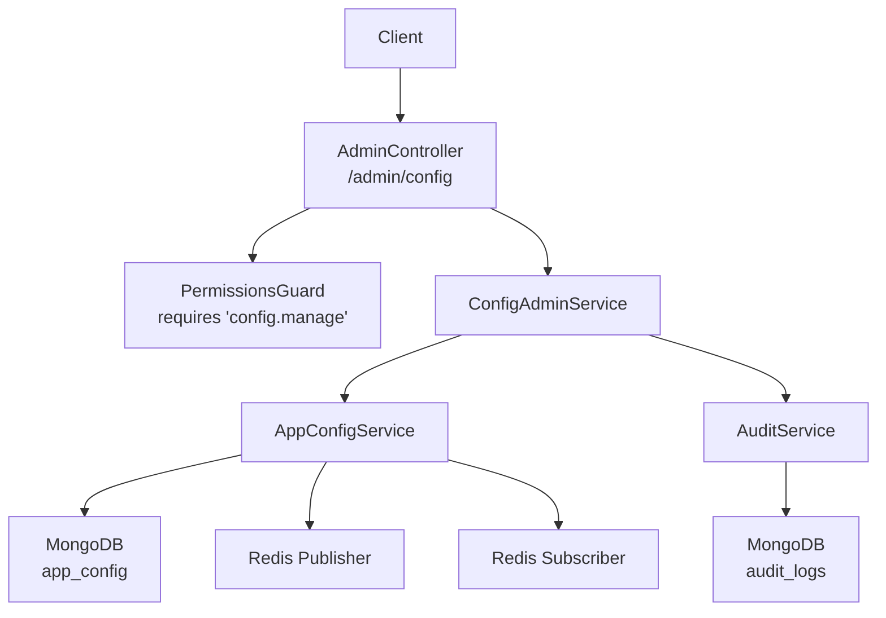
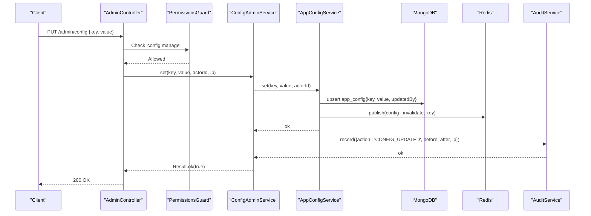
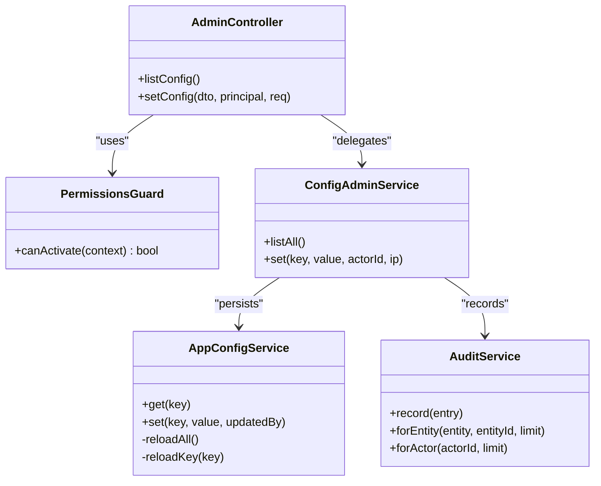
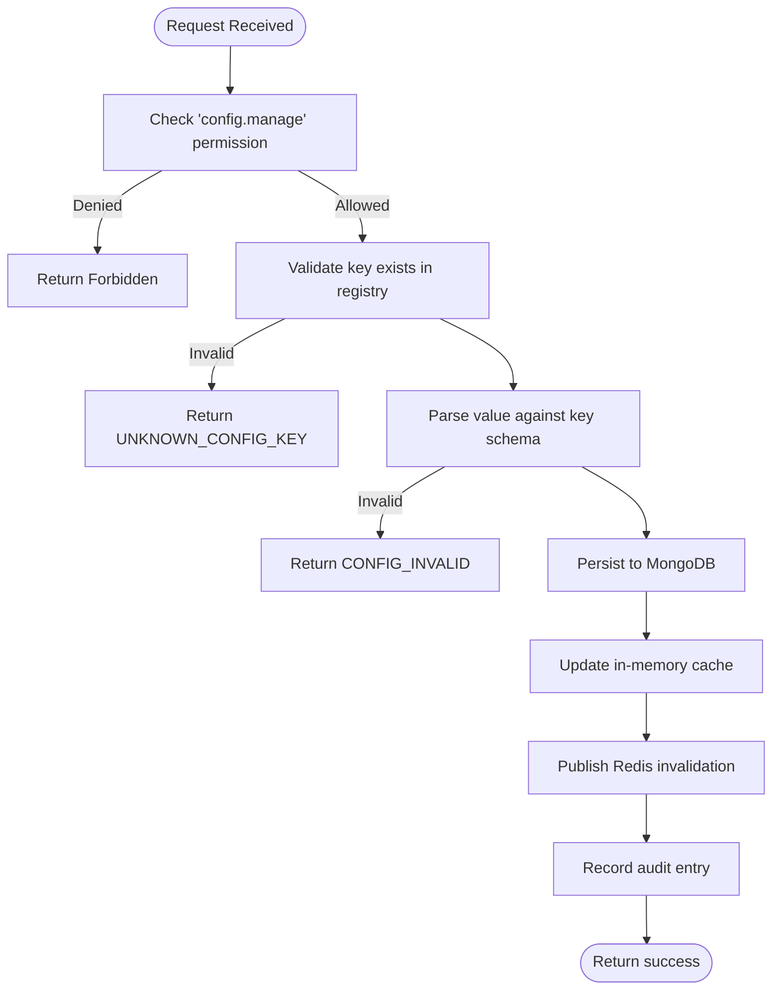

# System Configuration

<cite>
**Referenced Files in This Document**
- [admin.controller.ts](file://backend/apps/api/src/modules/admin/presentation/admin.controller.ts)
- [config-admin.service.ts](file://backend/apps/api/src/modules/admin/application/config-admin.service.ts)
- [app-config.service.ts](file://backend/libs/shared/src/config/app-config.service.ts)
- [config-keys.ts](file://backend/libs/shared/src/config/config-keys.ts)
- [app-config.schema.ts](file://backend/libs/shared/src/config/app-config.schema.ts)
- [audit.service.ts](file://backend/libs/shared/src/audit/audit.service.ts)
- [audit-log.schema.ts](file://backend/libs/shared/src/audit/audit-log.schema.ts)
- [permissions.guard.ts](file://backend/apps/api/src/modules/admin/presentation/permissions.guard.ts)
- [admin.dtos.ts](file://backend/apps/api/src/modules/admin/presentation/dto/admin.dtos.ts)
- [seed-config.ts](file://backend/scripts/seed-config.ts)
</cite>

## Table of Contents
1. Introduction
2. Project Structure
3. Core Components
4. Architecture Overview
5. Detailed Component Analysis
6. Dependency Analysis
7. Performance Considerations
8. Troubleshooting Guide
9. Conclusion
10. Appendices

## Introduction
This document provides comprehensive API documentation for system configuration endpoints that allow authorized administrators to list and update application configuration values. It explains the key-value storage model, validation mechanisms, permission requirements, security considerations, and audit logging. It also covers environment-specific configuration strategies, versioning implications, rollback approaches, and operational best practices.

## Project Structure
The configuration feature spans presentation (controllers), application services, shared configuration service, schemas, and audit subsystems:
- Presentation layer exposes REST endpoints under /admin with strict permission checks.
- Application layer orchestrates config operations and audit recording.
- Shared layer implements a DB-backed, Redis-cached configuration service with schema validation and cross-instance invalidation.
- Schemas define persistent models for configuration and audit logs.
- Seed script initializes default configuration values.

**Diagram sources**
- [admin.controller.ts:147-159](file://backend/apps/api/src/modules/admin/presentation/admin.controller.ts#L147-L159)
- [permissions.guard.ts:13-41](file://backend/apps/api/src/modules/admin/presentation/permissions.guard.ts#L13-L41)
- [config-admin.service.ts:1-37](file://backend/apps/api/src/modules/admin/application/config-admin.service.ts#L1-L37)
- [app-config.service.ts:11-87](file://backend/libs/shared/src/config/app-config.service.ts#L11-L87)
- [audit.service.ts:1-45](file://backend/libs/shared/src/audit/audit.service.ts#L1-L45)

**Section sources**
- [admin.controller.ts:147-159](file://backend/apps/api/src/modules/admin/presentation/admin.controller.ts#L147-L159)
- [permissions.guard.ts:13-41](file://backend/apps/api/src/modules/admin/presentation/permissions.guard.ts#L13-L41)
- [config-admin.service.ts:1-37](file://backend/apps/api/src/modules/admin/application/config-admin.service.ts#L1-L37)
- [app-config.service.ts:11-87](file://backend/libs/shared/src/config/app-config.service.ts#L11-L87)
- [audit.service.ts:1-45](file://backend/libs/shared/src/audit/audit.service.ts#L1-L45)

## Core Components
- AdminController: Exposes GET /admin/config and PUT /admin/config with permission enforcement.
- ConfigAdminService: Validates keys against registry, persists changes via AppConfigService, and records audit entries.
- AppConfigService: In-memory cache backed by MongoDB; validates values using per-key Zod schemas; publishes Redis invalidation events to refresh caches across instances.
- PermissionsGuard: Enforces required permissions at runtime, including 'config.manage'.
- AuditService/AuditLog: Immutable audit trail capturing before/after values, actor, IP, and timestamps.
- Config Registry: Centralized definitions of all supported config keys, their types, defaults, and descriptions.

**Section sources**
- [admin.controller.ts:147-159](file://backend/apps/api/src/modules/admin/presentation/admin.controller.ts#L147-L159)
- [config-admin.service.ts:1-37](file://backend/apps/api/src/modules/admin/application/config-admin.service.ts#L1-L37)
- [app-config.service.ts:11-87](file://backend/libs/shared/src/config/app-config.service.ts#L11-L87)
- [permissions.guard.ts:13-41](file://backend/apps/api/src/modules/admin/presentation/permissions.guard.ts#L13-L41)
- [audit.service.ts:1-45](file://backend/libs/shared/src/audit/audit.service.ts#L1-L45)
- [config-keys.ts:1-107](file://backend/libs/shared/src/config/config-keys.ts#L1-L107)

## Architecture Overview
The configuration system is designed for safety, consistency, and observability:
- All writes are validated against per-key schemas before persistence.
- Changes are persisted to MongoDB and broadcast via Redis so all instances reload the affected key.
- Reads are served from an in-memory cache after boot, ensuring hot-path performance.
- Every change is recorded immutably in audit logs.

**Diagram sources**
- [admin.controller.ts:155-159](file://backend/apps/api/src/modules/admin/presentation/admin.controller.ts#L155-L159)
- [permissions.guard.ts:26-39](file://backend/apps/api/src/modules/admin/presentation/permissions.guard.ts#L26-L39)
- [config-admin.service.ts:21-36](file://backend/apps/api/src/modules/admin/application/config-admin.service.ts#L21-L36)
- [app-config.service.ts:47-60](file://backend/libs/shared/src/config/app-config.service.ts#L47-L60)
- [audit.service.ts:29-35](file://backend/libs/shared/src/audit/audit.service.ts#L29-L35)

## Detailed Component Analysis

### API Endpoints
- GET /admin/config
  - Purpose: List all known configuration keys with current values and metadata.
  - Permission: Requires 'config.manage'.
  - Response: Array of items containing key, description, default, and current value.
  - Notes: Values reflect the live cached state; unknown keys are ignored.

- PUT /admin/config
  - Purpose: Update a single configuration key.
  - Permission: Requires 'config.manage'.
  - Request body: SetConfigDto with key and value.
  - Behavior: Validates key existence and value schema; persists to DB; broadcasts invalidation; records audit entry.
  - Errors: Returns domain error for unknown key or invalid value.

**Section sources**
- [admin.controller.ts:147-159](file://backend/apps/api/src/modules/admin/presentation/admin.controller.ts#L147-L159)
- [admin.dtos.ts:75-81](file://backend/apps/api/src/modules/admin/presentation/dto/admin.dtos.ts#L75-L81)
- [config-admin.service.ts:12-36](file://backend/apps/api/src/modules/admin/application/config-admin.service.ts#L12-L36)

### Configuration Management Service
- AppConfigService responsibilities:
  - Boot-time load of all overrides into memory.
  - get(): returns cached value or registered default.
  - set(): validates via per-key Zod schema, persists to MongoDB, updates cache, and publishes Redis invalidation event.
  - Subscribes to Redis invalidation channel to reload specific keys on other instances.

- Data model:
  - app_config collection stores key, value, and updatedBy.
  - Each key has a schema and default defined centrally.

**Section sources**
- [app-config.service.ts:11-87](file://backend/libs/shared/src/config/app-config.service.ts#L11-L87)
- [app-config.schema.ts:4-15](file://backend/libs/shared/src/config/app-config.schema.ts#L4-L15)
- [config-keys.ts:1-107](file://backend/libs/shared/src/config/config-keys.ts#L1-L107)

### Validation Mechanisms
- Key validation: Only keys present in CONFIG_REGISTRY are accepted.
- Value validation: Per-key Zod schemas enforce type constraints and ranges.
- On boot and on invalidation, stored values are re-parsed; invalid stored values fall back to defaults with warnings.

**Section sources**
- [config-admin.service.ts:21-30](file://backend/apps/api/src/modules/admin/application/config-admin.service.ts#L21-L30)
- [app-config.service.ts:47-59](file://backend/libs/shared/src/config/app-config.service.ts#L47-L59)
- [app-config.service.ts:62-86](file://backend/libs/shared/src/config/app-config.service.ts#L62-L86)
- [config-keys.ts:1-107](file://backend/libs/shared/src/config/config-keys.ts#L1-L107)

### Security and Permissions
- Endpoint protection: Both config endpoints require 'config.manage' permission enforced by PermissionsGuard.
- Principal context: Actor ID and request IP are captured and included in audit logs.
- Immediate effect: Role changes and disablement apply immediately because guard reads live employee data.

**Section sources**
- [admin.controller.ts:147-159](file://backend/apps/api/src/modules/admin/presentation/admin.controller.ts#L147-L159)
- [permissions.guard.ts:13-41](file://backend/apps/api/src/modules/admin/presentation/permissions.guard.ts#L13-L41)
- [config-admin.service.ts:31-35](file://backend/apps/api/src/modules/admin/application/config-admin.service.ts#L31-L35)

### Audit Logging
- Immutable audit trail: Each configuration update creates an audit log entry with action, entity, entityId, before/after values, actor, and IP.
- Querying: Audit logs can be retrieved by entity+entityId or by actorId.

**Section sources**
- [config-admin.service.ts:31-35](file://backend/apps/api/src/modules/admin/application/config-admin.service.ts#L31-L35)
- [audit.service.ts:1-45](file://backend/libs/shared/src/audit/audit.service.ts#L1-L45)
- [audit-log.schema.ts:1-41](file://backend/libs/shared/src/audit/audit-log.schema.ts#L1-L41)

### Environment-Specific Configuration Strategy
- Use distinct configuration keys per environment (e.g., prefix or naming convention) and manage them via the same endpoints.
- Alternatively, maintain separate deployments per environment and seed defaults accordingly.
- The registry centralizes allowed keys and schemas, preventing ad-hoc keys.

[No sources needed since this section provides general guidance]

### Versioning and Rollback
- Versioning: There is no explicit version field in app_config. To implement versioning, wrap updates in transactions and store a new row with a version tag or snapshot while keeping the latest active row.
- Rollback: Maintain a history table or use audit logs to reconstruct prior states. For immediate rollback, write the previous value back via the same endpoint.
- Idempotency: The seed script uses upsert semantics to avoid overwriting admin-tuned values.

**Section sources**
- [app-config.schema.ts:4-15](file://backend/libs/shared/src/config/app-config.schema.ts#L4-L15)
- [audit.service.ts:29-43](file://backend/libs/shared/src/audit/audit.service.ts#L29-L43)
- [seed-config.ts:5-28](file://backend/scripts/seed-config.ts#L5-L28)

## Dependency Analysis

**Diagram sources**
- [admin.controller.ts:147-159](file://backend/apps/api/src/modules/admin/presentation/admin.controller.ts#L147-L159)
- [permissions.guard.ts:13-41](file://backend/apps/api/src/modules/admin/presentation/permissions.guard.ts#L13-L41)
- [config-admin.service.ts:1-37](file://backend/apps/api/src/modules/admin/application/config-admin.service.ts#L1-L37)
- [app-config.service.ts:11-87](file://backend/libs/shared/src/config/app-config.service.ts#L11-L87)
- [audit.service.ts:1-45](file://backend/libs/shared/src/audit/audit.service.ts#L1-L45)

**Section sources**
- [admin.controller.ts:147-159](file://backend/apps/api/src/modules/admin/presentation/admin.controller.ts#L147-L159)
- [permissions.guard.ts:13-41](file://backend/apps/api/src/modules/admin/presentation/permissions.guard.ts#L13-L41)
- [config-admin.service.ts:1-37](file://backend/apps/api/src/modules/admin/application/config-admin.service.ts#L1-L37)
- [app-config.service.ts:11-87](file://backend/libs/shared/src/config/app-config.service.ts#L11-L87)
- [audit.service.ts:1-45](file://backend/libs/shared/src/audit/audit.service.ts#L1-L45)

## Performance Considerations
- Reads are synchronous and fast due to in-memory cache after boot.
- Writes trigger one DB upsert and one Redis publish; subscribers reload only the changed key.
- Unknown or invalid stored values are safely ignored during boot, falling back to defaults.

[No sources needed since this section provides general guidance]

## Troubleshooting Guide
Common issues and resolutions:
- Unknown config key: Ensure the key exists in the registry; otherwise, the operation will fail with a domain error.
- Invalid value: Validate against the per-key schema; fix the payload according to the error message.
- No effect across instances: Confirm Redis connectivity; invalidation events propagate changes to other nodes.
- Audit failures: Audit writes are non-blocking; check logs for errors but business operations continue.

**Section sources**
- [config-admin.service.ts:21-30](file://backend/apps/api/src/modules/admin/application/config-admin.service.ts#L21-L30)
- [app-config.service.ts:47-59](file://backend/libs/shared/src/config/app-config.service.ts#L47-L59)
- [audit.service.ts:29-35](file://backend/libs/shared/src/audit/audit.service.ts#L29-L35)

## Conclusion
The configuration system provides a secure, validated, and observable way to manage application settings at runtime. With centralized key definitions, schema-based validation, distributed caching, and immutable audit trails, it supports safe operational changes across multiple instances. Permissions ensure only authorized users can modify critical settings, and audit logs provide full traceability.

[No sources needed since this section summarizes without analyzing specific files]

## Appendices

### API Reference

- GET /admin/config
  - Description: Lists all known configuration keys with current values and metadata.
  - Authorization: Requires 'config.manage'.
  - Response: Array of objects with fields: key, description, default, value.

- PUT /admin/config
  - Description: Updates a single configuration key.
  - Authorization: Requires 'config.manage'.
  - Request body: SetConfigDto
    - key: string (length 3–100)
    - value: any (validated against the key’s schema)
  - Success: 200 OK
  - Errors: Domain errors for unknown key or invalid value; mapped to appropriate HTTP status codes.

**Section sources**
- [admin.controller.ts:147-159](file://backend/apps/api/src/modules/admin/presentation/admin.controller.ts#L147-L159)
- [admin.dtos.ts:75-81](file://backend/apps/api/src/modules/admin/presentation/dto/admin.dtos.ts#L75-L81)
- [permissions.guard.ts:13-41](file://backend/apps/api/src/modules/admin/presentation/permissions.guard.ts#L13-L41)

### Data Models

- app_config
  - key: string (unique, indexed)
  - value: object
  - updatedBy: string
  - timestamps: createdAt, updatedAt

- audit_logs
  - actorType: enum ['USER','EMPLOYEE','SYSTEM']
  - actorId: string (indexed)
  - action: string
  - entity: string
  - entityId: string
  - before: object (optional)
  - after: object (optional)
  - ip: string (optional)
  - at: timestamp

**Section sources**
- [app-config.schema.ts:4-15](file://backend/libs/shared/src/config/app-config.schema.ts#L4-L15)
- [audit-log.schema.ts:1-41](file://backend/libs/shared/src/audit/audit-log.schema.ts#L1-L41)

### Common Tasks

- Update system settings
  - Call PUT /admin/config with a valid key and value.
  - Ensure you have 'config.manage' permission.
  - Verify change via GET /admin/config and audit logs.

- Retrieve current configuration values
  - Call GET /admin/config to list all keys and current values.

- Manage environment-specific configurations
  - Use distinct keys per environment or deploy separate instances per environment.
  - Seed defaults per environment using the provided seed script.

**Section sources**
- [admin.controller.ts:147-159](file://backend/apps/api/src/modules/admin/presentation/admin.controller.ts#L147-L159)
- [seed-config.ts:5-28](file://backend/scripts/seed-config.ts#L5-L28)

### Flowchart: Configuration Update Process

**Diagram sources**
- [admin.controller.ts:155-159](file://backend/apps/api/src/modules/admin/presentation/admin.controller.ts#L155-L159)
- [permissions.guard.ts:26-39](file://backend/apps/api/src/modules/admin/presentation/permissions.guard.ts#L26-L39)
- [config-admin.service.ts:21-36](file://backend/apps/api/src/modules/admin/application/config-admin.service.ts#L21-L36)
- [app-config.service.ts:47-60](file://backend/libs/shared/src/config/app-config.service.ts#L47-L60)
- [audit.service.ts:29-35](file://backend/libs/shared/src/audit/audit.service.ts#L29-L35)