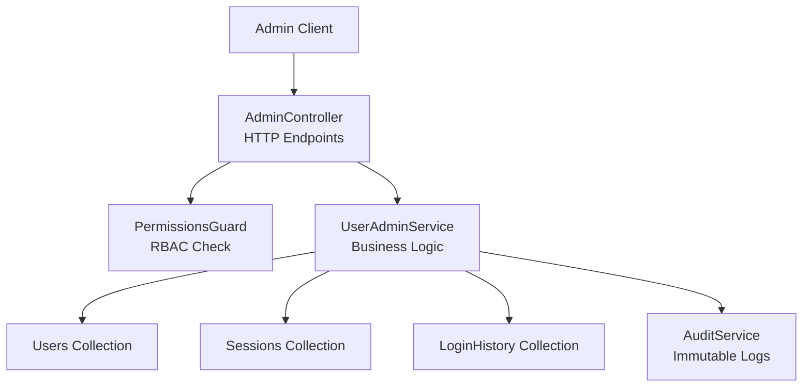
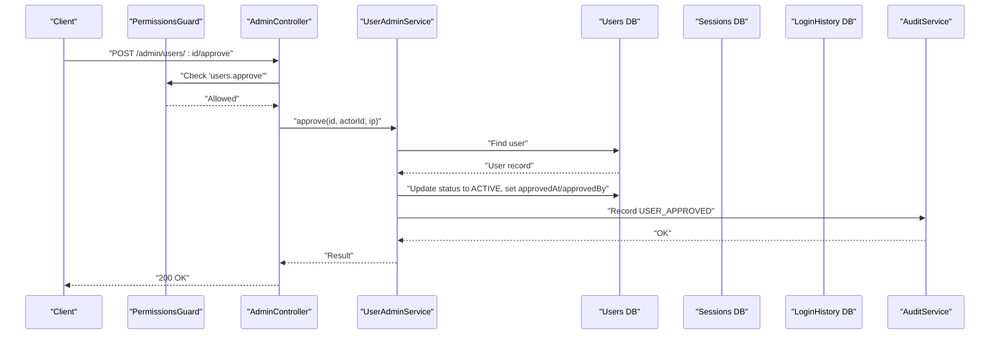
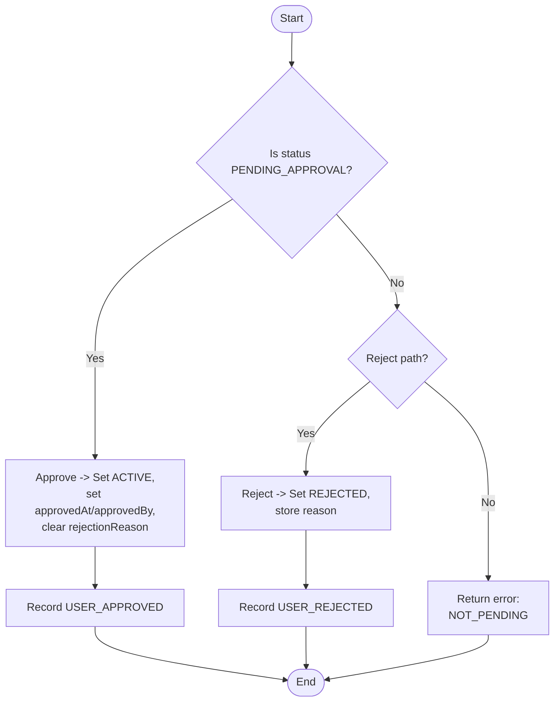
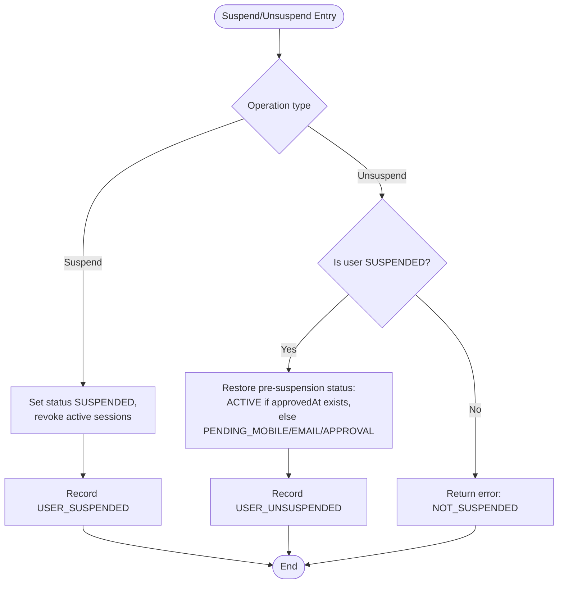
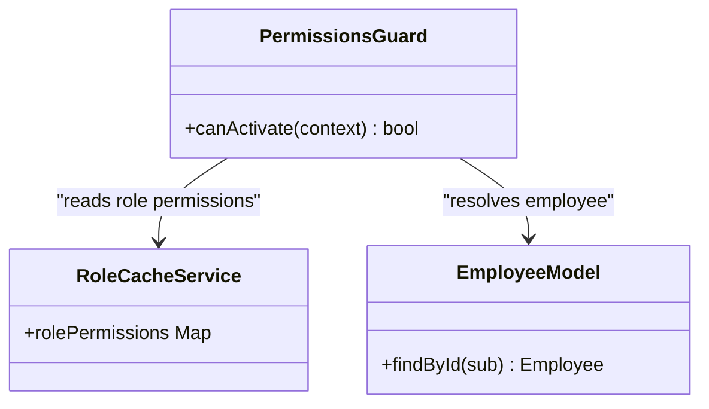
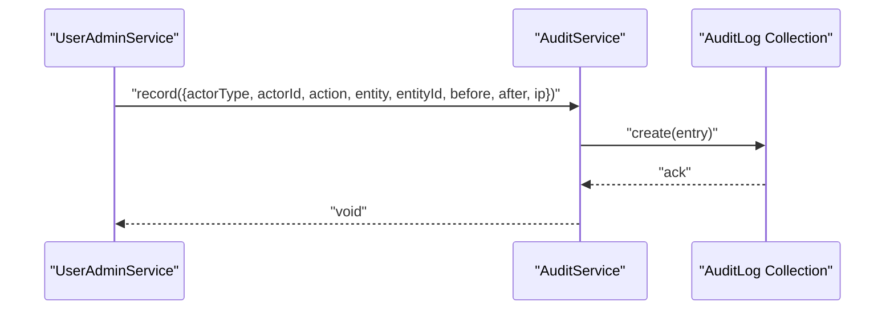
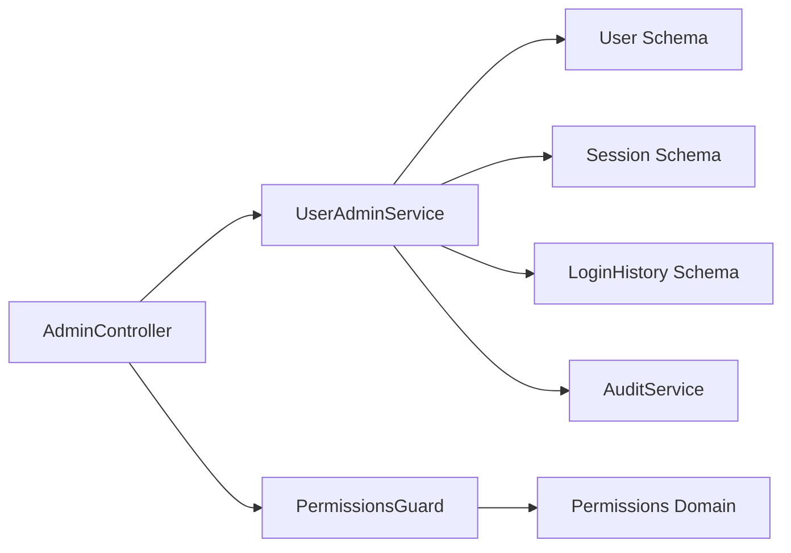

# User Management

<cite>
**Referenced Files in This Document**
- [admin.controller.ts](file://backend/apps/api/src/modules/admin/presentation/admin.controller.ts)
- [admin.dtos.ts](file://backend/apps/api/src/modules/admin/presentation/dto/admin.dtos.ts)
- [user-admin.service.ts](file://backend/apps/api/src/modules/admin/application/user-admin.service.ts)
- [permissions.guard.ts](file://backend/apps/api/src/modules/admin/presentation/permissions.guard.ts)
- [permissions.ts](file://backend/apps/api/src/modules/admin/domain/permissions.ts)
- [auth.types.ts](file://backend/apps/api/src/modules/auth/domain/auth.types.ts)
- [user.schema.ts](file://backend/apps/api/src/modules/auth/infrastructure/schemas/user.schema.ts)
- [audit.service.ts](file://backend/libs/shared/src/audit/audit.service.ts)
</cite>

## Table of Contents
1. Introduction
2. Project Structure
3. Core Components
4. Architecture Overview
5. Detailed Component Analysis
6. Dependency Analysis
7. Performance Considerations
8. Troubleshooting Guide
9. Conclusion
10. Appendices

## Introduction
This document provides detailed API documentation for user management endpoints exposed by the admin module. It covers:
- Listing users with search and pagination
- Retrieving user details (including active sessions and recent logins)
- Lifecycle operations: approve, reject, suspend, unsuspend
- Request/response schemas for key DTOs
- Status management and approval workflows
- Audit trail requirements
- Permission requirements and security considerations
- Practical examples for common administration tasks

## Project Structure
User management is implemented under the admin module with a layered structure:
- Presentation layer: controller defines HTTP endpoints and guards
- Application layer: service implements business logic and persistence calls
- Domain types: enums for statuses and claims
- Infrastructure: Mongoose schemas for users, sessions, login history
- Security: permission guard enforces RBAC
- Shared: audit service records immutable audit logs

**Diagram sources**
- [admin.controller.ts:30-145](file://backend/apps/api/src/modules/admin/presentation/admin.controller.ts#L30-L145)
- [permissions.guard.ts:18-41](file://backend/apps/api/src/modules/admin/presentation/permissions.guard.ts#L18-L41)
- [user-admin.service.ts:13-147](file://backend/apps/api/src/modules/admin/application/user-admin.service.ts#L13-L147)
- [audit.service.ts:23-44](file://backend/libs/shared/src/audit/audit.service.ts#L23-L44)

**Section sources**
- [admin.controller.ts:30-145](file://backend/apps/api/src/modules/admin/presentation/admin.controller.ts#L30-L145)
- [user-admin.service.ts:13-147](file://backend/apps/api/src/modules/admin/application/user-admin.service.ts#L13-L147)
- [permissions.guard.ts:18-41](file://backend/apps/api/src/modules/admin/presentation/permissions.guard.ts#L18-L41)
- [audit.service.ts:23-44](file://backend/libs/shared/src/audit/audit.service.ts#L23-L44)

## Core Components
- AdminController: Exposes REST endpoints for user listing, detail retrieval, and lifecycle operations. All endpoints are guarded by JWT and permissions.
- UserAdminService: Implements list, detail, approve, reject, suspend, unsuspend, and status transitions with audit logging.
- PermissionsGuard: Enforces fine-grained permissions using role cache and per-user allow/deny overrides.
- AuditService: Records immutable audit entries for all user lifecycle changes.

Key responsibilities:
- Input validation via DTOs
- Querying and filtering users
- Managing user status transitions
- Revoking sessions on suspension
- Recording audit trails

**Section sources**
- [admin.controller.ts:101-145](file://backend/apps/api/src/modules/admin/presentation/admin.controller.ts#L101-L145)
- [user-admin.service.ts:22-147](file://backend/apps/api/src/modules/admin/application/user-admin.service.ts#L22-L147)
- [permissions.guard.ts:18-41](file://backend/apps/api/src/modules/admin/presentation/permissions.guard.ts#L18-L41)
- [audit.service.ts:23-44](file://backend/libs/shared/src/audit/audit.service.ts#L23-L44)

## Architecture Overview
The user management flow follows a clear separation of concerns:
- Controller validates inputs and delegates to service
- Service performs domain checks, updates state, revokes sessions when needed, and writes audit logs
- Guard ensures caller has required permissions before any operation proceeds

**Diagram sources**
- [admin.controller.ts:118-122](file://backend/apps/api/src/modules/admin/presentation/admin.controller.ts#L118-L122)
- [permissions.guard.ts:26-39](file://backend/apps/api/src/modules/admin/presentation/permissions.guard.ts#L26-L39)
- [user-admin.service.ts:53-81](file://backend/apps/api/src/modules/admin/application/user-admin.service.ts#L53-L81)
- [audit.service.ts:29-35](file://backend/libs/shared/src/audit/audit.service.ts#L29-L35)

## Detailed Component Analysis

### Endpoints

#### List Users
- Method: GET
- Path: /admin/users
- Query parameters:
  - search: optional string (1–100 chars)
  - status: optional enum filter
  - page: optional integer >= 1
  - pageSize: optional integer between 1 and 100
- Required permission: users.view
- Behavior:
  - Filters by status if provided
  - Supports case-insensitive substring search across email, usernameLower, mobile, name
  - Returns paginated results sorted by creation date descending
- Response shape:
  - items: array of user summaries (fields selected include name, email, mobile, username, address, incomeType, monthlyIncome, status, kycStatus, createdAt, approvedAt, rejectionReason)
  - total: number of matching users
  - page: requested page
  - pageSize: requested page size

**Section sources**
- [admin.controller.ts:101-110](file://backend/apps/api/src/modules/admin/presentation/admin.controller.ts#L101-L110)
- [user-admin.service.ts:22-39](file://backend/apps/api/src/modules/admin/application/user-admin.service.ts#L22-L39)
- [admin.dtos.ts:50-63](file://backend/apps/api/src/modules/admin/presentation/dto/admin.dtos.ts#L50-L63)

#### Get User Detail
- Method: GET
- Path: /admin/users/:id
- Required permission: users.view
- Behavior:
  - Retrieves full user record
  - Counts active sessions (not revoked and not expired)
  - Fetches up to 20 most recent login history entries
- Response shape:
  - user: full user object
  - activeSessions: count
  - recentLogins: array of recent login events

**Section sources**
- [admin.controller.ts:112-116](file://backend/apps/api/src/modules/admin/presentation/admin.controller.ts#L112-L116)
- [user-admin.service.ts:41-51](file://backend/apps/api/src/modules/admin/application/user-admin.service.ts#L41-L51)

#### Approve User
- Method: POST
- Path: /admin/users/:id/approve
- Required permission: users.approve
- Behavior:
  - Validates user exists and is in PENDING_APPROVAL
  - Sets status to ACTIVE, sets approvedAt and approvedBy
  - Clears rejectionReason if present
  - Records audit entry
- Response: success indicator

**Section sources**
- [admin.controller.ts:118-122](file://backend/apps/api/src/modules/admin/presentation/admin.controller.ts#L118-L122)
- [user-admin.service.ts:53-81](file://backend/apps/api/src/modules/admin/application/user-admin.service.ts#L53-L81)

#### Reject User
- Method: POST
- Path: /admin/users/:id/reject
- Body: RejectUserDto
- Required permission: users.approve
- Behavior:
  - Validates user exists and is in PENDING_APPROVAL
  - Sets status to REJECTED and stores reason
  - Records audit entry
- Response: success indicator

**Section sources**
- [admin.controller.ts:124-133](file://backend/apps/api/src/modules/admin/presentation/admin.controller.ts#L124-L133)
- [user-admin.service.ts:83-109](file://backend/apps/api/src/modules/admin/application/user-admin.service.ts#L83-L109)
- [admin.dtos.ts:70-73](file://backend/apps/api/src/modules/admin/presentation/dto/admin.dtos.ts#L70-L73)

#### Suspend User
- Method: POST
- Path: /admin/users/:id/suspend
- Body: SuspendUserDto
- Required permission: users.suspend
- Behavior:
  - Sets status to SUSPENDED
  - Revokes all active sessions for the user
  - Records audit entry
- Response: success indicator

**Section sources**
- [admin.controller.ts:135-139](file://backend/apps/api/src/modules/admin/presentation/admin.controller.ts#L135-L139)
- [user-admin.service.ts:111-113](file://backend/apps/api/src/modules/admin/application/user-admin.service.ts#L111-L113)
- [user-admin.service.ts:132-147](file://backend/apps/api/src/modules/admin/application/user-admin.service.ts#L132-L147)
- [admin.dtos.ts:65-68](file://backend/apps/api/src/modules/admin/presentation/dto/admin.dtos.ts#L65-L68)

#### Unsuspend User
- Method: POST
- Path: /admin/users/:id/unsuspend
- Body: SuspendUserDto
- Required permission: users.suspend
- Behavior:
  - Validates user is currently SUSPENDED
  - Restores appropriate pre-suspension status based on approvals and verifications
  - Records audit entry
- Response: success indicator

**Section sources**
- [admin.controller.ts:141-145](file://backend/apps/api/src/modules/admin/presentation/admin.controller.ts#L141-L145)
- [user-admin.service.ts:115-130](file://backend/apps/api/src/modules/admin/application/user-admin.service.ts#L115-L130)
- [admin.dtos.ts:65-68](file://backend/apps/api/src/modules/admin/presentation/dto/admin.dtos.ts#L65-L68)

### Data Models and DTOs

#### UserListQueryDto
- Fields:
  - search: optional string (1–100 chars)
  - status: optional enum value from allowed statuses
  - page: optional integer >= 1
  - pageSize: optional integer between 1 and 100

Allowed status values:
- PENDING_MOBILE
- PENDING_EMAIL
- PENDING_APPROVAL
- ACTIVE
- SUSPENDED
- REJECTED

**Section sources**
- [admin.dtos.ts:50-63](file://backend/apps/api/src/modules/admin/presentation/dto/admin.dtos.ts#L50-L63)
- [auth.types.ts:1-9](file://backend/apps/api/src/modules/auth/domain/auth.types.ts#L1-L9)

#### RejectUserDto
- Fields:
  - reason: required string (5–500 chars)

**Section sources**
- [admin.dtos.ts:70-73](file://backend/apps/api/src/modules/admin/presentation/dto/admin.dtos.ts#L70-L73)

#### SuspendUserDto
- Fields:
  - reason: required string (5–500 chars)

**Section sources**
- [admin.dtos.ts:65-68](file://backend/apps/api/src/modules/admin/presentation/dto/admin.dtos.ts#L65-L68)

### User Status Management and Approval Workflow

**Diagram sources**
- [user-admin.service.ts:53-109](file://backend/apps/api/src/modules/admin/application/user-admin.service.ts#L53-L109)

### Suspension and Unsuspension Logic

**Diagram sources**
- [user-admin.service.ts:111-147](file://backend/apps/api/src/modules/admin/application/user-admin.service.ts#L111-L147)

### Permission Requirements and Security

- Global guard: EmployeeAuthGuard ensures requests are authenticated as employees
- Fine-grained guard: PermissionsGuard enforces required permissions per endpoint
- Permission keys used:
  - users.view: list users, view user detail
  - users.approve: approve or reject users
  - users.suspend: suspend or unsuspend users
- Deny-wins semantics: explicit deny overrides any grant, including wildcard
- Default roles include ADMIN, KYC, SUPPORT, etc., with varying permission sets

**Diagram sources**
- [permissions.guard.ts:18-41](file://backend/apps/api/src/modules/admin/presentation/permissions.guard.ts#L18-L41)
- [permissions.ts:30-64](file://backend/apps/api/src/modules/admin/domain/permissions.ts#L30-L64)

**Section sources**
- [permissions.guard.ts:18-41](file://backend/apps/api/src/modules/admin/presentation/permissions.guard.ts#L18-L41)
- [permissions.ts:5-26](file://backend/apps/api/src/modules/admin/domain/permissions.ts#L5-L26)
- [permissions.ts:30-64](file://backend/apps/api/src/modules/admin/domain/permissions.ts#L30-L64)

### Audit Trail Requirements

- Every user lifecycle change records an immutable audit entry:
  - USER_APPROVED, USER_REJECTED, USER_SUSPENDED, USER_UNSUSPENDED
- Entries include:
  - actorType: EMPLOYEE
  - actorId: employee ID
  - action: specific action
  - entity: user
  - entityId: user ID
  - before/after: status and relevant fields
  - ip: request IP
- Audit failures do not abort business operations but are logged loudly

**Diagram sources**
- [user-admin.service.ts:70-79](file://backend/apps/api/src/modules/admin/application/user-admin.service.ts#L70-L79)
- [user-admin.service.ts:98-107](file://backend/apps/api/src/modules/admin/application/user-admin.service.ts#L98-L107)
- [user-admin.service.ts:142-145](file://backend/apps/api/src/modules/admin/application/user-admin.service.ts#L142-L145)
- [audit.service.ts:29-35](file://backend/libs/shared/src/audit/audit.service.ts#L29-L35)

**Section sources**
- [audit.service.ts:17-44](file://backend/libs/shared/src/audit/audit.service.ts#L17-L44)
- [user-admin.service.ts:70-79](file://backend/apps/api/src/modules/admin/application/user-admin.service.ts#L70-L79)
- [user-admin.service.ts:98-107](file://backend/apps/api/src/modules/admin/application/user-admin.service.ts#L98-L107)
- [user-admin.service.ts:142-145](file://backend/apps/api/src/modules/admin/application/user-admin.service.ts#L142-L145)

## Dependency Analysis

**Diagram sources**
- [admin.controller.ts:30-145](file://backend/apps/api/src/modules/admin/presentation/admin.controller.ts#L30-L145)
- [user-admin.service.ts:13-147](file://backend/apps/api/src/modules/admin/application/user-admin.service.ts#L13-L147)
- [permissions.guard.ts:18-41](file://backend/apps/api/src/modules/admin/presentation/permissions.guard.ts#L18-L41)
- [permissions.ts:5-26](file://backend/apps/api/src/modules/admin/domain/permissions.ts#L5-L26)

**Section sources**
- [admin.controller.ts:30-145](file://backend/apps/api/src/modules/admin/presentation/admin.controller.ts#L30-L145)
- [user-admin.service.ts:13-147](file://backend/apps/api/src/modules/admin/application/user-admin.service.ts#L13-L147)
- [permissions.guard.ts:18-41](file://backend/apps/api/src/modules/admin/presentation/permissions.guard.ts#L18-L41)
- [permissions.ts:5-26](file://backend/apps/api/src/modules/admin/domain/permissions.ts#L5-L26)

## Performance Considerations
- Pagination: Use page and pageSize to limit result sets; default page size is 20, max 100
- Search: Case-insensitive regex search across multiple fields; ensure indexes on frequently searched fields (email, usernameLower, mobile, name)
- Detail endpoint: Aggregates sessions and login history; consider caching active session counts if high traffic
- Suspension: Revokes sessions in bulk; batch update is efficient
- Audit: Write-once logs; avoid blocking critical paths by ensuring audit writes are resilient

[No sources needed since this section provides general guidance]

## Troubleshooting Guide
Common errors and handling:
- NOT_FOUND: User does not exist
- NOT_PENDING: Approve/reject called on non-PENDING_APPROVAL user
- NOT_SUSPENDED: Unsuspend called on non-SUSPENDED user
- Insufficient permissions: Caller lacks required permission
- Employee inactive: Employee account disabled or missing

Where these originate:
- Domain errors returned by service methods and mapped to HTTP status codes in controller
- PermissionsGuard throws UnauthorizedException or ForbiddenException based on checks

**Section sources**
- [admin.controller.ts:17-28](file://backend/apps/api/src/modules/admin/presentation/admin.controller.ts#L17-L28)
- [user-admin.service.ts:53-147](file://backend/apps/api/src/modules/admin/application/user-admin.service.ts#L53-L147)
- [permissions.guard.ts:26-39](file://backend/apps/api/src/modules/admin/presentation/permissions.guard.ts#L26-L39)

## Conclusion
The user management API provides robust capabilities for administrators to manage user lifecycles with strong security and auditability. Endpoints enforce strict permissions, validate inputs, and maintain comprehensive audit trails. The design supports scalable querying, safe status transitions, and immediate effect of suspensions through session revocation.

[No sources needed since this section summarizes without analyzing specific files]

## Appendices

### Practical Examples

- Approve KYC-verified user:
  - Ensure user is in PENDING_APPROVAL
  - Call POST /admin/users/:id/approve with users.approve permission
  - Result: user becomes ACTIVE, approvedAt and approvedBy recorded, audit entry created

- Suspend problematic account:
  - Call POST /admin/users/:id/suspend with SuspendUserDto.reason and users.suspend permission
  - Result: user becomes SUSPENDED, active sessions revoked, audit entry created

- Search for specific users:
  - Call GET /admin/users?search=example&page=1&pageSize=20&status=ACTIVE
  - Result: paginated list of matching users

[No sources needed since this section provides conceptual usage examples]