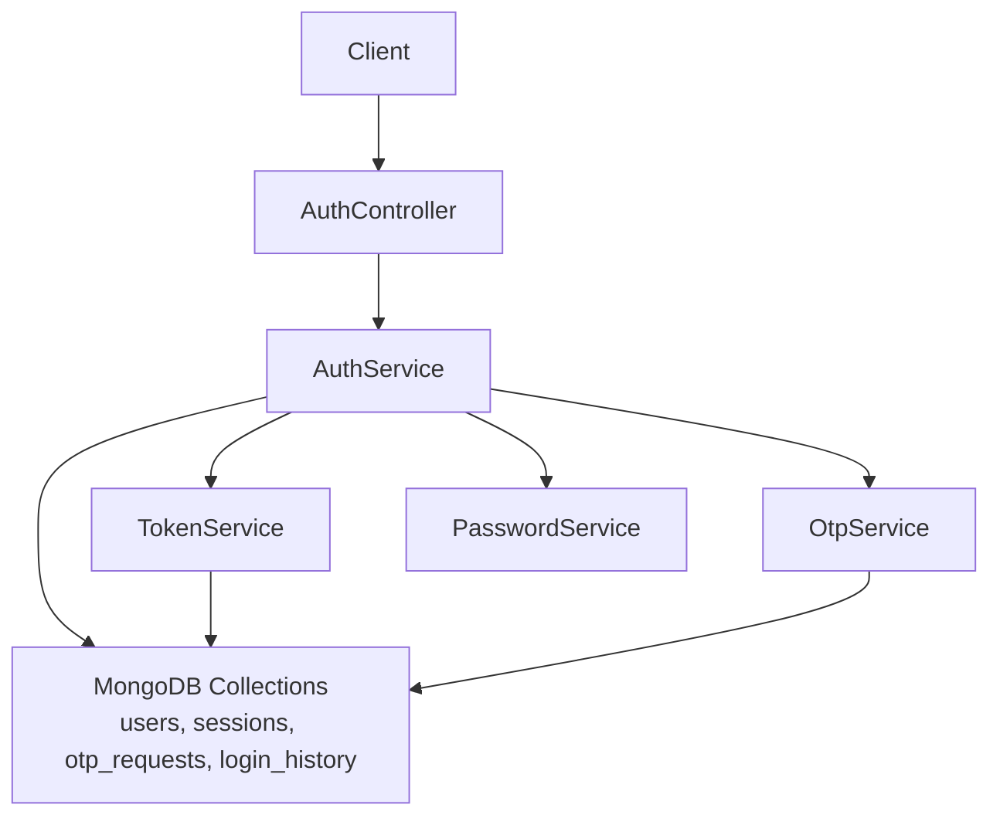
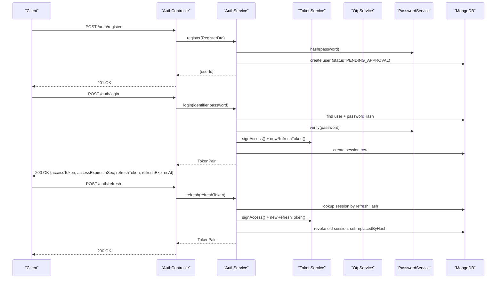
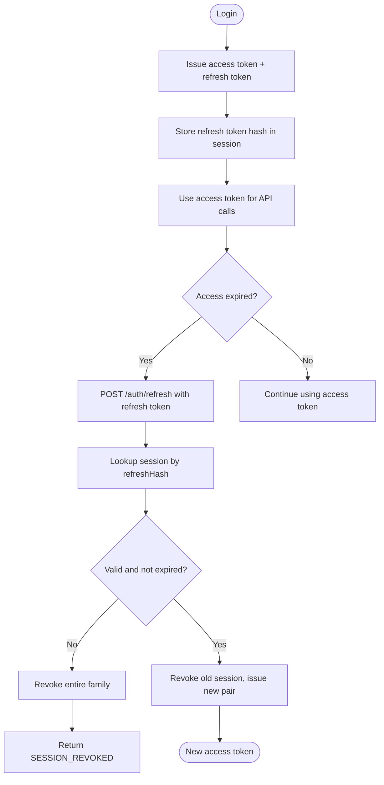
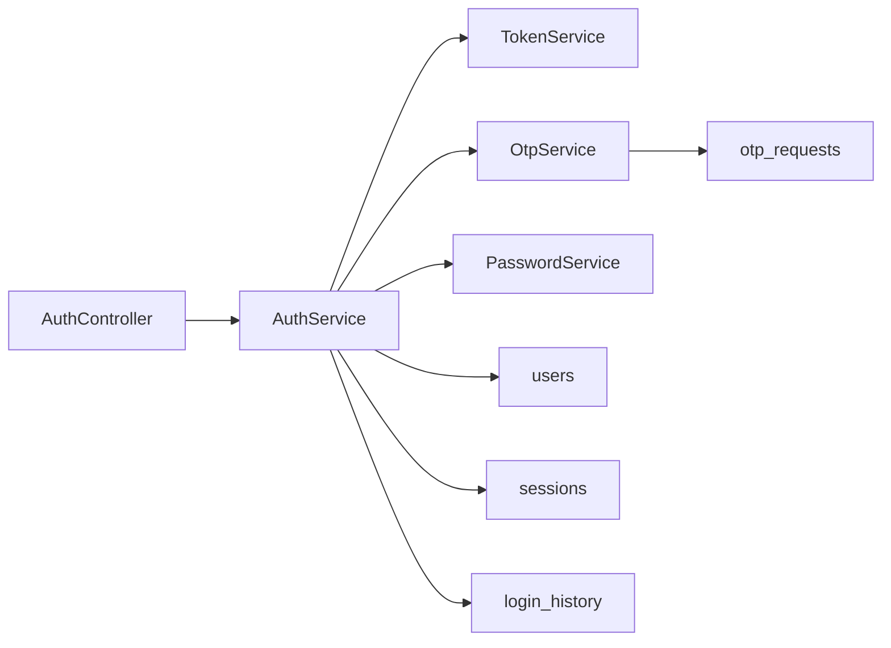
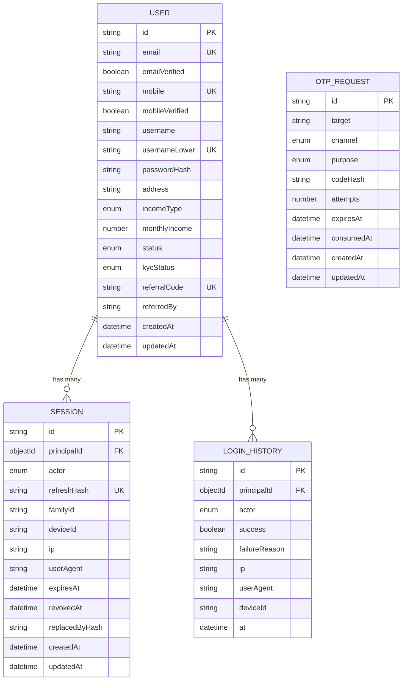

# Authentication APIs

<cite>
**Referenced Files in This Document**
- [auth.controller.ts](file://backend/apps/api/src/modules/auth/presentation/auth.controller.ts)
- [auth.dtos.ts](file://backend/apps/api/src/modules/auth/presentation/dto/auth.dtos.ts)
- [auth.service.ts](file://backend/apps/api/src/modules/auth/application/auth.service.ts)
- [token.service.ts](file://backend/apps/api/src/modules/auth/infrastructure/token.service.ts)
- [jwt-auth.guard.ts](file://backend/apps/api/src/modules/auth/presentation/jwt-auth.guard.ts)
- [otp.service.ts](file://backend/apps/api/src/modules/auth/infrastructure/otp.service.ts)
- [password.service.ts](file://backend/apps/api/src/modules/auth/infrastructure/password.service.ts)
- [user.schema.ts](file://backend/apps/api/src/modules/auth/infrastructure/schemas/user.schema.ts)
- [session.schema.ts](file://backend/apps/api/src/modules/auth/infrastructure/schemas/session.schema.ts)
- [login-history.schema.ts](file://backend/apps/api/src/modules/auth/infrastructure/schemas/login-history.schema.ts)
- [otp-request.schema.ts](file://backend/apps/api/src/modules/auth/infrastructure/schemas/otp-request.schema.ts)
</cite>

## Table of Contents
1. [Introduction](#introduction)
2. [Project Structure](#project-structure)
3. [Core Components](#core-components)
4. [Architecture Overview](#architecture-overview)
5. [Detailed Component Analysis](#detailed-component-analysis)
6. [Dependency Analysis](#dependency-analysis)
7. [Performance Considerations](#performance-considerations)
8. [Troubleshooting Guide](#troubleshooting-guide)
9. [Conclusion](#conclusion)
10. [Appendices](#appendices)

## Introduction
This document provides comprehensive API documentation for the authentication module, covering user registration, login, logout, password management, OTP verification, and session management. It includes request/response schemas, JWT token flow, refresh token rotation, multi-factor considerations, rate limiting strategies, error codes with HTTP status mappings, and curl examples for each endpoint.

## Project Structure
The authentication feature is implemented as a NestJS module with clear separation:
- Presentation layer: controllers define REST endpoints and apply guards and throttling.
- Application layer: service orchestrates business logic (registration, login, OTP, password reset).
- Infrastructure layer: token handling, OTP issuance/verification, password hashing, and persistence schemas.

**Diagram sources**
- [auth.controller.ts:53-138](file://backend/apps/api/src/modules/auth/presentation/auth.controller.ts#L53-L138)
- [auth.service.ts:28-346](file://backend/apps/api/src/modules/auth/application/auth.service.ts#L28-L346)
- [token.service.ts:21-89](file://backend/apps/api/src/modules/auth/infrastructure/token.service.ts#L21-L89)
- [otp.service.ts:15-76](file://backend/apps/api/src/modules/auth/infrastructure/otp.service.ts#L15-L76)
- [password.service.ts:5-26](file://backend/apps/api/src/modules/auth/infrastructure/password.service.ts#L5-L26)
- [user.schema.ts:5-71](file://backend/apps/api/src/modules/auth/infrastructure/schemas/user.schema.ts#L5-L71)
- [session.schema.ts:9-47](file://backend/apps/api/src/modules/auth/infrastructure/schemas/session.schema.ts#L9-L47)
- [otp-request.schema.ts:4-34](file://backend/apps/api/src/modules/auth/infrastructure/schemas/otp-request.schema.ts#L4-L34)
- [login-history.schema.ts:4-33](file://backend/apps/api/src/modules/auth/infrastructure/schemas/login-history.schema.ts#L4-L33)

**Section sources**
- [auth.controller.ts:53-138](file://backend/apps/api/src/modules/auth/presentation/auth.controller.ts#L53-L138)
- [auth.service.ts:28-346](file://backend/apps/api/src/modules/auth/application/auth.service.ts#L28-L346)

## Core Components
- AuthController: Exposes REST endpoints for auth flows, applies strict throttling on sensitive endpoints, and maps domain errors to HTTP statuses.
- AuthService: Implements registration, mobile OTP issue/verify, email verification, login, refresh, logout, password forgot/reset, and session queries.
- TokenService: Issues RS256 access tokens, purpose-bound short-lived tokens (email verify, password reset), and manages opaque refresh tokens with rotation.
- OtpService: Issues and verifies OTPs with configurable TTL, cooldown, per-hour limits, and attempt caps; persists hashed codes.
- PasswordService: Secure Argon2id hashing and verification.
- Guards: JWT bearer token validation and actor enforcement for protected routes.

Key DTOs and validations are defined in the DTO file and used by the controller to validate inputs.

**Section sources**
- [auth.controller.ts:1-139](file://backend/apps/api/src/modules/auth/presentation/auth.controller.ts#L1-L139)
- [auth.dtos.ts:1-111](file://backend/apps/api/src/modules/auth/presentation/dto/auth.dtos.ts#L1-L111)
- [auth.service.ts:28-346](file://backend/apps/api/src/modules/auth/application/auth.service.ts#L28-L346)
- [token.service.ts:21-89](file://backend/apps/api/src/modules/auth/infrastructure/token.service.ts#L21-L89)
- [otp.service.ts:15-76](file://backend/apps/api/src/modules/auth/infrastructure/otp.service.ts#L15-L76)
- [password.service.ts:5-26](file://backend/apps/api/src/modules/auth/infrastructure/password.service.ts#L5-L26)
- [jwt-auth.guard.ts:1-34](file://backend/apps/api/src/modules/auth/presentation/jwt-auth.guard.ts#L1-L34)

## Architecture Overview
Authentication uses a stateless access token (RS256 JWT) plus an opaque refresh token stored server-side. Login issues a pair; refresh rotates the refresh token and revokes the previous one. Logout revokes a single or all sessions. OTP and email verification gate account activation.

**Diagram sources**
- [auth.controller.ts:86-101](file://backend/apps/api/src/modules/auth/presentation/auth.controller.ts#L86-L101)
- [auth.service.ts:145-216](file://backend/apps/api/src/modules/auth/application/auth.service.ts#L145-L216)
- [token.service.ts:42-80](file://backend/apps/api/src/modules/auth/infrastructure/token.service.ts#L42-L80)
- [session.schema.ts:9-47](file://backend/apps/api/src/modules/auth/infrastructure/schemas/session.schema.ts#L9-L47)

## Detailed Component Analysis

### Endpoints Reference

Base path: /auth

- Register
  - Method: POST
  - Path: /register
  - Body: RegisterDto
  - Rate limit: Strict throttle (5/min with block)
  - Success response: { userId }
  - Notes: Creates user with status PENDING_APPROVAL; requires admin approval before login.

- Request Mobile OTP
  - Method: POST
  - Path: /otp/request
  - Body: RequestOtpDto
  - Rate limit: Strict throttle
  - Success response: { expiresInSec }
  - Notes: Sends SMS OTP for mobile verification.

- Verify Mobile OTP
  - Method: POST
  - Path: /otp/verify
  - Body: VerifyMobileDto
  - Rate limit: Strict throttle
  - Success response: { status }
  - Notes: Marks mobile verified; may transition status toward email verification.

- Resend Email Verification
  - Method: POST
  - Path: /email/resend
  - Body: ResendEmailDto
  - Rate limit: Strict throttle
  - Success response: true
  - Notes: Sends email verification link if not already verified.

- Verify Email
  - Method: GET
  - Path: /email/verify?token=...
  - Query: VerifyEmailDto (token)
  - Success response: { status }
  - Notes: Validates purpose-bound token; sets emailVerified and updates status.

- Login
  - Method: POST
  - Path: /login
  - Body: LoginDto
  - Rate limit: Strict throttle
  - Success response: TokenPair
  - Notes: Issues access token and refresh token; records login history.

- Refresh
  - Method: POST
  - Path: /refresh
  - Body: RefreshDto
  - Rate limit: Throttle (30/min)
  - Success response: TokenPair
  - Notes: Rotates refresh token; revokes previous session.

- Logout
  - Method: POST
  - Path: /logout
  - Body: RefreshDto
  - Success response: true
  - Notes: Revokes specific refresh token session.

- Logout All
  - Method: POST
  - Path: /logout-all
  - Headers: Authorization: Bearer <access_token>
  - Success response: true
  - Notes: Revokes all active sessions for current user.

- Forgot Password
  - Method: POST
  - Path: /password/forgot
  - Body: ForgotPasswordDto
  - Rate limit: Strict throttle
  - Success response: true
  - Notes: Sends password reset link (30-minute token).

- Reset Password
  - Method: POST
  - Path: /password/reset
  - Body: ResetPasswordDto
  - Rate limit: Strict throttle
  - Success response: true
  - Notes: Verifies purpose-bound token, updates password, revokes all sessions.

- Me
  - Method: GET
  - Path: /me
  - Headers: Authorization: Bearer <access_token>
  - Success response: User profile fields

- Sessions
  - Method: GET
  - Path: /sessions
  - Headers: Authorization: Bearer <access_token>
  - Success response: Array of active sessions

- Login History
  - Method: GET
  - Path: /login-history
  - Headers: Authorization: Bearer <access_token>
  - Success response: Array of recent logins

**Section sources**
- [auth.controller.ts:57-137](file://backend/apps/api/src/modules/auth/presentation/auth.controller.ts#L57-L137)
- [auth.service.ts:44-294](file://backend/apps/api/src/modules/auth/application/auth.service.ts#L44-L294)

### Request/Response Schemas

- RegisterDto
  - name: string (2–100 chars)
  - email: string (valid email)
  - mobile: string (+91 followed by 10 digits)
  - username: string (4–30 alphanumeric/underscore)
  - password: string (8–72 chars, must include upper, lower, digit)
  - address: string (5–500 chars)
  - incomeType: enum ("SALARIED" | "OWN")
  - monthlyIncome: integer (0–100,000,000)
  - referredBy: optional string (max 20 chars)

- LoginDto
  - identifier: string (4–254 chars; username or email)
  - password: string (8–72 chars)

- RefreshDto
  - refreshToken: string (min length 32)

- ForgotPasswordDto
  - email: string (valid email)

- ResetPasswordDto
  - token: string (min length 20)
  - newPassword: string (8–72 chars, must include upper, lower, digit)

- RequestOtpDto
  - mobile: string (+91 followed by 10 digits)

- VerifyMobileDto
  - mobile: string (+91 followed by 10 digits)
  - code: string (6 digits)

- ResendEmailDto
  - email: string (valid email)

- VerifyEmailDto
  - token: string (min length 20)

- TokenPair (response from login/refresh)
  - accessToken: string (RS256 JWT)
  - accessExpiresInSec: number
  - refreshToken: string (opaque)
  - refreshExpiresAt: string (ISO timestamp)

**Section sources**
- [auth.dtos.ts:9-88](file://backend/apps/api/src/modules/auth/presentation/dto/auth.dtos.ts#L9-L88)
- [auth.service.ts:145-216](file://backend/apps/api/src/modules/auth/application/auth.service.ts#L145-L216)

### JWT Token Flow and Refresh Rotation

- Access tokens: RS256 signed JWTs containing sub, actor, typ='access', and optional roles. Verified by guard using public key.
- Refresh tokens: Opaque random strings; only their SHA-256 hashes are persisted in sessions. Rotation replaces the old session with a new one and marks the previous revoked. Reuse of a revoked/expired token revokes the entire family to mitigate theft.
- Purpose tokens: Short-lived RS256 tokens for email verification and password reset, validated against expected type.

**Diagram sources**
- [auth.service.ts:145-216](file://backend/apps/api/src/modules/auth/application/auth.service.ts#L145-L216)
- [token.service.ts:42-80](file://backend/apps/api/src/modules/auth/infrastructure/token.service.ts#L42-L80)
- [session.schema.ts:9-47](file://backend/apps/api/src/modules/auth/infrastructure/schemas/session.schema.ts#L9-L47)

**Section sources**
- [token.service.ts:21-89](file://backend/apps/api/src/modules/auth/infrastructure/token.service.ts#L21-L89)
- [auth.service.ts:145-216](file://backend/apps/api/src/modules/auth/application/auth.service.ts#L145-L216)

### Multi-Factor Authentication (MFA) Considerations
- Mobile OTP: Used to verify mobile numbers during registration/onboarding. OTP issuance enforces per-hour limits, cooldown, TTL, and attempt caps.
- Email verification: Purpose-bound token sent via email; validates and updates user status accordingly.
- Employee MFA: An employee login DTO supports optional TOTP code; enabling TOTP is supported via dedicated DTOs in the same module.

**Section sources**
- [otp.service.ts:15-76](file://backend/apps/api/src/modules/auth/infrastructure/otp.service.ts#L15-L76)
- [auth.service.ts:83-141](file://backend/apps/api/src/modules/auth/application/auth.service.ts#L83-L141)
- [auth.dtos.ts:90-105](file://backend/apps/api/src/modules/auth/presentation/dto/auth.dtos.ts#L90-L105)

### Rate Limiting Strategies
- Strict throttle applied to credential and OTP endpoints: 5 requests per minute with a 5-minute block duration on excess.
- Refresh endpoint has a higher limit: 30 requests per minute.
- OTP internal limits: max sends per hour, resend cooldown, TTL, and max attempts per code.

**Section sources**
- [auth.controller.ts:22-24](file://backend/apps/api/src/modules/auth/presentation/auth.controller.ts#L22-L24)
- [auth.controller.ts:57-119](file://backend/apps/api/src/modules/auth/presentation/auth.controller.ts#L57-L119)
- [otp.service.ts:28-53](file://backend/apps/api/src/modules/auth/infrastructure/otp.service.ts#L28-L53)

### Error Codes and HTTP Status Mapping
- AUTH_FAILED → 401 Unauthorized
- SESSION_REVOKED → 401 Unauthorized
- TOKEN_INVALID → 401 Unauthorized
- SUSPENDED → 403 Forbidden
- VERIFICATION_PENDING → 403 Forbidden
- APPROVAL_PENDING → 403 Forbidden
- REJECTED → 403 Forbidden
- NOT_FOUND → 404 Not Found
- DUPLICATE → 409 Conflict
- OTP_HOURLY_LIMIT → 429 Too Many Requests
- OTP_COOLDOWN → 429 Too Many Requests

These mappings are enforced centrally when unwrapping Result objects in the controller.

**Section sources**
- [auth.controller.ts:25-51](file://backend/apps/api/src/modules/auth/presentation/auth.controller.ts#L25-L51)
- [auth.service.ts:44-269](file://backend/apps/api/src/modules/auth/application/auth.service.ts#L44-L269)

### Curl Examples

Note: Replace placeholders like BASE_URL, ACCESS_TOKEN, REFRESH_TOKEN, EMAIL, MOBILE, PASSWORD, USERNAME, NAME, ADDRESS, INCOME_TYPE, MONTHLY_INCOME, REFERRED_BY, and TOKEN as appropriate.

- Register
  - curl -X POST BASE_URL/auth/register -H "Content-Type: application/json" -d '{"name":"John Doe","email":"john@example.com","mobile":"+919876543210","username":"johndoe","password":"Str0ngPass!","address":"123 Main St","incomeType":"SALARIED","monthlyIncome":50000,"referredBy":"REF123"}'

- Request Mobile OTP
  - curl -X POST BASE_URL/auth/otp/request -H "Content-Type: application/json" -d '{"mobile":"+919876543210"}'

- Verify Mobile OTP
  - curl -X POST BASE_URL/auth/otp/verify -H "Content-Type: application/json" -d '{"mobile":"+919876543210","code":"123456"}'

- Resend Email Verification
  - curl -X POST BASE_URL/auth/email/resend -H "Content-Type: application/json" -d '{"email":"john@example.com"}'

- Verify Email
  - curl -G BASE_URL/auth/email/verify --data-urlencode "token=TOKEN"

- Login
  - curl -X POST BASE_URL/auth/login -H "Content-Type: application/json" -d '{"identifier":"john@example.com","password":"Str0ngPass!"}'

- Refresh
  - curl -X POST BASE_URL/auth/refresh -H "Content-Type: application/json" -d '{"refreshToken":"REFRESH_TOKEN"}'

- Logout
  - curl -X POST BASE_URL/auth/logout -H "Content-Type: application/json" -d '{"refreshToken":"REFRESH_TOKEN"}'

- Logout All
  - curl -X POST BASE_URL/auth/logout-all -H "Authorization: Bearer ACCESS_TOKEN"

- Forgot Password
  - curl -X POST BASE_URL/auth/password/forgot -H "Content-Type: application/json" -d '{"email":"john@example.com"}'

- Reset Password
  - curl -X POST BASE_URL/auth/password/reset -H "Content-Type: application/json" -d '{"token":"TOKEN","newPassword":"NewStr0ngPass!"}'

- Me
  - curl -X GET BASE_URL/auth/me -H "Authorization: Bearer ACCESS_TOKEN"

- Sessions
  - curl -X GET BASE_URL/auth/sessions -H "Authorization: Bearer ACCESS_TOKEN"

- Login History
  - curl -X GET BASE_URL/auth/login-history -H "Authorization: Bearer ACCESS_TOKEN"

[No sources needed since this section provides usage examples]

## Dependency Analysis
The authentication module depends on:
- JWT service for signing/verifying access and purpose tokens.
- MongoDB collections for users, sessions, OTP requests, and login history.
- Mail and SMS senders for verification flows (configured via ports).
- Config service for JWT keys, app base URL, and OTP/throttling settings.

**Diagram sources**
- [auth.controller.ts:53-138](file://backend/apps/api/src/modules/auth/presentation/auth.controller.ts#L53-L138)
- [auth.service.ts:28-346](file://backend/apps/api/src/modules/auth/application/auth.service.ts#L28-L346)
- [token.service.ts:21-89](file://backend/apps/api/src/modules/auth/infrastructure/token.service.ts#L21-L89)
- [otp.service.ts:15-76](file://backend/apps/api/src/modules/auth/infrastructure/otp.service.ts#L15-L76)
- [password.service.ts:5-26](file://backend/apps/api/src/modules/auth/infrastructure/password.service.ts#L5-L26)
- [user.schema.ts:5-71](file://backend/apps/api/src/modules/auth/infrastructure/schemas/user.schema.ts#L5-L71)
- [session.schema.ts:9-47](file://backend/apps/api/src/modules/auth/infrastructure/schemas/session.schema.ts#L9-L47)
- [login-history.schema.ts:4-33](file://backend/apps/api/src/modules/auth/infrastructure/schemas/login-history.schema.ts#L4-L33)
- [otp-request.schema.ts:4-34](file://backend/apps/api/src/modules/auth/infrastructure/schemas/otp-request.schema.ts#L4-L34)

**Section sources**
- [auth.service.ts:28-346](file://backend/apps/api/src/modules/auth/application/auth.service.ts#L28-L346)

## Performance Considerations
- Use short-lived access tokens to minimize exposure window; rely on refresh rotation for long-term sessions.
- Enforce strict throttling on sensitive endpoints to prevent brute-force and OTP abuse.
- Hash-only storage of refresh tokens reduces risk and simplifies revocation.
- Indexes on sessions and login history improve query performance for active sessions and recent logins.
- OTP operations are bounded by per-hour limits and cooldowns to reduce load on SMS providers.

[No sources needed since this section provides general guidance]

## Troubleshooting Guide
Common issues and resolutions:
- Invalid credentials: Ensure correct identifier and password; check for account status (suspended/rejected/pending).
- Session expired or revoked: Re-login; if reuse of revoked token occurs, entire family is revoked for security.
- Token invalid: Verify access token type and expiration; ensure proper Authorization header format.
- OTP limits reached: Wait for cooldown or next hour; do not spam requests.
- Email verification failed: Confirm link validity and that it matches the intended email.

Error mapping and origins:
- AUTH_FAILED, SESSION_REVOKED, TOKEN_INVALID: Returned by login/refresh/logout flows when credentials or tokens are invalid or sessions are revoked.
- SUSPENDED, VERIFICATION_PENDING, APPROVAL_PENDING, REJECTED: Returned by login when user status prevents access.
- NOT_FOUND: Missing user or OTP record.
- DUPLICATE: Registration conflict on email/mobile/username.
- OTP_HOURLY_LIMIT, OTP_COOLDOWN: OTP rate limiting triggered.

**Section sources**
- [auth.controller.ts:25-51](file://backend/apps/api/src/modules/auth/presentation/auth.controller.ts#L25-L51)
- [auth.service.ts:145-269](file://backend/apps/api/src/modules/auth/application/auth.service.ts#L145-L269)
- [otp.service.ts:28-73](file://backend/apps/api/src/modules/auth/infrastructure/otp.service.ts#L28-L73)

## Conclusion
The authentication system implements secure, scalable flows with RS256 JWTs, opaque rotated refresh tokens, robust OTP controls, and clear error semantics. Protected endpoints enforce bearer tokens and actor checks. Rate limiting and audit logging support operational safety and observability.

[No sources needed since this section summarizes without analyzing specific files]

## Appendices

### Data Models

**Diagram sources**
- [user.schema.ts:5-71](file://backend/apps/api/src/modules/auth/infrastructure/schemas/user.schema.ts#L5-L71)
- [session.schema.ts:9-47](file://backend/apps/api/src/modules/auth/infrastructure/schemas/session.schema.ts#L9-L47)
- [login-history.schema.ts:4-33](file://backend/apps/api/src/modules/auth/infrastructure/schemas/login-history.schema.ts#L4-L33)
- [otp-request.schema.ts:4-34](file://backend/apps/api/src/modules/auth/infrastructure/schemas/otp-request.schema.ts#L4-L34)