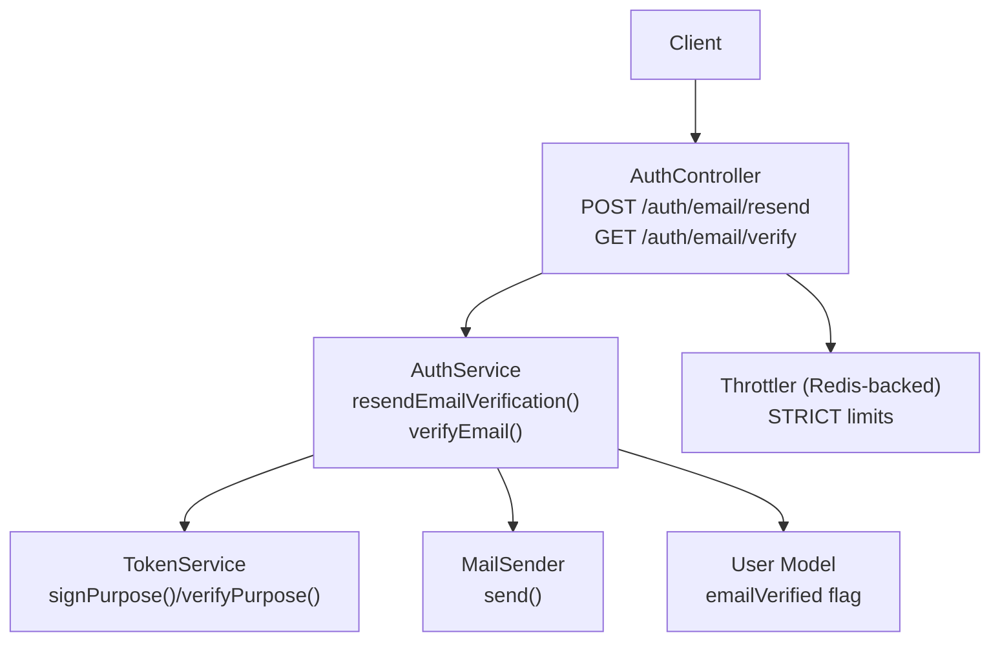
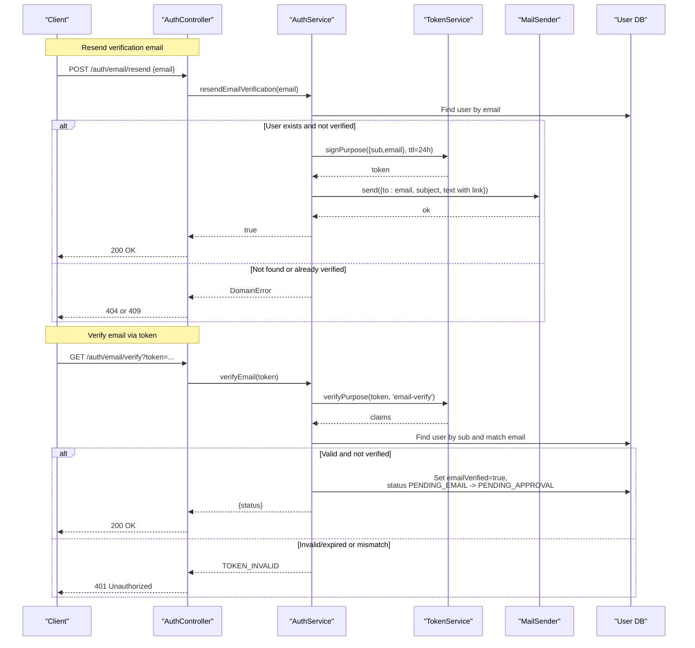
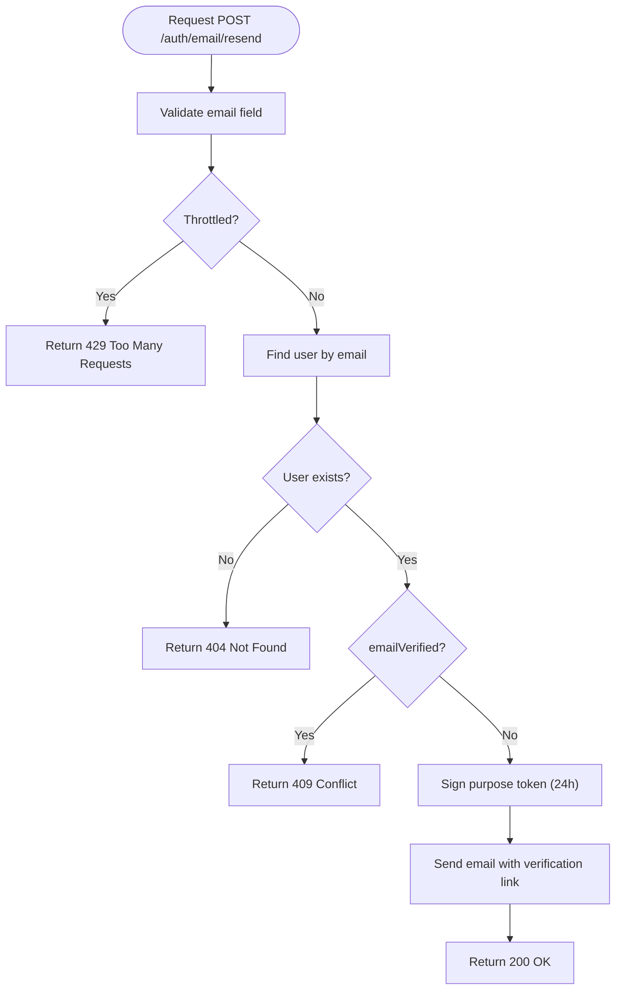
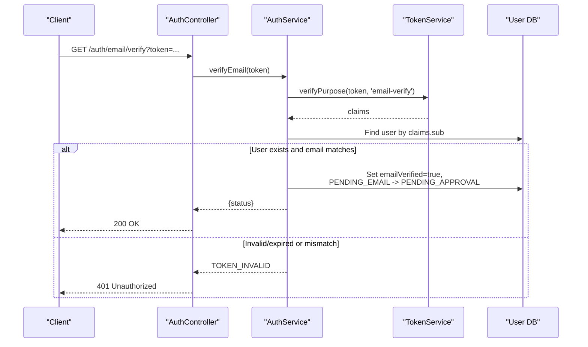
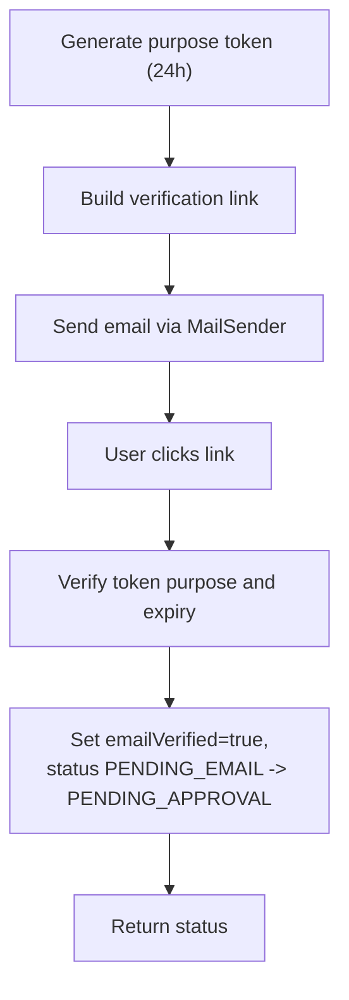
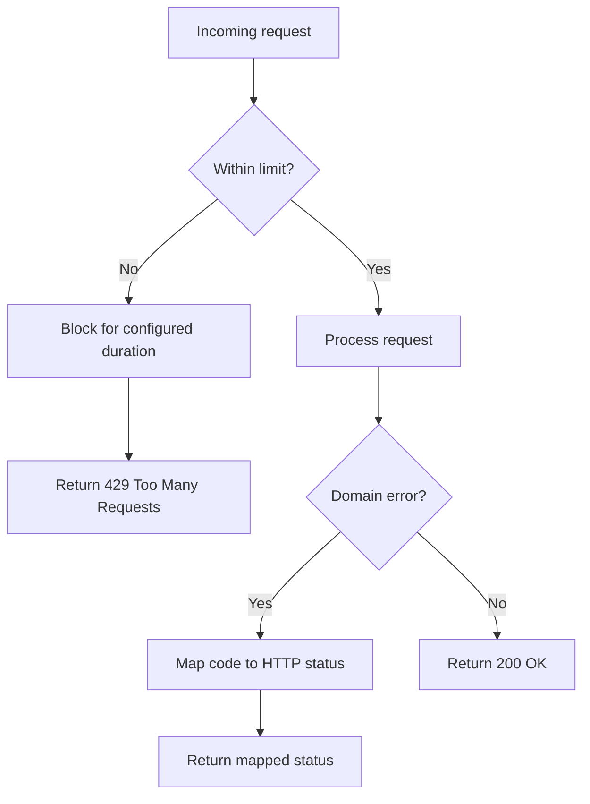
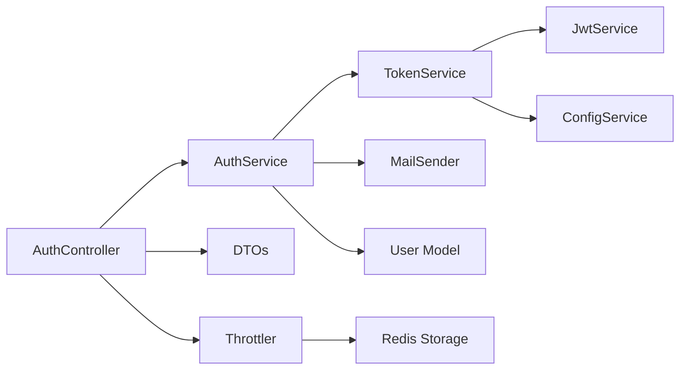

# Email Verification

<cite>
**Referenced Files in This Document**
- [auth.controller.ts](file://backend/apps/api/src/modules/auth/presentation/auth.controller.ts)
- [auth.dtos.ts](file://backend/apps/api/src/modules/auth/presentation/dto/auth.dtos.ts)
- [auth.service.ts](file://backend/apps/api/src/modules/auth/application/auth.service.ts)
- [token.service.ts](file://backend/apps/api/src/modules/auth/infrastructure/token.service.ts)
- [mail.port.ts](file://backend/apps/api/src/modules/auth/infrastructure/mail/mail.port.ts)
- [user.schema.ts](file://backend/apps/api/src/modules/auth/infrastructure/schemas/user.schema.ts)
- [auth.types.ts](file://backend/apps/api/src/modules/auth/domain/auth.types.ts)
- [redis-throttler.storage.ts](file://backend/libs/shared/src/rate-limit/redis-throttler.storage.ts)
</cite>

## Table of Contents
1. [Introduction](#introduction)
2. [Project Structure](#project-structure)
3. [Core Components](#core-components)
4. [Architecture Overview](#architecture-overview)
5. [Detailed Component Analysis](#detailed-component-analysis)
6. [Dependency Analysis](#dependency-analysis)
7. [Performance Considerations](#performance-considerations)
8. [Troubleshooting Guide](#troubleshooting-guide)
9. [Conclusion](#conclusion)
10. [Appendices](#appendices)

## Introduction
This document provides comprehensive API documentation for email verification endpoints, focusing on:
- POST /auth/email/resend to resend a verification email using ResendEmailDto
- GET /auth/email/verify to validate an email verification token using VerifyEmailDto query parameters

It explains the end-to-end email verification workflow, including token generation, email delivery, and verification completion. It also documents rate limiting behavior and error handling, particularly for VERIFICATION_PENDING status during login flows. Finally, it includes example flows and guidance for integrating with email service providers.

## Project Structure
The email verification feature is implemented within the authentication module:
- Presentation layer exposes HTTP endpoints
- Application layer implements business logic
- Infrastructure layer handles tokens, mail sending, and data persistence
- Shared libraries provide rate limiting storage

**Diagram sources**
- [auth.controller.ts:75-84](file://backend/apps/api/src/modules/auth/presentation/auth.controller.ts#L75-L84)
- [auth.service.ts:104-141](file://backend/apps/api/src/modules/auth/application/auth.service.ts#L104-L141)
- [token.service.ts:60-71](file://backend/apps/api/src/modules/auth/infrastructure/token.service.ts#L60-L71)
- [mail.port.ts:3-12](file://backend/apps/api/src/modules/auth/infrastructure/mail/mail.port.ts#L3-L12)
- [user.schema.ts:10-14](file://backend/apps/api/src/modules/auth/infrastructure/schemas/user.schema.ts#L10-L14)
- [redis-throttler.storage.ts:16-54](file://backend/libs/shared/src/rate-limit/redis-throttler.storage.ts#L16-L54)

**Section sources**
- [auth.controller.ts:75-84](file://backend/apps/api/src/modules/auth/presentation/auth.controller.ts#L75-L84)
- [auth.service.ts:104-141](file://backend/apps/api/src/modules/auth/application/auth.service.ts#L104-L141)
- [token.service.ts:60-71](file://backend/apps/api/src/modules/auth/infrastructure/token.service.ts#L60-L71)
- [mail.port.ts:3-12](file://backend/apps/api/src/modules/auth/infrastructure/mail/mail.port.ts#L3-L12)
- [user.schema.ts:10-14](file://backend/apps/api/src/modules/auth/infrastructure/schemas/user.schema.ts#L10-L14)
- [redis-throttler.storage.ts:16-54](file://backend/libs/shared/src/rate-limit/redis-throttler.storage.ts#L16-L54)

## Core Components
- AuthController: Exposes the email verification endpoints and applies strict throttling to prevent abuse.
- AuthService: Implements resend and verify logic, generates purpose-bound JWTs, and updates user verification state.
- TokenService: Signs and verifies short-lived purpose tokens used for email verification links.
- MailSender: Abstraction for sending emails; implementations can be swapped (e.g., SMTP or console).
- User Schema: Stores emailVerified boolean and user status fields that drive flow control.
- Rate Limiting: Redis-backed throttler enforces strict limits on sensitive endpoints.

Key responsibilities:
- Resending verification emails only when the account exists and is not already verified
- Validating purpose-specific tokens and updating verification state atomically
- Returning appropriate HTTP status codes based on domain errors

**Section sources**
- [auth.controller.ts:22-51](file://backend/apps/api/src/modules/auth/presentation/auth.controller.ts#L22-L51)
- [auth.controller.ts:75-84](file://backend/apps/api/src/modules/auth/presentation/auth.controller.ts#L75-L84)
- [auth.service.ts:104-141](file://backend/apps/api/src/modules/auth/application/auth.service.ts#L104-L141)
- [token.service.ts:60-71](file://backend/apps/api/src/modules/auth/infrastructure/token.service.ts#L60-L71)
- [mail.port.ts:3-12](file://backend/apps/api/src/modules/auth/infrastructure/mail/mail.port.ts#L3-L12)
- [user.schema.ts:10-14](file://backend/apps/api/src/modules/auth/infrastructure/schemas/user.schema.ts#L10-L14)
- [auth.types.ts:1-9](file://backend/apps/api/src/modules/auth/domain/auth.types.ts#L1-L9)

## Architecture Overview
The email verification architecture follows a layered approach:
- Controller receives requests, validates DTOs, and delegates to service
- Service orchestrates token signing, email delivery, and database updates
- Token service ensures secure, purpose-bound tokens with TTL
- Mail sender abstraction allows pluggable email providers
- Throttler protects endpoints from brute-force and spam

**Diagram sources**
- [auth.controller.ts:75-84](file://backend/apps/api/src/modules/auth/presentation/auth.controller.ts#L75-L84)
- [auth.service.ts:104-141](file://backend/apps/api/src/modules/auth/application/auth.service.ts#L104-L141)
- [token.service.ts:60-71](file://backend/apps/api/src/modules/auth/infrastructure/token.service.ts#L60-L71)
- [mail.port.ts:3-12](file://backend/apps/api/src/modules/auth/infrastructure/mail/mail.port.ts#L3-L12)
- [user.schema.ts:10-14](file://backend/apps/api/src/modules/auth/infrastructure/schemas/user.schema.ts#L10-L14)

## Detailed Component Analysis

### Endpoint: POST /auth/email/resend
- Purpose: Resend a verification email to the provided address if the account exists and is not yet verified.
- Request body: ResendEmailDto
  - email: string, validated as email format
- Behavior:
  - Validates input via class-validator decorators
  - Applies strict throttling (5/min with block duration)
  - Looks up user by normalized email
  - If user exists and emailVerified is false, generates a purpose-bound JWT valid for 24 hours and sends email via MailSender
  - Returns success or appropriate error
- Responses:
  - 200 OK on successful resend
  - 404 Not Found if no account with this email
  - 409 Conflict if email already verified
  - 429 Too Many Requests if throttled

**Diagram sources**
- [auth.controller.ts:75-79](file://backend/apps/api/src/modules/auth/presentation/auth.controller.ts#L75-L79)
- [auth.dtos.ts:53-56](file://backend/apps/api/src/modules/auth/presentation/dto/auth.dtos.ts#L53-L56)
- [auth.service.ts:104-110](file://backend/apps/api/src/modules/auth/application/auth.service.ts#L104-L110)
- [auth.service.ts:112-121](file://backend/apps/api/src/modules/auth/application/auth.service.ts#L112-L121)
- [redis-throttler.storage.ts:16-54](file://backend/libs/shared/src/rate-limit/redis-throttler.storage.ts#L16-L54)

**Section sources**
- [auth.controller.ts:75-79](file://backend/apps/api/src/modules/auth/presentation/auth.controller.ts#L75-L79)
- [auth.dtos.ts:53-56](file://backend/apps/api/src/modules/auth/presentation/dto/auth.dtos.ts#L53-L56)
- [auth.service.ts:104-121](file://backend/apps/api/src/modules/auth/application/auth.service.ts#L104-L121)
- [redis-throttler.storage.ts:16-54](file://backend/libs/shared/src/rate-limit/redis-throttler.storage.ts#L16-L54)

### Endpoint: GET /auth/email/verify
- Purpose: Validate an email verification token and mark the email as verified.
- Query parameters: VerifyEmailDto
  - token: string, minimum length enforced
- Behavior:
  - Verifies purpose-bound token type and expiration
  - Ensures token’s sub matches a user and email claim matches user’s email
  - Sets emailVerified = true and transitions status from PENDING_EMAIL to PENDING_APPROVAL
  - Returns current user status
- Responses:
  - 200 OK with { status } on success
  - 401 Unauthorized if token invalid or expired
  - Other domain errors mapped to appropriate HTTP statuses

**Diagram sources**
- [auth.controller.ts:81-84](file://backend/apps/api/src/modules/auth/presentation/auth.controller.ts#L81-L84)
- [auth.service.ts:123-141](file://backend/apps/api/src/modules/auth/application/auth.service.ts#L123-L141)
- [token.service.ts:60-71](file://backend/apps/api/src/modules/auth/infrastructure/token.service.ts#L60-L71)
- [user.schema.ts:10-14](file://backend/apps/api/src/modules/auth/infrastructure/schemas/user.schema.ts#L10-L14)

**Section sources**
- [auth.controller.ts:81-84](file://backend/apps/api/src/modules/auth/presentation/auth.controller.ts#L81-L84)
- [auth.service.ts:123-141](file://backend/apps/api/src/modules/auth/application/auth.service.ts#L123-L141)
- [token.service.ts:60-71](file://backend/apps/api/src/modules/auth/infrastructure/token.service.ts#L60-L71)
- [user.schema.ts:10-14](file://backend/apps/api/src/modules/auth/infrastructure/schemas/user.schema.ts#L10-L14)

### Email Verification Workflow
- Token Generation:
  - Purpose-bound JWT signed with RS256, containing sub (userId), typ ('email-verify'), and email
  - TTL set to 24 hours
- Email Delivery:
  - MailSender.send invoked with subject and text containing verification link built from APP_BASE_URL and token
  - Implementation can be SMTP or console-based depending on environment configuration
- Verification Completion:
  - Token verified against expected purpose
  - User record updated to mark emailVerified = true
  - Status transitioned from PENDING_EMAIL to PENDING_APPROVAL (legacy OTP path)

**Diagram sources**
- [auth.service.ts:112-121](file://backend/apps/api/src/modules/auth/application/auth.service.ts#L112-L121)
- [auth.service.ts:123-141](file://backend/apps/api/src/modules/auth/application/auth.service.ts#L123-L141)
- [token.service.ts:60-71](file://backend/apps/api/src/modules/auth/infrastructure/token.service.ts#L60-L71)
- [mail.port.ts:3-12](file://backend/apps/api/src/modules/auth/infrastructure/mail/mail.port.ts#L3-L12)

**Section sources**
- [auth.service.ts:112-141](file://backend/apps/api/src/modules/auth/application/auth.service.ts#L112-L141)
- [token.service.ts:60-71](file://backend/apps/api/src/modules/auth/infrastructure/token.service.ts#L60-L71)
- [mail.port.ts:3-12](file://backend/apps/api/src/modules/auth/infrastructure/mail/mail.port.ts#L3-L12)

### Rate Limiting and Error Handling
- Rate Limiting:
  - Strict throttle applied to email resend endpoint: 5 requests per minute with a 5-minute block duration after exceeding limit
  - Redis-backed storage ensures shared limits across instances
- Error Handling:
  - Domain errors are mapped to HTTP statuses:
    - VERIFICATION_PENDING maps to 403 Forbidden (during login flows)
    - TOKEN_INVALID maps to 401 Unauthorized
    - NOT_FOUND maps to 404 Not Found
    - DUPLICATE maps to 409 Conflict
    - OTP-related limits map to 429 Too Many Requests

**Diagram sources**
- [auth.controller.ts:22-51](file://backend/apps/api/src/modules/auth/presentation/auth.controller.ts#L22-L51)
- [redis-throttler.storage.ts:16-54](file://backend/libs/shared/src/rate-limit/redis-throttler.storage.ts#L16-L54)

**Section sources**
- [auth.controller.ts:22-51](file://backend/apps/api/src/modules/auth/presentation/auth.controller.ts#L22-L51)
- [redis-throttler.storage.ts:16-54](file://backend/libs/shared/src/rate-limit/redis-throttler.storage.ts#L16-L54)

### Integration with Email Service Providers
- The MailSender interface abstracts email delivery, allowing integration with various providers:
  - Implementations can use SMTP or other services by providing a send method
  - Configuration determines which implementation is injected at runtime
- To integrate a new provider:
  - Implement MailSender interface
  - Configure dependency injection to bind the implementation
  - Ensure APP_BASE_URL is set correctly for generating verification links

**Section sources**
- [mail.port.ts:3-12](file://backend/apps/api/src/modules/auth/infrastructure/mail/mail.port.ts#L3-L12)
- [auth.service.ts:112-121](file://backend/apps/api/src/modules/auth/application/auth.service.ts#L112-L121)

## Dependency Analysis
- Controller depends on:
  - AuthService for business logic
  - DTOs for validation
  - Throttler for rate limiting
- Service depends on:
  - TokenService for purpose-bound JWTs
  - MailSender for email delivery
  - User model for persistence
- TokenService depends on:
  - JwtService for signing/verifying
  - ConfigService for keys and TTL settings
- Rate limiting depends on:
  - Redis for distributed throttling state

**Diagram sources**
- [auth.controller.ts:75-84](file://backend/apps/api/src/modules/auth/presentation/auth.controller.ts#L75-L84)
- [auth.service.ts:104-141](file://backend/apps/api/src/modules/auth/application/auth.service.ts#L104-L141)
- [token.service.ts:60-71](file://backend/apps/api/src/modules/auth/infrastructure/token.service.ts#L60-L71)
- [redis-throttler.storage.ts:16-54](file://backend/libs/shared/src/rate-limit/redis-throttler.storage.ts#L16-L54)

**Section sources**
- [auth.controller.ts:75-84](file://backend/apps/api/src/modules/auth/presentation/auth.controller.ts#L75-L84)
- [auth.service.ts:104-141](file://backend/apps/api/src/modules/auth/application/auth.service.ts#L104-L141)
- [token.service.ts:60-71](file://backend/apps/api/src/modules/auth/infrastructure/token.service.ts#L60-L71)
- [redis-throttler.storage.ts:16-54](file://backend/libs/shared/src/rate-limit/redis-throttler.storage.ts#L16-L54)

## Performance Considerations
- Token TTL: Email verification tokens expire after 24 hours to balance security and usability
- Database operations: Single read/write per verification step minimizes latency
- Throttling: Prevents abuse and reduces load on email providers
- Email delivery: Asynchronous send operation avoids blocking response time

[No sources needed since this section provides general guidance]

## Troubleshooting Guide
Common issues and resolutions:
- Token invalid or expired:
  - Cause: Expired token or wrong purpose
  - Resolution: Resend verification email to obtain a fresh token
- Email already verified:
  - Cause: Attempting to verify again
  - Resolution: No action required; proceed to next steps
- Account not found:
  - Cause: Incorrect email or non-existent account
  - Resolution: Confirm email and ensure registration completed
- Rate limited:
  - Cause: Exceeded request limit
  - Resolution: Wait for block duration to expire before retrying
- Login blocked due to VERIFICATION_PENDING:
  - Cause: Incomplete mobile or email verification
  - Resolution: Complete both verifications before attempting login

**Section sources**
- [auth.controller.ts:30-51](file://backend/apps/api/src/modules/auth/presentation/auth.controller.ts#L30-L51)
- [auth.service.ts:104-141](file://backend/apps/api/src/modules/auth/application/auth.service.ts#L104-L141)

## Conclusion
The email verification system provides secure, rate-limited endpoints for resending and validating verification emails. It uses purpose-bound JWTs, integrates with configurable email providers, and enforces clear state transitions for user accounts. Proper error handling and throttling ensure robustness and protection against abuse.

[No sources needed since this section summarizes without analyzing specific files]

## Appendices

### API Definitions
- POST /auth/email/resend
  - Body: ResendEmailDto
    - email: string, email format
  - Responses:
    - 200 OK: true
    - 404 Not Found: No account with this email
    - 409 Conflict: Email already verified
    - 429 Too Many Requests: Rate limited
- GET /auth/email/verify
  - Query: VerifyEmailDto
    - token: string, min length enforced
  - Responses:
    - 200 OK: { status }
    - 401 Unauthorized: Token invalid or expired

**Section sources**
- [auth.controller.ts:75-84](file://backend/apps/api/src/modules/auth/presentation/auth.controller.ts#L75-L84)
- [auth.dtos.ts:53-61](file://backend/apps/api/src/modules/auth/presentation/dto/auth.dtos.ts#L53-L61)
- [auth.service.ts:104-141](file://backend/apps/api/src/modules/auth/application/auth.service.ts#L104-L141)

### Example Flows
- Resend verification email:
  - Client calls POST /auth/email/resend with email
  - Server validates, checks user existence and verification status
  - Generates token and sends email
  - Client receives confirmation
- Verify email:
  - Client opens verification link with token
  - Server validates token and updates user record
  - Client receives updated status

**Section sources**
- [auth.controller.ts:75-84](file://backend/apps/api/src/modules/auth/presentation/auth.controller.ts#L75-L84)
- [auth.service.ts:104-141](file://backend/apps/api/src/modules/auth/application/auth.service.ts#L104-L141)