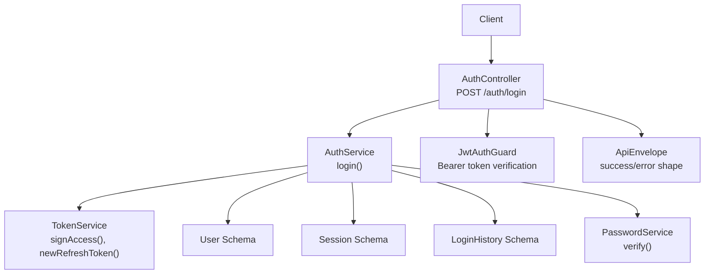
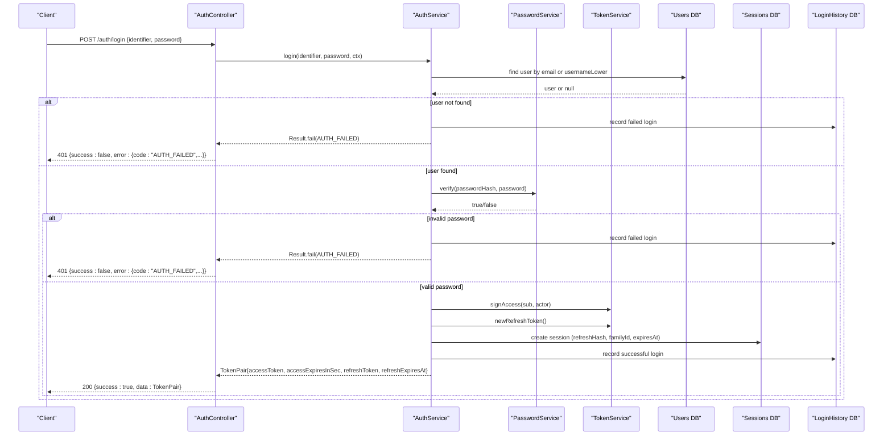
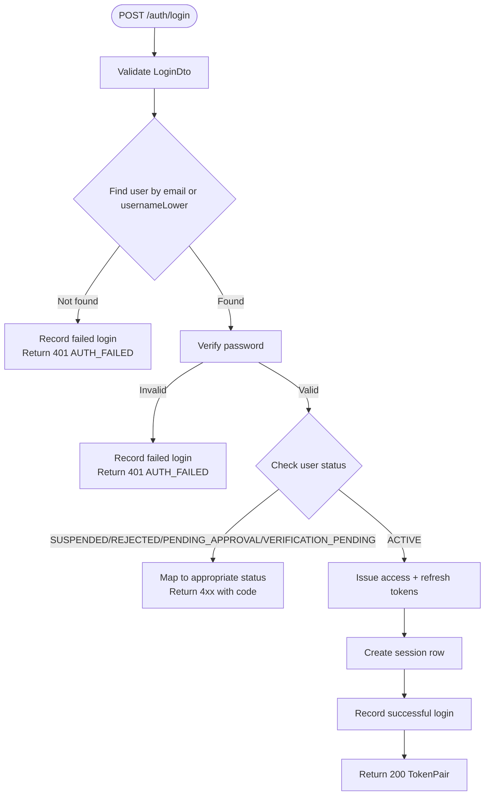
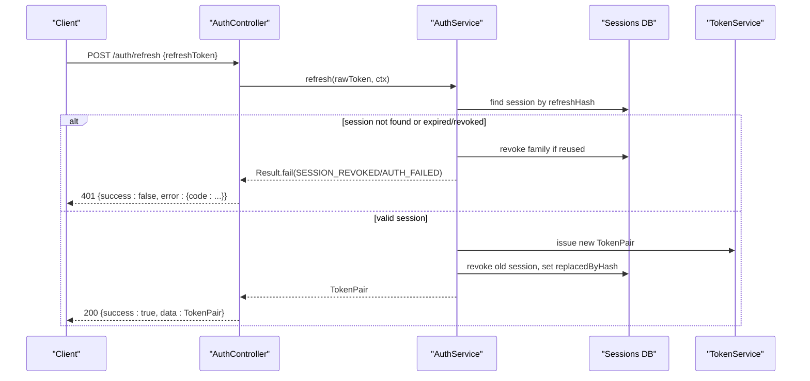
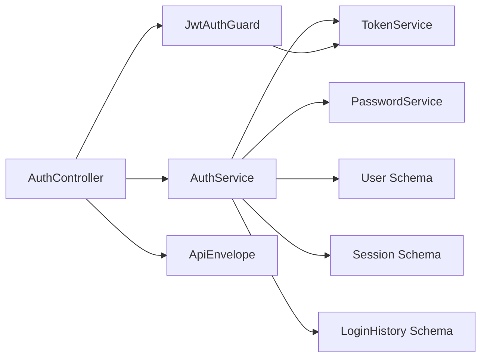

# Login & Authentication

<cite>
**Referenced Files in This Document**
- [auth.controller.ts](file://backend/apps/api/src/modules/auth/presentation/auth.controller.ts)
- [auth.dtos.ts](file://backend/apps/api/src/modules/auth/presentation/dto/auth.dtos.ts)
- [auth.service.ts](file://backend/apps/api/src/modules/auth/application/auth.service.ts)
- [token.service.ts](file://backend/apps/api/src/modules/auth/infrastructure/token.service.ts)
- [auth.types.ts](file://backend/apps/api/src/modules/auth/domain/auth.types.ts)
- [jwt-auth.guard.ts](file://backend/apps/api/src/modules/auth/presentation/jwt-auth.guard.ts)
- [current-principal.decorator.ts](file://backend/apps/api/src/modules/auth/presentation/current-principal.decorator.ts)
- [session.schema.ts](file://backend/apps/api/src/modules/auth/infrastructure/schemas/session.schema.ts)
- [login-history.schema.ts](file://backend/apps/api/src/modules/auth/infrastructure/schemas/login-history.schema.ts)
- [user.schema.ts](file://backend/apps/api/src/modules/auth/infrastructure/schemas/user.schema.ts)
- [password.service.ts](file://backend/apps/api/src/modules/auth/infrastructure/password.service.ts)
- [api-envelope.ts](file://backend/libs/shared/src/http/api-envelope.ts)
- [app-exception.ts](file://backend/libs/shared/src/http/app-exception.ts)
</cite>

## Table of Contents
1. [Introduction](#introduction)
2. [Project Structure](#project-structure)
3. [Core Components](#core-components)
4. [Architecture Overview](#architecture-overview)
5. [Detailed Component Analysis](#detailed-component-analysis)
6. [Dependency Analysis](#dependency-analysis)
7. [Performance Considerations](#performance-considerations)
8. [Troubleshooting Guide](#troubleshooting-guide)
9. [Conclusion](#conclusion)
10. [Appendices](#appendices)

## Introduction
This document provides comprehensive API documentation for login and authentication endpoints, focusing on POST /auth/login with a flexible identifier that supports both email addresses and mobile numbers. It explains JWT token generation, the access token and refresh token flow, session creation, and login history tracking. It also documents response schemas, error handling (including AUTH_FAILED with HTTP 401), and includes curl examples for different identifier types and response handling patterns.

## Project Structure
The authentication feature is implemented as a NestJS module with clear separation:
- Presentation layer: controllers, DTOs, guards, and decorators
- Application layer: business logic for login, refresh, logout, and queries
- Infrastructure layer: data models (MongoDB schemas), password hashing, and JWT token service
- Shared HTTP envelope and exception utilities for consistent responses

**Diagram sources**
- [auth.controller.ts:86-90](file://backend/apps/api/src/modules/auth/presentation/auth.controller.ts#L86-L90)
- [auth.service.ts:145-183](file://backend/apps/api/src/modules/auth/application/auth.service.ts#L145-L183)
- [token.service.ts:42-49](file://backend/apps/api/src/modules/auth/infrastructure/token.service.ts#L42-L49)
- [session.schema.ts:1-47](file://backend/apps/api/src/modules/auth/infrastructure/schemas/session.schema.ts#L1-L47)
- [login-history.schema.ts:1-33](file://backend/apps/api/src/modules/auth/infrastructure/schemas/login-history.schema.ts#L1-L33)
- [user.schema.ts:1-71](file://backend/apps/api/src/modules/auth/infrastructure/schemas/user.schema.ts#L1-L71)
- [password.service.ts:1-26](file://backend/apps/api/src/modules/auth/infrastructure/password.service.ts#L1-L26)
- [api-envelope.ts:1-16](file://backend/libs/shared/src/http/api-envelope.ts#L1-L16)

**Section sources**
- [auth.controller.ts:53-138](file://backend/apps/api/src/modules/auth/presentation/auth.controller.ts#L53-L138)
- [auth.service.ts:28-40](file://backend/apps/api/src/modules/auth/application/auth.service.ts#L28-L40)

## Core Components
- AuthController: Exposes REST endpoints including login, refresh, logout, sessions, and login history.
- AuthService: Implements login, refresh, logout, and related flows; issues tokens and persists sessions and login history.
- TokenService: Generates RS256 JWT access tokens and creates opaque refresh tokens hashed before storage.
- JwtAuthGuard: Validates Bearer tokens and attaches principal to requests.
- DTOs: Validate request payloads, including LoginDto supporting identifiers by email or username/mobile.
- Schemas: Persist users, sessions, and login history records.
- PasswordService: Securely hashes and verifies passwords using Argon2id.
- HTTP Envelope: Standardizes success/failure responses across APIs.

**Section sources**
- [auth.controller.ts:86-137](file://backend/apps/api/src/modules/auth/presentation/auth.controller.ts#L86-L137)
- [auth.service.ts:145-346](file://backend/apps/api/src/modules/auth/application/auth.service.ts#L145-L346)
- [token.service.ts:21-90](file://backend/apps/api/src/modules/auth/infrastructure/token.service.ts#L21-L90)
- [jwt-auth.guard.ts:10-34](file://backend/apps/api/src/modules/auth/presentation/jwt-auth.guard.ts#L10-L34)
- [auth.dtos.ts:63-75](file://backend/apps/api/src/modules/auth/presentation/dto/auth.dtos.ts#L63-L75)
- [session.schema.ts:1-47](file://backend/apps/api/src/modules/auth/infrastructure/schemas/session.schema.ts#L1-L47)
- [login-history.schema.ts:1-33](file://backend/apps/api/src/modules/auth/infrastructure/schemas/login-history.schema.ts#L1-L33)
- [password.service.ts:1-26](file://backend/apps/api/src/modules/auth/infrastructure/password.service.ts#L1-L26)
- [api-envelope.ts:1-16](file://backend/libs/shared/src/http/api-envelope.ts#L1-L16)

## Architecture Overview
The login flow validates credentials, checks account status, issues an access token and refresh token pair, creates a session record, and logs the login attempt. Subsequent requests use the access token via Bearer authentication. Refresh tokens rotate securely and can revoke entire families upon reuse.

**Diagram sources**
- [auth.controller.ts:86-90](file://backend/apps/api/src/modules/auth/presentation/auth.controller.ts#L86-L90)
- [auth.service.ts:145-183](file://backend/apps/api/src/modules/auth/application/auth.service.ts#L145-L183)
- [password.service.ts:18-24](file://backend/apps/api/src/modules/auth/infrastructure/password.service.ts#L18-L24)
- [token.service.ts:42-49](file://backend/apps/api/src/modules/auth/infrastructure/token.service.ts#L42-L49)
- [token.service.ts:73-80](file://backend/apps/api/src/modules/auth/infrastructure/token.service.ts#L73-L80)
- [session.schema.ts:1-47](file://backend/apps/api/src/modules/auth/infrastructure/schemas/session.schema.ts#L1-L47)
- [login-history.schema.ts:1-33](file://backend/apps/api/src/modules/auth/infrastructure/schemas/login-history.schema.ts#L1-L33)

## Detailed Component Analysis

### POST /auth/login
- Purpose: Authenticate a user using either an email address or a mobile number (via username lookup). Returns a token pair and sets up session and login history.
- Request body schema (LoginDto):
  - identifier: string (4–254 chars). Supports email or username/mobile-based identifiers.
  - password: string (8–72 chars).
- Success response (HTTP 200):
  - success: true
  - data: TokenPair
    - accessToken: string (RS256 JWT)
    - accessExpiresInSec: number (seconds until expiration)
    - refreshToken: string (opaque, rotated per use)
    - refreshExpiresAt: string (ISO timestamp)
- Failure responses:
  - HTTP 401 Unauthorized when AUTH_FAILED occurs (invalid credentials or invalid session).
  - Other statuses mapped from domain codes (e.g., SUSPENDED -> 403, NOT_FOUND -> 404).

**Diagram sources**
- [auth.controller.ts:86-90](file://backend/apps/api/src/modules/auth/presentation/auth.controller.ts#L86-L90)
- [auth.service.ts:145-183](file://backend/apps/api/src/modules/auth/application/auth.service.ts#L145-L183)
- [auth.dtos.ts:63-70](file://backend/apps/api/src/modules/auth/presentation/dto/auth.dtos.ts#L63-L70)
- [api-envelope.ts:1-16](file://backend/libs/shared/src/http/api-envelope.ts#L1-L16)

**Section sources**
- [auth.controller.ts:86-90](file://backend/apps/api/src/modules/auth/presentation/auth.controller.ts#L86-L90)
- [auth.service.ts:145-183](file://backend/apps/api/src/modules/auth/application/auth.service.ts#L145-L183)
- [auth.dtos.ts:63-70](file://backend/apps/api/src/modules/auth/presentation/dto/auth.dtos.ts#L63-L70)
- [api-envelope.ts:1-16](file://backend/libs/shared/src/http/api-envelope.ts#L1-L16)

### POST /auth/refresh
- Purpose: Rotate refresh tokens securely. On successful rotation, the previous refresh token is revoked and a new pair is issued. Reuse of a revoked token revokes the entire session family.
- Request body schema (RefreshDto):
  - refreshToken: string (min length 32)
- Success response (HTTP 200):
  - success: true
  - data: TokenPair (new access and refresh tokens)
- Failure responses:
  - HTTP 401 Unauthorized when AUTH_FAILED or SESSION_REVOKED occurs.

**Diagram sources**
- [auth.controller.ts:92-96](file://backend/apps/api/src/modules/auth/presentation/auth.controller.ts#L92-L96)
- [auth.service.ts:190-216](file://backend/apps/api/src/modules/auth/application/auth.service.ts#L190-L216)
- [session.schema.ts:1-47](file://backend/apps/api/src/modules/auth/infrastructure/schemas/session.schema.ts#L1-L47)
- [token.service.ts:73-80](file://backend/apps/api/src/modules/auth/infrastructure/token.service.ts#L73-L80)

**Section sources**
- [auth.controller.ts:92-96](file://backend/apps/api/src/modules/auth/presentation/auth.controller.ts#L92-L96)
- [auth.service.ts:190-216](file://backend/apps/api/src/modules/auth/application/auth.service.ts#L190-L216)

### POST /auth/logout and POST /auth/logout-all
- Purpose: Invalidate current refresh token or all active sessions for the authenticated user.
- Behavior: Marks session(s) as revoked so they cannot be used again.

**Section sources**
- [auth.controller.ts:98-107](file://backend/apps/api/src/modules/auth/presentation/auth.controller.ts#L98-L107)
- [auth.service.ts:218-232](file://backend/apps/api/src/modules/auth/application/auth.service.ts#L218-L232)

### GET /auth/me, GET /auth/sessions, GET /auth/login-history
- Purpose: Retrieve current user profile, active sessions, and recent login attempts for auditing and security monitoring.
- Access: Protected by JwtAuthGuard requiring a valid Bearer token.

**Section sources**
- [auth.controller.ts:121-137](file://backend/apps/api/src/modules/auth/presentation/auth.controller.ts#L121-L137)
- [auth.service.ts:273-294](file://backend/apps/api/src/modules/auth/application/auth.service.ts#L273-L294)

### JWT Token Generation and Claims
- Access tokens:
  - Algorithm: RS256
  - Claims include sub (user ID), actor (USER/EMPLOYEE), typ ("access"), optional roles
  - TTL configured via application config
- Refresh tokens:
  - Opaque random strings
  - Stored only as SHA-256 hash
  - Rotated on each use; reuse triggers family-wide revocation
- Purpose tokens:
  - Used for email verification and password reset links with short TTLs

**Section sources**
- [token.service.ts:21-90](file://backend/apps/api/src/modules/auth/infrastructure/token.service.ts#L21-L90)
- [auth.types.ts:26-38](file://backend/apps/api/src/modules/auth/domain/auth.types.ts#L26-L38)

### Session Creation and Rotation
- Each successful login creates a session row with:
  - principalId, actor, refreshHash, familyId, deviceId, ip, userAgent, expiresAt
- Rotation:
  - Old session marked revoked and linked to new refresh token hash
  - Reuse of revoked token revokes entire family for theft protection

**Section sources**
- [auth.service.ts:298-316](file://backend/apps/api/src/modules/auth/application/auth.service.ts#L298-L316)
- [session.schema.ts:1-47](file://backend/apps/api/src/modules/auth/infrastructure/schemas/session.schema.ts#L1-L47)

### Login History Tracking
- Records every login attempt with:
  - principalId, actor, success flag, failureReason (if any), ip, userAgent, deviceId, at timestamp
- Used for auditing and detecting new devices

**Section sources**
- [auth.service.ts:318-328](file://backend/apps/api/src/modules/auth/application/auth.service.ts#L318-L328)
- [login-history.schema.ts:1-33](file://backend/apps/api/src/modules/auth/infrastructure/schemas/login-history.schema.ts#L1-L33)

### Error Handling and Status Codes
- Domain errors map to HTTP statuses:
  - AUTH_FAILED, SESSION_REVOKED, TOKEN_INVALID -> 401 Unauthorized
  - SUSPENDED, VERIFICATION_PENDING, APPROVAL_PENDING, REJECTED -> 403 Forbidden
  - NOT_FOUND -> 404 Not Found
  - DUPLICATE -> 409 Conflict
  - OTP limits -> 429 Too Many Requests
- Responses follow ApiEnvelope structure with success flag and error details

**Section sources**
- [auth.controller.ts:25-51](file://backend/apps/api/src/modules/auth/presentation/auth.controller.ts#L25-L51)
- [api-envelope.ts:1-16](file://backend/libs/shared/src/http/api-envelope.ts#L1-L16)
- [app-exception.ts:1-19](file://backend/libs/shared/src/http/app-exception.ts#L1-L19)

## Dependency Analysis
Authentication depends on:
- Controllers depend on services for business logic
- Services depend on infrastructure components (schemas, token service, password service)
- Guards validate tokens using token service
- Shared envelope and exceptions standardize responses

**Diagram sources**
- [auth.controller.ts:53-138](file://backend/apps/api/src/modules/auth/presentation/auth.controller.ts#L53-L138)
- [auth.service.ts:28-40](file://backend/apps/api/src/modules/auth/application/auth.service.ts#L28-L40)
- [token.service.ts:21-90](file://backend/apps/api/src/modules/auth/infrastructure/token.service.ts#L21-L90)
- [password.service.ts:1-26](file://backend/apps/api/src/modules/auth/infrastructure/password.service.ts#L1-L26)
- [jwt-auth.guard.ts:10-34](file://backend/apps/api/src/modules/auth/presentation/jwt-auth.guard.ts#L10-L34)
- [api-envelope.ts:1-16](file://backend/libs/shared/src/http/api-envelope.ts#L1-L16)

**Section sources**
- [auth.controller.ts:53-138](file://backend/apps/api/src/modules/auth/presentation/auth.controller.ts#L53-L138)
- [auth.service.ts:28-40](file://backend/apps/api/src/modules/auth/application/auth.service.ts#L28-L40)

## Performance Considerations
- Rate limiting: Strict throttling applied to credential and OTP endpoints to prevent abuse.
- Token TTLs: Configurable access token TTL and refresh token TTL ensure balanced security and usability.
- Database indexes: Sessions and login history have indexes for efficient querying and cleanup.
- Password hashing: Argon2id parameters tuned for secure verification without excessive overhead.

[No sources needed since this section provides general guidance]

## Troubleshooting Guide
Common issues and resolutions:
- Invalid credentials:
  - Ensure identifier matches registered email or username/mobile
  - Verify password meets requirements
  - Response: HTTP 401 with code AUTH_FAILED
- Account suspended or pending approval:
  - Contact support or complete required verification steps
  - Response: HTTP 403 with appropriate code
- Expired or reused refresh token:
  - Re-login to obtain new tokens
  - Response: HTTP 401 with code SESSION_REVOKED or AUTH_FAILED
- New device detection:
  - Security email sent; verify activity and reset password if suspicious

**Section sources**
- [auth.controller.ts:25-51](file://backend/apps/api/src/modules/auth/presentation/auth.controller.ts#L25-L51)
- [auth.service.ts:145-183](file://backend/apps/api/src/modules/auth/application/auth.service.ts#L145-L183)
- [api-envelope.ts:1-16](file://backend/libs/shared/src/http/api-envelope.ts#L1-L16)

## Conclusion
The authentication system provides robust login capabilities supporting multiple identifiers, secure JWT-based access tokens, rotating refresh tokens with theft protection, comprehensive session management, and detailed login history tracking. Errors are consistently handled with stable codes and appropriate HTTP statuses, ensuring predictable client behavior.

[No sources needed since this section summarizes without analyzing specific files]

## Appendices

### API Reference: POST /auth/login
- Endpoint: POST /auth/login
- Request body (LoginDto):
  - identifier: string (email or username/mobile)
  - password: string
- Success response (HTTP 200):
  - success: true
  - data:
    - accessToken: string
    - accessExpiresInSec: number
    - refreshToken: string
    - refreshExpiresAt: string
- Failure responses:
  - HTTP 401 Unauthorized:
    - success: false
    - error:
      - code: "AUTH_FAILED"
      - message: "Invalid credentials"
      - details: optional

**Section sources**
- [auth.controller.ts:86-90](file://backend/apps/api/src/modules/auth/presentation/auth.controller.ts#L86-L90)
- [auth.service.ts:145-183](file://backend/apps/api/src/modules/auth/application/auth.service.ts#L145-L183)
- [auth.dtos.ts:63-70](file://backend/apps/api/src/modules/auth/presentation/dto/auth.dtos.ts#L63-L70)
- [api-envelope.ts:1-16](file://backend/libs/shared/src/http/api-envelope.ts#L1-L16)

### Curl Examples

- Login with email:
  - curl -X POST https://api.example.com/auth/login \
    -H "Content-Type: application/json" \
    -H "X-Device-Id: your-device-id" \
    -d '{"identifier":"user@example.com","password":"YourStrongPass1"}'

- Login with mobile number (username/mobile identifier):
  - curl -X POST https://api.example.com/auth/login \
    -H "Content-Type: application/json" \
    -H "X-Device-Id: your-device-id" \
    -d '{"identifier":"john_doe","password":"YourStrongPass1"}'

- Handle response:
  - Success: Extract accessToken and set Authorization: Bearer <accessToken> for subsequent requests
  - Failure: Inspect error.code and error.message; handle 401 by prompting re-login

**Section sources**
- [auth.controller.ts:86-90](file://backend/apps/api/src/modules/auth/presentation/auth.controller.ts#L86-L90)
- [auth.service.ts:145-183](file://backend/apps/api/src/modules/auth/application/auth.service.ts#L145-L183)
- [api-envelope.ts:1-16](file://backend/libs/shared/src/http/api-envelope.ts#L1-L16)