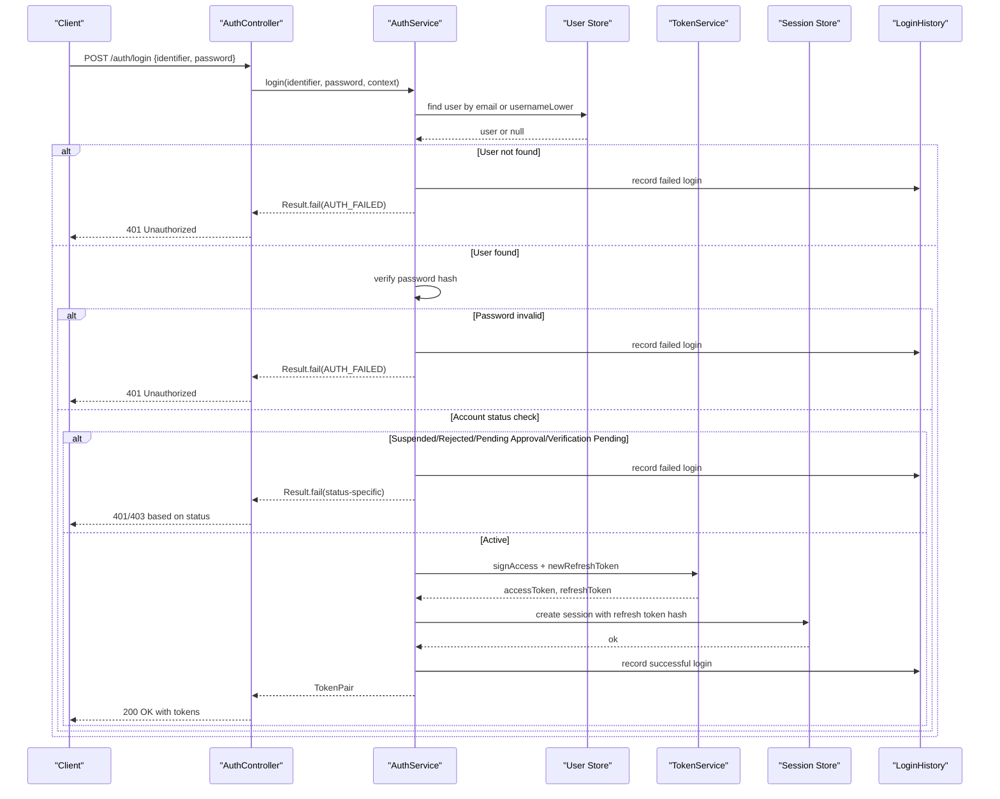

# Login Endpoint

<cite>
**Referenced Files in This Document**
- [auth.controller.ts](file://backend/apps/api/src/modules/auth/presentation/auth.controller.ts)
- [auth.dtos.ts](file://backend/apps/api/src/modules/auth/presentation/dto/auth.dtos.ts)
- [auth.service.ts](file://backend/apps/api/src/modules/auth/application/auth.service.ts)
- [token.service.ts](file://backend/apps/api/src/modules/auth/infrastructure/token.service.ts)
- [login-history.schema.ts](file://backend/apps/api/src/modules/auth/infrastructure/schemas/login-history.schema.ts)
- [auth.types.ts](file://backend/apps/api/src/modules/auth/domain/auth.types.ts)
- [app-exception.ts](file://backend/libs/shared/src/http/app-exception.ts)
- [redis-throttler.storage.ts](file://backend/libs/shared/src/rate-limit/redis-throttler.storage.ts)
- [current-principal.decorator.ts](file://backend/apps/api/src/modules/auth/presentation/current-principal.decorator.ts)
</cite>

## Table of Contents
1. [Introduction](#introduction)
2. [Endpoint Summary](#endpoint-summary)
3. [Request Schema: LoginDto](#request-schema-localedto)
4. [Authentication Flow](#authentication-flow)
5. [Response Model](#response-model)
6. [Error Responses](#error-responses)
7. [Rate Limiting](#rate-limiting)
8. [Examples](#examples)
9. [Security Notes](#security-notes)
10. [Troubleshooting](#troubleshooting)
11. [Conclusion](#conclusion)

## Introduction
This document provides detailed API documentation for the POST /auth/login endpoint. It explains how clients authenticate using either an email or a mobile number as the identifier, along with a password. On success, the endpoint returns both access and refresh tokens and records login history. On failure, it returns appropriate HTTP status codes and error details.

## Endpoint Summary
- Method: POST
- Path: /auth/login
- Authentication: None (public endpoint)
- Rate limit: Strict throttle configuration applied to this endpoint

The controller applies a strict throttling policy that limits requests to 5 per minute and blocks further attempts for 5 minutes after exceeding the limit.

**Section sources**
- [auth.controller.ts:22-23](file://backend/apps/api/src/modules/auth/presentation/auth.controller.ts#L22-L23)
- [auth.controller.ts:86-90](file://backend/apps/api/src/modules/auth/presentation/auth.controller.ts#L86-L90)

## Request Schema: LoginDto
The request body must conform to the LoginDto schema. The identifier field supports both email addresses and mobile numbers.

- identifier: string, length 4–254 characters. Accepts email addresses or usernames/mobile identifiers.
- password: string, length 8–72 characters.

Notes:
- If the identifier contains an “@” character, it is treated as an email address.
- Otherwise, it is treated as a username or mobile identifier depending on your user model.

Validation rules are enforced by class-validator decorators defined in the DTO file.

**Section sources**
- [auth.dtos.ts:63-70](file://backend/apps/api/src/modules/auth/presentation/dto/auth.dtos.ts#L63-L70)

## Authentication Flow
The authentication flow validates credentials, checks account status, creates a session, generates JWT tokens, and records login history.

Key behaviors:
- Identifier resolution: if the identifier includes “@”, it queries by email; otherwise, it queries by usernameLower.
- Credential validation: password is verified against the stored hash.
- Status checks: accounts that are suspended, rejected, pending approval, or verification-pending are denied with appropriate domain errors.
- Session creation: a session row is created storing the hashed refresh token and device/IP metadata.
- Token generation: RS256-signed access token and opaque refresh token are issued.
- Login history: every attempt (success or failure) is recorded with IP, user agent, device ID, and outcome.

**Diagram sources**
- [auth.controller.ts:86-90](file://backend/apps/api/src/modules/auth/presentation/auth.controller.ts#L86-L90)
- [auth.service.ts:145-183](file://backend/apps/api/src/modules/auth/application/auth.service.ts#L145-L183)
- [token.service.ts:42-49](file://backend/apps/api/src/modules/auth/infrastructure/token.service.ts#L42-L49)
- [token.service.ts:73-80](file://backend/apps/api/src/modules/auth/infrastructure/token.service.ts#L73-L80)
- [login-history.schema.ts:4-27](file://backend/apps/api/src/modules/auth/infrastructure/schemas/login-history.schema.ts#L4-L27)

**Section sources**
- [auth.service.ts:145-183](file://backend/apps/api/src/modules/auth/application/auth.service.ts#L145-L183)
- [auth.service.ts:298-316](file://backend/apps/api/src/modules/auth/application/auth.service.ts#L298-L316)
- [auth.service.ts:318-328](file://backend/apps/api/src/modules/auth/application/auth.service.ts#L318-L328)
- [token.service.ts:42-49](file://backend/apps/api/src/modules/auth/infrastructure/token.service.ts#L42-L49)
- [token.service.ts:73-80](file://backend/apps/api/src/modules/auth/infrastructure/token.service.ts#L73-L80)
- [login-history.schema.ts:4-27](file://backend/apps/api/src/modules/auth/infrastructure/schemas/login-history.schema.ts#L4-L27)

## Response Model
On successful authentication, the response contains a token pair and related metadata.

Fields:
- accessToken: string — RS256 JWT containing sub, actor, typ, and optional roles.
- accessExpiresInSec: number — TTL in seconds for the access token.
- refreshToken: string — Opaque random token used to obtain new access tokens.
- refreshExpiresAt: string — ISO timestamp indicating when the refresh token expires.

These fields are produced by the service’s token issuance logic and represent the standard token structure for authenticated sessions.

**Section sources**
- [auth.types.ts:26-38](file://backend/apps/api/src/modules/auth/domain/auth.types.ts#L26-L38)
- [auth.service.ts:298-316](file://backend/apps/api/src/modules/auth/application/auth.service.ts#L298-L316)
- [token.service.ts:42-49](file://backend/apps/api/src/modules/auth/infrastructure/token.service.ts#L42-L49)
- [token.service.ts:73-80](file://backend/apps/api/src/modules/auth/infrastructure/token.service.ts#L73-L80)

## Error Responses
The endpoint maps domain errors to HTTP status codes and returns structured error responses.

Common statuses:
- 401 Unauthorized: AUTH_FAILED, SESSION_REVOKED, TOKEN_INVALID
- 403 Forbidden: SUSPENDED, VERIFICATION_PENDING, APPROVAL_PENDING, REJECTED
- 404 Not Found: NOT_FOUND
- 409 Conflict: DUPLICATE
- 429 Too Many Requests: OTP_HOURLY_LIMIT, OTP_COOLDOWN

For login specifically:
- Invalid credentials return 401 with code AUTH_FAILED.
- Suspended or rejected accounts return 403 with corresponding codes.
- Pending approval or verification returns 403 with appropriate codes.

The mapping is handled centrally in the controller’s status helper and wrapped via AppException.

**Section sources**
- [auth.controller.ts:25-51](file://backend/apps/api/src/modules/auth/presentation/auth.controller.ts#L25-L51)
- [auth.service.ts:151-177](file://backend/apps/api/src/modules/auth/application/auth.service.ts#L151-L177)
- [app-exception.ts:4-17](file://backend/libs/shared/src/http/app-exception.ts#L4-L17)

## Rate Limiting
The login endpoint uses a strict throttle configuration:
- Limit: 5 requests per minute
- Block duration: 5 minutes after exceeding the limit

This is implemented via the @nestjs/throttler decorator with a custom Redis-backed storage that enforces global limits across instances and supports blocking.

Behavior:
- After 5 requests within a 60-second window, subsequent requests are blocked for 5 minutes.
- The block is tracked in Redis and shared across all API instances.

**Section sources**
- [auth.controller.ts:22-23](file://backend/apps/api/src/modules/auth/presentation/auth.controller.ts#L22-L23)
- [auth.controller.ts:86-90](file://backend/apps/api/src/modules/auth/presentation/auth.controller.ts#L86-L90)
- [redis-throttler.storage.ts:7-10](file://backend/libs/shared/src/rate-limit/redis-throttler.storage.ts#L7-L10)
- [redis-throttler.storage.ts:16-54](file://backend/libs/shared/src/rate-limit/redis-throttler.storage.ts#L16-L54)

## Examples
Below are curl examples demonstrating login with different identifier formats. Replace placeholders with actual values.

- Login with email identifier:
  - curl -X POST https://your-api-domain/auth/login -H "Content-Type: application/json" -d '{"identifier":"user@example.com","password":"YourPassword1"}'

- Login with mobile number identifier:
  - curl -X POST https://your-api-domain/auth/login -H "Content-Type: application/json" -d '{"identifier":"+91XXXXXXXXXX","password":"YourPassword1"}'

Expected successful response (example structure):
{
  "accessToken": "eyJhbGciOiJSUzI1NiIs...",
  "accessExpiresInSec": 3600,
  "refreshToken": "aBcDeFgHiJkLmNoPqRsTuVwXyZ...",
  "refreshExpiresAt": "2025-01-01T00:00:00.000Z"
}

Expected error responses:
- 401 Unauthorized:
  {
    "statusCode": 401,
    "message": "Invalid credentials",
    "code": "AUTH_FAILED"
  }
- 403 Forbidden (e.g., account suspended):
  {
    "statusCode": 403,
    "message": "Account suspended. Contact support.",
    "code": "SUSPENDED"
  }
- 429 Too Many Requests (rate limited):
  {
    "statusCode": 429,
    "message": "Too many requests",
    "code": "OTP_HOURLY_LIMIT"
  }

Note: Actual envelope formatting may vary based on global exception handling and response wrapping.

[No sources needed since this section provides example payloads without analyzing specific files]

## Security Notes
- Access tokens are RS256-signed JWTs with short TTLs configured via application settings.
- Refresh tokens are opaque, randomly generated strings and are persisted only as SHA-256 hashes.
- Sessions store hashed refresh tokens and include device, IP, and user agent metadata.
- Login history records both successful and failed attempts with contextual data for auditing and security monitoring.
- New device detection triggers email notifications to inform users of sign-ins from unrecognized devices.

**Section sources**
- [token.service.ts:42-49](file://backend/apps/api/src/modules/auth/infrastructure/token.service.ts#L42-L49)
- [token.service.ts:73-80](file://backend/apps/api/src/modules/auth/infrastructure/token.service.ts#L73-L80)
- [auth.service.ts:298-316](file://backend/apps/api/src/modules/auth/application/auth.service.ts#L298-L316)
- [auth.service.ts:318-328](file://backend/apps/api/src/modules/auth/application/auth.service.ts#L318-L328)
- [auth.service.ts:330-344](file://backend/apps/api/src/modules/auth/application/auth.service.ts#L330-L344)

## Troubleshooting
Common issues and resolutions:
- Invalid credentials: Ensure the identifier matches the registered email or username/mobile and that the password is correct. Check for case sensitivity and leading/trailing spaces.
- Account status issues: If the account is suspended, rejected, or pending approval/verification, resolve the account state before attempting login.
- Rate limiting: If you receive 429 Too Many Requests, wait for the block duration to expire or reduce request frequency.
- Device/User-Agent headers: For accurate login history and new device detection, include x-device-id and user-agent headers in requests.

**Section sources**
- [auth.controller.ts:25-51](file://backend/apps/api/src/modules/auth/presentation/auth.controller.ts#L25-L51)
- [auth.service.ts:151-177](file://backend/apps/api/src/modules/auth/application/auth.service.ts#L151-L177)
- [redis-throttler.storage.ts:16-54](file://backend/libs/shared/src/rate-limit/redis-throttler.storage.ts#L16-L54)
- [current-principal.decorator.ts:10-16](file://backend/apps/api/src/modules/auth/presentation/current-principal.decorator.ts#L10-L16)

## Conclusion
The POST /auth/login endpoint provides secure authentication using flexible identifiers (email or mobile) and robust error handling. It issues short-lived access tokens and long-lived refresh tokens while maintaining comprehensive audit trails through login history. Strict rate limiting protects against brute-force attacks, and new device notifications enhance security awareness. Clients should handle 401/403/429 responses appropriately and ensure they send required headers for optimal tracking and security features.

[No sources needed since this section summarizes without analyzing specific files]