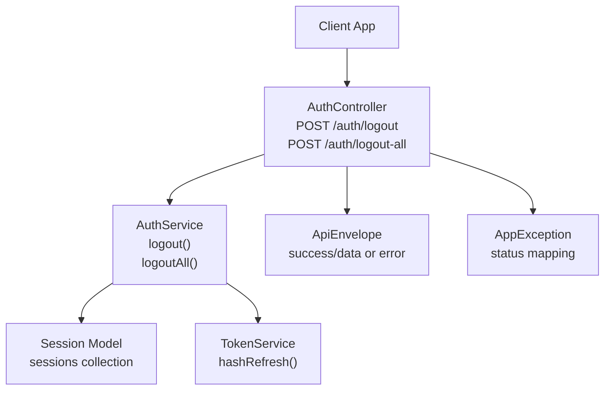
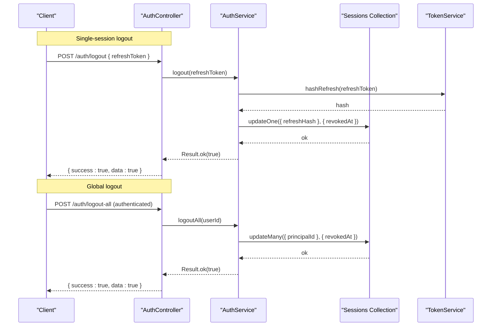
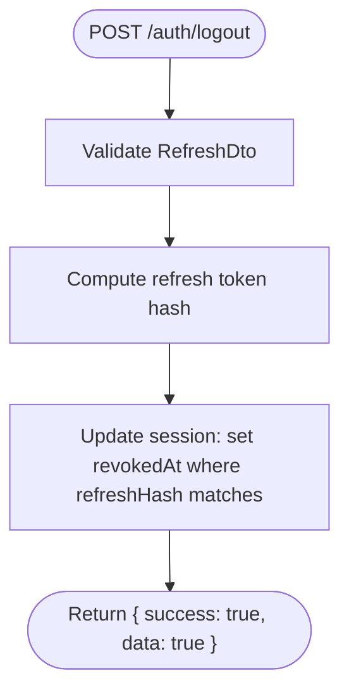
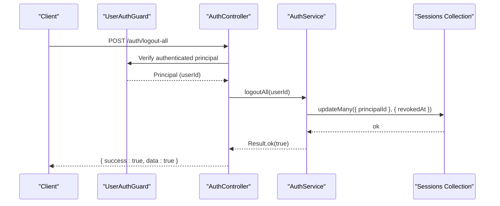
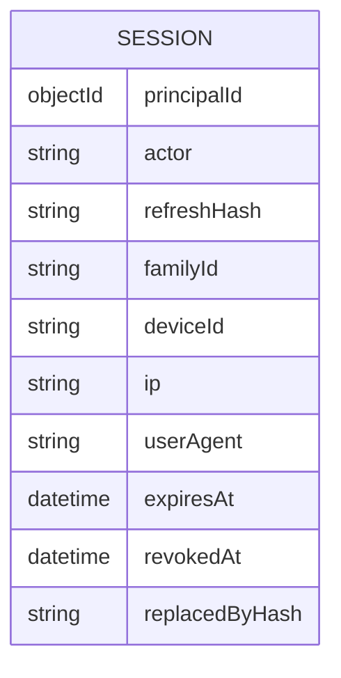
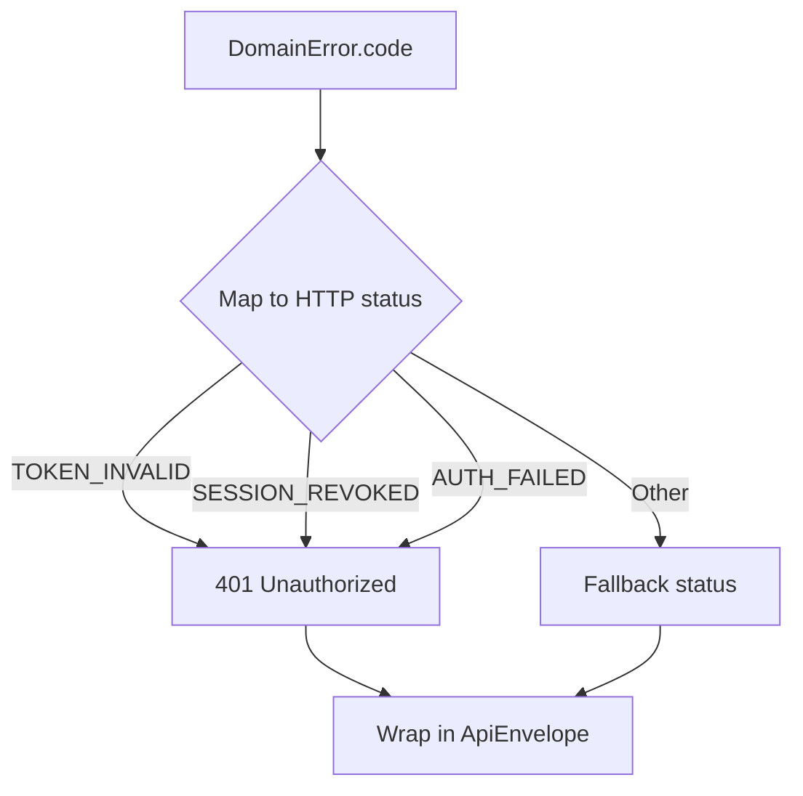
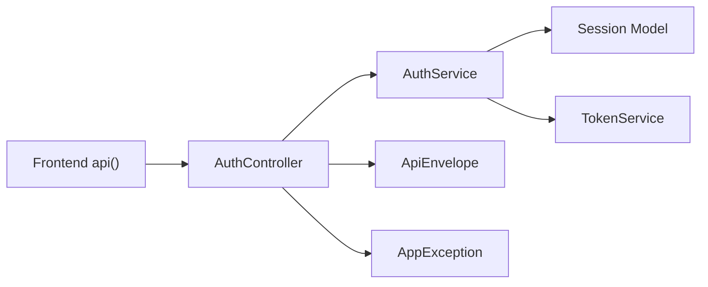

# Logout Operations

<cite>
**Referenced Files in This Document**
- [auth.controller.ts](file://backend/apps/api/src/modules/auth/presentation/auth.controller.ts)
- [auth.service.ts](file://backend/apps/api/src/modules/auth/application/auth.service.ts)
- [auth.dtos.ts](file://backend/apps/api/src/modules/auth/presentation/dto/auth.dtos.ts)
- [session.schema.ts](file://backend/apps/api/src/modules/auth/infrastructure/schemas/session.schema.ts)
- [token.service.ts](file://backend/apps/api/src/modules/auth/infrastructure/token.service.ts)
- [api-envelope.ts](file://backend/libs/shared/src/http/api-envelope.ts)
- [app-exception.ts](file://backend/libs/shared/src/http/app-exception.ts)
- [auth.ts](file://frontend/trader/src/lib/auth.ts)
- [api.ts](file://frontend/trader/src/lib/api.ts)
</cite>

## Table of Contents
1. Introduction
2. Project Structure
3. Core Components
4. Architecture Overview
5. Detailed Component Analysis
6. Dependency Analysis
7. Performance Considerations
8. Troubleshooting Guide
9. Conclusion
10. Appendices

## Introduction
This document provides detailed API documentation for logout operations, focusing on:
- POST /auth/logout: single-session logout that invalidates a specific refresh token
- POST /auth/logout-all: global logout across all devices requiring an authenticated user context

It explains how sessions are revoked, how tokens are handled, and the differences between single-session and global logout. It also documents request/response schemas, error handling, and client-side implementation examples for safe logout flows and session cleanup.

## Project Structure
Logout functionality is implemented in the authentication module with clear separation between presentation (controller), application (service), infrastructure (schemas and token utilities), and shared HTTP envelope/error types. The frontend includes helpers to manage local session storage and make authenticated requests.

**Diagram sources**
- [auth.controller.ts:98-107](file://backend/apps/api/src/modules/auth/presentation/auth.controller.ts#L98-L107)
- [auth.service.ts:218-232](file://backend/apps/api/src/modules/auth/application/auth.service.ts#L218-L232)
- [session.schema.ts:1-47](file://backend/apps/api/src/modules/auth/infrastructure/schemas/session.schema.ts#L1-L47)
- [token.service.ts:73-84](file://backend/apps/api/src/modules/auth/infrastructure/token.service.ts#L73-L84)
- [api-envelope.ts:1-16](file://backend/libs/shared/src/http/api-envelope.ts#L1-L16)
- [app-exception.ts:1-19](file://backend/libs/shared/src/http/app-exception.ts#L1-L19)

**Section sources**
- [auth.controller.ts:98-107](file://backend/apps/api/src/modules/auth/presentation/auth.controller.ts#L98-L107)
- [auth.service.ts:218-232](file://backend/apps/api/src/modules/auth/application/auth.service.ts#L218-L232)
- [session.schema.ts:1-47](file://backend/apps/api/src/modules/auth/infrastructure/schemas/session.schema.ts#L1-L47)
- [token.service.ts:73-84](file://backend/apps/api/src/modules/auth/infrastructure/token.service.ts#L73-L84)
- [api-envelope.ts:1-16](file://backend/libs/shared/src/http/api-envelope.ts#L1-L16)
- [app-exception.ts:1-19](file://backend/libs/shared/src/http/app-exception.ts#L1-L19)

## Core Components
- AuthController exposes:
  - POST /auth/logout accepting a refresh token to revoke a single session
  - POST /auth/logout-all protected by UserAuthGuard, revoking all active sessions for the current user
- AuthService implements:
  - logout(rawToken): marks the matching session as revoked
  - logoutAll(userId): marks all non-revoked sessions for the user as revoked
- Session schema stores hashed refresh tokens and metadata; revokedAt indicates invalidation
- TokenService hashes refresh tokens for secure server-side lookup
- Shared HTTP envelope wraps responses; exceptions map domain errors to HTTP status codes

**Section sources**
- [auth.controller.ts:98-107](file://backend/apps/api/src/modules/auth/presentation/auth.controller.ts#L98-L107)
- [auth.service.ts:218-232](file://backend/apps/api/src/modules/auth/application/auth.service.ts#L218-L232)
- [session.schema.ts:1-47](file://backend/apps/api/src/modules/auth/infrastructure/schemas/session.schema.ts#L1-L47)
- [token.service.ts:73-84](file://backend/apps/api/src/modules/auth/infrastructure/token.service.ts#L73-L84)
- [api-envelope.ts:1-16](file://backend/libs/shared/src/http/api-envelope.ts#L1-L16)
- [app-exception.ts:1-19](file://backend/libs/shared/src/http/app-exception.ts#L1-L19)

## Architecture Overview
The logout flow uses a refresh-token-based session model. Each issued refresh token corresponds to a session row containing its hash, family identifier, device info, and expiry. On logout, the server marks the session as revoked. For global logout, all sessions for the user are marked revoked. Access tokens remain valid until they expire; subsequent use will fail when the server enforces session checks during refresh or other protected flows.

**Diagram sources**
- [auth.controller.ts:98-107](file://backend/apps/api/src/modules/auth/presentation/auth.controller.ts#L98-L107)
- [auth.service.ts:218-232](file://backend/apps/api/src/modules/auth/application/auth.service.ts#L218-L232)
- [token.service.ts:73-84](file://backend/apps/api/src/modules/auth/infrastructure/token.service.ts#L73-L84)

## Detailed Component Analysis

### POST /auth/logout
- Purpose: Invalidate a single session identified by the provided refresh token
- Authentication: Not required; relies on possession of the refresh token
- Request body schema:
  - RefreshDto:
    - refreshToken: string (min length 32)
- Response envelope:
  - Success: { success: true, data: true }
  - Failure: { success: false, error: { code, message, details? } }
- Behavior:
  - Server hashes the provided refresh token and marks the matching session as revoked if not already revoked
  - Subsequent attempts to use this refresh token will fail

**Diagram sources**
- [auth.controller.ts:98-101](file://backend/apps/api/src/modules/auth/presentation/auth.controller.ts#L98-L101)
- [auth.service.ts:218-224](file://backend/apps/api/src/modules/auth/application/auth.service.ts#L218-L224)
- [token.service.ts:73-84](file://backend/apps/api/src/modules/auth/infrastructure/token.service.ts#L73-L84)
- [auth.dtos.ts:72-75](file://backend/apps/api/src/modules/auth/presentation/dto/auth.dtos.ts#L72-L75)
- [api-envelope.ts:1-16](file://backend/libs/shared/src/http/api-envelope.ts#L1-L16)

**Section sources**
- [auth.controller.ts:98-101](file://backend/apps/api/src/modules/auth/presentation/auth.controller.ts#L98-L101)
- [auth.service.ts:218-224](file://backend/apps/api/src/modules/auth/application/auth.service.ts#L218-L224)
- [auth.dtos.ts:72-75](file://backend/apps/api/src/modules/auth/presentation/dto/auth.dtos.ts#L72-L75)
- [api-envelope.ts:1-16](file://backend/libs/shared/src/http/api-envelope.ts#L1-L16)

### POST /auth/logout-all
- Purpose: Invalidate all active sessions for the authenticated user
- Authentication: Required; guarded by UserAuthGuard
- Request body: None
- Response envelope:
  - Success: { success: true, data: true }
  - Failure: { success: false, error: { code, message, details? } }
- Behavior:
  - Marks all non-revoked sessions for the user as revoked

**Diagram sources**
- [auth.controller.ts:103-107](file://backend/apps/api/src/modules/auth/presentation/auth.controller.ts#L103-L107)
- [auth.service.ts:226-232](file://backend/apps/api/src/modules/auth/application/auth.service.ts#L226-L232)

**Section sources**
- [auth.controller.ts:103-107](file://backend/apps/api/src/modules/auth/presentation/auth.controller.ts#L103-L107)
- [auth.service.ts:226-232](file://backend/apps/api/src/modules/auth/application/auth.service.ts#L226-L232)

### Data Model: Sessions
- Each session represents one issued refresh token
- Fields include principalId, actor, refreshHash, familyId, deviceId, ip, userAgent, expiresAt, revokedAt, replacedByHash
- Indexes optimize queries by expiresAt and principalId

**Diagram sources**
- [session.schema.ts:1-47](file://backend/apps/api/src/modules/auth/infrastructure/schemas/session.schema.ts#L1-L47)

**Section sources**
- [session.schema.ts:1-47](file://backend/apps/api/src/modules/auth/infrastructure/schemas/session.schema.ts#L1-L47)

### Error Handling and Status Mapping
- Domain errors are mapped to HTTP statuses via statusFor in the controller
- Common codes relevant to logout:
  - TOKEN_INVALID → 401 Unauthorized
  - SESSION_REVOKED → 401 Unauthorized
  - AUTH_FAILED → 401 Unauthorized
- Responses follow the ApiEnvelope pattern

**Diagram sources**
- [auth.controller.ts:25-51](file://backend/apps/api/src/modules/auth/presentation/auth.controller.ts#L25-L51)
- [api-envelope.ts:1-16](file://backend/libs/shared/src/http/api-envelope.ts#L1-L16)
- [app-exception.ts:1-19](file://backend/libs/shared/src/http/app-exception.ts#L1-L19)

**Section sources**
- [auth.controller.ts:25-51](file://backend/apps/api/src/modules/auth/presentation/auth.controller.ts#L25-L51)
- [api-envelope.ts:1-16](file://backend/libs/shared/src/http/api-envelope.ts#L1-L16)
- [app-exception.ts:1-19](file://backend/libs/shared/src/http/app-exception.ts#L1-L19)

## Dependency Analysis
- AuthController depends on AuthService and guards
- AuthService depends on Session model, TokenService, and shared utilities
- TokenService provides hashing for refresh tokens
- Frontend api helper attaches Bearer tokens and handles 401 by clearing sessions and redirecting

**Diagram sources**
- [auth.controller.ts:98-107](file://backend/apps/api/src/modules/auth/presentation/auth.controller.ts#L98-L107)
- [auth.service.ts:218-232](file://backend/apps/api/src/modules/auth/application/auth.service.ts#L218-L232)
- [token.service.ts:73-84](file://backend/apps/api/src/modules/auth/infrastructure/token.service.ts#L73-L84)
- [api.ts:89-145](file://frontend/trader/src/lib/api.ts#L89-L145)

**Section sources**
- [auth.controller.ts:98-107](file://backend/apps/api/src/modules/auth/presentation/auth.controller.ts#L98-L107)
- [auth.service.ts:218-232](file://backend/apps/api/src/modules/auth/application/auth.service.ts#L218-L232)
- [token.service.ts:73-84](file://backend/apps/api/src/modules/auth/infrastructure/token.service.ts#L73-L84)
- [api.ts:89-145](file://frontend/trader/src/lib/api.ts#L89-L145)

## Performance Considerations
- Single-session logout performs a targeted update using a unique index on refreshHash, which is efficient
- Global logout updates many rows per user; ensure appropriate indexing on principalId (already defined)
- Avoid frequent calls to logout-all; batch client-side cleanup after successful response
- Use short-lived access tokens to limit exposure window; rely on refresh token rotation and revocation for security

[No sources needed since this section provides general guidance]

## Troubleshooting Guide
- Invalid or missing refresh token on POST /auth/logout:
  - Expect 401 Unauthorized with code TOKEN_INVALID or AUTH_FAILED
  - Ensure the client sends the exact refresh token used to obtain the session
- Global logout requires authentication:
  - If unauthenticated, expect 401 Unauthorized due to guard failure
  - Ensure the client includes a valid Bearer access token
- After logout, subsequent requests may still succeed until access tokens expire:
  - Clear local tokens immediately on successful logout
  - Handle 401 responses by clearing session and redirecting to login

**Section sources**
- [auth.controller.ts:25-51](file://backend/apps/api/src/modules/auth/presentation/auth.controller.ts#L25-L51)
- [auth.controller.ts:103-107](file://backend/apps/api/src/modules/auth/presentation/auth.controller.ts#L103-L107)
- [api.ts:118-127](file://frontend/trader/src/lib/api.ts#L118-L127)

## Conclusion
- POST /auth/logout invalidates a single session by revoking the specified refresh token
- POST /auth/logout-all invalidates all sessions for the authenticated user
- Both endpoints return a standardized success envelope; errors are wrapped with stable codes and mapped to appropriate HTTP statuses
- Clients should clear local tokens and handle 401 responses robustly to maintain secure session state

[No sources needed since this section summarizes without analyzing specific files]

## Appendices

### API Definitions

- POST /auth/logout
  - Description: Revoke a single session using its refresh token
  - Request body:
    - RefreshDto:
      - refreshToken: string (min length 32)
  - Success response:
    - { success: true, data: true }
  - Errors:
    - 401 Unauthorized: TOKEN_INVALID, AUTH_FAILED, SESSION_REVOKED

- POST /auth/logout-all
  - Description: Revoke all sessions for the authenticated user
  - Authentication: Required (UserAuthGuard)
  - Success response:
    - { success: true, data: true }
  - Errors:
    - 401 Unauthorized: Unauthenticated or invalid token

**Section sources**
- [auth.controller.ts:98-107](file://backend/apps/api/src/modules/auth/presentation/auth.controller.ts#L98-L107)
- [auth.dtos.ts:72-75](file://backend/apps/api/src/modules/auth/presentation/dto/auth.dtos.ts#L72-L75)
- [api-envelope.ts:1-16](file://backend/libs/shared/src/http/api-envelope.ts#L1-L16)

### Client-Side Logout Flow Examples

- Single-session logout
  - Steps:
    - Retrieve stored refreshToken from local storage
    - Call POST /auth/logout with { refreshToken }
    - On success, clear local access and refresh tokens
    - Redirect to login page
  - Notes:
    - No Authorization header required for this endpoint
    - Handle 401 by treating as already logged out and clearing local state

- Global logout
  - Steps:
    - Ensure a valid access token is present
    - Call POST /auth/logout-all with Authorization: Bearer <accessToken>
    - On success, clear local tokens and redirect to login
  - Notes:
    - Guarded endpoint; must be authenticated
    - Use the shared api helper to attach headers and handle 401 automatically

**Section sources**
- [auth.ts:32-52](file://frontend/trader/src/lib/auth.ts#L32-L52)
- [auth.ts:108-119](file://frontend/trader/src/lib/auth.ts#L108-L119)
- [api.ts:89-145](file://frontend/trader/src/lib/api.ts#L89-L145)

### Token Cleanup and Session Management Best Practices
- Always clear both access and refresh tokens locally upon successful logout
- On any 401 response, clear local session and redirect to login
- Prefer global logout when logging out from multiple devices or after password changes
- Store minimal session metadata locally; avoid persisting sensitive tokens beyond necessary lifetime
- Implement idempotent logout handling: repeated calls should be safe and result in consistent state

**Section sources**
- [auth.ts:32-52](file://frontend/trader/src/lib/auth.ts#L32-L52)
- [api.ts:118-127](file://frontend/trader/src/lib/api.ts#L118-L127)