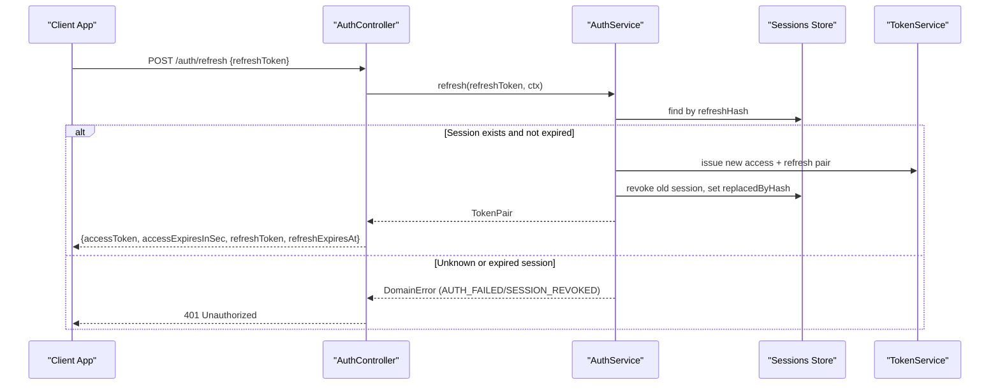
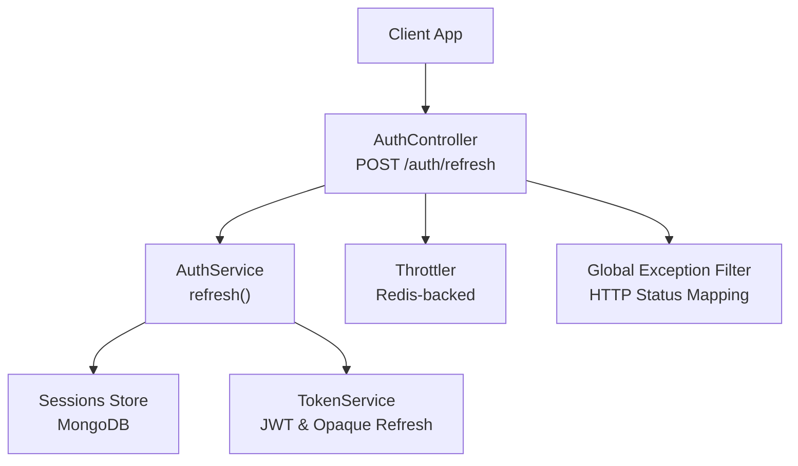

# Token Refresh

<cite>
**Referenced Files in This Document**
- [auth.controller.ts](file://backend/apps/api/src/modules/auth/presentation/auth.controller.ts)
- [auth.dtos.ts](file://backend/apps/api/src/modules/auth/presentation/dto/auth.dtos.ts)
- [auth.service.ts](file://backend/apps/api/src/modules/auth/application/auth.service.ts)
- [token.service.ts](file://backend/apps/api/src/modules/auth/infrastructure/token.service.ts)
- [session.schema.ts](file://backend/apps/api/src/modules/auth/infrastructure/schemas/session.schema.ts)
- [auth.types.ts](file://backend/apps/api/src/modules/auth/domain/auth.types.ts)
- [refresh-rotation.spec.ts](file://backend/apps/api/src/modules/auth/__tests__/refresh-rotation.spec.ts)
- [redis-throttler.storage.ts](file://backend/libs/shared/src/rate-limit/redis-throttler.storage.ts)
</cite>

## Table of Contents
1. [Introduction](#introduction)
2. [Endpoint Summary](#endpoint-summary)
3. [Request Schema: RefreshDto](#request-schema-refreshdto)
4. [Response Schema: TokenPair](#response-schema-tokenpair)
5. [Token Rotation Mechanism](#token-rotation-mechanism)
6. [Refresh Token Validation and Security](#refresh-token-validation-and-security)
7. [Rate Limiting](#rate-limiting)
8. [Error Handling](#error-handling)
9. [Client Implementation Guide](#client-implementation-guide)
10. [Architecture Overview](#architecture-overview)
11. [Detailed Component Analysis](#detailed-component-analysis)
12. [Performance Considerations](#performance-considerations)
13. [Troubleshooting Guide](#troubleshooting-guide)
14. [Conclusion](#conclusion)

## Introduction
This document provides comprehensive API documentation for the POST /auth/refresh endpoint. It explains how clients obtain new access tokens using a valid refresh token, details the server-side rotation mechanism, validation rules, security considerations, rate limiting, error responses, and practical client integration patterns to maintain seamless sessions without re-authentication.

## Endpoint Summary
- Method: POST
- Path: /auth/refresh
- Purpose: Exchange a valid refresh token for a new access token pair (access token + rotated refresh token).
- Rate limit: 30 requests per minute per client key.
- Authentication: Not required; uses a valid refresh token from the client’s session store.

**Section sources**
- [auth.controller.ts:92-96](file://backend/apps/api/src/modules/auth/presentation/auth.controller.ts#L92-L96)

## Request Schema: RefreshDto
The request body must include a single field:
- refreshToken: string, minimum length 32 characters.

Validation is enforced by the DTO class used by the controller.

Example request payload:
{
  "refreshToken": "<your-refresh-token>"
}

**Section sources**
- [auth.dtos.ts:72-75](file://backend/apps/api/src/modules/auth/presentation/dto/auth.dtos.ts#L72-L75)
- [auth.controller.ts:92-96](file://backend/apps/api/src/modules/auth/presentation/auth.controller.ts#L92-L96)

## Response Schema: TokenPair
On success, the response contains:
- accessToken: string — a short-lived RS256-signed JWT used to authorize protected endpoints.
- accessExpiresInSec: number — seconds until the access token expires.
- refreshToken: string — a new opaque refresh token (rotated).
- refreshExpiresAt: string — ISO timestamp when the new refresh token expires.

Example response payload:
{
  "accessToken": "<new-access-jwt>",
  "accessExpiresInSec": 900,
  "refreshToken": "<new-refresh-token>",
  "refreshExpiresAt": "2025-01-01T00:00:00.000Z"
}

Notes:
- The server rotates refresh tokens on every successful refresh. Clients must replace their stored refresh token with the one returned.
- Access tokens are short-lived; refresh tokens have a longer TTL configured via application settings.

**Section sources**
- [auth.types.ts:33-38](file://backend/apps/api/src/modules/auth/domain/auth.types.ts#L33-L38)
- [auth.service.ts:298-316](file://backend/apps/api/src/modules/auth/application/auth.service.ts#L298-L316)

## Token Rotation Mechanism
The refresh flow implements secure token rotation:
- On each successful refresh, the server issues a new access token pair and revokes the previous refresh token.
- The revoked session row records the hash of the replacement refresh token to detect replay attacks.
- If a previously used or expired refresh token is presented again, the entire session family is revoked to mitigate theft.

Key behaviors:
- Old refresh token is marked as revoked and replaced by the new token’s hash.
- Reuse of any token within the same family after rotation triggers family-wide revocation and audit logging.
- Expired or unknown tokens result in immediate failure and may trigger family revocation if they belong to an existing session.

**Diagram sources**
- [auth.controller.ts:92-96](file://backend/apps/api/src/modules/auth/presentation/auth.controller.ts#L92-L96)
- [auth.service.ts:190-216](file://backend/apps/api/src/modules/auth/application/auth.service.ts#L190-L216)
- [token.service.ts:73-84](file://backend/apps/api/src/modules/auth/infrastructure/token.service.ts#L73-L84)
- [session.schema.ts:17-40](file://backend/apps/api/src/modules/auth/infrastructure/schemas/session.schema.ts#L17-L40)

**Section sources**
- [auth.service.ts:190-216](file://backend/apps/api/src/modules/auth/application/auth.service.ts#L190-L216)
- [refresh-rotation.spec.ts:57-113](file://backend/apps/api/src/modules/auth/__tests__/refresh-rotation.spec.ts#L57-L113)

## Refresh Token Validation and Security
Validation steps performed by the server:
- Hash-based lookup: The raw refresh token is hashed (SHA-256) and looked up in the sessions collection.
- Existence check: If no matching session is found, the request fails.
- Expiration and revocation checks: If the session is expired or already revoked, the entire session family is revoked and the request fails.
- Theft detection: Presenting a revoked token again revokes all sessions in the same family and logs an audit event.

Security considerations:
- Raw refresh tokens are never stored; only their hashes are persisted.
- Family containment ensures that once theft is detected, all related sessions are invalidated immediately.
- Audit logging captures suspicious reuse events for monitoring and incident response.

**Section sources**
- [auth.service.ts:190-216](file://backend/apps/api/src/modules/auth/application/auth.service.ts#L190-L216)
- [token.service.ts:73-84](file://backend/apps/api/src/modules/auth/infrastructure/token.service.ts#L73-L84)
- [session.schema.ts:17-40](file://backend/apps/api/src/modules/auth/infrastructure/schemas/session.schema.ts#L17-L40)
- [refresh-rotation.spec.ts:77-99](file://backend/apps/api/src/modules/auth/__tests__/refresh-rotation.spec.ts#L77-L99)

## Rate Limiting
The refresh endpoint is rate-limited to protect against abuse:
- Limit: 30 requests per minute per client key.
- Storage: Redis-backed throttler storage ensures limits are shared across multiple API instances.
- Behavior: Requests exceeding the limit are blocked for the configured window.

Implementation notes:
- The Throttle decorator on the refresh method enforces the 30/minute limit.
- The RedisThrottlerStorage tracks hits and blocks after exceeding the limit.

**Section sources**
- [auth.controller.ts:92-96](file://backend/apps/api/src/modules/auth/presentation/auth.controller.ts#L92-L96)
- [redis-throttler.storage.ts:16-53](file://backend/libs/shared/src/rate-limit/redis-throttler.storage.ts#L16-L53)

## Error Handling
Common errors and HTTP status codes:
- Invalid or unknown refresh token: 401 Unauthorized with domain code AUTH_FAILED.
- Expired or revoked refresh token: 401 Unauthorized with domain code SESSION_REVOKED.
- Malformed request body (missing or invalid refreshToken): 422 Unprocessable Entity due to DTO validation.

Error mapping logic:
- The controller maps domain error codes to appropriate HTTP statuses.
- For refresh failures, both AUTH_FAILED and SESSION_REVOKED map to 401 Unauthorized.

Client guidance:
- On 401 Unauthorized, clear local tokens and redirect users to login.
- On validation errors, prompt users to provide a valid refresh token.

**Section sources**
- [auth.controller.ts:25-51](file://backend/apps/api/src/modules/auth/presentation/auth.controller.ts#L25-L51)
- [auth.service.ts:190-216](file://backend/apps/api/src/modules/auth/application/auth.service.ts#L190-L216)
- [auth.dtos.ts:72-75](file://backend/apps/api/src/modules/auth/presentation/dto/auth.dtos.ts#L72-L75)

## Client Implementation Guide
Recommended practices for implementing token refresh in client applications:

- Store tokens securely:
  - Persist the refresh token in a secure storage (e.g., secure HTTP-only cookie or encrypted storage).
  - Keep the access token in memory or short-lived storage.

- Handle access token expiry proactively:
  - Before making API calls, check if the access token is near expiration.
  - If expired or expiring soon, call POST /auth/refresh with the current refresh token.
  - Replace the stored refresh token with the new one returned from the refresh response.

- Implement retry logic:
  - If a refresh attempt fails due to rate limiting, back off and retry later.
  - If refresh fails due to invalid/expired token, clear local state and redirect to login.

- Maintain seamless sessions:
  - Queue API requests while refreshing tokens to avoid race conditions.
  - Retry queued requests after obtaining a new access token.

- Monitor and log:
  - Log refresh attempts and failures for debugging and analytics.
  - Alert on repeated refresh failures indicating potential token theft.

Example workflow:
1. User logs in and receives initial TokenPair.
2. Store refresh token securely and access token in memory.
3. On each API call, attach access token to Authorization header.
4. If access token is expired, call POST /auth/refresh with stored refresh token.
5. Update stored tokens with new values from response.
6. Retry original API call with new access token.

**Section sources**
- [auth.types.ts:33-38](file://backend/apps/api/src/modules/auth/domain/auth.types.ts#L33-L38)
- [auth.controller.ts:92-96](file://backend/apps/api/src/modules/auth/presentation/auth.controller.ts#L92-L96)

## Architecture Overview
High-level architecture showing components involved in token refresh:

**Diagram sources**
- [auth.controller.ts:92-96](file://backend/apps/api/src/modules/auth/presentation/auth.controller.ts#L92-L96)
- [auth.service.ts:190-216](file://backend/apps/api/src/modules/auth/application/auth.service.ts#L190-L216)
- [token.service.ts:73-84](file://backend/apps/api/src/modules/auth/infrastructure/token.service.ts#L73-L84)
- [redis-throttler.storage.ts:16-53](file://backend/libs/shared/src/rate-limit/redis-throttler.storage.ts#L16-L53)

## Detailed Component Analysis

### AuthController
Responsibilities:
- Exposes the POST /auth/refresh endpoint.
- Applies rate limiting via Throttle decorator.
- Validates request body using RefreshDto.
- Maps service results to HTTP responses using global exception filter.

Key implementation points:
- Rate limit: 30 requests per minute.
- Delegates refresh logic to AuthService.
- Uses request context (IP, user agent, device ID) for auditing and session tracking.

**Section sources**
- [auth.controller.ts:92-96](file://backend/apps/api/src/modules/auth/presentation/auth.controller.ts#L92-L96)

### AuthService.refresh
Responsibilities:
- Validates refresh token by hashing and looking up session.
- Checks expiration and revocation status.
- Issues new token pair and rotates refresh token.
- Handles theft detection by revoking entire session family.

Key implementation points:
- Uses TokenService for generating new refresh tokens and signing access tokens.
- Persists session updates to MongoDB via Mongoose models.
- Audits suspicious activity when token reuse is detected.

**Section sources**
- [auth.service.ts:190-216](file://backend/apps/api/src/modules/auth/application/auth.service.ts#L190-L216)

### TokenService
Responsibilities:
- Generates opaque refresh tokens with SHA-256 hashing.
- Signs and verifies RS256 JWTs for access tokens.
- Provides TTL configuration for access and refresh tokens.

Key implementation points:
- Refresh tokens are random strings hashed before storage.
- Access tokens are signed with private key and verified with public key.
- Supports purpose-specific tokens for email verification and password reset.

**Section sources**
- [token.service.ts:21-84](file://backend/apps/api/src/modules/auth/infrastructure/token.service.ts#L21-L84)

### Session Schema
Responsibilities:
- Defines MongoDB schema for storing refresh token metadata.
- Tracks principal, actor type, refresh token hash, family ID, and timestamps.
- Supports rotation through revokedAt and replacedByHash fields.

Key implementation points:
- Unique index on refreshHash prevents duplicate entries.
- Indexes on principalId and expiresAt optimize queries.
- TTL index automatically removes expired sessions.

**Section sources**
- [session.schema.ts:9-47](file://backend/apps/api/src/modules/auth/infrastructure/schemas/session.schema.ts#L9-L47)

### Refresh Rotation Tests
Responsibilities:
- Validate rotation behavior and theft detection.
- Ensure old tokens are revoked and new tokens work.
- Confirm family-wide revocation on token reuse.

Key test scenarios:
- Successful rotation with new token issuance.
- Replay attack detection and family revocation.
- Rejection of unknown and expired tokens.

**Section sources**
- [refresh-rotation.spec.ts:57-113](file://backend/apps/api/src/modules/auth/__tests__/refresh-rotation.spec.ts#L57-L113)

## Performance Considerations
- Database indexing: Sessions collection uses indexes on refreshHash, principalId, and expiresAt for efficient lookups and cleanup.
- Redis-backed throttling: Distributed rate limiting ensures consistent protection across multiple API instances.
- Token generation: Opaque refresh tokens minimize cryptographic overhead compared to self-contained tokens.
- Audit logging: Lightweight audit events capture security-relevant actions without impacting performance significantly.

[No sources needed since this section provides general guidance]

## Troubleshooting Guide
Common issues and resolutions:

- Invalid refresh token:
  - Cause: Token not found or malformed.
  - Resolution: Clear stored tokens and redirect to login.

- Expired refresh token:
  - Cause: Token TTL exceeded.
  - Resolution: Prompt user to log in again.

- Rate limiting exceeded:
  - Cause: More than 30 refresh requests per minute.
  - Resolution: Implement exponential backoff and reduce refresh frequency.

- Token theft detected:
  - Cause: Revoked token reused.
  - Resolution: All sessions in family revoked; require full re-authentication.

Debugging tips:
- Check request headers for proper content-type and payload structure.
- Verify refresh token format meets minimum length requirements.
- Monitor application logs for audit events related to session revocation.

**Section sources**
- [auth.controller.ts:25-51](file://backend/apps/api/src/modules/auth/presentation/auth.controller.ts#L25-L51)
- [auth.service.ts:190-216](file://backend/apps/api/src/modules/auth/application/auth.service.ts#L190-L216)
- [redis-throttler.storage.ts:16-53](file://backend/libs/shared/src/rate-limit/redis-throttler.storage.ts#L16-L53)

## Conclusion
The POST /auth/refresh endpoint provides a secure and robust mechanism for maintaining user sessions through token rotation. By validating refresh tokens, rotating them on each use, and detecting potential theft through family-wide revocation, the system ensures strong security while enabling seamless user experiences. Clients should implement proactive refresh handling, proper error management, and secure token storage to maintain uninterrupted access to protected resources.

[No sources needed since this section summarizes without analyzing specific files]