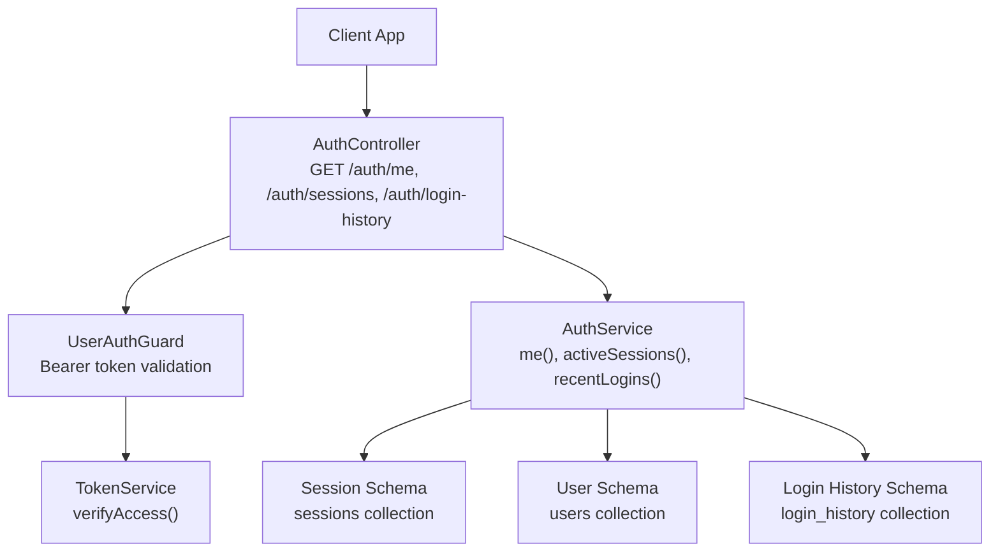
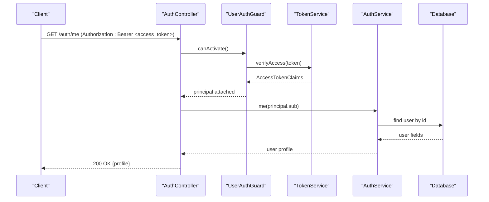
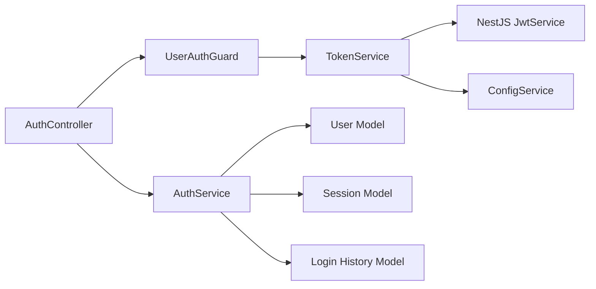

# User Profile & Sessions

<cite>
**Referenced Files in This Document**
- [auth.controller.ts](file://backend/apps/api/src/modules/auth/presentation/auth.controller.ts)
- [jwt-auth.guard.ts](file://backend/apps/api/src/modules/auth/presentation/jwt-auth.guard.ts)
- [auth.service.ts](file://backend/apps/api/src/modules/auth/application/auth.service.ts)
- [token.service.ts](file://backend/apps/api/src/modules/auth/infrastructure/token.service.ts)
- [session.schema.ts](file://backend/apps/api/src/modules/auth/infrastructure/schemas/session.schema.ts)
- [login-history.schema.ts](file://backend/apps/api/src/modules/auth/infrastructure/schemas/login-history.schema.ts)
- [user.schema.ts](file://backend/apps/api/src/modules/auth/infrastructure/schemas/user.schema.ts)
- [auth.types.ts](file://backend/apps/api/src/modules/auth/domain/auth.types.ts)
</cite>

## Table of Contents
1. [Introduction](#introduction)
2. [Project Structure](#project-structure)
3. [Core Components](#core-components)
4. [Architecture Overview](#architecture-overview)
5. [Detailed Component Analysis](#detailed-component-analysis)
6. [Dependency Analysis](#dependency-analysis)
7. [Performance Considerations](#performance-considerations)
8. [Troubleshooting Guide](#troubleshooting-guide)
9. [Conclusion](#conclusion)
10. [Appendices](#appendices)

## Introduction
This document provides comprehensive API documentation for user profile and session management endpoints. It covers:
- GET /auth/me to retrieve the current user profile using JWT token authentication
- GET /auth/sessions to list active sessions across devices with device metadata
- GET /auth/login-history to access recent login activity including timestamps, IP addresses, and device information
It also explains the UserAuthGuard protection mechanism and AccessTokenClaims extraction, and includes response schemas and implementation examples for multi-device support and security monitoring.

## Project Structure
The authentication feature is implemented as a NestJS module with clear separation between presentation (controllers), application (services), infrastructure (schemas and token service), and domain types. The relevant files are located under backend/apps/api/src/modules/auth.

**Diagram sources**
- [auth.controller.ts:121-137](file://backend/apps/api/src/modules/auth/presentation/auth.controller.ts#L121-L137)
- [jwt-auth.guard.ts:10-33](file://backend/apps/api/src/modules/auth/presentation/jwt-auth.guard.ts#L10-L33)
- [token.service.ts:42-58](file://backend/apps/api/src/modules/auth/infrastructure/token.service.ts#L42-L58)
- [auth.service.ts:273-294](file://backend/apps/api/src/modules/auth/application/auth.service.ts#L273-L294)
- [session.schema.ts:1-47](file://backend/apps/api/src/modules/auth/infrastructure/schemas/session.schema.ts#L1-L47)
- [user.schema.ts:1-71](file://backend/apps/api/src/modules/auth/infrastructure/schemas/user.schema.ts#L1-L71)
- [login-history.schema.ts:1-33](file://backend/apps/api/src/modules/auth/infrastructure/schemas/login-history.schema.ts#L1-L33)

**Section sources**
- [auth.controller.ts:121-137](file://backend/apps/api/src/modules/auth/presentation/auth.controller.ts#L121-L137)
- [jwt-auth.guard.ts:10-33](file://backend/apps/api/src/modules/auth/presentation/jwt-auth.guard.ts#L10-L33)
- [auth.service.ts:273-294](file://backend/apps/api/src/modules/auth/application/auth.service.ts#L273-L294)

## Core Components
- AuthController exposes protected endpoints for profile, sessions, and login history. Each endpoint uses UserAuthGuard to enforce JWT authentication and extracts the principal via CurrentPrincipal decorator.
- UserAuthGuard validates Bearer tokens, verifies them using TokenService.verifyAccess, checks actor type, and attaches AccessTokenClaims to the request context.
- AuthService implements business logic for retrieving user profiles, listing active sessions, and fetching recent login history.
- TokenService handles RS256 JWT signing and verification for access tokens and purpose tokens, and manages refresh token lifecycle.
- Schemas define data models for users, sessions, and login history, including indexes and TTL expiration for sessions.

Key responsibilities:
- Authentication enforcement and principal extraction
- Data retrieval for profile, sessions, and login history
- Security controls for token verification and session rotation

**Section sources**
- [auth.controller.ts:121-137](file://backend/apps/api/src/modules/auth/presentation/auth.controller.ts#L121-L137)
- [jwt-auth.guard.ts:10-33](file://backend/apps/api/src/modules/auth/presentation/jwt-auth.guard.ts#L10-L33)
- [auth.service.ts:273-294](file://backend/apps/api/src/modules/auth/application/auth.service.ts#L273-L294)
- [token.service.ts:42-58](file://backend/apps/api/src/modules/auth/infrastructure/token.service.ts#L42-L58)

## Architecture Overview
The endpoints follow a layered architecture:
- Presentation layer (controller) receives HTTP requests and delegates to services
- Guard layer enforces JWT authentication and extracts claims
- Application layer (service) performs business operations and queries databases
- Infrastructure layer (schemas and token service) persists data and secures tokens

**Diagram sources**
- [auth.controller.ts:121-125](file://backend/apps/api/src/modules/auth/presentation/auth.controller.ts#L121-L125)
- [jwt-auth.guard.ts:15-27](file://backend/apps/api/src/modules/auth/presentation/jwt-auth.guard.ts#L15-L27)
- [token.service.ts:51-58](file://backend/apps/api/src/modules/auth/infrastructure/token/service.ts#L51-L58)
- [auth.service.ts:289-294](file://backend/apps/api/src/modules/auth/application/auth.service.ts#L289-L294)

## Detailed Component Analysis

### GET /auth/me
Retrieves the current user profile based on the JWT token provided in the Authorization header.

- Method: GET
- Path: /auth/me
- Authentication: Required (Bearer token)
- Protection: UserAuthGuard ensures valid JWT and extracts AccessTokenClaims
- Principal: sub field contains the user ID

Response schema:
- name: string
- email: string
- mobile: string
- username: string
- address: string
- incomeType: enum (SALARIED | OWN)
- monthlyIncome: number
- status: enum (ACTIVE, PENDING_APPROVAL, etc.)
- kycStatus: enum (NOT_SUBMITTED, SUBMITTED, UNDER_REVIEW, APPROVED, REJECTED)
- referralCode: string
- createdAt: timestamp

Example response:
{
  "name": "John Doe",
  "email": "john@example.com",
  "mobile": "+919876543210",
  "username": "johndoe",
  "address": "123 Main St",
  "incomeType": "SALARIED",
  "monthlyIncome": 50000,
  "status": "ACTIVE",
  "kycStatus": "APPROVED",
  "referralCode": "ABC123",
  "createdAt": "2024-01-01T00:00:00Z"
}

Implementation notes:
- Uses CurrentPrincipal decorator to extract AccessTokenClaims from the request
- Calls AuthService.me() with the user ID from token claims
- Selects specific user fields to avoid exposing sensitive data like passwordHash

**Section sources**
- [auth.controller.ts:121-125](file://backend/apps/api/src/modules/auth/presentation/auth.controller.ts#L121-L125)
- [auth.service.ts:289-294](file://backend/apps/api/src/modules/auth/application/auth.service.ts#L289-L294)
- [user.schema.ts:6-67](file://backend/apps/api/src/modules/auth/infrastructure/schemas/user.schema.ts#L6-L67)

### GET /auth/sessions
Lists all active sessions for the authenticated user across devices.

- Method: GET
- Path: /auth/sessions
- Authentication: Required (Bearer token)
- Protection: UserAuthGuard ensures valid JWT and extracts AccessTokenClaims
- Filters: Only returns non-revoked sessions that haven't expired

Response schema (array of session objects):
- deviceId: string (optional)
- ip: string (optional)
- userAgent: string (optional)
- createdAt: timestamp
- expiresAt: timestamp

Example response:
[
  {
    "deviceId": "device-abc-123",
    "ip": "192.168.1.1",
    "userAgent": "Mozilla/5.0 (Windows NT 10.0; Win64; x64)",
    "createdAt": "2024-01-01T10:00:00Z",
    "expiresAt": "2024-01-02T10:00:00Z"
  },
  {
    "deviceId": "device-def-456",
    "ip": "10.0.0.1",
    "userAgent": "Chrome/120.0.0.0",
    "createdAt": "2024-01-01T11:00:00Z",
    "expiresAt": "2024-01-02T11:00:00Z"
  }
]

Implementation notes:
- Queries sessions collection for active sessions belonging to the user
- Sorts by creation date (newest first)
- Returns only essential session metadata for security and privacy

**Section sources**
- [auth.controller.ts:127-131](file://backend/apps/api/src/modules/auth/presentation/auth.controller.ts#L127-L131)
- [auth.service.ts:273-279](file://backend/apps/api/src/modules/auth/application/auth.service.ts#L273-L279)
- [session.schema.ts:10-41](file://backend/apps/api/src/modules/auth/infrastructure/schemas/session.schema.ts#L10-L41)

### GET /auth/login-history
Retrieves recent login activity for the authenticated user.

- Method: GET
- Path: /auth/login-history
- Authentication: Required (Bearer token)
- Protection: UserAuthGuard ensures valid JWT and extracts AccessTokenClaims
- Limit: Default limit of 50 entries

Response schema (array of login history entries):
- principalId: ObjectId (internal reference)
- actor: enum (USER | EMPLOYEE)
- success: boolean
- failureReason: string (optional)
- ip: string (optional)
- userAgent: string (optional)
- deviceId: string (optional)
- at: timestamp

Example response:
[
  {
    "principalId": "507f1f77bcf86cd799439011",
    "actor": "USER",
    "success": true,
    "ip": "192.168.1.1",
    "userAgent": "Mozilla/5.0 (iPhone; CPU iPhone OS 16_0)",
    "deviceId": "device-abc-123",
    "at": "2024-01-01T10:00:00Z"
  },
  {
    "principalId": "507f1f77bcf86cd799439011",
    "actor": "USER",
    "success": false,
    "failureReason": "AUTH_FAILED",
    "ip": "10.0.0.1",
    "userAgent": "Chrome/120.0.0.0",
    "at": "2024-01-01T09:30:00Z"
  }
]

Implementation notes:
- Queries login_history collection sorted by timestamp (newest first)
- Includes both successful and failed login attempts
- Useful for security monitoring and detecting suspicious activity

**Section sources**
- [auth.controller.ts:133-137](file://backend/apps/api/src/modules/auth/presentation/auth.controller.ts#L133-L137)
- [auth.service.ts:281-287](file://backend/apps/api/src/modules/auth/application/auth.service.ts#L281-L287)
- [login-history.schema.ts:5-28](file://backend/apps/api/src/modules/auth/infrastructure/schemas/login-history.schema.ts#L5-L28)

### UserAuthGuard Protection Mechanism
The UserAuthGuard enforces JWT authentication for protected endpoints.

How it works:
1. Extracts Authorization header from incoming request
2. Validates Bearer token format
3. Verifies token using TokenService.verifyAccess()
4. Checks that token actor matches expected type ('USER')
5. Attaches AccessTokenClaims to request context
6. Throws UnauthorizedException for invalid or expired tokens

Security features:
- RS256 algorithm for token verification
- Actor type validation prevents cross-role access
- Proper error handling for malformed or expired tokens

**Section sources**
- [jwt-auth.guard.ts:10-33](file://backend/apps/api/src/modules/auth/presentation/jwt-auth.guard.ts#L10-L33)
- [token.service.ts:51-58](file://backend/apps/api/src/modules/auth/infrastructure/token.service.ts#L51-L58)

### AccessTokenClaims Extraction
AccessTokenClaims represent the decoded JWT payload containing user identity and role information.

Claims structure:
- sub: string (user ID)
- actor: 'USER' | 'EMPLOYEE'
- typ: 'access'
- roles?: string[] (optional)

Extraction process:
1. TokenService.verifyAccess() decodes and validates JWT
2. Claims are attached to request.principal by UserAuthGuard
3. CurrentPrincipal decorator injects claims into controller methods
4. Controllers use principal.sub to identify the authenticated user

**Section sources**
- [auth.types.ts:26-31](file://backend/apps/api/src/modules/auth/domain/auth.types.ts#L26-L31)
- [jwt-auth.guard.ts:15-27](file://backend/apps/api/src/modules/auth/presentation/jwt-auth.guard.ts#L15-L27)
- [auth.controller.ts:121-137](file://backend/apps/api/src/modules/auth/presentation/auth.controller.ts#L121-L137)

## Dependency Analysis
The authentication system has clear dependency relationships:

Key dependencies:
- AuthController depends on UserAuthGuard and AuthService
- UserAuthGuard depends on TokenService for JWT verification
- AuthService depends on Mongoose models for data persistence
- TokenService depends on NestJS JwtService and configuration

**Diagram sources**
- [auth.controller.ts:1-21](file://backend/apps/api/src/modules/auth/presentation/auth.controller.ts#L1-L21)
- [jwt-auth.guard.ts:1-8](file://backend/apps/api/src/modules/auth/presentation/jwt-auth.guard.ts#L1-L8)
- [auth.service.ts:1-40](file://backend/apps/api/src/modules/auth/application/auth.service.ts#L1-L40)
- [token.service.ts:1-32](file://backend/apps/api/src/modules/auth/infrastructure/token.service.ts#L1-L32)

**Section sources**
- [auth.controller.ts:1-21](file://backend/apps/api/src/modules/auth/presentation/auth.controller.ts#L1-L21)
- [auth.service.ts:1-40](file://backend/apps/api/src/modules/auth/application/auth.service.ts#L1-L40)

## Performance Considerations
- Database indexing: Sessions and login history collections have appropriate indexes for efficient querying
- Field selection: User profile queries select only necessary fields to reduce payload size
- Pagination: Login history supports limiting results to prevent large responses
- Connection pooling: Mongoose connection pooling improves database performance
- JWT verification: Stateless token verification reduces server-side state management overhead

Optimization opportunities:
- Implement pagination for login history beyond default limits
- Add caching for frequently accessed user profiles
- Consider rate limiting on profile and session endpoints
- Monitor database query performance with slow query logs

## Troubleshooting Guide
Common issues and solutions:

Authentication errors:
- Missing bearer token: Ensure Authorization header is set correctly
- Invalid or expired token: Check token validity and refresh if needed
- Wrong actor type: Verify token was issued for correct user role

Data access issues:
- No sessions found: User may not have active sessions or all sessions expired
- Empty login history: No login attempts recorded for the user
- Profile not found: User ID from token doesn't exist in database

Security considerations:
- Monitor failed login attempts for potential brute force attacks
- Review new device sign-ins for unauthorized access
- Regularly audit active sessions for suspicious activity

Error handling patterns:
- Domain-specific error codes provide detailed failure reasons
- Consistent HTTP status codes for different error scenarios
- Audit logging for security-sensitive operations

**Section sources**
- [auth.controller.ts:25-51](file://backend/apps/api/src/modules/auth/presentation/auth.controller.ts#L25-L51)
- [jwt-auth.guard.ts:15-27](file://backend/apps/api/src/modules/auth/presentation/jwt-auth.guard.ts#L15-L27)
- [auth.service.ts:145-183](file://backend/apps/api/src/modules/auth/application/auth.service.ts#L145-L183)

## Conclusion
The user profile and session management system provides secure, well-structured APIs for managing user identities and authentication states. The implementation follows best practices for JWT-based authentication, proper error handling, and security monitoring through login history tracking.

Key strengths:
- Robust JWT authentication with UserAuthGuard
- Comprehensive session management across multiple devices
- Detailed login history for security monitoring
- Clean separation of concerns with modular architecture
- Proper data validation and sanitization

Recommendations:
- Implement additional rate limiting for sensitive endpoints
- Add comprehensive API documentation with interactive examples
- Consider implementing session revocation mechanisms
- Enhance security monitoring with anomaly detection

## Appendices

### Implementation Examples

#### Multi-Device Support
The system naturally supports multiple concurrent sessions per user:
- Each login creates a new session record with unique device identification
- Users can maintain active sessions across different devices and browsers
- Session management allows viewing and controlling active sessions

#### Security Monitoring Features
- Login history tracks all authentication attempts with timestamps and device information
- New device detection triggers security notifications
- Failed login attempts are recorded with failure reasons
- Session expiration and revocation mechanisms protect against token theft

#### Best Practices
- Always validate JWT tokens before processing requests
- Use HTTPS for all authentication endpoints
- Implement proper error handling without exposing sensitive information
- Regularly review login history for suspicious activity
- Rotate refresh tokens securely using the existing rotation mechanism