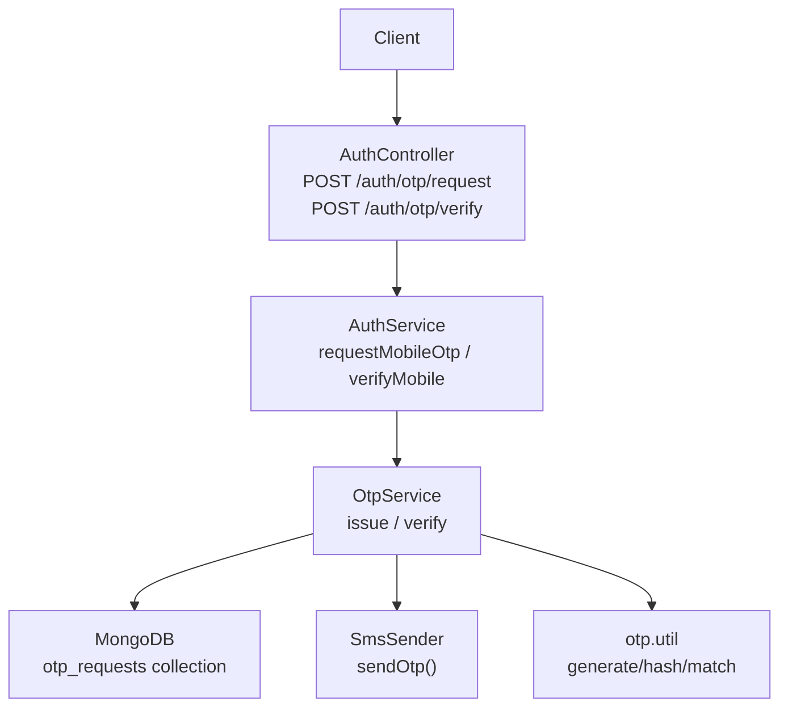
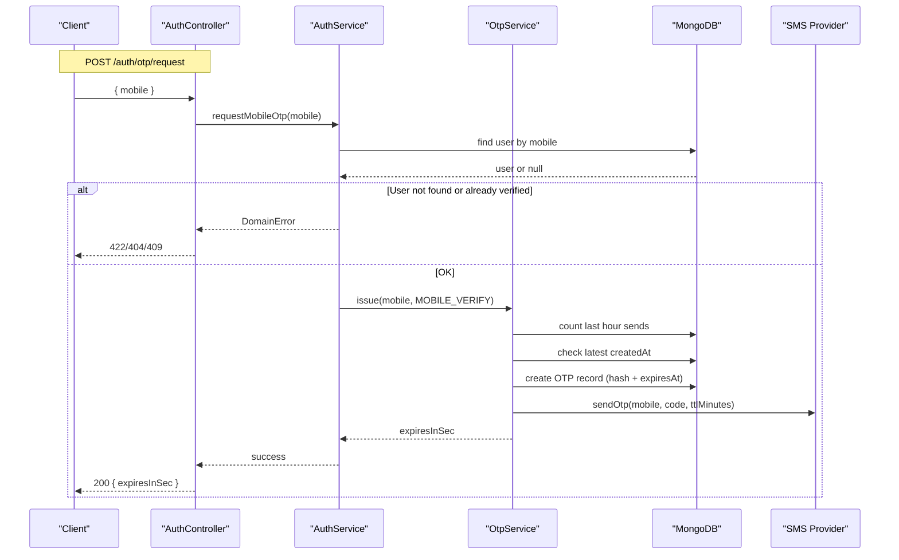
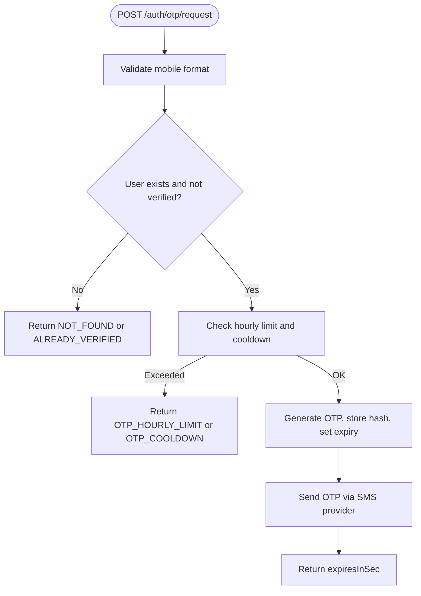
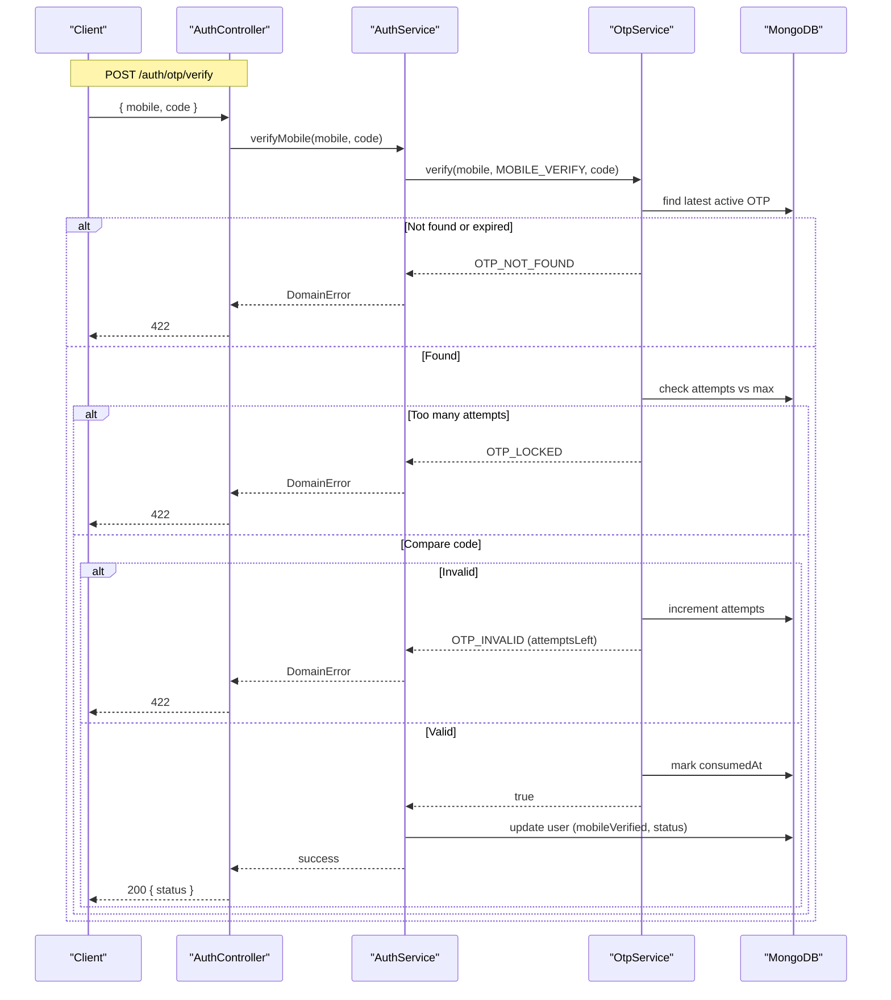
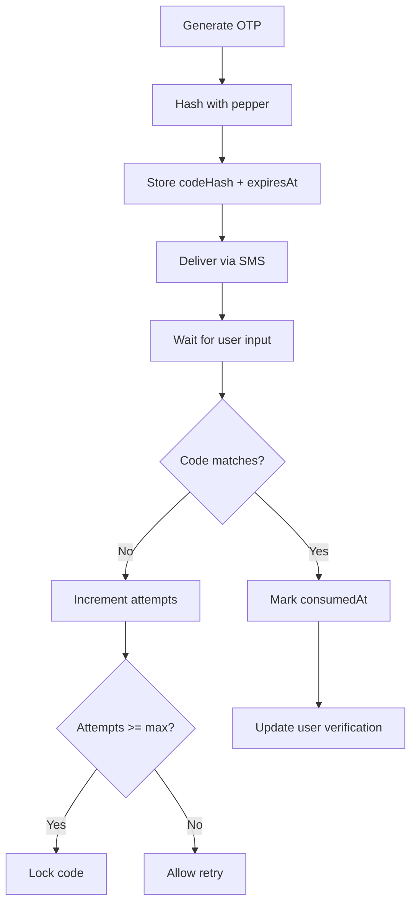
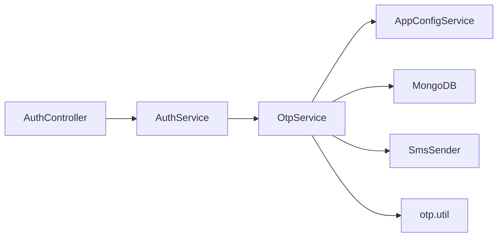

# OTP Verification

<cite>
**Referenced Files in This Document**
- [auth.controller.ts](file://backend/apps/api/src/modules/auth/presentation/auth.controller.ts)
- [auth.dtos.ts](file://backend/apps/api/src/modules/auth/presentation/dto/auth.dtos.ts)
- [auth.service.ts](file://backend/apps/api/src/modules/auth/application/auth.service.ts)
- [otp.service.ts](file://backend/apps/api/src/modules/auth/infrastructure/otp.service.ts)
- [otp.util.ts](file://backend/apps/api/src/modules/auth/infrastructure/otp.util.ts)
- [otp-request.schema.ts](file://backend/apps/api/src/modules/auth/infrastructure/schemas/otp-request.schema.ts)
- [sms.port.ts](file://backend/apps/api/src/modules/auth/infrastructure/sms/sms.port.ts)
- [config-keys.ts](file://backend/libs/shared/src/config/config-keys.ts)
- [env.schema.ts](file://backend/libs/shared/src/config/env.schema.ts)
</cite>

## Table of Contents
1. [Introduction](#introduction)
2. [Project Structure](#project-structure)
3. [Core Components](#core-components)
4. [Architecture Overview](#architecture-overview)
5. [Detailed Component Analysis](#detailed-component-analysis)
6. [Dependency Analysis](#dependency-analysis)
7. [Performance Considerations](#performance-considerations)
8. [Troubleshooting Guide](#troubleshooting-guide)
9. [Conclusion](#conclusion)

## Introduction
This document provides detailed API documentation for mobile OTP verification endpoints and explains the full OTP lifecycle: generation, SMS delivery, expiration handling, and verification. It also documents rate limiting behavior and error codes, including OTP_HOURLY_LIMIT and OTP_COOLDOWN.

Endpoints covered:
- POST /auth/otp/request — Request an OTP for a mobile number (RequestOtpDto).
- POST /auth/otp/verify — Verify the OTP for a mobile number (VerifyMobileDto).

## Project Structure
The OTP feature is implemented under the auth module with clear separation between presentation (controllers), application (business logic), and infrastructure (persistence, SMS, utilities).

**Diagram sources**
- [auth.controller.ts:53-73](file://backend/apps/api/src/modules/auth/presentation/auth.controller.ts#L53-L73)
- [auth.service.ts:83-102](file://backend/apps/api/src/modules/auth/application/auth.service.ts#L83-L102)
- [otp.service.ts:28-74](file://backend/apps/api/src/modules/auth/infrastructure/otp.service.ts#L28-L74)
- [otp-request.schema.ts:4-33](file://backend/apps/api/src/modules/auth/infrastructure/schemas/otp-request.schema.ts#L4-L33)
- [sms.port.ts:3-5](file://backend/apps/api/src/modules/auth/infrastructure/sms/sms.port.ts#L3-L5)
- [otp.util.ts:3-15](file://backend/apps/api/src/modules/auth/infrastructure/otp.util.ts#L3-L15)

**Section sources**
- [auth.controller.ts:53-73](file://backend/apps/api/src/modules/auth/presentation/auth.controller.ts#L53-L73)
- [auth.service.ts:83-102](file://backend/apps/api/src/modules/auth/application/auth.service.ts#L83-L102)
- [otp.service.ts:28-74](file://backend/apps/api/src/modules/auth/infrastructure/otp.service.ts#L28-L74)

## Core Components
- AuthController exposes the OTP endpoints with strict throttling to protect against abuse.
- AuthService validates user existence and delegates OTP issuance and verification to OtpService.
- OtpService enforces business rules: per-hour limits, resend cooldown, TTL-based expiration, attempt limits, and consumption marking.
- otp.util provides secure OTP generation and hashing with a server-side pepper.
- sms.port defines the abstraction for sending OTPs via SMS providers.
- otp-request.schema persists OTP records with indexes and TTL cleanup.

Key configuration values (defaults):
- auth.otp.ttlSeconds: default 300 seconds (5 minutes).
- auth.otp.maxAttempts: default 3 attempts per code.
- auth.otp.maxPerHour: default 5 OTPs per mobile per hour.
- auth.otp.resendCooldownSeconds: default 60 seconds between sends to the same number.
- OTP_PEPPER: required environment variable used to hash OTPs.

**Section sources**
- [auth.controller.ts:22-23](file://backend/apps/api/src/modules/auth/presentation/auth.controller.ts#L22-L23)
- [auth.controller.ts:63-73](file://backend/apps/api/src/modules/auth/presentation/auth.controller.ts#L63-L73)
- [auth.service.ts:83-102](file://backend/apps/api/src/modules/auth/application/auth.service.ts#L83-L102)
- [otp.service.ts:28-74](file://backend/apps/api/src/modules/auth/infrastructure/otp.service.ts#L28-L74)
- [otp.util.ts:3-15](file://backend/apps/api/src/modules/auth/infrastructure/otp.util.ts#L3-L15)
- [config-keys.ts:68-86](file://backend/libs/shared/src/config/config-keys.ts#L68-L86)
- [env.schema.ts:31-32](file://backend/libs/shared/src/config/env.schema.ts#L31-L32)

## Architecture Overview
The OTP flow uses a layered architecture:
- Presentation layer validates DTOs and applies throttling.
- Application layer performs domain checks (user exists, not already verified) and orchestrates OTP operations.
- Infrastructure layer handles persistence, SMS delivery, and cryptographic utilities.

**Diagram sources**
- [auth.controller.ts:63-67](file://backend/apps/api/src/modules/auth/presentation/auth.controller.ts#L63-L67)
- [auth.service.ts:83-88](file://backend/apps/api/src/modules/auth/application/auth.service.ts#L83-L88)
- [otp.service.ts:28-53](file://backend/apps/api/src/modules/auth/infrastructure/otp.service.ts#L28-L53)
- [otp-request.schema.ts:4-33](file://backend/apps/api/src/modules/auth/infrastructure/schemas/otp-request.schema.ts#L4-L33)
- [sms.port.ts:3-5](file://backend/apps/api/src/modules/auth/infrastructure/sms/sms.port.ts#L3-L5)

## Detailed Component Analysis

### Endpoint: POST /auth/otp/request
- Purpose: Generate and deliver an OTP to a registered mobile number.
- Request body: RequestOtpDto
  - mobile: string, must match E.164 format starting with +91 followed by a valid 10-digit number.
- Response:
  - Success: 200 with expiresInSec indicating how long the OTP remains valid.
  - Errors:
    - NOT_FOUND if no account exists for the mobile.
    - ALREADY_VERIFIED if the mobile is already verified.
    - OTP_HOURLY_LIMIT when too many OTPs were sent to this number within the configured hourly limit.
    - OTP_COOLDOWN when a recent OTP was sent and the resend cooldown has not elapsed.
- Rate limiting: Strict throttle applied at controller level (5 requests per minute with block duration).

Flow details:
- Controller validates DTO and applies throttling.
- Service checks user existence and verification status.
- OtpService enforces per-hour limit and cooldown, generates a secure OTP, stores its hash, sets expiration, and triggers SMS delivery.

**Diagram sources**
- [auth.controller.ts:63-67](file://backend/apps/api/src/modules/auth/presentation/auth.controller.ts#L63-L67)
- [auth.service.ts:83-88](file://backend/apps/api/src/modules/auth/application/auth.service.ts#L83-L88)
- [otp.service.ts:28-53](file://backend/apps/api/src/modules/auth/infrastructure/otp.service.ts#L28-L53)

**Section sources**
- [auth.controller.ts:63-67](file://backend/apps/api/src/modules/auth/presentation/auth.controller.ts#L63-L67)
- [auth.dtos.ts:43-46](file://backend/apps/api/src/modules/auth/presentation/dto/auth.dtos.ts#L43-L46)
- [auth.service.ts:83-88](file://backend/apps/api/src/modules/auth/application/auth.service.ts#L83-L88)
- [otp.service.ts:28-53](file://backend/apps/api/src/modules/auth/infrastructure/otp.service.ts#L28-L53)

### Endpoint: POST /auth/otp/verify
- Purpose: Validate the OTP submitted by the client for a given mobile number.
- Request body: VerifyMobileDto
  - mobile: string, same validation as above.
  - code: string, exactly 6 digits.
- Response:
  - Success: 200 with updated user status after successful verification.
  - Errors:
    - OTP_NOT_FOUND if there is no active OTP for the mobile.
    - OTP_LOCKED if maximum wrong attempts exceeded.
    - OTP_INVALID if the code does not match; includes attemptsLeft hint.
- Behavior on success: Marks OTP as consumed, sets mobileVerified flag, updates user status, and triggers email verification flow.

Verification flow:
- Controller validates DTO and applies throttling.
- Service calls OtpService.verify with target, purpose, and code.
- OtpService finds the latest non-consumed, non-expired OTP, checks attempts, compares hashed code securely, marks consumed on success.

**Diagram sources**
- [auth.controller.ts:69-73](file://backend/apps/api/src/modules/auth/presentation/auth.controller.ts#L69-L73)
- [auth.service.ts:90-102](file://backend/apps/api/src/modules/auth/application/auth.service.ts#L90-L102)
- [otp.service.ts:55-74](file://backend/apps/api/src/modules/auth/infrastructure/otp.service.ts#L55-L74)
- [otp-request.schema.ts:4-33](file://backend/apps/api/src/modules/auth/infrastructure/schemas/otp-request.schema.ts#L4-L33)

**Section sources**
- [auth.controller.ts:69-73](file://backend/apps/api/src/modules/auth/presentation/auth.controller.ts#L69-L73)
- [auth.dtos.ts:48-51](file://backend/apps/api/src/modules/auth/presentation/dto/auth.dtos.ts#L48-L51)
- [auth.service.ts:90-102](file://backend/apps/api/src/modules/auth/application/auth.service.ts#L90-L102)
- [otp.service.ts:55-74](file://backend/apps/api/src/modules/auth/infrastructure/otp.service.ts#L55-L74)

### OTP Lifecycle
- Generation:
  - Secure 6-digit code generated using cryptographically safe randomization.
  - Code is hashed with a server-side pepper before storage; plaintext is never persisted.
  - Record created with target, channel, purpose, codeHash, attempts, expiresAt.
- Delivery:
  - SMS provider receives mobile, code, and TTL in minutes for display purposes.
- Expiration:
  - Each OTP has an expiresAt timestamp; only non-expired, non-consumed OTPs are considered.
  - MongoDB index ensures efficient queries; TTL index cleans up old records.
- Verification:
  - Attempts are tracked; exceeding maxAttempts locks the code.
  - On success, OTP is marked consumed and user profile updated.

**Diagram sources**
- [otp.util.ts:3-15](file://backend/apps/api/src/modules/auth/infrastructure/otp.util.ts#L3-L15)
- [otp.service.ts:28-74](file://backend/apps/api/src/modules/auth/infrastructure/otp.service.ts#L28-L74)
- [otp-request.schema.ts:4-33](file://backend/apps/api/src/modules/auth/infrastructure/schemas/otp-request.schema.ts#L4-L33)

**Section sources**
- [otp.util.ts:3-15](file://backend/apps/api/src/modules/auth/infrastructure/otp.util.ts#L3-L15)
- [otp.service.ts:28-74](file://backend/apps/api/src/modules/auth/infrastructure/otp.service.ts#L28-L74)
- [otp-request.schema.ts:4-33](file://backend/apps/api/src/modules/auth/infrastructure/schemas/otp-request.schema.ts#L4-L33)

### Rate Limiting and Error Codes
- Controller-level throttling:
  - Strict limiter applied to OTP endpoints: 5 requests per minute with a 5-minute block duration.
- Business-level limits:
  - OTP_HOURLY_LIMIT: triggered when the number of OTPs sent to a mobile exceeds the configured maxPerHour within the last hour.
  - OTP_COOLDOWN: triggered when a new OTP is requested before the configured resendCooldownSeconds has elapsed since the last send.
- Mapping to HTTP status:
  - OTP_HOURLY_LIMIT and OTP_COOLDOWN map to 429 Too Many Requests.
  - Other errors like NOT_FOUND, ALREADY_VERIFIED, OTP_INVALID, OTP_LOCKED map to appropriate statuses (e.g., 422 Unprocessable Entity).

**Section sources**
- [auth.controller.ts:22-23](file://backend/apps/api/src/modules/auth/presentation/auth.controller.ts#L22-L23)
- [auth.controller.ts:30-51](file://backend/apps/api/src/modules/auth/presentation/auth.controller.ts#L30-L51)
- [otp.service.ts:28-53](file://backend/apps/api/src/modules/auth/infrastructure/otp.service.ts#L28-L53)
- [config-keys.ts:68-86](file://backend/libs/shared/src/config/config-keys.ts#L68-L86)

## Dependency Analysis
- Controllers depend on services for business logic and use DTOs for input validation.
- Services orchestrate cross-cutting concerns (audit, tokens, mail) and delegate OTP-specific tasks to OtpService.
- OtpService depends on:
  - AppConfigService for dynamic OTP policy values.
  - MongoDB model for OTP records.
  - SmsSender interface for delivery abstraction.
  - otp.util for secure OTP generation and comparison.

**Diagram sources**
- [auth.controller.ts:53-73](file://backend/apps/api/src/modules/auth/presentation/auth.controller.ts#L53-L73)
- [auth.service.ts:83-102](file://backend/apps/api/src/modules/auth/application/auth.service.ts#L83-L102)
- [otp.service.ts:28-74](file://backend/apps/api/src/modules/auth/infrastructure/otp.service.ts#L28-L74)

**Section sources**
- [auth.controller.ts:53-73](file://backend/apps/api/src/modules/auth/presentation/auth.controller.ts#L53-L73)
- [auth.service.ts:83-102](file://backend/apps/api/src/modules/auth/application/auth.service.ts#L83-L102)
- [otp.service.ts:28-74](file://backend/apps/api/src/modules/auth/infrastructure/otp.service.ts#L28-L74)

## Performance Considerations
- Indexes:
  - otp_requests indexed by target and createdAt for fast cooldown checks.
  - expiresAt index with TTL for automatic cleanup of expired OTPs.
- Throttling:
  - Controller-level throttling reduces load from abusive clients.
- Configuration:
  - TTL and attempt limits can be tuned via AppConfigService without redeploying.
- Security:
  - OTPs are stored as hashes with a pepper; timing-safe comparison prevents side-channel attacks.

[No sources needed since this section provides general guidance]

## Troubleshooting Guide
Common issues and resolutions:
- OTP_HOURLY_LIMIT:
  - Cause: Too many OTPs sent to the same mobile within the last hour.
  - Action: Wait until the window resets or reduce request frequency.
- OTP_COOLDOWN:
  - Cause: Resend requested too soon after previous send.
  - Action: Respect the cooldown interval before requesting again.
- OTP_INVALID:
  - Cause: Incorrect code entered; attempts incremented.
  - Action: Re-enter the correct code; if locked, request a new OTP.
- OTP_LOCKED:
  - Cause: Maximum wrong attempts reached for the current OTP.
  - Action: Request a new OTP.
- OTP_NOT_FOUND:
  - Cause: No active OTP found for the mobile (expired or consumed).
  - Action: Request a new OTP.

**Section sources**
- [auth.controller.ts:30-51](file://backend/apps/api/src/modules/auth/presentation/auth.controller.ts#L30-L51)
- [otp.service.ts:28-74](file://backend/apps/api/src/modules/auth/infrastructure/otp.service.ts#L28-L74)

## Conclusion
The OTP verification system provides secure, rate-limited, and configurable mobile OTP issuance and verification. It enforces strict controls through throttling, cooldowns, per-hour limits, and attempt caps, while ensuring security via hashed OTP storage and timing-safe comparisons. The modular design allows easy integration with different SMS providers and dynamic tuning of OTP policies.

[No sources needed since this section summarizes without analyzing specific files]