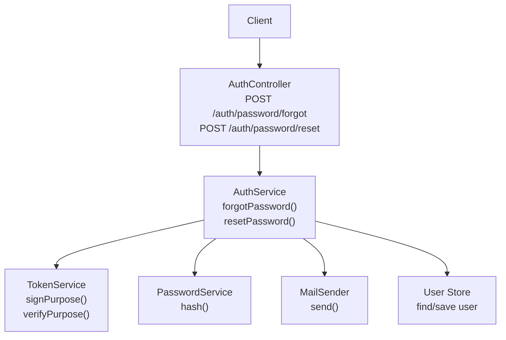
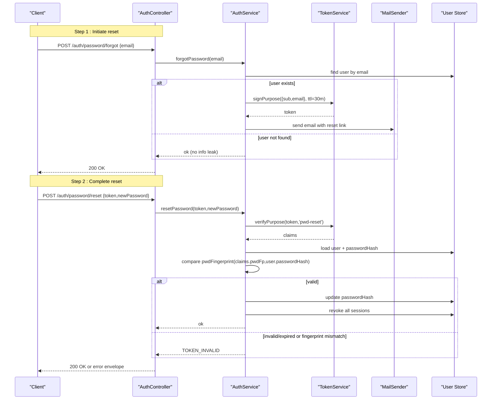
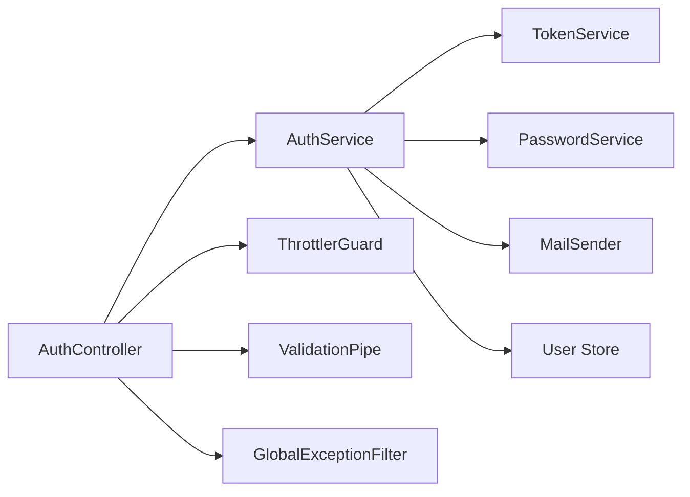

# Password Management

<cite>
**Referenced Files in This Document**
- [auth.controller.ts](file://backend/apps/api/src/modules/auth/presentation/auth.controller.ts)
- [auth.dtos.ts](file://backend/apps/api/src/modules/auth/presentation/dto/auth.dtos.ts)
- [auth.service.ts](file://backend/apps/api/src/modules/auth/application/auth.service.ts)
- [token.service.ts](file://backend/apps/api/src/modules/auth/infrastructure/token.service.ts)
- [password.service.ts](file://backend/apps/api/src/modules/auth/infrastructure/password.service.ts)
- [mail.port.ts](file://backend/apps/api/src/modules/auth/infrastructure/mail/mail.port.ts)
- [api.module.ts](file://backend/apps/api/src/api.module.ts)
- [global-exception.filter.ts](file://backend/libs/shared/src/http/global-exception.filter.ts)
- [app-exception.ts](file://backend/libs/shared/src/http/app-exception.ts)
</cite>

## Table of Contents
1. [Introduction](#introduction)
2. [Project Structure](#project-structure)
3. [Core Components](#core-components)
4. [Architecture Overview](#architecture-overview)
5. [Detailed Component Analysis](#detailed-component-analysis)
6. [Dependency Analysis](#dependency-analysis)
7. [Performance Considerations](#performance-considerations)
8. [Troubleshooting Guide](#troubleshooting-guide)
9. [Conclusion](#conclusion)

## Introduction
This document provides detailed API documentation for password management endpoints, focusing on:
- POST /auth/password/forgot to initiate a password reset
- POST /auth/password/reset to complete the password reset

It explains the end-to-end flow including token generation, email delivery, password validation rules, security considerations, rate limiting, and error handling. It also includes example workflows and best practices for secure password handling.

## Project Structure
Password management is implemented within the Auth module using a layered architecture:
- Presentation layer (controller) exposes REST endpoints with DTO validation and throttling
- Application layer (service) orchestrates business logic for forgot and reset flows
- Infrastructure layer provides token signing/verification, password hashing, and mail sending

**Diagram sources**
- [auth.controller.ts:109-119](file://backend/apps/api/src/modules/auth/presentation/auth.controller.ts#L109-L119)
- [auth.service.ts:236-269](file://backend/apps/api/src/modules/auth/application/auth.service.ts#L236-L269)
- [token.service.ts:60-71](file://backend/apps/api/src/modules/auth/infrastructure/token.service.ts#L60-L71)
- [password.service.ts:14-24](file://backend/apps/api/src/modules/auth/infrastructure/password.service.ts#L14-L24)
- [mail.port.ts:1-13](file://backend/apps/api/src/modules/auth/infrastructure/mail/mail.port.ts#L1-L13)

**Section sources**
- [auth.controller.ts:109-119](file://backend/apps/api/src/modules/auth/presentation/auth.controller.ts#L109-L119)
- [auth.service.ts:236-269](file://backend/apps/api/src/modules/auth/application/auth.service.ts#L236-L269)

## Core Components
- AuthController: Exposes password reset endpoints with strict rate limiting and DTO validation
- AuthService: Implements forgot and reset logic, including token creation, verification, and session invalidation
- TokenService: Signs and verifies purpose-bound JWTs for password reset; includes password fingerprinting to invalidate tokens after password changes
- PasswordService: Securely hashes passwords using Argon2id with OWASP-recommended parameters
- MailSender: Sends emails containing reset links via an abstracted interface

Key behaviors:
- Forgot endpoint always returns success to avoid enumerating users
- Reset endpoint validates purpose-bound token and password fingerprint
- On successful reset, all sessions are revoked to force re-authentication

**Section sources**
- [auth.controller.ts:109-119](file://backend/apps/api/src/modules/auth/presentation/auth.controller.ts#L109-L119)
- [auth.service.ts:236-269](file://backend/apps/api/src/modules/auth/application/auth.service.ts#L236-L269)
- [token.service.ts:60-88](file://backend/apps/api/src/modules/auth/infrastructure/token.service.ts#L60-L88)
- [password.service.ts:1-26](file://backend/apps/api/src/modules/auth/infrastructure/password.service.ts#L1-L26)
- [mail.port.ts:1-13](file://backend/apps/api/src/modules/auth/infrastructure/mail/mail.port.ts#L1-L13)

## Architecture Overview
The password reset flow uses short-lived, purpose-bound tokens and enforces strong validation and rate limits.

**Diagram sources**
- [auth.controller.ts:109-119](file://backend/apps/api/src/modules/auth/presentation/auth.controller.ts#L109-L119)
- [auth.service.ts:236-269](file://backend/apps/api/src/modules/auth/application/auth.service.ts#L236-L269)
- [token.service.ts:60-71](file://backend/apps/api/src/modules/auth/infrastructure/token.service.ts#L60-L71)
- [mail.port.ts:1-13](file://backend/apps/api/src/modules/auth/infrastructure/mail/mail.port.ts#L1-L13)

## Detailed Component Analysis

### Endpoint: POST /auth/password/forgot
- Purpose: Initiate password reset for a given email
- Request body: ForgotPasswordDto
  - email: required, validated as email format
- Behavior:
  - If the email exists, generate a short-lived purpose token (30 minutes) that binds to the user’s current password fingerprint
  - Send an email with a reset link containing the token
  - Always return success to prevent user enumeration
- Rate limiting: Strict throttle applied at controller level
- Response: Success envelope on both success and unknown email cases

Security considerations:
- No information leakage about whether the email exists
- Short TTL reduces window for abuse
- Token bound to password fingerprint ensures it becomes invalid if password changes before use

Validation and errors:
- Validation errors produce a standard failure envelope with details
- Throttling produces a rate-limited response when exceeded

**Section sources**
- [auth.controller.ts:109-113](file://backend/apps/api/src/modules/auth/presentation/auth.controller.ts#L109-L113)
- [auth.dtos.ts:77-80](file://backend/apps/api/src/modules/auth/presentation/dto/auth.dtos.ts#L77-L80)
- [auth.service.ts:236-252](file://backend/apps/api/src/modules/auth/application/auth.service.ts#L236-L252)
- [token.service.ts:60-62](file://backend/apps/api/src/modules/auth/infrastructure/token.service.ts#L60-L62)
- [api.module.ts:33-41](file://backend/apps/api/src/api.module.ts#L33-L41)

### Endpoint: POST /auth/password/reset
- Purpose: Complete password reset using a token and new password
- Request body: ResetPasswordDto
  - token: required, minimum length enforced
  - newPassword: required, must satisfy password policy
- Behavior:
  - Verify purpose token type and expiration
  - Load user and compare password fingerprint from token against current stored hash
  - Update password and revoke all sessions for the user
- Rate limiting: Strict throttle applied at controller level
- Response: Success envelope on completion; otherwise appropriate failure envelope

Password policy:
- Minimum 8 characters, maximum 72 characters
- Must include at least one uppercase letter, one lowercase letter, and one digit

Security considerations:
- Token is purpose-bound and short-lived
- Password fingerprint check prevents reuse after password change
- All sessions invalidated to mitigate token theft risk

**Section sources**
- [auth.controller.ts:115-119](file://backend/apps/api/src/modules/auth/presentation/auth.controller.ts#L115-L119)
- [auth.dtos.ts:82-88](file://backend/apps/api/src/modules/auth/presentation/dto/auth.dtos.ts#L82-L88)
- [auth.service.ts:254-269](file://backend/apps/api/src/modules/auth/application/auth.service.ts#L254-L269)
- [token.service.ts:64-71](file://backend/apps/api/src/modules/auth/infrastructure/token.service.ts#L64-L71)
- [token.service.ts:86-88](file://backend/apps/api/src/modules/auth/infrastructure/token.service.ts#L86-L88)

### Password Hashing and Security
- Password hashing uses Argon2id with memory cost, time cost, and parallelism tuned to OWASP recommendations
- Verification safely handles exceptions and returns boolean

Best practices reflected:
- Strong hashing algorithm
- Constant-time comparison via library internals
- No plaintext storage

**Section sources**
- [password.service.ts:1-26](file://backend/apps/api/src/modules/auth/infrastructure/password.service.ts#L1-L26)

### Email Delivery
- Emails contain a reset link with a purpose-bound token
- The mail sender is abstracted behind an interface, enabling different implementations (e.g., SMTP, console)

Operational notes:
- Ensure APP_BASE_URL is configured so generated links resolve correctly
- Monitor mail delivery failures and implement retries/alerts in production

**Section sources**
- [auth.service.ts:236-252](file://backend/apps/api/src/modules/auth/application/auth.service.ts#L236-L252)
- [mail.port.ts:1-13](file://backend/apps/api/src/modules/auth/infrastructure/mail/mail.port.ts#L1-L13)

### Rate Limiting
- Strict throttling configuration for credential/OTP endpoints applies to password reset endpoints
- Global throttler is configured with Redis-backed storage and default limits; auth routes use stricter named throttlers via decorators

Implications:
- Protects against brute-force and automated abuse
- Clients should handle 429 responses and back off appropriately

**Section sources**
- [auth.controller.ts:22-24](file://backend/apps/api/src/modules/auth/presentation/auth.controller.ts#L22-L24)
- [auth.controller.ts:109-119](file://backend/apps/api/src/modules/auth/presentation/auth.controller.ts#L109-L119)
- [api.module.ts:33-41](file://backend/apps/api/src/api.module.ts#L33-L41)

### Error Handling
- Controller unwraps Result objects into AppException with mapped HTTP status codes
- Global exception filter converts exceptions to standardized failure envelopes
- Unknown errors are logged and returned as internal server errors without leaking internals

Common error scenarios:
- Invalid or expired token: TOKEN_INVALID
- Rate limited requests: RATE_LIMITED
- Validation failures: UNPROCESSABLE with details

**Section sources**
- [auth.controller.ts:25-51](file://backend/apps/api/src/modules/auth/presentation/auth.controller.ts#L25-L51)
- [global-exception.filter.ts:18-68](file://backend/libs/shared/src/http/global-exception.filter.ts#L18-L68)
- [app-exception.ts:4-17](file://backend/libs/shared/src/http/app-exception.ts#L4-L17)

## Dependency Analysis
The password reset feature depends on several components:

- Coupling:
  - Controller depends on service and decorators for validation/throttling
  - Service depends on infrastructure services for tokens, hashing, and mail
- Cohesion:
  - Each component has a single responsibility (routing, orchestration, crypto, I/O)

Potential risks:
- Tight coupling between service and store schema; changes may require updates across layers
- External dependency on mail delivery; outages impact user experience

**Diagram sources**
- [auth.controller.ts:109-119](file://backend/apps/api/src/modules/auth/presentation/auth.controller.ts#L109-L119)
- [auth.service.ts:236-269](file://backend/apps/api/src/modules/auth/application/auth.service.ts#L236-L269)
- [api.module.ts:33-55](file://backend/apps/api/src/api.module.ts#L33-L55)

**Section sources**
- [auth.controller.ts:109-119](file://backend/apps/api/src/modules/auth/presentation/auth.controller.ts#L109-L119)
- [auth.service.ts:236-269](file://backend/apps/api/src/modules/auth/application/auth.service.ts#L236-L269)
- [api.module.ts:33-55](file://backend/apps/api/src/api.module.ts#L33-L55)

## Performance Considerations
- Token operations are lightweight JWT sign/verify; negligible overhead
- Password hashing uses Argon2id with moderate costs; acceptable for interactive flows
- Database queries are minimal and targeted by email/id
- Throttling protects backend resources during high-volume attempts

Recommendations:
- Cache frequent lookups only if safe and consistent with security requirements
- Monitor hashing latency under load and tune parameters if necessary
- Ensure mail queueing and retry policies are robust in production

[No sources needed since this section provides general guidance]

## Troubleshooting Guide
Common issues and resolutions:
- Token invalid or expired:
  - Cause: Expired token or password changed before use
  - Action: Re-initiate password reset
- Rate limited:
  - Cause: Too many requests within the throttle window
  - Action: Wait and retry; implement exponential backoff on client
- Validation errors:
  - Cause: Malformed request body or invalid fields
  - Action: Check request payload against DTO constraints
- Email not received:
  - Cause: Misconfigured APP_BASE_URL or mail provider issues
  - Action: Verify environment configuration and monitor mail logs

Error envelope shape:
- success: false
- error.code: stable machine code (e.g., TOKEN_INVALID, RATE_LIMITED, UNPROCESSABLE)
- error.message: human-readable message
- error.details: optional array or object with additional context

**Section sources**
- [auth.service.ts:236-269](file://backend/apps/api/src/modules/auth/application/auth.service.ts#L236-L269)
- [global-exception.filter.ts:18-68](file://backend/libs/shared/src/http/global-exception.filter.ts#L18-L68)
- [auth.controller.ts:25-51](file://backend/apps/api/src/modules/auth/presentation/auth.controller.ts#L25-L51)

## Conclusion
The password management implementation follows secure-by-design principles:
- Short-lived, purpose-bound tokens with password fingerprint binding
- Strong password hashing and validation
- Strict rate limiting and comprehensive error handling
- Safe behavior that avoids user enumeration

Adhering to these guidelines ensures a resilient and secure password reset experience for users while protecting the system from abuse.

[No sources needed since this section summarizes without analyzing specific files]