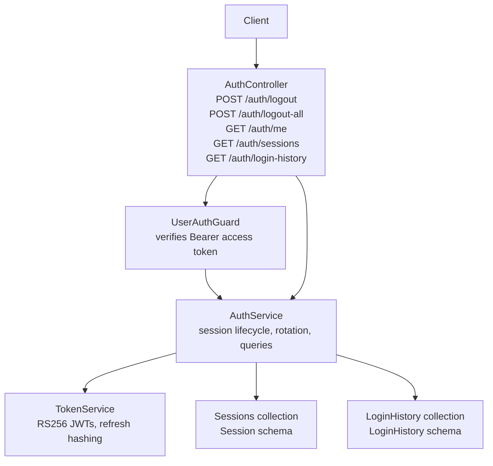
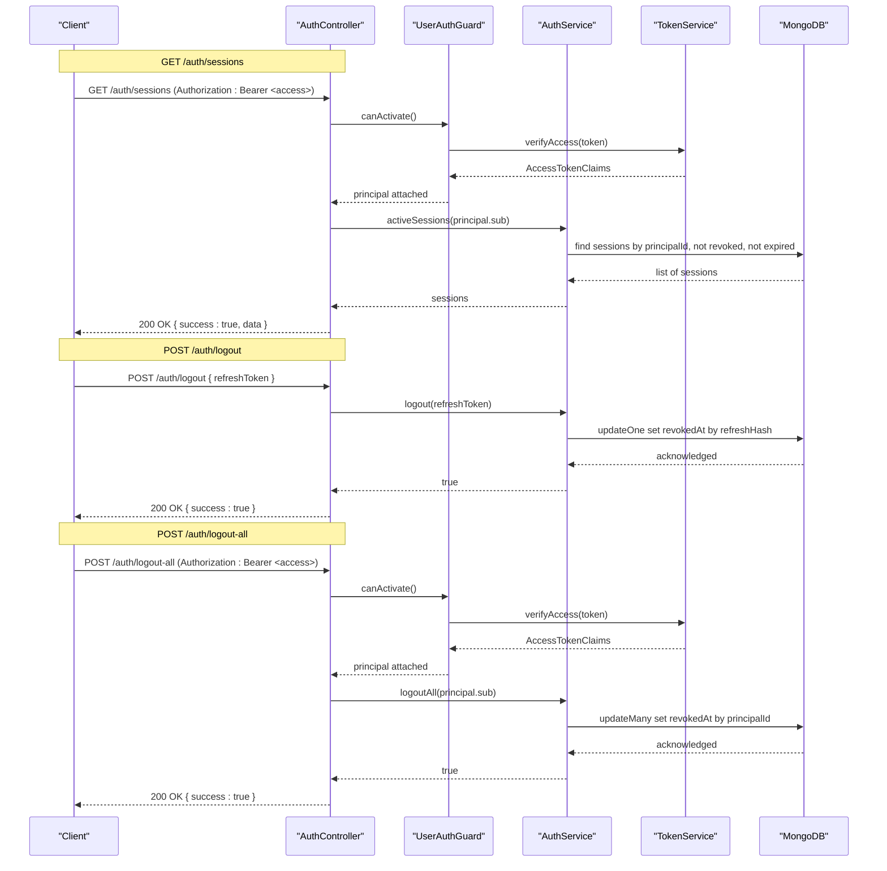
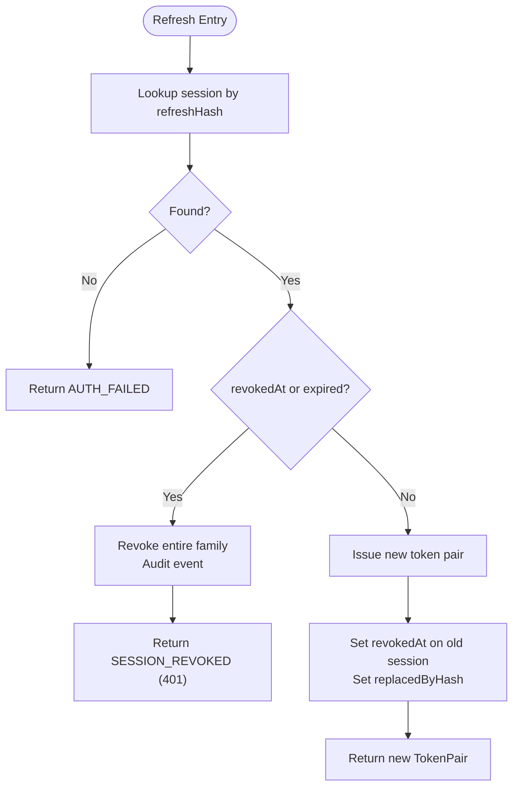
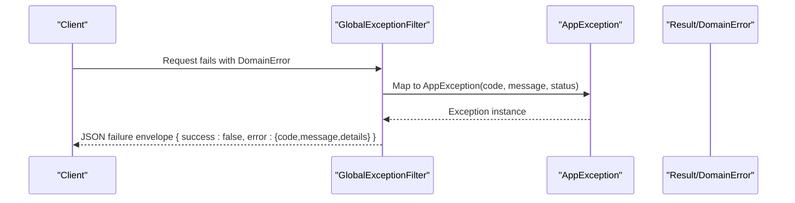
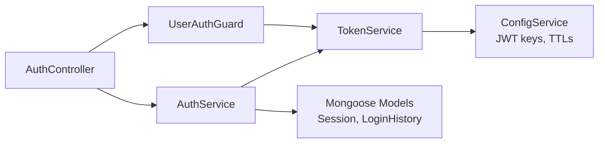

# Session Management

<cite>
**Referenced Files in This Document**
- [auth.controller.ts](file://backend/apps/api/src/modules/auth/presentation/auth.controller.ts)
- [auth.service.ts](file://backend/apps/api/src/modules/auth/application/auth.service.ts)
- [jwt-auth.guard.ts](file://backend/apps/api/src/modules/auth/presentation/jwt-auth.guard.ts)
- [token.service.ts](file://backend/apps/api/src/modules/auth/infrastructure/token.service.ts)
- [session.schema.ts](file://backend/apps/api/src/modules/auth/infrastructure/schemas/session.schema.ts)
- [login-history.schema.ts](file://backend/apps/api/src/modules/auth/infrastructure/schemas/login-history.schema.ts)
- [auth.dtos.ts](file://backend/apps/api/src/modules/auth/presentation/dto/auth.dtos.ts)
- [auth.types.ts](file://backend/apps/api/src/modules/auth/domain/auth.types.ts)
- [current-principal.decorator.ts](file://backend/apps/api/src/modules/auth/presentation/current-principal.decorator.ts)
- [app-exception.ts](file://backend/libs/shared/src/http/app-exception.ts)
- [global-exception.filter.ts](file://backend/libs/shared/src/http/global-exception.filter.ts)
- [result.ts](file://backend/libs/shared/src/kernel/result.ts)
</cite>

## Table of Contents
1. Introduction
2. Project Structure
3. Core Components
4. Architecture Overview
5. Detailed Component Analysis
6. Dependency Analysis
7. Performance Considerations
8. Troubleshooting Guide
9. Conclusion

## Introduction
This document provides comprehensive API documentation for session management endpoints and the underlying security model. It covers:
- Single-session logout using RefreshDto
- Multi-device logout (logout-all)
- Current user information retrieval
- Active sessions listing
- Login history retrieval
It also explains session lifecycle, refresh token rotation, device tracking, and error handling for SESSION_REVOKED and TOKEN_INVALID scenarios.

## Project Structure
The session management feature is implemented within the auth module:
- Presentation layer exposes REST endpoints under /auth
- Application layer implements business logic for login, refresh, logout, and queries
- Infrastructure layer stores sessions and login history and handles token signing/verification
- Domain types define access token claims and request context

**Diagram sources**
- [auth.controller.ts:53-137](file://backend/apps/api/src/modules/auth/presentation/auth.controller.ts#L53-L137)
- [jwt-auth.guard.ts:10-33](file://backend/apps/api/src/modules/auth/presentation/jwt-auth.guard.ts#L10-L33)
- [auth.service.ts:145-346](file://backend/apps/api/src/modules/auth/application/auth.service.ts#L145-L346)
- [token.service.ts:21-89](file://backend/apps/api/src/modules/auth/infrastructure/token.service.ts#L21-L89)
- [session.schema.ts:1-47](file://backend/apps/api/src/modules/auth/infrastructure/schemas/session.schema.ts#L1-L47)
- [login-history.schema.ts:1-33](file://backend/apps/api/src/modules/auth/infrastructure/schemas/login-history.schema.ts#L1-L33)

**Section sources**
- [auth.controller.ts:53-137](file://backend/apps/api/src/modules/auth/presentation/auth.controller.ts#L53-L137)
- [auth.service.ts:145-346](file://backend/apps/api/src/modules/auth/application/auth.service.ts#L145-L346)
- [session.schema.ts:1-47](file://backend/apps/api/src/modules/auth/infrastructure/schemas/session.schema.ts#L1-L47)
- [login-history.schema.ts:1-33](file://backend/apps/api/src/modules/auth/infrastructure/schemas/login-history.schema.ts#L1-L33)

## Core Components
- AuthController: Exposes session management endpoints and applies guards and throttling where appropriate.
- UserAuthGuard: Validates Bearer access tokens and attaches principal to the request.
- AuthService: Implements session lifecycle, refresh token rotation, logout, and queries for sessions and login history.
- TokenService: Issues RS256 access tokens and purpose-bound tokens; generates opaque refresh tokens hashed before storage.
- Schemas: Session and LoginHistory models persist session state and audit trails.
- DTOs: Input validation for endpoints including RefreshDto.
- Error Handling: Domain errors are mapped to HTTP status codes via a helper and global exception filter.

**Section sources**
- [auth.controller.ts:22-51](file://backend/apps/api/src/modules/auth/presentation/auth.controller.ts#L22-L51)
- [jwt-auth.guard.ts:10-33](file://backend/apps/api/src/modules/auth/presentation/jwt-auth.guard.ts#L10-L33)
- [auth.service.ts:185-232](file://backend/apps/api/src/modules/auth/application/auth.service.ts#L185-L232)
- [token.service.ts:21-89](file://backend/apps/api/src/modules/auth/infrastructure/token.service.ts#L21-L89)
- [auth.dtos.ts:72-75](file://backend/apps/api/src/modules/auth/presentation/dto/auth.dtos.ts#L72-L75)
- [app-exception.ts:5-17](file://backend/libs/shared/src/http/app-exception.ts#L5-L17)
- [global-exception.filter.ts:18-68](file://backend/libs/shared/src/http/global-exception.filter.ts#L18-L68)

## Architecture Overview
The session management flow uses short-lived access tokens (RS256 JWT) and long-lived opaque refresh tokens. Refresh tokens are stored as hashes with device and IP metadata. Rotation ensures that presenting an expired or revoked refresh token revokes the entire session family to mitigate theft.

**Diagram sources**
- [auth.controller.ts:98-137](file://backend/apps/api/src/modules/auth/presentation/auth.controller.ts#L98-L137)
- [jwt-auth.guard.ts:15-27](file://backend/apps/api/src/modules/auth/presentation/jwt-auth.guard.ts#L15-L27)
- [auth.service.ts:218-232](file://backend/apps/api/src/modules/auth/application/auth.service.ts#L218-L232)
- [session.schema.ts:1-47](file://backend/apps/api/src/modules/auth/infrastructure/schemas/session.schema.ts#L1-L47)

## Detailed Component Analysis

### Endpoints

- POST /auth/logout
  - Purpose: Revoke a single session identified by its refresh token.
  - Authentication: None required on endpoint; service validates refresh token hash.
  - Request body: RefreshDto containing refreshToken.
  - Behavior: Marks the session row as revoked if not already revoked.
  - Success response: 200 OK with success envelope.
  - Errors:
    - If refresh token is invalid or missing, returns UNPROCESSABLE_ENTITY via domain mapping.
    - If token was already revoked/expired and reused, triggers family revocation and returns SESSION_REVOKED with 401.

- POST /auth/logout-all
  - Purpose: Revoke all active sessions for the current user.
  - Authentication: Requires valid Bearer access token validated by UserAuthGuard.
  - Behavior: Revokes all non-revoked sessions for the authenticated user’s principalId.
  - Success response: 200 OK with success envelope.
  - Errors: Unauthorized if access token is missing or invalid.

- GET /auth/me
  - Purpose: Retrieve current user profile fields.
  - Authentication: Requires valid Bearer access token validated by UserAuthGuard.
  - Response: Selected user fields such as name, email, mobile, username, address, incomeType, monthlyIncome, status, kycStatus, referralCode, createdAt.
  - Errors: Unauthorized if access token is invalid.

- GET /auth/sessions
  - Purpose: List active sessions for the current user.
  - Authentication: Requires valid Bearer access token validated by UserAuthGuard.
  - Response: Array of session records including deviceId, ip, userAgent, createdAt, expiresAt.
  - Errors: Unauthorized if access token is invalid.

- GET /auth/login-history
  - Purpose: Retrieve recent login activity for the current user.
  - Authentication: Requires valid Bearer access token validated by UserAuthGuard.
  - Response: Recent login entries sorted by time descending, limited to a default count.
  - Errors: Unauthorized if access token is invalid.

**Section sources**
- [auth.controller.ts:98-137](file://backend/apps/api/src/modules/auth/presentation/auth.controller.ts#L98-L137)
- [auth.service.ts:218-287](file://backend/apps/api/src/modules/auth/application/auth.service.ts#L218-L287)
- [auth.dtos.ts:72-75](file://backend/apps/api/src/modules/auth/presentation/dto/auth.dtos.ts#L72-L75)
- [jwt-auth.guard.ts:15-27](file://backend/apps/api/src/modules/auth/presentation/jwt-auth.guard.ts#L15-L27)

### Session Lifecycle and Token Rotation
- Login issues an access token pair and creates a session record storing the hashed refresh token, device info, IP, user agent, and expiry.
- Refresh flow:
  - Validates refresh token hash against stored sessions.
  - If the token is expired or revoked, revokes the entire session family and returns SESSION_REVOKED.
  - Otherwise, issues a new token pair, revokes the old session row, and links it to the new refresh token via replacedByHash.
- Logout revokes a specific session by setting revokedAt.
- Logout-all revokes all sessions for the user.

**Diagram sources**
- [auth.service.ts:185-216](file://backend/apps/api/src/modules/auth/application/auth.service.ts#L185-L216)
- [session.schema.ts:1-47](file://backend/apps/api/src/modules/auth/infrastructure/schemas/session.schema.ts#L1-L47)

**Section sources**
- [auth.service.ts:145-232](file://backend/apps/api/src/modules/auth/application/auth.service.ts#L145-L232)
- [token.service.ts:73-84](file://backend/apps/api/src/modules/auth/infrastructure/token.service.ts#L73-L84)

### Device Tracking and Security Measures
- Device tracking: Each session stores deviceId, ip, and userAgent captured from the request context. New device detection triggers an email notification after successful login.
- Token security:
  - Access tokens are RS256 JWTs with short TTL configured via app config.
  - Refresh tokens are opaque random strings; only their SHA-256 hash is stored.
  - Password reset tokens include a password fingerprint to invalidate them after password changes.
- Rate limiting: Throttling applied to sensitive endpoints like login, refresh, OTP, and password reset.

**Section sources**
- [current-principal.decorator.ts:10-16](file://backend/apps/api/src/modules/auth/presentation/current-principal.decorator.ts#L10-L16)
- [auth.service.ts:318-344](file://backend/apps/api/src/modules/auth/application/auth.service.ts#L318-L344)
- [token.service.ts:21-89](file://backend/apps/api/src/modules/auth/infrastructure/token.service.ts#L21-L89)
- [auth.controller.ts:22-24](file://backend/apps/api/src/modules/auth/presentation/auth.controller.ts#L22-L24)

### Authentication Requirements and Error Handling
- Authentication:
  - Protected endpoints use UserAuthGuard to validate Bearer access tokens and attach principal.
  - Unprotected endpoints (e.g., logout by refresh token) rely on server-side validation of refresh token hash.
- Error mapping:
  - Domain errors are converted to AppException with explicit HTTP status codes.
  - Global exception filter wraps all responses in a consistent failure envelope.
  - Specific codes:
    - SESSION_REVOKED maps to 401 Unauthorized.
    - TOKEN_INVALID maps to 401 Unauthorized.
    - Other codes map accordingly (AUTH_FAILED, SUSPENDED, VERIFICATION_PENDING, etc.).

**Diagram sources**
- [global-exception.filter.ts:18-68](file://backend/libs/shared/src/http/global-exception.filter.ts#L18-L68)
- [app-exception.ts:5-17](file://backend/libs/shared/src/http/app-exception.ts#L5-L17)
- [result.ts:6-15](file://backend/libs/shared/src/kernel/result.ts#L6-L15)

**Section sources**
- [auth.controller.ts:25-51](file://backend/apps/api/src/modules/auth/presentation/auth.controller.ts#L25-L51)
- [jwt-auth.guard.ts:15-27](file://backend/apps/api/src/modules/auth/presentation/jwt-auth.guard.ts#L15-L27)
- [global-exception.filter.ts:18-68](file://backend/libs/shared/src/http/global-exception.filter.ts#L18-L68)

## Dependency Analysis
- AuthController depends on AuthService and applies UserAuthGuard for protected routes.
- AuthService depends on TokenService for issuing and verifying tokens, and on Mongoose models for Session and LoginHistory.
- TokenService depends on JwtService and configuration for keys and TTLs.
- Guards depend on TokenService to verify access tokens.
- DTOs provide input validation for endpoints.

**Diagram sources**
- [auth.controller.ts:53-137](file://backend/apps/api/src/modules/auth/presentation/auth.controller.ts#L53-L137)
- [auth.service.ts:28-40](file://backend/apps/api/src/modules/auth/application/auth.service.ts#L28-L40)
- [jwt-auth.guard.ts:10-33](file://backend/apps/api/src/modules/auth/presentation/jwt-auth.guard.ts#L10-L33)
- [token.service.ts:21-36](file://backend/apps/api/src/modules/auth/infrastructure/token.service.ts#L21-L36)

**Section sources**
- [auth.controller.ts:53-137](file://backend/apps/api/src/modules/auth/presentation/auth.controller.ts#L53-L137)
- [auth.service.ts:28-40](file://backend/apps/api/src/modules/auth/application/auth.service.ts#L28-L40)
- [jwt-auth.guard.ts:10-33](file://backend/apps/api/src/modules/auth/presentation/jwt-auth.guard.ts#L10-L33)
- [token.service.ts:21-36](file://backend/apps/api/src/modules/auth/infrastructure/token.service.ts#L21-L36)

## Performance Considerations
- Use short-lived access tokens to minimize risk exposure and reduce reliance on server-side checks.
- Store only hashed refresh tokens to avoid persisting secrets.
- Indexes on sessions and login history improve query performance for active sessions and recent logins.
- Apply throttling to sensitive endpoints to prevent abuse.
- Batch operations (e.g., family revocation) should be used judiciously to avoid excessive writes.

[No sources needed since this section provides general guidance]

## Troubleshooting Guide
Common issues and resolutions:
- Invalid or expired refresh token:
  - Symptom: 401 Unauthorized with code SESSION_REVOKED or AUTH_FAILED.
  - Cause: Token was revoked, expired, or presented again after reuse.
  - Resolution: Prompt user to sign in again; ensure client rotates refresh tokens correctly.
- Missing or malformed access token:
  - Symptom: 401 Unauthorized with code UNAUTHORIZED.
  - Cause: Missing Authorization header or invalid token format.
  - Resolution: Ensure Bearer token is included and valid.
- Validation errors:
  - Symptom: 422 UNPROCESSABLE with details array.
  - Cause: DTO validation failures (e.g., invalid refreshToken length).
  - Resolution: Validate inputs per DTO constraints.
- Unexpected server errors:
  - Symptom: 500 INTERNAL with generic message.
  - Cause: Unhandled exceptions in application code.
  - Resolution: Check logs for stack traces; reproduce with minimal payload.

**Section sources**
- [auth.controller.ts:25-51](file://backend/apps/api/src/modules/auth/presentation/auth.controller.ts#L25-L51)
- [jwt-auth.guard.ts:15-27](file://backend/apps/api/src/modules/auth/presentation/jwt-auth.guard.ts#L15-L27)
- [global-exception.filter.ts:18-68](file://backend/libs/shared/src/http/global-exception.filter.ts#L18-L68)

## Conclusion
The session management system enforces strong security through RS256 access tokens, opaque hashed refresh tokens, device tracking, and robust rotation policies. Endpoints provide clear controls for single and multi-device logout, visibility into active sessions, and auditability via login history. Proper error handling ensures predictable client behavior and safe failure modes.

[No sources needed since this section summarizes without analyzing specific files]