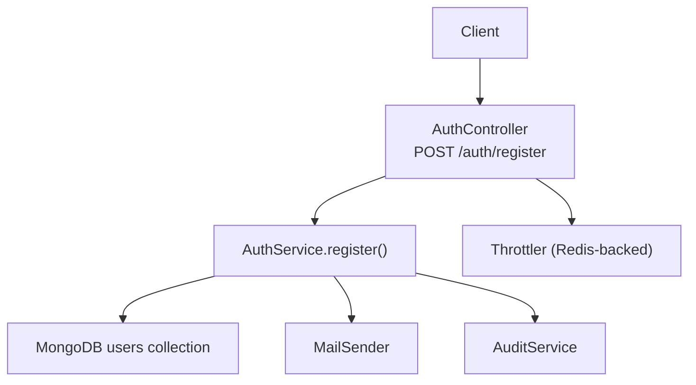
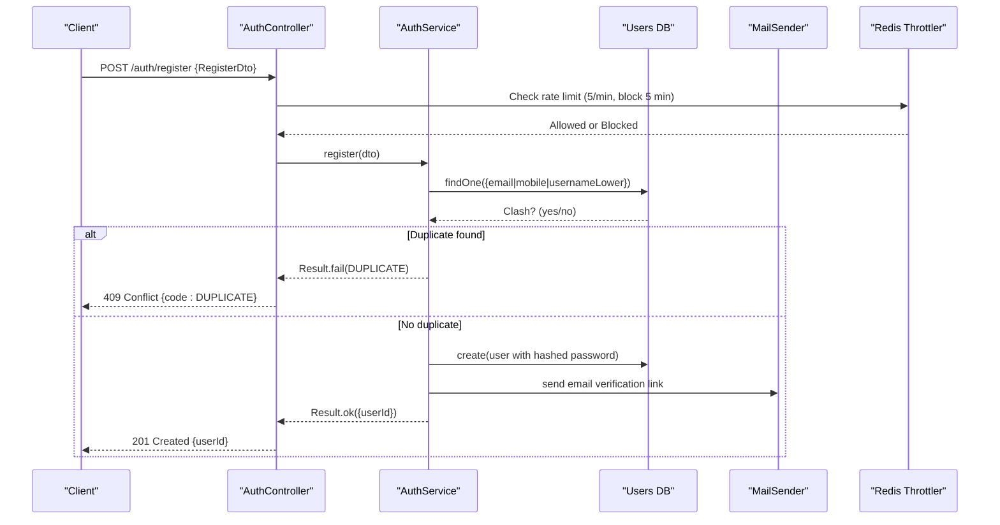
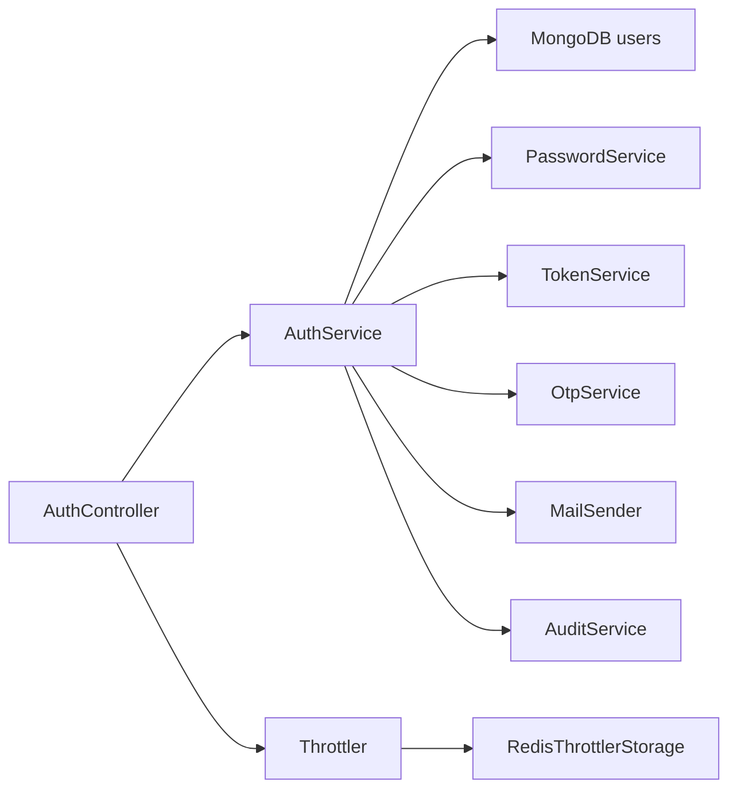

# User Registration

<cite>
**Referenced Files in This Document**
- [auth.controller.ts](file://backend/apps/api/src/modules/auth/presentation/auth.controller.ts)
- [auth.dtos.ts](file://backend/apps/api/src/modules/auth/presentation/dto/auth.dtos.ts)
- [auth.service.ts](file://backend/apps/api/src/modules/auth/application/auth.service.ts)
- [user.schema.ts](file://backend/apps/api/src/modules/auth/infrastructure/schemas/user.schema.ts)
- [auth.types.ts](file://backend/apps/api/src/modules/auth/domain/auth.types.ts)
- [redis-throttler.storage.ts](file://backend/libs/shared/src/rate-limit/redis-throttler.storage.ts)
- [app-exception.ts](file://backend/libs/shared/src/http/app-exception.ts)
</cite>

## Table of Contents
1. [Introduction](#introduction)
2. [Project Structure](#project-structure)
3. [Core Components](#core-components)
4. [Architecture Overview](#architecture-overview)
5. [Detailed Component Analysis](#detailed-component-analysis)
6. [Dependency Analysis](#dependency-analysis)
7. [Performance Considerations](#performance-considerations)
8. [Troubleshooting Guide](#troubleshooting-guide)
9. [Conclusion](#conclusion)

## Introduction
This document provides detailed API documentation for user registration, focusing on the POST /auth/register endpoint. It explains the request schema (RegisterDto), validation rules, registration flow, email verification requirements, duplicate user handling, rate limiting, and security measures. It also includes curl examples to test the endpoint and guidance for expected responses and error scenarios.

## Project Structure
The registration feature is implemented across presentation, application, and infrastructure layers:
- Presentation layer exposes the HTTP endpoint and applies throttling.
- Application layer orchestrates business logic, including duplicate checks, persistence, auditing, and email verification.
- Infrastructure layer defines data models and shared utilities like throttling storage and exception mapping.

**Diagram sources**
- [auth.controller.ts:53-61](file://backend/apps/api/src/modules/auth/presentation/auth.controller.ts#L53-L61)
- [auth.service.ts:44-81](file://backend/apps/api/src/modules/auth/application/auth.service.ts#L44-L81)
- [redis-throttler.storage.ts:16-54](file://backend/libs/shared/src/rate-limit/redis-throttler.storage.ts#L16-L54)

**Section sources**
- [auth.controller.ts:53-61](file://backend/apps/api/src/modules/auth/presentation/auth.controller.ts#L53-L61)
- [auth.service.ts:44-81](file://backend/apps/api/src/modules/auth/application/auth.service.ts#L44-L81)

## Core Components
- Endpoint: POST /auth/register
- Request DTO: RegisterDto with required fields and validation rules
- Business Logic: AuthService.register handles uniqueness checks, hashing, persistence, audit logging, and triggers email verification
- Rate Limiting: Strict throttle applied to auth endpoints
- Error Mapping: Domain errors mapped to HTTP status codes via AppException

Key behaviors:
- Duplicate detection by email, mobile, or username (case-insensitive)
- Password must meet complexity rules enforced at DTO level
- New accounts are created with PENDING_APPROVAL status; login is blocked until admin approval
- Email verification link is sent after registration (and after mobile verification if applicable)

**Section sources**
- [auth.controller.ts:22-61](file://backend/apps/api/src/modules/auth/presentation/auth.controller.ts#L22-L61)
- [auth.dtos.ts:9-41](file://backend/apps/api/src/modules/auth/presentation/dto/auth.dtos.ts#L9-L41)
- [auth.service.ts:44-81](file://backend/apps/api/src/modules/auth/application/auth.service.ts#L44-L81)
- [user.schema.ts:5-67](file://backend/apps/api/src/modules/auth/infrastructure/schemas/user.schema.ts#L5-L67)
- [auth.types.ts:1-9](file://backend/apps/api/src/modules/auth/domain/auth.types.ts#L1-L9)

## Architecture Overview
The registration flow involves request validation, duplication checks, secure password hashing, persistence, auditing, and sending an email verification link.

**Diagram sources**
- [auth.controller.ts:53-61](file://backend/apps/api/src/modules/auth/presentation/auth.controller.ts#L53-L61)
- [auth.service.ts:44-81](file://backend/apps/api/src/modules/auth/application/auth.service.ts#L44-L81)
- [redis-throttler.storage.ts:16-54](file://backend/libs/shared/src/rate-limit/redis-throttler.storage.ts#L16-L54)

## Detailed Component Analysis

### Endpoint: POST /auth/register
- Path: /auth/register
- Method: POST
- Rate Limiting: Strict throttle configured for authentication endpoints
- Request Body: RegisterDto
- Success Response: Returns a user identifier upon successful creation
- Error Responses:
  - 409 Conflict: DUPLICATE when email, mobile, or username already exists
  - 422 Unprocessable Entity: Validation failures from class-validator rules
  - 429 Too Many Requests: When exceeding 5 requests per minute (with subsequent 5-minute block)

Request payload structure (RegisterDto):
- name: string, length 2–100
- email: valid email format
- mobile: Indian E.164 format (+91 followed by 10 digits starting with 6–9)
- username: 4–30 characters, letters/digits/underscore only
- password: 8–72 characters, must include uppercase, lowercase, and digit
- address: string, length 5–500
- incomeType: one of SALARIED or OWN
- monthlyIncome: integer, non-negative, up to 100,000,000
- referredBy: optional string, max length 20

Validation notes:
- All validations are enforced by class-validator decorators on RegisterDto
- Mobile number must match strict pattern for Indian numbers
- Username uniqueness is case-insensitive due to normalized storage

Registration flow details:
- Duplicate check: The service queries for existing records by email, mobile, or usernameLower
- On duplicate, returns DUPLICATE with field context
- On success:
  - Creates user with hashed password
  - Sets initial status to PENDING_APPROVAL
  - Records audit event
  - Sends email verification link

Email verification:
- After registration, an email verification link is generated and sent
- Verification token has a limited lifetime and is purpose-bound
- After verifying email, account remains pending approval until admin action

Login restrictions:
- Users cannot log in while in PENDING_APPROVAL or other non-active states
- Login attempts will return appropriate domain errors based on status

Security measures:
- Passwords are hashed using Argon2id
- JWT tokens are used for session management elsewhere; registration itself does not issue tokens
- Rate limiting protects against brute-force and abuse
- Audit logging captures registration events

**Section sources**
- [auth.controller.ts:22-61](file://backend/apps/api/src/modules/auth/presentation/auth.controller.ts#L22-L61)
- [auth.dtos.ts:9-41](file://backend/apps/api/src/modules/auth/presentation/dto/auth.dtos.ts#L9-L41)
- [auth.service.ts:44-81](file://backend/apps/api/src/modules/auth/application/auth.service.ts#L44-L81)
- [user.schema.ts:5-67](file://backend/apps/api/src/modules/auth/infrastructure/schemas/user.schema.ts#L5-L67)
- [auth.types.ts:1-9](file://backend/apps/api/src/modules/auth/domain/auth.types.ts#L1-L9)

### Rate Limiting
- Strict throttle configuration: 5 requests per minute with a 5-minute block duration for auth endpoints
- Redis-backed storage ensures limits are consistent across multiple API instances
- Exceeding the limit results in a block that prevents further requests until the block expires

Implementation highlights:
- Throttle decorator applied to register and related endpoints
- RedisThrottlerStorage increments counters and enforces blocks
- Block duration is set to protect sensitive operations

**Section sources**
- [auth.controller.ts:22-23](file://backend/apps/api/src/modules/auth/presentation/auth.controller.ts#L22-L23)
- [redis-throttler.storage.ts:16-54](file://backend/libs/shared/src/rate-limit/redis-throttler.storage.ts#L16-L54)

### Error Handling and Status Codes
- Domain errors are mapped to HTTP status codes:
  - DUPLICATE → 409 Conflict
  - AUTH_FAILED, SESSION_REVOKED, TOKEN_INVALID → 401 Unauthorized
  - SUSPENDED, VERIFICATION_PENDING, APPROVAL_PENDING, REJECTED → 403 Forbidden
  - NOT_FOUND → 404 Not Found
  - OTP_HOURLY_LIMIT, OTP_COOLDOWN → 429 Too Many Requests
- AppException wraps domain errors with stable machine codes and details

Response envelope behavior:
- Exceptions are converted into structured responses with code, message, and optional details

**Section sources**
- [auth.controller.ts:25-51](file://backend/apps/api/src/modules/auth/presentation/auth.controller.ts#L25-L51)
- [app-exception.ts:5-17](file://backend/libs/shared/src/http/app-exception.ts#L5-L17)

### Data Model and Constraints
- User schema enforces unique constraints on email and mobile
- UsernameLower ensures case-insensitive uniqueness
- Status defaults to PENDING_APPROVAL for new registrations
- KYC status defaults to NOT_SUBMITTED

**Section sources**
- [user.schema.ts:5-67](file://backend/apps/api/src/modules/auth/infrastructure/schemas/user.schema.ts#L5-L67)

## Dependency Analysis
The registration endpoint depends on several components:
- AuthController depends on AuthService and Throttler
- AuthService depends on MongoDB User model, PasswordService, TokenService, OtpService, MailSender, AuditService, and ConfigService
- RedisThrottlerStorage depends on Redis client for distributed rate limiting
- AppException maps domain errors to HTTP responses

**Diagram sources**
- [auth.controller.ts:53-61](file://backend/apps/api/src/modules/auth/presentation/auth.controller.ts#L53-L61)
- [auth.service.ts:29-40](file://backend/apps/api/src/modules/auth/application/auth.service.ts#L29-L40)
- [redis-throttler.storage.ts:13-14](file://backend/libs/shared/src/rate-limit/redis-throttler.storage.ts#L13-L14)

**Section sources**
- [auth.controller.ts:53-61](file://backend/apps/api/src/modules/auth/presentation/auth.controller.ts#L53-L61)
- [auth.service.ts:29-40](file://backend/apps/api/src/modules/auth/application/auth.service.ts#L29-L40)

## Performance Considerations
- Rate limiting reduces load and protects against abuse
- Unique checks use efficient database queries
- Auditing and email sending are asynchronous side effects that do not block core registration flow
- Redis-backed throttling scales horizontally across instances

[No sources needed since this section provides general guidance]

## Troubleshooting Guide
Common issues and resolutions:
- DUPLICATE error: Ensure the email, mobile, or username is not already registered. Check for typos or case differences in username.
- Validation errors: Verify all fields conform to the specified formats and lengths. Pay attention to mobile number format and password complexity.
- Rate limit exceeded: Wait for the block duration to expire before retrying. Avoid rapid retries.
- Email verification not received: Check spam folder and ensure APP_BASE_URL is correctly configured for generating verification links.

Error mapping reference:
- DUPLICATE → 409 Conflict
- Validation failures → 422 Unprocessable Entity
- Rate limit exceeded → 429 Too Many Requests

**Section sources**
- [auth.controller.ts:25-51](file://backend/apps/api/src/modules/auth/presentation/auth.controller.ts#L25-L51)
- [auth.dtos.ts:9-41](file://backend/apps/api/src/modules/auth/presentation/dto/auth.dtos.ts#L9-L41)

## Conclusion
The POST /auth/register endpoint provides a secure and validated registration flow with robust protections against duplicates, brute force, and invalid inputs. Accounts are created in a pending approval state, requiring admin review before login. Email verification is integrated to ensure contact validity. Rate limiting and secure password hashing enhance security. Use the provided curl examples to test the endpoint and handle expected responses appropriately.

[No sources needed since this section summarizes without analyzing specific files]

## Appendices

### Request Examples
Successful registration:
- Send a POST request to /auth/register with a JSON body containing all required fields according to RegisterDto. Expect a 201 response with a user identifier.

Duplicate registration:
- If the email, mobile, or username already exists, expect a 409 response with code DUPLICATE and details indicating the conflicting field.

Rate-limited requests:
- Exceeding 5 requests per minute results in a 429 response with a block duration.

### Curl Examples
Note: Replace placeholders with actual values. Ensure your server base URL is correct.

- Successful registration:
  - curl -X POST https://your-api-domain/auth/register -H "Content-Type: application/json" -d '{"name":"John Doe","email":"john@example.com","mobile":"+919876543210","username":"johndoe","password":"Str0ngPass!","address":"123 Main St","incomeType":"SALARIED","monthlyIncome":50000}'

- Duplicate email:
  - curl -X POST https://your-api-domain/auth/register -H "Content-Type: application/json" -d '{"name":"Jane Doe","email":"existing@example.com","mobile":"+919876543211","username":"janedoe","password":"Str0ngPass!","address":"456 Oak Ave","incomeType":"OWN","monthlyIncome":75000}'

- Invalid password:
  - curl -X POST https://your-api-domain/auth/register -H "Content-Type: application/json" -d '{"name":"Test User","email":"test@example.com","mobile":"+919876543212","username":"testuser","password":"weak","address":"789 Pine Rd","incomeType":"SALARIED","monthlyIncome":30000}'

- Rate limit exceeded:
  - Repeat registration requests rapidly to exceed 5 per minute; expect 429 responses with block duration information.

[No sources needed since this section provides usage examples]