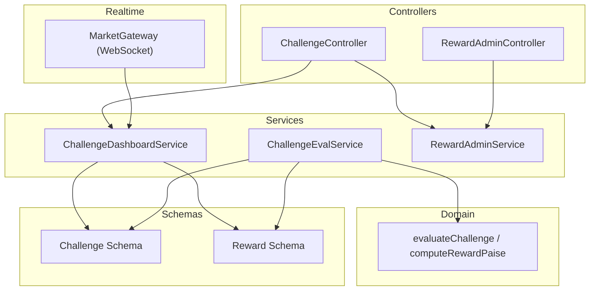
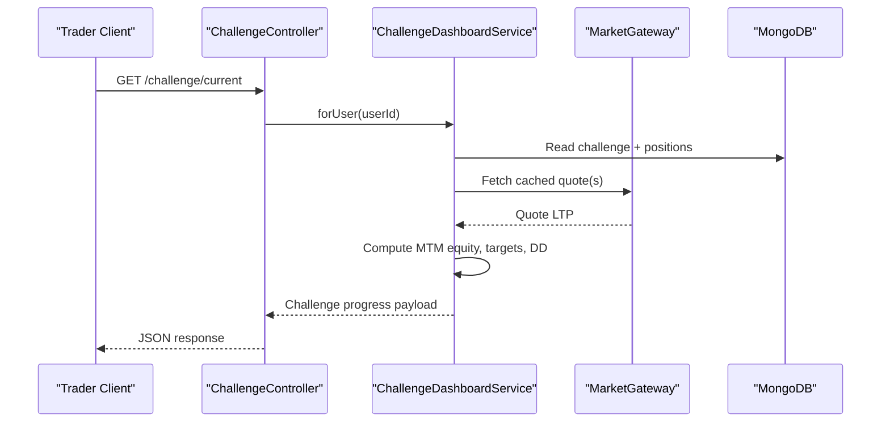
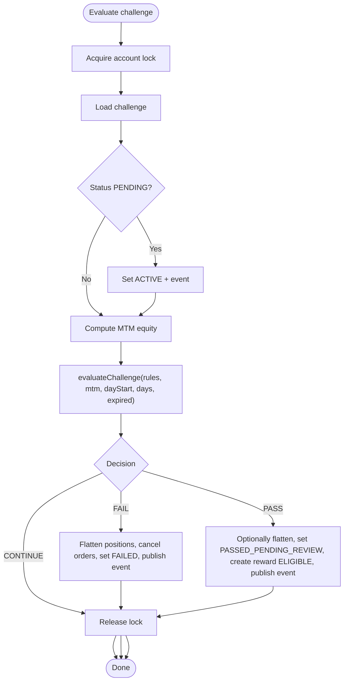
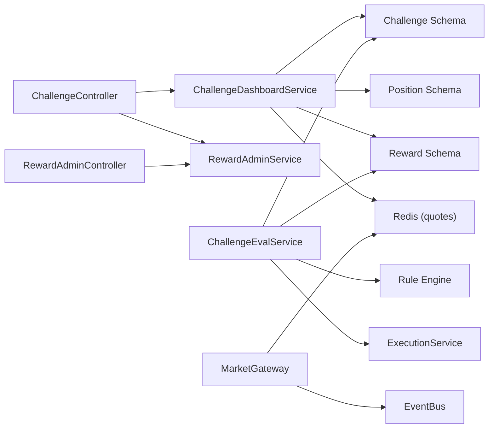

# Challenge & Reward APIs

<cite>
**Referenced Files in This Document**
- [challenge.controller.ts](file://backend/apps/api/src/modules/challenge/presentation/challenge.controller.ts)
- [reward-admin.controller.ts](file://backend/apps/api/src/modules/challenge/presentation/reward-admin.controller.ts)
- [challenge-dashboard.service.ts](file://backend/apps/api/src/modules/challenge/application/challenge-dashboard.service.ts)
- [challenge-eval.service.ts](file://backend/apps/api/src/modules/challenge/application/challenge-eval.service.ts)
- [challenge-rules-eval.ts](file://backend/apps/api/src/modules/challenge/domain/challenge-rules-eval.ts)
- [reward.schema.ts](file://backend/apps/api/src/modules/challenge/infrastructure/schemas/reward.schema.ts)
- [challenge.schema.ts](file://backend/apps/api/src/modules/plans/infrastructure/schemas/challenge.schema.ts)
- [market.gateway.ts](file://backend/apps/api/src/modules/market/presentation/market.gateway.ts)
- [plan.controller.ts](file://backend/apps/api/src/modules/plans/presentation/plan.controller.ts)
</cite>

## Table of Contents
1. Introduction
2. Project Structure
3. Core Components
4. Architecture Overview
5. Detailed Component Analysis
6. Dependency Analysis
7. Performance Considerations
8. Troubleshooting Guide
9. Conclusion

## Introduction
This document provides comprehensive API documentation for challenge enrollment, progress tracking, performance evaluation, reward distribution, and achievement management. It covers:
- Challenge participation endpoints to view current, detail, and history
- Real-time rule evaluation engine that transitions challenges to PASS or FAIL
- Automated reward creation on pass and admin review workflow
- WebSocket-based real-time market updates used by MTM calculations
- Request/response schemas and examples for joining challenges, tracking progress, claiming rewards, and viewing achievements

## Project Structure
The challenge and reward feature spans controllers, services, domain logic, and data schemas:
- Controllers expose REST endpoints for traders and admins
- Services implement dashboard reads, evaluation, and reward administration
- Domain module contains pure rule evaluation and reward computation
- Schemas define persistent models for challenges and rewards
- WebSocket gateway delivers real-time quotes used in MTM calculations

**Diagram sources**
- [challenge.controller.ts:8-35](file://backend/apps/api/src/modules/challenge/presentation/challenge.controller.ts#L8-L35)
- [reward-admin.controller.ts:23-57](file://backend/apps/api/src/modules/challenge/presentation/reward-admin.controller.ts#L23-L57)
- [challenge-dashboard.service.ts:14-105](file://backend/apps/api/src/modules/challenge/application/challenge-dashboard.service.ts#L14-L105)
- [challenge-eval.service.ts:24-132](file://backend/apps/api/src/modules/challenge/application/challenge-eval.service.ts#L24-L132)
- [challenge-rules-eval.ts:35-66](file://backend/apps/api/src/modules/challenge/domain/challenge-rules-eval.ts#L35-L66)
- [challenge.schema.ts:23-70](file://backend/apps/api/src/modules/plans/infrastructure/schemas/challenge.schema.ts#L23-L70)
- [reward.schema.ts:20-50](file://backend/apps/api/src/modules/challenge/infrastructure/schemas/reward.schema.ts#L20-L50)
- [market.gateway.ts:26-133](file://backend/apps/api/src/modules/market/presentation/market.gateway.ts#L26-L133)

**Section sources**
- [challenge.controller.ts:8-35](file://backend/apps/api/src/modules/challenge/presentation/challenge.controller.ts#L8-L35)
- [reward-admin.controller.ts:23-57](file://backend/apps/api/src/modules/challenge/presentation/reward-admin.controller.ts#L23-L57)
- [challenge-dashboard.service.ts:14-105](file://backend/apps/api/src/modules/challenge/application/challenge-dashboard.service.ts#L14-L105)
- [challenge-eval.service.ts:24-132](file://backend/apps/api/src/modules/challenge/application/challenge-eval.service.ts#L24-L132)
- [challenge-rules-eval.ts:35-66](file://backend/apps/api/src/modules/challenge/domain/challenge-rules-eval.ts#L35-L66)
- [challenge.schema.ts:23-70](file://backend/apps/api/src/modules/plans/infrastructure/schemas/challenge.schema.ts#L23-L70)
- [reward.schema.ts:20-50](file://backend/apps/api/src/modules/challenge/infrastructure/schemas/reward.schema.ts#L20-L50)
- [market.gateway.ts:26-133](file://backend/apps/api/src/modules/market/presentation/market.gateway.ts#L26-L133)

## Core Components
- Challenge Dashboard Service: Reads a user’s active challenge and computes MTM equity, profit target progress, drawdown usage, trading days, and associated reward status.
- Challenge Evaluation Service: Runs under per-account locks to evaluate rules on fills and periodic sweeps; transitions to PASS or FAIL and creates reward records.
- Reward Admin Service: Provides queueing, approval, rejection, and mark-paid workflows with audit trails and state machine enforcement.
- Rule Engine: Pure functions to decide CONTINUE/PASS/FAIL and compute reward amounts based on snapshotted rules.
- WebSocket Gateway: Delivers real-time quotes used for MTM calculations and can be extended for challenge event notifications.

**Section sources**
- [challenge-dashboard.service.ts:23-96](file://backend/apps/api/src/modules/challenge/application/challenge-dashboard.service.ts#L23-L96)
- [challenge-eval.service.ts:57-131](file://backend/apps/api/src/modules/challenge/application/challenge-eval.service.ts#L57-L131)
- [reward-admin.service.ts:17-92](file://backend/apps/api/src/modules/challenge/application/reward-admin.service.ts#L17-L92)
- [challenge-rules-eval.ts:35-66](file://backend/apps/api/src/modules/challenge/domain/challenge-rules-eval.ts#L35-L66)
- [market.gateway.ts:48-133](file://backend/apps/api/src/modules/market/presentation/market.gateway.ts#L48-L133)

## Architecture Overview
The system combines REST APIs for user/admin flows with an internal evaluation service that reacts to trading events and market data.

**Diagram sources**
- [challenge.controller.ts:16-24](file://backend/apps/api/src/modules/challenge/presentation/challenge.controller.ts#L16-L24)
- [challenge-dashboard.service.ts:23-96](file://backend/apps/api/src/modules/challenge/application/challenge-dashboard.service.ts#L23-L96)
- [market.gateway.ts:91-113](file://backend/apps/api/src/modules/market/presentation/market.gateway.ts#L91-L113)

## Detailed Component Analysis

### Challenge Participation Endpoints
- GET /challenge/current: Returns the trader’s latest active challenge with progress metrics.
- GET /challenge/history: Lists all challenges for the authenticated user with summary fields.
- GET /challenge/:challengeId: Returns detailed progress for a specific challenge.
- GET /challenge/:challengeId/reward: Returns the reward record for a challenge if present.

Request/Response Notes
- Authentication: JWT required via guard.
- Response includes plan name, status, rules snapshot, capital, realized/unrealized P&L, MTM equity, profit target progress, drawdown usage, trading days, time bounds, and optional reward info.

Example Flow
- Join a challenge via plans flow (see Plans section), then call GET /challenge/current to see live progress.

**Section sources**
- [challenge.controller.ts:8-35](file://backend/apps/api/src/modules/challenge/presentation/challenge.controller.ts#L8-L35)
- [challenge-dashboard.service.ts:23-96](file://backend/apps/api/src/modules/challenge/application/challenge-dashboard.service.ts#L23-L96)

### Challenge Enrollment and Purchase
- POST /plans/order: Create order for a plan (triggers purchase flow).
- POST /plans/confirm: Confirm checkout with payment details.
- GET /plans/me/subscription: View current subscription.
- GET /plans/me/payments: View payment history.

Notes
- Throttling is applied to order creation.
- After confirmation, a challenge instance may be created in PENDING and later activated by evaluation.

**Section sources**
- [plan.controller.ts:25-63](file://backend/apps/api/src/modules/plans/presentation/plan.controller.ts#L25-L63)

### Performance Evaluation Engine
- The evaluation runs under a per-challenge lock to avoid interleaving with fill processing.
- On first evaluation, PENDING becomes ACTIVE.
- Rules are evaluated in strict order: daily drawdown → max drawdown → expiry → profit target with minimum trading days.
- On PASS: positions may be frozen/flattened depending on config, status moves to PASSED_PENDING_REVIEW, and a reward record is created as ELIGIBLE.
- On FAIL: positions are flattened, open orders cancelled, status set to FAILED, and a failure event published.

**Diagram sources**
- [challenge-eval.service.ts:57-131](file://backend/apps/api/src/modules/challenge/application/challenge-eval.service.ts#L57-L131)
- [challenge-rules-eval.ts:35-66](file://backend/apps/api/src/modules/challenge/domain/challenge-rules-eval.ts#L35-L66)

**Section sources**
- [challenge-eval.service.ts:57-131](file://backend/apps/api/src/modules/challenge/application/challenge-eval.service.ts#L57-L131)
- [challenge-rules-eval.ts:35-66](file://backend/apps/api/src/modules/challenge/domain/challenge-rules-eval.ts#L35-L66)

### Reward Distribution and Achievement Management
- Reward lifecycle states: ELIGIBLE → APPROVED → PAID or ELIGIBLE → REJECTED.
- Admin endpoints:
  - GET /admin/rewards/queue: Paginated queue filtered by optional status.
  - GET /admin/rewards/:id: Detail including linked challenge.
  - POST /admin/rewards/:id/approve: Approve with optional override amount and reason.
  - POST /admin/rewards/:id/reject: Reject with reason.
  - POST /admin/rewards/:id/mark-paid: Mark paid with optional reason.
- State transitions are enforced; invalid transitions return conflict errors.
- Audit trail recorded for each transition.

Request/Response Schemas
- Queue query parameters: status (optional), page (default 1), pageSize (default 20).
- Approve body: overrideAmountPaise (optional), reason (optional).
- Reject body: reason (required).
- Mark paid body: reason (optional).

Examples
- Review eligible rewards: GET /admin/rewards/queue?status=ELIGIBLE&page=1&pageSize=20
- Approve reward: POST /admin/rewards/{id}/approve with { overrideAmountPaise?, reason? }
- Mark paid: POST /admin/rewards/{id}/mark-paid with { reason? }

**Section sources**
- [reward-admin.controller.ts:23-57](file://backend/apps/api/src/modules/challenge/presentation/reward-admin.controller.ts#L23-L57)
- [reward-admin.service.ts:17-92](file://backend/apps/api/src/modules/challenge/application/reward-admin.service.ts#L17-L92)
- [reward.schema.ts:4-50](file://backend/apps/api/src/modules/challenge/infrastructure/schemas/reward.schema.ts#L4-L50)

### Data Models and Schemas
- Challenge schema includes plan metadata, snapshotted rules, live equity fields, trading days, status, and timestamps.
- Reward schema includes computed and optional overridden amounts, status, reviewer info, decision reason, and timeline.

Key Fields
- Challenge.rules: profitTargetPct, maxDrawdownPct, dailyDrawdownPct, drawdownAnchor, minTradingDays, expiryDays, rewardPct, segments.
- Challenge.live: equityPaise, peakEquityPaise, dayStartEquityPaise, realizedPnlPaise, tradingDays[], status, startedAt, endsAt.
- Reward: challengeId, userId, rewardPct, computedAmountPaise, overrideAmountPaise, status, reviewerId, decisionReason, timeline[].

**Section sources**
- [challenge.schema.ts:23-70](file://backend/apps/api/src/modules/plans/infrastructure/schemas/challenge.schema.ts#L23-L70)
- [reward.schema.ts:20-50](file://backend/apps/api/src/modules/challenge/infrastructure/schemas/reward.schema.ts#L20-L50)

### Real-Time Progress Updates via WebSocket
- WebSocket endpoint: /ws with JWT token in query string.
- Clients subscribe to instrument keys; server relays last cached quote and live ticks.
- Quotes are used by MTM calculation to update unrealized P&L.
- Future extension: broadcast challenge events (e.g., passed/failed) through the same gateway or a dedicated channel.

Client Flow
- Connect with token, send subscribe message with instrumentKeys, receive initial quote and subsequent ticks.

**Section sources**
- [market.gateway.ts:48-133](file://backend/apps/api/src/modules/market/presentation/market.gateway.ts#L48-L133)
- [challenge-dashboard.service.ts:98-104](file://backend/apps/api/src/modules/challenge/application/challenge-dashboard.service.ts#L98-L104)

## Dependency Analysis
- Controllers depend on services for business logic and validation.
- Dashboard service depends on MongoDB (challenges, positions, rewards), Redis (quote cache), and market data service.
- Evaluation service depends on MongoDB, Redis, event bus, execution service, and app configuration.
- Rule engine is pure and has no I/O dependencies.
- WebSocket gateway depends on token service, Redis, event bus, and market data service.

**Diagram sources**
- [challenge.controller.ts:8-35](file://backend/apps/api/src/modules/challenge/presentation/challenge.controller.ts#L8-L35)
- [reward-admin.controller.ts:23-57](file://backend/apps/api/src/modules/challenge/presentation/reward-admin.controller.ts#L23-L57)
- [challenge-dashboard.service.ts:14-105](file://backend/apps/api/src/modules/challenge/application/challenge-dashboard.service.ts#L14-L105)
- [challenge-eval.service.ts:24-132](file://backend/apps/api/src/modules/challenge/application/challenge-eval.service.ts#L24-L132)
- [market.gateway.ts:26-133](file://backend/apps/api/src/modules/market/presentation/market.gateway.ts#L26-L133)

**Section sources**
- [challenge-dashboard.service.ts:14-105](file://backend/apps/api/src/modules/challenge/application/challenge-dashboard.service.ts#L14-L105)
- [challenge-eval.service.ts:24-132](file://backend/apps/api/src/modules/challenge/application/challenge-eval.service.ts#L24-L132)
- [market.gateway.ts:26-133](file://backend/apps/api/src/modules/market/presentation/market.gateway.ts#L26-L133)

## Performance Considerations
- Per-account locking prevents race conditions during evaluation and settlement.
- MTM equity uses cached quotes from Redis to minimize latency and external calls.
- Pagination and selective field projection reduce database load for admin queues and dashboards.
- WebSocket rooms scale by instrument key; interest is added only when needed and removed when last client leaves.

[No sources needed since this section provides general guidance]

## Troubleshooting Guide
Common Issues and Resolutions
- Invalid reward transition: Occurs when attempting unsupported state changes (e.g., approving already approved). Check current status before calling approve/reject/mark-paid.
- Not found errors: Ensure reward IDs and challenge IDs exist and belong to the requesting user where applicable.
- Authentication failures on WebSocket: Provide a valid access token in the query string when connecting to /ws.
- Stale quotes: If MTM appears incorrect, verify Redis quote cache availability and market data subscriptions.

Error Mapping
- NOT_FOUND → 404
- REWARD_INVALID_TRANSITION → 409 Conflict
- Other domain errors → 422 Unprocessable Entity

**Section sources**
- [reward-admin.controller.ts:12-21](file://backend/apps/api/src/modules/challenge/presentation/reward-admin.controller.ts#L12-L21)
- [market.gateway.ts:48-60](file://backend/apps/api/src/modules/market/presentation/market.gateway.ts#L48-L60)

## Conclusion
The Challenge & Reward system provides a robust pipeline from enrollment to evaluation and payout:
- Traders track progress via REST endpoints powered by real-time market data.
- The evaluation engine enforces rules deterministically and triggers automated side effects.
- Rewards are created on pass and managed through a secure admin workflow with full auditability.
- WebSocket support enables low-latency updates for market data and can be extended for challenge events.

[No sources needed since this section summarizes without analyzing specific files]