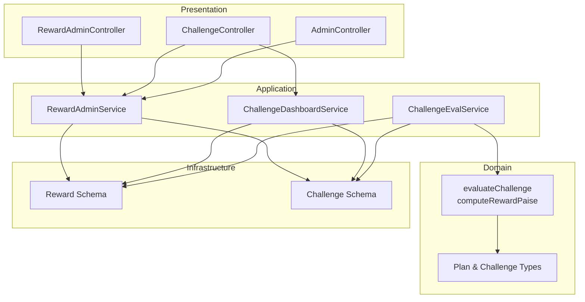
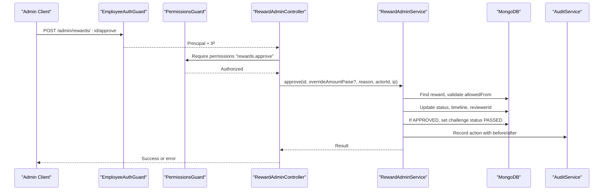
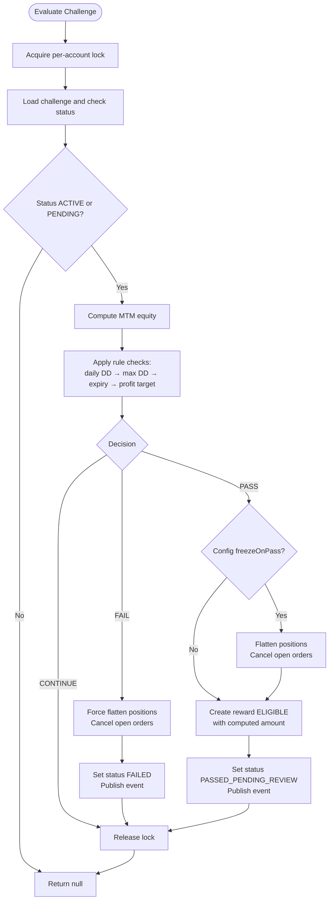
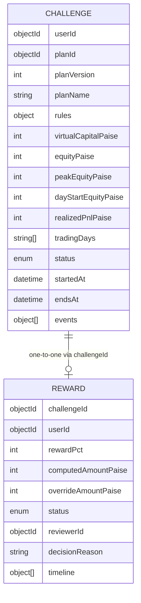
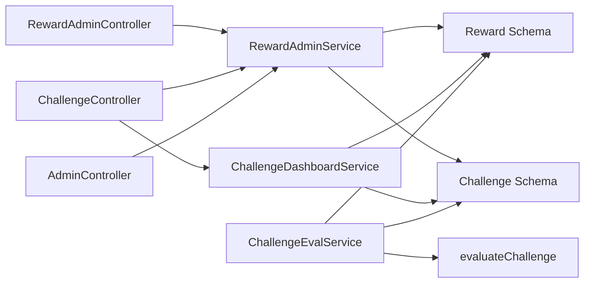

# Challenge Admin APIs

<cite>
**Referenced Files in This Document**
- [reward-admin.controller.ts](file://backend/apps/api/src/modules/challenge/presentation/reward-admin.controller.ts)
- [challenge.controller.ts](file://backend/apps/api/src/modules/challenge/presentation/challenge.controller.ts)
- [reward-admin.service.ts](file://backend/apps/api/src/modules/challenge/application/reward-admin.service.ts)
- [challenge-dashboard.service.ts](file://backend/apps/api/src/modules/challenge/application/challenge-dashboard.service.ts)
- [challenge-eval.service.ts](file://backend/apps/api/src/modules/challenge/application/challenge-eval.service.ts)
- [challenge-rules-eval.ts](file://backend/apps/api/src/modules/challenge/domain/challenge-rules-eval.ts)
- [reward.schema.ts](file://backend/apps/api/src/modules/challenge/infrastructure/schemas/reward.schema.ts)
- [challenge.schema.ts](file://backend/apps/api/src/modules/plans/infrastructure/schemas/challenge.schema.ts)
- [plan.types.ts](file://backend/apps/api/src/modules/plans/domain/plan.types.ts)
- [permissions.guard.ts](file://backend/apps/api/src/modules/admin/presentation/permissions.guard.ts)
- [admin.controller.ts](file://backend/apps/api/src/modules/admin/presentation/admin.controller.ts)
- [auth.types.ts](file://backend/apps/api/src/modules/auth/domain/auth.types.ts)
</cite>

## Table of Contents
1. Introduction
2. Project Structure
3. Core Components
4. Architecture Overview
5. Detailed Component Analysis
6. Dependency Analysis
7. Performance Considerations
8. Troubleshooting Guide
9. Conclusion

## Introduction
This document provides comprehensive API documentation for administrative challenge and reward management endpoints. It covers:
- Managing challenge configurations via plan administration
- Evaluating participant performance through the challenge engine
- Distributing rewards with admin review and audit logging
- Monitoring challenge outcomes and dashboards

It includes schemas for rule definitions, evaluation criteria, reward distribution logic, achievement tracking, and examples for creating challenges, modifying rules, manually processing rewards, and generating performance reports. All admin-only endpoints are guarded by employee authentication and role-based permissions with audit logging.

## Project Structure
The challenge and reward functionality spans presentation (controllers), application services, domain logic, and infrastructure schemas across modules:
- Presentation layer exposes REST endpoints under /challenge and /admin/rewards
- Application layer orchestrates business operations and persistence
- Domain layer defines pure evaluation rules and types
- Infrastructure layer stores challenges and rewards with timestamps and indexes

**Diagram sources**
- [reward-admin.controller.ts:23-56](file://backend/apps/api/src/modules/challenge/presentation/reward-admin.controller.ts#L23-L56)
- [challenge.controller.ts:8-34](file://backend/apps/api/src/modules/challenge/presentation/challenge.controller.ts#L8-L34)
- [admin.controller.ts:30-169](file://backend/apps/api/src/modules/admin/presentation/admin.controller.ts#L30-L169)
- [reward-admin.service.ts:10-92](file://backend/apps/api/src/modules/challenge/application/reward-admin.service.ts#L10-L92)
- [challenge-dashboard.service.ts:14-104](file://backend/apps/api/src/modules/challenge/application/challenge-dashboard.service.ts#L14-L104)
- [challenge-eval.service.ts:24-131](file://backend/apps/api/src/modules/challenge/application/challenge-eval.service.ts#L24-L131)
- [challenge-rules-eval.ts:15-66](file://backend/apps/api/src/modules/challenge/domain/challenge-rules-eval.ts#L15-L66)
- [reward.schema.ts:20-54](file://backend/apps/api/src/modules/challenge/infrastructure/schemas/reward.schema.ts#L20-L54)
- [challenge.schema.ts:23-75](file://backend/apps/api/src/modules/plans/infrastructure/schemas/challenge.schema.ts#L23-L75)

**Section sources**
- [reward-admin.controller.ts:23-56](file://backend/apps/api/src/modules/challenge/presentation/reward-admin.controller.ts#L23-L56)
- [challenge.controller.ts:8-34](file://backend/apps/api/src/modules/challenge/presentation/challenge.controller.ts#L8-L34)
- [admin.controller.ts:30-169](file://backend/apps/api/src/modules/admin/presentation/admin.controller.ts#L30-L169)
- [reward-admin.service.ts:10-92](file://backend/apps/api/src/modules/challenge/application/reward-admin.service.ts#L10-L92)
- [challenge-dashboard.service.ts:14-104](file://backend/apps/api/src/modules/challenge/application/challenge-dashboard.service.ts#L14-L104)
- [challenge-eval.service.ts:24-131](file://backend/apps/api/src/modules/challenge/application/challenge-eval.service.ts#L24-L131)
- [challenge-rules-eval.ts:15-66](file://backend/apps/api/src/modules/challenge/domain/challenge-rules-eval.ts#L15-L66)
- [reward.schema.ts:20-54](file://backend/apps/api/src/modules/challenge/infrastructure/schemas/reward.schema.ts#L20-L54)
- [challenge.schema.ts:23-75](file://backend/apps/api/src/modules/plans/infrastructure/schemas/challenge.schema.ts#L23-L75)

## Core Components
- RewardAdminService: Manages reward lifecycle (queue, detail, approve, reject, mark paid), enforces state transitions, updates challenge status on approval, and records audit events.
- ChallengeDashboardService: Provides trader-facing dashboard data including MTM equity, drawdown usage, profit progress, trading days, and reward status.
- ChallengeEvalService: Real-time evaluator that computes MTM equity, applies rule checks, transitions challenge states, flattens positions on pass/fail, creates ELIGIBLE rewards, and publishes events.
- PermissionsGuard and AdminController: Enforce employee authentication and fine-grained permissions for admin actions; expose configuration and audit endpoints.

Key responsibilities:
- Rule evaluation is pure and deterministic, ensuring consistent PASS/FAIL decisions.
- Rewards are created automatically upon passing and require admin review before payout.
- Audit logs capture actor, IP, before/after state, and reasons for all admin actions.

**Section sources**
- [reward-admin.service.ts:17-92](file://backend/apps/api/src/modules/challenge/application/reward-admin.service.ts#L17-L92)
- [challenge-dashboard.service.ts:23-104](file://backend/apps/api/src/modules/challenge/application/challenge-dashboard.service.ts#L23-L104)
- [challenge-eval.service.ts:43-131](file://backend/apps/api/src/modules/challenge/application/challenge-eval.service.ts#L43-L131)
- [permissions.guard.ts:18-40](file://backend/apps/api/src/modules/admin/presentation/permissions.guard.ts#L18-L40)
- [admin.controller.ts:30-169](file://backend/apps/api/src/modules/admin/presentation/admin.controller.ts#L30-L169)

## Architecture Overview
The system separates concerns into controllers, services, domain logic, and persistence. Admins interact via protected endpoints to manage rewards and plans. The engine evaluates challenges in real time and triggers side effects like position flattening and reward creation.

**Diagram sources**
- [reward-admin.controller.ts:40-44](file://backend/apps/api/src/modules/challenge/presentation/reward-admin.controller.ts#L40-L44)
- [reward-admin.service.ts:37-86](file://backend/apps/api/src/modules/challenge/application/reward-admin.service.ts#L37-L86)
- [permissions.guard.ts:26-39](file://backend/apps/api/src/modules/admin/presentation/permissions.guard.ts#L26-L39)
- [admin.controller.ts:30-31](file://backend/apps/api/src/modules/admin/presentation/admin.controller.ts#L30-L31)

## Detailed Component Analysis

### Admin Reward Endpoints
- GET /admin/rewards/queue?status=&page=&pageSize=
  - Purpose: Paginated list of rewards filtered by optional status. Defaults to ELIGIBLE if no status provided.
  - Authorization: EmployeeAuthGuard + PermissionsGuard with "rewards.review".
  - Response: items array enriched with challenge details, total count, page, pageSize.
  - Example query: GET /admin/rewards/queue?status=ELIGIBLE&page=1&pageSize=20

- GET /admin/rewards/:id
  - Purpose: Detail view of a specific reward including associated challenge snapshot.
  - Authorization: EmployeeAuthGuard + PermissionsGuard with "rewards.review".
  - Response: Reward object merged with challenge fields.

- POST /admin/rewards/:id/approve
  - Purpose: Approve reward eligibility; optionally override computed amount.
  - Authorization: EmployeeAuthGuard + PermissionsGuard with "rewards.approve".
  - Request body: overrideAmountPaise (optional), reason (optional).
  - Side effects: Sets reward status to APPROVED, sets challenge status to PASSED, records audit event.

- POST /admin/rewards/:id/reject
  - Purpose: Reject reward; can be applied from ELIGIBLE or APPROVED states.
  - Authorization: EmployeeAuthGuard + PermissionsGuard with "rewards.approve".
  - Request body: reason (required).
  - Side effects: Sets reward status to REJECTED, records audit event.

- POST /admin/rewards/:id/mark-paid
  - Purpose: Mark reward as paid (off-platform payout confirmation).
  - Authorization: EmployeeAuthGuard + PermissionsGuard with "rewards.approve".
  - Request body: reason (optional).
  - Side effects: Sets reward status to PAID, records audit event.

Authorization and guards:
- All endpoints require authenticated employee context and explicit permission decorators.
- Insufficient permissions result in a forbidden response.

Error handling:
- NOT_FOUND returns 404 when reward not found.
- Invalid transition returns 409 conflict.
- Other validation errors return 422 unprocessable entity.

**Section sources**
- [reward-admin.controller.ts:23-56](file://backend/apps/api/src/modules/challenge/presentation/reward-admin.controller.ts#L23-L56)
- [reward-admin.service.ts:17-86](file://backend/apps/api/src/modules/challenge/application/reward-admin.service.ts#L17-L86)
- [permissions.guard.ts:26-39](file://backend/apps/api/src/modules/admin/presentation/permissions.guard.ts#L26-L39)

### Challenge Dashboard Endpoints
- GET /challenge/current
  - Purpose: Returns current active challenge for the authenticated user with progress metrics.
  - Authorization: UserAuthGuard.
  - Response includes: planName, status, rules, capital, equity, MTM equity, unrealized PnL, realized PnL, profit target and progress, max drawdown floor and usage, daily drawdown floor and usage, trading days completed vs required, start/end dates, days remaining, and reward info if applicable.

- GET /challenge/history
  - Purpose: Lists past and current challenges for the authenticated user with key fields.

- GET /challenge/:challengeId
  - Purpose: Retrieves detailed progress for a specific challenge owned by the user.

- GET /challenge/:challengeId/reward
  - Purpose: Fetches the reward record for a specific challenge owned by the user.

Performance considerations:
- MTM equity calculation uses cached quotes from Redis to minimize latency.
- Aggregates open positions and computes unrealized PnL per instrument.

**Section sources**
- [challenge.controller.ts:8-34](file://backend/apps/api/src/modules/challenge/presentation/challenge.controller.ts#L8-L34)
- [challenge-dashboard.service.ts:23-104](file://backend/apps/api/src/modules/challenge/application/challenge-dashboard.service.ts#L23-L104)

### Challenge Evaluation Engine
- Triggered by trading events and periodic sweeps.
- Computes MTM equity using realized equity plus unrealized PnL from open positions.
- Applies rule checks in order: daily drawdown, max drawdown, expiry, profit target with minimum trading days.
- On FAIL: forces flattening of positions, cancels open orders, sets challenge status to FAILED, publishes event.
- On PASS: optionally freezes positions based on config, sets challenge status to PASSED_PENDING_REVIEW, creates reward in ELIGIBLE state with computed amount, publishes event.

**Diagram sources**
- [challenge-eval.service.ts:57-131](file://backend/apps/api/src/modules/challenge/application/challenge-eval.service.ts#L57-L131)
- [challenge-rules-eval.ts:35-66](file://backend/apps/api/src/modules/challenge/domain/challenge-rules-eval.ts#L35-L66)

**Section sources**
- [challenge-eval.service.ts:43-131](file://backend/apps/api/src/modules/challenge/application/challenge-eval.service.ts#L43-L131)
- [challenge-rules-eval.ts:15-66](file://backend/apps/api/src/modules/challenge/domain/challenge-rules-eval.ts#L15-L66)

### Plan Administration (Challenge Configuration)
- GET /admin/plans
  - Purpose: List all plans for admin review.
  - Authorization: EmployeeAuthGuard + PermissionsGuard with "plans.manage".

- POST /admin/plans
  - Purpose: Create a new plan with rule definitions.
  - Authorization: EmployeeAuthGuard + PermissionsGuard with "plans.manage".
  - Request body: plan definition including rule parameters.

- PATCH /admin/plans/:id
  - Purpose: Update an existing plan’s configuration.
  - Authorization: EmployeeAuthGuard + PermissionsGuard with "plans.manage".

- PUT /admin/plans/:id/status
  - Purpose: Toggle plan status between ACTIVE and ARCHIVED.
  - Authorization: EmployeeAuthGuard + PermissionsGuard with "plans.manage".

Rule definitions:
- profitTargetPct: percentage above virtual capital required to pass.
- maxDrawdownPct: overall drawdown threshold that fails the challenge.
- dailyDrawdownPct: per-day drawdown threshold that fails the challenge.
- drawdownAnchor: anchor base for daily drawdown calculations.
- minTradingDays: minimum distinct trading days required to pass.
- expiryDays: number of days after activation until auto-expiry.
- rewardPct: reward percentage used to compute payout on pass.
- segments: allowed instrument segments for trading.

Challenge status transitions:
- PENDING → ACTIVE (on first evaluation)
- ACTIVE → PASSED_PENDING_REVIEW (when profit target met and min days reached)
- PASSED_PENDING_REVIEW → PASSED (after admin approves reward)
- ACTIVE → FAILED (drawdown breach or expiry)
- Any → EXPIRED (if time-bound conditions apply)

**Section sources**
- [plan-admin.controller.ts:25-64](file://backend/apps/api/src/modules/plans/presentation/plan-admin.controller.ts#L25-L64)
- [plan.types.ts:11-48](file://backend/apps/api/src/modules/plans/domain/plan.types.ts#L11-L48)
- [challenge.schema.ts:23-75](file://backend/apps/api/src/modules/plans/infrastructure/schemas/challenge.schema.ts#L23-L75)

### Data Models and Schemas
- Challenge schema captures plan snapshot, live tracking fields, status, and events.
- Reward schema tracks eligibility, computed and overridden amounts, status, reviewer, decision reason, and timeline.

**Diagram sources**
- [challenge.schema.ts:23-75](file://backend/apps/api/src/modules/plans/infrastructure/schemas/challenge.schema.ts#L23-L75)
- [reward.schema.ts:20-54](file://backend/apps/api/src/modules/challenge/infrastructure/schemas/reward.schema.ts#L20-L54)

**Section sources**
- [challenge.schema.ts:23-75](file://backend/apps/api/src/modules/plans/infrastructure/schemas/challenge.schema.ts#L23-L75)
- [reward.schema.ts:20-54](file://backend/apps/api/src/modules/challenge/infrastructure/schemas/reward.schema.ts#L20-L54)

### Authorization and Audit Logging
- EmployeeAuthGuard ensures requests come from authenticated employees.
- PermissionsGuard enforces fine-grained permissions via decorators.
- Admin endpoints log actions with actor type, ID, entity, IDs, before/after state, and IP.

Permission keys used:
- rewards.review, rewards.approve
- plans.manage
- users.view, users.approve, users.suspend
- config.manage
- audit.view

**Section sources**
- [permissions.guard.ts:18-40](file://backend/apps/api/src/modules/admin/presentation/permissions.guard.ts#L18-L40)
- [admin.controller.ts:30-169](file://backend/apps/api/src/modules/admin/presentation/admin.controller.ts#L30-L169)
- [auth.types.ts:26-44](file://backend/apps/api/src/modules/auth/domain/auth.types.ts#L26-L44)

## Dependency Analysis
Controllers depend on services which depend on domain logic and infrastructure models. Guards enforce security at the controller level. Services coordinate persistence and side effects.

**Diagram sources**
- [reward-admin.controller.ts:23-56](file://backend/apps/api/src/modules/challenge/presentation/reward-admin.controller.ts#L23-L56)
- [challenge.controller.ts:8-34](file://backend/apps/api/src/modules/challenge/presentation/challenge.controller.ts#L8-L34)
- [admin.controller.ts:30-169](file://backend/apps/api/src/modules/admin/presentation/admin.controller.ts#L30-L169)
- [reward-admin.service.ts:10-92](file://backend/apps/api/src/modules/challenge/application/reward-admin.service.ts#L10-L92)
- [challenge-dashboard.service.ts:14-104](file://backend/apps/api/src/modules/challenge/application/challenge-dashboard.service.ts#L14-L104)
- [challenge-eval.service.ts:24-131](file://backend/apps/api/src/modules/challenge/application/challenge-eval.service.ts#L24-L131)
- [challenge-rules-eval.ts:15-66](file://backend/apps/api/src/modules/challenge/domain/challenge-rules-eval.ts#L15-L66)

**Section sources**
- [reward-admin.controller.ts:23-56](file://backend/apps/api/src/modules/challenge/presentation/reward-admin.controller.ts#L23-L56)
- [challenge.controller.ts:8-34](file://backend/apps/api/src/modules/challenge/presentation/challenge.controller.ts#L8-L34)
- [admin.controller.ts:30-169](file://backend/apps/api/src/modules/admin/presentation/admin.controller.ts#L30-L169)
- [reward-admin.service.ts:10-92](file://backend/apps/api/src/modules/challenge/application/reward-admin.service.ts#L10-L92)
- [challenge-dashboard.service.ts:14-104](file://backend/apps/api/src/modules/challenge/application/challenge-dashboard.service.ts#L14-L104)
- [challenge-eval.service.ts:24-131](file://backend/apps/api/src/modules/challenge/application/challenge-eval.service.ts#L24-L131)
- [challenge-rules-eval.ts:15-66](file://backend/apps/api/src/modules/challenge/domain/challenge-rules-eval.ts#L15-L66)

## Performance Considerations
- Quote caching: MTM equity computations use Redis-cached last traded prices to reduce database and external feed calls.
- Per-account locking: Ensures atomic evaluation and prevents interleaving of fills and rule checks.
- Pagination: Reward queue supports pagination to handle large datasets efficiently.
- Lean queries: Services use lean reads where possible to reduce overhead.

[No sources needed since this section provides general guidance]

## Troubleshooting Guide
Common issues and resolutions:
- Reward not found: Ensure the reward ID exists; returns 404.
- Invalid transition: Attempting to move a reward to an incompatible next state returns 409; verify current status and allowed transitions.
- Unauthorized or insufficient permissions: Confirm employee account is active and has required permissions; returns 401 or 403.
- Challenge not evaluated: Ensure the challenge is in PENDING or ACTIVE; evaluation only proceeds for these statuses.

Operational tips:
- Use /admin/rewards/queue to filter by status and paginate results.
- Review audit logs via /admin/audit-logs to trace actor actions and changes.
- Check challenge history and current dashboard endpoints for progress and reward status.

**Section sources**
- [reward-admin.controller.ts:12-21](file://backend/apps/api/src/modules/challenge/presentation/reward-admin.controller.ts#L12-L21)
- [reward-admin.service.ts:30-86](file://backend/apps/api/src/modules/challenge/application/reward-admin.service.ts#L30-L86)
- [challenge-eval.service.ts:57-89](file://backend/apps/api/src/modules/challenge/application/challenge-eval.service.ts#L57-L89)
- [admin.controller.ts:163-169](file://backend/apps/api/src/modules/admin/presentation/admin.controller.ts#L163-L169)

## Conclusion
The Challenge Admin APIs provide robust mechanisms for managing challenge configurations, evaluating participant performance, distributing rewards with admin oversight, and monitoring outcomes. Security is enforced via employee authentication and granular permissions, while audit logging ensures accountability. The separation of pure domain rules from side-effecting services enables reliable and maintainable behavior across the platform.

[No sources needed since this section summarizes without analyzing specific files]