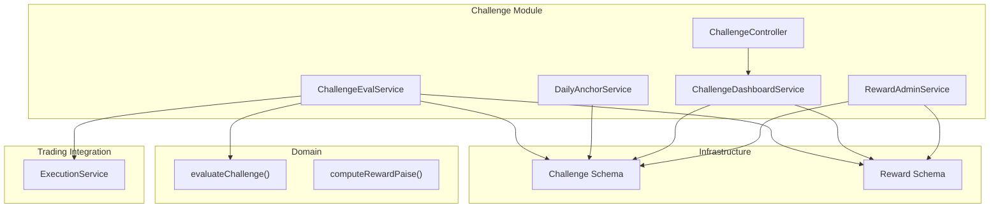
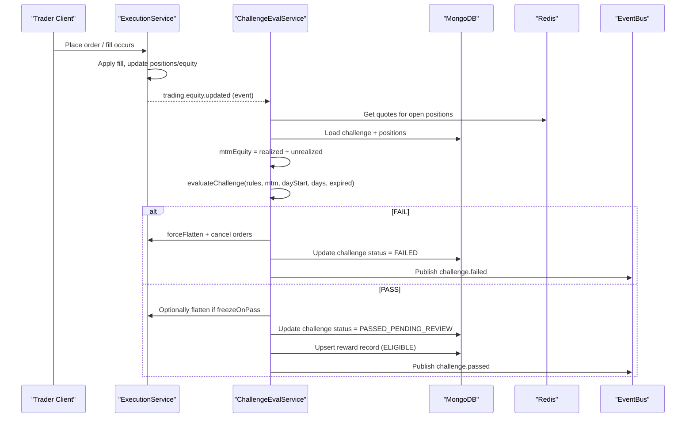
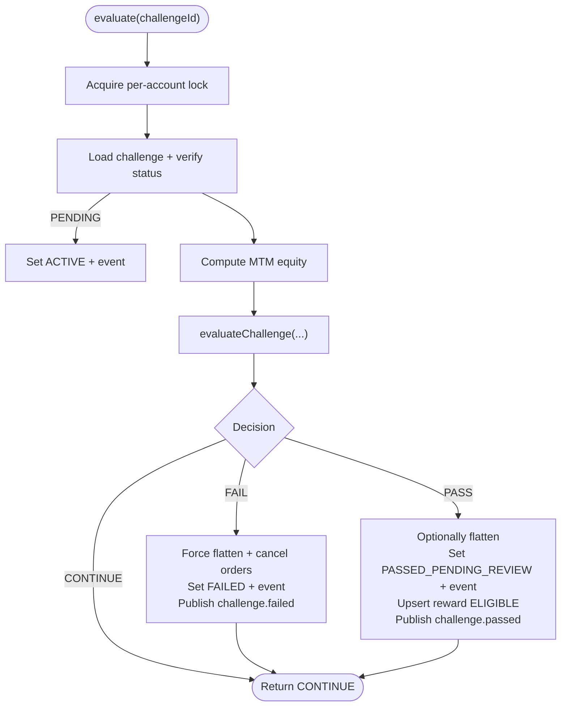
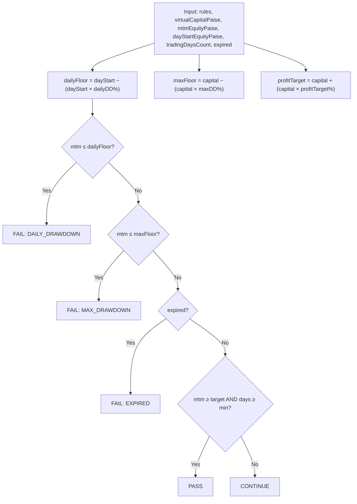
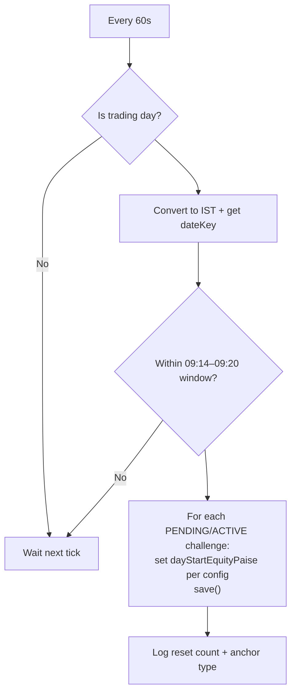
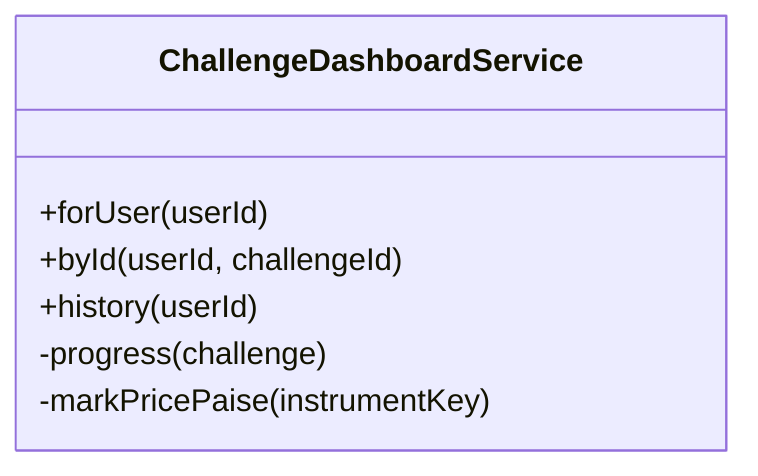
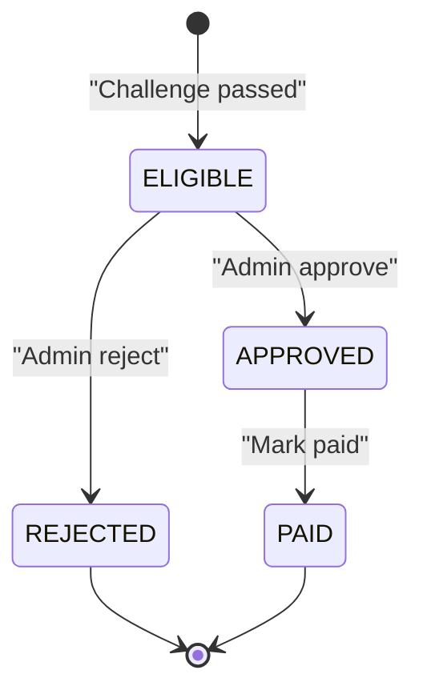
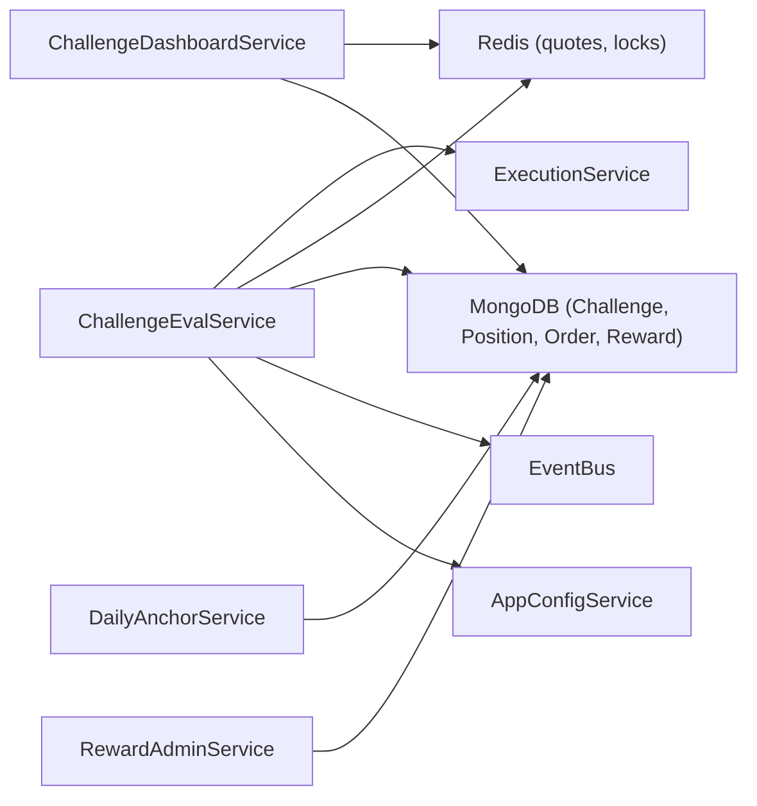
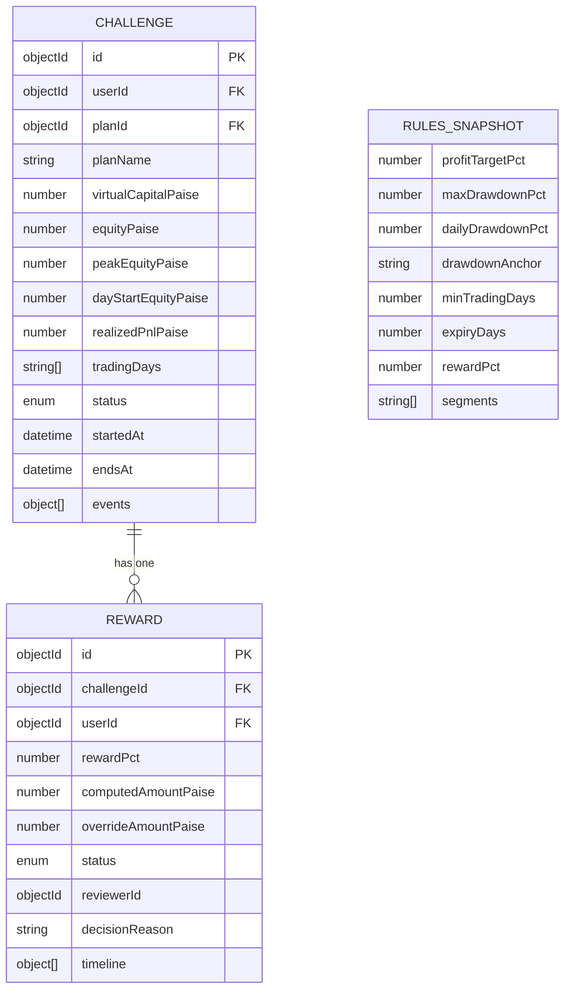

# Challenge Evaluation Engine

<cite>
**Referenced Files in This Document**
- [challenge-eval.service.ts](file://backend/apps/api/src/modules/challenge/application/challenge-eval.service.ts)
- [challenge-rules-eval.ts](file://backend/apps/api/src/modules/challenge/domain/challenge-rules-eval.ts)
- [daily-anchor.service.ts](file://backend/apps/api/src/modules/challenge/application/daily-anchor.service.ts)
- [challenge-dashboard.service.ts](file://backend/apps/api/src/modules/challenge/application/challenge-dashboard.service.ts)
- [challenge.controller.ts](file://backend/apps/api/src/modules/challenge/presentation/challenge.controller.ts)
- [reward-admin.service.ts](file://backend/apps/api/src/modules/challenge/application/reward-admin.service.ts)
- [reward.schema.ts](file://backend/apps/api/src/modules/challenge/infrastructure/schemas/reward.schema.ts)
- [challenge.schema.ts](file://backend/apps/api/src/modules/plans/infrastructure/schemas/challenge.schema.ts)
- [execution.service.ts](file://backend/apps/api/src/modules/trading/application/execution.service.ts)
- [challenge-rules-eval.spec.ts](file://backend/apps/api/src/modules/challenge/__tests__/challenge-rules-eval.spec.ts)
</cite>

## Table of Contents
1. [Introduction](#introduction)
2. [Project Structure](#project-structure)
3. [Core Components](#core-components)
4. [Architecture Overview](#architecture-overview)
5. [Detailed Component Analysis](#detailed-component-analysis)
6. [Dependency Analysis](#dependency-analysis)
7. [Performance Considerations](#performance-considerations)
8. [Troubleshooting Guide](#troubleshooting-guide)
9. [Conclusion](#conclusion)
10. [Appendices](#appendices)

## Introduction
This document explains the challenge evaluation engine that processes trading performance against challenge rules. It covers:
- Rule evaluation system with daily anchor calculations, performance metrics computation, risk assessment algorithms, and scoring mechanisms
- How trading events are captured, processed, and evaluated against predefined challenge criteria
- Examples of custom rule creation, performance calculation formulas, and real-time evaluation updates
- The daily anchor service that manages time-based challenge periods and milestone tracking

The engine ensures race-free evaluation by using per-account locks, marks positions to market for accurate equity, and enforces a strict order of checks (daily drawdown → max drawdown → expiry → profit target).

## Project Structure
The challenge evaluation engine is implemented as a NestJS module with clear separation between domain logic, application services, presentation controllers, and infrastructure schemas.

**Diagram sources**
- [challenge-eval.service.ts:1-133](file://backend/apps/api/src/modules/challenge/application/challenge-eval.service.ts#L1-L133)
- [daily-anchor.service.ts:1-46](file://backend/apps/api/src/modules/challenge/application/daily-anchor.service.ts#L1-L46)
- [challenge-dashboard.service.ts:1-106](file://backend/apps/api/src/modules/challenge/application/challenge-dashboard.service.ts#L1-L106)
- [reward-admin.service.ts:1-94](file://backend/apps/api/src/modules/challenge/application/reward-admin.service.ts#L1-L94)
- [challenge.controller.ts:1-36](file://backend/apps/api/src/modules/challenge/presentation/challenge.controller.ts#L1-L36)
- [challenge-rules-eval.ts:1-67](file://backend/apps/api/src/modules/challenge/domain/challenge-rules-eval.ts#L1-L67)
- [challenge.schema.ts:1-76](file://backend/apps/api/src/modules/plans/infrastructure/schemas/challenge.schema.ts#L1-L76)
- [reward.schema.ts:1-55](file://backend/apps/api/src/modules/challenge/infrastructure/schemas/reward.schema.ts#L1-L55)
- [execution.service.ts:1-200](file://backend/apps/api/src/modules/trading/application/execution.service.ts#L1-L200)

**Section sources**
- [challenge-eval.service.ts:1-133](file://backend/apps/api/src/modules/challenge/application/challenge-eval.service.ts#L1-L133)
- [challenge-rules-eval.ts:1-67](file://backend/apps/api/src/modules/challenge/domain/challenge-rules-eval.ts#L1-L67)
- [daily-anchor.service.ts:1-46](file://backend/apps/api/src/modules/challenge/application/daily-anchor.service.ts#L1-L46)
- [challenge-dashboard.service.ts:1-106](file://backend/apps/api/src/modules/challenge/application/challenge-dashboard.service.ts#L1-L106)
- [challenge.controller.ts:1-36](file://backend/apps/api/src/modules/challenge/presentation/challenge.controller.ts#L1-L36)
- [reward-admin.service.ts:1-94](file://backend/apps/api/src/modules/challenge/application/reward-admin.service.ts#L1-L94)
- [challenge.schema.ts:1-76](file://backend/apps/api/src/modules/plans/infrastructure/schemas/challenge.schema.ts#L1-L76)
- [reward.schema.ts:1-55](file://backend/apps/api/src/modules/challenge/infrastructure/schemas/reward.schema.ts#L1-L55)
- [execution.service.ts:1-200](file://backend/apps/api/src/modules/trading/application/execution.service.ts#L1-L200)

## Core Components
- ChallengeEvalService: Real-time evaluator that computes MTM equity, runs rule checks under a per-account lock, and applies terminal side effects (fail/pass), publishing events and creating reward records on pass.
- DailyAnchorService: Resets each active challenge’s dayStartEquityPaise at the start of each trading day based on configuration (previous close or initial capital).
- ChallengeDashboardService: Read model that computes progress, drawdown usage, profit target progress, and reward status for UI consumption.
- RewardAdminService: Admin workflow to approve/reject/make-paid rewards and finalize challenge status transitions.
- Domain Rules: Pure functions evaluateChallenge and computeRewardPaise implement the SRS-defined check order and reward formula.

Key responsibilities:
- Capture trading events via ExecutionService fills and periodic MTM sweeps
- Compute MTM equity from realized equity plus unrealized P&L across open positions
- Enforce daily drawdown, max drawdown, expiry, and profit target rules in strict order
- Manage daily anchors and milestone tracking (trading days count)
- Create and manage reward lifecycle states

**Section sources**
- [challenge-eval.service.ts:17-133](file://backend/apps/api/src/modules/challenge/application/challenge-eval.service.ts#L17-L133)
- [daily-anchor.service.ts:7-46](file://backend/apps/api/src/modules/challenge/application/daily-anchor.service.ts#L7-L46)
- [challenge-dashboard.service.ts:12-106](file://backend/apps/api/src/modules/challenge/application/challenge-dashboard.service.ts#L12-L106)
- [reward-admin.service.ts:9-94](file://backend/apps/api/src/modules/challenge/application/reward-admin.service.ts#L9-L94)
- [challenge-rules-eval.ts:1-67](file://backend/apps/api/src/modules/challenge/domain/challenge-rules-eval.ts#L1-L67)

## Architecture Overview
The evaluation pipeline integrates trading execution, market data, persistence, and eventing.

**Diagram sources**
- [challenge-eval.service.ts:43-131](file://backend/apps/api/src/modules/challenge/application/challenge-eval.service.ts#L43-L131)
- [execution.service.ts:68-177](file://backend/apps/api/src/modules/trading/application/execution.service.ts#L68-L177)
- [challenge-rules-eval.ts:35-66](file://backend/apps/api/src/modules/challenge/domain/challenge-rules-eval.ts#L35-L66)

## Detailed Component Analysis

### ChallengeEvalService
Responsibilities:
- Acquire per-account lock to prevent interleaving of fills and evaluations
- Compute MTM equity by summing realized equity and unrealized P&L from open positions using cached quotes
- Promote PENDING challenges to ACTIVE on first evaluation
- Evaluate rules in strict order and apply side effects:
  - Fail: flatten positions, cancel resting orders, set status FAILED, publish event
  - Pass: optionally flatten, set status PASSED_PENDING_REVIEW, create reward ELIGIBLE, publish event

**Diagram sources**
- [challenge-eval.service.ts:39-131](file://backend/apps/api/src/modules/challenge/application/challenge-eval.service.ts#L39-L131)

**Section sources**
- [challenge-eval.service.ts:17-133](file://backend/apps/api/src/modules/challenge/application/challenge-eval.service.ts#L17-L133)

### Rule Evaluation Engine (Pure Domain)
Implements the SRS-defined evaluation order:
1. Daily drawdown breach (against dayStartEquityPaise)
2. Max drawdown breach (against virtualCapitalPaise)
3. Expiry (if endsAt passed)
4. Profit target reached AND minimum trading days met

Formulas:
- Daily floor = dayStartEquityPaise − round(dayStartEquityPaise × dailyDrawdownPct / 100)
- Max floor = virtualCapitalPaise − round(virtualCapitalPaise × maxDrawdownPct / 100)
- Profit target = virtualCapitalPaise + round(virtualCapitalPaise × profitTargetPct / 100)
- Reward = round(max(0, finalEquityPaise − virtualCapitalPaise) × rewardPct / 100)

**Diagram sources**
- [challenge-rules-eval.ts:35-66](file://backend/apps/api/src/modules/challenge/domain/challenge-rules-eval.ts#L35-L66)

**Section sources**
- [challenge-rules-eval.ts:1-67](file://backend/apps/api/src/modules/challenge/domain/challenge-rules-eval.ts#L1-L67)
- [challenge-rules-eval.spec.ts:1-77](file://backend/apps/api/src/modules/challenge/__tests__/challenge-rules-eval.spec.ts#L1-L77)

### Daily Anchor Service
Resets dayStartEquityPaise for all active challenges once per trading day shortly before market open. Anchor source is configurable:
- PREV_DAY_CLOSE: uses current equity (prior day closing equity)
- INITIAL_CAPITAL: uses granted capital

**Diagram sources**
- [daily-anchor.service.ts:24-44](file://backend/apps/api/src/modules/challenge/application/daily-anchor.service.ts#L24-L44)

**Section sources**
- [daily-anchor.service.ts:1-46](file://backend/apps/api/src/modules/challenge/application/daily-anchor.service.ts#L1-L46)

### Challenge Dashboard Service
Provides read-only views for traders and admins:
- Computes MTM equity and unrealized P&L from open positions and cached quotes
- Calculates progress toward profit target and drawdown usage percentages
- Returns reward details when applicable

**Diagram sources**
- [challenge-dashboard.service.ts:12-106](file://backend/apps/api/src/modules/challenge/application/challenge-dashboard.service.ts#L12-L106)

**Section sources**
- [challenge-dashboard.service.ts:12-106](file://backend/apps/api/src/modules/challenge/application/challenge-dashboard.service.ts#L12-L106)

### Reward Administration
Manages reward lifecycle:
- Queues eligible rewards for admin review
- Approves, rejects, or marks paid with audit trail
- Finalizes challenge status to PASSED upon approval

**Diagram sources**
- [reward.schema.ts:4-9](file://backend/apps/api/src/modules/challenge/infrastructure/schemas/reward.schema.ts#L4-L9)
- [reward-admin.service.ts:37-86](file://backend/apps/api/src/modules/challenge/application/reward-admin.service.ts#L37-L86)

**Section sources**
- [reward-admin.service.ts:9-94](file://backend/apps/api/src/modules/challenge/application/reward-admin.service.ts#L9-L94)
- [reward.schema.ts:1-55](file://backend/apps/api/src/modules/challenge/infrastructure/schemas/reward.schema.ts#L1-L55)

### API Surface
Exposed endpoints for traders:
- GET /challenge/current: current challenge progress
- GET /challenge/history: historical challenges
- GET /challenge/:challengeId: detailed view
- GET /challenge/:challengeId/reward: user’s reward status

**Section sources**
- [challenge.controller.ts:8-35](file://backend/apps/api/src/modules/challenge/presentation/challenge.controller.ts#L8-L35)

## Dependency Analysis
The evaluation engine depends on:
- ExecutionService for trade settlement and flattening
- Market data via Redis quote cache and InstrumentService
- Persistence via Mongoose models for Challenge, Position, Order, Reward
- Event bus for decoupled notifications
- Configuration service for behavior toggles (e.g., freezeOnPass, dailyDD anchor)

**Diagram sources**
- [challenge-eval.service.ts:1-133](file://backend/apps/api/src/modules/challenge/application/challenge-eval.service.ts#L1-L133)
- [daily-anchor.service.ts:1-46](file://backend/apps/api/src/modules/challenge/application/daily-anchor.service.ts#L1-L46)
- [challenge-dashboard.service.ts:1-106](file://backend/apps/api/src/modules/challenge/application/challenge-dashboard.service.ts#L1-L106)
- [reward-admin.service.ts:1-94](file://backend/apps/api/src/modules/challenge/application/reward-admin.service.ts#L1-L94)
- [execution.service.ts:1-200](file://backend/apps/api/src/modules/trading/application/execution.service.ts#L1-L200)

**Section sources**
- [challenge-eval.service.ts:1-133](file://backend/apps/api/src/modules/challenge/application/challenge-eval.service.ts#L1-L133)
- [execution.service.ts:1-200](file://backend/apps/api/src/modules/trading/application/execution.service.ts#L1-L200)

## Performance Considerations
- Per-account locking prevents race conditions during high-frequency fills; ensure lock timeouts accommodate worst-case settlement paths.
- Quote caching reduces database load; missing quotes gracefully skip unrealized P&L contributions.
- Batch operations (e.g., updating multiple orders) minimize write amplification on fail/pass.
- Daily anchor runs once per trading day within a narrow window to avoid contention.
- Use lean queries and selective projections in dashboard reads to reduce payload size.

[No sources needed since this section provides general guidance]

## Troubleshooting Guide
Common issues and diagnostics:
- Challenge not evaluating:
  - Verify challenge status is PENDING or ACTIVE; evaluation skips otherwise.
  - Ensure Redis quotes exist for instruments; missing quotes result in zero unrealized P&L contribution.
- Unexpected failure:
  - Check daily floor vs. MTM equity; daily drawdown takes precedence over max drawdown.
  - Confirm dayStartEquityPaise was reset correctly by DailyAnchorService around market open.
- Pass but no reward:
  - Confirm reward upsert occurred and status is ELIGIBLE; review admin queue and timeline.
- Flattening not applied:
  - On pass, flattening only occurs if freezeOnPass is enabled; otherwise positions remain until manual action.

Operational tips:
- Monitor logs for “FAILED” and “PASSED” messages with reasons.
- Inspect challenge events array for activation, pass/fail timestamps and notes.
- Validate reward timeline entries for approvals/rejections and overrides.

**Section sources**
- [challenge-eval.service.ts:57-131](file://backend/apps/api/src/modules/challenge/application/challenge-eval.service.ts#L57-L131)
- [daily-anchor.service.ts:29-44](file://backend/apps/api/src/modules/challenge/application/daily-anchor.service.ts#L29-L44)
- [reward-admin.service.ts:37-86](file://backend/apps/api/src/modules/challenge/application/reward-admin.service.ts#L37-L86)

## Conclusion
The challenge evaluation engine provides robust, race-free evaluation of trading performance against configurable rules. It combines real-time MTM equity computation, strict rule enforcement, daily anchor management, and a complete reward lifecycle. The modular design separates pure domain logic from application orchestration, enabling maintainability and testability while supporting real-time updates and admin oversight.

[No sources needed since this section summarizes without analyzing specific files]

## Appendices

### Data Models

**Diagram sources**
- [challenge.schema.ts:5-76](file://backend/apps/api/src/modules/plans/infrastructure/schemas/challenge.schema.ts#L5-L76)
- [reward.schema.ts:11-55](file://backend/apps/api/src/modules/challenge/infrastructure/schemas/reward.schema.ts#L11-L55)

### Example Scenarios
- Custom rule creation:
  - Define new thresholds in plan rules snapshot (profit target %, max DD %, daily DD %, min trading days, expiry days, reward %).
  - Persist snapshot with challenge instance; evaluation uses these values exclusively.
- Performance calculation formulas:
  - Daily floor, max floor, profit target, and reward computed as described in the domain rules.
- Real-time evaluation updates:
  - Triggered by trading.equity.updated events; evaluation runs under per-account lock and publishes outcomes.

**Section sources**
- [challenge.schema.ts:5-76](file://backend/apps/api/src/modules/plans/infrastructure/schemas/challenge.schema.ts#L5-L76)
- [challenge-rules-eval.ts:15-66](file://backend/apps/api/src/modules/challenge/domain/challenge-rules-eval.ts#L15-L66)
- [challenge-eval.service.ts:17-133](file://backend/apps/api/src/modules/challenge/application/challenge-eval.service.ts#L17-L133)