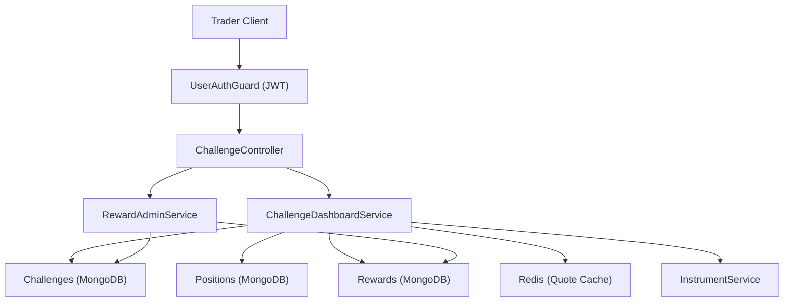
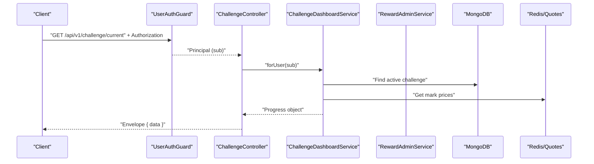
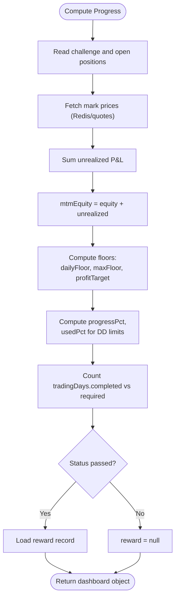
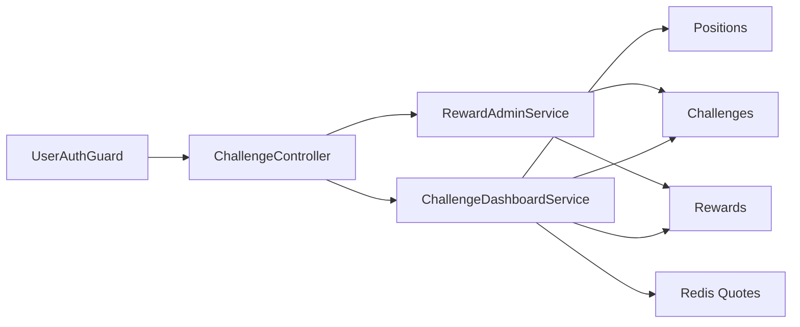

# Challenge Trader APIs

<cite>
**Referenced Files in This Document**
- [challenge.controller.ts](file://backend/apps/api/src/modules/challenge/presentation/challenge.controller.ts)
- [challenge-dashboard.service.ts](file://backend/apps/api/src/modules/challenge/application/challenge-dashboard.service.ts)
- [reward-admin.service.ts](file://backend/apps/api/src/modules/challenge/application/reward-admin.service.ts)
- [jwt-auth.guard.ts](file://backend/apps/api/src/modules/auth/presentation/jwt-auth.guard.ts)
- [auth.types.ts](file://backend/apps/api/src/modules/auth/domain/auth.types.ts)
- [challenge.schema.ts](file://backend/apps/api/src/modules/plans/infrastructure/schemas/challenge.schema.ts)
- [reward.schema.ts](file://backend/apps/api/src/modules/challenge/infrastructure/schemas/reward.schema.ts)
- [challenge-rules-eval.ts](file://backend/apps/api/src/modules/challenge/domain/challenge-rules-eval.ts)
- [api-envelope.ts](file://backend/libs/shared/src/http/api-envelope.ts)
- [global-exception.filter.ts](file://backend/libs/shared/src/http/global-exception.filter.ts)
</cite>

## Table of Contents
1. Introduction
2. Project Structure
3. Core Components
4. Architecture Overview
5. Detailed Component Analysis
6. Dependency Analysis
7. Performance Considerations
8. Troubleshooting Guide
9. Conclusion

## Introduction
This document provides trader-facing API documentation for challenge endpoints that allow traders to:
- Retrieve their active challenge and progress
- View past challenge participation history
- Get detailed information about a specific challenge
- Check reward status for a given challenge

All endpoints require authentication via JWT bearer tokens. Responses are wrapped in a standard envelope with success/failure semantics.

## Project Structure
The challenge feature is implemented as a NestJS module under the API application. The controller exposes HTTP routes, services implement business logic, and schemas define persistent models.

**Diagram sources**
- [challenge.controller.ts:8-34](file://backend/apps/api/src/modules/challenge/presentation/challenge.controller.ts#L8-L34)
- [challenge-dashboard.service.ts:14-21](file://backend/apps/api/src/modules/challenge/application/challenge-dashboard.service.ts#L14-L21)
- [reward-admin.service.ts:9-15](file://backend/apps/api/src/modules/challenge/application/reward-admin.service.ts#L9-L15)
- [jwt-auth.guard.ts:10-33](file://backend/apps/api/src/modules/auth/presentation/jwt-auth.guard.ts#L10-L33)

**Section sources**
- [challenge.controller.ts:8-34](file://backend/apps/api/src/modules/challenge/presentation/challenge.controller.ts#L8-L34)
- [challenge-dashboard.service.ts:14-21](file://backend/apps/api/src/modules/challenge/application/challenge-dashboard.service.ts#L14-L21)
- [reward-admin.service.ts:9-15](file://backend/apps/api/src/modules/challenge/application/reward-admin.service.ts#L9-L15)
- [jwt-auth.guard.ts:10-33](file://backend/apps/api/src/modules/auth/presentation/jwt-auth.guard.ts#L10-L33)

## Core Components
- ChallengeController: Exposes GET endpoints for current, history, detail, and reward status. Protected by JWT guard.
- ChallengeDashboardService: Computes MTM equity, progress metrics, drawdown usage, trading days, and reward snapshot for a challenge.
- RewardAdminService: Provides myReward for traders to check eligibility and computed amounts.
- Schemas: Challenge and Reward models define fields used by responses.
- Rules Evaluator: Defines rules and scoring logic used to determine PASS/FAIL and reward computation.

**Section sources**
- [challenge.controller.ts:8-34](file://backend/apps/api/src/modules/challenge/presentation/challenge.controller.ts#L8-L34)
- [challenge-dashboard.service.ts:23-96](file://backend/apps/api/src/modules/challenge/application/challenge-dashboard.service.ts#L23-L96)
- [reward-admin.service.ts:89-92](file://backend/apps/api/src/modules/challenge/application/reward-admin.service.ts#L89-L92)
- [challenge.schema.ts:23-70](file://backend/apps/api/src/modules/plans/infrastructure/schemas/challenge.schema.ts#L23-L70)
- [reward.schema.ts:20-50](file://backend/apps/api/src/modules/challenge/infrastructure/schemas/reward.schema.ts#L20-L50)
- [challenge-rules-eval.ts:35-66](file://backend/apps/api/src/modules/challenge/domain/challenge-rules-eval.ts#L35-L66)

## Architecture Overview
The request flow for all challenge endpoints:
1. Client sends an authenticated HTTP request with a Bearer token.
2. UserAuthGuard validates the JWT and attaches principal claims.
3. Controller delegates to service methods.
4. Services read/write MongoDB and optionally Redis for quotes.
5. Responses are returned inside a standard envelope.

**Diagram sources**
- [challenge.controller.ts:16-19](file://backend/apps/api/src/modules/challenge/presentation/challenge.controller.ts#L16-L19)
- [challenge-dashboard.service.ts:23-30](file://backend/apps/api/src/modules/challenge/application/challenge-dashboard.service.ts#L23-L30)
- [jwt-auth.guard.ts:15-27](file://backend/apps/api/src/modules/auth/presentation/jwt-auth.guard.ts#L15-L27)

## Detailed Component Analysis

### Authentication Requirements
- All challenge endpoints are protected by UserAuthGuard.
- Requests must include an Authorization header with a valid Bearer token.
- Claims include sub (user id), actor (USER), typ (access).

Error cases:
- Missing or malformed token returns UNAUTHORIZED.
- Expired token returns UNAUTHORIZED.

**Section sources**
- [challenge.controller.ts:8-9](file://backend/apps/api/src/modules/challenge/presentation/challenge.controller.ts#L8-L9)
- [jwt-auth.guard.ts:15-27](file://backend/apps/api/src/modules/auth/presentation/jwt-auth.guard.ts#L15-L27)
- [auth.types.ts:26-31](file://backend/apps/api/src/modules/auth/domain/auth.types.ts#L26-L31)

### Response Envelope
All responses follow a consistent envelope:
- Success: { success: true, data: <T> }
- Failure: { success: false, error: { code, message, details? } }

Common error codes include BAD_REQUEST, UNAUTHORIZED, FORBIDDEN, NOT_FOUND, CONFLICT, UNPROCESSABLE, RATE_LIMITED, and INTERNAL for unexpected errors.

**Section sources**
- [api-envelope.ts:1-16](file://backend/libs/shared/src/http/api-envelope.ts#L1-L16)
- [global-exception.filter.ts:22-68](file://backend/libs/shared/src/http/global-exception.filter.ts#L22-L68)

### GET /api/v1/challenge/current
Retrieves the trader’s most recent active challenge and its progress.

Authentication:
- Requires a valid JWT Bearer token.

Request:
- Method: GET
- Path: /api/v1/challenge/current
- Headers: Authorization: Bearer <token>

Response data structure:
- challenge: object or null if none found
  - id: string (challenge ObjectId)
  - planName: string
  - status: string (e.g., PENDING, ACTIVE, PASSED_PENDING_REVIEW, PASSED)
  - rules: object
    - profitTargetPct: number
    - maxDrawdownPct: number
    - dailyDrawdownPct: number
    - minTradingDays: number
  - virtualCapitalPaise: number
  - equityPaise: number
  - mtmEquityPaise: number (realized equity + unrealized P&L)
  - unrealizedPnlPaise: number
  - realizedPnlPaise: number
  - profit: object
    - targetPaise: number
    - currentPaise: number
    - progressPct: number (0–100)
  - maxDrawdown: object
    - floorPaise: number
    - usedPct: number (0–100)
  - dailyDrawdown: object
    - floorPaise: number
    - usedPct: number (0–100)
  - tradingDays: object
    - completed: number
    - required: number
  - startedAt: date
  - endsAt: date
  - daysRemaining: number
  - reward: object or null (when passed)
    - status: string (ELIGIBLE, APPROVED, REJECTED, PAID)
    - computedAmountPaise: number
    - overrideAmountPaise?: number

Notes:
- If no active challenge exists, response.data.challenge is null.

Example request:
- curl -H "Authorization: Bearer <token>" https://api.example.com/api/v1/challenge/current

Example response:
- { "success": true, "data": { "challenge": { ... } } }

**Section sources**
- [challenge.controller.ts:16-19](file://backend/apps/api/src/modules/challenge/presentation/challenge.controller.ts#L16-L19)
- [challenge-dashboard.service.ts:23-30](file://backend/apps/api/src/modules/challenge/application/challenge-dashboard.service.ts#L23-L30)
- [challenge.schema.ts:37-66](file://backend/apps/api/src/modules/plans/infrastructure/schemas/challenge.schema.ts#L37-L66)
- [reward.schema.ts:28-40](file://backend/apps/api/src/modules/challenge/infrastructure/schemas/reward.schema.ts#L28-L40)

### GET /api/v1/challenge/history
Returns a list of the trader’s challenges sorted by start time descending.

Authentication:
- Requires a valid JWT Bearer token.

Request:
- Method: GET
- Path: /api/v1/challenge/history
- Headers: Authorization: Bearer <token>

Response data structure:
- Array of objects with fields:
  - planName: string
  - status: string
  - virtualCapitalPaise: number
  - equityPaise: number
  - realizedPnlPaise: number
  - startedAt: date
  - endsAt: date

Example request:
- curl -H "Authorization: Bearer <token>" https://api.example.com/api/v1/challenge/history

Example response:
- { "success": true, "data": [ { ... }, { ... } ] }

**Section sources**
- [challenge.controller.ts:21-24](file://backend/apps/api/src/modules/challenge/presentation/challenge.controller.ts#L21-L24)
- [challenge-dashboard.service.ts:38-43](file://backend/apps/api/src/modules/challenge/application/challenge-dashboard.service.ts#L38-L43)

### GET /api/v1/challenge/:challengeId
Returns detailed information for a specific challenge owned by the authenticated user.

Authentication:
- Requires a valid JWT Bearer token.

Request:
- Method: GET
- Path: /api/v1/challenge/{challengeId}
- Headers: Authorization: Bearer <token>

Response data structure:
- Same shape as /current when a matching challenge exists; otherwise challenge is null.

Example request:
- curl -H "Authorization: Bearer <token>" https://api.example.com/api/v1/challenge/<challengeId>

Example response:
- { "success": true, "data": { "challenge": { ... } } }

**Section sources**
- [challenge.controller.ts:26-29](file://backend/apps/api/src/modules/challenge/presentation/challenge.controller.ts#L26-L29)
- [challenge-dashboard.service.ts:32-36](file://backend/apps/api/src/modules/challenge/application/challenge-dashboard.service.ts#L32-L36)

### GET /api/v1/challenge/:challengeId/reward
Checks the reward status for a specific challenge owned by the authenticated user.

Authentication:
- Requires a valid JWT Bearer token.

Request:
- Method: GET
- Path: /api/v1/challenge/{challengeId}/reward
- Headers: Authorization: Bearer <token>

Response data structure:
- Object with fields:
  - status: string (ELIGIBLE, APPROVED, REJECTED, PAID)
  - computedAmountPaise: number
  - overrideAmountPaise?: number
  - rewardPct: number

Example request:
- curl -H "Authorization: Bearer <token>" https://api.example.com/api/v1/challenge/<challengeId>/reward

Example response:
- { "success": true, "data": { "status": "ELIGIBLE", "computedAmountPaise": 123456, "rewardPct": 10 } }

**Section sources**
- [challenge.controller.ts:31-34](file://backend/apps/api/src/modules/challenge/presentation/challenge.controller.ts#L31-L34)
- [reward-admin.service.ts:89-92](file://backend/apps/api/src/modules/challenge/application/reward-admin.service.ts#L89-L92)
- [reward.schema.ts:28-40](file://backend/apps/api/src/modules/challenge/infrastructure/schemas/reward.schema.ts#L28-L40)

### Challenge Dashboard Data Model
The dashboard response aggregates challenge state, performance indicators, and progress tracking:

- Capital and equity:
  - virtualCapitalPaise: starting capital
  - equityPaise: realized equity
  - mtmEquityPaise: equity marked-to-market (includes unrealized P&L)
  - unrealizedPnlPaise: sum of unrealized P&L across open positions
  - realizedPnlPaise: cumulative realized P&L

- Targets and thresholds:
  - profit.targetPaise: virtualCapitalPaise + profitTargetPct%
  - profit.progressPct: percentage toward target (clamped 0–100)
  - maxDrawdown.floorPaise: virtualCapitalPaise - maxDrawdownPct%
  - maxDrawdown.usedPct: how much of allowed drawdown has been consumed
  - dailyDrawdown.floorPaise: dayStartEquityPaise - dailyDrawdownPct%
  - dailyDrawdown.usedPct: how much of daily drawdown allowance has been consumed

- Time and lifecycle:
  - tradingDays.completed: number of distinct trading days with fills
  - tradingDays.required: minimum trading days from rules
  - startedAt, endsAt, daysRemaining

- Reward snapshot (when applicable):
  - status, computedAmountPaise, overrideAmountPaise

Scoring calculations:
- Profit target reached when mtmEquityPaise >= profitTarget and tradingDays >= minTradingDays.
- Daily drawdown breach when mtmEquityPaise <= dailyFloor.
- Max drawdown breach when mtmEquityPaise <= maxFloor.
- Reward computed as rewardPct% of net profit above capital at pass time.

**Diagram sources**
- [challenge-dashboard.service.ts:45-96](file://backend/apps/api/src/modules/challenge/application/challenge-dashboard.service.ts#L45-L96)
- [challenge-rules-eval.ts:35-66](file://backend/apps/api/src/modules/challenge/domain/challenge-rules-eval.ts#L35-L66)

**Section sources**
- [challenge-dashboard.service.ts:45-96](file://backend/apps/api/src/modules/challenge/application/challenge-dashboard.service.ts#L45-L96)
- [challenge-rules-eval.ts:35-66](file://backend/apps/api/src/modules/challenge/domain/challenge-rules-eval.ts#L35-L66)
- [challenge.schema.ts:37-66](file://backend/apps/api/src/modules/plans/infrastructure/schemas/challenge.schema.ts#L37-L66)
- [reward.schema.ts:28-40](file://backend/apps/api/src/modules/challenge/infrastructure/schemas/reward.schema.ts#L28-L40)

## Dependency Analysis
- Controllers depend on services for business logic.
- Services depend on MongoDB models (challenges, positions, rewards) and Redis for quote caching.
- Authentication guard depends on TokenService to verify access tokens.
- Error handling is centralized via GlobalExceptionFilter which maps exceptions to standardized envelopes.

**Diagram sources**
- [challenge.controller.ts:8-34](file://backend/apps/api/src/modules/challenge/presentation/challenge.controller.ts#L8-L34)
- [challenge-dashboard.service.ts:14-21](file://backend/apps/api/src/modules/challenge/application/challenge-dashboard.service.ts#L14-L21)
- [reward-admin.service.ts:9-15](file://backend/apps/api/src/modules/challenge/application/reward-admin.service.ts#L9-L15)
- [jwt-auth.guard.ts:10-33](file://backend/apps/api/src/modules/auth/presentation/jwt-auth.guard.ts#L10-L33)

**Section sources**
- [challenge.controller.ts:8-34](file://backend/apps/api/src/modules/challenge/presentation/challenge.controller.ts#L8-L34)
- [challenge-dashboard.service.ts:14-21](file://backend/apps/api/src/modules/challenge/application/challenge-dashboard.service.ts#L14-L21)
- [reward-admin.service.ts:9-15](file://backend/apps/api/src/modules/challenge/application/reward-admin.service.ts#L9-L15)
- [jwt-auth.guard.ts:10-33](file://backend/apps/api/src/modules/auth/presentation/jwt-auth.guard.ts#L10-L33)

## Performance Considerations
- Quote caching: Mark prices are retrieved from Redis first to reduce latency and external calls.
- Aggregation efficiency: Open positions are queried per challenge and summed to compute unrealized P&L.
- Sorting and selection: History query selects only necessary fields and sorts by start time.
- Locking in evaluator: Real-time evaluation uses distributed locks to avoid race conditions during settlement and rule checks.

[No sources needed since this section provides general guidance]

## Troubleshooting Guide
Common issues and resolutions:
- UNAUTHORIZED: Ensure Authorization header contains a valid Bearer token. Invalid or expired tokens will be rejected.
- NOT_FOUND: Requested challenge does not belong to the authenticated user or does not exist.
- INTERNAL: Unexpected server error; check logs for stack traces in non-production environments.

Error envelope examples:
- Unauthorized: { "success": false, "error": { "code": "UNAUTHORIZED", "message": "..." } }
- Not Found: { "success": false, "error": { "code": "NOT_FOUND", "message": "..." } }
- Internal: { "success": false, "error": { "code": "INTERNAL", "message": "..." } }

**Section sources**
- [jwt-auth.guard.ts:15-27](file://backend/apps/api/src/modules/auth/presentation/jwt-auth.guard.ts#L15-L27)
- [global-exception.filter.ts:22-68](file://backend/libs/shared/src/http/global-exception.filter.ts#L22-L68)
- [api-envelope.ts:1-16](file://backend/libs/shared/src/http/api-envelope.ts#L1-L16)

## Conclusion
These endpoints provide traders with comprehensive visibility into their challenge status, progress, and reward eligibility. By using JWT authentication and adhering to the standardized envelope format, clients can reliably integrate with the system. The dashboard response consolidates key performance indicators and thresholds to help traders track progress and manage risk effectively.