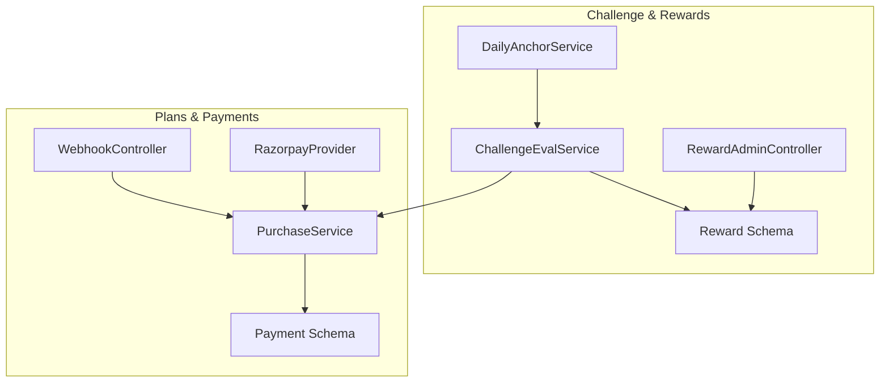
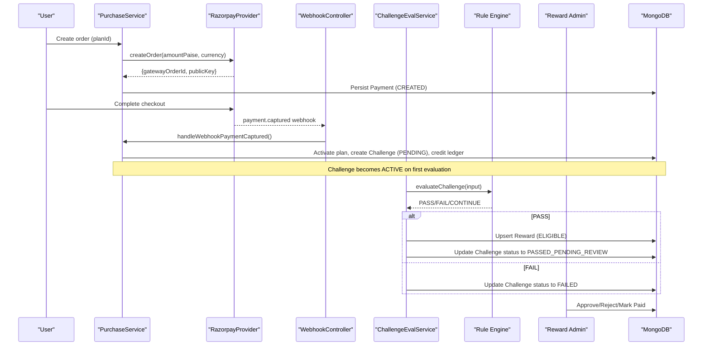
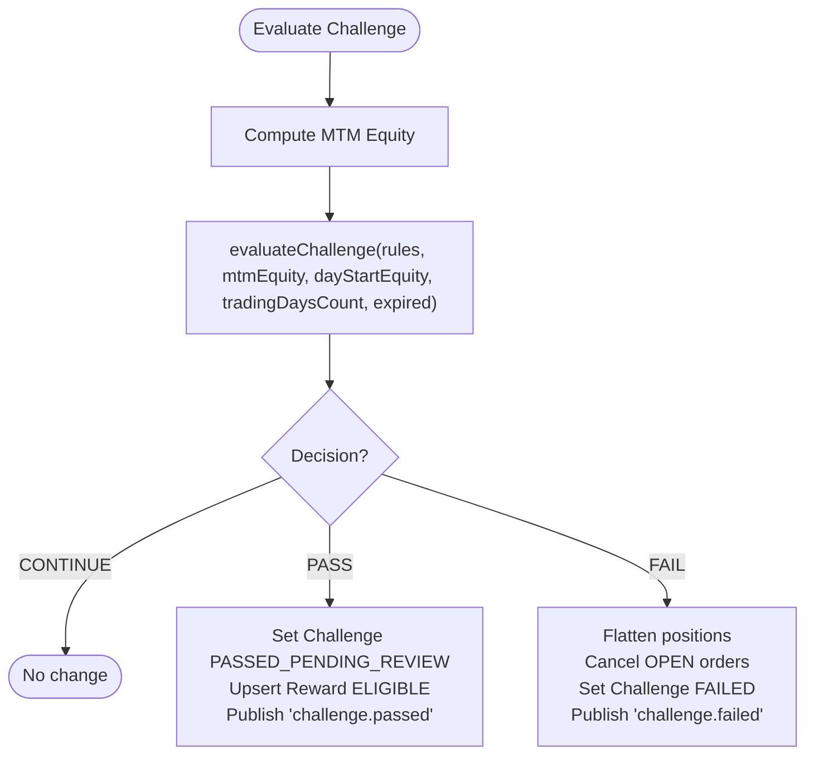
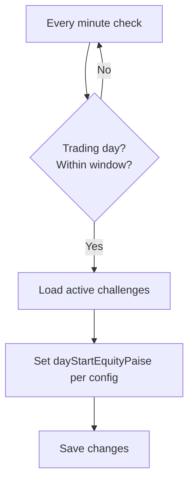
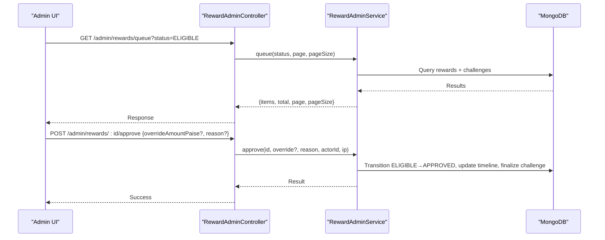
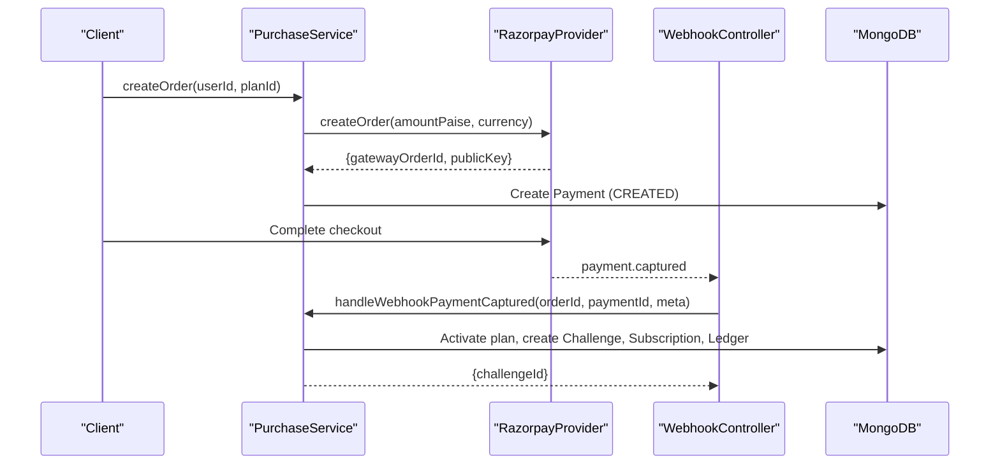
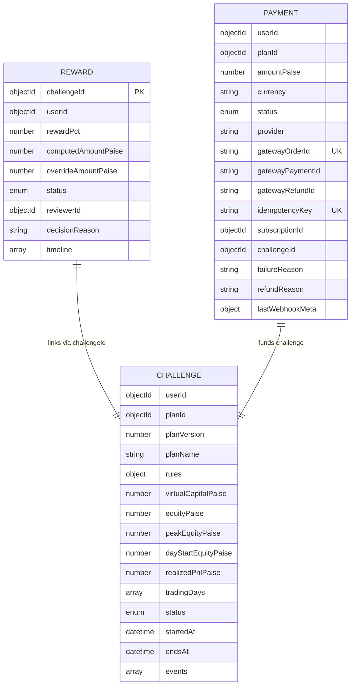
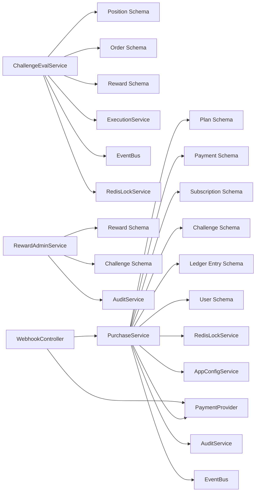

# Reward Distribution System

<cite>
**Referenced Files in This Document**
- [reward.schema.ts](file://backend/apps/api/src/modules/challenge/infrastructure/schemas/reward.schema.ts)
- [challenge-eval.service.ts](file://backend/apps/api/src/modules/challenge/application/challenge-eval.service.ts)
- [daily-anchor.service.ts](file://backend/apps/api/src/modules/challenge/application/daily-anchor.service.ts)
- [challenge-rules-eval.ts](file://backend/apps/api/src/modules/challenge/domain/challenge-rules-eval.ts)
- [reward-admin.controller.ts](file://backend/apps/api/src/modules/challenge/presentation/reward-admin.controller.ts)
- [reward.dtos.ts](file://backend/apps/api/src/modules/challenge/presentation/dto/reward.dtos.ts)
- [payment.schema.ts](file://backend/apps/api/src/modules/plans/infrastructure/schemas/payment.schema.ts)
- [razorpay.provider.ts](file://backend/apps/api/src/modules/plans/infrastructure/payment/razorpay.provider.ts)
- [webhook.controller.ts](file://backend/apps/api/src/modules/plans/presentation/webhook.controller.ts)
- [purchase.service.ts](file://backend/apps/api/src/modules/plans/application/purchase.service.ts)
- [challenge.schema.ts](file://backend/apps/api/src/modules/plans/infrastructure/schemas/challenge.schema.ts)
- [plan.types.ts](file://backend/apps/api/src/modules/plans/domain/plan.types.ts)
</cite>

## Table of Contents
1. Introduction
2. Project Structure
3. Core Components
4. Architecture Overview
5. Detailed Component Analysis
6. Dependency Analysis
7. Performance Considerations
8. Troubleshooting Guide
9. Conclusion

## Introduction
This document describes the automated reward distribution system for trading challenges. It explains how rewards are computed, reviewed, and marked as paid; how eligibility is determined by challenge rules; how payment integrations work for monetary payouts; and how notifications and engagement can be extended. It also provides schema definitions for reward records, distribution history, and achievement tracking, along with examples of configuration, triggers, manual processing, and redemption flows.

## Project Structure
The reward system spans several modules:
- Challenge evaluation and rule engine compute pass/fail outcomes and trigger reward creation.
- Admin workflows review and approve/reject/mark-paid rewards.
- Payment integration handles plan purchases and activation that lead to challenges.
- Schemas define persistent structures for rewards, payments, and challenges.

**Diagram sources**
- [challenge-eval.service.ts:57-131](file://backend/apps/api/src/modules/challenge/application/challenge-eval.service.ts#L57-L131)
- [daily-anchor.service.ts:29-44](file://backend/apps/api/src/modules/challenge/application/daily-anchor.service.ts#L29-L44)
- [reward-admin.controller.ts:23-57](file://backend/apps/api/src/modules/challenge/presentation/reward-admin.controller.ts#L23-L57)
- [reward.schema.ts:20-54](file://backend/apps/api/src/modules/challenge/infrastructure/schemas/reward.schema.ts#L20-L54)
- [purchase.service.ts:105-182](file://backend/apps/api/src/modules/plans/application/purchase.service.ts#L105-L182)
- [webhook.controller.ts:22-45](file://backend/apps/api/src/modules/plans/presentation/webhook.controller.ts#L22-L45)
- [razorpay.provider.ts:27-44](file://backend/apps/api/src/modules/plans/infrastructure/payment/razorpay.provider.ts#L27-L44)
- [payment.schema.ts:5-61](file://backend/apps/api/src/modules/plans/infrastructure/schemas/payment.schema.ts#L5-L61)

**Section sources**
- [challenge-eval.service.ts:57-131](file://backend/apps/api/src/modules/challenge/application/challenge-eval.service.ts#L57-L131)
- [daily-anchor.service.ts:29-44](file://backend/apps/api/src/modules/challenge/application/daily-anchor.service.ts#L29-L44)
- [reward-admin.controller.ts:23-57](file://backend/apps/api/src/modules/challenge/presentation/reward-admin.controller.ts#L23-L57)
- [reward.schema.ts:20-54](file://backend/apps/api/src/modules/challenge/infrastructure/schemas/reward.schema.ts#L20-L54)
- [purchase.service.ts:105-182](file://backend/apps/api/src/modules/plans/application/purchase.service.ts#L105-L182)
- [webhook.controller.ts:22-45](file://backend/apps/api/src/modules/plans/presentation/webhook.controller.ts#L22-L45)
- [razorpay.provider.ts:27-44](file://backend/apps/api/src/modules/plans/infrastructure/payment/razorpay.provider.ts#L27-L44)
- [payment.schema.ts:5-61](file://backend/apps/api/src/modules/plans/infrastructure/schemas/payment.schema.ts#L5-L61)

## Core Components
- Challenge evaluation service: Computes mark-to-market equity, evaluates rules, transitions challenge state, creates eligible rewards, and publishes events.
- Daily anchor service: Resets daily drawdown anchors at market open for active challenges.
- Reward admin controller and service: Provides endpoints to queue, view, approve, reject, and mark rewards as paid; enforces state transitions and audit logging.
- Payment integration: Creates gateway orders, verifies signatures, processes webhooks, activates plans, and creates challenges with virtual capital.
- Rule engine: Pure functions to evaluate pass/fail conditions and compute reward amounts based on profit targets and configured percentages.

**Section sources**
- [challenge-eval.service.ts:57-131](file://backend/apps/api/src/modules/challenge/application/challenge-eval.service.ts#L57-L131)
- [daily-anchor.service.ts:29-44](file://backend/apps/api/src/modules/challenge/application/daily-anchor.service.ts#L29-L44)
- [reward-admin.controller.ts:23-57](file://backend/apps/api/src/modules/challenge/presentation/reward-admin.controller.ts#L23-L57)
- [challenge-rules-eval.ts:35-66](file://backend/apps/api/src/modules/challenge/domain/challenge-rules-eval.ts#L35-L66)
- [purchase.service.ts:36-182](file://backend/apps/api/src/modules/plans/application/purchase.service.ts#L36-L182)
- [webhook.controller.ts:22-45](file://backend/apps/api/src/modules/plans/presentation/webhook.controller.ts#L22-L45)
- [razorpay.provider.ts:27-44](file://backend/apps/api/src/modules/plans/infrastructure/payment/razorpay.provider.ts#L27-L44)

## Architecture Overview
The reward flow begins when a user purchases a plan and activates a challenge. The trading engine updates positions and equity; the evaluator runs periodically or on equity updates to check rules. If the challenge passes, an eligible reward record is created. Admins review and approve or reject it; upon approval, payout occurs off-platform and the reward is marked paid.

**Diagram sources**
- [purchase.service.ts:36-182](file://backend/apps/api/src/modules/plans/application/purchase.service.ts#L36-L182)
- [webhook.controller.ts:22-45](file://backend/apps/api/src/modules/plans/presentation/webhook.controller.ts#L22-L45)
- [challenge-eval.service.ts:57-131](file://backend/apps/api/src/modules/challenge/application/challenge-eval.service.ts#L57-L131)
- [challenge-rules-eval.ts:35-66](file://backend/apps/api/src/modules/challenge/domain/challenge-rules-eval.ts#L35-L66)
- [reward-admin.controller.ts:23-57](file://backend/apps/api/src/modules/challenge/presentation/reward-admin.controller.ts#L23-L57)

## Detailed Component Analysis

### Challenge Evaluation and Automatic Triggers
- Mark-to-market equity calculation aggregates realized equity and unrealized P&L from open positions using cached quotes.
- Rule evaluation checks daily drawdown, max drawdown, expiry, and profit target with minimum trading days.
- On pass: challenge moves to PASSED_PENDING_REVIEW, reward upserted as ELIGIBLE, event published.
- On fail: positions flattened, orders cancelled, challenge set to FAILED, event published.

**Diagram sources**
- [challenge-eval.service.ts:43-89](file://backend/apps/api/src/modules/challenge/application/challenge-eval.service.ts#L43-L89)
- [challenge-eval.service.ts:92-131](file://backend/apps/api/src/modules/challenge/application/challenge-eval.service.ts#L92-L131)
- [challenge-rules-eval.ts:35-66](file://backend/apps/api/src/modules/challenge/domain/challenge-rules-eval.ts#L35-L66)

**Section sources**
- [challenge-eval.service.ts:43-131](file://backend/apps/api/src/modules/challenge/application/challenge-eval.service.ts#L43-L131)
- [challenge-rules-eval.ts:35-66](file://backend/apps/api/src/modules/challenge/domain/challenge-rules-eval.ts#L35-L66)

### Daily Anchor Reset
- Runs once per trading day shortly before market open.
- Resets dayStartEquityPaise for active challenges based on config (previous day close or initial capital).

**Diagram sources**
- [daily-anchor.service.ts:29-44](file://backend/apps/api/src/modules/challenge/application/daily-anchor.service.ts#L29-L44)

**Section sources**
- [daily-anchor.service.ts:29-44](file://backend/apps/api/src/modules/challenge/application/daily-anchor.service.ts#L29-L44)

### Reward Administration Workflow
- Queue: Paginated list of rewards filtered by status, enriched with challenge details.
- Detail: Fetch reward and associated challenge.
- Approve: Transition ELIGIBLE → APPROVED, optional override amount, audit logged, challenge finalized to PASSED.
- Reject: Transition ELIGIBLE/APPROVED → REJECTED with reason.
- Mark Paid: Transition APPROVED → PAID after off-platform payout.

**Diagram sources**
- [reward-admin.controller.ts:23-57](file://backend/apps/api/src/modules/challenge/presentation/reward-admin.controller.ts#L23-L57)
- [reward-admin.controller.ts:17-93](file://backend/apps/api/src/modules/challenge/application/reward-admin.service.ts#L17-L93)

**Section sources**
- [reward-admin.controller.ts:23-57](file://backend/apps/api/src/modules/challenge/presentation/reward-admin.controller.ts#L23-L57)
- [reward-admin.controller.ts:17-93](file://backend/apps/api/src/modules/challenge/application/reward-admin.service.ts#L17-L93)
- [reward.dtos.ts:4-21](file://backend/apps/api/src/modules/challenge/presentation/dto/reward.dtos.ts#L4-L21)

### Payment Integration and Plan Activation
- Create order: Validates KYC, plan availability, active challenge limits; creates gateway order and persisted Payment intent.
- Checkout confirmation: Verifies signature and activates plan idempotently.
- Webhook handling: Verifies webhook signature, calls activation with captured payment info.
- Activation: Creates Challenge (PENDING), Subscription, Ledger entry; marks Payment ACTIVATED; publishes billing event.

**Diagram sources**
- [purchase.service.ts:36-182](file://backend/apps/api/src/modules/plans/application/purchase.service.ts#L36-L182)
- [webhook.controller.ts:22-45](file://backend/apps/api/src/modules/plans/presentation/webhook.controller.ts#L22-L45)
- [razorpay.provider.ts:27-44](file://backend/apps/api/src/modules/plans/infrastructure/payment/razorpay.provider.ts#L27-L44)

**Section sources**
- [purchase.service.ts:36-182](file://backend/apps/api/src/modules/plans/application/purchase.service.ts#L36-L182)
- [webhook.controller.ts:22-45](file://backend/apps/api/src/modules/plans/presentation/webhook.controller.ts#L22-L45)
- [razorpay.provider.ts:27-44](file://backend/apps/api/src/modules/plans/infrastructure/payment/razorpay.provider.ts#L27-L44)

### Data Models and Schemas
- Reward: Stores challenge linkage, user, computed and optional overridden amounts, status lifecycle, reviewer, reasons, and timeline.
- Payment: Tracks purchase intents, provider details, gateway identifiers, idempotency keys, subscription and challenge links, and failure/refund metadata.
- Challenge: Captures plan snapshot, virtual capital, live equity metrics, trading days, status lifecycle, and event log.

**Diagram sources**
- [reward.schema.ts:20-54](file://backend/apps/api/src/modules/challenge/infrastructure/schemas/reward.schema.ts#L20-L54)
- [payment.schema.ts:5-61](file://backend/apps/api/src/modules/plans/infrastructure/schemas/payment.schema.ts#L5-L61)
- [challenge.schema.ts:23-70](file://backend/apps/api/src/modules/plans/infrastructure/schemas/challenge.schema.ts#L23-L70)

**Section sources**
- [reward.schema.ts:20-54](file://backend/apps/api/src/modules/challenge/infrastructure/schemas/reward.schema.ts#L20-L54)
- [payment.schema.ts:5-61](file://backend/apps/api/src/modules/plans/infrastructure/schemas/payment.schema.ts#L5-L61)
- [challenge.schema.ts:23-70](file://backend/apps/api/src/modules/plans/infrastructure/schemas/challenge.schema.ts#L23-L70)

## Dependency Analysis
- ChallengeEvalService depends on Position, Order, Reward schemas, Redis for locking and quote cache, ExecutionService for flattening, and EventBus for publishing outcomes.
- RewardAdminService depends on Reward and Challenge schemas and AuditService for compliance.
- PurchaseService depends on Plan, Payment, Subscription, Challenge, Ledger, User schemas, PaymentProvider abstraction, Redis locks, AppConfigService, AuditService, and EventBus.
- WebhookController depends on PurchaseService and PaymentProvider for verification.

**Diagram sources**
- [challenge-eval.service.ts:27-37](file://backend/apps/api/src/modules/challenge/application/challenge-eval.service.ts#L27-L37)
- [reward-admin.service.ts:11-15](file://backend/apps/api/src/modules/challenge/application/reward-admin.service.ts#L11-L15)
- [purchase.service.ts:22-34](file://backend/apps/api/src/modules/plans/application/purchase.service.ts#L22-L34)
- [webhook.controller.ts:17-20](file://backend/apps/api/src/modules/plans/presentation/webhook.controller.ts#L17-L20)

**Section sources**
- [challenge-eval.service.ts:27-37](file://backend/apps/api/src/modules/challenge/application/challenge-eval.service.ts#L27-L37)
- [reward-admin.service.ts:11-15](file://backend/apps/api/src/modules/challenge/application/reward-admin.service.ts#L11-L15)
- [purchase.service.ts:22-34](file://backend/apps/api/src/modules/plans/application/purchase.service.ts#L22-L34)
- [webhook.controller.ts:17-20](file://backend/apps/api/src/modules/plans/presentation/webhook.controller.ts#L17-L20)

## Performance Considerations
- Use Redis locks around account evaluation and activation to prevent race conditions during concurrent fills and webhooks.
- Cache quotes to minimize latency when computing unrealized P&L for MTM equity.
- Batch queries where possible (e.g., loading multiple challenges for reward queue enrichment).
- Ensure daily anchor reset runs only once per trading day within a narrow time window to avoid redundant writes.

[No sources needed since this section provides general guidance]

## Troubleshooting Guide
- Invalid webhook signature: The webhook handler rejects requests without valid HMAC signatures; verify provider secret and raw body handling.
- Payment not activating: Check Payment status and idempotency key; ensure activate path is reachable and locks do not block indefinitely.
- Reward stuck in ELIGIBLE: Confirm challenge status transitioned to PASSED_PENDING_REVIEW; verify admin permissions and correct endpoint usage.
- State transition errors: Attempting invalid transitions (e.g., marking paid from ELIGIBLE) will return conflict; follow allowed paths ELIGIBLE → APPROVED → PAID.

**Section sources**
- [webhook.controller.ts:22-45](file://backend/apps/api/src/modules/plans/presentation/webhook.controller.ts#L22-L45)
- [purchase.service.ts:105-182](file://backend/apps/api/src/modules/plans/application/purchase.service.ts#L105-L182)
- [reward-admin.controller.ts:12-21](file://backend/apps/api/src/modules/challenge/presentation/reward-admin.controller.ts#L12-L21)
- [reward-admin.controller.ts:40-57](file://backend/apps/api/src/modules/challenge/presentation/reward-admin.controller.ts#L40-L57)

## Conclusion
The system automates reward eligibility through robust challenge rule evaluation, integrates secure payment flows for plan activation, and provides controlled administrative workflows for reviewing and finalizing payouts. Schemas capture full histories for auditing and reporting. Extensions can add non-monetary achievements and digital badges by leveraging existing event buses and notification providers.

[No sources needed since this section summarizes without analyzing specific files]