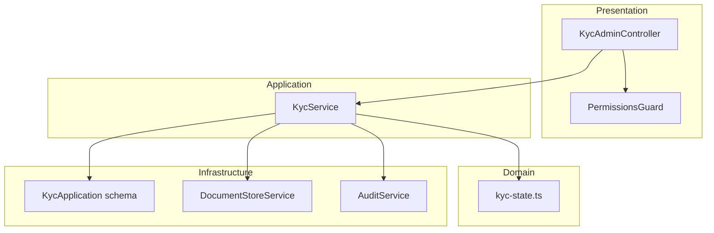
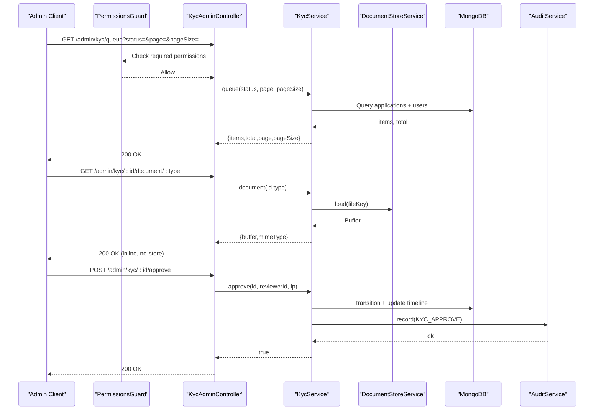
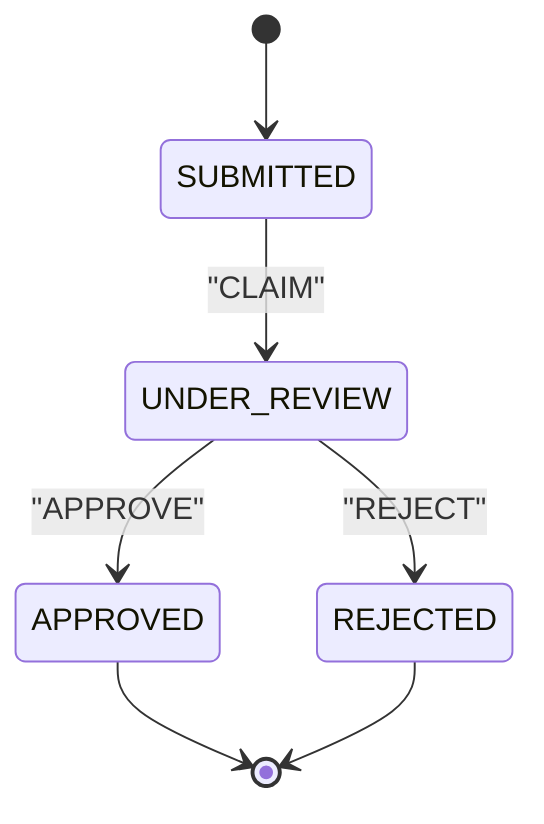
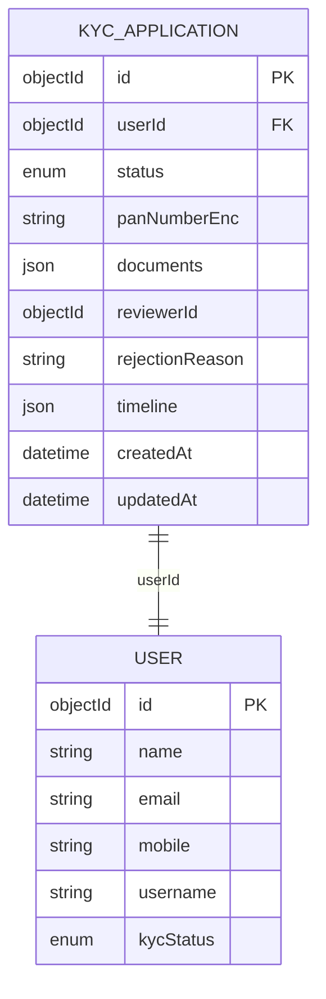
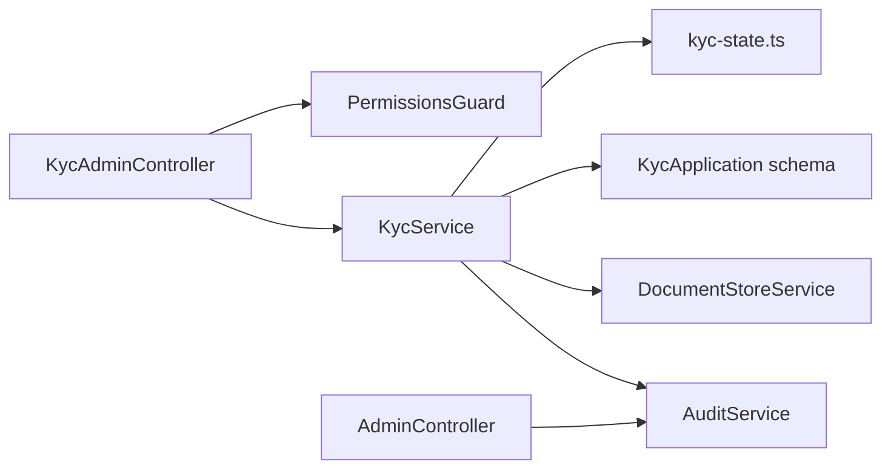

# Admin KYC Management APIs

<cite>
**Referenced Files in This Document**
- [kyc-admin.controller.ts](file://backend/apps/api/src/modules/kyc/presentation/kyc-admin.controller.ts)
- [kyc.service.ts](file://backend/apps/api/src/modules/kyc/application/kyc.service.ts)
- [kyc.dtos.ts](file://backend/apps/api/src/modules/kyc/presentation/dto/kyc.dtos.ts)
- [kyc-state.ts](file://backend/apps/api/src/modules/kyc/domain/kyc-state.ts)
- [kyc-application.schema.ts](file://backend/apps/api/src/modules/kyc/infrastructure/kyc-application.schema.ts)
- [document-store.service.ts](file://backend/apps/api/src/modules/kyc/infrastructure/document-store.service.ts)
- [permissions.guard.ts](file://backend/apps/api/src/modules/admin/presentation/permissions.guard.ts)
- [admin.controller.ts](file://backend/apps/api/src/modules/admin/presentation/admin.controller.ts)
- [audit.service.ts](file://backend/libs/shared/src/audit/audit.service.ts)
- [audit-log.schema.ts](file://backend/libs/shared/src/audit/audit-log.schema.ts)
- [P2-kyc-admin.md](file://docs/P2-kyc-admin.md)
</cite>

## Table of Contents
1. Introduction
2. Project Structure
3. Core Components
4. Architecture Overview
5. Detailed Component Analysis
6. Dependency Analysis
7. Performance Considerations
8. Troubleshooting Guide
9. Conclusion
10. Appendices

## Introduction
This document provides comprehensive API documentation for administrative KYC management endpoints. It covers viewing the KYC queue, reviewing applications and documents, approving or rejecting verifications, and integrating with audit logging and compliance reporting. It also details access controls, request/response schemas, security considerations for sensitive documents, and examples for manual review workflows and batch operations.

## Project Structure
The admin KYC functionality is implemented under the KYC module with a clean architecture:
- Presentation layer exposes REST endpoints guarded by employee authentication and permissions.
- Application layer orchestrates business logic (queueing, transitions, auditing).
- Domain layer defines state machine and constraints.
- Infrastructure layer persists data and stores encrypted documents.

**Diagram sources**
- [kyc-admin.controller.ts:27-79](file://backend/apps/api/src/modules/kyc/presentation/kyc-admin.controller.ts#L27-L79)
- [kyc.service.ts:29-188](file://backend/apps/api/src/modules/kyc/application/kyc.service.ts#L29-L188)
- [kyc-state.ts:1-35](file://backend/apps/api/src/modules/kyc/domain/kyc-state.ts#L1-L35)
- [kyc-application.schema.ts:38-70](file://backend/apps/api/src/modules/kyc/infrastructure/kyc-application.schema.ts#L38-L70)
- [document-store.service.ts:13-36](file://backend/apps/api/src/modules/kyc/infrastructure/document-store.service.ts#L13-L36)
- [audit.service.ts:23-43](file://backend/libs/shared/src/audit/audit.service.ts#L23-L43)

**Section sources**
- [kyc-admin.controller.ts:27-79](file://backend/apps/api/src/modules/kyc/presentation/kyc-admin.controller.ts#L27-L79)
- [kyc.service.ts:29-188](file://backend/apps/api/src/modules/kyc/application/kyc.service.ts#L29-L188)
- [P2-kyc-admin.md:17-21](file://docs/P2-kyc-admin.md#L17-L21)

## Core Components
- KycAdminController: Exposes admin endpoints for queue, detail, document retrieval, claim, approve, and reject.
- KycService: Implements queue listing, application detail, document streaming, and action transitions with auditing.
- PermissionsGuard: Enforces RBAC on admin endpoints using @RequirePermissions decorators.
- AuditService: Records immutable audit entries for all KYC actions.
- DocumentStoreService: Stores and retrieves AES-256-GCM encrypted documents with path traversal protection.
- kyc-state.ts: Pure state machine enforcing legal transitions and constants for document types and limits.

Key responsibilities:
- Queue pagination and filtering by status.
- Streaming decrypted documents inline with no-store caching.
- Claim binding to reviewer, preventing concurrent claims.
- Transition enforcement via pure function.
- Audit logging with before/after snapshots and IP capture.

**Section sources**
- [kyc-admin.controller.ts:27-79](file://backend/apps/api/src/modules/kyc/presentation/kyc-admin.controller.ts#L27-L79)
- [kyc.service.ts:113-188](file://backend/apps/api/src/modules/kyc/application/kyc.service.ts#L113-L188)
- [permissions.guard.ts:18-41](file://backend/apps/api/src/modules/admin/presentation/permissions.guard.ts#L18-L41)
- [audit.service.ts:23-43](file://backend/libs/shared/src/audit/audit.service.ts#L23-L43)
- [document-store.service.ts:13-36](file://backend/apps/api/src/modules/kyc/infrastructure/document-store.service.ts#L13-L36)
- [kyc-state.ts:1-35](file://backend/apps/api/src/modules/kyc/domain/kyc-state.ts#L1-L35)

## Architecture Overview
Admin KYC endpoints are protected by EmployeeAuthGuard and PermissionsGuard. Requests flow through controllers into services that enforce domain rules, persist state changes, stream documents from an encrypted store, and record audit events.

**Diagram sources**
- [kyc-admin.controller.ts:32-78](file://backend/apps/api/src/modules/kyc/presentation/kyc-admin.controller.ts#L32-L78)
- [kyc.service.ts:113-188](file://backend/apps/api/src/modules/kyc/application/kyc.service.ts#L113-L188)
- [document-store.service.ts:23-36](file://backend/apps/api/src/modules/kyc/infrastructure/document-store.service.ts#L23-L36)
- [audit.service.ts:29-43](file://backend/libs/shared/src/audit/audit.service.ts#L29-L43)

## Detailed Component Analysis

### Admin KYC Endpoints
All endpoints require employee JWT and specific permissions. Responses follow the platform envelope pattern.

- GET /admin/kyc/queue
  - Query parameters:
    - status: optional; one of SUBMITTED, UNDER_REVIEW, APPROVED, REJECTED
    - page: optional; integer >= 1
    - pageSize: optional; integer >= 1, <= 100
  - Permission: kyc.view
  - Response:
    - items: array of applications enriched with user fields (name, email, mobile, username)
    - total: number of matching applications
    - page: current page
    - pageSize: requested page size

- GET /admin/kyc/:id
  - Path parameter: id (application ID)
  - Permission: kyc.view
  - Response: full application object plus user details (name, email, mobile, username, kycStatus)

- GET /admin/kyc/:id/document/:type
  - Path parameters: id (application ID), type (PAN | ID_PROOF | ADDRESS_PROOF | SELFIE)
  - Permission: kyc.view
  - Behavior: streams decrypted document inline; sets Content-Type to mimeType; sets Cache-Control: no-store; sets Content-Disposition inline
  - Error: NOT_FOUND if unknown document type or missing document

- POST /admin/kyc/:id/claim
  - Path parameter: id
  - Permission: kyc.review
  - Request body: none
  - Behavior: binds reviewer to application; transitions to UNDER_REVIEW if allowed
  - Errors: NOT_FOUND; KYC_CLAIMED_BY_OTHER if already claimed by another reviewer

- POST /admin/kyc/:id/approve
  - Path parameter: id
  - Permission: kyc.review
  - Request body: none
  - Behavior: transitions to APPROVED; updates user kycStatus; records audit event

- POST /admin/kyc/:id/reject
  - Path parameter: id
  - Permission: kyc.review
  - Request body:
    - reason: string, length 5–500
  - Behavior: transitions to REJECTED; stores rejectionReason; updates user kycStatus; records audit event

Request validation schemas:
- KycQueueQueryDto: status enum, page int >= 1, pageSize int >= 1 and <= 100
- RejectKycDto: reason string length 5–500

Error handling:
- Controller unwraps Result objects and maps domain errors to HTTP status codes (NOT_FOUND, CONFLICT, UNPROCESSABLE_ENTITY)

Access control:
- All endpoints protected by EmployeeAuthGuard and PermissionsGuard with @RequirePermissions

Audit logging:
- Each action records actorType EMPLOYEE, action KYC_CLAIM/KYC_APPROVE/KYC_REJECT, entity kyc_application, entityId applicationId, before/after status, and IP

Security:
- Documents stored as AES-256-GCM encrypted blobs; streamed with no-store cache policy
- PAN field encrypted at rest
- Path traversal blocked on document read

Examples:
- Manual review workflow:
  - GET /admin/kyc/queue?page=1&pageSize=20
  - GET /admin/kyc/:id
  - GET /admin/kyc/:id/document/PAN
  - POST /admin/kyc/:id/claim
  - POST /admin/kyc/:id/approve or POST /admin/kyc/:id/reject with reason

- Batch approvals:
  - Iterate queue results and call POST /admin/kyc/:id/approve per item
  - For large batches, implement client-side concurrency control and retry on transient failures

- Compliance report generation:
  - Use GET /admin/audit-logs?entity=kyc_application&entityId=:id to retrieve action history for a specific application
  - Aggregate across multiple IDs via repeated calls or server-side aggregation

**Section sources**
- [kyc-admin.controller.ts:27-79](file://backend/apps/api/src/modules/kyc/presentation/kyc-admin.controller.ts#L27-L79)
- [kyc.dtos.ts:4-23](file://backend/apps/api/src/modules/kyc/presentation/dto/kyc.dtos.ts#L4-L23)
- [kyc.service.ts:113-188](file://backend/apps/api/src/modules/kyc/application/kyc.service.ts#L113-L188)
- [permissions.guard.ts:18-41](file://backend/apps/api/src/modules/admin/presentation/permissions.guard.ts#L18-L41)
- [audit.service.ts:29-43](file://backend/libs/shared/src/audit/audit.service.ts#L29-L43)
- [document-store.service.ts:23-36](file://backend/apps/api/src/modules/kyc/infrastructure/document-store.service.ts#L23-L36)
- [P2-kyc-admin.md:32-40](file://docs/P2-kyc-admin.md#L32-L40)

### State Machine and Transitions
The KYC application lifecycle is enforced by a pure transition function:
- SUBMITTED → UNDER_REVIEW via CLAIM
- UNDER_REVIEW → APPROVED via APPROVE
- UNDER_REVIEW → REJECTED via REJECT
- Terminal states (APPROVED, REJECTED) do not allow further transitions

Constraints:
- One live application per user (SUBMITTED or UNDER_REVIEW)
- Reviewer claim prevents concurrent approvals by others

**Diagram sources**
- [kyc-state.ts:3-28](file://backend/apps/api/src/modules/kyc/domain/kyc-state.ts#L3-L28)

**Section sources**
- [kyc-state.ts:3-28](file://backend/apps/api/src/modules/kyc/domain/kyc-state.ts#L3-L28)
- [kyc.service.ts:152-188](file://backend/apps/api/src/modules/kyc/application/kyc.service.ts#L152-L188)

### Data Models
KYC application model includes:
- userId: reference to user
- status: enum (SUBMITTED, UNDER_REVIEW, APPROVED, REJECTED)
- panNumberEnc: field-encrypted PAN
- documents: array of references with type, fileKey, mimeType, sizeBytes
- reviewerId: optional ObjectId
- rejectionReason: optional string
- timeline: array of events with timestamp, event name, employee ID, note

Indexes:
- status + createdAt composite index
- unique partial index on userId for live applications

**Diagram sources**
- [kyc-application.schema.ts:38-70](file://backend/apps/api/src/modules/kyc/infrastructure/kyc-application.schema.ts#L38-L70)

**Section sources**
- [kyc-application.schema.ts:38-70](file://backend/apps/api/src/modules/kyc/infrastructure/kyc-application.schema.ts#L38-L70)

### Security and Compliance
- Encryption at rest:
  - Documents stored as AES-256-GCM encrypted blobs under STORAGE_DIR/kyc with opaque UUID paths
  - PAN field encrypted using DATA_ENC_SECRET
- Access control:
  - Employee JWT required; permissions enforced per endpoint via @RequirePermissions
- Audit trail:
  - Immutable audit logs with actor, action, entity, before/after snapshots, and IP
  - Queries available via admin audit-logs endpoint
- Compliance reporting:
  - Retrieve audit logs per entity or actor for investigations and reports
  - Combine with queue and detail endpoints to produce compliance summaries

Environment requirements:
- DATA_ENC_SECRET: encryption key for at-rest data
- STORAGE_DIR: persistent volume for encrypted documents

**Section sources**
- [document-store.service.ts:13-36](file://backend/apps/api/src/modules/kyc/infrastructure/document-store.service.ts#L13-L36)
- [audit.service.ts:23-43](file://backend/libs/shared/src/audit/audit.service.ts#L23-L43)
- [audit-log.schema.ts:6-40](file://backend/libs/shared/src/audit/audit-log.schema.ts#L6-L40)
- [P2-kyc-admin.md:52-54](file://docs/P2-kyc-admin.md#L52-L54)

## Dependency Analysis

**Diagram sources**
- [kyc-admin.controller.ts:27-79](file://backend/apps/api/src/modules/kyc/presentation/kyc-admin.controller.ts#L27-L79)
- [kyc.service.ts:29-188](file://backend/apps/api/src/modules/kyc/application/kyc.service.ts#L29-L188)
- [permissions.guard.ts:18-41](file://backend/apps/api/src/modules/admin/presentation/permissions.guard.ts#L18-L41)
- [admin.controller.ts:161-169](file://backend/apps/api/src/modules/admin/presentation/admin.controller.ts#L161-L169)

**Section sources**
- [kyc-admin.controller.ts:27-79](file://backend/apps/api/src/modules/kyc/presentation/kyc-admin.controller.ts#L27-L79)
- [kyc.service.ts:29-188](file://backend/apps/api/src/modules/kyc/application/kyc.service.ts#L29-L188)
- [permissions.guard.ts:18-41](file://backend/apps/api/src/modules/admin/presentation/permissions.guard.ts#L18-L41)
- [admin.controller.ts:161-169](file://backend/apps/api/src/modules/admin/presentation/admin.controller.ts#L161-L169)

## Performance Considerations
- Queue queries use pagination with skip/limit and countDocuments for totals; consider adding compound indexes for frequent filters.
- Document streaming avoids loading entire payloads into memory beyond necessary buffers; ensure storage backend is performant.
- Auditing writes are fire-and-forget with error logging to avoid impacting business operations; monitor audit write failures.
- For batch approvals, implement client-side concurrency limits and retries to prevent overload.

[No sources needed since this section provides general guidance]

## Troubleshooting Guide
Common issues and resolutions:
- 401 Unauthorized: Missing or invalid employee JWT; ensure authentication header is present.
- 403 Forbidden: Insufficient permissions; verify employee role grants include required permission.
- 404 Not Found: Application or document not found; check IDs and document types.
- 409 Conflict: Application already claimed by another reviewer; wait for release or reassign.
- 422 Unprocessable Entity: Validation errors (e.g., invalid reason length); adjust request payload.

Diagnostics:
- Use GET /admin/audit-logs?entity=kyc_application&entityId=:id to inspect action history and reasons.
- Verify environment variables DATA_ENC_SECRET and STORAGE_DIR are correctly configured.

**Section sources**
- [kyc-admin.controller.ts:14-25](file://backend/apps/api/src/modules/kyc/presentation/kyc-admin.controller.ts#L14-L25)
- [admin.controller.ts:161-169](file://backend/apps/api/src/modules/admin/presentation/admin.controller.ts#L161-L169)
- [audit.service.ts:29-43](file://backend/libs/shared/src/audit/audit.service.ts#L29-L43)

## Conclusion
The admin KYC management APIs provide secure, auditable, and compliant capabilities for reviewing and processing KYC applications. The design enforces strict state transitions, protects sensitive documents with encryption, and integrates robust RBAC and audit logging. Operators can efficiently manage queues, review documents, and generate compliance reports while maintaining regulatory standards.

[No sources needed since this section summarizes without analyzing specific files]

## Appendices

### Endpoint Reference Summary
- GET /admin/kyc/queue
  - Params: status, page, pageSize
  - Perm: kyc.view
- GET /admin/kyc/:id
  - Perm: kyc.view
- GET /admin/kyc/:id/document/:type
  - Perm: kyc.view
- POST /admin/kyc/:id/claim
  - Perm: kyc.review
- POST /admin/kyc/:id/approve
  - Perm: kyc.review
- POST /admin/kyc/:id/reject
  - Body: reason (string, 5–500)
  - Perm: kyc.review

**Section sources**
- [kyc-admin.controller.ts:32-78](file://backend/apps/api/src/modules/kyc/presentation/kyc-admin.controller.ts#L32-L78)
- [kyc.dtos.ts:9-23](file://backend/apps/api/src/modules/kyc/presentation/dto/kyc.dtos.ts#L9-L23)
- [P2-kyc-admin.md:32-40](file://docs/P2-kyc-admin.md#L32-L40)

### Audit Log Fields
- actorType: USER | EMPLOYEE | SYSTEM
- actorId: string
- action: string (e.g., KYC_CLAIM, KYC_APPROVE, KYC_REJECT)
- entity: string (e.g., kyc_application)
- entityId: string
- before: object (optional)
- after: object (optional)
- ip: string (optional)
- at: timestamp

**Section sources**
- [audit-log.schema.ts:6-40](file://backend/libs/shared/src/audit/audit-log.schema.ts#L6-L40)
- [audit.service.ts:29-43](file://backend/libs/shared/src/audit/audit.service.ts#L29-L43)