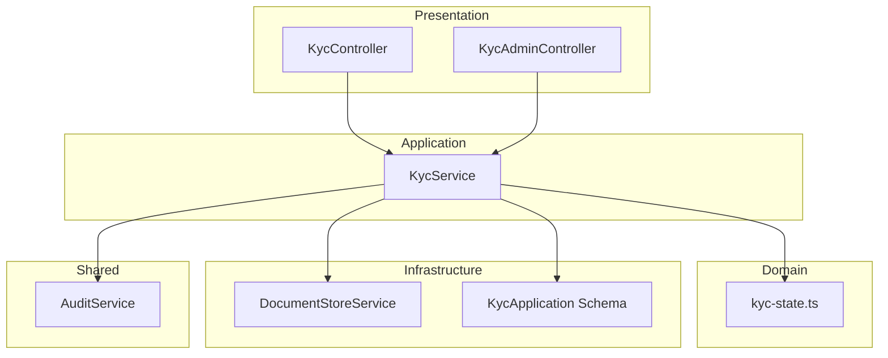
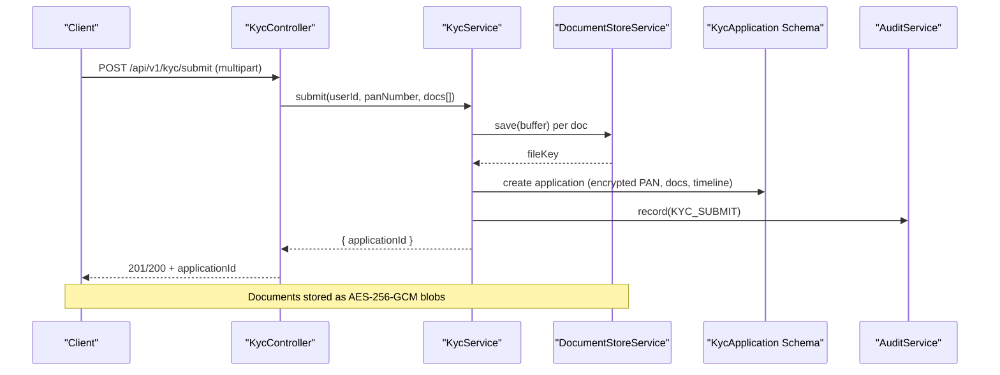
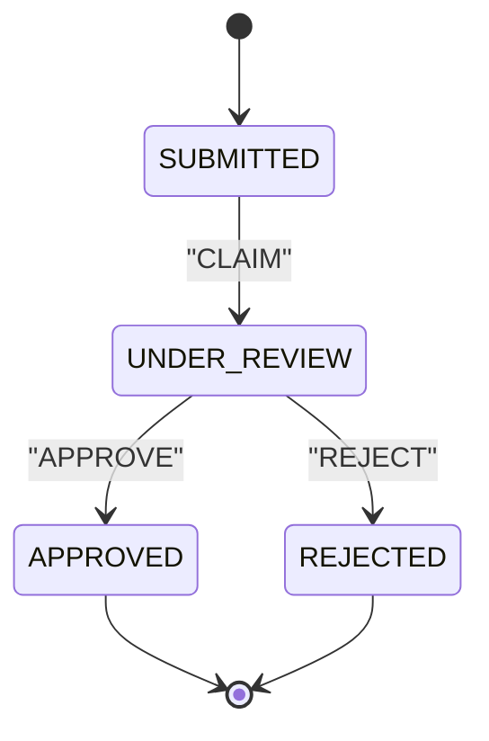
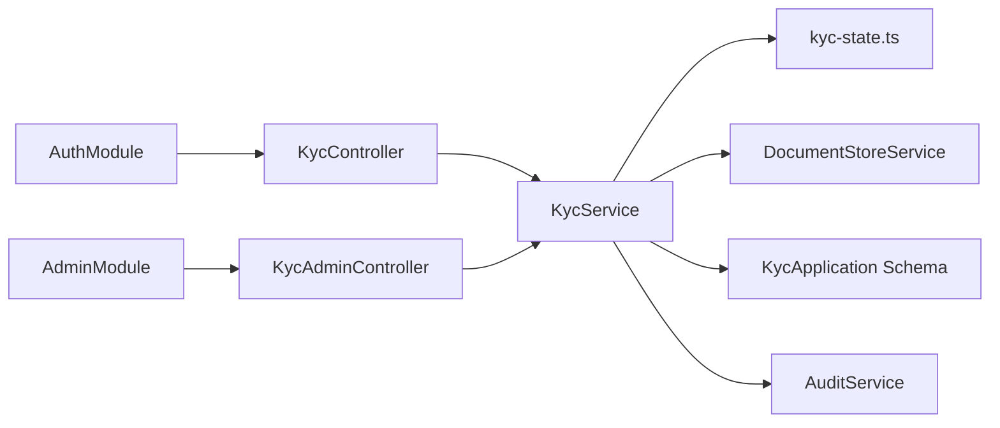

# KYC & Compliance APIs

<cite>
**Referenced Files in This Document**
- [kyc.module.ts](file://backend/apps/api/src/modules/kyc/kyc.module.ts)
- [kyc.controller.ts](file://backend/apps/api/src/modules/kyc/presentation/kyc.controller.ts)
- [kyc-admin.controller.ts](file://backend/apps/api/src/modules/kyc/presentation/kyc-admin.controller.ts)
- [kyc.service.ts](file://backend/apps/api/src/modules/kyc/application/kyc.service.ts)
- [kyc-state.ts](file://backend/apps/api/src/modules/kyc/domain/kyc-state.ts)
- [document-store.service.ts](file://backend/apps/api/src/modules/kyc/infrastructure/document-store.service.ts)
- [kyc-application.schema.ts](file://backend/apps/api/src/modules/kyc/infrastructure/kyc-application.schema.ts)
- [kyc.dtos.ts](file://backend/apps/api/src/modules/kyc/presentation/dto/kyc.dtos.ts)
- [audit.service.ts](file://backend/libs/shared/src/audit/audit.service.ts)
- [audit-log.schema.ts](file://backend/libs/shared/src/audit/audit-log.schema.ts)
- [rbac-kyc.e2e-spec.ts](file://backend/test/e2e/rbac-kyc.e2e-spec.ts)
</cite>

## Table of Contents
1. Introduction
2. Project Structure
3. Core Components
4. Architecture Overview
5. Detailed Component Analysis
6. Dependency Analysis
7. Performance Considerations
8. Troubleshooting Guide
9. Conclusion

## Introduction
This document provides comprehensive API documentation for the KYC and compliance features implemented in the backend. It covers document upload, verification workflow, status checking, and administrative review endpoints. It also documents data models, request/response schemas, storage integration, state transitions, and audit logging requirements. Where applicable, examples are provided to illustrate typical client interactions such as uploading identity documents, checking verification status, submitting additional information, and accessing compliance reports.

## Project Structure
The KYC feature is organized by domain-driven layers:
- Presentation: REST controllers exposing user-facing and admin-facing endpoints
- Application: Business logic orchestration (validation, persistence, external services)
- Domain: State machine and constants governing KYC lifecycle
- Infrastructure: Data persistence (Mongoose schema), encrypted file storage, and shared utilities
- Shared: Audit logging service and schema

**Diagram sources**
- [kyc.controller.ts:37-63](file://backend/apps/api/src/modules/kyc/presentation/kyc.controller.ts#L37-L63)
- [kyc-admin.controller.ts:27-78](file://backend/apps/api/src/modules/kyc/presentation/kyc-admin.controller.ts#L27-L78)
- [kyc.service.ts:29-189](file://backend/apps/api/src/modules/kyc/application/kyc.service.ts#L29-L189)
- [kyc-state.ts:1-35](file://backend/apps/api/src/modules/kyc/domain/kyc-state.ts#L1-L35)
- [document-store.service.ts:13-37](file://backend/apps/api/src/modules/kyc/infrastructure/document-store.service.ts#L13-L37)
- [kyc-application.schema.ts:38-70](file://backend/apps/api/src/modules/kyc/infrastructure/kyc-application.schema.ts#L38-L70)
- [audit.service.ts:23-44](file://backend/libs/shared/src/audit/audit.service.ts#L23-L44)

**Section sources**
- [kyc.module.ts:12-23](file://backend/apps/api/src/modules/kyc/kyc.module.ts#L12-L23)

## Core Components
- KycController: User-facing endpoints for KYC submission and status retrieval with rate limiting and multipart file handling.
- KycAdminController: Admin endpoints for queue listing, detail retrieval, document download, claim/approve/reject actions with RBAC guards.
- KycService: Orchestrates validation, encryption, storage, state transitions, and audit logging.
- kyc-state: Pure state machine enforcing legal transitions and constraints on document types and sizes.
- DocumentStoreService: Encrypted-at-rest storage for uploaded documents using AES-256-GCM.
- KycApplication Schema: Mongoose model for applications, documents, timeline, and reviewer metadata.
- AuditService: Immutable audit trail for all KYC actions.

**Section sources**
- [kyc.controller.ts:37-63](file://backend/apps/api/src/modules/kyc/presentation/kyc.controller.ts#L37-L63)
- [kyc-admin.controller.ts:27-78](file://backend/apps/api/src/modules/kyc/presentation/kyc-admin.controller.ts#L27-L78)
- [kyc.service.ts:29-189](file://backend/apps/api/src/modules/kyc/application/kyc.service.ts#L29-L189)
- [kyc-state.ts:1-35](file://backend/apps/api/src/modules/kyc/domain/kyc-state.ts#L1-L35)
- [document-store.service.ts:13-37](file://backend/apps/api/src/modules/kyc/infrastructure/document-store.service.ts#L13-L37)
- [kyc-application.schema.ts:38-70](file://backend/apps/api/src/modules/kyc/infrastructure/kyc-application.schema.ts#L38-L70)
- [audit.service.ts:23-44](file://backend/libs/shared/src/audit/audit.service.ts#L23-L44)

## Architecture Overview
The KYC flow integrates authentication, validation, encrypted storage, state transitions, and audit logging. Users submit documents via a multipart endpoint; admins manage the review pipeline with permission checks. All sensitive fields and files are protected at rest.

**Diagram sources**
- [kyc.controller.ts:47-63](file://backend/apps/api/src/modules/kyc/presentation/kyc.controller.ts#L47-L63)
- [kyc.service.ts:55-109](file://backend/apps/api/src/modules/kyc/application/kyc.service.ts#L55-L109)
- [document-store.service.ts:23-30](file://backend/apps/api/src/modules/kyc/infrastructure/document-store.service.ts#L23-L30)
- [kyc-application.schema.ts:38-70](file://backend/apps/api/src/modules/kyc/infrastructure/kyc-application.schema.ts#L38-L70)
- [audit.service.ts:29-35](file://backend/libs/shared/src/audit/audit.service.ts#L29-L35)

## Detailed Component Analysis

### Endpoints Reference

#### User Endpoints
- GET /api/v1/kyc/status
  - Purpose: Retrieve current KYC status and latest application details for the authenticated user.
  - Authentication: JWT (UserAuthGuard).
  - Response: Includes user-level KYC status and latest application snapshot (status, rejection reason, timestamps).
  - Error codes: NOT_FOUND if no application exists.

- POST /api/v1/kyc/submit
  - Purpose: Submit KYC application with required documents and PAN number.
  - Authentication: JWT (UserAuthGuard).
  - Rate limit: Throttled to protect against abuse.
  - Content-Type: multipart/form-data
  - Fields:
    - pan: image/pdf (max 1)
    - idProof: image/pdf (max 1)
    - addressProof: image/pdf (max 1)
    - selfie: image/pdf (max 1)
  - Constraints:
    - Allowed MIME types: image/jpeg, image/png, application/pdf
    - Max file size: 5 MB per file
    - PAN format: ABCDE1234F
  - Response: Returns applicationId upon successful submission.
  - Errors: Validation errors for missing documents, invalid PAN, unsupported MIME, oversized files, or existing pending application.

**Section sources**
- [kyc.controller.ts:37-63](file://backend/apps/api/src/modules/kyc/presentation/kyc.controller.ts#L37-L63)
- [kyc.dtos.ts:4-7](file://backend/apps/api/src/modules/kyc/presentation/dto/kyc.dtos.ts#L4-L7)
- [kyc-state.ts:30-35](file://backend/apps/api/src/modules/kyc/domain/kyc-state.ts#L30-L35)

#### Admin Endpoints
- GET /api/v1/admin/kyc/queue
  - Purpose: List applications in SUBMITTED or UNDER_REVIEW states with optional status filter and pagination.
  - Authentication: Employee JWT + PermissionsGuard requiring kyc.view.
  - Query parameters:
    - status: SUBMITTED | UNDER_REVIEW | APPROVED | REJECTED (optional)
    - page: integer >= 1 (default 1)
    - pageSize: integer >= 1, <= 100 (default 20)
  - Response: Paginated list of applications with associated user info and totals.

- GET /api/v1/admin/kyc/:id
  - Purpose: Get full details of a specific KYC application including user info.
  - Authentication: Employee JWT + PermissionsGuard requiring kyc.view.
  - Response: Application object plus user details.

- GET /api/v1/admin/kyc/:id/document/:type
  - Purpose: Stream an uploaded document inline for review.
  - Authentication: Employee JWT + PermissionsGuard requiring kyc.view.
  - Path params:
    - id: application ID
    - type: PAN | ID_PROOF | ADDRESS_PROOF | SELFIE
  - Response: Binary stream with appropriate Content-Type and Cache-Control headers set to prevent caching.

- POST /api/v1/admin/kyc/:id/claim
  - Purpose: Claim an application for manual review.
  - Authentication: Employee JWT + PermissionsGuard requiring kyc.review.
  - Response: Success when transitioned to UNDER_REVIEW.

- POST /api/v1/admin/kyc/:id/approve
  - Purpose: Approve an application.
  - Authentication: Employee JWT + PermissionsGuard requiring kyc.review.
  - Response: Success when transitioned to APPROVED.

- POST /api/v1/admin/kyc/:id/reject
  - Purpose: Reject an application with a reason.
  - Authentication: Employee JWT + PermissionsGuard requiring kyc.review.
  - Body: reason string (length 5–500).
  - Response: Success when transitioned to REJECTED.

**Section sources**
- [kyc-admin.controller.ts:27-78](file://backend/apps/api/src/modules/kyc/presentation/kyc-admin.controller.ts#L27-L78)
- [kyc.dtos.ts:9-23](file://backend/apps/api/src/modules/kyc/presentation/dto/kyc.dtos.ts#L9-L23)

### Request/Response Schemas

#### Submit KYC Request (multipart/form-data)
- Fields:
  - pan: File (image/jpeg, image/png, application/pdf), max 1
  - idProof: File (image/jpeg, image/png, application/pdf), max 1
  - addressProof: File (image/jpeg, image/png, application/pdf), max 1
  - selfie: File (image/jpeg, image/png, application/pdf), max 1
- Constraints:
  - Each file must not exceed 5 MB
  - PAN number must match ABCDE1234F format (provided via body field panNumber)
- Response:
  - applicationId: string

**Section sources**
- [kyc.controller.ts:27-63](file://backend/apps/api/src/modules/kyc/presentation/kyc.controller.ts#L27-L63)
- [kyc.dtos.ts:4-7](file://backend/apps/api/src/modules/kyc/presentation/dto/kyc.dtos.ts#L4-L7)
- [kyc-state.ts:30-35](file://backend/apps/api/src/modules/kyc/domain/kyc-state.ts#L30-L35)

#### Status Check Response
- Fields:
  - kycStatus: Enum (NOT_SUBMITTED, SUBMITTED, UNDER_REVIEW, APPROVED, REJECTED)
  - latestApplication: Object (nullable)
    - status: Enum (SUBMITTED, UNDER_REVIEW, APPROVED, REJECTED)
    - rejectionReason: string (nullable)
    - createdAt: timestamp
    - updatedAt: timestamp

**Section sources**
- [kyc.service.ts:45-53](file://backend/apps/api/src/modules/kyc/application/kyc.service.ts#L45-L53)

#### Queue Query Parameters
- status: Optional filter across SUBMITTED, UNDER_REVIEW, APPROVED, REJECTED
- page: Integer >= 1
- pageSize: Integer >= 1, <= 100

**Section sources**
- [kyc.dtos.ts:9-18](file://backend/apps/api/src/modules/kyc/presentation/dto/kyc.dtos.ts#L9-L18)

#### Reject Request Body
- reason: String, length 5–500

**Section sources**
- [kyc.dtos.ts:20-23](file://backend/apps/api/src/modules/kyc/presentation/dto/kyc.dtos.ts#L20-L23)

### Data Models

#### KycApplication
- userId: ObjectId (indexed)
- status: Enum (SUBMITTED, UNDER_REVIEW, APPROVED, REJECTED) (indexed)
- panNumberEnc: Encrypted PAN (field-encrypted, not selected by default)
- documents: Array of document references
  - type: PAN | ID_PROOF | ADDRESS_PROOF | SELFIE
  - fileKey: Opaque path to encrypted blob
  - mimeType: MIME type
  - sizeBytes: File size in bytes
- reviewerId: ObjectId (optional)
- rejectionReason: String (optional)
- timeline: Array of events
  - at: Date
  - event: Event name (e.g., SUBMITTED, CLAIM, APPROVE, REJECT)
  - byEmployeeId: ObjectId (optional)
  - note: String (optional)

Indexes:
- { status: 1, createdAt: 1 }
- Unique partial index on { userId: 1 } for non-terminal statuses

**Section sources**
- [kyc-application.schema.ts:5-70](file://backend/apps/api/src/modules/kyc/infrastructure/kyc-application.schema.ts#L5-L70)

### Storage Integration
- Encrypted-at-rest storage under STORAGE_DIR/kyc
- Files written as AES-256-GCM blobs with random UUID-based keys
- Access controlled via opaque fileKey; directory traversal prevented
- No direct exposure of user identifiers in filesystem paths

**Section sources**
- [document-store.service.ts:8-37](file://backend/apps/api/src/modules/kyc/infrastructure/document-store.service.ts#L8-L37)

### OCR Processing
- No OCR processing is implemented in the current codebase.
- The system stores and serves documents but does not perform text extraction or automated content analysis.

[No sources needed since this section clarifies absence of OCR]

### Manual Review Workflow
- Admins can claim applications to move them to UNDER_REVIEW
- From UNDER_REVIEW, admins can approve or reject
- Rejection requires a reason which is recorded in the application timeline
- All actions are audited with actor, entity, before/after snapshots, and IP

**Section sources**
- [kyc-admin.controller.ts:57-78](file://backend/apps/api/src/modules/kyc/presentation/kyc-admin.controller.ts#L57-L78)
- [kyc.service.ts:140-187](file://backend/apps/api/src/modules/kyc/application/kyc.service.ts#L140-L187)

### Automated Compliance Checks
- Automated checks include:
  - PAN format validation
  - Required document presence and type enforcement
  - File size and MIME type validation
  - Duplicate pending application prevention
- No external compliance APIs are invoked in the current implementation.

**Section sources**
- [kyc.service.ts:55-109](file://backend/apps/api/src/modules/kyc/application/kyc.service.ts#L55-L109)

### State Transitions
The KYC application follows a strict state machine:
- SUBMITTED → UNDER_REVIEW via CLAIM
- UNDER_REVIEW → APPROVED via APPROVE
- UNDER_REVIEW → REJECTED via REJECT
- Terminal states (APPROVED, REJECTED) do not allow further transitions

**Diagram sources**
- [kyc-state.ts:3-28](file://backend/apps/api/src/modules/kyc/domain/kyc-state.ts#L3-L28)

**Section sources**
- [kyc-state.ts:3-28](file://backend/apps/api/src/modules/kyc/domain/kyc-state.ts#L3-L28)

### Audit Logging Requirements
- Every KYC action (CLAIM, APPROVE, REJECT) is recorded immutably
- Entries include actor type, actor ID, action, entity, entity ID, before/after state, and IP
- Audit writes are fire-and-forget to avoid impacting business operations; failures are logged

**Section sources**
- [kyc.service.ts:183-187](file://backend/apps/api/src/modules/kyc/application/kyc.service.ts#L183-L187)
- [audit.service.ts:23-44](file://backend/libs/shared/src/audit/audit.service.ts#L23-L44)
- [audit-log.schema.ts:6-41](file://backend/libs/shared/src/audit/audit-log.schema.ts#L6-L41)

## Dependency Analysis
The KYC module depends on authentication, admin permissions, Mongoose, configuration, and shared audit services. Controllers depend on the service layer; the service depends on domain rules, storage, and persistence.

**Diagram sources**
- [kyc.module.ts:12-23](file://backend/apps/api/src/modules/kyc/kyc.module.ts#L12-L23)
- [kyc.controller.ts:37-63](file://backend/apps/api/src/modules/kyc/presentation/kyc.controller.ts#L37-L63)
- [kyc-admin.controller.ts:27-78](file://backend/apps/api/src/modules/kyc/presentation/kyc-admin.controller.ts#L27-L78)
- [kyc.service.ts:29-189](file://backend/apps/api/src/modules/kyc/application/kyc.service.ts#L29-L189)

**Section sources**
- [kyc.module.ts:12-23](file://backend/apps/api/src/modules/kyc/kyc.module.ts#L12-L23)

## Performance Considerations
- Rate limiting on submission endpoint protects against abuse and reduces load during peak times.
- Pagination on admin queue prevents large result sets from degrading performance.
- Encrypted storage adds CPU overhead for AES-256-GCM operations; ensure adequate resources.
- Database indexes on status and createdAt optimize queue queries and sorting.

[No sources needed since this section provides general guidance]

## Troubleshooting Guide
Common issues and resolutions:
- Invalid PAN format: Ensure PAN matches ABCDE1234F pattern.
- Missing documents: Submit all required document types (PAN, ID_PROOF, ADDRESS_PROOF, SELFIE).
- Unsupported file type: Only JPG, PNG, and PDF are allowed.
- Oversized files: Keep each file under 5 MB.
- Pending application: Cannot submit while an application is already under review.
- Permission denied: Admin actions require appropriate roles and permissions; verify employee role and permissions.

Error mapping:
- NOT_FOUND: Resource not found (user, application, document)
- CONFLICT: KYC_ALREADY_PENDING or KYC_CLAIMED_BY_OTHER
- UNPROCESSABLE_ENTITY: Validation failures (PAN, docs, MIME, size)

**Section sources**
- [kyc.controller.ts:14-25](file://backend/apps/api/src/modules/kyc/presentation/kyc.controller.ts#L14-L25)
- [kyc-admin.controller.ts:14-25](file://backend/apps/api/src/modules/kyc/presentation/kyc-admin.controller.ts#L14-L25)
- [kyc.service.ts:55-109](file://backend/apps/api/src/modules/kyc/application/kyc.service.ts#L55-L109)
- [kyc.service.ts:152-187](file://backend/apps/api/src/modules/kyc/application/kyc.service.ts#L152-L187)

## Conclusion
The KYC and compliance subsystem provides a secure, auditable, and well-structured workflow for document submission, verification, and administrative review. It enforces strict state transitions, validates inputs, encrypts sensitive data at rest, and maintains immutable audit logs. While OCR and external compliance checks are not implemented, the foundation supports future enhancements.

[No sources needed since this section summarizes without analyzing specific files]