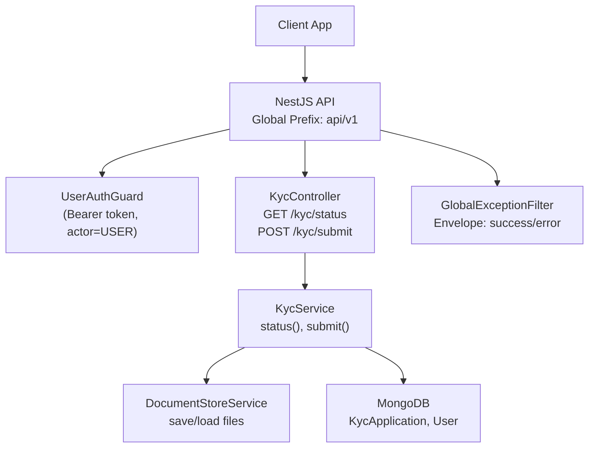
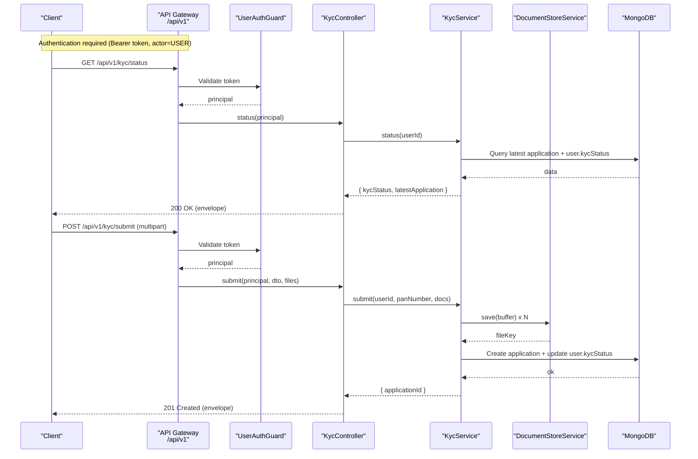
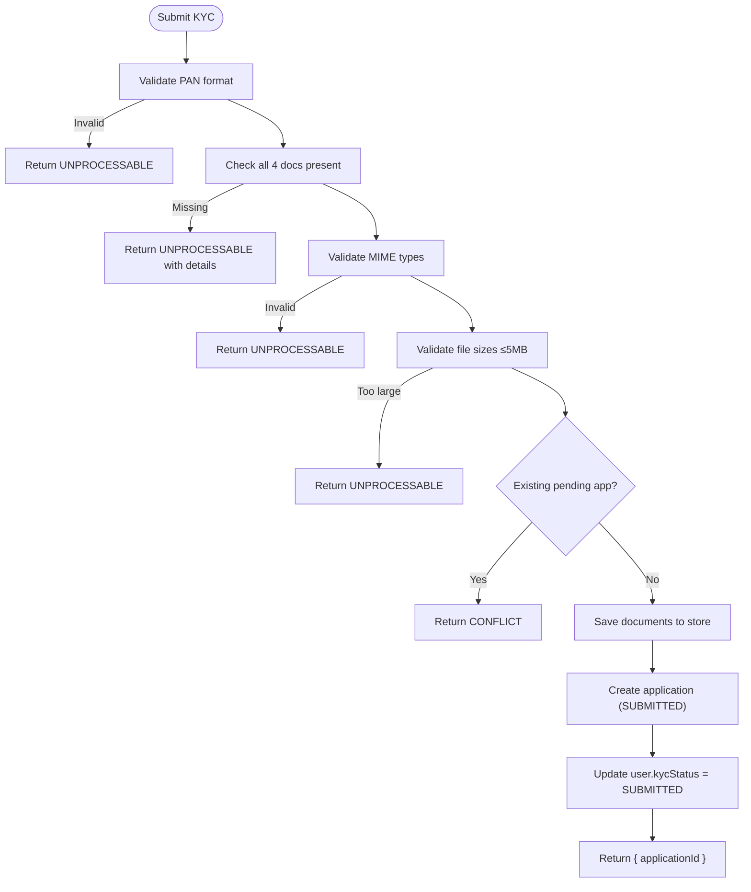
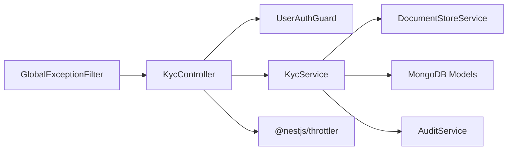

# User KYC APIs

<cite>
**Referenced Files in This Document**
- [kyc.controller.ts](file://backend/apps/api/src/modules/kyc/presentation/kyc.controller.ts)
- [kyc.dtos.ts](file://backend/apps/api/src/modules/kyc/presentation/dto/kyc.dtos.ts)
- [kyc.service.ts](file://backend/apps/api/src/modules/kyc/application/kyc.service.ts)
- [kyc-state.ts](file://backend/apps/api/src/modules/kyc/domain/kyc-state.ts)
- [jwt-auth.guard.ts](file://backend/apps/api/src/modules/auth/presentation/jwt-auth.guard.ts)
- [auth.types.ts](file://backend/apps/api/src/modules/auth/domain/auth.types.ts)
- [api-envelope.ts](file://backend/libs/shared/src/http/api-envelope.ts)
- [global-exception.filter.ts](file://backend/libs/shared/src/http/global-exception.filter.ts)
- [app-exception.ts](file://backend/libs/shared/src/http/app-exception.ts)
- [main.ts](file://backend/apps/api/src/main.ts)
</cite>

## Table of Contents
1. [Introduction](#introduction)
2. [Project Structure](#project-structure)
3. [Core Components](#core-components)
4. [Architecture Overview](#architecture-overview)
5. [Detailed Component Analysis](#detailed-component-analysis)
6. [Dependency Analysis](#dependency-analysis)
7. [Performance Considerations](#performance-considerations)
8. [Troubleshooting Guide](#troubleshooting-guide)
9. [Conclusion](#conclusion)

## Introduction
This document provides user-facing API documentation for the KYC module endpoints that allow users to check their verification status and submit identity documents for review. It covers authentication, request/response schemas, file upload requirements, validation rules, rate limiting, error handling, and practical workflows.

## Project Structure
The KYC feature is implemented as a NestJS module with clear separation:
- Presentation layer exposes HTTP endpoints under /api/v1/kyc
- Application layer contains business logic (status checks, submission flow)
- Domain layer defines state machine, allowed document types, MIME types, and size limits
- Authentication is enforced via JWT guard for user actors
- Global exception filter normalizes errors into a consistent envelope

**Diagram sources**
- [main.ts:7-22](file://backend/apps/api/src/main.ts#L7-L22)
- [kyc.controller.ts:37-63](file://backend/apps/api/src/modules/kyc/presentation/kyc.controller.ts#L37-L63)
- [kyc.service.ts:45-109](file://backend/apps/api/src/modules/kyc/application/kyc.service.ts#L45-L109)
- [jwt-auth.guard.ts:10-33](file://backend/apps/api/src/modules/auth/presentation/jwt-auth.guard.ts#L10-L33)
- [global-exception.filter.ts:18-68](file://backend/libs/shared/src/http/global-exception.filter.ts#L18-L68)

**Section sources**
- [main.ts:7-22](file://backend/apps/api/src/main.ts#L7-L22)
- [kyc.controller.ts:37-63](file://backend/apps/api/src/modules/kyc/presentation/kyc.controller.ts#L37-L63)

## Core Components
- KycController: Exposes GET /kyc/status and POST /kyc/submit, enforces authentication and throttling, handles multipart uploads.
- KycService: Implements status retrieval and submission workflow including validation, persistence, and document storage.
- Domain constants: Define allowed document types, MIME types, and maximum file size.
- Auth guard: Validates Bearer tokens and ensures actor type is USER.
- Exception filter: Converts domain and HTTP exceptions into a unified envelope.

Key behaviors:
- Status returns user-level kycStatus and latest application details.
- Submission validates PAN format, required documents, MIME types, and size limits; prevents duplicate pending applications; stores documents securely; updates user kycStatus.

**Section sources**
- [kyc.controller.ts:37-63](file://backend/apps/api/src/modules/kyc/presentation/kyc.controller.ts#L37-L63)
- [kyc.service.ts:45-109](file://backend/apps/api/src/modules/kyc/application/kyc.service.ts#L45-L109)
- [kyc-state.ts:30-35](file://backend/apps/api/src/modules/kyc/domain/kyc-state.ts#L30-L35)
- [jwt-auth.guard.ts:10-33](file://backend/apps/api/src/modules/auth/presentation/jwt-auth.guard.ts#L10-L33)
- [global-exception.filter.ts:18-68](file://backend/libs/shared/src/http/global-exception.filter.ts#L18-L68)

## Architecture Overview
The KYC endpoints follow a layered architecture with strict validation and secure storage:

**Diagram sources**
- [main.ts:7-22](file://backend/apps/api/src/main.ts#L7-L22)
- [kyc.controller.ts:42-63](file://backend/apps/api/src/modules/kyc/presentation/kyc.controller.ts#L42-L63)
- [kyc.service.ts:45-109](file://backend/apps/api/src/modules/kyc/application/kyc.service.ts#L45-L109)
- [jwt-auth.guard.ts:10-33](file://backend/apps/api/src/modules/auth/presentation/jwt-auth.guard.ts#L10-L33)

## Detailed Component Analysis

### Endpoint: GET /api/v1/kyc/status
- Purpose: Return current KYC verification state and progress for the authenticated user.
- Authentication: Required. Bearer token with actor=USER.
- Rate Limiting: Not explicitly throttled on this endpoint.
- Response schema:
  - success: true
  - data:
    - kycStatus: one of NOT_SUBMITTED, SUBMITTED, UNDER_REVIEW, APPROVED, REJECTED
    - latestApplication: object or null
      - status: one of SUBMITTED, UNDER_REVIEW, APPROVED, REJECTED
      - rejectionReason: string or null
      - createdAt: timestamp
      - updatedAt: timestamp

Notes:
- The service selects the most recent application by creation time and includes only necessary fields.
- If no application exists, latestApplication is null.

Example response:
{
  "success": true,
  "data": {
    "kycStatus": "SUBMITTED",
    "latestApplication": {
      "status": "UNDER_REVIEW",
      "rejectionReason": null,
      "createdAt": "2024-01-01T00:00:00Z",
      "updatedAt": "2024-01-02T00:00:00Z"
    }
  }
}

**Section sources**
- [kyc.controller.ts:42-45](file://backend/apps/api/src/modules/kyc/presentation/kyc.controller.ts#L42-L45)
- [kyc.service.ts:45-53](file://backend/apps/api/src/modules/kyc/application/kyc.service.ts#L45-L53)
- [auth.types.ts:16-22](file://backend/apps/api/src/modules/auth/domain/auth.types.ts#L16-L22)
- [api-envelope.ts:1-16](file://backend/libs/shared/src/http/api-envelope.ts#L1-L16)

### Endpoint: POST /api/v1/kyc/submit
- Purpose: Submit KYC documents for verification along with PAN number.
- Authentication: Required. Bearer token with actor=USER.
- Rate Limiting: Throttled at 5 requests per 60 seconds with a block duration of 300 seconds when exceeded.
- Content-Type: multipart/form-data
- Form fields:
  - panNumber: string, required, must match PAN format (ABCDE1234F).
  - pan: file, optional, up to 1 file, represents PAN card image/PDF.
  - idProof: file, optional, up to 1 file, represents ID proof image/PDF.
  - addressProof: file, optional, up to 1 file, represents address proof image/PDF.
  - selfie: file, optional, up to 1 file, represents selfie image/PDF.
- File constraints:
  - Allowed MIME types: image/jpeg, image/png, application/pdf
  - Maximum file size: 5 MB per file
  - Total files limit: 4
- Validation rules:
  - PAN format must be valid.
  - All four document types (PAN, ID_PROOF, ADDRESS_PROOF, SELFIE) must be provided; missing ones cause an error with details listing missing types.
  - Each file’s MIME type must be allowed; otherwise rejected.
  - Each file must not exceed 5 MB.
  - Duplicate submissions are prevented if there is an existing application in SUBMITTED or UNDER_REVIEW state.
- Success response:
  - success: true
  - data: { applicationId: string }
- Error scenarios:
  - Missing or invalid bearer token: UNAUTHORIZED
  - Invalid PAN format: UNPROCESSABLE
  - Missing documents: UNPROCESSABLE with details listing missing types
  - Disallowed MIME type: UNPROCESSABLE
  - File too large: UNPROCESSABLE
  - Pending application already exists: CONFLICT
  - User not found or not active: appropriate error code and message

Example request (multipart):
- panNumber: "ABCDE1234F"
- pan: <binary JPEG/PNG/PDF, ≤5MB>
- idProof: <binary JPEG/PNG/PDF, ≤5MB>
- addressProof: <binary JPEG/PNG/PDF, ≤5MB>
- selfie: <binary JPEG/PNG/PDF, ≤5MB>

Example success response:
{
  "success": true,
  "data": {
    "applicationId": "64a1b2c3d4e5f6a7b8c9d0e1"
  }
}

**Section sources**
- [kyc.controller.ts:47-63](file://backend/apps/api/src/modules/kyc/presentation/kyc.controller.ts#L47-L63)
- [kyc.dtos.ts:4-7](file://backend/apps/api/src/modules/kyc/presentation/dto/kyc.dtos.ts#L4-L7)
- [kyc.service.ts:55-109](file://backend/apps/api/src/modules/kyc/application/kyc.service.ts#L55-L109)
- [kyc-state.ts:30-35](file://backend/apps/api/src/modules/kyc/domain/kyc-state.ts#L30-L35)
- [jwt-auth.guard.ts:10-33](file://backend/apps/api/src/modules/auth/presentation/jwt-auth.guard.ts#L10-L33)
- [api-envelope.ts:1-16](file://backend/libs/shared/src/http/api-envelope.ts#L1-L16)

### Request/Response Envelope
All responses conform to a consistent envelope:
- Success:
  - success: true
  - data: T (endpoint-specific payload)
- Failure:
  - success: false
  - error:
    - code: stable machine-readable code
    - message: human-readable message
    - details: optional additional context (e.g., missing document types)

Error mapping examples:
- UNAUTHORIZED: missing or invalid bearer token
- UNPROCESSABLE: validation failures (PAN format, MIME type, size, missing docs)
- CONFLICT: duplicate pending application or already approved
- INTERNAL: unexpected server errors

**Section sources**
- [api-envelope.ts:1-16](file://backend/libs/shared/src/http/api-envelope.ts#L1-L16)
- [global-exception.filter.ts:18-68](file://backend/libs/shared/src/http/global-exception.filter.ts#L18-L68)
- [app-exception.ts:4-18](file://backend/libs/shared/src/http/app-exception.ts#L4-L18)

### Security and Authentication
- All KYC endpoints require a Bearer token with actor=USER.
- Token validation occurs in the guard; invalid or expired tokens result in UNAUTHORIZED.
- Principal sub (user ID) is extracted from the token and used to scope operations.

**Section sources**
- [jwt-auth.guard.ts:10-33](file://backend/apps/api/src/modules/auth/presentation/jwt-auth.guard.ts#L10-L33)
- [auth.types.ts:26-31](file://backend/apps/api/src/modules/auth/domain/auth.types.ts#L26-L31)

### Rate Limiting Policy
- POST /api/v1/kyc/submit is rate-limited:
  - 5 requests per 60 seconds
  - On exceeding limit, client is blocked for 300 seconds
- GET /api/v1/kyc/status has no explicit throttle decorator in the controller.

**Section sources**
- [kyc.controller.ts:47-49](file://backend/apps/api/src/modules/kyc/presentation/kyc.controller.ts#L47-L49)

### Data Flow and State Transitions
- Status endpoint returns user-level kycStatus and latest application details.
- Submission creates a new application with status SUBMITTED and updates user.kycStatus to SUBMITTED.
- Documents are stored via DocumentStoreService and referenced by fileKey.

**Diagram sources**
- [kyc.service.ts:55-109](file://backend/apps/api/src/modules/kyc/application/kyc.service.ts#L55-L109)
- [kyc-state.ts:30-35](file://backend/apps/api/src/modules/kyc/domain/kyc-state.ts#L30-L35)

**Section sources**
- [kyc.service.ts:55-109](file://backend/apps/api/src/modules/kyc/application/kyc.service.ts#L55-L109)

## Dependency Analysis
- KycController depends on:
  - UserAuthGuard for authentication
  - KycService for business logic
  - FileFieldsInterceptor for multipart parsing
  - Throttle decorator for rate limiting
- KycService depends on:
  - MongoDB models for KycApplication and User
  - DocumentStoreService for file storage
  - AuditService for audit logging
  - ConfigService for encryption secret
- Domain constants enforce allowed document types, MIME types, and size limits.
- GlobalExceptionFilter centralizes error formatting and mapping to envelope.

**Diagram sources**
- [kyc.controller.ts:37-63](file://backend/apps/api/src/modules/kyc/presentation/kyc.controller.ts#L37-L63)
- [kyc.service.ts:29-41](file://backend/apps/api/src/modules/kyc/application/kyc.service.ts#L29-L41)
- [global-exception.filter.ts:18-68](file://backend/libs/shared/src/http/global-exception.filter.ts#L18-L68)

**Section sources**
- [kyc.controller.ts:37-63](file://backend/apps/api/src/modules/kyc/presentation/kyc.controller.ts#L37-L63)
- [kyc.service.ts:29-41](file://backend/apps/api/src/modules/kyc/application/kyc.service.ts#L29-L41)

## Performance Considerations
- File uploads are limited to 4 files per request and each file capped at 5 MB to control memory usage.
- Multipart parsing uses FileFieldsInterceptor with explicit field definitions to avoid unnecessary processing.
- Database queries select only necessary fields to reduce payload size.
- Rate limiting protects against abuse and reduces load during peak times.

[No sources needed since this section provides general guidance]

## Troubleshooting Guide
Common issues and resolutions:
- UNAUTHORIZED: Ensure a valid Bearer token with actor=USER is included in Authorization header.
- UNPROCESSABLE:
  - PAN_INVALID: Verify PAN format matches ABCDE1234F.
  - KYC_DOCS_MISSING: Provide all four documents: PAN, ID_PROOF, ADDRESS_PROOF, SELFIE.
  - KYC_DOC_TYPE: Use JPEG, PNG, or PDF only.
  - KYC_DOC_SIZE: Ensure each file is ≤5 MB.
- CONFLICT:
  - KYC_ALREADY_PENDING: Wait until the current application is reviewed before submitting again.
  - KYC_ALREADY_APPROVED: No further submissions allowed once approved.
- INTERNAL: Unexpected server errors; retry after some time and contact support if persistent.

Error envelope structure:
{
  "success": false,
  "error": {
    "code": "UNPROCESSABLE",
    "message": "Validation failed",
    "details": ["Missing documents: ID_PROOF, ADDRESS_PROOF"]
  }
}

**Section sources**
- [global-exception.filter.ts:18-68](file://backend/libs/shared/src/http/global-exception.filter.ts#L18-L68)
- [kyc.service.ts:55-109](file://backend/apps/api/src/modules/kyc/application/kyc.service.ts#L55-L109)
- [kyc.controller.ts:14-25](file://backend/apps/api/src/modules/kyc/presentation/kyc.controller.ts#L14-L25)

## Conclusion
The KYC APIs provide a secure, validated, and rate-limited interface for users to check their verification status and submit identity documents. The system enforces strict input validation, supports multiple document types, and maintains a consistent error envelope for reliable client handling. Follow the documented request formats and constraints to ensure successful submissions and smooth status tracking.