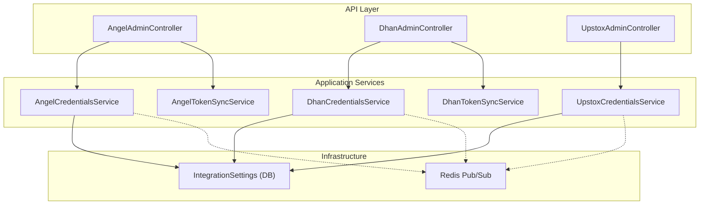
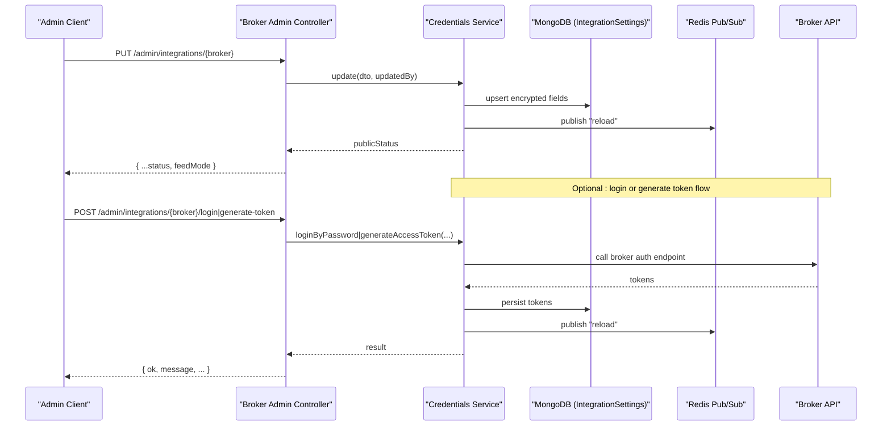
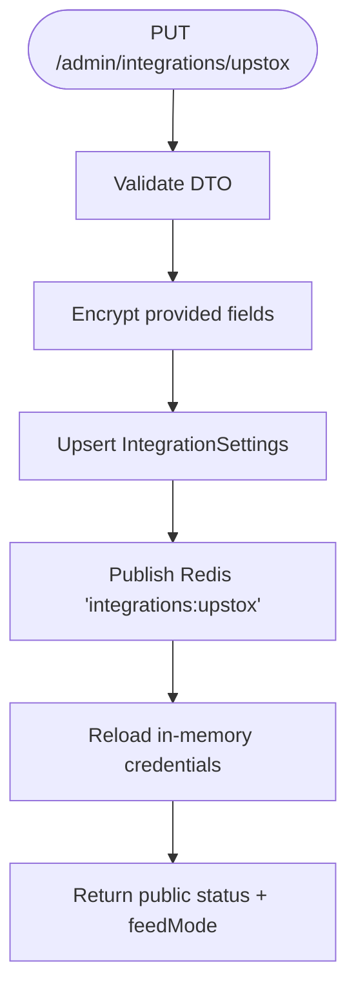
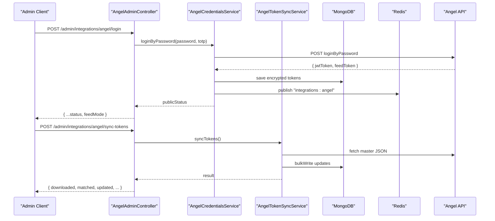
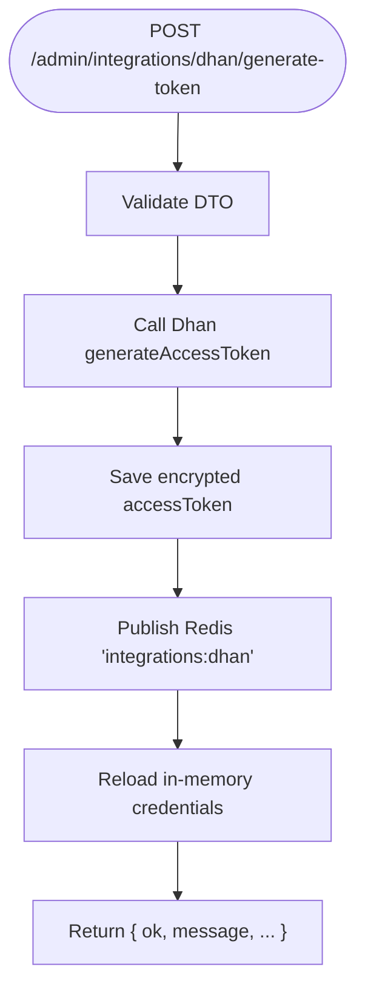
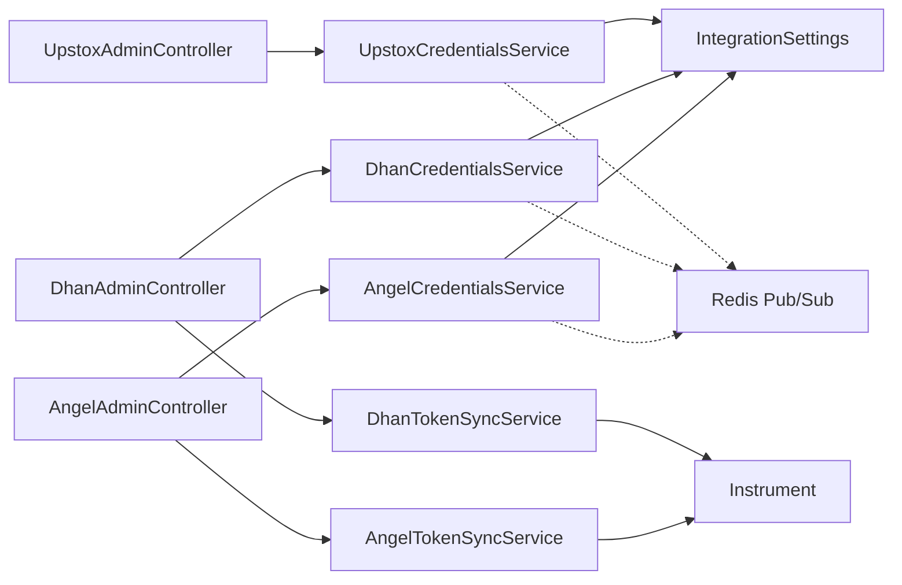

# Broker Integration APIs

<cite>
**Referenced Files in This Document**
- [angel-admin.controller.ts](file://backend/apps/api/src/modules/market/presentation/angel-admin.controller.ts)
- [dhan-admin.controller.ts](file://backend/apps/api/src/modules/market/presentation/dhan-admin.controller.ts)
- [upstox-admin.controller.ts](file://backend/apps/api/src/modules/market/presentation/upstox-admin.controller.ts)
- [angel-credentials.service.ts](file://backend/apps/api/src/modules/market/application/angel-credentials.service.ts)
- [dhan-credentials.service.ts](file://backend/apps/api/src/modules/market/application/dhan-credentials.service.ts)
- [upstox-credentials.service.ts](file://backend/apps/api/src/modules/market/application/upstox-credentials.service.ts)
- [angel-token-sync.service.ts](file://backend/apps/api/src/modules/market/application/angel-token-sync.service.ts)
- [dhan-token-sync.service.ts](file://backend/apps/api/src/modules/market/application/dhan-token-sync.service.ts)
- [integration-settings.schema.ts](file://backend/apps/api/src/modules/market/infrastructure/schemas/integration-settings.schema.ts)
</cite>

## Table of Contents
1. [Introduction](#introduction)
2. [Project Structure](#project-structure)
3. [Core Components](#core-components)
4. [Architecture Overview](#architecture-overview)
5. [Detailed Component Analysis](#detailed-component-analysis)
6. [Dependency Analysis](#dependency-analysis)
7. [Performance Considerations](#performance-considerations)
8. [Troubleshooting Guide](#troubleshooting-guide)
9. [Conclusion](#conclusion)
10. [Appendices](#appendices)

## Introduction
This document provides detailed API documentation for broker integration endpoints that manage credentials and token synchronization for Upstox, Angel One, and Dhan. It covers setup, validation, connection testing, token refresh flows, error handling, request/response schemas, examples, and security considerations for credential storage and access control.

## Project Structure
The broker integrations are implemented under the market module with a clear separation:
- Controllers expose REST endpoints under admin routes for each broker.
- Application services encapsulate credential management, token sync, and provider-specific logic.
- A shared schema stores encrypted secrets and feed mode configuration.

**Diagram sources**
- [angel-admin.controller.ts:56-181](file://backend/apps/api/src/modules/market/presentation/angel-admin.controller.ts#L56-L181)
- [dhan-admin.controller.ts:38-145](file://backend/apps/api/src/modules/market/presentation/dhan-admin.controller.ts#L38-L145)
- [upstox-admin.controller.ts:32-85](file://backend/apps/api/src/modules/market/presentation/upstox-admin.controller.ts#L32-L85)
- [angel-credentials.service.ts:53-305](file://backend/apps/api/src/modules/market/application/angel-credentials.service.ts#L53-L305)
- [dhan-credentials.service.ts:56-282](file://backend/apps/api/src/modules/market/application/dhan-credentials.service.ts#L56-L282)
- [upstox-credentials.service.ts:43-216](file://backend/apps/api/src/modules/market/application/upstox-credentials.service.ts#L43-L216)
- [angel-token-sync.service.ts:47-170](file://backend/apps/api/src/modules/market/application/angel-token-sync.service.ts#L47-L170)
- [dhan-token-sync.service.ts:31-179](file://backend/apps/api/src/modules/market/application/dhan-token-sync.service.ts#L31-L179)
- [integration-settings.schema.ts:9-37](file://backend/apps/api/src/modules/market/infrastructure/schemas/integration-settings.schema.ts#L9-L37)

**Section sources**
- [angel-admin.controller.ts:56-181](file://backend/apps/api/src/modules/market/presentation/angel-admin.controller.ts#L56-L181)
- [dhan-admin.controller.ts:38-145](file://backend/apps/api/src/modules/market/presentation/dhan-admin.controller.ts#L38-L145)
- [upstox-admin.controller.ts:32-85](file://backend/apps/api/src/modules/market/presentation/upstox-admin.controller.ts#L32-L85)
- [integration-settings.schema.ts:9-37](file://backend/apps/api/src/modules/market/infrastructure/schemas/integration-settings.schema.ts#L9-L37)

## Core Components
- Credential services store and serve encrypted secrets per provider, support environment fallbacks, and broadcast changes via Redis to reload runtime state without restarts.
- Token sync services download broker instrument masters and map broker tokens/security IDs onto internal instruments.
- Admin controllers expose protected endpoints for status, updates, login/token generation, connectivity tests, and token sync.

Key responsibilities:
- UpstoxCredentialsService: Manage access token, API key, and secret; test authorization endpoint.
- AngelCredentialsService: Manage API key, client code, JWT token, feed token; login by password; test profile endpoint.
- DhanCredentialsService: Manage client ID and access token; generate access token; test profile endpoint.
- AngelTokenSyncService: Download Angel master JSON and update angelToken and angelExchangeType on instruments.
- DhanTokenSyncService: Download Dhan CSV and update dhanSecurityId and dhanExchangeSegment on instruments.

**Section sources**
- [upstox-credentials.service.ts:43-216](file://backend/apps/api/src/modules/market/application/upstox-credentials.service.ts#L43-L216)
- [angel-credentials.service.ts:53-305](file://backend/apps/api/src/modules/market/application/angel-credentials.service.ts#L53-L305)
- [dhan-credentials.service.ts:56-282](file://backend/apps/api/src/modules/market/application/dhan-credentials.service.ts#L56-L282)
- [angel-token-sync.service.ts:47-170](file://backend/apps/api/src/modules/market/application/angel-token-sync.service.ts#L47-L170)
- [dhan-token-sync.service.ts:31-179](file://backend/apps/api/src/modules/market/application/dhan-token-sync.service.ts#L31-L179)

## Architecture Overview
The system uses a layered architecture:
- Controllers validate input, enforce permissions, and delegate to services.
- Services handle encryption/decryption, persistence, external calls, and change propagation.
- Redis pub/sub triggers live reload across API and engine processes.

**Diagram sources**
- [angel-admin.controller.ts:75-181](file://backend/apps/api/src/modules/market/presentation/angel-admin.controller.ts#L75-L181)
- [dhan-admin.controller.ts:57-145](file://backend/apps/api/src/modules/market/presentation/dhan-admin.controller.ts#L57-L145)
- [upstox-admin.controller.ts:50-85](file://backend/apps/api/src/modules/market/presentation/upstox-admin.controller.ts#L50-L85)
- [angel-credentials.service.ts:139-219](file://backend/apps/api/src/modules/market/application/angel-credentials.service.ts#L139-L219)
- [dhan-credentials.service.ts:124-211](file://backend/apps/api/src/modules/market/application/dhan-credentials.service.ts#L124-L211)
- [upstox-credentials.service.ts:112-162](file://backend/apps/api/src/modules/market/application/upstox-credentials.service.ts#L112-L162)

## Detailed Component Analysis

### Upstox Integration
- Endpoints:
  - GET /admin/integrations/upstox — returns status and feed mode.
  - PUT /admin/integrations/upstox — update accessToken, apiKey, apiSecret (with optional clear flags).
  - POST /admin/integrations/upstox/test — test connection using current access token.
- Request schemas:
  - UpdateUpstoxDto: optional accessToken, apiKey, apiSecret; optional clearAccessToken, clearApiKey, clearApiSecret booleans.
- Response schemas:
  - Status: provider, accessTokenSet, accessTokenPreview, apiKeySet, apiKeyPreview, apiSecretSet, source, updatedAt, updatedBy, feedMode.
  - Test: { ok: boolean; message: string }.
- Behavior:
  - Secrets are stored encrypted in IntegrationSettings; environment variables act as fallback.
  - On update, publishes Redis channel to trigger reload.
  - Test calls Upstox authorize endpoint to validate token.

**Diagram sources**
- [upstox-admin.controller.ts:50-85](file://backend/apps/api/src/modules/market/presentation/upstox-admin.controller.ts#L50-L85)
- [upstox-credentials.service.ts:112-162](file://backend/apps/api/src/modules/market/application/upstox-credentials.service.ts#L112-L162)
- [integration-settings.schema.ts:9-37](file://backend/apps/api/src/modules/market/infrastructure/schemas/integration-settings.schema.ts#L9-L37)

**Section sources**
- [upstox-admin.controller.ts:32-85](file://backend/apps/api/src/modules/market/presentation/upstox-admin.controller.ts#L32-L85)
- [upstox-credentials.service.ts:43-216](file://backend/apps/api/src/modules/market/application/upstox-credentials.service.ts#L43-L216)

### Angel One Integration
- Endpoints:
  - GET /admin/integrations/angel — returns status and feed mode.
  - PUT /admin/integrations/angel — update apiKey, clientCode, jwtToken, feedToken (with optional clear flags).
  - POST /admin/integrations/angel/login — login by password and TOTP; persists jwtToken and feedToken.
  - POST /admin/integrations/angel/test — test connection by fetching profile.
  - POST /admin/integrations/angel/sync-tokens — download Angel master and map tokens to instruments.
- Request schemas:
  - UpdateAngelDto: optional apiKey, clientCode, jwtToken, feedToken; optional clearApiKey, clearJwtToken, clearFeedToken, clearClientCode.
  - AngelLoginDto: required password, totp.
- Response schemas:
  - Status: provider, apiKeySet, apiKeyPreview, clientCode, jwtTokenSet, jwtTokenPreview, feedTokenSet, feedTokenPreview, source, updatedAt, updatedBy, feedMode.
  - Login: same as status after updating tokens.
  - Test: { ok: boolean; message: string }.
  - Sync: downloaded, matched, updated, unmatchedAngel, skippedSegment.
- Behavior:
  - Secrets stored encrypted; environment fallback supported.
  - Login calls Angel login endpoint and saves returned tokens.
  - Test calls Angel profile endpoint to validate JWT.
  - Sync downloads JSON master and updates angelToken and angelExchangeType on enabled instruments.

**Diagram sources**
- [angel-admin.controller.ts:129-181](file://backend/apps/api/src/modules/market/presentation/angel-admin.controller.ts#L129-L181)
- [angel-credentials.service.ts:179-219](file://backend/apps/api/src/modules/market/application/angel-credentials.service.ts#L179-L219)
- [angel-token-sync.service.ts:55-140](file://backend/apps/api/src/modules/market/application/angel-token-sync.service.ts#L55-L140)

**Section sources**
- [angel-admin.controller.ts:56-181](file://backend/apps/api/src/modules/market/presentation/angel-admin.controller.ts#L56-L181)
- [angel-credentials.service.ts:53-305](file://backend/apps/api/src/modules/market/application/angel-credentials.service.ts#L53-L305)
- [angel-token-sync.service.ts:47-170](file://backend/apps/api/src/modules/market/application/angel-token-sync.service.ts#L47-L170)

### Dhan Integration
- Endpoints:
  - GET /admin/integrations/dhan — returns status and feed mode.
  - PUT /admin/integrations/dhan — update clientId, accessToken (with optional clear flags).
  - POST /admin/integrations/dhan/generate-token — generate access token using clientId, pin, totp; persists token.
  - POST /admin/integrations/dhan/test — test connection by fetching profile.
  - POST /admin/integrations/dhan/sync-tokens — download Dhan CSV and map security IDs to instruments.
- Request schemas:
  - UpdateDhanDto: optional clientId, accessToken; optional clearClientId, clearAccessToken.
  - DhanGenerateTokenDto: required clientId, pin, totp.
- Response schemas:
  - Status: provider, clientId, accessTokenSet, accessTokenPreview, source, updatedAt, updatedBy, feedMode.
  - Generate token: { ok: boolean; message: string; accessToken?: string; expiryTime?: string; dhanClientName?: string }.
  - Test: { ok: boolean; message: string }.
  - Sync: downloaded, matched, updated, unmatchedDhan, skippedSegment.
- Behavior:
  - Secrets stored encrypted; environment fallback supported.
  - Generate token calls Dhan auth endpoint and saves returned access token.
  - Test calls Dhan profile endpoint to validate access token.
  - Sync downloads CSV and updates dhanSecurityId and dhanExchangeSegment on enabled instruments.

**Diagram sources**
- [dhan-admin.controller.ts:85-145](file://backend/apps/api/src/modules/market/presentation/dhan-admin.controller.ts#L85-L145)
- [dhan-credentials.service.ts:154-211](file://backend/apps/api/src/modules/market/application/dhan-credentials.service.ts#L154-L211)
- [dhan-token-sync.service.ts:39-147](file://backend/apps/api/src/modules/market/application/dhan-token-sync.service.ts#L39-L147)

**Section sources**
- [dhan-admin.controller.ts:38-145](file://backend/apps/api/src/modules/market/presentation/dhan-admin.controller.ts#L38-L145)
- [dhan-credentials.service.ts:56-282](file://backend/apps/api/src/modules/market/application/dhan-credentials.service.ts#L56-L282)
- [dhan-token-sync.service.ts:31-179](file://backend/apps/api/src/modules/market/application/dhan-token-sync.service.ts#L31-L179)

## Dependency Analysis
- Controllers depend on:
  - Credentials services for state and operations.
  - Token sync services for Angel/Dhan instrument mapping.
  - Market feed mode service for feedMode responses.
  - Audit service for recording changes.
- Services depend on:
  - Mongoose models for IntegrationSettings and Instrument.
  - ConfigService for environment variables and encryption secret.
  - Redis for pub/sub invalidation.
  - External broker APIs for authentication and profile checks.

**Diagram sources**
- [angel-admin.controller.ts:56-181](file://backend/apps/api/src/modules/market/presentation/angel-admin.controller.ts#L56-L181)
- [dhan-admin.controller.ts:38-145](file://backend/apps/api/src/modules/market/presentation/dhan-admin.controller.ts#L38-L145)
- [upstox-admin.controller.ts:32-85](file://backend/apps/api/src/modules/market/presentation/upstox-admin.controller.ts#L32-L85)
- [angel-credentials.service.ts:53-305](file://backend/apps/api/src/modules/market/application/angel-credentials.service.ts#L53-L305)
- [dhan-credentials.service.ts:56-282](file://backend/apps/api/src/modules/market/application/dhan-credentials.service.ts#L56-L282)
- [upstox-credentials.service.ts:43-216](file://backend/apps/api/src/modules/market/application/upstox-credentials.service.ts#L43-L216)
- [angel-token-sync.service.ts:47-170](file://backend/apps/api/src/modules/market/application/angel-token-sync.service.ts#L47-L170)
- [dhan-token-sync.service.ts:31-179](file://backend/apps/api/src/modules/market/application/dhan-token-sync.service.ts#L31-L179)

**Section sources**
- [angel-admin.controller.ts:56-181](file://backend/apps/api/src/modules/market/presentation/angel-admin.controller.ts#L56-L181)
- [dhan-admin.controller.ts:38-145](file://backend/apps/api/src/modules/market/presentation/dhan-admin.controller.ts#L38-L145)
- [upstox-admin.controller.ts:32-85](file://backend/apps/api/src/modules/market/presentation/upstox-admin.controller.ts#L32-L85)

## Performance Considerations
- Bulk writes: Angel and Dhan token sync use batched bulkWrite operations to minimize database round-trips.
- Network calls: External broker calls are made only when necessary (login, generate token, test, sync).
- In-memory caching: Credentials are cached in memory and reloaded via Redis pub/sub to avoid frequent DB reads.
- Filtering: Token sync skips unsupported segments early to reduce processing overhead.

[No sources needed since this section provides general guidance]

## Troubleshooting Guide
Common issues and resolutions:
- Missing credentials: Ensure all required fields are set before login or testing. For Angel, both API key and client code must be configured prior to login.
- Invalid tokens: Use test endpoints to verify tokens. If failures occur, regenerate tokens via login or generate-token flows.
- Network errors: Token sync may fail due to network restrictions; check outbound access to broker endpoints.
- Permission errors: All endpoints require employee authentication and specific permissions; ensure roles include instruments.manage.

Error handling patterns:
- Controllers wrap service calls and throw AppException with appropriate HTTP status codes for validation and gateway errors.
- Services return structured results for token generation and test endpoints, including ok flag and message.

**Section sources**
- [angel-admin.controller.ts:75-181](file://backend/apps/api/src/modules/market/presentation/angel-admin.controller.ts#L75-L181)
- [dhan-admin.controller.ts:57-145](file://backend/apps/api/src/modules/market/presentation/dhan-admin.controller.ts#L57-L145)
- [upstox-admin.controller.ts:50-85](file://backend/apps/api/src/modules/market/presentation/upstox-admin.controller.ts#L50-L85)
- [angel-credentials.service.ts:179-247](file://backend/apps/api/src/modules/market/application/angel-credentials.service.ts#L179-L247)
- [dhan-credentials.service.ts:154-232](file://backend/apps/api/src/modules/market/application/dhan-credentials.service.ts#L154-L232)
- [upstox-credentials.service.ts:147-162](file://backend/apps/api/src/modules/market/application/upstox-credentials.service.ts#L147-L162)

## Conclusion
The broker integration APIs provide secure, auditable, and resilient mechanisms to manage credentials and synchronize tokens for Upstox, Angel One, and Dhan. They leverage encrypted storage, environment fallbacks, Redis-based live reload, and robust error handling to ensure reliable operation. Administrators can configure, test, and monitor integrations through well-defined endpoints with clear request/response schemas.

[No sources needed since this section summarizes without analyzing specific files]

## Appendices

### Security Considerations
- Encryption: Secrets are stored encrypted using AES-GCM with a data encryption secret from configuration. Decryption occurs at runtime within services.
- Access Control: All endpoints are protected by employee authentication and permission guards requiring instruments.manage.
- Audit Logging: Changes to credentials and token sync operations are recorded with actor details and IP addresses.
- Environment Fallback: Environment variables can provide credentials when no DB row exists, but DB takes precedence when present.

**Section sources**
- [integration-settings.schema.ts:9-37](file://backend/apps/api/src/modules/market/infrastructure/schemas/integration-settings.schema.ts#L9-L37)
- [angel-admin.controller.ts:56-181](file://backend/apps/api/src/modules/market/presentation/angel-admin.controller.ts#L56-L181)
- [dhan-admin.controller.ts:38-145](file://backend/apps/api/src/modules/market/presentation/dhan-admin.controller.ts#L38-L145)
- [upstox-admin.controller.ts:32-85](file://backend/apps/api/src/modules/market/presentation/upstox-admin.controller.ts#L32-L85)

### Example Workflows
- Configure Upstox credentials:
  - PUT /admin/integrations/upstox with accessToken, apiKey, apiSecret.
  - Verify status and test connection.
- Authenticate Angel One:
  - PUT /admin/integrations/angel to set apiKey and clientCode.
  - POST /admin/integrations/angel/login with password and totp.
  - Test connection and optionally sync tokens.
- Generate Dhan access token:
  - POST /admin/integrations/dhan/generate-token with clientId, pin, totp.
  - Verify status and test connection; sync tokens if needed.

[No sources needed since this section provides conceptual guidance]