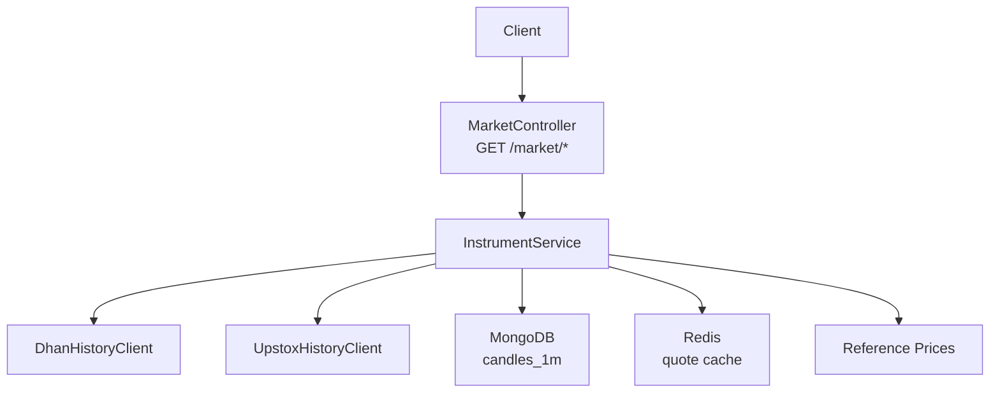
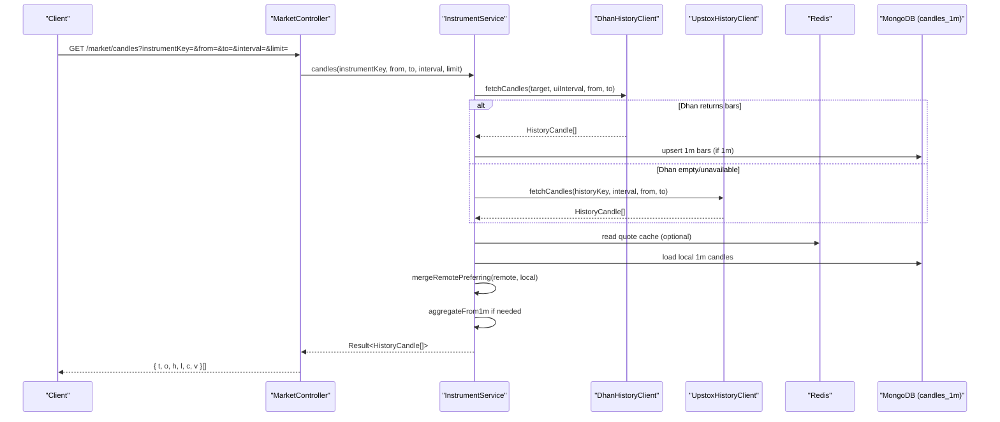
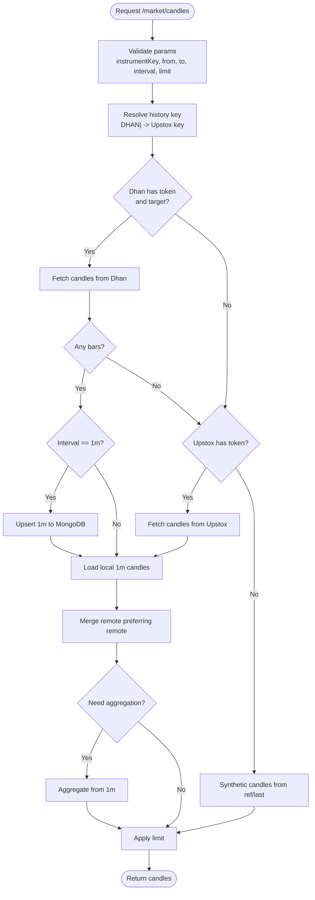
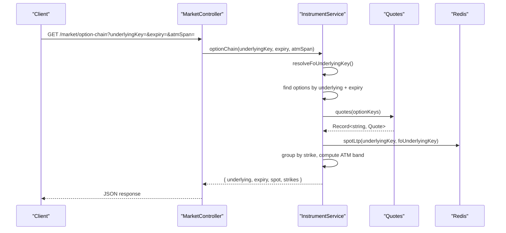
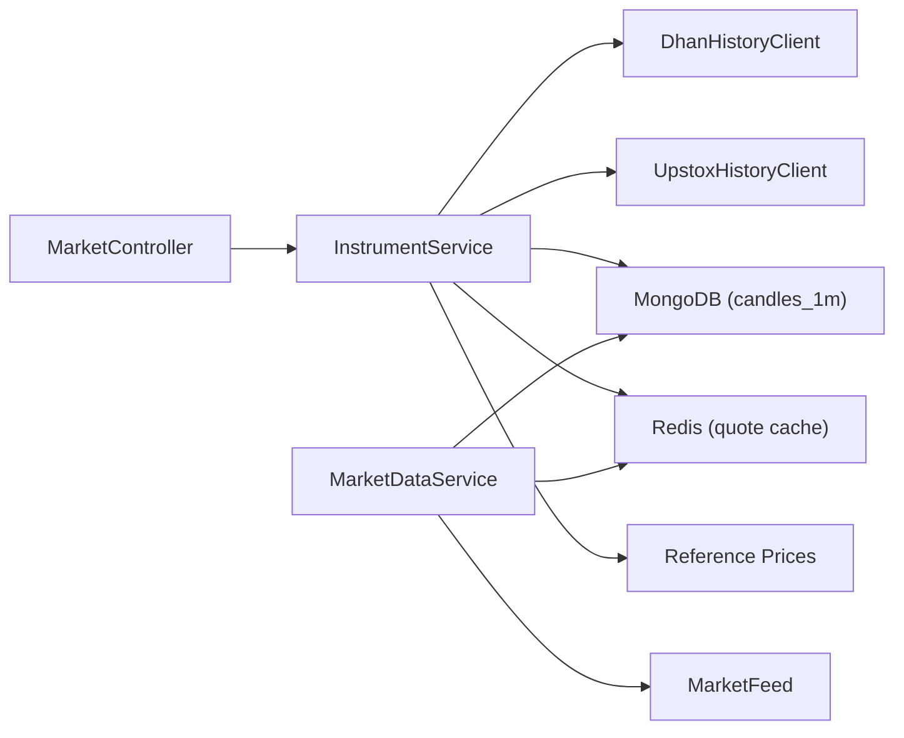

# Historical Data APIs

<cite>
**Referenced Files in This Document**
- [market.controller.ts](file://backend/apps/api/src/modules/market/presentation/market.controller.ts)
- [market.dtos.ts](file://backend/apps/api/src/modules/market/presentation/dto/market.dtos.ts)
- [instrument.service.ts](file://backend/apps/api/src/modules/market/application/instrument.service.ts)
- [candle.schema.ts](file://backend/apps/api/src/modules/market/infrastructure/schemas/candle.schema.ts)
- [upstox-history.client.ts](file://backend/apps/api/src/modules/market/infrastructure/upstox-history.client.ts)
- [dhan-history.client.ts](file://backend/apps/api/src/modules/market/infrastructure/dhan-history.client.ts)
- [option-underlying.ts](file://backend/apps/api/src/modules/market/infrastructure/option-underlying.ts)
- [market.types.ts](file://backend/libs/shared/src/market/market.types.ts)
- [reference-prices.ts](file://backend/libs/shared/src/market/reference-prices.ts)
- [candle-aggregator.ts](file://backend/apps/api/src/modules/market/domain/candle-aggregator.ts)
- [market-data.service.ts](file://backend/apps/api/src/modules/market/application/market-data.service.ts)
</cite>

## Table of Contents
1. [Introduction](#introduction)
2. [Project Structure](#project-structure)
3. [Core Components](#core-components)
4. [Architecture Overview](#architecture-overview)
5. [Detailed Component Analysis](#detailed-component-analysis)
6. [Dependency Analysis](#dependency-analysis)
7. [Performance Considerations](#performance-considerations)
8. [Troubleshooting Guide](#troubleshooting-guide)
9. [Conclusion](#conclusion)

## Introduction
This document provides detailed API documentation for historical market data endpoints exposed by the Market module. It focuses on:
- Candles endpoint for retrieving OHLCV data with time range filtering, interval selection, and limit parameters.
- Option chain endpoint for fetching options data including underlying instrument, expiry dates, and ATM span configuration.
- Request/response schemas for candle data, option chain structures, and date/time parameters.
- Examples for fetching historical price data, retrieving option chains for specific expiries, and querying available expiries for underlying instruments.
- Data granularity options, caching strategies, and performance considerations for large historical datasets.

## Project Structure
The historical data functionality is implemented within the Market module:
- Presentation layer exposes REST endpoints under /market.
- Application layer orchestrates data retrieval from multiple sources (Dhan charts API, Upstox history, local 1m candles).
- Infrastructure layer includes clients to external brokers and MongoDB schema for 1-minute candles.
- Shared types define Quote and Candle contracts used across components.

**Diagram sources**
- [market.controller.ts:21-74](file://backend/apps/api/src/modules/market/presentation/market.controller.ts#L21-L74)
- [instrument.service.ts:190-288](file://backend/apps/api/src/modules/market/application/instrument.service.ts#L190-L288)
- [upstox-history.client.ts:57-92](file://backend/apps/api/src/modules/market/infrastructure/upstox-history.client.ts#L57-L92)
- [dhan-history.client.ts:251-269](file://backend/apps/api/src/modules/market/infrastructure/dhan-history.client.ts#L251-L269)
- [candle.schema.ts:4-21](file://backend/apps/api/src/modules/market/infrastructure/schemas/candle.schema.ts#L4-L21)
- [market.types.ts:5-38](file://backend/libs/shared/src/market/market.types.ts#L5-L38)
- [reference-prices.ts:12-37](file://backend/libs/shared/src/market/reference-prices.ts#L12-L37)

**Section sources**
- [market.controller.ts:21-74](file://backend/apps/api/src/modules/market/presentation/market.controller.ts#L21-L74)
- [instrument.service.ts:190-288](file://backend/apps/api/src/modules/market/application/instrument.service.ts#L190-L288)

## Core Components
- MarketController: Exposes REST endpoints for search, quotes, candles, option-chain, and expiries.
- InstrumentService: Implements business logic for candles and option chain, coordinating broker history, local storage, and reference data.
- UpstoxHistoryClient and DhanHistoryClient: Fetch historical candles from broker APIs and map intervals.
- CandleAggregator and MarketDataService: Build 1-minute OHLCV from live ticks and persist to MongoDB for later aggregation.
- Reference prices: Provide realistic fallback levels when live or historical data is unavailable.

**Section sources**
- [market.controller.ts:21-74](file://backend/apps/api/src/modules/market/presentation/market.controller.ts#L21-L74)
- [instrument.service.ts:190-288](file://backend/apps/api/src/modules/market/application/instrument.service.ts#L190-L288)
- [candle-aggregator.ts:13-52](file://backend/apps/api/src/modules/market/domain/candle-aggregator.ts#L13-L52)
- [market-data.service.ts:103-137](file://backend/apps/api/src/modules/market/application/market-data.service.ts#L103-L137)
- [reference-prices.ts:12-37](file://backend/libs/shared/src/market/reference-prices.ts#L12-L37)

## Architecture Overview
The candles endpoint follows a multi-source strategy:
- Prefer Dhan charts API if configured; otherwise fall back to Upstox historical API.
- Upsert fetched 1-minute candles into MongoDB for persistence.
- Merge remote bars with local 1-minute candles to ensure accuracy.
- Aggregate 1-minute bars to requested interval if needed.
- If no data is available, synthesize flat candles using reference close or last known price.

**Diagram sources**
- [market.controller.ts:61-64](file://backend/apps/api/src/modules/market/presentation/market.controller.ts#L61-L64)
- [instrument.service.ts:190-288](file://backend/apps/api/src/modules/market/application/instrument.service.ts#L190-L288)
- [upstox-history.client.ts:57-92](file://backend/apps/api/src/modules/market/infrastructure/upstox-history.client.ts#L57-L92)
- [dhan-history.client.ts:251-269](file://backend/apps/api/src/modules/market/infrastructure/dhan-history.client.ts#L251-L269)
- [candle.schema.ts:4-21](file://backend/apps/api/src/modules/market/infrastructure/schemas/candle.schema.ts#L4-L21)

## Detailed Component Analysis

### Candles Endpoint
- Route: GET /market/candles
- Query parameters:
  - instrumentKey: string (required)
  - from: number (epoch ms, required)
  - to: number (epoch ms, required)
  - interval: string (optional; defaults to 1minute)
  - limit: number (optional; default 5000; max 10000)
- Response: Array of normalized candles with fields t, o, h, l, c, v.

Supported intervals include:
- 1minute, 5minute, 15minute, 30minute, 60minute, day
- Aliases accepted: 1m, 1min, 5m, 5min, 15m, 15min, 30m, 30min, 1h, 60m, 60min, 1hour, 1d, d

Data flow highlights:
- Dhan charts API preferred when token present and target resolved.
- Upstox historical API used as fallback when Dhan unavailable or empty.
- 1-minute bars are persisted to MongoDB for future aggregation and resilience.
- Local 1-minute bars merged with remote bars to avoid polluted aggregates.
- Aggregation from 1-minute to higher intervals performed server-side.
- Synthetic candles generated from reference close or last known price when no data exists.

**Diagram sources**
- [instrument.service.ts:190-288](file://backend/apps/api/src/modules/market/application/instrument.service.ts#L190-L288)
- [upstox-history.client.ts:57-92](file://backend/apps/api/src/modules/market/infrastructure/upstox-history.client.ts#L57-L92)
- [dhan-history.client.ts:251-269](file://backend/apps/api/src/modules/market/infrastructure/dhan-history.client.ts#L251-L269)
- [candle.schema.ts:4-21](file://backend/apps/api/src/modules/market/infrastructure/schemas/candle.schema.ts#L4-L21)

**Section sources**
- [market.controller.ts:61-64](file://backend/apps/api/src/modules/market/presentation/market.controller.ts#L61-L64)
- [market.dtos.ts:27-33](file://backend/apps/api/src/modules/market/presentation/dto/market.dtos.ts#L27-L33)
- [instrument.service.ts:190-288](file://backend/apps/api/src/modules/market/application/instrument.service.ts#L190-L288)
- [upstox-history.client.ts:155-187](file://backend/apps/api/src/modules/market/infrastructure/upstox-history.client.ts#L155-L187)

### Option Chain Endpoint
- Route: GET /market/option-chain
- Query parameters:
  - underlyingKey: string (required)
  - expiry: string (optional; if omitted, nearest expiry is selected)
  - atmSpan: number (optional; default 20; 0 means return all strikes)
- Response structure:
  - underlying: string (underlying instrument key)
  - expiry: string | null (selected expiry)
  - spot: number | null (spot LTP if available)
  - strikes: array of strike entries with CE and PE legs and LTPs

Behavior:
- Resolves FO underlying key from trader-facing keys.
- Filters options by exchange NSE, enabled status, and type CE/PE.
- Loads quotes for all options and groups by strike.
- Computes ATM index based on spot LTP and slices strikes by atmSpan.

**Diagram sources**
- [market.controller.ts:66-69](file://backend/apps/api/src/modules/market/presentation/market.controller.ts#L66-L69)
- [instrument.service.ts:332-388](file://backend/apps/api/src/modules/market/application/instrument.service.ts#L332-L388)
- [option-underlying.ts:47-69](file://backend/apps/api/src/modules/market/infrastructure/option-underlying.ts#L47-L69)

**Section sources**
- [market.controller.ts:66-69](file://backend/apps/api/src/modules/market/presentation/market.controller.ts#L66-L69)
- [market.dtos.ts:35-40](file://backend/apps/api/src/modules/market/presentation/dto/market.dtos.ts#L35-L40)
- [instrument.service.ts:332-388](file://backend/apps/api/src/modules/market/application/instrument.service.ts#L332-L388)
- [option-underlying.ts:47-69](file://backend/apps/api/src/modules/market/infrastructure/option-underlying.ts#L47-L69)

### Expiries Endpoint
- Route: GET /market/expiries/:underlyingKey
- Path parameter:
  - underlyingKey: string (URL-encoded)
- Response: Array of expiry strings sorted ascending.

Behavior:
- Resolves FO underlying key.
- Queries distinct expiries for options linked to that underlying on NSE and enabled.

**Section sources**
- [market.controller.ts:71-74](file://backend/apps/api/src/modules/market/presentation/market.controller.ts#L71-L74)
- [instrument.service.ts:390-398](file://backend/apps/api/src/modules/market/application/instrument.service.ts#L390-L398)

### Request/Response Schemas

- Candles query parameters:
  - instrumentKey: string
  - from: number (epoch ms)
  - to: number (epoch ms)
  - interval: string (optional; see supported intervals above)
  - limit: number (optional; default 5000; max 10000)

- Candles response items:
  - t: number (epoch ms)
  - o: number (open)
  - h: number (high)
  - l: number (low)
  - c: number (close)
  - v: number (volume)

- Option chain query parameters:
  - underlyingKey: string
  - expiry: string (optional)
  - atmSpan: number (optional; default 20; 0 returns all)

- Option chain response:
  - underlying: string
  - expiry: string | null
  - spot: number | null
  - strikes: array of objects containing strike and CE/PE legs with instrumentKey, symbol, ltp

- Expiries response:
  - Array of strings representing available expiries

**Section sources**
- [market.dtos.ts:27-40](file://backend/apps/api/src/modules/market/presentation/dto/market.dtos.ts#L27-L40)
- [upstox-history.client.ts:28-36](file://backend/apps/api/src/modules/market/infrastructure/upstox-history.client.ts#L28-L36)
- [instrument.service.ts:332-388](file://backend/apps/api/src/modules/market/application/instrument.service.ts#L332-L388)

### Examples

- Fetch historical price data:
  - GET /market/candles?instrumentKey=NSE_EQ%7CINE002A01018&from=1710000000000&to=1710086400000&interval=1day&limit=100
  - Returns an array of daily candles for the specified instrument and date range.

- Retrieve option chains for a specific expiry:
  - GET /market/option-chain?underlyingKey=NSE_INDEX%7CNifty%2050&expiry=2026-01-28&atmSpan=20
  - Returns ATM-centered strikes with CE and PE legs and their LTPs.

- Query available expiries for an underlying:
  - GET /market/expirities/NSE_INDEX%7CNifty%2050
  - Returns sorted list of expiries for the given underlying.

Note: Replace instrumentKey and underlyingKey with actual values from your catalog. URL-encode special characters such as “|” and spaces.

[No sources needed since this section provides usage examples without analyzing specific files]

## Dependency Analysis
- MarketController depends on InstrumentService for business logic and ExchangeCalendarService for status checks.
- InstrumentService depends on:
  - UpstoxHistoryClient for historical data when Dhan unavailable.
  - DhanHistoryClient for chart data when configured.
  - MongoDB model for 1-minute candles.
  - Redis for quote cache and spot LTP lookup.
  - Reference prices for synthetic data generation.
- MarketDataService manages live tick ingestion, 1-minute aggregation, and persistence.

**Diagram sources**
- [market.controller.ts:21-74](file://backend/apps/api/src/modules/market/presentation/market.controller.ts#L21-L74)
- [instrument.service.ts:44-50](file://backend/apps/api/src/modules/market/application/instrument.service.ts#L44-L50)
- [market-data.service.ts:34-41](file://backend/apps/api/src/modules/market/application/market-data.service.ts#L34-L41)
- [market-feed.port.ts:13-22](file://backend/apps/api/src/modules/market/infrastructure/feed/market-feed.port.ts#L13-L22)

**Section sources**
- [instrument.service.ts:44-50](file://backend/apps/api/src/modules/market/application/instrument.service.ts#L44-L50)
- [market-data.service.ts:34-41](file://backend/apps/api/src/modules/market/application/market-data.service.ts#L34-L41)

## Performance Considerations
- Interval selection:
  - Use day or 60minute for long ranges to reduce payload size.
  - For intraday analysis, prefer 5minute or 15minute to balance detail and bandwidth.
- Limit parameter:
  - Keep limit reasonable (default 5000; max 10000) to control response size.
- Caching strategies:
  - Quotes cached in Redis with TTL for fast lookups during option chain and synthetic candle generation.
  - 1-minute candles persisted to MongoDB to support aggregation and resilience.
- Broker fallback:
  - Dhan charts API preferred; Upstox used as fallback to maximize availability.
- Aggregation overhead:
  - Higher intervals may require aggregating 1-minute bars; consider requesting native intervals when possible.
- Large datasets:
  - Use pagination via from/to ranges and appropriate limits.
  - Prefer day-level queries for very long histories.

[No sources needed since this section provides general guidance]

## Troubleshooting Guide
- Not found errors:
  - Ensure instrumentKey exists in the catalog; use /market/search or /market/instruments/:instrumentKey to verify.
- Missing broker tokens:
  - Configure Upstox access token via Admin → Upstox API; otherwise candles may fall back to local or synthetic data.
- Stale feed warnings:
  - During market hours, if no ticks received for threshold seconds, system logs stale feed and attempts resubscribe.
- Invalid intervals:
  - Unknown interval values default to 1minute; use supported aliases listed above.
- Empty responses:
  - Check from/to range validity and instrument availability; synthetic candles may be returned if reference close exists.

**Section sources**
- [market.controller.ts:10-19](file://backend/apps/api/src/modules/market/presentation/market.controller.ts#L10-L19)
- [market-data.service.ts:128-137](file://backend/apps/api/src/modules/market/application/market-data.service.ts#L128-L137)
- [upstox-history.client.ts:63-65](file://backend/apps/api/src/modules/market/infrastructure/upstox-history.client.ts#L63-L65)

## Conclusion
The historical data APIs provide robust access to OHLCV and options data through flexible endpoints. The candles endpoint supports multiple intervals, time range filtering, and limit controls, with intelligent fallbacks and aggregation. The option chain endpoint offers ATM-centric views with configurable spans and dynamic expiry selection. Proper use of intervals, limits, and caching ensures efficient performance even for large historical datasets.

[No sources needed since this section summarizes without analyzing specific files]