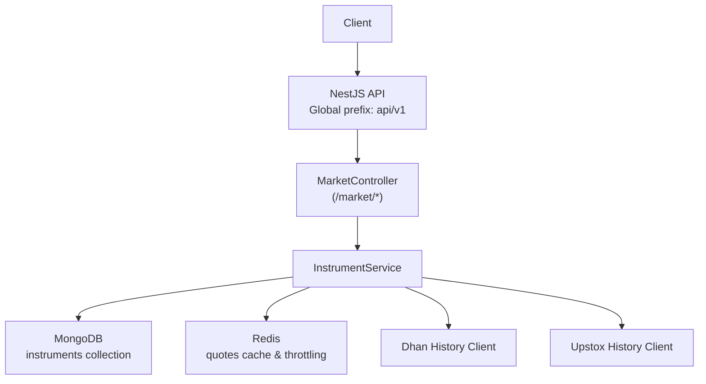
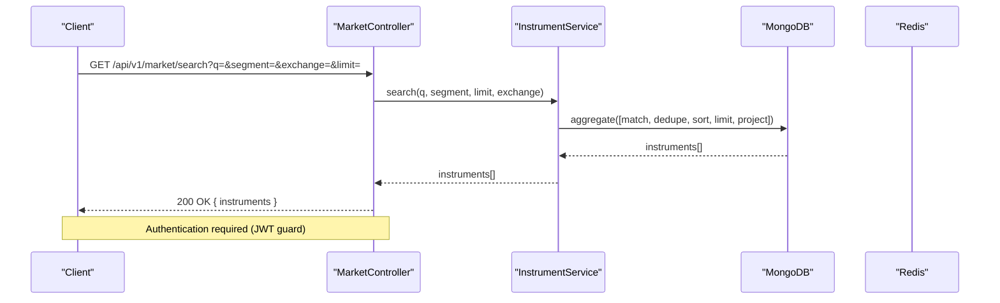
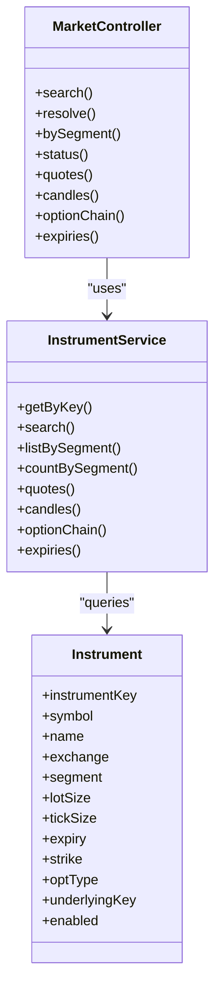

# Instrument Management APIs

<cite>
**Referenced Files in This Document**
- [market.controller.ts](file://backend/apps/api/src/modules/market/presentation/market.controller.ts)
- [market.dtos.ts](file://backend/apps/api/src/modules/market/presentation/dto/market.dtos.ts)
- [instrument.service.ts](file://backend/apps/api/src/modules/market/application/instrument.service.ts)
- [instrument.schema.ts](file://backend/apps/api/src/modules/market/infrastructure/schemas/instrument.schema.ts)
- [catalog-aggregation.ts](file://backend/apps/api/src/modules/market/infrastructure/catalog-aggregation.ts)
- [trader-catalog.ts](file://backend/apps/api/src/modules/market/infrastructure/trader-catalog.ts)
- [redis-throttler.storage.ts](file://backend/libs/shared/src/rate-limit/redis-throttler.storage.ts)
- [main.ts](file://backend/apps/api/src/main.ts)
</cite>

## Table of Contents
1. [Introduction](#introduction)
2. [Project Structure](#project-structure)
3. [Core Components](#core-components)
4. [Architecture Overview](#architecture-overview)
5. [Detailed Component Analysis](#detailed-component-analysis)
6. [Dependency Analysis](#dependency-analysis)
7. [Performance Considerations](#performance-considerations)
8. [Troubleshooting Guide](#troubleshooting-guide)
9. [Conclusion](#conclusion)

## Introduction
This document provides detailed API documentation for instrument management endpoints. It covers:
- Searching instruments by query, segment, and exchange
- Retrieving instruments by key
- Listing instruments by market segment with pagination
- Request/response schemas for search queries, instrument objects, and segment filters
- Examples for searching stocks, fetching instrument details by key, and listing instruments by segment
- Rate limiting behavior, query parameters, and response formatting

The endpoints are exposed under the base path /api/v1/market and require authentication via a JWT guard.

## Project Structure
Instrument management is implemented as a NestJS module with clear separation:
- Presentation layer (controllers) exposes HTTP endpoints
- Application layer (services) implements business logic
- Infrastructure layer (schemas, aggregation helpers) defines data models and MongoDB pipelines
- Shared rate limiting uses Redis-backed throttling

**Diagram sources**
- [main.ts:12-17](file://backend/apps/api/src/main.ts#L12-L17)
- [market.controller.ts:21-45](file://backend/apps/api/src/modules/market/presentation/market.controller.ts#L21-L45)
- [instrument.service.ts:40-50](file://backend/apps/api/src/modules/market/application/instrument.service.ts#L40-L50)

**Section sources**
- [main.ts:12-17](file://backend/apps/api/src/main.ts#L12-L17)
- [market.controller.ts:21-45](file://backend/apps/api/src/modules/market/presentation/market.controller.ts#L21-L45)

## Core Components
- MarketController: Exposes GET endpoints for search, instrument retrieval by key, segment listing, quotes, candles, option chain, expiries, and market status.
- InstrumentService: Implements search, list-by-segment, quotes, candles, option chain, and expiries using MongoDB aggregations and external history clients.
- Data model: Instrument schema defines fields like instrumentKey, symbol, name, exchange, segment, lotSize, tickSize, derivatives fields, and flags.
- Aggregation helpers: Deduplication and sorting stages for catalog browsing and search results.
- Rate limiting: Redis-backed throttler storage used across API instances.

**Section sources**
- [market.controller.ts:21-75](file://backend/apps/api/src/modules/market/presentation/market.controller.ts#L21-L75)
- [instrument.service.ts:52-141](file://backend/apps/api/src/modules/market/application/instrument.service.ts#L52-L141)
- [instrument.schema.ts:9-76](file://backend/apps/api/src/modules/market/infrastructure/schemas/instrument.schema.ts#L9-L76)
- [catalog-aggregation.ts:16-78](file://backend/apps/api/src/modules/market/infrastructure/catalog-aggregation.ts#L16-L78)
- [redis-throttler.storage.ts:7-55](file://backend/libs/shared/src/rate-limit/redis-throttler.storage.ts#L7-L55)

## Architecture Overview
The instrument endpoints follow a layered architecture:
- Controllers validate input DTOs and delegate to services
- Services perform MongoDB aggregations with deduplication and projection
- External history clients provide candle data when available
- Redis caches quotes and supports throttling

**Diagram sources**
- [market.controller.ts:29-32](file://backend/apps/api/src/modules/market/presentation/market.controller.ts#L29-L32)
- [instrument.service.ts:57-122](file://backend/apps/api/src/modules/market/application/instrument.service.ts#L57-L122)
- [catalog-aggregation.ts:44-78](file://backend/apps/api/src/modules/market/infrastructure/catalog-aggregation.ts#L44-L78)

## Detailed Component Analysis

### Search Instruments
Endpoint: GET /api/v1/market/search
- Purpose: Find instruments by query text, optional segment filter, optional exchange filter, and limit.
- Query parameters:
  - q: Optional string (max length 60). Supports prefix matching on symbol/name and full-text search fallback.
  - segment: Optional enum EQ, FO, CUR, INDEX. Filters by market segment.
  - exchange: Optional enum NSE, BSE. Filters by exchange.
  - limit: Optional integer 1–100. Defaults to 50.
- Behavior:
  - If q is empty, returns top instruments for the given segment/exchange with deduplication and projection.
  - If q matches a simple ticker pattern, performs prefix match first, then full-text search if needed.
  - Uses catalog deduplication to prefer Dhan rows within each symbol group.
- Response: Array of instrument objects (see Instrument Object below).

Request examples:
- Search stocks: GET /api/v1/market/search?segment=EQ&limit=20
- Exchange-specific search: GET /api/v1/market/search?q=RELIANCE&exchange=NSE&limit=10
- Segment filter: GET /api/v1/market/search?segment=INDEX&limit=15

Response example:
- 200 OK: [ { instrumentKey, symbol, name, exchange, segment, lotSize, tickSize, ... }, ... ]

Error handling:
- Invalid parameters return validation errors from DTOs.
- No results return an empty array.

**Section sources**
- [market.controller.ts:29-32](file://backend/apps/api/src/modules/market/presentation/market.controller.ts#L29-L32)
- [market.dtos.ts:11-16](file://backend/apps/api/src/modules/market/presentation/dto/market.dtos.ts#L11-L16)
- [instrument.service.ts:57-122](file://backend/apps/api/src/modules/market/application/instrument.service.ts#L57-L122)
- [catalog-aggregation.ts:44-78](file://backend/apps/api/src/modules/market/infrastructure/catalog-aggregation.ts#L44-L78)

### Retrieve Instrument by Key
Endpoint: GET /api/v1/market/instruments/:instrumentKey
- Purpose: Fetch a single instrument by its unique key.
- Path parameter:
  - instrumentKey: URL-encoded instrument key string.
- Behavior:
  - Looks up the instrument in the catalog with enabled and exchange filters.
  - Returns the instrument object or 404 if not found.
- Response: Single instrument object.

Request example:
- GET /api/v1/market/instruments/NSE_EQ%7CRELIANCE

Response example:
- 200 OK: { instrumentKey, symbol, name, exchange, segment, lotSize, tickSize, ... }
- 404 Not Found: { code: "NOT_FOUND", message: "Instrument not found" }

**Section sources**
- [market.controller.ts:34-40](file://backend/apps/api/src/modules/market/presentation/market.controller.ts#L34-L40)
- [instrument.service.ts:52-55](file://backend/apps/api/src/modules/market/application/instrument.service.ts#L52-L55)

### List Instruments by Segment (Pagination)
Endpoint: GET /api/v1/market/segment/:segment
- Purpose: Browse instruments within a segment with pagination.
- Path parameter:
  - segment: One of EQ, FO, CUR, INDEX.
- Query parameters:
  - limit: Optional integer 1–500. Defaults to 100.
  - offset: Optional integer >= 0, max 500,000. Defaults to 0.
- Behavior:
  - Applies segment match, deduplication, and catalog browse sorting.
  - Skips and limits results for pagination.
- Response: Array of instrument objects.

Request examples:
- GET /api/v1/market/segment/EQ?limit=50&offset=0
- GET /api/v1/market/segment/FO?limit=100&offset=200

Response example:
- 200 OK: [ { instrumentKey, symbol, name, exchange, segment, lotSize, tickSize, ... }, ... ]

Notes:
- For EQ, derivative markers are excluded to show pure stocks.

**Section sources**
- [market.controller.ts:42-45](file://backend/apps/api/src/modules/market/presentation/market.controller.ts#L42-L45)
- [market.dtos.ts:18-21](file://backend/apps/api/src/modules/market/presentation/dto/market.dtos.ts#L18-L21)
- [instrument.service.ts:129-141](file://backend/apps/api/src/modules/market/application/instrument.service.ts#L129-L141)
- [catalog-aggregation.ts:16-23](file://backend/apps/api/src/modules/market/infrastructure/catalog-aggregation.ts#L16-L23)

### Instrument Object Schema
Fields returned by search and segment endpoints:
- instrumentKey: string — Unique identifier for the instrument
- symbol: string — Trading symbol
- name: string — Full name
- exchange: string — Exchange code (e.g., NSE, BSE)
- segment: string — Market segment (EQ, FO, CUR, INDEX)
- lotSize: number — Minimum trade quantity
- tickSize: number — Minimum price increment
- expiry: string | null — Expiry date for options/futures
- strike: number | null — Strike price for options
- optType: string | null — Option type (CE, PE)
- underlyingKey: string | null — Underlying instrument key for derivatives

Data source:
- Projection defined in catalog aggregation pipeline.

**Section sources**
- [instrument.schema.ts:9-76](file://backend/apps/api/src/modules/market/infrastructure/schemas/instrument.schema.ts#L9-L76)
- [catalog-aggregation.ts:65-78](file://backend/apps/api/src/modules/market/infrastructure/catalog-aggregation.ts#L65-L78)

### Quotes Endpoint
Endpoint: GET /api/v1/market/quotes?keys=...
- Purpose: Batch retrieve last known prices for multiple instruments.
- Query parameters:
  - keys: Comma-separated instrumentKeys (max 200 after parsing).
- Behavior:
  - Reads from Redis quote cache; falls back to last close quotes if missing or stale.
  - Returns a map of instrumentKey to Quote or null.
- Response: Object mapping instrumentKey to Quote or null.

Request example:
- GET /api/v1/market/keys=NSE_EQ%7CRELIANCE,NSE_EQ%7CTCS

Response example:
- 200 OK: { "NSE_EQ|RELIANCE": { ltp, prevClose, change, changePct, bid, ask, volume, ts }, "NSE_EQ|TCS": null }

**Section sources**
- [market.controller.ts:55-59](file://backend/apps/api/src/modules/market/presentation/market.controller.ts#L55-L59)
- [instrument.service.ts:151-183](file://backend/apps/api/src/modules/market/application/instrument.service.ts#L151-L183)

### Candles Endpoint
Endpoint: GET /api/v1/market/candles?instrumentKey=&from=&to=&interval=&limit=
- Purpose: Retrieve historical candles for charting.
- Query parameters:
  - instrumentKey: Required string
  - from: Required integer timestamp (ms)
  - to: Required integer timestamp (ms)
  - interval: Optional string (e.g., 1minute, day)
  - limit: Optional integer 1–10000
- Behavior:
  - Prefers Dhan history if configured; falls back to Upstox history.
  - Upserts 1-minute bars into local store when fetched.
  - Aggregates 1-minute bars to requested intervals when necessary.
  - Generates synthetic flat candles if no data is available.
- Response: Array of candle objects with time and OHLCV fields.

Request example:
- GET /api/v1/market/candles?instrumentKey=NSE_EQ%7CRELIANCE&from=1710000000000&to=1710086400000&interval=day&limit=30

Response example:
- 200 OK: [ { t, o, h, l, c, v }, ... ]

**Section sources**
- [market.controller.ts:61-64](file://backend/apps/api/src/modules/market/presentation/market.controller.ts#L61-L64)
- [instrument.service.ts:185-288](file://backend/apps/api/src/modules/market/application/instrument.service.ts#L185-L288)

### Option Chain Endpoint
Endpoint: GET /api/v1/market/option-chain?underlyingKey=&expiry=&atmSpan=
- Purpose: Build an option chain around ATM for a given underlying and expiry.
- Query parameters:
  - underlyingKey: Required string
  - expiry: Optional string (YYYY-MM-DD)
  - atmSpan: Optional integer 0–200 (default 20; 0 means all strikes)
- Behavior:
  - Resolves underlying key for derivatives and fetches CE/PE options.
  - Computes spot LTP from cached quotes.
  - Optionally narrows strikes around ATM based on atmSpan.
- Response: Object containing underlying, expiry, spot, and strikes with CE/PE legs.

Request example:
- GET /api/v1/market/option-chain?underlyingKey=NSE_INDEX%7CNIFTY&expiry=2024-06-27&atmSpan=10

Response example:
- 200 OK: { underlying, expiry, spot, strikes: [ { strike, ce?, pe? }, ... ] }

**Section sources**
- [market.controller.ts:66-69](file://backend/apps/api/src/modules/market/presentation/market.controller.ts#L66-L69)
- [instrument.service.ts:332-388](file://backend/apps/api/src/modules/market/application/instrument.service.ts#L332-L388)

### Expiries Endpoint
Endpoint: GET /api/v1/market/expiries/:underlyingKey
- Purpose: List available expiries for an underlying’s options.
- Path parameter:
  - underlyingKey: URL-encoded instrument key
- Behavior:
  - Returns sorted distinct expiry dates for enabled options on NSE.
- Response: Array of expiry strings.

Request example:
- GET /api/v1/market/expirities/NSE_INDEX%7CNIFTY

Response example:
- 200 OK: ["2024-06-27", "2024-07-25", ...]

**Section sources**
- [market.controller.ts:71-74](file://backend/apps/api/src/modules/market/presentation/market.controller.ts#L71-L74)
- [instrument.service.ts:390-398](file://backend/apps/api/src/modules/market/application/instrument.service.ts#L390-L398)

### Market Status Endpoint
Endpoint: GET /api/v1/market/status
- Purpose: Check whether specific markets are open.
- Response: Object with boolean flags per segment (e.g., eqOpen, curOpen).

Request example:
- GET /api/v1/market/status

Response example:
- 200 OK: { eqOpen: true, curOpen: false }

**Section sources**
- [market.controller.ts:47-53](file://backend/apps/api/src/modules/market/presentation/market.controller.ts#L47-L53)

## Dependency Analysis
Instrument endpoints depend on:
- MongoDB instruments collection with indexes for segment, symbol, and text search
- Aggregation pipelines for deduplication and sorting
- Redis for quote caching and throttling
- External history clients (Dhan, Upstox) for candles

**Diagram sources**
- [market.controller.ts:21-75](file://backend/apps/api/src/modules/market/presentation/market.controller.ts#L21-L75)
- [instrument.service.ts:40-141](file://backend/apps/api/src/modules/market/application/instrument.service.ts#L40-L141)
- [instrument.schema.ts:9-76](file://backend/apps/api/src/modules/market/infrastructure/schemas/instrument.schema.ts#L9-L76)

**Section sources**
- [market.controller.ts:21-75](file://backend/apps/api/src/modules/market/presentation/market.controller.ts#L21-L75)
- [instrument.service.ts:40-141](file://backend/apps/api/src/modules/market/application/instrument.service.ts#L40-L141)
- [instrument.schema.ts:9-76](file://backend/apps/api/src/modules/market/infrastructure/schemas/instrument.schema.ts#L9-L76)

## Performance Considerations
- Search performance:
  - Prefix matching reduces full-text search usage when possible.
  - Text index fallback ensures robustness even without full-text index.
  - Catalog deduplication avoids duplicate symbols across sources.
- Pagination:
  - Segment listing uses skip/limit with allowDiskUse for large datasets.
- Quotes:
  - Redis cache minimizes database reads; stale simulator quotes are rejected.
- Candles:
  - Prefers broker history; aggregates 1-minute bars locally when needed.
  - Synthetic candles ensure non-empty responses when no history exists.

[No sources needed since this section provides general guidance]

## Troubleshooting Guide
Common issues and resolutions:
- 404 Not Found:
  - Occurs when retrieving an instrument by key that does not exist or is disabled.
  - Verify the instrumentKey and that the instrument is enabled and visible to traders.
- Empty search results:
  - Ensure the query matches symbol/name patterns or use broader terms.
  - Confirm segment and exchange filters are correct.
- Quotes returning null:
  - Indicates missing or stale quotes in Redis; service attempts last close fallback.
  - Check Redis connectivity and quote ingestion pipeline.
- Candles empty:
  - May occur when both Dhan and Upstox history are unavailable; service generates synthetic candles.
  - Verify configuration tokens for history clients and time range validity.

Rate limiting:
- Throttling is implemented with Redis-backed storage to enforce global limits across API instances.
- When blocked, requests receive throttled responses indicating block duration.

**Section sources**
- [market.controller.ts:34-40](file://backend/apps/api/src/modules/market/presentation/market.controller.ts#L34-L40)
- [instrument.service.ts:151-183](file://backend/apps/api/src/modules/market/application/instrument.service.ts#L151-L183)
- [instrument.service.ts:185-288](file://backend/apps/api/src/modules/market/application/instrument.service.ts#L185-L288)
- [redis-throttler.storage.ts:7-55](file://backend/libs/shared/src/rate-limit/redis-throttler.storage.ts#L7-L55)

## Conclusion
The instrument management APIs provide robust search, retrieval, and listing capabilities with strong filtering, deduplication, and pagination. They integrate with external history providers and leverage Redis for caching and throttling. Use the documented endpoints and schemas to build efficient client integrations for stock searches, instrument lookups, and segment browsing.

[No sources needed since this section summarizes without analyzing specific files]