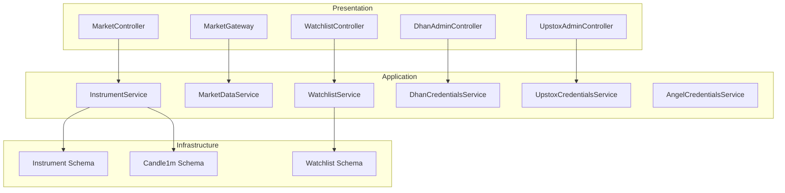
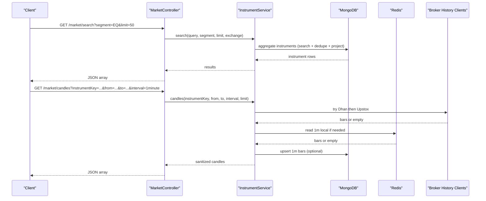
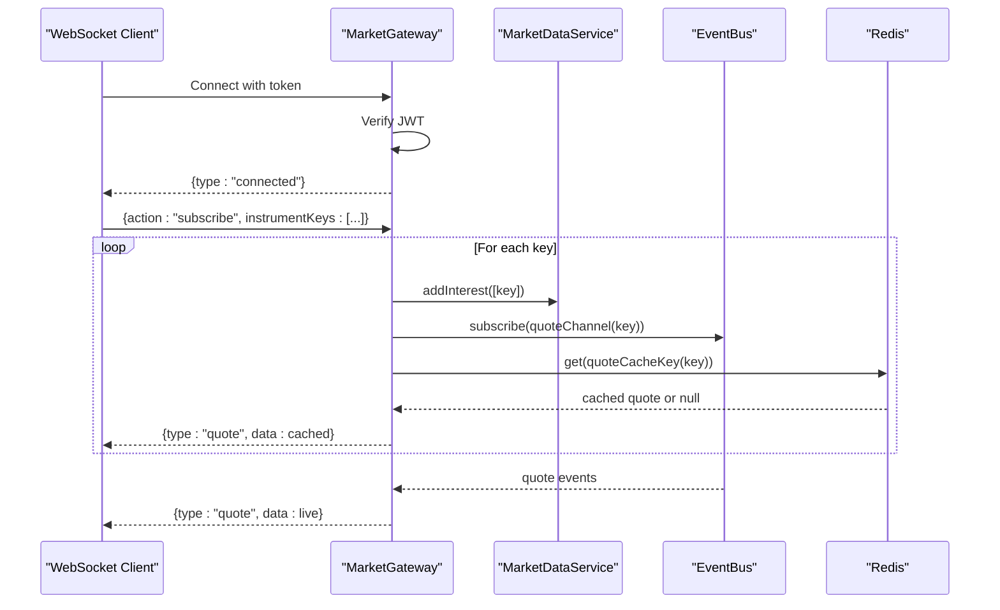
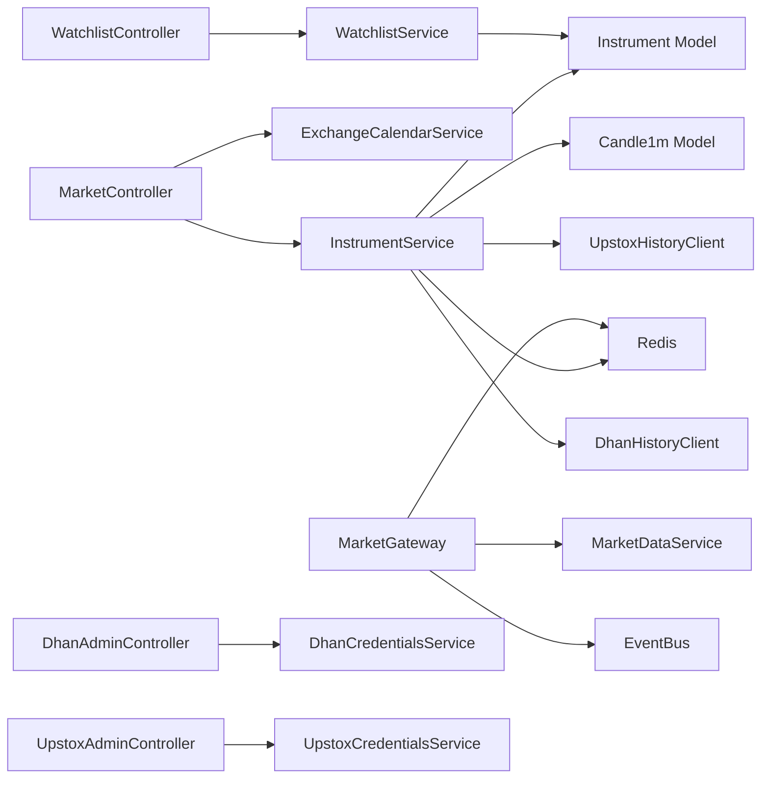

# Market Data APIs

<cite>
**Referenced Files in This Document**
- [market.controller.ts](file://backend/apps/api/src/modules/market/presentation/market.controller.ts)
- [market.gateway.ts](file://backend/apps/api/src/modules/market/presentation/market.gateway.ts)
- [watchlist.controller.ts](file://backend/apps/api/src/modules/market/presentation/watchlist.controller.ts)
- [market.dtos.ts](file://backend/apps/api/src/modules/market/presentation/dto/market.dtos.ts)
- [instrument.service.ts](file://backend/apps/api/src/modules/market/application/instrument.service.ts)
- [market-data.service.ts](file://backend/apps/api/src/modules/market/application/market-data.service.ts)
- [watchlist.service.ts](file://backend/apps/api/src/modules/market/application/watchlist.service.ts)
- [dhan-admin.controller.ts](file://backend/apps/api/src/modules/market/presentation/dhan-admin.controller.ts)
- [upstox-admin.controller.ts](file://backend/apps/api/src/modules/market/presentation/upstox-admin.controller.ts)
- [dhan-credentials.service.ts](file://backend/apps/api/src/modules/market/application/dhan-credentials.service.ts)
- [upstox-credentials.service.ts](file://backend/apps/api/src/modules/market/application/upstox-credentials.service.ts)
- [angel-credentials.service.ts](file://backend/apps/api/src/modules/market/application/angel-credentials.service.ts)
- [instrument.schema.ts](file://backend/apps/api/src/modules/market/infrastructure/schemas/instrument.schema.ts)
- [candle.schema.ts](file://backend/apps/api/src/modules/market/infrastructure/schemas/candle.schema.ts)
- [watchlist.schema.ts](file://backend/apps/api/src/modules/market/infrastructure/schemas/watchlist.schema.ts)
</cite>

## Table of Contents
1. [Introduction](#introduction)
2. [Project Structure](#project-structure)
3. [Core Components](#core-components)
4. [Architecture Overview](#architecture-overview)
5. [Detailed Component Analysis](#detailed-component-analysis)
6. [Dependency Analysis](#dependency-analysis)
7. [Performance Considerations](#performance-considerations)
8. [Troubleshooting Guide](#troubleshooting-guide)
9. [Conclusion](#conclusion)
10. [Appendices](#appendices)

## Introduction
This document provides comprehensive API documentation for market data endpoints, including instrument catalog retrieval, real-time price feeds via WebSocket, historical candle data access, watchlist management, and broker integration configuration. It covers request/response schemas, WebSocket connection patterns, message formats, event types, rate limiting considerations, pagination, filtering, and caching strategies used by the system.

## Project Structure
The market data feature is implemented under the market module with a clear separation:
- Presentation layer exposes REST controllers and a WebSocket gateway.
- Application layer contains services orchestrating business logic (instruments, quotes, candles, watchlists, credentials).
- Infrastructure includes Mongoose schemas and history clients for brokers.

**Diagram sources**
- [market.controller.ts:21-74](file://backend/apps/api/src/modules/market/presentation/market.controller.ts#L21-L74)
- [market.gateway.ts:26-133](file://backend/apps/api/src/modules/market/presentation/market.gateway.ts#L26-L133)
- [watchlist.controller.ts:32-74](file://backend/apps/api/src/modules/market/presentation/watchlist.controller.ts#L32-L74)
- [instrument.service.ts:40-50](file://backend/apps/api/src/modules/market/application/instrument.service.ts#L40-L50)
- [market-data.service.ts:24-41](file://backend/apps/api/src/modules/market/application/market-data.service.ts#L24-L41)
- [watchlist.service.ts:24-31](file://backend/apps/api/src/modules/market/application/watchlist.service.ts#L24-L31)
- [dhan-admin.controller.ts:38-46](file://backend/apps/api/src/modules/market/presentation/dhan-admin.controller.ts#L38-L46)
- [upstox-admin.controller.ts:32-39](file://backend/apps/api/src/modules/market/presentation/upstox-admin.controller.ts#L32-L39)
- [instrument.schema.ts:9-76](file://backend/apps/api/src/modules/market/infrastructure/schemas/instrument.schema.ts#L9-L76)
- [candle.schema.ts:4-22](file://backend/apps/api/src/modules/market/infrastructure/schemas/candle.schema.ts#L4-L22)
- [watchlist.schema.ts:11-31](file://backend/apps/api/src/modules/market/infrastructure/schemas/watchlist.schema.ts#L11-L31)

**Section sources**
- [market.controller.ts:21-74](file://backend/apps/api/src/modules/market/presentation/market.controller.ts#L21-L74)
- [market.gateway.ts:26-133](file://backend/apps/api/src/modules/market/presentation/market.gateway.ts#L26-L133)
- [watchlist.controller.ts:32-74](file://backend/apps/api/src/modules/market/presentation/watchlist.controller.ts#L32-L74)
- [instrument.service.ts:40-50](file://backend/apps/api/src/modules/market/application/instrument.service.ts#L40-L50)
- [market-data.service.ts:24-41](file://backend/apps/api/src/modules/market/application/market-data.service.ts#L24-L41)
- [watchlist.service.ts:24-31](file://backend/apps/api/src/modules/market/application/watchlist.service.ts#L24-L31)
- [dhan-admin.controller.ts:38-46](file://backend/apps/api/src/modules/market/presentation/dhan-admin.controller.ts#L38-L46)
- [upstox-admin.controller.ts:32-39](file://backend/apps/api/src/modules/market/presentation/upstox-admin.controller.ts#L32-L39)
- [instrument.schema.ts:9-76](file://backend/apps/api/src/modules/market/infrastructure/schemas/instrument.schema.ts#L9-L76)
- [candle.schema.ts:4-22](file://backend/apps/api/src/modules/market/infrastructure/schemas/candle.schema.ts#L4-L22)
- [watchlist.schema.ts:11-31](file://backend/apps/api/src/modules/market/infrastructure/schemas/watchlist.schema.ts#L11-L31)

## Core Components
- Instrument catalog and quotes: search, segment listing, instrument detail, quotes, option chain, expiries.
- Historical candles: multi-source fetch (Dhan, Upstox), local 1m aggregation, synthetic fallbacks.
- Real-time streaming: WebSocket gateway with per-instrument rooms, Redis-backed quote cache, on-demand upstream subscription.
- Watchlist management: tabs (built-in and custom), add/remove/reorder items.
- Broker integrations: credential management for Dhan, Upstox, Angel One; status, update, test, token generation/sync.

**Section sources**
- [market.controller.ts:29-74](file://backend/apps/api/src/modules/market/presentation/market.controller.ts#L29-L74)
- [instrument.service.ts:52-398](file://backend/apps/api/src/modules/market/application/instrument.service.ts#L52-L398)
- [market.gateway.ts:48-133](file://backend/apps/api/src/modules/market/presentation/market.gateway.ts#L48-L133)
- [watchlist.controller.ts:37-74](file://backend/apps/api/src/modules/market/presentation/watchlist.controller.ts#L37-L74)
- [dhan-admin.controller.ts:48-143](file://backend/apps/api/src/modules/market/presentation/dhan-admin.controller.ts#L48-L143)
- [upstox-admin.controller.ts:41-83](file://backend/apps/api/src/modules/market/presentation/upstox-admin.controller.ts#L41-L83)

## Architecture Overview
The system uses a layered architecture:
- REST endpoints expose instrument queries, quotes, candles, and watchlist operations.
- A WebSocket gateway streams live quotes to subscribed clients, using Redis as a shared cache and an internal event bus for fan-out.
- Services coordinate data from multiple sources (broker history clients, MongoDB, Redis) and apply sanitization/aggregation.
- Admin endpoints manage broker credentials and feed mode.

**Diagram sources**
- [market.controller.ts:29-64](file://backend/apps/api/src/modules/market/presentation/market.controller.ts#L29-L64)
- [instrument.service.ts:57-127](file://backend/apps/api/src/modules/market/application/instrument.service.ts#L57-L127)
- [instrument.service.ts:190-288](file://backend/apps/api/src/modules/market/application/instrument.service.ts#L190-L288)

## Detailed Component Analysis

### REST: Instrument Catalog and Quotes
Endpoints:
- GET /market/search: Search instruments by query, segment, exchange, with limit.
- GET /market/instruments/:instrumentKey: Resolve a single instrument by key.
- GET /market/segment/:segment: List instruments by segment with pagination.
- GET /market/status: Market open status for segments.
- GET /market/quotes: Batch quotes by comma-separated keys.
- GET /market/expiries/:underlyingKey: Option expiries for an underlying.

Request/Response Schemas:
- SearchQueryDto fields: q (string, optional), segment (EQ|FO|CUR|INDEX, optional), exchange (NSE|BSE, optional), limit (1..100, optional).
- SegmentListQueryDto fields: limit (1..500, optional), offset (0..500000, optional).
- QuotesQueryDto fields: keys (comma-separated instrumentKeys, required).
- Expiries response: array of expiry strings.

Behavior:
- Search supports prefix matching and text index fallback; returns deduplicated results with projection.
- Quotes reads from Redis cache first; falls back to last close quotes when missing or stale.

Rate limits and pagination:
- Search limit capped at 100; segment list limit capped at 500; offset supported.
- Quotes accepts up to 200 keys after trimming.

**Section sources**
- [market.controller.ts:29-59](file://backend/apps/api/src/modules/market/presentation/market.controller.ts#L29-L59)
- [market.dtos.ts:11-25](file://backend/apps/api/src/modules/market/presentation/dto/market.dtos.ts#L11-L25)
- [instrument.service.ts:57-149](file://backend/apps/api/src/modules/market/application/instrument.service.ts#L57-L149)
- [instrument.service.ts:151-183](file://backend/apps/api/src/modules/market/application/instrument.service.ts#L151-L183)

### REST: Historical Candles
Endpoint:
- GET /market/candles: instrumentKey, from, to, interval (e.g., 1minute), optional limit.

Processing flow:
- Prefer Dhan chart target if configured; otherwise fall back to Upstox historical client.
- Upsert 1-minute candles into MongoDB when fetched.
- Aggregate 1-minute bars to requested interval if necessary.
- If no remote/local data, generate synthetic flat candles based on reference prices or last known close.

Response:
- Array of candle objects with timestamp and OHLCV fields, sanitized within requested range and limited.

Edge cases:
- When both broker tokens are missing, service loads local 1m bars and aggregates.
- Synthetic candles ensure UI continuity when no live/historical data is available.

**Section sources**
- [market.controller.ts:61-64](file://backend/apps/api/src/modules/market/presentation/market.controller.ts#L61-L64)
- [market.dtos.ts:27-33](file://backend/apps/api/src/modules/market/presentation/dto/market.dtos.ts#L27-L33)
- [instrument.service.ts:190-288](file://backend/apps/api/src/modules/market/application/instrument.service.ts#L190-L288)
- [instrument.service.ts:291-330](file://backend/apps/api/src/modules/market/application/instrument.service.ts#L291-L330)

### REST: Option Chain
Endpoint:
- GET /market/option-chain: underlyingKey, optional expiry, atmSpan (default 20).

Behavior:
- Resolves FO underlying key mapping.
- Queries options for the underlying and nearest expiry if none provided.
- Builds strike map with CE/PE legs and fetches quotes for each leg.
- Filters strikes around ATM based on spot LTP from cache.

Response:
- Object containing underlying, expiry, spot, and sorted strikes with CE/PE references.

**Section sources**
- [market.controller.ts:66-69](file://backend/apps/api/src/modules/market/presentation/market.controller.ts#L66-L69)
- [market.dtos.ts:35-40](file://backend/apps/api/src/modules/market/presentation/dto/market.dtos.ts#L35-L40)
- [instrument.service.ts:332-388](file://backend/apps/api/src/modules/market/application/instrument.service.ts#L332-L388)

### WebSocket: Real-Time Price Streaming
Connection:
- Endpoint: ws://host/ws?token=<JWT>.
- On connect, server verifies JWT and sends connected event.

Subscription model:
- Client sends JSON messages:
  - { action: "subscribe", instrumentKeys: [...] }
  - { action: "unsubscribe", instrumentKeys: [...] }
- Server maintains per-instrument rooms; first subscriber triggers upstream subscription via MarketDataService; last subscriber unsubscribes upstream.

Events:
- Server sends { type: "quote", data: Quote } for subscribed instruments.
- On join, server immediately sends cached last quote if available.

Interactions:
- Uses Redis to store and retrieve last quotes with TTL.
- Uses internal EventBus to subscribe to per-instrument channels and relay events to sockets.

**Diagram sources**
- [market.gateway.ts:48-133](file://backend/apps/api/src/modules/market/presentation/market.gateway.ts#L48-L133)
- [market-data.service.ts:61-108](file://backend/apps/api/src/modules/market/application/market-data.service.ts#L61-L108)

**Section sources**
- [market.gateway.ts:48-133](file://backend/apps/api/src/modules/market/presentation/market.gateway.ts#L48-L133)
- [market-data.service.ts:61-108](file://backend/apps/api/src/modules/market/application/market-data.service.ts#L61-L108)

### Watchlist Management
Endpoints:
- GET /watchlist: List tabs (built-in and custom).
- POST /watchlist: Create a custom tab (WL1..WL20).
- PUT /watchlist/:tab/name: Rename a custom tab.
- GET /watchlist/:tab: Get items for a tab with instrument metadata.
- POST /watchlist/:tab: Add an instrument to a tab.
- DELETE /watchlist/:tab/:instrumentKey: Remove an instrument from a tab.
- PUT /watchlist/:tab/reorder: Reorder items by orderedKeys.

Schemas:
- CreateWatchlistDto: name (string, length 1..40).
- RenameWatchlistDto: name (string, length 1..40).
- WatchlistParamDto: tab (STOCKS|INDICES|OPTIONS|CURRENCY|WL1..WL20).
- WatchlistItemParamDto: extends tab plus instrumentKey (length 3..120).
- WatchlistItemDto: instrumentKey (length 3..120).
- WatchlistReorderDto: orderedKeys (array of strings, non-empty).

Behavior:
- Built-in tabs return counts from instrument catalog; custom tabs persist user-specific lists.
- Enforces maximum symbols per tab via configuration.
- Validates instrument existence before adding.

**Section sources**
- [watchlist.controller.ts:37-74](file://backend/apps/api/src/modules/market/presentation/watchlist.controller.ts#L37-L74)
- [watchlist.controller.ts:24-30](file://backend/apps/api/src/modules/market/presentation/watchlist.controller.ts#L24-L30)
- [market.dtos.ts:42-56](file://backend/apps/api/src/modules/market/presentation/dto/market.dtos.ts#L42-L56)
- [watchlist.service.ts:33-147](file://backend/apps/api/src/modules/market/application/watchlist.service.ts#L33-L147)

### Broker Integration Endpoints
Admin endpoints:
- Dhan:
  - GET /admin/integrations/dhan: Status including feed mode.
  - PUT /admin/integrations/dhan: Update clientId/access token; supports clearing fields.
  - POST /admin/integrations/dhan/generate-token: Generate access token using client ID, PIN, TOTP.
  - POST /admin/integrations/dhan/test: Test connection.
  - POST /admin/integrations/dhan/sync-tokens: Sync master data tokens.
- Upstox:
  - GET /admin/integrations/upstox: Status including feed mode.
  - PUT /admin/integrations/upstox: Update accessToken, apiKey, apiSecret; supports clearing fields.
  - POST /admin/integrations/upstox/test: Test connection.

Credential services:
- DhanCredentialsService: Loads DB (encrypted) or environment variables; publishes invalidation channel on updates; supports login flows and profile checks.
- UpstoxCredentialsService: Similar behavior for Upstox tokens and keys; authorize endpoint test.
- AngelCredentialsService: Supports API key, client code, JWT, feed token; login by password flow; profile check.

Security and audit:
- Admin endpoints require employee authentication and permissions.
- Credential updates are audited with actor context and IP.

**Section sources**
- [dhan-admin.controller.ts:48-143](file://backend/apps/api/src/modules/market/presentation/dhan-admin.controller.ts#L48-L143)
- [upstox-admin.controller.ts:41-83](file://backend/apps/api/src/modules/market/presentation/upstox-admin.controller.ts#L41-L83)
- [dhan-credentials.service.ts:56-282](file://backend/apps/api/src/modules/market/application/dhan-credentials.service.ts#L56-L282)
- [upstox-credentials.service.ts:43-216](file://backend/apps/api/src/modules/market/application/upstox-credentials.service.ts#L43-L216)
- [angel-credentials.service.ts:53-305](file://backend/apps/api/src/modules/market/application/angel-credentials.service.ts#L53-L305)

## Dependency Analysis
Key dependencies:
- MarketController depends on InstrumentService and ExchangeCalendarService.
- InstrumentService depends on Mongoose models (Instrument, Candle1m), Redis, and broker history clients (Upstox, Dhan).
- MarketGateway depends on TokenService, Redis, EventBus, and MarketDataService.
- WatchlistController depends on WatchlistService and InstrumentService.
- Admin controllers depend on respective credential services and feed mode service.

**Diagram sources**
- [market.controller.ts:21-27](file://backend/apps/api/src/modules/market/presentation/market.controller.ts#L21-L27)
- [instrument.service.ts:40-50](file://backend/apps/api/src/modules/market/application/instrument.service.ts#L40-L50)
- [market.gateway.ts:37-42](file://backend/apps/api/src/modules/market/presentation/market.gateway.ts#L37-L42)
- [watchlist.controller.ts:32-35](file://backend/apps/api/src/modules/market/presentation/watchlist.controller.ts#L32-L35)
- [dhan-admin.controller.ts:38-46](file://backend/apps/api/src/modules/market/presentation/dhan-admin.controller.ts#L38-L46)
- [upstox-admin.controller.ts:32-39](file://backend/apps/api/src/modules/market/presentation/upstox-admin.controller.ts#L32-L39)

**Section sources**
- [market.controller.ts:21-27](file://backend/apps/api/src/modules/market/presentation/market.controller.ts#L21-L27)
- [instrument.service.ts:40-50](file://backend/apps/api/src/modules/market/application/instrument.service.ts#L40-L50)
- [market.gateway.ts:37-42](file://backend/apps/api/src/modules/market/presentation/market.gateway.ts#L37-L42)
- [watchlist.controller.ts:32-35](file://backend/apps/api/src/modules/market/presentation/watchlist.controller.ts#L32-L35)
- [dhan-admin.controller.ts:38-46](file://backend/apps/api/src/modules/market/presentation/dhan-admin.controller.ts#L38-L46)
- [upstox-admin.controller.ts:32-39](file://backend/apps/api/src/modules/market/presentation/upstox-admin.controller.ts#L32-L39)

## Performance Considerations
- Caching:
  - Quotes are cached in Redis with a 24-hour TTL; stale simulator quotes are rejected against reference closes.
  - 1-minute candles are upserted to MongoDB to support aggregation and fallbacks.
- Aggregation:
  - Non-1-minute intervals are aggregated from 1-minute bars when possible; native intervals from brokers are preferred when available.
- Subscription efficiency:
  - On-demand upstream subscriptions reduce load; interest tracking ensures minimal broker connections.
- Bulk writes:
  - Candle flush uses bulkWrite with unordered operations to improve throughput.
- Pagination and limits:
  - Search and segment listing enforce caps to prevent heavy queries.

[No sources needed since this section provides general guidance]

## Troubleshooting Guide
Common issues and diagnostics:
- Authentication failures on WebSocket:
  - Missing or invalid token in query string leads to error event and connection close.
- Stale feed detection:
  - During market hours, if no ticks are received for tracked keys beyond threshold, the service logs a warning and resubscribes.
- Credential misconfiguration:
  - Admin endpoints return validation errors; test endpoints provide detailed messages from broker responses.
- Instrument not found:
  - REST endpoints return NOT_FOUND for missing instrument keys.

Operational tips:
- Use admin test endpoints to validate broker connectivity.
- Monitor logs for STALE FEED warnings and adjust thresholds as needed.
- Ensure Redis is reachable for quote caching and WebSocket room state.

**Section sources**
- [market.gateway.ts:48-60](file://backend/apps/api/src/modules/market/presentation/market.gateway.ts#L48-L60)
- [market-data.service.ts:128-137](file://backend/apps/api/src/modules/market/application/market-data.service.ts#L128-L137)
- [dhan-admin.controller.ts:116-143](file://backend/apps/api/src/modules/market/presentation/dhan-admin.controller.ts#L116-L143)
- [upstox-admin.controller.ts:79-83](file://backend/apps/api/src/modules/market/presentation/upstox-admin.controller.ts#L79-L83)

## Conclusion
The market data subsystem provides robust REST and WebSocket APIs for instrument discovery, real-time quotes, historical candles, watchlist management, and broker integration administration. It leverages caching, aggregation, and on-demand subscriptions to deliver efficient and reliable market data experiences while maintaining strong security and operational observability.

[No sources needed since this section summarizes without analyzing specific files]

## Appendices

### Request/Response Examples (by path)
- Fetch instruments:
  - GET /market/search?q=RELIANCE&segment=EQ&exchange=NSE&limit=50
  - Response: array of instrument objects with symbol, name, exchange, segment, etc.
- Subscribe to price updates:
  - WebSocket connect: ws://host/ws?token=<JWT>
  - Message: {"action":"subscribe","instrumentKeys":["NSE_EQ|RELIANCE"]}
  - Events: {"type":"quote","data":{...}}
- Manage watchlists:
  - POST /watchlist with body {"name":"My Watchlist"}
  - POST /watchlist/WL1 with body {"instrumentKey":"NSE_EQ|RELIANCE"}
  - GET /watchlist/WL1
  - PUT /watchlist/WL1/reorder with body {"orderedKeys":["NSE_EQ|RELIANCE","NSE_EQ|TCS"]}
- Configure broker integrations:
  - PUT /admin/integrations/upstox with body {"accessToken":"...","apiKey":"...","apiSecret":"..."}
  - POST /admin/integrations/dhan/generate-token with body {"clientId":"...","pin":"...","totp":"..."}

[No sources needed since this section provides conceptual examples]