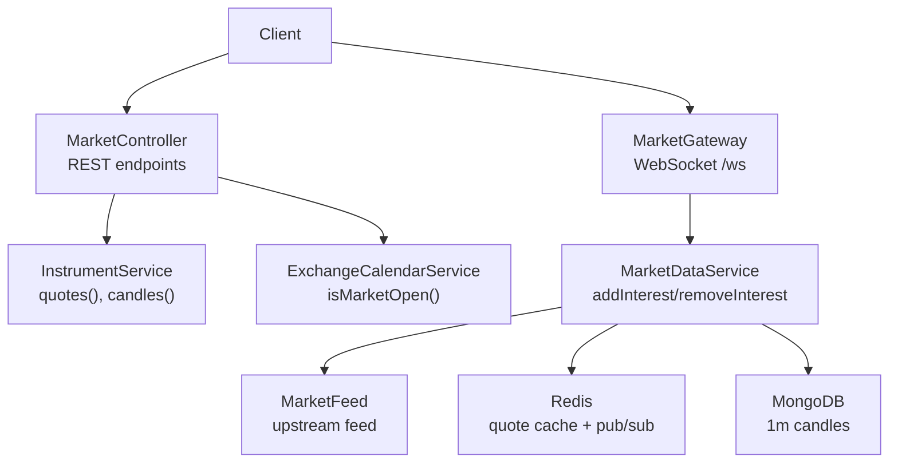
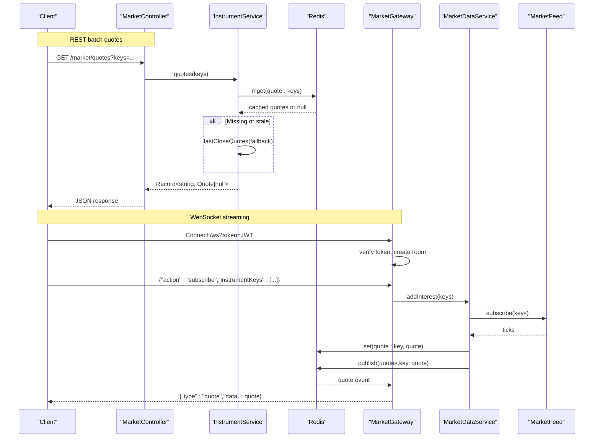
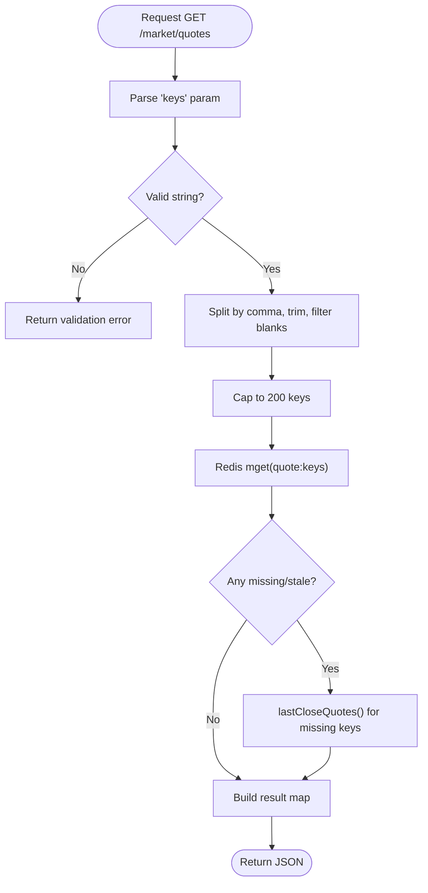
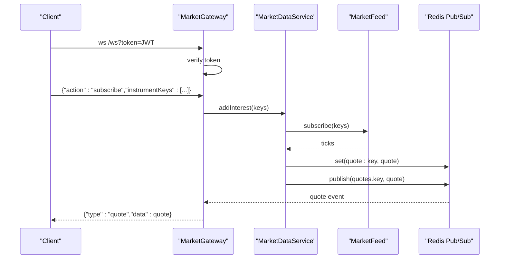
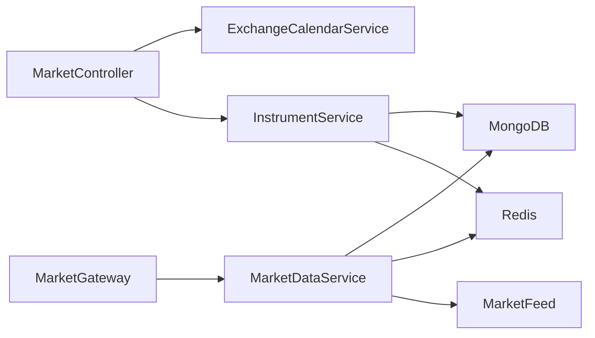

# Real-time Market Data APIs

<cite>
**Referenced Files in This Document**
- [market.controller.ts](file://backend/apps/api/src/modules/market/presentation/market.controller.ts)
- [market.gateway.ts](file://backend/apps/api/src/modules/market/presentation/market.gateway.ts)
- [market-data.service.ts](file://backend/apps/api/src/modules/market/application/market-data.service.ts)
- [instrument.service.ts](file://backend/apps/api/src/modules/market/application/instrument.service.ts)
- [market.dtos.ts](file://backend/apps/api/src/modules/market/presentation/dto/market.dtos.ts)
- [exchange-calendar.service.ts](file://backend/libs/shared/src/calendar/exchange-calendar.service.ts)
- [redis-throttler.storage.ts](file://backend/libs/shared/src/rate-limit/redis-throttler.storage.ts)
- [market.types.ts](file://backend/libs/shared/src/market/market.types.ts)
</cite>

## Table of Contents
1. Introduction
2. Project Structure
3. Core Components
4. Architecture Overview
5. Detailed Component Analysis
6. Dependency Analysis
7. Performance Considerations
8. Troubleshooting Guide
9. Conclusion

## Introduction
This document describes the real-time market data APIs exposed by the platform, focusing on:
- Quotes endpoint for fetching live price data for multiple instruments (batch requests and parameter validation).
- WebSocket connection patterns for real-time price streaming, message formats, and event handling.
- Rate limiting behavior for quote requests and maximum keys per request.
- Data freshness guarantees for quotes and candles.
- Market status endpoint to check exchange open/close times across segments.

The system uses a REST API for batch quotes and historical data, and a WebSocket gateway for live streaming with Redis-backed caching and an event bus for fan-out.

## Project Structure
The market data feature is implemented under the market module with clear separation between presentation (controllers/gateway), application services, shared types, and infrastructure integrations.

**Diagram sources**
- [market.controller.ts:21-75](file://backend/apps/api/src/modules/market/presentation/market.controller.ts#L21-L75)
- [market.gateway.ts:26-133](file://backend/apps/api/src/modules/market/presentation/market.gateway.ts#L26-L133)
- [market-data.service.ts:24-139](file://backend/apps/api/src/modules/market/application/market-data.service.ts#L24-L139)
- [instrument.service.ts:151-183](file://backend/apps/api/src/modules/market/application/instrument.service.ts#L151-L183)
- [exchange-calendar.service.ts:45-50](file://backend/libs/shared/src/calendar/exchange-calendar.service.ts#L45-L50)

**Section sources**
- [market.controller.ts:21-75](file://backend/apps/api/src/modules/market/presentation/market.controller.ts#L21-L75)
- [market.gateway.ts:26-133](file://backend/apps/api/src/modules/market/presentation/market.gateway.ts#L26-L133)
- [market-data.service.ts:24-139](file://backend/apps/api/src/modules/market/application/market-data.service.ts#L24-L139)
- [instrument.service.ts:151-183](file://backend/apps/api/src/modules/market/application/instrument.service.ts#L151-L183)
- [exchange-calendar.service.ts:45-50](file://backend/libs/shared/src/calendar/exchange-calendar.service.ts#L45-L50)

## Core Components
- MarketController: Exposes REST endpoints including GET /market/quotes, GET /market/status, and others. Validates query parameters via DTOs and delegates to services.
- MarketGateway: WebSocket server at /ws that authenticates clients, manages rooms per instrument, subscribes/unsubscribes upstream on demand, and relives quotes from Redis pub/sub.
- MarketDataService: Owns the single MarketFeed instance, writes ticks to Redis, publishes to the event bus, aggregates 1-minute candles, and monitors feed health.
- InstrumentService: Implements batch quotes (Redis mget with fallback to last close), candle retrieval and aggregation, and option chain helpers.
- ExchangeCalendarService: Determines trading days and market windows per segment using configuration and holiday calendar.
- Shared Types: Quote model and Redis key/channel utilities used across components.

**Section sources**
- [market.controller.ts:21-75](file://backend/apps/api/src/modules/market/presentation/market.controller.ts#L21-L75)
- [market.gateway.ts:26-133](file://backend/apps/api/src/modules/market/presentation/market.gateway.ts#L26-L133)
- [market-data.service.ts:24-139](file://backend/apps/api/src/modules/market/application/market-data.service.ts#L24-L139)
- [instrument.service.ts:151-183](file://backend/apps/api/src/modules/market/application/instrument.service.ts#L151-L183)
- [exchange-calendar.service.ts:45-50](file://backend/libs/shared/src/calendar/exchange-calendar.service.ts#L45-L50)
- [market.types.ts:5-16](file://backend/libs/shared/src/market/market.types.ts#L5-L16)

## Architecture Overview
The system separates read paths (REST) from streaming (WebSocket):
- REST quotes: Batch lookup from Redis; if missing, falls back to last known close or reference data.
- Streaming quotes: Clients subscribe to instrument rooms; first client triggers upstream subscription; all clients receive live quotes via Redis pub/sub relay.
- Candles: Prefer broker history (Dhan/Upstox), merge with local 1m candles, aggregate as needed, and sanitize.

**Diagram sources**
- [market.controller.ts:55-59](file://backend/apps/api/src/modules/market/presentation/market.controller.ts#L55-L59)
- [instrument.service.ts:151-183](file://backend/apps/api/src/modules/market/application/instrument.service.ts#L151-L183)
- [market.gateway.ts:48-133](file://backend/apps/api/src/modules/market/presentation/market.gateway.ts#L48-L133)
- [market-data.service.ts:61-108](file://backend/apps/api/src/modules/market/application/market-data.service.ts#L61-L108)
- [market.types.ts:18-28](file://backend/libs/shared/src/market/market.types.ts#L18-L28)

## Detailed Component Analysis

### Quotes Endpoint (GET /market/quotes)
- Purpose: Fetch live or near-live quotes for one or more instruments in a single request.
- Parameters:
  - keys: comma-separated list of instrument keys.
- Validation:
  - keys must be a string with length 1–4000 characters.
  - The controller trims and filters empty entries and caps the number of keys to 200 per request.
- Behavior:
  - Uses Redis mget to retrieve cached quotes for requested keys.
  - For missing or stale simulator quotes, falls back to last known close or reference-based quotes.
  - Returns a map of instrumentKey to Quote or null.

**Diagram sources**
- [market.controller.ts:55-59](file://backend/apps/api/src/modules/market/presentation/market.controller.ts#L55-L59)
- [market.dtos.ts:23-25](file://backend/apps/api/src/modules/market/presentation/dto/market.dtos.ts#L23-L25)
- [instrument.service.ts:151-183](file://backend/apps/api/src/modules/market/application/instrument.service.ts#L151-L183)

**Section sources**
- [market.controller.ts:55-59](file://backend/apps/api/src/modules/market/presentation/market.controller.ts#L55-L59)
- [market.dtos.ts:23-25](file://backend/apps/api/src/modules/market/presentation/dto/market.dtos.ts#L23-L25)
- [instrument.service.ts:151-183](file://backend/apps/api/src/modules/market/application/instrument.service.ts#L151-L183)

### WebSocket Streaming (/ws)
- Authentication: JWT token passed as query parameter; verified before establishing session.
- Message format:
  - Subscribe: {"action":"subscribe","instrumentKeys":["key1","key2",...]}
  - Unsubscribe: {"action":"unsubscribe","instrumentKeys":["key1"]}
  - Max keys per message: 200.
- Event handling:
  - On subscribe: join room, ensure upstream subscription (first client), subscribe to Redis channel, send cached quote if available.
  - On disconnect: leave rooms and drop interest when no clients remain.
  - Relay: incoming quotes from Redis pub/sub are forwarded to all sockets in the room.

**Diagram sources**
- [market.gateway.ts:48-133](file://backend/apps/api/src/modules/market/presentation/market.gateway.ts#L48-L133)
- [market-data.service.ts:61-108](file://backend/apps/api/src/modules/market/application/market-data.service.ts#L61-L108)
- [market.types.ts:18-28](file://backend/libs/shared/src/market/market.types.ts#L18-L28)

**Section sources**
- [market.gateway.ts:48-133](file://backend/apps/api/src/modules/market/presentation/market.gateway.ts#L48-L133)
- [market-data.service.ts:61-108](file://backend/apps/api/src/modules/market/application/market-data.service.ts#L61-L108)

### Market Status Endpoint (GET /market/status)
- Purpose: Check whether markets are open for specific segments.
- Response fields:
  - eqOpen: boolean indicating EQ segment open/closed.
  - curOpen: boolean indicating CUR segment open/closed.
- Logic: Delegates to ExchangeCalendarService.isMarketOpen(segment).

**Section sources**
- [market.controller.ts:47-53](file://backend/apps/api/src/modules/market/presentation/market.controller.ts#L47-L53)
- [exchange-calendar.service.ts:45-50](file://backend/libs/shared/src/calendar/exchange-calendar.service.ts#L45-L50)

### Data Freshness Guarantees
- Quote cache TTL: 24 hours (seconds configured as constant).
- Staleness checks: Simulator quotes outside acceptable range relative to reference close are treated as stale and replaced by fallback logic.
- Feed watchdog: If no ticks received during market hours beyond a threshold, re-subscribes tracked keys to recover from stale feed.

**Section sources**
- [market-data.service.ts:13-18](file://backend/apps/api/src/modules/market/application/market-data.service.ts#L13-L18)
- [market-data.service.ts:128-137](file://backend/apps/api/src/modules/market/application/market-data.service.ts#L128-L137)
- [instrument.service.ts:591-601](file://backend/apps/api/src/modules/market/application/instrument.service.ts#L591-L601)

### Rate Limiting for Quote Requests
- A Redis-backed throttler storage is provided for @nestjs/throttler, enabling shared limits across instances and optional blocking durations.
- While the quotes endpoint does not show explicit rate limit guards in the controller, the presence of this storage indicates the platform supports rate limiting for API endpoints. Configure throttler rules at the application level to enforce per-user or global limits on /market/quotes.

**Section sources**
- [redis-throttler.storage.ts:1-56](file://backend/libs/shared/src/rate-limit/redis-throttler.storage.ts#L1-L56)

## Dependency Analysis

**Diagram sources**
- [market.controller.ts:21-75](file://backend/apps/api/src/modules/market/presentation/market.controller.ts#L21-L75)
- [market.gateway.ts:26-133](file://backend/apps/api/src/modules/market/presentation/market.gateway.ts#L26-L133)
- [market-data.service.ts:24-139](file://backend/apps/api/src/modules/market/application/market-data.service.ts#L24-L139)
- [instrument.service.ts:151-183](file://backend/apps/api/src/modules/market/application/instrument.service.ts#L151-L183)

**Section sources**
- [market.controller.ts:21-75](file://backend/apps/api/src/modules/market/presentation/market.controller.ts#L21-L75)
- [market.gateway.ts:26-133](file://backend/apps/api/src/modules/market/presentation/market.gateway.ts#L26-L133)
- [market-data.service.ts:24-139](file://backend/apps/api/src/modules/market/application/market-data.service.ts#L24-L139)
- [instrument.service.ts:151-183](file://backend/apps/api/src/modules/market/application/instrument.service.ts#L151-L183)

## Performance Considerations
- Batch quotes: Use Redis mget to minimize round-trips; cap keys to 200 to control payload size and processing time.
- Streaming: Room-per-instrument fan-out ensures only interested clients receive quotes; upstream subscriptions are on-demand to avoid subscribing to the entire instrument universe.
- Candle aggregation: Local 1m candles are aggregated on-demand; bulk upserts reduce write overhead.
- Health monitoring: Watchdog detects stale feeds and re-subscribes tracked keys to maintain liveness.

[No sources needed since this section provides general guidance]

## Troubleshooting Guide
- Authentication failures on WebSocket: Ensure a valid JWT token is included in the query string; otherwise, the gateway sends an error and closes the connection.
- No quotes received: Verify that at least one client has subscribed to the instrument so upstream subscription is active; the gateway triggers addInterest only for the first client in a room.
- Stale or missing quotes: The system treats out-of-range simulator quotes as stale and falls back to last known close or reference data; check reference prices and recent candles if values seem incorrect.
- High latency or dropped messages: Confirm Redis connectivity and that the event bus channels are active; monitor feed health logs for stale feed warnings.

**Section sources**
- [market.gateway.ts:48-61](file://backend/apps/api/src/modules/market/presentation/market.gateway.ts#L48-L61)
- [market.gateway.ts:91-123](file://backend/apps/api/src/modules/market/presentation/market.gateway.ts#L91-L123)
- [market-data.service.ts:128-137](file://backend/apps/api/src/modules/market/application/market-data.service.ts#L128-L137)
- [instrument.service.ts:591-601](file://backend/apps/api/src/modules/market/application/instrument.service.ts#L591-L601)

## Conclusion
The platform provides robust real-time market data capabilities:
- A batch quotes endpoint with strict parameter validation and efficient Redis-backed lookups, capped to 200 keys per request.
- A WebSocket streaming layer with per-instrument rooms, on-demand upstream subscriptions, and reliable quote delivery via Redis pub/sub.
- Clear market status endpoints to determine segment availability based on configured trading windows and holidays.
- Built-in safeguards such as quote staleness detection, feed watchdogs, and configurable rate limiting storage to ensure reliability and performance.

[No sources needed since this section summarizes without analyzing specific files]