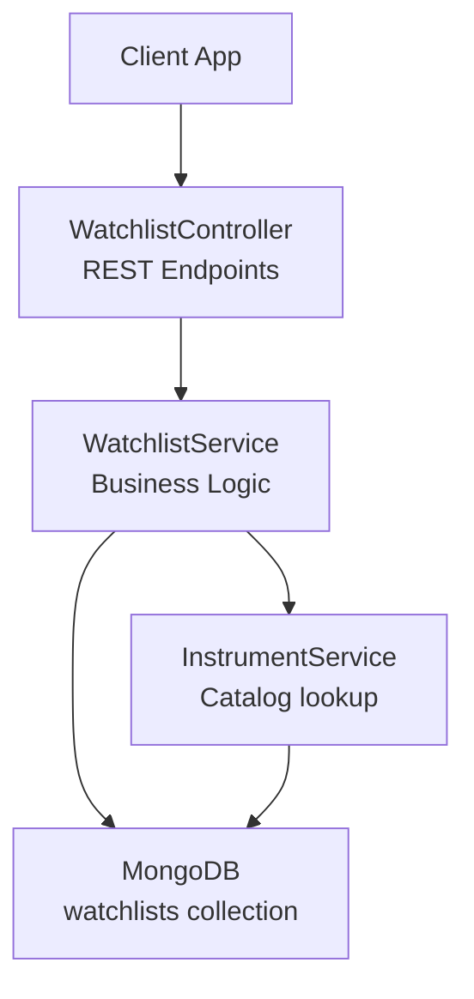
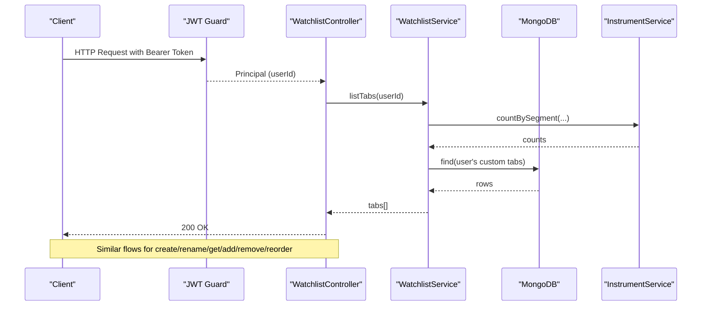
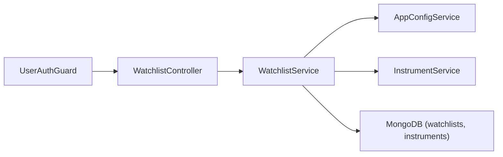

# Watchlist Management APIs

<cite>
**Referenced Files in This Document**
- [watchlist.controller.ts](file://backend/apps/api/src/modules/market/presentation/watchlist.controller.ts)
- [watchlist.service.ts](file://backend/apps/api/src/modules/market/application/watchlist.service.ts)
- [watchlist.schema.ts](file://backend/apps/api/src/modules/market/infrastructure/schemas/watchlist.schema.ts)
- [market.dtos.ts](file://backend/apps/api/src/modules/market/presentation/dto/market.dtos.ts)
- [jwt-auth.guard.ts](file://backend/apps/api/src/modules/auth/presentation/jwt-auth.guard.ts)
- [auth.types.ts](file://backend/apps/api/src/modules/auth/domain/auth.types.ts)
- [config-keys.ts](file://backend/libs/shared/src/config/config-keys.ts)
</cite>

## Table of Contents
1. [Introduction](#introduction)
2. [Project Structure](#project-structure)
3. [Core Components](#core-components)
4. [Architecture Overview](#architecture-overview)
5. [Detailed Component Analysis](#detailed-component-analysis)
6. [Dependency Analysis](#dependency-analysis)
7. [Performance Considerations](#performance-considerations)
8. [Troubleshooting Guide](#troubleshooting-guide)
9. [Conclusion](#conclusion)

## Introduction
This document provides comprehensive API documentation for watchlist management endpoints. It covers CRUD operations for creating, reading, updating, and deleting watchlists, as well as adding/removing instruments from watchlists. It also documents user-specific isolation, default watchlist creation behavior, bulk reordering, request/response schemas, authentication requirements, user context handling, and data persistence patterns.

## Project Structure
The watchlist feature is implemented under the market module with a clear separation of concerns:
- Presentation layer exposes REST endpoints and validates input DTOs.
- Application layer implements business logic, enforces limits, and coordinates persistence.
- Infrastructure layer defines the MongoDB schema for watchlists and instruments.

**Diagram sources**
- [watchlist.controller.ts:32-75](file://backend/apps/api/src/modules/market/presentation/watchlist.controller.ts#L32-L75)
- [watchlist.service.ts:24-148](file://backend/apps/api/src/modules/market/application/watchlist.service.ts#L24-L148)
- [watchlist.schema.ts:11-30](file://backend/apps/api/src/modules/market/infrastructure/schemas/watchlist.schema.ts#L11-L30)

**Section sources**
- [watchlist.controller.ts:32-75](file://backend/apps/api/src/modules/market/presentation/watchlist.controller.ts#L32-L75)
- [watchlist.service.ts:24-148](file://backend/apps/api/src/modules/market/application/watchlist.service.ts#L24-L148)
- [watchlist.schema.ts:11-30](file://backend/apps/api/src/modules/market/infrastructure/schemas/watchlist.schema.ts#L11-L30)

## Core Components
- WatchlistController: Exposes authenticated endpoints for listing tabs, creating/rename tabs, getting tab contents, adding/removing instruments, and reordering items.
- WatchlistService: Implements user-scoped watchlist operations, enforces built-in vs custom tabs, applies configuration limits, and persists changes to MongoDB.
- Watchlist Schema: Defines the persistent structure for watchlists and their items, including unique constraints per user and tab.
- DTOs: Validate inputs for parameters and payloads (tabs, instrument keys, reorder arrays).
- Authentication Guard: Ensures requests carry a valid JWT for users and injects the current principal into controllers.

Key responsibilities:
- User isolation: All operations are scoped by the authenticated user’s ID extracted from the token.
- Built-in tabs: STOCKS, INDICES, OPTIONS, CURRENCY are read-only catalog views; only custom WL1…WL20 can be created/renamed.
- Limits: Configurable maximum symbols per tab via application config.
- Persistence: Uses MongoDB upserts and atomic array updates for efficient add/remove/reorder.

**Section sources**
- [watchlist.controller.ts:32-75](file://backend/apps/api/src/modules/market/presentation/watchlist.controller.ts#L32-L75)
- [watchlist.service.ts:33-148](file://backend/apps/api/src/modules/market/application/watchlist.service.ts#L33-L148)
- [watchlist.schema.ts:11-30](file://backend/apps/api/src/modules/market/infrastructure/schemas/watchlist.schema.ts#L11-L30)
- [market.dtos.ts:42-56](file://backend/apps/api/src/modules/market/presentation/dto/market.dtos.ts#L42-L56)
- [jwt-auth.guard.ts:10-33](file://backend/apps/api/src/modules/auth/presentation/jwt-auth.guard.ts#L10-L33)
- [config-keys.ts:43-47](file://backend/libs/shared/src/config/config-keys.ts#L43-L47)

## Architecture Overview
The watchlist API follows a layered architecture:
- Controllers validate requests using class-validator decorators and delegate to services.
- Services enforce domain rules (user scope, built-in tab restrictions, capacity limits) and coordinate with MongoDB and instrument catalog.
- Data models define schema and indexes ensuring uniqueness and query performance.

**Diagram sources**
- [jwt-auth.guard.ts:15-27](file://backend/apps/api/src/modules/auth/presentation/jwt-auth.guard.ts#L15-L27)
- [watchlist.controller.ts:37-74](file://backend/apps/api/src/modules/market/presentation/watchlist.controller.ts#L37-L74)
- [watchlist.service.ts:33-148](file://backend/apps/api/src/modules/market/application/watchlist.service.ts#L33-L148)

## Detailed Component Analysis

### Authentication and User Context
- All watchlist endpoints are protected by a JWT guard that requires a valid bearer token and ensures the actor type is USER.
- The controller extracts the current principal (userId) from the token and passes it to service methods to ensure user-scoped operations.

Security notes:
- Missing or invalid tokens result in unauthorized responses.
- Only the authenticated user can access or modify their own watchlists.

**Section sources**
- [jwt-auth.guard.ts:15-27](file://backend/apps/api/src/modules/auth/presentation/jwt-auth.guard.ts#L15-L27)
- [auth.types.ts:26-31](file://backend/apps/api/src/modules/auth/domain/auth.types.ts#L26-L31)
- [watchlist.controller.ts:32-39](file://backend/apps/api/src/modules/market/presentation/watchlist.controller.ts#L32-L39)

### Endpoints

#### List Tabs
- Method: GET /watchlist
- Description: Returns available tabs for the current user, including built-in segments with counts and personal custom tabs.
- Response: Array of tab objects with tab identifier, display name, and item count.
- Behavior: Built-in tabs are always included; custom tabs are appended if present.

Request:
- Headers: Authorization: Bearer <token>

Response:
- 200 OK: Array of { tab, name, count }

Errors:
- 401 Unauthorized: Invalid or missing token.

**Section sources**
- [watchlist.controller.ts:37-40](file://backend/apps/api/src/modules/market/presentation/watchlist.controller.ts#L37-L40)
- [watchlist.service.ts:33-51](file://backend/apps/api/src/modules/market/application/watchlist.service.ts#L33-L51)

#### Create Tab
- Method: POST /watchlist
- Description: Creates a new custom watchlist tab (WL1…WL20) for the authenticated user. Automatically assigns an unused WLx tab id.
- Request Body: { name: string }
- Response: { tab: string, name: string }
- Constraints: Name trimmed and capped at 40 characters. Maximum 20 custom lists enforced.

Errors:
- 409 Conflict: WATCHLIST_FULL when all 20 custom tabs are used.
- 401 Unauthorized: Missing or invalid token.

**Section sources**
- [watchlist.controller.ts:42-45](file://backend/apps/api/src/modules/market/presentation/watchlist.controller.ts#L42-L45)
- [watchlist.service.ts:53-73](file://backend/apps/api/src/modules/market/application/watchlist.service.ts#L53-L73)
- [market.dtos.ts:24-30](file://backend/apps/api/src/modules/market/presentation/dto/market.dtos.ts#L24-L30)

#### Rename Tab
- Method: PUT /watchlist/:tab/name
- Description: Renames a custom watchlist tab. Built-in tabs cannot be renamed.
- Path Params: tab (one of allowed tabs)
- Request Body: { name: string }
- Response: true on success.

Errors:
- 404 Not Found: If the custom tab does not exist.
- 400 Bad Request: Attempting to rename a built-in tab.
- 401 Unauthorized: Missing or invalid token.

**Section sources**
- [watchlist.controller.ts:47-54](file://backend/apps/api/src/modules/market/presentation/watchlist.controller.ts#L47-L54)
- [watchlist.service.ts:75-87](file://backend/apps/api/src/modules/market/application/watchlist.service.ts#L75-L87)
- [market.dtos.ts:42-48](file://backend/apps/api/src/modules/market/presentation/dto/market.dtos.ts#L42-L48)

#### Get Tab Items
- Method: GET /watchlist/:tab
- Description: Retrieves the instruments in a specific tab, sorted by order and enriched with instrument metadata.
- Path Params: tab (allowed tabs)
- Response: Array of items where each item includes instrumentKey, sort, and embedded instrument details.

Notes:
- For built-in tabs, returns catalog items matching the segment.
- For custom tabs, returns persisted items with associated instrument info.

**Section sources**
- [watchlist.controller.ts:56-59](file://backend/apps/api/src/modules/market/presentation/watchlist.controller.ts#L56-L59)
- [watchlist.service.ts:89-102](file://backend/apps/api/src/modules/market/application/watchlist.service.ts#L89-L102)

#### Add Instrument
- Method: POST /watchlist/:tab
- Description: Adds an instrument to a tab. Idempotent: duplicates are ignored. Enforces per-tab capacity limit.
- Path Params: tab (allowed tabs)
- Request Body: { instrumentKey: string }
- Response: true on success.

Constraints:
- instrumentKey must exist in the instrument catalog.
- Per-tab max symbols enforced via configuration.

Errors:
- 404 Not Found: Instrument not found.
- 409 Conflict: WATCHLIST_FULL when tab is at capacity.
- 401 Unauthorized: Missing or invalid token.

**Section sources**
- [watchlist.controller.ts:61-64](file://backend/apps/api/src/modules/market/presentation/watchlist.controller.ts#L61-L64)
- [watchlist.service.ts:104-126](file://backend/apps/api/src/modules/market/application/watchlist.service.ts#L104-L126)
- [config-keys.ts:43-47](file://backend/libs/shared/src/config/config-keys.ts#L43-L47)

#### Remove Instrument
- Method: DELETE /watchlist/:tab/:instrumentKey
- Description: Removes an instrument from a tab. Safe to call even if the instrument is not present.
- Path Params: tab (allowed tabs), instrumentKey (URL-encoded)
- Response: true on success.

**Section sources**
- [watchlist.controller.ts:66-69](file://backend/apps/api/src/modules/market/presentation/watchlist.controller.ts#L66-L69)
- [watchlist.service.ts:128-136](file://backend/apps/api/src/modules/market/application/watchlist.service.ts#L128-L136)

#### Reorder Instruments
- Method: PUT /watchlist/:tab/reorder
- Description: Updates the order of instruments within a tab based on provided ordered keys.
- Path Params: tab (allowed tabs)
- Request Body: { orderedKeys: string[] }
- Response: true on success.

Behavior:
- Existing items not listed retain their previous sort values.
- Requires the tab to exist.

Errors:
- 404 Not Found: Tab not found.
- 401 Unauthorized: Missing or invalid token.

**Section sources**
- [watchlist.controller.ts:71-74](file://backend/apps/api/src/modules/market/presentation/watchlist.controller.ts#L71-L74)
- [watchlist.service.ts:138-147](file://backend/apps/api/src/modules/market/application/watchlist.service.ts#L138-L147)
- [market.dtos.ts:54-56](file://backend/apps/api/src/modules/market/presentation/dto/market.dtos.ts#L54-L56)

### Request/Response Schemas

- Tab object:
  - tab: string (built-in: STOCKS, INDICES, OPTIONS, CURRENCY; custom: WL1…WL20)
  - name: string (display name; for built-ins derived from tab)
  - count: number (number of items in the tab)

- Create/Rename body:
  - name: string (length 1–40, trimmed)

- Add instrument body:
  - instrumentKey: string (length 3–120)

- Reorder body:
  - orderedKeys: string[] (non-empty array of instrument keys)

- Get tab response:
  - Array of items:
    - instrumentKey: string
    - sort: number
    - instrument: object with fields such as symbol, name, exchange, segment, lotSize, underlyingKey

- Operation results:
  - Most mutations return true on success.
  - Errors map to standard HTTP status codes via domain error codes.

**Section sources**
- [market.dtos.ts:42-56](file://backend/apps/api/src/modules/market/presentation/dto/market.dtos.ts#L42-L56)
- [watchlist.service.ts:89-102](file://backend/apps/api/src/modules/market/application/watchlist.service.ts#L89-L102)

### Default Watchlist Creation
- The frontend automatically creates a personal “My Watchlist” tab if none exists for the user.
- Server-side, custom tabs are assigned WL1…WL20 identifiers; the first available is chosen.
- Built-in tabs are always available and read-only.

Operational note:
- If no personal tab exists, clients may call POST /watchlist to create one; this is typically handled by the UI.

**Section sources**
- [watchlist.service.ts:53-73](file://backend/apps/api/src/modules/market/application/watchlist.service.ts#L53-L73)
- [market.dtos.ts:4-9](file://backend/apps/api/src/modules/market/presentation/dto/market.dtos.ts#L4-L9)

### Bulk Operations
- There is no dedicated bulk add endpoint. To simulate bulk operations:
  - Call POST /watchlist/:tab multiple times with different instrumentKey values.
  - Each call is idempotent; duplicates are ignored.
- Reorder supports setting the full desired order in one request via PUT /watchlist/:tab/reorder.

**Section sources**
- [watchlist.controller.ts:61-74](file://backend/apps/api/src/modules/market/presentation/watchlist.controller.ts#L61-L74)
- [watchlist.service.ts:104-147](file://backend/apps/api/src/modules/market/application/watchlist.service.ts#L104-L147)

### Data Persistence Patterns
- Watchlist entries are stored in a MongoDB collection named watchlists with a unique index on userId + tab.
- Each entry contains:
  - userId: ObjectId
  - tab: string
  - name: optional string
  - items: array of { instrumentKey, sort }
- Add uses upsert with $push to append items atomically.
- Remove uses $pull to delete items by instrumentKey.
- Reorder reconstructs the items array with updated sort values and saves the document.

Indexes:
- Unique compound index on userId and tab ensures one row per user per tab.

**Section sources**
- [watchlist.schema.ts:11-30](file://backend/apps/api/src/modules/market/infrastructure/schemas/watchlist.schema.ts#L11-L30)
- [watchlist.service.ts:104-147](file://backend/apps/api/src/modules/market/application/watchlist.service.ts#L104-L147)

## Dependency Analysis
Watchlist components depend on:
- Authentication guard for user context extraction.
- Instrument service for catalog lookups and counts.
- Configuration service for limits like max symbols per tab.
- MongoDB via Mongoose models for persistence.

**Diagram sources**
- [jwt-auth.guard.ts:15-27](file://backend/apps/api/src/modules/auth/presentation/jwt-auth.guard.ts#L15-L27)
- [watchlist.controller.ts:32-75](file://backend/apps/api/src/modules/market/presentation/watchlist.controller.ts#L32-L75)
- [watchlist.service.ts:24-31](file://backend/apps/api/src/modules/market/application/watchlist.service.ts#L24-L31)

**Section sources**
- [jwt-auth.guard.ts:15-27](file://backend/apps/api/src/modules/auth/presentation/jwt-auth.guard.ts#L15-L27)
- [watchlist.controller.ts:32-75](file://backend/apps/api/src/modules/market/presentation/watchlist.controller.ts#L32-L75)
- [watchlist.service.ts:24-31](file://backend/apps/api/src/modules/market/application/watchlist.service.ts#L24-L31)

## Performance Considerations
- Efficient queries:
  - listTabs uses parallel calls to count built-in segments and a single query to fetch user’s custom tabs.
  - get enriches items with instrument metadata using a single batched find by instrumentKey.
- Atomic updates:
  - Add and remove use MongoDB array operators ($push, $pull) to minimize contention.
- Capacity checks:
  - Max symbols per tab enforced server-side to prevent oversized lists.
- Index usage:
  - Unique index on userId + tab optimizes lookups and enforces constraints.

[No sources needed since this section provides general guidance]

## Troubleshooting Guide
Common errors and resolutions:
- 401 Unauthorized:
  - Ensure a valid bearer token is sent in the Authorization header.
  - Verify the token has not expired and belongs to a USER actor.
- 404 Not Found:
  - Instrument not found: Confirm the instrumentKey exists in the catalog before adding.
  - Tab not found: Custom tab must exist before reordering; ensure it was created successfully.
- 409 Conflict:
  - WATCHLIST_FULL: You have reached the configured maximum symbols per tab. Reduce items or increase the limit via configuration.
  - Maximum 20 custom lists: Create fewer custom tabs or reuse existing ones.
- Validation errors:
  - Ensure names are between 1 and 40 characters and instrument keys are between 3 and 120 characters.
  - Reorder payload must include a non-empty array of strings.

Operational tips:
- Use GET /watchlist/:tab to inspect current items and sort order before reordering.
- When building bulk adds, handle duplicate responses gracefully since they succeed without side effects.

**Section sources**
- [jwt-auth.guard.ts:15-27](file://backend/apps/api/src/modules/auth/presentation/jwt-auth.guard.ts#L15-L27)
- [watchlist.controller.ts:12-22](file://backend/apps/api/src/modules/market/presentation/watchlist.controller.ts#L12-L22)
- [watchlist.service.ts:53-147](file://backend/apps/api/src/modules/market/application/watchlist.service.ts#L53-L147)
- [market.dtos.ts:42-56](file://backend/apps/api/src/modules/market/presentation/dto/market.dtos.ts#L42-L56)

## Conclusion
The watchlist management APIs provide a robust, user-scoped system for organizing instruments across built-in and custom tabs. They enforce security through JWT-based authentication, maintain data integrity with validated inputs and unique constraints, and support flexible ordering and capacity limits. Clients should leverage the provided endpoints to manage watchlists efficiently while respecting authentication, validation, and configuration constraints.

[No sources needed since this section summarizes without analyzing specific files]