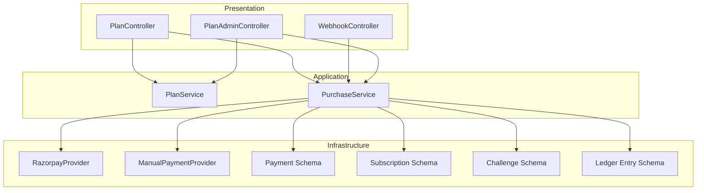
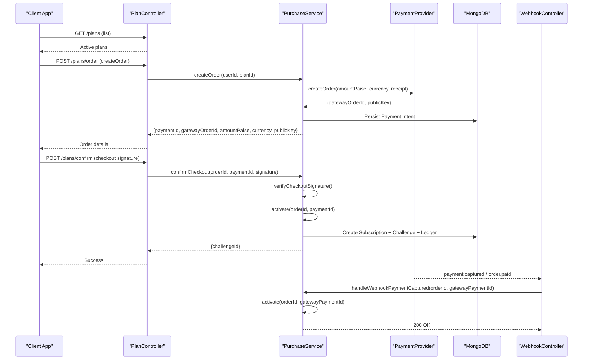
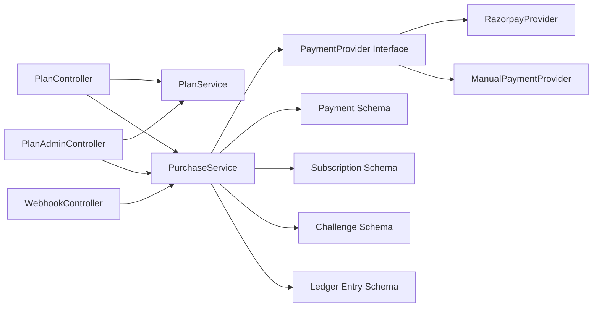

# Payment & Subscription APIs

<cite>
**Referenced Files in This Document**
- [plan.controller.ts](file://backend/apps/api/src/modules/plans/presentation/plan.controller.ts)
- [webhook.controller.ts](file://backend/apps/api/src/modules/plans/presentation/webhook.controller.ts)
- [plan-admin.controller.ts](file://backend/apps/api/src/modules/plans/presentation/plan-admin.controller.ts)
- [plan.service.ts](file://backend/apps/api/src/modules/plans/application/plan.service.ts)
- [purchase.service.ts](file://backend/apps/api/src/modules/plans/application/purchase.service.ts)
- [plan.dtos.ts](file://backend/apps/api/src/modules/plans/presentation/dto/plan.dtos.ts)
- [razorpay.provider.ts](file://backend/apps/api/src/modules/plans/infrastructure/payment/razorpay.provider.ts)
- [manual.provider.ts](file://backend/apps/api/src/modules/plans/infrastructure/payment/manual.provider.ts)
- [payment.port.ts](file://backend/apps/api/src/modules/plans/infrastructure/payment/payment.port.ts)
- [payment.schema.ts](file://backend/apps/api/src/modules/plans/infrastructure/schemas/payment.schema.ts)
- [subscription.schema.ts](file://backend/apps/api/src/modules/plans/infrastructure/schemas/subscription.schema.ts)
- [challenge.schema.ts](file://backend/apps/api/src/modules/plans/infrastructure/schemas/challenge.schema.ts)
- [ledger-entry.schema.ts](file://backend/apps/api/src/modules/plans/infrastructure/schemas/ledger-entry.schema.ts)
- [plan.types.ts](file://backend/apps/api/src/modules/plans/domain/plan.types.ts)
</cite>

## Table of Contents
1. Introduction
2. Project Structure
3. Core Components
4. Architecture Overview
5. Detailed Component Analysis
6. Dependency Analysis
7. Performance Considerations
8. Troubleshooting Guide
9. Conclusion

## Introduction
This document provides comprehensive API documentation for payment and subscription endpoints, covering plan browsing, purchase initiation, payment processing, subscription management, and webhook handling. It documents the Razorpay integration, payment gateway callbacks, subscription lifecycle management, manual approval workflows, and security considerations for payment processing and webhook validation.

## Project Structure
The payment and subscription functionality is implemented under the plans module with a clear separation:
- Presentation layer: REST controllers exposing public, user, and admin endpoints plus webhooks
- Application layer: business logic for order creation, checkout confirmation, activation, refunds, and queries
- Infrastructure layer: database schemas and payment provider adapters (Razorpay and manual/dev)
- Domain layer: shared types and enums for statuses and rules

**Diagram sources**
- [plan.controller.ts:25-63](file://backend/apps/api/src/modules/plans/presentation/plan.controller.ts#L25-L63)
- [webhook.controller.ts:13-47](file://backend/apps/api/src/modules/plans/presentation/webhook.controller.ts#L13-L47)
- [plan-admin.controller.ts:25-65](file://backend/apps/api/src/modules/plans/presentation/plan-admin.controller.ts#L25-L65)
- [plan.service.ts:36-143](file://backend/apps/api/src/modules/plans/application/plan.service.ts#L36-L143)
- [purchase.service.ts:18-247](file://backend/apps/api/src/modules/plans/application/purchase.service.ts#L18-L247)
- [razorpay.provider.ts:11-52](file://backend/apps/api/src/modules/plans/infrastructure/payment/razorpay.provider.ts#L11-L52)
- [manual.provider.ts:10-31](file://backend/apps/api/src/modules/plans/infrastructure/payment/manual.provider.ts#L10-L31)
- [payment.schema.ts:5-62](file://backend/apps/api/src/modules/plans/infrastructure/schemas/payment.schema.ts#L5-L62)
- [subscription.schema.ts:5-33](file://backend/apps/api/src/modules/plans/infrastructure/schemas/subscription.schema.ts#L5-L33)
- [challenge.schema.ts:23-76](file://backend/apps/api/src/modules/plans/infrastructure/schemas/challenge.schema.ts#L23-L76)
- [ledger-entry.schema.ts:10-43](file://backend/apps/api/src/modules/plans/infrastructure/schemas/ledger-entry.schema.ts#L10-L43)

**Section sources**
- [plan.controller.ts:25-63](file://backend/apps/api/src/modules/plans/presentation/plan.controller.ts#L25-L63)
- [webhook.controller.ts:13-47](file://backend/apps/api/src/modules/plans/presentation/webhook.controller.ts#L13-L47)
- [plan-admin.controller.ts:25-65](file://backend/apps/api/src/modules/plans/presentation/plan-admin.controller.ts#L25-L65)
- [purchase.service.ts:18-247](file://backend/apps/api/src/modules/plans/application/purchase.service.ts#L18-L247)

## Core Components
- PlanController: Public plan catalog, authenticated order creation, checkout confirmation, and user subscription/payment queries
- WebhookController: Receives and validates payment gateway webhooks, triggers activation
- PlanService: Admin CRUD for plans, plan listing, status changes
- PurchaseService: Order creation, checkout confirmation, webhook handling, idempotent activation, refunds, user queries
- Payment providers: RazorpayProvider (production), ManualPaymentProvider (dev/test)
- Schemas: Payment, Subscription, Challenge, LedgerEntry models

Key responsibilities:
- Create orders via payment gateway and persist intent
- Verify signatures for client-side checkout and server-side webhooks
- Idempotently activate subscriptions and credit virtual capital
- Provide user-facing subscription and payment history
- Admin operations to manage plans and process refunds

**Section sources**
- [plan.controller.ts:25-63](file://backend/apps/api/src/modules/plans/presentation/plan.controller.ts#L25-L63)
- [webhook.controller.ts:13-47](file://backend/apps/api/src/modules/plans/presentation/webhook.controller.ts#L13-L47)
- [plan.service.ts:36-143](file://backend/apps/api/src/modules/plans/application/plan.service.ts#L36-L143)
- [purchase.service.ts:18-247](file://backend/apps/api/src/modules/plans/application/purchase.service.ts#L18-L247)
- [razorpay.provider.ts:11-52](file://backend/apps/api/src/modules/plans/infrastructure/payment/razorpay.provider.ts#L11-L52)
- [manual.provider.ts:10-31](file://backend/apps/api/src/modules/plans/infrastructure/payment/manual.provider.ts#L10-L31)

## Architecture Overview
The system uses a layered architecture with a pluggable payment provider interface. Orders are created through the provider, client SDKs verify payments and call back to confirm, while webhooks provide server-to-server confirmation. Activation is idempotent and guarded by distributed locks and unique idempotency keys.

**Diagram sources**
- [plan.controller.ts:29-56](file://backend/apps/api/src/modules/plans/presentation/plan.controller.ts#L29-L56)
- [purchase.service.ts:36-183](file://backend/apps/api/src/modules/plans/application/purchase.service.ts#L36-L183)
- [webhook.controller.ts:22-47](file://backend/apps/api/src/modules/plans/presentation/webhook.controller.ts#L22-L47)
- [razorpay.provider.ts:27-45](file://backend/apps/api/src/modules/plans/infrastructure/payment/razorpay.provider.ts#L27-L45)

## Detailed Component Analysis

### Plan Browsing Endpoints
- GET /plans: Returns active plans for public catalog
- GET /plans/:id: Returns plan detail by ID

Request/response highlights:
- Response includes plan metadata such as name, slug, description, price, virtual capital, rules, status, version, display order

Security:
- No authentication required for public list/detail

Error handling:
- Not found returns appropriate HTTP status when plan does not exist

**Section sources**
- [plan.controller.ts:29-37](file://backend/apps/api/src/modules/plans/presentation/plan.controller.ts#L29-L37)
- [plan.service.ts:43-58](file://backend/apps/api/src/modules/plans/application/plan.service.ts#L43-L58)

### Purchase Initiation
- POST /plans/order: Creates a payment order for a plan

Authentication:
- Requires authenticated user (JWT guard)

Rate limiting:
- Throttled to prevent abuse

Request body:
- planId (string, length 6–40)

Response fields:
- paymentId: internal payment intent identifier
- gatewayOrderId: external order id from payment provider
- amountPaise: integer amount in smallest currency unit
- currency: ISO currency code (INR)
- publicKey: provider public key for frontend SDK

Business rules enforced:
- KYC must be approved
- Plan must be active
- Optional policy prevents multiple active challenges

Integration:
- Calls PaymentProvider.createOrder and persists Payment intent with idempotency key

**Section sources**
- [plan.controller.ts:39-44](file://backend/apps/api/src/modules/plans/presentation/plan.controller.ts#L39-L44)
- [plan.dtos.ts:40-42](file://backend/apps/api/src/modules/plans/presentation/dto/plan.dtos.ts#L40-L42)
- [purchase.service.ts:36-82](file://backend/apps/api/src/modules/plans/application/purchase.service.ts#L36-L82)
- [razorpay.provider.ts:27-30](file://backend/apps/api/src/modules/plans/infrastructure/payment/razorpay.provider.ts#L27-L30)
- [payment.schema.ts:25-40](file://backend/apps/api/src/modules/plans/infrastructure/schemas/payment.schema.ts#L25-L40)

### Payment Confirmation (Client Checkout Callback)
- POST /plans/confirm: Confirms payment after client SDK verifies signature

Request body:
- orderId: gateway order id
- paymentId: internal payment id
- signature: HMAC signature generated by client SDK using provider secret

Behavior:
- Verifies checkout signature via PaymentProvider.verifyCheckoutSignature
- Activates subscription if valid

Response:
- challengeId upon successful activation

Security:
- Signature verification prevents tampering

**Section sources**
- [plan.controller.ts:46-50](file://backend/apps/api/src/modules/plans/presentation/plan.controller.ts#L46-L50)
- [plan.dtos.ts:44-48](file://backend/apps/api/src/modules/plans/presentation/dto/plan.dtos.ts#L44-L48)
- [purchase.service.ts:84-90](file://backend/apps/api/src/modules/plans/application/purchase.service.ts#L84-L90)
- [razorpay.provider.ts:32-35](file://backend/apps/api/src/modules/plans/infrastructure/payment/razorpay.provider.ts#L32-L35)

### Webhook Handling (Server-to-Server)
- POST /webhooks/payment: Receives payment gateway events

Input:
- Raw request body (required for HMAC verification)
- Header x-razorpay-signature

Processing:
- Validates webhook signature using PaymentProvider.verifyWebhookSignature
- Parses event payload for payment.captured or order.paid
- Calls PurchaseService.handleWebhookPaymentCaptured with orderId and gatewayPaymentId

Response:
- Always returns 200 OK for verified but unprocessable events to stop retries
- Returns 400 on signature failure

Idempotency:
- Activation is protected by Redis lock and unique idempotency key to ensure exactly-once crediting

**Section sources**
- [webhook.controller.ts:22-47](file://backend/apps/api/src/modules/plans/presentation/webhook.controller.ts#L22-L47)
- [purchase.service.ts:92-98](file://backend/apps/api/src/modules/plans/application/purchase.service.ts#L92-L98)
- [razorpay.provider.ts:37-40](file://backend/apps/api/src/modules/plans/infrastructure/payment/razorpay.provider.ts#L37-L40)

### Subscription Management (User Queries)
- GET /plans/me/subscription: Returns current active subscription and associated challenge
- GET /plans/me/payments: Returns user’s payment history

Responses:
- Subscription includes subscription entity and challenge snapshot (planName, rules, virtualCapitalPaise, status, startedAt, endsAt)
- Payments include planId, amountPaise, status, provider, createdAt

Security:
- Requires authenticated user

**Section sources**
- [plan.controller.ts:52-62](file://backend/apps/api/src/modules/plans/presentation/plan.controller.ts#L52-L62)
- [purchase.service.ts:185-199](file://backend/apps/api/src/modules/plans/application/purchase.service.ts#L185-L199)

### Admin Endpoints
- GET /admin/plans: List all plans (admin view)
- POST /admin/plans: Create a new plan
- PATCH /admin/plans/:id: Update plan attributes
- PUT /admin/plans/:id/status: Change plan status (ACTIVE/ARCHIVED)
- GET /admin/payments: Paginated payment listing with optional status filter
- POST /admin/payments/:id/refund: Refund a payment and cancel related subscription/challenge

Permissions:
- Protected by employee auth and permissions guards

Validation:
- DTOs enforce field constraints and value ranges

Refund behavior:
- Idempotent refund via distributed lock
- Updates payment status and records gateway refund id
- Cancels subscription and marks challenge expired

**Section sources**
- [plan-admin.controller.ts:25-65](file://backend/apps/api/src/modules/plans/presentation/plan-admin.controller.ts#L25-L65)
- [plan.service.ts:49-143](file://backend/apps/api/src/modules/plans/application/plan.service.ts#L49-L143)
- [purchase.service.ts:201-247](file://backend/apps/api/src/modules/plans/application/purchase.service.ts#L201-L247)
- [plan.dtos.ts:17-38](file://backend/apps/api/src/modules/plans/presentation/dto/plan.dtos.ts#L17-L38)
- [plan.dtos.ts:50-59](file://backend/apps/api/src/modules/plans/presentation/dto/plan.dtos.ts#L50-L59)

### Razorpay Integration
- Order creation: Uses Razorpay orders API with capture enabled
- Checkout signature verification: HMAC-SHA256 over orderId|paymentId using provider secret
- Webhook signature verification: HMAC-SHA256 over raw body using webhook secret
- Refunds: Issues refunds against captured payment ids

Configuration:
- Key ID, Key Secret, Webhook Secret loaded from configuration

Security:
- Constant-time comparison for signatures to prevent timing attacks

**Section sources**
- [razorpay.provider.ts:11-52](file://backend/apps/api/src/modules/plans/infrastructure/payment/razorpay.provider.ts#L11-L52)

### Manual Approval Workflow (Dev/Test)
- ManualPaymentProvider simulates order creation and always passes signature checks
- Enables end-to-end testing without real payments
- Should never be used in production

Use case:
- Local development and automated tests to exercise activation path

**Section sources**
- [manual.provider.ts:10-31](file://backend/apps/api/src/modules/plans/infrastructure/payment/manual.provider.ts#L10-L31)

### Data Models and Lifecycle
- Payment: Captures intent, provider details, gateway ids, status transitions, idempotency key
- Subscription: Links user, plan, challenge, payment; tracks activation and expiry
- Challenge: Snapshots plan rules at activation; tracks equity, peak equity, trading days, status, events
- Ledger Entry: Append-only record of credits/debits/charges/PNL/adjustments

Statuses:
- PaymentStatus: CREATED, CAPTURED, ACTIVATED, FAILED, REFUNDED
- SubscriptionStatus: ACTIVE, EXPIRED, CANCELLED
- ChallengeStatus: PENDING, ACTIVE, PASSED_PENDING_REVIEW, PASSED, FAILED, EXPIRED

**Section sources**
- [payment.schema.ts:5-62](file://backend/apps/api/src/modules/plans/infrastructure/schemas/payment.schema.ts#L5-L62)
- [subscription.schema.ts:5-33](file://backend/apps/api/src/modules/plans/infrastructure/schemas/subscription.schema.ts#L5-L33)
- [challenge.schema.ts:23-76](file://backend/apps/api/src/modules/plans/infrastructure/schemas/challenge.schema.ts#L23-L76)
- [ledger-entry.schema.ts:10-43](file://backend/apps/api/src/modules/plans/infrastructure/schemas/ledger-entry.schema.ts#L10-L43)
- [plan.types.ts:22-48](file://backend/apps/api/src/modules/plans/domain/plan.types.ts#L22-L48)

### Request/Response Schemas

#### Plan Catalog
- Endpoint: GET /plans
- Response: Array of plan objects including id, name, slug, description, price, pricePaise, virtualCapital, virtualCapitalPaise, rules, status, version, displayOrder

#### Plan Detail
- Endpoint: GET /plans/:id
- Response: Single plan object with same fields as catalog

#### Create Order
- Endpoint: POST /plans/order
- Request body:
  - planId: string (length 6–40)
- Response:
  - paymentId: string
  - gatewayOrderId: string
  - amountPaise: number
  - currency: string
  - publicKey: string

#### Confirm Checkout
- Endpoint: POST /plans/confirm
- Request body:
  - orderId: string
  - paymentId: string
  - signature: string
- Response:
  - challengeId: string

#### User Subscription
- Endpoint: GET /plans/me/subscription
- Response:
  - active: null or object containing subscription and challenge snapshots

#### User Payments
- Endpoint: GET /plans/me/payments
- Response: Array of payment summaries

#### Admin Plan Management
- Endpoints:
  - GET /admin/plans
  - POST /admin/plans
  - PATCH /admin/plans/:id
  - PUT /admin/plans/:id/status
- Requests/Responses follow DTOs defined in plan.dtos.ts

#### Admin Payments
- Endpoint: GET /admin/payments
- Query params:
  - status: optional enum filter
  - page: optional integer
  - pageSize: optional integer (max 100)
- Response:
  - items: array of payments
  - total: number
  - page: number
  - pageSize: number

#### Admin Refund
- Endpoint: POST /admin/payments/:id/refund
- Request body:
  - reason: string (length 5–500)
- Response:
  - gatewayRefundId: string

**Section sources**
- [plan.controller.ts:29-62](file://backend/apps/api/src/modules/plans/presentation/plan.controller.ts#L29-L62)
- [plan-admin.controller.ts:30-64](file://backend/apps/api/src/modules/plans/presentation/plan-admin.controller.ts#L30-L64)
- [plan.dtos.ts:6-59](file://backend/apps/api/src/modules/plans/presentation/dto/plan.dtos.ts#L6-L59)
- [purchase.service.ts:185-247](file://backend/apps/api/src/modules/plans/application/purchase.service.ts#L185-L247)

### Security Considerations
- Authentication:
  - User endpoints require JWT-based authentication
  - Admin endpoints require employee authentication and role-based permissions
- Signature Verification:
  - Checkout signature: HMAC-SHA256 over orderId|paymentId using provider secret
  - Webhook signature: HMAC-SHA256 over raw body using webhook secret
  - Constant-time comparison to avoid timing attacks
- Rate Limiting:
  - Order creation endpoint throttled to mitigate abuse
- Idempotency:
  - Unique idempotency key per payment intent ensures exactly-once activation
  - Distributed locks prevent concurrent activation races
- Input Validation:
  - DTOs enforce field formats, lengths, and value ranges
- Error Responses:
  - Domain errors mapped to appropriate HTTP status codes

**Section sources**
- [plan.controller.ts:12-23](file://backend/apps/api/src/modules/plans/presentation/plan.controller.ts#L12-L23)
- [plan-admin.controller.ts:13-23](file://backend/apps/api/src/modules/plans/presentation/plan-admin.controller.ts#L13-L23)
- [razorpay.provider.ts:32-51](file://backend/apps/api/src/modules/plans/infrastructure/payment/razorpay.provider.ts#L32-L51)
- [purchase.service.ts:100-183](file://backend/apps/api/src/modules/plans/application/purchase.service.ts#L100-L183)
- [plan.dtos.ts:6-59](file://backend/apps/api/src/modules/plans/presentation/dto/plan.dtos.ts#L6-L59)

## Dependency Analysis
The payment flow depends on several components with clear boundaries:
- Controllers depend on services for business logic
- Services depend on payment provider abstraction and MongoDB schemas
- Providers encapsulate external gateway interactions
- Schemas define persistent data structures and indexes

**Diagram sources**
- [plan.controller.ts:25-63](file://backend/apps/api/src/modules/plans/presentation/plan.controller.ts#L25-L63)
- [webhook.controller.ts:13-47](file://backend/apps/api/src/modules/plans/presentation/webhook.controller.ts#L13-L47)
- [plan-admin.controller.ts:25-65](file://backend/apps/api/src/modules/plans/presentation/plan-admin.controller.ts#L25-L65)
- [purchase.service.ts:18-247](file://backend/apps/api/src/modules/plans/application/purchase.service.ts#L18-L247)
- [payment.port.ts:1-33](file://backend/apps/api/src/modules/plans/infrastructure/payment/payment.port.ts#L1-L33)
- [razorpay.provider.ts:11-52](file://backend/apps/api/src/modules/plans/infrastructure/payment/razorpay.provider.ts#L11-L52)
- [manual.provider.ts:10-31](file://backend/apps/api/src/modules/plans/infrastructure/payment/manual.provider.ts#L10-L31)
- [payment.schema.ts:5-62](file://backend/apps/api/src/modules/plans/infrastructure/schemas/payment.schema.ts#L5-L62)
- [subscription.schema.ts:5-33](file://backend/apps/api/src/modules/plans/infrastructure/schemas/subscription.schema.ts#L5-L33)
- [challenge.schema.ts:23-76](file://backend/apps/api/src/modules/plans/infrastructure/schemas/challenge.schema.ts#L23-L76)
- [ledger-entry.schema.ts:10-43](file://backend/apps/api/src/modules/plans/infrastructure/schemas/ledger-entry.schema.ts#L10-L43)

**Section sources**
- [payment.port.ts:1-33](file://backend/apps/api/src/modules/plans/infrastructure/payment/payment.port.ts#L1-L33)

## Performance Considerations
- Idempotent activation reduces duplicate work and race conditions
- Distributed locks protect critical sections during activation and refund
- Database indexes on frequently queried fields (userId, status, createdAt) improve performance
- Pagination for admin payment listing avoids large result sets
- Throttling on order creation mitigates abuse and protects downstream systems

[No sources needed since this section provides general guidance]

## Troubleshooting Guide
Common issues and resolutions:
- Invalid webhook signature:
  - Ensure raw body is read and header x-razorpay-signature is present
  - Verify webhook secret configuration matches provider settings
- Payment not activated:
  - Check payment status and idempotency key uniqueness
  - Inspect logs for activation failures and domain error codes
- Duplicate activations:
  - Confirm idempotency key and distributed lock usage
  - Validate that only one source (client confirm or webhook) triggers activation
- KYC required:
  - Ensure user KYC status is approved before creating orders
- Active challenge exists:
  - If multiple active challenges are disallowed, ensure existing challenges are completed or expired

**Section sources**
- [webhook.controller.ts:22-47](file://backend/apps/api/src/modules/plans/presentation/webhook.controller.ts#L22-L47)
- [purchase.service.ts:36-183](file://backend/apps/api/src/modules/plans/application/purchase.service.ts#L36-L183)
- [plan.controller.ts:12-23](file://backend/apps/api/src/modules/plans/presentation/plan.controller.ts#L12-L23)

## Conclusion
The payment and subscription system provides a robust, secure, and extensible foundation for plan purchases and subscription lifecycles. It integrates Razorpay seamlessly while supporting manual workflows for development and testing. The design emphasizes idempotency, signature verification, and clear separation of concerns across presentation, application, infrastructure, and domain layers.

[No sources needed since this section summarizes without analyzing specific files]