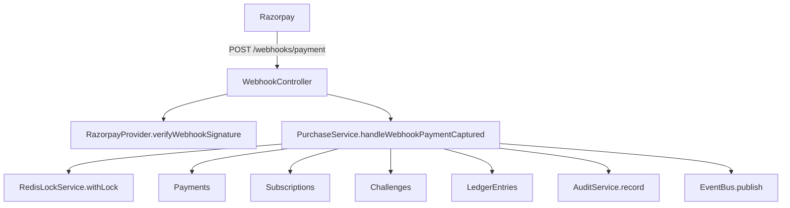
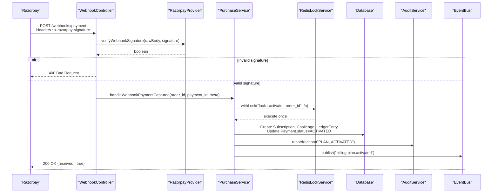
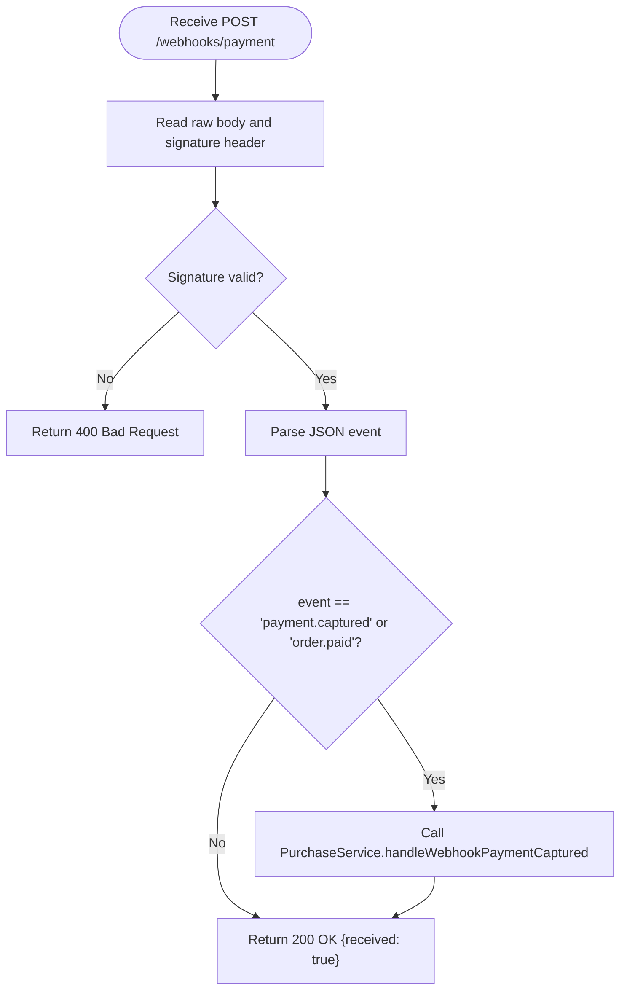
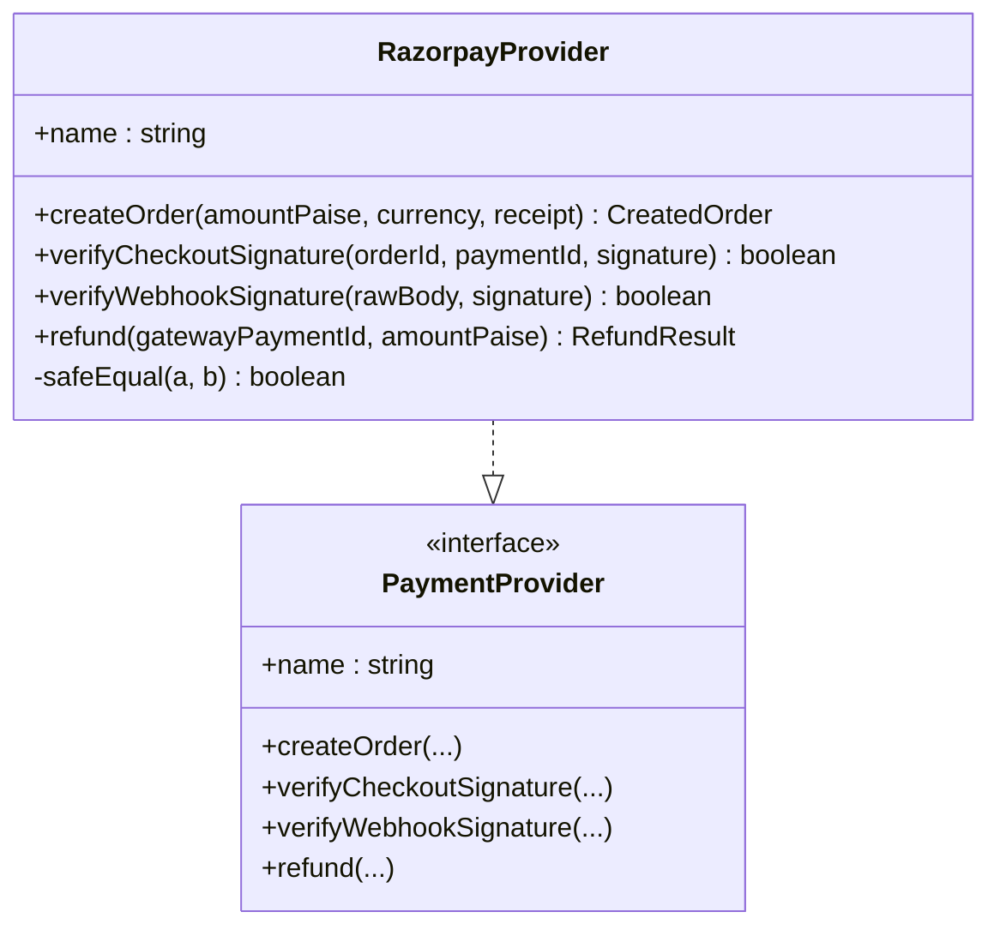
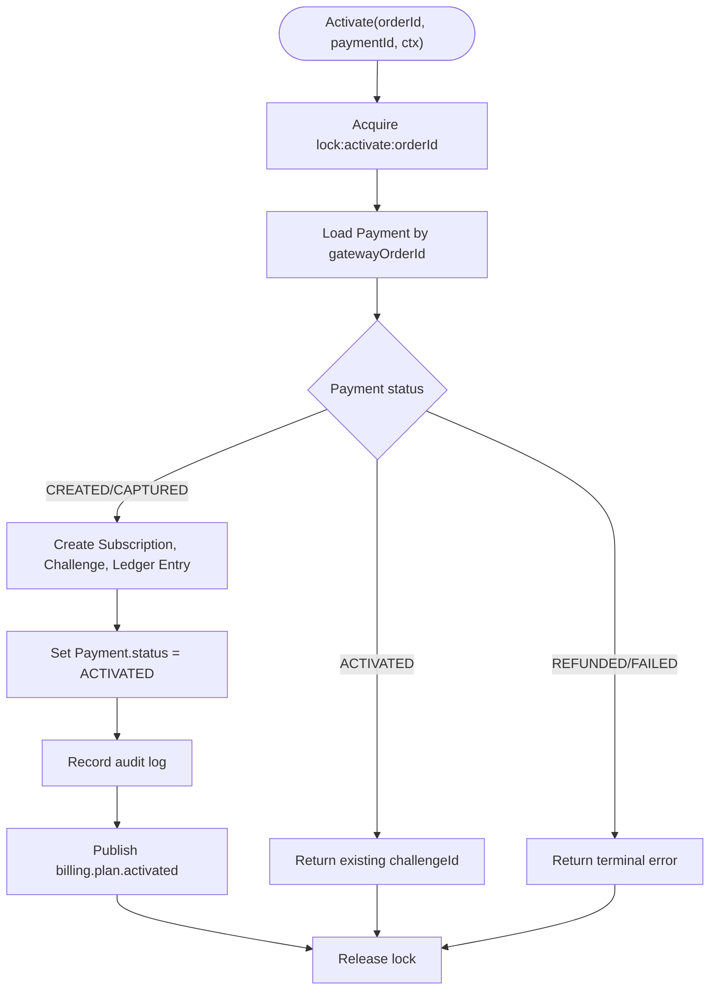
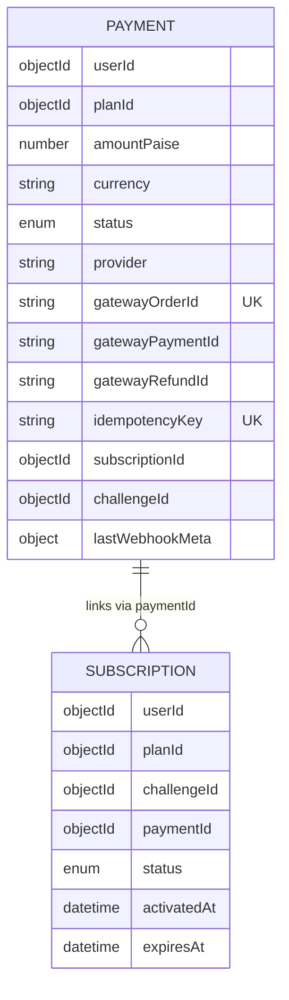
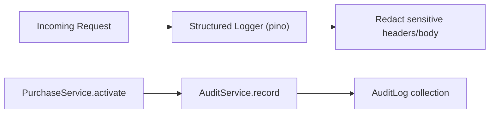
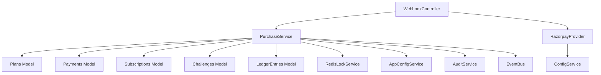

# Payment Webhooks

<cite>
**Referenced Files in This Document**
- [webhook.controller.ts](file://backend/apps/api/src/modules/plans/presentation/webhook.controller.ts)
- [razorpay.provider.ts](file://backend/apps/api/src/modules/plans/infrastructure/payment/razorpay.provider.ts)
- [payment.port.ts](file://backend/apps/api/src/modules/plans/infrastructure/payment/payment.port.ts)
- [purchase.service.ts](file://backend/apps/api/src/modules/plans/application/purchase.service.ts)
- [payment.schema.ts](file://backend/apps/api/src/modules/plans/infrastructure/schemas/payment.schema.ts)
- [subscription.schema.ts](file://backend/apps/api/src/modules/plans/infrastructure/schemas/subscription.schema.ts)
- [plan.types.ts](file://backend/apps/api/src/modules/plans/domain/plan.types.ts)
- [audit.service.ts](file://backend/libs/shared/src/audit/audit.service.ts)
- [logging.module.ts](file://backend/libs/shared/src/logging/logging.module.ts)
- [activation-idempotency.spec.ts](file://backend/apps/api/src/modules/plans/__tests__/activation-idempotency.spec.ts)
- [razorpay-signature.spec.ts](file://backend/apps/api/src/modules/plans/__tests__/razorpay-signature.spec.ts)
</cite>

## Table of Contents
1. Introduction
2. Project Structure
3. Core Components
4. Architecture Overview
5. Detailed Component Analysis
6. Dependency Analysis
7. Performance Considerations
8. Troubleshooting Guide
9. Conclusion

## Introduction
This document explains the payment webhook system for Razorpay callbacks that activate plans and subscriptions. It covers the webhook endpoint, event handling, signature verification, idempotency, error responses, retry behavior, logging, and monitoring. The implementation ensures exactly-once activation of virtual capital and challenge creation even under concurrent or duplicate webhook deliveries.

## Project Structure
The webhook flow spans a controller, a provider abstraction, and a service that performs idempotent activation:
- Controller receives raw body and verifies the Razorpay webhook signature.
- Provider implements HMAC-SHA256 verification using the configured webhook secret.
- Service enforces idempotency via Redis locks and persists state changes (payments, subscriptions, challenges, ledger entries).

**Diagram sources**
- [webhook.controller.ts:22-46](file://backend/apps/api/src/modules/plans/presentation/webhook.controller.ts#L22-L46)
- [razorpay.provider.ts:37-40](file://backend/apps/api/src/modules/plans/infrastructure/payment/razorpay.provider.ts#L37-L40)
- [purchase.service.ts:92-182](file://backend/apps/api/src/modules/plans/application/purchase.service.ts#L92-L182)
- [audit.service.ts:29-35](file://backend/libs/shared/src/audit/audit.service.ts#L29-L35)

**Section sources**
- [webhook.controller.ts:1-48](file://backend/apps/api/src/modules/plans/presentation/webhook.controller.ts#L1-L48)
- [razorpay.provider.ts:1-53](file://backend/apps/api/src/modules/plans/infrastructure/payment/razorpay.provider.ts#L1-L53)
- [purchase.service.ts:1-248](file://backend/apps/api/src/modules/plans/application/purchase.service.ts#L1-L248)

## Core Components
- WebhookController: Accepts POST to /webhooks/payment, reads raw body, validates signature, parses event, and delegates to PurchaseService.
- RazorpayProvider: Implements verifyWebhookSignature using HMAC-SHA256 with the webhook secret; also provides checkout signature verification and order/refund operations.
- PurchaseService: Idempotent activation path guarded by per-order Redis lock; creates subscription, challenge, and ledger entry; records audit and publishes domain events.
- Data models: Payment, Subscription, Plan types define statuses and constraints used during activation.

Key responsibilities:
- Security: Signature verification before any processing.
- Idempotency: Exactly-once activation per order.
- Persistence: Update payment status and create related entities.
- Observability: Audit logs and structured logging.

**Section sources**
- [webhook.controller.ts:13-46](file://backend/apps/api/src/modules/plans/presentation/webhook.controller.ts#L13-L46)
- [razorpay.provider.ts:20-40](file://backend/apps/api/src/modules/plans/infrastructure/payment/razorpay.provider.ts#L20-L40)
- [purchase.service.ts:92-182](file://backend/apps/api/src/modules/plans/application/purchase.service.ts#L92-L182)
- [payment.schema.ts:1-62](file://backend/apps/api/src/modules/plans/infrastructure/schemas/payment.schema.ts#L1-L62)
- [subscription.schema.ts:1-33](file://backend/apps/api/src/modules/plans/infrastructure/schemas/subscription.schema.ts#L1-L33)
- [plan.types.ts:22-49](file://backend/apps/api/src/modules/plans/domain/plan.types.ts#L22-L49)

## Architecture Overview
The webhook architecture follows a secure, idempotent pipeline:
- Endpoint accepts raw body and signature header.
- Signature is verified locally using HMAC-SHA256 against the webhook secret.
- On success, the controller dispatches to PurchaseService for activation.
- Activation is serialized per order via a distributed lock to prevent duplicates.
- On successful activation, the system persists state and emits an event for downstream consumers.

**Diagram sources**
- [webhook.controller.ts:22-46](file://backend/apps/api/src/modules/plans/presentation/webhook.controller.ts#L22-L46)
- [razorpay.provider.ts:37-40](file://backend/apps/api/src/modules/plans/infrastructure/payment/razorpay.provider.ts#L37-L40)
- [purchase.service.ts:92-182](file://backend/apps/api/src/modules/plans/application/purchase.service.ts#L92-L182)
- [audit.service.ts:29-35](file://backend/libs/shared/src/audit/audit.service.ts#L29-L35)

## Detailed Component Analysis

### Webhook Endpoint and Event Handling
- Endpoint: POST /webhooks/payment
- Required headers: x-razorpay-signature
- Raw body must be preserved for HMAC verification
- Supported events:
  - payment.captured
  - order.paid
- Processing:
  - Verify signature; reject with 400 on failure
  - Parse event payload and extract gateway identifiers
  - Delegate to PurchaseService for activation

**Diagram sources**
- [webhook.controller.ts:22-46](file://backend/apps/api/src/modules/plans/presentation/webhook.controller.ts#L22-L46)

**Section sources**
- [webhook.controller.ts:13-46](file://backend/apps/api/src/modules/plans/presentation/webhook.controller.ts#L13-L46)

### Signature Verification
- Checkout signature: HMAC-SHA256 over "orderId|paymentId" using key secret
- Webhook signature: HMAC-SHA256 over raw request body using webhook secret
- Comparison uses constant-time equality to prevent timing attacks

**Diagram sources**
- [razorpay.provider.ts:12-51](file://backend/apps/api/src/modules/plans/infrastructure/payment/razorpay.provider.ts#L12-L51)
- [payment.port.ts:20-32](file://backend/apps/api/src/modules/plans/infrastructure/payment/payment.port.ts#L20-L32)

**Section sources**
- [razorpay.provider.ts:20-51](file://backend/apps/api/src/modules/plans/infrastructure/payment/razorpay.provider.ts#L20-L51)
- [razorpay-signature.spec.ts:13-34](file://backend/apps/api/src/modules/plans/__tests__/razorpay-signature.spec.ts#L13-L34)

### Idempotency and Exactly-Once Activation
- Guarded by a per-order Redis lock to serialize concurrent activations from checkout callback and webhook
- Payment status transitions ensure no re-credit if already activated or terminal
- Creates subscription, challenge, and opening ledger credit exactly once
- Tests validate exactly-once crediting under concurrency and late arrivals

**Diagram sources**
- [purchase.service.ts:105-182](file://backend/apps/api/src/modules/plans/application/purchase.service.ts#L105-L182)
- [activation-idempotency.spec.ts:56-97](file://backend/apps/api/src/modules/plans/__tests__/activation-idempotency.spec.ts#L56-L97)

**Section sources**
- [purchase.service.ts:92-182](file://backend/apps/api/src/modules/plans/application/purchase.service.ts#L92-L182)
- [activation-idempotency.spec.ts:1-98](file://backend/apps/api/src/modules/plans/__tests__/activation-idempotency.spec.ts#L1-L98)

### Data Models and State Transitions
- Payment tracks intent, gateway IDs, status, and idempotency key
- Subscription links user, plan, challenge, and payment with activation/expiry dates
- Plan types define terminal states and lifecycle semantics

**Diagram sources**
- [payment.schema.ts:5-56](file://backend/apps/api/src/modules/plans/infrastructure/schemas/payment.schema.ts#L5-L56)
- [subscription.schema.ts:5-27](file://backend/apps/api/src/modules/plans/infrastructure/schemas/subscription.schema.ts#L5-L27)
- [plan.types.ts:27-39](file://backend/apps/api/src/modules/plans/domain/plan.types.ts#L27-L39)

**Section sources**
- [payment.schema.ts:1-62](file://backend/apps/api/src/modules/plans/infrastructure/schemas/payment.schema.ts#L1-L62)
- [subscription.schema.ts:1-33](file://backend/apps/api/src/modules/plans/infrastructure/schemas/subscription.schema.ts#L1-L33)
- [plan.types.ts:22-49](file://backend/apps/api/src/modules/plans/domain/plan.types.ts#L22-L49)

### Logging and Monitoring
- Structured HTTP logging with request ID propagation and sensitive field redaction
- Audit trail records plan activation with actor context and after-state snapshot
- Non-fatal audit failures are logged without aborting business logic

**Diagram sources**
- [logging.module.ts:7-34](file://backend/libs/shared/src/logging/logging.module.ts#L7-L34)
- [audit.service.ts:29-35](file://backend/libs/shared/src/audit/audit.service.ts#L29-L35)

**Section sources**
- [logging.module.ts:1-35](file://backend/libs/shared/src/logging/logging.module.ts#L1-L35)
- [audit.service.ts:1-45](file://backend/libs/shared/src/audit/audit.service.ts#L1-L45)

## Dependency Analysis
- WebhookController depends on PurchaseService and PaymentProvider abstraction
- PurchaseService depends on multiple Mongoose models, RedisLockService, AppConfigService, AuditService, EventBus
- RazorpayProvider depends on ConfigService and crypto utilities
- Shared modules provide logging and audit capabilities

**Diagram sources**
- [webhook.controller.ts:1-20](file://backend/apps/api/src/modules/plans/presentation/webhook.controller.ts#L1-L20)
- [purchase.service.ts:18-34](file://backend/apps/api/src/modules/plans/application/purchase.service.ts#L18-L34)
- [razorpay.provider.ts:1-25](file://backend/apps/api/src/modules/plans/infrastructure/payment/razorpay.provider.ts#L1-L25)

**Section sources**
- [webhook.controller.ts:1-20](file://backend/apps/api/src/modules/plans/presentation/webhook.controller.ts#L1-L20)
- [purchase.service.ts:18-34](file://backend/apps/api/src/modules/plans/application/purchase.service.ts#L18-L34)
- [razorpay.provider.ts:1-25](file://backend/apps/api/src/modules/plans/infrastructure/payment/razorpay.provider.ts#L1-L25)

## Performance Considerations
- Signature verification is local HMAC computation with constant-time comparison; negligible latency
- Redis-based locking serializes activation per order, preventing duplicate work and race conditions
- Database writes are grouped within a single locked scope to minimize contention
- Audit writes are fire-and-forget with error logging to avoid impacting critical paths

[No sources needed since this section provides general guidance]

## Troubleshooting Guide
Common issues and resolutions:
- Invalid signature: Ensure the webhook secret matches Razorpay configuration and that the raw body is not modified before verification.
- Duplicate webhooks: Idempotency is enforced; repeated calls return the same result without re-crediting.
- Audit write failures: Logged but do not block activation; investigate audit storage health.
- Missing event fields: Controller requires both order_id and payment id in the payload; missing fields will skip processing.

Operational checks:
- Inspect structured logs for request IDs and redacted payloads
- Review audit logs for PLAN_ACTIVATED actions
- Validate Payment.status transitions and presence of gateway identifiers

**Section sources**
- [webhook.controller.ts:22-46](file://backend/apps/api/src/modules/plans/presentation/webhook.controller.ts#L22-L46)
- [purchase.service.ts:92-182](file://backend/apps/api/src/modules/plans/application/purchase.service.ts#L92-L182)
- [audit.service.ts:29-35](file://backend/libs/shared/src/audit/audit.service.ts#L29-L35)

## Conclusion
The webhook system securely processes Razorpay payment events, verifies signatures, and guarantees exactly-once activation through distributed locking and robust state management. It integrates structured logging and audit trails for observability and compliance. The design supports future extensibility for additional events and providers while maintaining strong security and reliability guarantees.