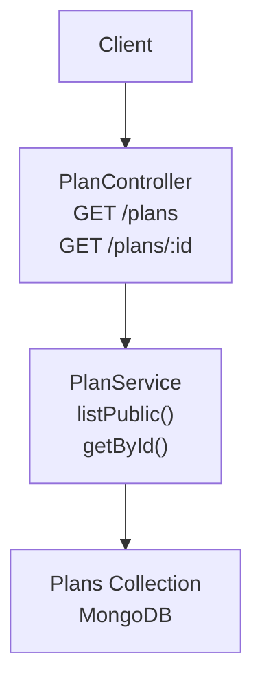
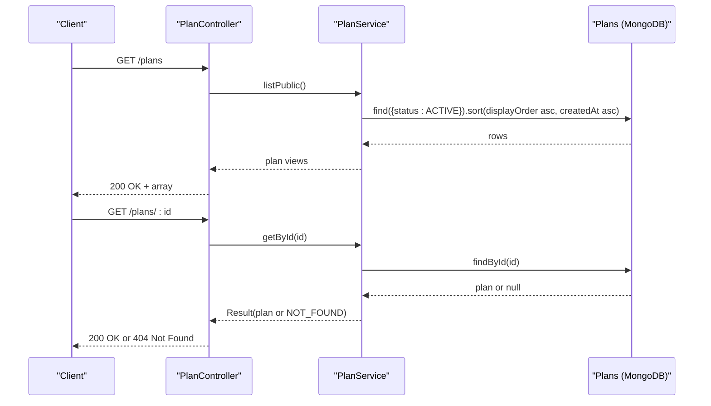
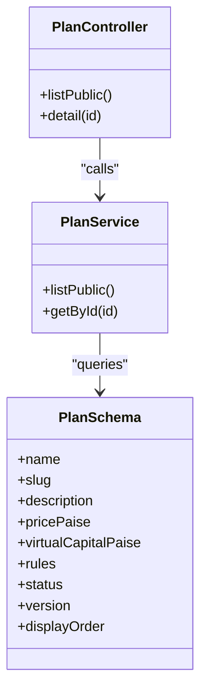

# Plan Management APIs

<cite>
**Referenced Files in This Document**
- [plan.controller.ts](file://backend/apps/api/src/modules/plans/presentation/plan.controller.ts)
- [plan.dtos.ts](file://backend/apps/api/src/modules/plans/presentation/dto/plan.dtos.ts)
- [plan.service.ts](file://backend/apps/api/src/modules/plans/application/plan.service.ts)
- [plan.types.ts](file://backend/apps/api/src/modules/plans/domain/plan.types.ts)
- [plan.schema.ts](file://backend/apps/api/src/modules/plans/infrastructure/schemas/plan.schema.ts)
- [purchase.service.ts](file://backend/apps/api/src/modules/plans/application/purchase.service.ts)
</cite>

## Table of Contents
1. Introduction
2. Project Structure
3. Core Components
4. Architecture Overview
5. Detailed Component Analysis
6. Dependency Analysis
7. Performance Considerations
8. Troubleshooting Guide
9. Conclusion

## Introduction
This document provides detailed API documentation for plan management endpoints focused on listing available plans and retrieving plan details. It covers request/response schemas, pricing, features, availability status, filtering, sorting, pagination where applicable, example data structures, common query patterns, and the lifecycle states that determine when a plan is available or unavailable.

## Project Structure
The plan management feature is implemented under the plans module with clear separation:
- Presentation layer exposes REST endpoints
- Application layer implements business logic
- Domain layer defines types and rules
- Infrastructure layer defines persistence schema

**Diagram sources**
- [plan.controller.ts:25-37](file://backend/apps/api/src/modules/plans/presentation/plan.controller.ts#L25-L37)
- [plan.service.ts:43-58](file://backend/apps/api/src/modules/plans/application/plan.service.ts#L43-L58)
- [plan.schema.ts:18-49](file://backend/apps/api/src/modules/plans/infrastructure/schemas/plan.schema.ts#L18-L49)

**Section sources**
- [plan.controller.ts:25-37](file://backend/apps/api/src/modules/plans/presentation/plan.controller.ts#L25-L37)
- [plan.service.ts:43-58](file://backend/apps/api/src/modules/plans/application/plan.service.ts#L43-L58)
- [plan.schema.ts:18-49](file://backend/apps/api/src/modules/plans/infrastructure/schemas/plan.schema.ts#L18-L49)

## Core Components
- GET /plans: Lists public, active plans ordered by display order and creation time.
- GET /plans/:id: Retrieves a single plan by ID; returns not found if missing.

Key behaviors:
- Only ACTIVE plans are returned by list endpoint.
- Plans are sorted by displayOrder ascending, then createdAt ascending.
- Pricing is stored in paise but exposed as rupees alongside raw paise values.
- Features are represented via challenge rules embedded in each plan.

**Section sources**
- [plan.controller.ts:29-37](file://backend/apps/api/src/modules/plans/presentation/plan.controller.ts#L29-L37)
- [plan.service.ts:43-58](file://backend/apps/api/src/modules/plans/application/plan.service.ts#L43-L58)
- [plan.schema.ts:18-49](file://backend/apps/api/src/modules/plans/infrastructure/schemas/plan.schema.ts#L18-L49)

## Architecture Overview

**Diagram sources**
- [plan.controller.ts:29-37](file://backend/apps/api/src/modules/plans/presentation/plan.controller.ts#L29-L37)
- [plan.service.ts:43-58](file://backend/apps/api/src/modules/plans/application/plan.service.ts#L43-L58)

## Detailed Component Analysis

### Endpoint: GET /plans
- Purpose: List publicly available plans.
- Authentication: None required.
- Query parameters: None defined for this endpoint. Filtering and sorting are server-side only.
- Response: Array of plan objects.

Response object fields:
- id: string — unique identifier
- name: string — plan name
- slug: string — URL-friendly identifier
- description: string? — optional description
- price: number — price in rupees
- pricePaise: number — price in paise
- virtualCapital: number — virtual capital in rupees
- virtualCapitalPaise: number — virtual capital in paise
- rules: object — challenge rules defining features and constraints
- status: "ACTIVE" | "ARCHIVED" — always "ACTIVE" in this list
- version: number — plan version
- displayOrder: number — ordering hint

Sorting and filtering:
- Sorting: by displayOrder ascending, then createdAt ascending.
- Filtering: only ACTIVE plans are included.

Example response shape:
- An array containing plan objects with the fields above.

Common usage:
- Fetch all currently purchasable plans to render a catalog UI.

**Section sources**
- [plan.controller.ts:29-32](file://backend/apps/api/src/modules/plans/presentation/plan.controller.ts#L29-L32)
- [plan.service.ts:43-47](file://backend/apps/api/src/modules/plans/application/plan.service.ts#L43-L47)
- [plan.schema.ts:18-49](file://backend/apps/api/src/modules/plans/infrastructure/schemas/plan.schema.ts#L18-L49)

### Endpoint: GET /plans/:id
- Purpose: Retrieve details for a specific plan by its ID.
- Authentication: None required.
- Path parameter:
  - id: string — plan identifier
- Response: Single plan object with same fields as list items.
- Error handling:
  - 404 Not Found when plan does not exist.

Error mapping:
- NOT_FOUND maps to HTTP 404.

**Section sources**
- [plan.controller.ts:34-37](file://backend/apps/api/src/modules/plans/presentation/plan.controller.ts#L34-L37)
- [plan.service.ts:54-58](file://backend/apps/api/src/modules/plans/application/plan.service.ts#L54-L58)

### Plan Data Model and Rules
Plan object includes embedded rules that define plan features and constraints:
- profitTargetPct: number — target profit percentage
- maxDrawdownPct: number — maximum overall drawdown percentage
- dailyDrawdownPct: number — maximum daily drawdown percentage
- drawdownAnchor: "PREV_DAY_CLOSE" | "INITIAL_CAPITAL"
- minTradingDays: number — minimum trading days to pass
- expiryDays: number — challenge expiry window in days
- rewardPct: number — reward percentage
- segments: string[] — allowed instrument segments ("EQ", "FO", "CUR")

These rules are validated and normalized before storage and are snapshotted into challenges at activation so edits do not affect running challenges.

**Section sources**
- [plan.schema.ts:5-16](file://backend/apps/api/src/modules/plans/infrastructure/schemas/plan.schema.ts#L5-L16)
- [plan.types.ts:6-20](file://backend/apps/api/src/modules/plans/domain/plan.types.ts#L6-L20)
- [plan-rules.vo.ts:4-59](file://backend/apps/api/src/modules/plans/domain/plan-rules.vo.ts#L4-L59)

### Availability Status and Lifecycle
Plan status determines visibility and purchase eligibility:
- ACTIVE: Visible in public catalog and purchasable.
- ARCHIVED: Hidden from catalog; existing challenges remain unaffected.

How plans become available/unavailable:
- New plans are created with ACTIVE status.
- Admin can change status to ARCHIVED to hide plans from the catalog without affecting existing subscriptions/challenges.

Note: The public list endpoint only returns ACTIVE plans.

**Section sources**
- [plan.types.ts:22-25](file://backend/apps/api/src/modules/plans/domain/plan.types.ts#L22-L25)
- [plan.service.ts:43-47](file://backend/apps/api/src/modules/plans/application/plan.service.ts#L43-L47)

### Pricing Information
- priceRupees and virtualCapitalRupees are validated and converted to integer paise internally.
- Responses expose both human-readable rupees and raw paise for precision.

Validation and conversion occur during create/update flows and are reflected in responses.

**Section sources**
- [plan.service.ts:60-84](file://backend/apps/api/src/modules/plans/application/plan.service.ts#L60-L84)
- [plan.schema.ts:29-35](file://backend/apps/api/src/modules/plans/infrastructure/schemas/plan.schema.ts#L29-L35)

### Filtering, Sorting, and Pagination
- GET /plans: No client-side filters or sort parameters. Server enforces:
  - Filter: status = ACTIVE
  - Sort: displayOrder asc, createdAt asc
- GET /plans/:id: No filters or pagination; returns one plan or 404.
- Pagination is not supported for these endpoints.

If you need advanced filtering or pagination, use admin endpoints for internal operations.

**Section sources**
- [plan.service.ts:43-51](file://backend/apps/api/src/modules/plans/application/plan.service.ts#L43-L51)

### Common Query Patterns
- List all available plans: GET /plans
- Get a specific plan: GET /plans/{id}
- Combine with client-side filtering if needed (e.g., filter by segments or price range after fetching).

No server-side query parameters are defined for these endpoints.

**Section sources**
- [plan.controller.ts:29-37](file://backend/apps/api/src/modules/plans/presentation/plan.controller.ts#L29-L37)

### Example Request/Response Schemas
- GET /plans
  - Request: GET /plans
  - Response: Array of plan objects with fields described above
- GET /plans/:id
  - Request: GET /plans/{id}
  - Response: Single plan object or 404

For reference, see the plan view transformation and schema definitions.

**Section sources**
- [plan.service.ts:19-34](file://backend/apps/api/src/modules/plans/application/plan.service.ts#L19-L34)
- [plan.schema.ts:18-49](file://backend/apps/api/src/modules/plans/infrastructure/schemas/plan.schema.ts#L18-L49)

## Dependency Analysis

**Diagram sources**
- [plan.controller.ts:25-37](file://backend/apps/api/src/modules/plans/presentation/plan.controller.ts#L25-L37)
- [plan.service.ts:36-58](file://backend/apps/api/src/modules/plans/application/plan.service.ts#L36-L58)
- [plan.schema.ts:18-49](file://backend/apps/api/src/modules/plans/infrastructure/schemas/plan.schema.ts#L18-L49)

**Section sources**
- [plan.controller.ts:25-37](file://backend/apps/api/src/modules/plans/presentation/plan.controller.ts#L25-L37)
- [plan.service.ts:36-58](file://backend/apps/api/src/modules/plans/application/plan.service.ts#L36-L58)
- [plan.schema.ts:18-49](file://backend/apps/api/src/modules/plans/infrastructure/schemas/plan.schema.ts#L18-L49)

## Performance Considerations
- The list endpoint queries only ACTIVE plans and uses indexed fields (status, displayOrder, createdAt) for efficient sorting and filtering.
- Using lean queries reduces overhead.
- Avoid adding client-side filters that require full scans; prefer server-side support if needed later.

[No sources needed since this section provides general guidance]

## Troubleshooting Guide
Common errors:
- 404 Not Found: Plan ID does not exist in GET /plans/:id.
- Conflict or Unprocessable Entity: Errors from other endpoints may map to different statuses; for plan listing/detail, expect 200 or 404.

Error mapping for detail endpoint:
- NOT_FOUND → 404

**Section sources**
- [plan.controller.ts:12-23](file://backend/apps/api/src/modules/plans/presentation/plan.controller.ts#L12-L23)
- [plan.service.ts:54-58](file://backend/apps/api/src/modules/plans/application/plan.service.ts#L54-L58)

## Conclusion
The plan management APIs provide a simple, secure way to list and retrieve plan details. Plans are filtered to ACTIVE status and sorted deterministically. Pricing and features are clearly exposed, and plan availability is controlled via status. For advanced filtering or pagination, consider admin endpoints or client-side processing after retrieval.

[No sources needed since this section summarizes without analyzing specific files]