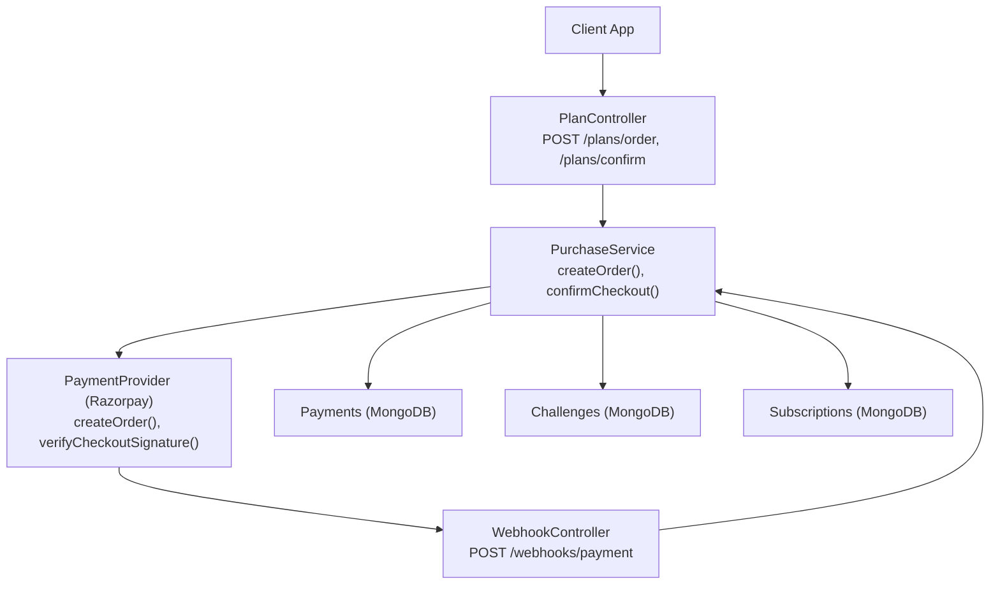
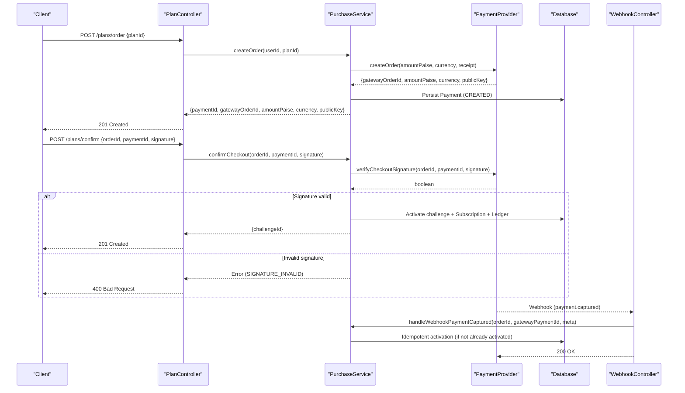
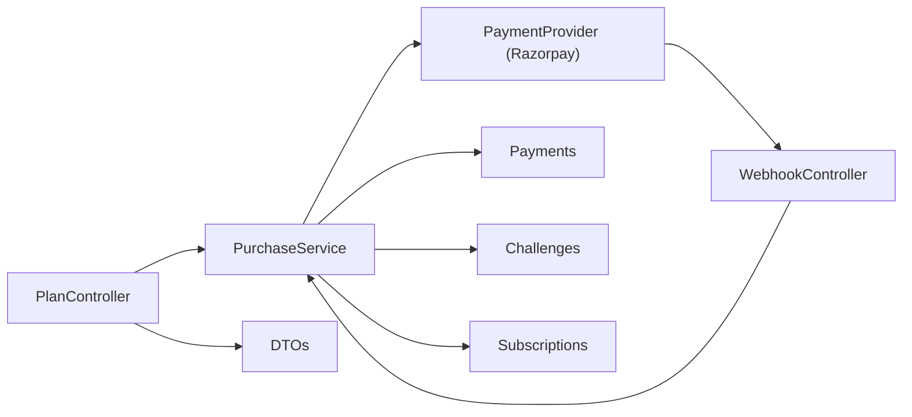

# Purchase & Checkout APIs

<cite>
**Referenced Files in This Document**
- [plan.controller.ts](file://backend/apps/api/src/modules/plans/presentation/plan.controller.ts)
- [purchase.service.ts](file://backend/apps/api/src/modules/plans/application/purchase.service.ts)
- [razorpay.provider.ts](file://backend/apps/api/src/modules/plans/infrastructure/payment/razorpay.provider.ts)
- [payment.port.ts](file://backend/apps/api/src/modules/plans/infrastructure/payment/payment.port.ts)
- [webhook.controller.ts](file://backend/apps/api/src/modules/plans/presentation/webhook.controller.ts)
- [plan.dtos.ts](file://backend/apps/api/src/modules/plans/presentation/dto/plan.dtos.ts)
- [plan.types.ts](file://backend/apps/api/src/modules/plans/domain/plan.types.ts)
- [auth.types.ts](file://backend/apps/api/src/modules/auth/domain/auth.types.ts)
- [app-exception.ts](file://backend/libs/shared/src/http/app-exception.ts)
- [payment.schema.ts](file://backend/apps/api/src/modules/plans/infrastructure/schemas/payment.schema.ts)
- [purchase.e2e-spec.ts](file://backend/test/e2e/purchase.e2e-spec.ts)
</cite>

## Table of Contents
1. Introduction
2. Project Structure
3. Core Components
4. Architecture Overview
5. Detailed Component Analysis
6. Dependency Analysis
7. Performance Considerations
8. Troubleshooting Guide
9. Conclusion

## Introduction
This document provides comprehensive API documentation for the purchase and checkout workflow endpoints that enable users to select a plan, create a payment order, confirm payment via Razorpay, and activate a trading challenge upon successful payment. It covers request/response schemas, authentication requirements, rate limiting, error handling (including failed payments, invalid signatures, and KYC requirements), and security considerations for payment processing.

## Project Structure
The purchase and checkout flow is implemented within the Plans module:
- Presentation layer exposes REST endpoints for creating orders and confirming checkout, plus user queries for subscription and payments.
- Application layer orchestrates business logic: validating user context, interacting with the payment provider, persisting payments, and activating challenges idempotently.
- Infrastructure layer abstracts the payment gateway (Razorpay) behind a port interface and persists payment records.
- Domain types define statuses for plans, payments, subscriptions, and challenges.

**Diagram sources**
- [plan.controller.ts:25-63](file://backend/apps/api/src/modules/plans/presentation/plan.controller.ts#L25-L63)
- [purchase.service.ts:36-183](file://backend/apps/api/src/modules/plans/application/purchase.service.ts#L36-L183)
- [razorpay.provider.ts:20-45](file://backend/apps/api/src/modules/plans/infrastructure/payment/razorpay.provider.ts#L20-L45)
- [webhook.controller.ts:13-47](file://backend/apps/api/src/modules/plans/presentation/webhook.controller.ts#L13-L47)

**Section sources**
- [plan.controller.ts:25-63](file://backend/apps/api/src/modules/plans/presentation/plan.controller.ts#L25-L63)
- [purchase.service.ts:36-183](file://backend/apps/api/src/modules/plans/application/purchase.service.ts#L36-L183)

## Core Components
- PlanController: Exposes authenticated endpoints for order creation and confirmation, and user-specific queries. Applies throttling to protect against abuse.
- PurchaseService: Implements the purchase workflow: validates KYC and plan availability, creates gateway orders, persists payment intents, verifies signatures, and activates challenges idempotently.
- RazorpayProvider: Creates orders, verifies checkout signatures using HMAC-SHA256, verifies webhook signatures, and supports refunds.
- WebhookController: Validates incoming webhook signatures and triggers activation on payment capture events.
- DTOs: Define request payloads for order creation and checkout confirmation.
- Domain Types: Enumerations for plan, payment, subscription, and challenge statuses used throughout the flow.

**Section sources**
- [plan.controller.ts:25-63](file://backend/apps/api/src/modules/plans/presentation/plan.controller.ts#L25-L63)
- [purchase.service.ts:36-183](file://backend/apps/api/src/modules/plans/application/purchase.service.ts#L36-L183)
- [razorpay.provider.ts:20-45](file://backend/apps/api/src/modules/plans/infrastructure/payment/razorpay.provider.ts#L20-L45)
- [webhook.controller.ts:13-47](file://backend/apps/api/src/modules/plans/presentation/webhook.controller.ts#L13-L47)
- [plan.dtos.ts:40-48](file://backend/apps/api/src/modules/plans/presentation/dto/plan.dtos.ts#L40-L48)
- [plan.types.ts:22-49](file://backend/apps/api/src/modules/plans/domain/plan.types.ts#L22-L49)

## Architecture Overview
The end-to-end flow consists of two primary client flows and one server-side webhook flow:
- Create Order: Authenticated client requests an order for a selected plan; system validates KYC and plan status, creates a gateway order, and returns identifiers needed by the frontend SDK.
- Confirm Checkout: Client sends orderId, paymentId, and signature; system verifies signature and activates the challenge if valid.
- Webhook Capture: Payment gateway notifies server on capture; system verifies webhook signature and ensures exactly-once activation.

**Diagram sources**
- [plan.controller.ts:39-50](file://backend/apps/api/src/modules/plans/presentation/plan.controller.ts#L39-L50)
- [purchase.service.ts:36-183](file://backend/apps/api/src/modules/plans/application/purchase.service.ts#L36-L183)
- [razorpay.provider.ts:27-45](file://backend/apps/api/src/modules/plans/infrastructure/payment/razorpay.provider.ts#L27-L45)
- [webhook.controller.ts:22-47](file://backend/apps/api/src/modules/plans/presentation/webhook.controller.ts#L22-L47)

## Detailed Component Analysis

### Endpoint: POST /plans/order
Purpose: Create a payment order for a selected plan and return details required by the frontend checkout SDK.

Authentication:
- Requires a valid access token (JWT). The controller uses a guard to extract the current principal’s sub (user ID).

Rate Limiting:
- Throttled to 10 requests per minute per default policy to mitigate abuse.

Request Body:
- planId: string (length 6–40)

Response:
- paymentId: string
- gatewayOrderId: string
- amountPaise: number
- currency: string
- publicKey: string

Error Handling:
- NOT_FOUND: User not found
- KYC_REQUIRED: User KYC not approved
- PLAN_UNAVAILABLE: Plan not active or missing
- ACTIVE_CHALLENGE_EXISTS: When multi-challenge is disabled and user has an active/pending challenge

Notes:
- A payment record is created with status CREATED and an idempotency key derived from the gateway order.

**Section sources**
- [plan.controller.ts:39-44](file://backend/apps/api/src/modules/plans/presentation/plan.controller.ts#L39-L44)
- [plan.dtos.ts:40-42](file://backend/apps/api/src/modules/plans/presentation/dto/plan.dtos.ts#L40-L42)
- [purchase.service.ts:36-82](file://backend/apps/api/src/modules/plans/application/purchase.service.ts#L36-L82)
- [plan.types.ts:22-33](file://backend/apps/api/src/modules/plans/domain/plan.types.ts#L22-L33)

### Endpoint: POST /plans/confirm
Purpose: Confirm payment after the client SDK completes checkout and send back orderId, paymentId, and signature for verification.

Authentication:
- Requires a valid access token (JWT).

Request Body:
- orderId: string
- paymentId: string
- signature: string

Response:
- challengeId: string

Error Handling:
- SIGNATURE_INVALID: Verification failed
- Other domain errors mapped to appropriate HTTP codes (e.g., NOT_FOUND, PAYMENT_TERMINAL)

Behavior:
- Verifies signature using HMAC-SHA256 over "orderId|paymentId" with the provider secret.
- On success, activates the challenge idempotently, creates a subscription, and credits virtual capital once.

**Section sources**
- [plan.controller.ts:46-50](file://backend/apps/api/src/modules/plans/presentation/plan.controller.ts#L46-L50)
- [plan.dtos.ts:44-48](file://backend/apps/api/src/modules/plans/presentation/dto/plan.dtos.ts#L44-L48)
- [purchase.service.ts:84-90](file://backend/apps/api/src/modules/plans/application/purchase.service.ts#L84-L90)
- [razorpay.provider.ts:32-35](file://backend/apps/api/src/modules/plans/infrastructure/payment/razorpay.provider.ts#L32-L35)

### Webhook: POST /webhooks/payment
Purpose: Receive payment gateway notifications (e.g., payment captured) and trigger activation safely.

Security:
- Verifies webhook signature using HMAC-SHA256 with the webhook secret against the raw body.
- Returns 200 OK even when event cannot be processed further to stop retries; returns 400 only on signature failure.

Processing:
- Parses event payload and calls activation for payment.captured or order.paid events.

**Section sources**
- [webhook.controller.ts:22-47](file://backend/apps/api/src/modules/plans/presentation/webhook.controller.ts#L22-L47)
- [razorpay.provider.ts:37-40](file://backend/apps/api/src/modules/plans/infrastructure/payment/razorpay.provider.ts#L37-L40)

### Idempotent Activation Flow
Activation is protected by:
- Redis lock per order to prevent concurrent activations.
- Unique idempotency key on payment records to ensure exactly-once crediting.
- Status checks to avoid re-activating refunded/failed payments.

On activation:
- Creates a Challenge (PENDING) with rules snapshot from the plan.
- Creates a Subscription (ACTIVE) with start and expiry dates based on plan rules.
- Credits virtual capital via an append-only ledger entry.
- Updates payment status to ACTIVATED and records audit events and domain events.

**Section sources**
- [purchase.service.ts:100-183](file://backend/apps/api/src/modules/plans/application/purchase.service.ts#L100-L183)
- [payment.schema.ts:25-40](file://backend/apps/api/src/modules/plans/infrastructure/schemas/payment.schema.ts#L25-L40)
- [plan.types.ts:22-49](file://backend/apps/api/src/modules/plans/domain/plan.types.ts#L22-L49)

### Data Models and Schemas
Key entities involved in the purchase flow:
- Payment: Stores intent, gateway references, amounts, currency, status, and idempotency key.
- Challenge: Represents the funded trading period with rules snapshot and lifecycle states.
- Subscription: Links user, plan, challenge, and payment with activation/expiry dates.
- LedgerEntry: Append-only record of virtual capital credit on activation.

**Section sources**
- [payment.schema.ts:5-62](file://backend/apps/api/src/modules/plans/infrastructure/schemas/payment.schema.ts#L5-L62)
- [plan.types.ts:22-49](file://backend/apps/api/src/modules/plans/domain/plan.types.ts#L22-L49)

### Authentication and Authorization
- Access tokens are validated via a JWT guard; user ID is extracted from claims.
- KYC approval is enforced before allowing purchases.

**Section sources**
- [plan.controller.ts:39-44](file://backend/apps/api/src/modules/plans/presentation/plan.controller.ts#L39-L44)
- [auth.types.ts:26-31](file://backend/apps/api/src/modules/auth/domain/auth.types.ts#L26-L31)
- [purchase.service.ts:40-44](file://backend/apps/api/src/modules/plans/application/purchase.service.ts#L40-L44)

### Security Considerations
- Signature verification for checkout uses HMAC-SHA256 with constant-time comparison to prevent timing attacks.
- Webhook signature verification uses the webhook secret and raw body to ensure integrity.
- Rate limiting protects endpoints from abuse.
- Idempotency keys and locks prevent duplicate activations under concurrency.

**Section sources**
- [razorpay.provider.ts:32-51](file://backend/apps/api/src/modules/plans/infrastructure/payment/razorpay.provider.ts#L32-L51)
- [webhook.controller.ts:22-47](file://backend/apps/api/src/modules/plans/presentation/webhook.controller.ts#L22-L47)
- [plan.controller.ts:39-44](file://backend/apps/api/src/modules/plans/presentation/plan.controller.ts#L39-L44)
- [purchase.service.ts:100-183](file://backend/apps/api/src/modules/plans/application/purchase.service.ts#L100-L183)

## Dependency Analysis
The following diagram shows how components depend on each other during the purchase and checkout process.

**Diagram sources**
- [plan.controller.ts:25-63](file://backend/apps/api/src/modules/plans/presentation/plan.controller.ts#L25-L63)
- [purchase.service.ts:18-34](file://backend/apps/api/src/modules/plans/application/purchase.service.ts#L18-L34)
- [razorpay.provider.ts:20-45](file://backend/apps/api/src/modules/plans/infrastructure/payment/razorpay.provider.ts#L20-L45)
- [webhook.controller.ts:13-47](file://backend/apps/api/src/modules/plans/presentation/webhook.controller.ts#L13-L47)

**Section sources**
- [plan.controller.ts:25-63](file://backend/apps/api/src/modules/plans/presentation/plan.controller.ts#L25-L63)
- [purchase.service.ts:18-34](file://backend/apps/api/src/modules/plans/application/purchase.service.ts#L18-L34)
- [razorpay.provider.ts:20-45](file://backend/apps/api/src/modules/plans/infrastructure/payment/razorpay.provider.ts#L20-L45)
- [webhook.controller.ts:13-47](file://backend/apps/api/src/modules/plans/presentation/webhook.controller.ts#L13-L47)

## Performance Considerations
- Throttling: The order endpoint is rate-limited to reduce load and prevent abuse.
- Idempotency: Redis locks and unique idempotency keys ensure safe concurrent handling of webhooks and client confirmations.
- Minimal network calls: Signature verification is local and fast; gateway calls are limited to order creation and refunds.
- Database indexing: Payments and related collections include indexes for efficient lookups during activation and queries.

[No sources needed since this section provides general guidance]

## Troubleshooting Guide
Common errors and their meanings:
- KYC_REQUIRED: User must complete KYC verification before purchasing.
- PLAN_UNAVAILABLE: Selected plan is not active or does not exist.
- ACTIVE_CHALLENGE_EXISTS: User already has an active or pending challenge when multiple active challenges are disallowed.
- SIGNATURE_INVALID: Checkout or webhook signature verification failed; check secrets and payload integrity.
- PAYMENT_TERMINAL: Payment already in a terminal state (refunded/failed); cannot activate again.
- NOT_FOUND: Missing user, plan, or payment referenced in the request.

HTTP mapping:
- Domain errors are mapped to appropriate HTTP status codes (e.g., 400 for invalid signature, 403 for KYC required, 409 for conflicts).

Verification tips:
- Ensure the checkout signature matches HMAC-SHA256("orderId|paymentId") with the correct secret.
- Ensure webhook signature matches HMAC-SHA256(rawBody) with the webhook secret.
- Confirm that the gateway order exists and corresponds to the payment record.

**Section sources**
- [plan.controller.ts:12-23](file://backend/apps/api/src/modules/plans/presentation/plan.controller.ts#L12-L23)
- [purchase.service.ts:40-90](file://backend/apps/api/src/modules/plans/application/purchase.service.ts#L40-L90)
- [razorpay.provider.ts:32-40](file://backend/apps/api/src/modules/plans/infrastructure/payment/razorpay.provider.ts#L32-L40)
- [webhook.controller.ts:22-47](file://backend/apps/api/src/modules/plans/presentation/webhook.controller.ts#L22-L47)
- [app-exception.ts:4-17](file://backend/libs/shared/src/http/app-exception.ts#L4-L17)

## Conclusion
The purchase and checkout workflow provides a secure, idempotent, and auditable path from plan selection to challenge activation. It enforces KYC, validates signatures rigorously, handles failures gracefully, and leverages rate limiting and idempotency mechanisms to ensure reliability. The abstraction over the payment provider allows easy adaptation to different gateways while maintaining consistent behavior across the system.