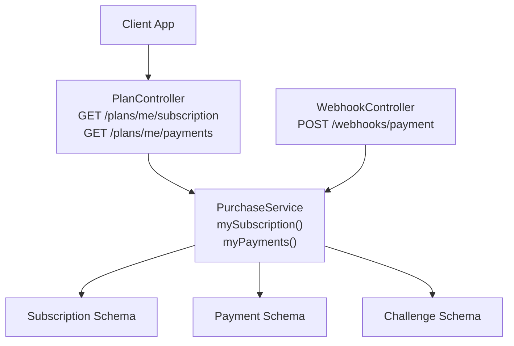
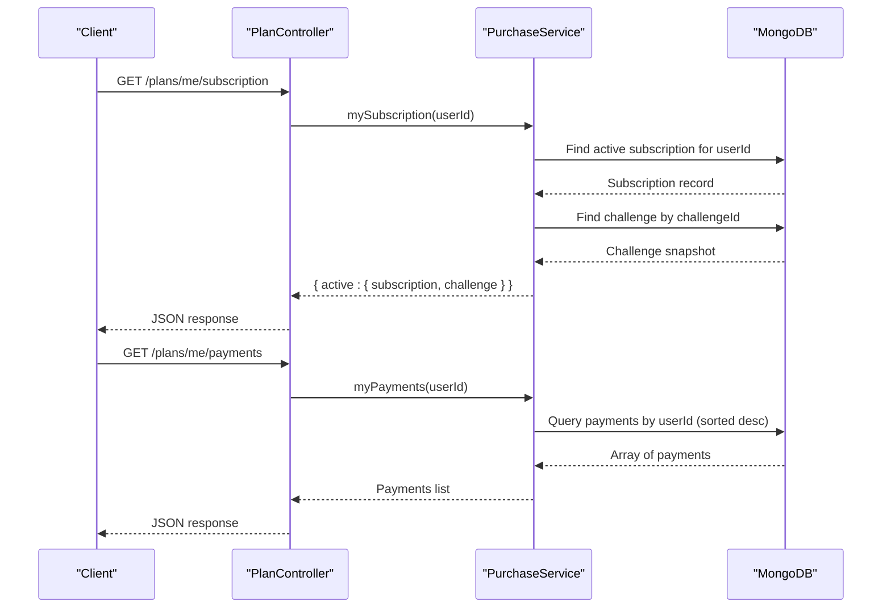
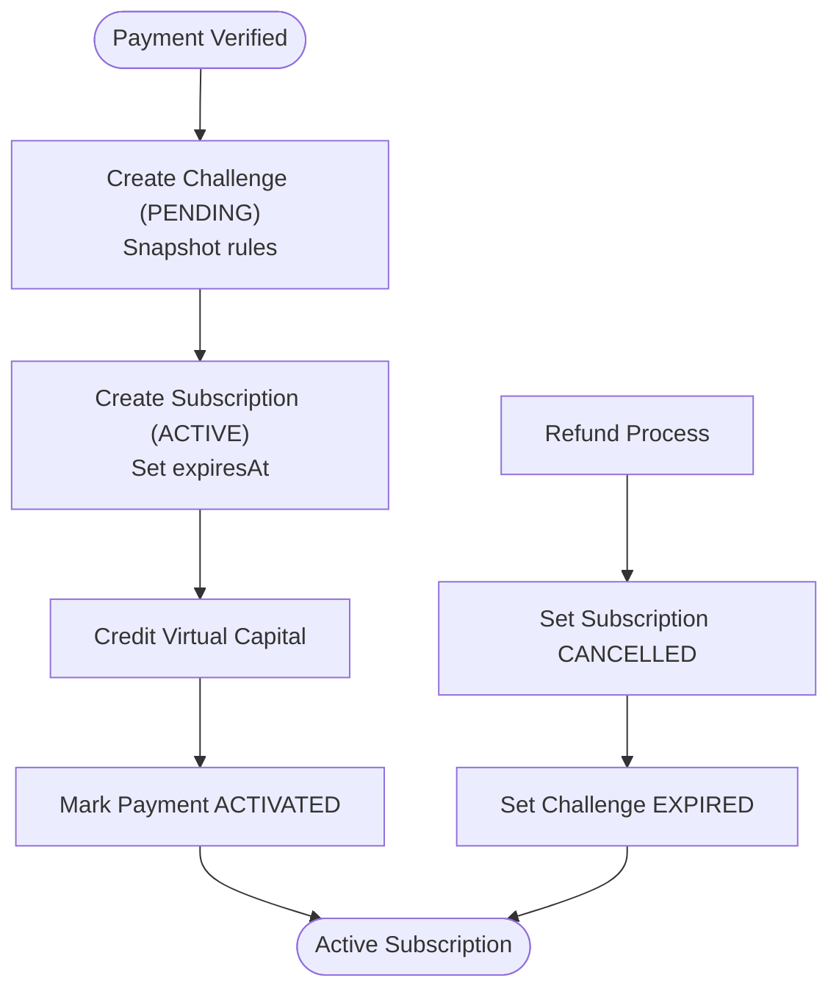
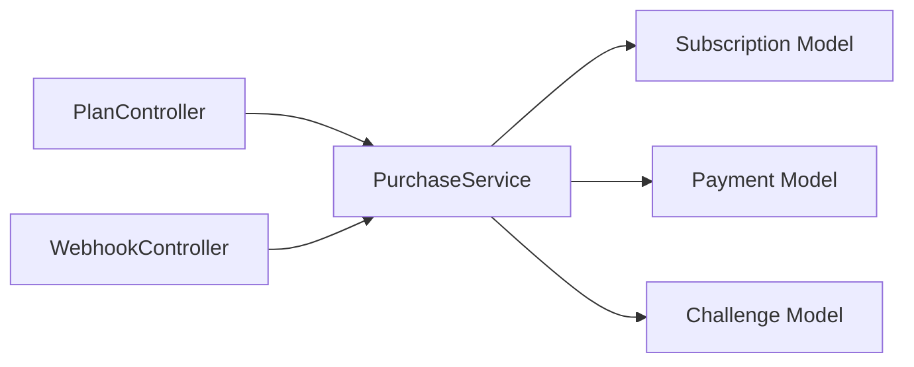

# Subscription Management APIs

<cite>
**Referenced Files in This Document**
- [plan.controller.ts](file://backend/apps/api/src/modules/plans/presentation/plan.controller.ts)
- [purchase.service.ts](file://backend/apps/api/src/modules/plans/application/purchase.service.ts)
- [plan.types.ts](file://backend/apps/api/src/modules/plans/domain/plan.types.ts)
- [subscription.schema.ts](file://backend/apps/api/src/modules/plans/infrastructure/schemas/subscription.schema.ts)
- [payment.schema.ts](file://backend/apps/api/src/modules/plans/infrastructure/schemas/payment.schema.ts)
- [challenge.schema.ts](file://backend/apps/api/src/modules/plans/infrastructure/schemas/challenge.schema.ts)
- [webhook.controller.ts](file://backend/apps/api/src/modules/plans/presentation/webhook.controller.ts)
</cite>

## Table of Contents
1. [Introduction](#introduction)
2. [Project Structure](#project-structure)
3. [Core Components](#core-components)
4. [Architecture Overview](#architecture-overview)
5. [Detailed Component Analysis](#detailed-component-analysis)
6. [Dependency Analysis](#dependency-analysis)
7. [Performance Considerations](#performance-considerations)
8. [Troubleshooting Guide](#troubleshooting-guide)
9. [Conclusion](#conclusion)

## Introduction
This document provides detailed API documentation for subscription management endpoints focused on retrieving a user’s current subscription status and payment history. It covers:
- GET /plans/me/subscription: returns the active subscription, associated challenge details, expiration dates, and renewal context.
- GET /plans/me/payments: returns the authenticated user’s payment records with transaction details and provider information.

It also explains subscription lifecycle states, auto-renewal behavior (as implemented), and cancellation processes based on the codebase.

## Project Structure
The subscription and payment features are implemented under the plans module:
- Presentation layer exposes REST endpoints and guards authentication.
- Application layer implements business logic for purchase activation, queries, and finance operations.
- Domain layer defines enums and rule structures for plans, payments, subscriptions, and challenges.
- Infrastructure layer defines Mongoose schemas for persistence.

**Diagram sources**
- [plan.controller.ts:25-62](file://backend/apps/api/src/modules/plans/presentation/plan.controller.ts#L25-L62)
- [purchase.service.ts:187-199](file://backend/apps/api/src/modules/plans/application/purchase.service.ts#L187-L199)
- [webhook.controller.ts:13-47](file://backend/apps/api/src/modules/plans/presentation/webhook.controller.ts#L13-L47)

**Section sources**
- [plan.controller.ts:25-62](file://backend/apps/api/src/modules/plans/presentation/plan.controller.ts#L25-L62)
- [purchase.service.ts:18-34](file://backend/apps/api/src/modules/plans/application/purchase.service.ts#L18-L34)

## Core Components
- PlanController: Exposes authenticated endpoints for subscription and payment retrieval.
- PurchaseService: Implements mySubscription and myPayments, orchestrating data from multiple schemas.
- Schemas: Subscription, Payment, and Challenge define the persisted entities used by these endpoints.
- Domain Types: Define state enums for PaymentStatus, SubscriptionStatus, and ChallengeStatus.

Key responsibilities:
- mySubscription: Returns the user’s active subscription and its linked challenge snapshot (rules, capital, start/end dates).
- myPayments: Lists all payments for the user sorted by creation time, including amount, currency, provider, and status.

**Section sources**
- [plan.controller.ts:52-62](file://backend/apps/api/src/modules/plans/presentation/plan.controller.ts#L52-L62)
- [purchase.service.ts:187-199](file://backend/apps/api/src/modules/plans/application/purchase.service.ts#L187-L199)
- [plan.types.ts:22-49](file://backend/apps/api/src/modules/plans/domain/plan.types.ts#L22-L49)
- [subscription.schema.ts:5-27](file://backend/apps/api/src/modules/plans/infrastructure/schemas/subscription.schema.ts#L5-L27)
- [payment.schema.ts:5-56](file://backend/apps/api/src/modules/plans/infrastructure/schemas/payment.schema.ts#L5-L56)
- [challenge.schema.ts:23-70](file://backend/apps/api/src/modules/plans/infrastructure/schemas/challenge.schema.ts#L23-L70)

## Architecture Overview
The endpoints are protected by JWT authentication and delegate to PurchaseService, which reads from MongoDB collections via Mongoose models. The subscription endpoint joins subscription and challenge data; the payments endpoint lists payment records.

**Diagram sources**
- [plan.controller.ts:52-62](file://backend/apps/api/src/modules/plans/presentation/plan.controller.ts#L52-L62)
- [purchase.service.ts:187-199](file://backend/apps/api/src/modules/plans/application/purchase.service.ts#L187-L199)

## Detailed Component Analysis

### Endpoint: GET /plans/me/subscription
- Purpose: Retrieve the authenticated user’s current active subscription, including plan details, expiration date, and challenge rules snapshot.
- Authentication: Requires valid JWT token via UserAuthGuard.
- Response:
  - If no active subscription exists: { active: null }
  - If active subscription exists: { active: { subscription, challenge } }
    - subscription fields: id, userId, planId, challengeId, paymentId, status, activatedAt, expiresAt
    - challenge fields: planName, rules (snapshotted), virtualCapitalPaise, status, startedAt, endsAt

Notes:
- Only ACTIVE subscriptions are returned.
- Challenge rules are snapshotted at activation and do not change when plan rules are updated later.

Response schema reference:
- Subscription object: see [subscription.schema.ts:5-27](file://backend/apps/api/src/modules/plans/infrastructure/schemas/subscription.schema.ts#L5-L27)
- Challenge snapshot fields: see [challenge.schema.ts:23-70](file://backend/apps/api/src/modules/plans/infrastructure/schemas/challenge.schema.ts#L23-L70)
- Status enum values: see [plan.types.ts:35-39](file://backend/apps/api/src/modules/plans/domain/plan.types.ts#L35-L39)

**Section sources**
- [plan.controller.ts:52-56](file://backend/apps/api/src/modules/plans/presentation/plan.controller.ts#L52-L56)
- [purchase.service.ts:192-199](file://backend/apps/api/src/modules/plans/application/purchase.service.ts#L192-L199)
- [subscription.schema.ts:5-27](file://backend/apps/api/src/modules/plans/infrastructure/schemas/subscription.schema.ts#L5-L27)
- [challenge.schema.ts:23-70](file://backend/apps/api/src/modules/plans/infrastructure/schemas/challenge.schema.ts#L23-L70)
- [plan.types.ts:35-39](file://backend/apps/api/src/modules/plans/domain/plan.types.ts#L35-L39)

### Endpoint: GET /plans/me/payments
- Purpose: Retrieve the authenticated user’s payment history, including transaction records, amounts, currencies, providers, and statuses.
- Authentication: Requires valid JWT token via UserAuthGuard.
- Response: Array of payment records sorted by creation time descending. Each record includes:
  - id, planId, amountPaise, currency, status, provider, createdAt
  - Optional gateway identifiers and metadata may be present depending on lifecycle stage.

Response schema reference:
- Payment object: see [payment.schema.ts:5-56](file://backend/apps/api/src/modules/plans/infrastructure/schemas/payment.schema.ts#L5-L56)
- Status enum values: see [plan.types.ts:27-33](file://backend/apps/api/src/modules/plans/domain/plan.types.ts#L27-L33)

**Section sources**
- [plan.controller.ts:58-62](file://backend/apps/api/src/modules/plans/presentation/plan.controller.ts#L58-L62)
- [purchase.service.ts:187-190](file://backend/apps/api/src/modules/plans/application/purchase.service.ts#L187-L190)
- [payment.schema.ts:5-56](file://backend/apps/api/src/modules/plans/infrastructure/schemas/payment.schema.ts#L5-L56)
- [plan.types.ts:27-33](file://backend/apps/api/src/modules/plans/domain/plan.types.ts#L27-L33)

### Subscription Lifecycle States
States are defined in domain types and used across the system:
- PaymentStatus: CREATED, CAPTURED, ACTIVATED, FAILED, REFUNDED
- SubscriptionStatus: ACTIVE, EXPIRED, CANCELLED
- ChallengeStatus: PENDING, ACTIVE, PASSED_PENDING_REVIEW, PASSED, FAILED, EXPIRED

Activation flow:
- On successful payment verification (client confirm or webhook), the system creates a challenge and subscription, credits virtual capital, and marks payment as ACTIVATED.
- The subscription is created with status ACTIVE and an expiresAt computed from plan rules.expiryDays.

Cancellation flow:
- Refund process transitions payment to REFUNDED and sets subscription status to CANCELLED if a subscription exists.
- Challenges in PENDING or ACTIVE are set to EXPIRED with an event recorded.

Auto-renewal behavior:
- There is no automatic renewal implementation in the codebase. Subscriptions have a fixed expiry window determined by plan rules.expiryDays at activation. No recurring billing or renewal scheduling is present.

**Diagram sources**
- [purchase.service.ts:105-182](file://backend/apps/api/src/modules/plans/application/purchase.service.ts#L105-L182)
- [purchase.service.ts:212-245](file://backend/apps/api/src/modules/plans/application/purchase.service.ts#L212-L245)
- [plan.types.ts:27-49](file://backend/apps/api/src/modules/plans/domain/plan.types.ts#L27-L49)

**Section sources**
- [purchase.service.ts:105-182](file://backend/apps/api/src/modules/plans/application/purchase.service.ts#L105-L182)
- [purchase.service.ts:212-245](file://backend/apps/api/src/modules/plans/application/purchase.service.ts#L212-L245)
- [plan.types.ts:27-49](file://backend/apps/api/src/modules/plans/domain/plan.types.ts#L27-L49)

### Error Handling and Status Indicators
- Authentication failures: Handled by JWT guard before reaching controller methods.
- Domain errors: Mapped to HTTP status codes via unwrap helper in controller. Examples include NOT_FOUND, KYC_REQUIRED, PLAN_UNAVAILABLE, SIGNATURE_INVALID.
- Payment terminal states: REFUNDED or FAILED block reactivation attempts.

Common error codes and meanings:
- NOT_FOUND: Resource does not exist.
- KYC_REQUIRED: User must complete KYC before purchasing.
- PLAN_UNAVAILABLE: Plan is archived or inactive.
- SIGNATURE_INVALID: Payment signature verification failed.
- PAYMENT_TERMINAL: Payment already in terminal state (REFUNDED/FAILED).

**Section sources**
- [plan.controller.ts:12-23](file://backend/apps/api/src/modules/plans/presentation/plan.controller.ts#L12-L23)
- [purchase.service.ts:40-59](file://backend/apps/api/src/modules/plans/application/purchase.service.ts#L40-L59)
- [purchase.service.ts:84-90](file://backend/apps/api/src/modules/plans/application/purchase.service.ts#L84-L90)
- [purchase.service.ts:114-119](file://backend/apps/api/src/modules/plans/application/purchase.service.ts#L114-L119)

## Dependency Analysis
The endpoints depend on:
- Authentication guard for access control.
- PurchaseService for business logic and data retrieval.
- Mongoose models for Subscription, Payment, and Challenge.
- WebhookController for server-to-server payment events that can affect subscription state indirectly.

**Diagram sources**
- [plan.controller.ts:25-62](file://backend/apps/api/src/modules/plans/presentation/plan.controller.ts#L25-L62)
- [purchase.service.ts:18-34](file://backend/apps/api/src/modules/plans/application/purchase.service.ts#L18-L34)
- [webhook.controller.ts:13-47](file://backend/apps/api/src/modules/plans/presentation/webhook.controller.ts#L13-L47)

**Section sources**
- [plan.controller.ts:25-62](file://backend/apps/api/src/modules/plans/presentation/plan.controller.ts#L25-L62)
- [purchase.service.ts:18-34](file://backend/apps/api/src/modules/plans/application/purchase.service.ts#L18-L34)
- [webhook.controller.ts:13-47](file://backend/apps/api/src/modules/plans/presentation/webhook.controller.ts#L13-L47)

## Performance Considerations
- Queries are filtered by userId and indexed fields (e.g., userId, status, createdAt) to optimize lookup performance.
- myPayments uses sort by createdAt descending to return most recent transactions first.
- Activation path uses Redis locks to ensure exactly-once crediting under concurrent webhooks and client callbacks.

[No sources needed since this section provides general guidance]

## Troubleshooting Guide
- No active subscription: GET /plans/me/subscription returns { active: null }. Verify that the user has completed checkout and that the payment was activated.
- Payment not found during activation: Ensure the gatewayOrderId matches a stored payment intent.
- Signature invalid: Check webhook signature header and raw body handling; verify gateway configuration.
- Refund issues: Confirm payment is in a refundable state and has a captured gatewayPaymentId.

Relevant flows:
- Webhook handling verifies signatures and triggers activation.
- Activation ensures idempotency and updates related entities consistently.

**Section sources**
- [webhook.controller.ts:22-47](file://backend/apps/api/src/modules/plans/presentation/webhook.controller.ts#L22-L47)
- [purchase.service.ts:84-98](file://backend/apps/api/src/modules/plans/application/purchase.service.ts#L84-L98)
- [purchase.service.ts:105-182](file://backend/apps/api/src/modules/plans/application/purchase.service.ts#L105-L182)
- [purchase.service.ts:212-245](file://backend/apps/api/src/modules/plans/application/purchase.service.ts#L212-L245)

## Conclusion
The subscription management APIs provide clear, authenticated access to a user’s active subscription and payment history. The system enforces robust state management through well-defined enums and ensures consistency via idempotent activation and audit logging. Auto-renewal is not implemented; subscriptions expire based on plan rules at activation. Cancellation is supported via refunds, which transition subscriptions to CANCELLED and challenges to EXPIRED.

[No sources needed since this section summarizes without analyzing specific files]