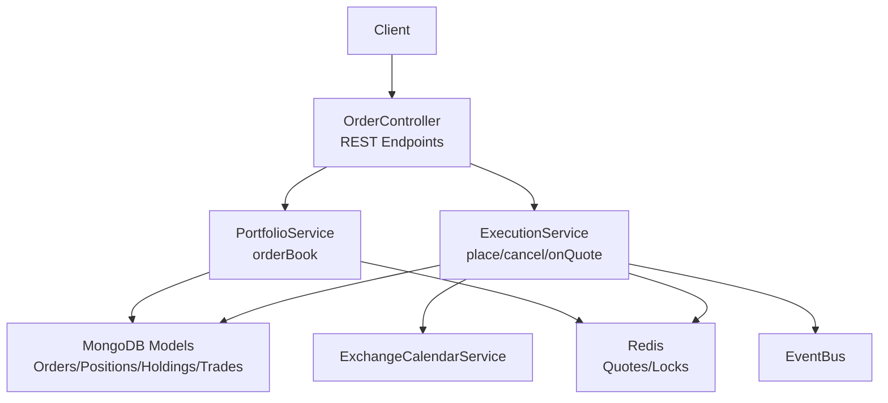
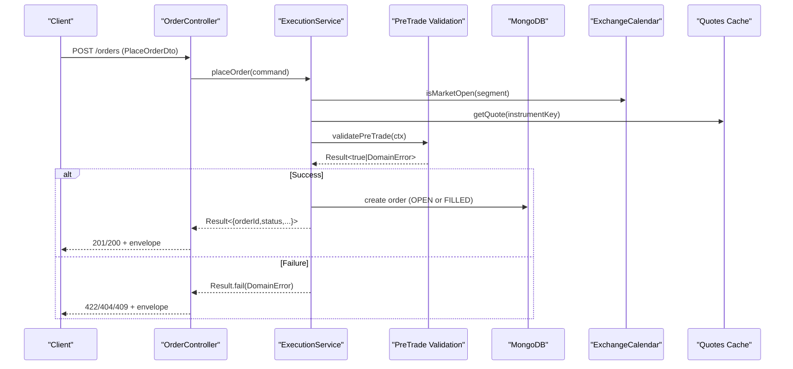
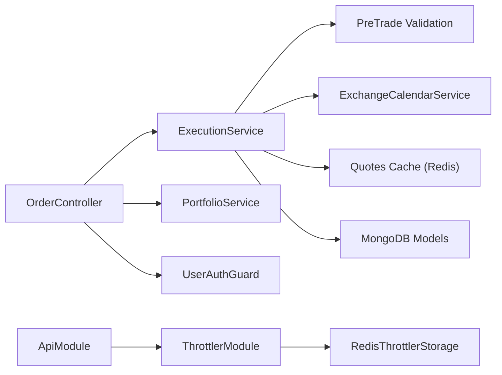

# Order Management APIs

<cite>
**Referenced Files in This Document**
- [order.controller.ts](file://backend/apps/api/src/modules/trading/presentation/order.controller.ts)
- [order.dtos.ts](file://backend/apps/api/src/modules/trading/presentation/dto/order.dtos.ts)
- [execution.service.ts](file://backend/apps/api/src/modules/trading/application/execution.service.ts)
- [portfolio.service.ts](file://backend/apps/api/src/modules/trading/application/portfolio.service.ts)
- [pre-trade.ts](file://backend/apps/api/src/modules/trading/domain/pre-trade.ts)
- [jwt-auth.guard.ts](file://backend/apps/api/src/modules/auth/presentation/jwt-auth.guard.ts)
- [api.module.ts](file://backend/apps/api/src/api.module.ts)
- [redis-throttler.storage.ts](file://backend/libs/shared/src/rate-limit/redis-throttler.storage.ts)
- [app-exception.ts](file://backend/libs/shared/src/http/app-exception.ts)
- [result.ts](file://backend/libs/shared/src/kernel/result.ts)
</cite>

## Table of Contents
1. [Introduction](#introduction)
2. [Project Structure](#project-structure)
3. [Core Components](#core-components)
4. [Architecture Overview](#architecture-overview)
5. [Detailed Component Analysis](#detailed-component-analysis)
6. [Dependency Analysis](#dependency-analysis)
7. [Performance Considerations](#performance-considerations)
8. [Troubleshooting Guide](#troubleshooting-guide)
9. [Conclusion](#conclusion)

## Introduction
This document provides detailed API documentation for order management endpoints exposed by the trading module. It covers placing orders, cancelling orders, and retrieving an order book for a challenge. It also documents validation rules, error handling scenarios (including insufficient funds and market closures), authentication via JWT tokens, and rate limiting behavior.

## Project Structure
The order management functionality is implemented as a NestJS feature module with:
- A REST controller exposing HTTP endpoints
- DTOs defining request schemas and validation rules
- Application services implementing execution and portfolio queries
- Domain logic enforcing pre-trade checks and business rules
- Shared infrastructure for authentication, throttling, and exception mapping

**Diagram sources**
- [order.controller.ts:23-46](file://backend/apps/api/src/modules/trading/presentation/order.controller.ts#L23-L46)
- [execution.service.ts:68-144](file://backend/apps/api/src/modules/trading/application/execution.service.ts#L68-L144)
- [portfolio.service.ts:34-41](file://backend/apps/api/src/modules/trading/application/portfolio.service.ts#L34-L41)

**Section sources**
- [order.controller.ts:23-46](file://backend/apps/api/src/modules/trading/presentation/order.controller.ts#L23-L46)
- [execution.service.ts:1-49](file://backend/apps/api/src/modules/trading/application/execution.service.ts#L1-L49)
- [portfolio.service.ts:14-24](file://backend/apps/api/src/modules/trading/application/portfolio.service.ts#L14-L24)

## Core Components
- OrderController: Exposes POST /orders, DELETE /orders/:orderId, GET /orders/:challengeId/book. Enforces JWT authentication and per-endpoint rate limiting on placement.
- PlaceOrderDto: Validates incoming order payloads including fields like challengeId, instrumentKey, side, type, product, qty, limitPricePaise, and trigger.
- ExecutionService: Implements order placement, cancellation, quote-driven fills, SL/target triggers, and settlement logic under per-account locks.
- PortfolioService: Provides order book retrieval and other portfolio views.
- Pre-trade Validation: Enforces business rules such as market open status, instrument availability, segment permissions, lot sizing, freeze quantity, capital sufficiency, and trigger price validity.
- Authentication Guard: Validates Bearer JWT tokens and attaches user claims to requests.
- Rate Limiting: Global default throttling configured at the API module level; endpoint-specific throttle decorator applied to order placement.

**Section sources**
- [order.controller.ts:23-46](file://backend/apps/api/src/modules/trading/presentation/order.controller.ts#L23-L46)
- [order.dtos.ts:4-21](file://backend/apps/api/src/modules/trading/presentation/dto/order.dtos.ts#L4-L21)
- [execution.service.ts:68-144](file://backend/apps/api/src/modules/trading/application/execution.service.ts#L68-L144)
- [pre-trade.ts:33-78](file://backend/apps/api/src/modules/trading/domain/pre-trade.ts#L33-L78)
- [jwt-auth.guard.ts:10-32](file://backend/apps/api/src/modules/auth/presentation/jwt-auth.guard.ts#L10-L32)
- [api.module.ts:33-45](file://backend/apps/api/src/api.module.ts#L33-L45)

## Architecture Overview
The order flow integrates REST entry points with domain validation, execution, and persistence:

**Diagram sources**
- [order.controller.ts:28-36](file://backend/apps/api/src/modules/trading/presentation/order.controller.ts#L28-L36)
- [execution.service.ts:68-129](file://backend/apps/api/src/modules/trading/application/execution.service.ts#L68-L129)
- [pre-trade.ts:33-78](file://backend/apps/api/src/modules/trading/domain/pre-trade.ts#L33-L78)

## Detailed Component Analysis

### Endpoint: POST /orders (Place Order)
- Path: POST /orders
- Authentication: Required (Bearer JWT). The controller applies a guard that validates the token and extracts user claims.
- Rate Limiting: Per-endpoint throttle decorator limits to 60 requests per 60 seconds on this endpoint.
- Request Body: PlaceOrderDto
  - challengeId: string, length 6–40
  - instrumentKey: string, length 3–120
  - side: enum "BUY" | "SELL"
  - type: enum "MARKET" | "LIMIT"
  - product: enum "INTRADAY" | "CARRY_FORWARD"
  - qty: integer, positive
  - limitPricePaise: optional integer, minimum 1 (required when type is LIMIT)
  - trigger: optional object
    - kind: enum "STOP_LOSS" | "TARGET"
    - pricePaise: integer, positive
- Response: On success, returns order placement result including orderId, status, and optionally filledPricePaise for immediate fills.
- Behavior:
  - MARKET orders are immediately filled if live quotes exist; otherwise rejected due to no market data.
  - LIMIT orders may be immediately filled if crossable; otherwise placed OPEN for engine matching.
  - Pre-trade validation enforces market status, instrument availability, segment permissions, lot size, freeze quantity, capital sufficiency, and trigger price validity.

Example Request
{
  "challengeId": "ch_abc123",
  "instrumentKey": "NSE:EQUITY:RELIANCE",
  "side": "BUY",
  "type": "LIMIT",
  "product": "INTRADAY",
  "qty": 1,
  "limitPricePaise": 245000,
  "trigger": {
    "kind": "STOP_LOSS",
    "pricePaise": 235000
  }
}

Example Responses
- 201 Created (placed):
{
  "orderId": "ord_xxx",
  "status": "OPEN"
}
- 200 OK (immediately filled):
{
  "orderId": "ord_yyy",
  "status": "FILLED",
  "filledPricePaise": 245100
}

Validation Rules
- challengeId: required, string, length 6–40
- instrumentKey: required, string, length 3–120
- side: required, must be BUY or SELL
- type: required, must be MARKET or LIMIT
- product: required, must be INTRADAY or CARRY_FORWARD
- qty: required, integer > 0
- limitPricePaise: optional, integer >= 1; required for LIMIT orders
- trigger.kind: optional, must be STOP_LOSS or TARGET
- trigger.pricePaise: optional, integer > 0

Error Handling
- Market closed: Returns 422 Unprocessable Entity with code MARKET_CLOSED.
- Insufficient funds: Returns 422 Unprocessable Entity with code INSUFFICIENT_CAPITAL, including required and available amounts.
- Instrument disabled or not allowed: Returns 422 Unprocessable Entity with codes INSTRUMENT_DISABLED or SEGMENT_NOT_ALLOWED.
- No market data for MARKET order: Returns 422 Unprocessable Entity with code NO_MARKET_DATA.
- Invalid order parameters: Returns 422 Unprocessable Entity with appropriate codes (e.g., LIMIT_PRICE_REQUIRED, TRIGGER_PRICE_INVALID).
- Challenge not found or unauthorized: Returns 404 Not Found.

Rate Limiting
- This endpoint is decorated with a throttle of 60 requests per 60 seconds.
- Global default throttling is configured at the API module level (default 120 requests per minute across routes).

Authentication
- Requires a valid Bearer JWT token in the Authorization header.
- Token verification ensures correct actor type and attaches user claims to the request context.

**Section sources**
- [order.controller.ts:28-36](file://backend/apps/api/src/modules/trading/presentation/order.controller.ts#L28-L36)
- [order.dtos.ts:4-21](file://backend/apps/api/src/modules/trading/presentation/dto/order.dtos.ts#L4-L21)
- [execution.service.ts:68-129](file://backend/apps/api/src/modules/trading/application/execution.service.ts#L68-L129)
- [pre-trade.ts:33-78](file://backend/apps/api/src/modules/trading/domain/pre-trade.ts#L33-L78)
- [api.module.ts:33-45](file://backend/apps/api/src/api.module.ts#L33-L45)
- [jwt-auth.guard.ts:10-32](file://backend/apps/api/src/modules/auth/presentation/jwt-auth.guard.ts#L10-L32)

### Endpoint: DELETE /orders/:orderId (Cancel Order)
- Path: DELETE /orders/:orderId
- Authentication: Required (Bearer JWT).
- Rate Limiting: Inherits global default throttling unless explicitly overridden.
- Behavior:
  - Locates the order and verifies ownership.
  - Only OPEN orders can be cancelled; attempts to cancel non-open orders fail.
- Response: On success, returns true.
- Errors:
  - Order not found or unauthorized: 404 Not Found.
  - Non-cancellable order: 409 Conflict with code NOT_CANCELLABLE.

Example Request
DELETE /orders/ord_xxx
Authorization: Bearer <token>

Example Responses
- 200 OK:
{
  "value": true
}
- 404 Not Found:
{
  "code": "NOT_FOUND",
  "message": "Order not found"
}
- 409 Conflict:
{
  "code": "NOT_CANCELLABLE",
  "message": "Only open orders can be cancelled"
}

**Section sources**
- [order.controller.ts:38-41](file://backend/apps/api/src/modules/trading/presentation/order.controller.ts#L38-L41)
- [execution.service.ts:132-144](file://backend/apps/api/src/modules/trading/application/execution.service.ts#L132-L144)

### Endpoint: GET /orders/:challengeId/book (Order Book)
- Path: GET /orders/:challengeId/book
- Authentication: Required (Bearer JWT).
- Behavior:
  - Retrieves open orders sorted by most recent first.
  - Retrieves recent executed orders (FILLED, CANCELLED, REJECTED) limited to last 200 entries.
- Response: Object containing two arrays: open and executed.

Example Request
GET /orders/ch_abc123/book
Authorization: Bearer <token>

Example Response
{
  "open": [/* array of open orders */],
  "executed": [/* array of recent executed orders */]
}

**Section sources**
- [order.controller.ts:43-46](file://backend/apps/api/src/modules/trading/presentation/order.controller.ts#L43-L46)
- [portfolio.service.ts:34-41](file://backend/apps/api/src/modules/trading/application/portfolio.service.ts#L34-L41)

## Dependency Analysis
The order management endpoints depend on several components:

**Diagram sources**
- [order.controller.ts:23-46](file://backend/apps/api/src/modules/trading/presentation/order.controller.ts#L23-L46)
- [execution.service.ts:1-49](file://backend/apps/api/src/modules/trading/application/execution.service.ts#L1-L49)
- [api.module.ts:33-45](file://backend/apps/api/src/api.module.ts#L33-L45)
- [redis-throttler.storage.ts:1-56](file://backend/libs/shared/src/rate-limit/redis-throttler.storage.ts#L1-L56)

**Section sources**
- [execution.service.ts:1-49](file://backend/apps/api/src/modules/trading/application/execution.service.ts#L1-L49)
- [api.module.ts:33-45](file://backend/apps/api/src/api.module.ts#L33-L45)
- [redis-throttler.storage.ts:1-56](file://backend/libs/shared/src/rate-limit/redis-throttler.storage.ts#L1-L56)

## Performance Considerations
- Per-account locking: Order placement and cancellation run under per-challenge Redis locks to ensure race-free equity and position updates.
- Quote caching: Quotes are retrieved from Redis cache to reduce latency and external calls.
- Engine-driven matching: Open limit orders are matched on quote ticks; SL/target exits are evaluated per tick for relevant instruments.
- Square-off automation: Intraday positions are automatically flattened at market cutoff times.

[No sources needed since this section provides general guidance]

## Troubleshooting Guide
Common errors and their causes:
- MARKET_CLOSED: Attempted to place an order when the market is closed for the instrument’s segment.
- INSUFFICIENT_CAPITAL: Estimated order cost exceeds available challenge equity.
- INSTRUMENT_DISABLED: The instrument is not enabled for trading.
- SEGMENT_NOT_ALLOWED: The plan does not permit trading the instrument’s segment.
- NO_MARKET_DATA: Placing a MARKET order without live quotes.
- LIMIT_PRICE_REQUIRED: Missing or invalid limit price for LIMIT orders.
- TRIGGER_PRICE_INVALID: Trigger price must be positive.
- NOT_FOUND: Challenge or order not found.
- NOT_CANCELLABLE: Cancelling a non-open order.

Mapping to HTTP status codes:
- 404 Not Found: Challenge or order not found.
- 422 Unprocessable Entity: Business validation failures (market closed, insufficient capital, etc.).
- 409 Conflict: Attempt to cancel a non-cancellable order.

Exception handling:
- Domain errors are converted to HTTP exceptions with stable machine codes and messages.
- Global exception filter and envelope interceptor standardize responses.

**Section sources**
- [pre-trade.ts:33-78](file://backend/apps/api/src/modules/trading/domain/pre-trade.ts#L33-L78)
- [execution.service.ts:68-129](file://backend/apps/api/src/modules/trading/application/execution.service.ts#L68-L129)
- [app-exception.ts:4-18](file://backend/libs/shared/src/http/app-exception.ts#L4-L18)
- [result.ts:6-16](file://backend/libs/shared/src/kernel/result.ts#L6-L16)

## Conclusion
The order management APIs provide secure, validated, and rate-limited endpoints for placing and cancelling orders and retrieving an order book. They integrate robust pre-trade validation, real-time quote-driven execution, and consistent error handling. Authentication via JWT ensures only authorized users can interact with these endpoints, while throttling protects system stability.

[No sources needed since this section summarizes without analyzing specific files]