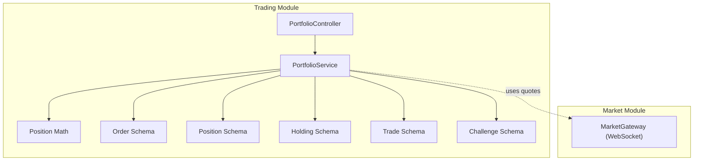
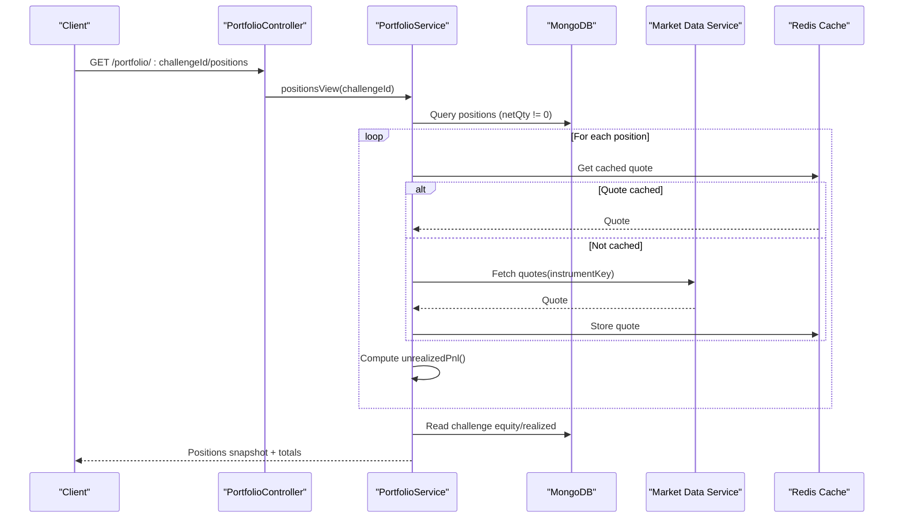
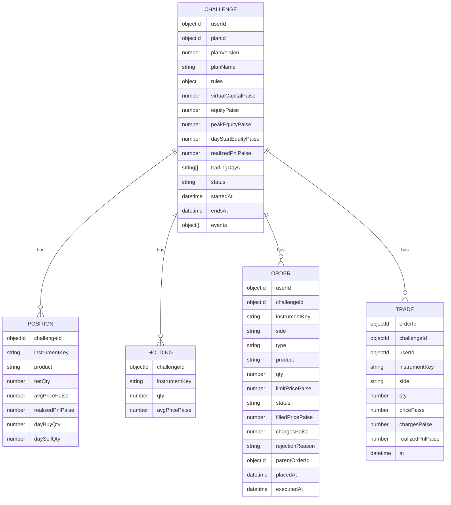
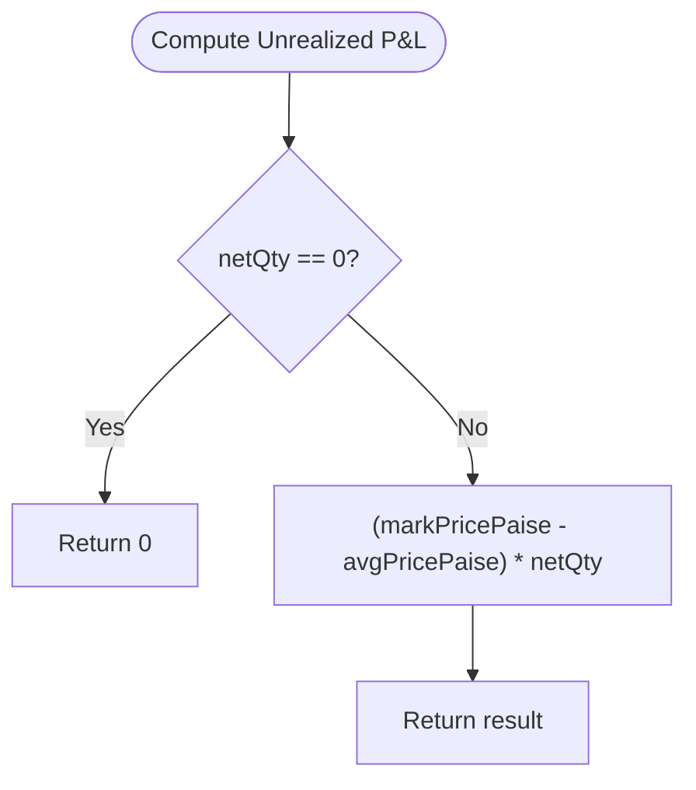
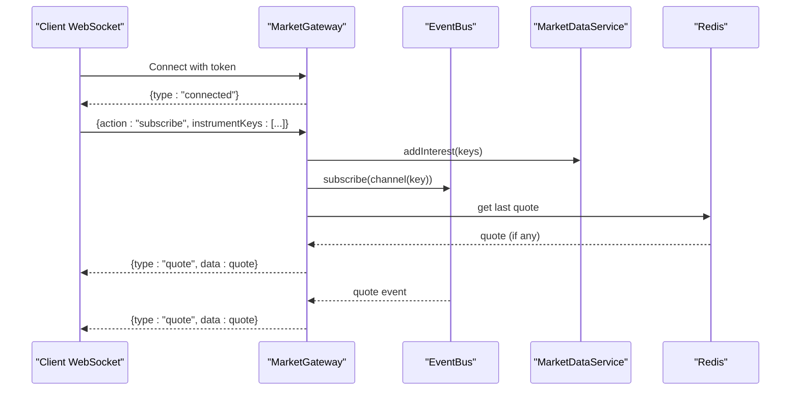
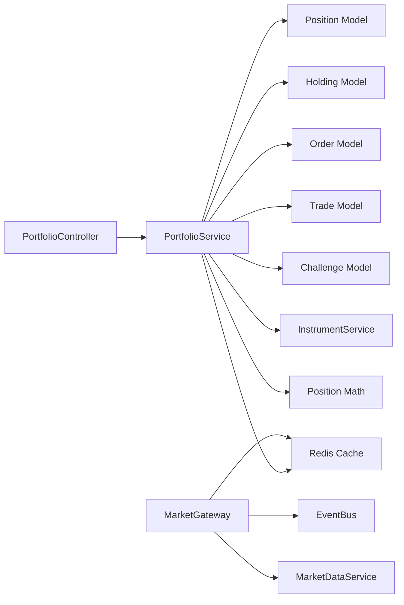

# Portfolio APIs

<cite>
**Referenced Files in This Document**
- [portfolio.controller.ts](file://backend/apps/api/src/modules/trading/presentation/portfolio.controller.ts)
- [portfolio.service.ts](file://backend/apps/api/src/modules/trading/application/portfolio.service.ts)
- [position.schema.ts](file://backend/apps/api/src/modules/trading/infrastructure/schemas/position.schema.ts)
- [holding.schema.ts](file://backend/apps/api/src/modules/trading/infrastructure/schemas/holding.schema.ts)
- [order.schema.ts](file://backend/apps/api/src/modules/trading/infrastructure/schemas/order.schema.ts)
- [trade.schema.ts](file://backend/apps/api/src/modules/trading/infrastructure/schemas/trade.schema.ts)
- [challenge.schema.ts](file://backend/apps/api/src/modules/plans/infrastructure/schemas/challenge.schema.ts)
- [position-math.ts](file://backend/apps/api/src/modules/trading/domain/position-math.ts)
- [jwt-auth.guard.ts](file://backend/apps/api/src/modules/auth/presentation/jwt-auth.guard.ts)
- [market.gateway.ts](file://backend/apps/api/src/modules/market/presentation/market.gateway.ts)
</cite>

## Table of Contents
1. [Introduction](#introduction)
2. [Project Structure](#project-structure)
3. [Core Components](#core-components)
4. [Architecture Overview](#architecture-overview)
5. [Detailed Component Analysis](#detailed-component-analysis)
6. [Dependency Analysis](#dependency-analysis)
7. [Performance Considerations](#performance-considerations)
8. [Troubleshooting Guide](#troubleshooting-guide)
9. [Conclusion](#conclusion)
10. [Appendices](#appendices)

## Introduction
This document provides comprehensive API documentation for portfolio management endpoints, including:
- Portfolio summary retrieval (positions with MTM and unrealized P&L)
- Holdings tracking (cost basis and current value)
- Position monitoring (open orders and recent trades)
- Real-time updates via WebSocket events for market quotes that drive live P&L

It also includes response schemas, example queries, performance notes, and error handling guidance for unauthorized access and data unavailability scenarios.

## Project Structure
Portfolio functionality is implemented under the trading module with a clear separation between presentation (controllers), application (services), domain (math), and infrastructure (schemas). Market data integration and real-time updates are provided by the market module’s WebSocket gateway.

**Diagram sources**
- [portfolio.controller.ts:5-23](file://backend/apps/api/src/modules/trading/presentation/portfolio.controller.ts#L5-L23)
- [portfolio.service.ts:14-88](file://backend/apps/api/src/modules/trading/application/portfolio.service.ts#L14-L88)
- [position-math.ts:26-72](file://backend/apps/api/src/modules/trading/domain/position-math.ts#L26-L72)
- [order.schema.ts:13-71](file://backend/apps/api/src/modules/trading/infrastructure/schemas/order.schema.ts#L13-L71)
- [position.schema.ts:4-34](file://backend/apps/api/src/modules/trading/infrastructure/schemas/position.schema.ts#L4-L34)
- [holding.schema.ts:4-23](file://backend/apps/api/src/modules/trading/infrastructure/schemas/holding.schema.ts#L4-L23)
- [trade.schema.ts:4-40](file://backend/apps/api/src/modules/trading/infrastructure/schemas/trade.schema.ts#L4-L40)
- [challenge.schema.ts:23-76](file://backend/apps/api/src/modules/plans/infrastructure/schemas/challenge.schema.ts#L23-L76)
- [market.gateway.ts:26-133](file://backend/apps/api/src/modules/market/presentation/market.gateway.ts#L26-L133)

**Section sources**
- [portfolio.controller.ts:5-23](file://backend/apps/api/src/modules/trading/presentation/portfolio.controller.ts#L5-L23)
- [portfolio.service.ts:14-88](file://backend/apps/api/src/modules/trading/application/portfolio.service.ts#L14-L88)
- [market.gateway.ts:26-133](file://backend/apps/api/src/modules/market/presentation/market.gateway.ts#L26-L133)

## Core Components
- PortfolioController: Exposes REST endpoints for positions, holdings, and recent trades scoped to a challengeId. Protected by JWT authentication.
- PortfolioService: Aggregates positions, holdings, orders, trades, and challenge metrics; computes unrealized P&L using position math; fetches mark prices from cache or instrument service.
- Position Math: Pure functions for applying fills and computing unrealized P&L based on weighted-average cost and signed quantities.
- Schemas: Define persistent structures for orders, positions, holdings, trades, and challenges used by the service.
- Market Gateway: Provides WebSocket-based real-time quote streaming, which drives live mark prices for P&L calculations.

**Section sources**
- [portfolio.controller.ts:5-23](file://backend/apps/api/src/modules/trading/presentation/portfolio.controller.ts#L5-L23)
- [portfolio.service.ts:14-88](file://backend/apps/api/src/modules/trading/application/portfolio.service.ts#L14-L88)
- [position-math.ts:26-72](file://backend/apps/api/src/modules/trading/domain/position-math.ts#L26-L72)
- [order.schema.ts:13-71](file://backend/apps/api/src/modules/trading/infrastructure/schemas/order.schema.ts#L13-L71)
- [position.schema.ts:4-34](file://backend/apps/api/src/modules/trading/infrastructure/schemas/position.schema.ts#L4-L34)
- [holding.schema.ts:4-23](file://backend/apps/api/src/modules/trading/infrastructure/schemas/holding.schema.ts#L4-L23)
- [trade.schema.ts:4-40](file://backend/apps/api/src/modules/trading/infrastructure/schemas/trade.schema.ts#L4-L40)
- [challenge.schema.ts:23-76](file://backend/apps/api/src/modules/plans/infrastructure/schemas/challenge.schema.ts#L23-L76)
- [market.gateway.ts:26-133](file://backend/apps/api/src/modules/market/presentation/market.gateway.ts#L26-L133)

## Architecture Overview
The portfolio API follows a layered architecture:
- Presentation layer (controller) validates requests and delegates to the service.
- Application layer (service) orchestrates data retrieval and computations.
- Domain layer (position math) encapsulates business rules for P&L.
- Infrastructure layer (schemas) models persistence.
- Market integration (gateway) supplies real-time quotes for mark pricing.

**Diagram sources**
- [portfolio.controller.ts:10-18](file://backend/apps/api/src/modules/trading/presentation/portfolio.controller.ts#L10-L18)
- [portfolio.service.ts:26-67](file://backend/apps/api/src/modules/trading/application/portfolio.service.ts#L26-L67)
- [position-math.ts:68-72](file://backend/apps/api/src/modules/trading/domain/position-math.ts#L68-L72)
- [market.gateway.ts:106-113](file://backend/apps/api/src/modules/market/presentation/market.gateway.ts#L106-L113)

## Detailed Component Analysis

### REST Endpoints
All endpoints require a valid bearer token and are scoped to a challengeId.

- GET /portfolio/:challengeId/positions
  - Purpose: Retrieve active positions with mark price, unrealized P&L, and portfolio-level totals.
  - Auth: JWT required.
  - Response fields:
    - positions: array of position items
      - instrumentKey: string
      - product: "INTRADAY" | "CARRY_FORWARD"
      - netQty: number (signed)
      - avgPricePaise: number
      - markPricePaise: number | null
      - unrealizedPnlPaise: number
      - realizedPnlPaise: number
    - totalUnrealizedPaise: number
    - equityPaise: number
    - realizedPnlPaise: number
    - mtmEquityPaise: number
  - Notes: Mark price sourced from Redis cache or instrument service; if unavailable, unrealized P&L is zeroed for that item.

- GET /portfolio/:challengeId/holdings
  - Purpose: Retrieve carry-forward holdings with cost basis and current value.
  - Auth: JWT required.
  - Response fields (array of):
    - instrumentKey: string
    - qty: number
    - avgPricePaise: number
    - markPricePaise: number | null
    - investedPaise: number
    - currentValuePaise: number
    - pnlPaise: number
  - Notes: If mark price is unavailable, currentValue equals invested.

- GET /portfolio/:challengeId/trades
  - Purpose: Retrieve recent trades for the challenge.
  - Auth: JWT required.
  - Response fields (array of):
    - orderId: ObjectId
    - challengeId: ObjectId
    - userId: ObjectId
    - instrumentKey: string
    - side: "BUY" | "SELL"
    - qty: number
    - pricePaise: number
    - chargesPaise: number
    - realizedPnlPaise: number
    - at: Date

- GET /portfolio/:challengeId/orders (internal helper)
  - Purpose: Returns open and recently executed orders for analysis.
  - Auth: JWT required.
  - Response fields:
    - open: array of order objects
    - executed: array of order objects (limited)

Error responses:
- Unauthorized: Missing or invalid/expired bearer token.
- Data unavailability: When mark prices cannot be fetched, endpoints still return partial data with null markPricePaise and zeroed unrealized P&L where applicable.

**Section sources**
- [portfolio.controller.ts:5-23](file://backend/apps/api/src/modules/trading/presentation/portfolio.controller.ts#L5-L23)
- [portfolio.service.ts:34-88](file://backend/apps/api/src/modules/trading/application/portfolio.service.ts#L34-L88)
- [jwt-auth.guard.ts:15-26](file://backend/apps/api/src/modules/auth/presentation/jwt-auth.guard.ts#L15-L26)

### Data Models and Relationships

**Diagram sources**
- [position.schema.ts:4-34](file://backend/apps/api/src/modules/trading/infrastructure/schemas/position.schema.ts#L4-L34)
- [holding.schema.ts:4-23](file://backend/apps/api/src/modules/trading/infrastructure/schemas/holding.schema.ts#L4-L23)
- [order.schema.ts:13-71](file://backend/apps/api/src/modules/trading/infrastructure/schemas/order.schema.ts#L13-L71)
- [trade.schema.ts:4-40](file://backend/apps/api/src/modules/trading/infrastructure/schemas/trade.schema.ts#L4-L40)
- [challenge.schema.ts:23-76](file://backend/apps/api/src/modules/plans/infrastructure/schemas/challenge.schema.ts#L23-L76)

### P&L Calculation Logic
Unrealized P&L is computed per position using mark price and weighted-average cost. The logic supports long and short positions and integrates realized P&L tracked in the position record.

**Diagram sources**
- [position-math.ts:68-72](file://backend/apps/api/src/modules/trading/domain/position-math.ts#L68-L72)

**Section sources**
- [position-math.ts:26-72](file://backend/apps/api/src/modules/trading/domain/position-math.ts#L26-L72)
- [portfolio.service.ts:44-67](file://backend/apps/api/src/modules/trading/application/portfolio.service.ts#L44-L67)

### Real-Time Updates via WebSocket
Clients can subscribe to instrument quotes to receive live mark prices. These quotes feed into mark price lookups used by portfolio endpoints.

**Diagram sources**
- [market.gateway.ts:48-133](file://backend/apps/api/src/modules/market/presentation/market.gateway.ts#L48-L133)

**Section sources**
- [market.gateway.ts:48-133](file://backend/apps/api/src/modules/market/presentation/market.gateway.ts#L48-L133)

## Dependency Analysis
- Controller depends on PortfolioService for all portfolio operations.
- Service depends on:
  - MongoDB models: Order, Position, Holding, Trade, Challenge
  - Redis for quote caching
  - InstrumentService for fetching quotes when not cached
  - Position math for P&L calculations
- MarketGateway depends on TokenService, EventBus, MarketDataService, and Redis for quote distribution.

**Diagram sources**
- [portfolio.controller.ts:5-23](file://backend/apps/api/src/modules/trading/presentation/portfolio.controller.ts#L5-L23)
- [portfolio.service.ts:14-88](file://backend/apps/api/src/modules/trading/application/portfolio.service.ts#L14-L88)
- [market.gateway.ts:26-133](file://backend/apps/api/src/modules/market/presentation/market.gateway.ts#L26-L133)

**Section sources**
- [portfolio.controller.ts:5-23](file://backend/apps/api/src/modules/trading/presentation/portfolio.controller.ts#L5-L23)
- [portfolio.service.ts:14-88](file://backend/apps/api/src/modules/trading/application/portfolio.service.ts#L14-L88)
- [market.gateway.ts:26-133](file://backend/apps/api/src/modules/market/presentation/market.gateway.ts#L26-L133)

## Performance Considerations
- Quote caching: Mark prices are retrieved from Redis first to minimize latency and external calls.
- Batch quote fetching: When cache misses occur, quotes are fetched per instrument key; consider batching keys to reduce overhead.
- Indexing: Collections use indexes on challengeId and timestamps to optimize queries for positions, holdings, orders, and trades.
- Limits: Recent trades endpoint supports a configurable limit to control payload size.

[No sources needed since this section provides general guidance]

## Troubleshooting Guide
Common issues and resolutions:
- Unauthorized access:
  - Symptom: 401 Unauthorized with message indicating missing or invalid/expired token.
  - Cause: Missing or malformed Authorization header or expired JWT.
  - Resolution: Ensure a valid bearer token is included in requests.
- Data unavailability:
  - Symptom: Mark prices are null; unrealized P&L is zeroed for affected instruments.
  - Cause: Quote cache miss and inability to fetch from market data service.
  - Resolution: Verify market data connectivity and ensure subscriptions are active; retry after quotes become available.

**Section sources**
- [jwt-auth.guard.ts:15-26](file://backend/apps/api/src/modules/auth/presentation/jwt-auth.guard.ts#L15-L26)
- [portfolio.service.ts:26-32](file://backend/apps/api/src/modules/trading/application/portfolio.service.ts#L26-L32)

## Conclusion
The portfolio APIs provide robust endpoints for retrieving positions, holdings, and trade history, along with real-time quote streaming to support live P&L calculations. Authentication ensures secure access, while caching and indexing strategies maintain performance. Use the documented schemas and examples to integrate effectively and handle errors gracefully.

[No sources needed since this section summarizes without analyzing specific files]

## Appendices

### Example Queries
- Query current portfolio state:
  - GET /portfolio/{challengeId}/positions
  - GET /portfolio/{challengeId}/holdings
- Analyze position concentrations:
  - Use positions response to compute aggregate exposure by instrument or product type.
- Track performance over time:
  - Use trades response to reconstruct realized P&L over time; combine with challenge equity fields for MTM trends.

[No sources needed since this section provides usage guidance]