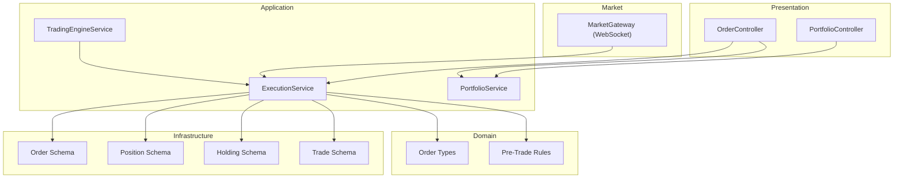
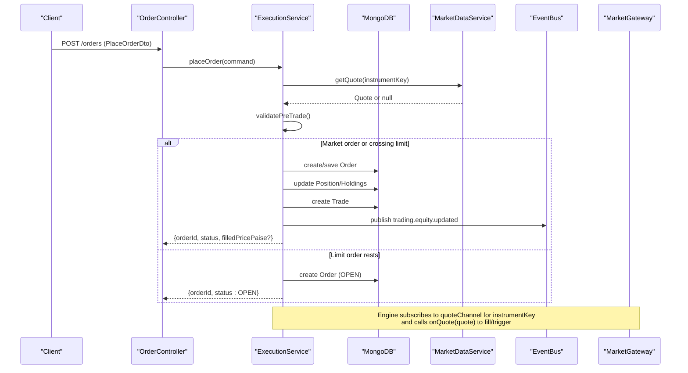
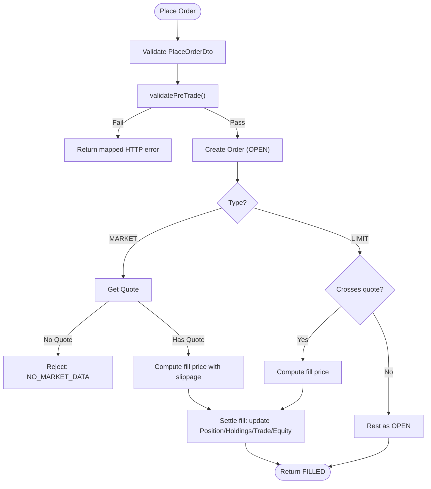
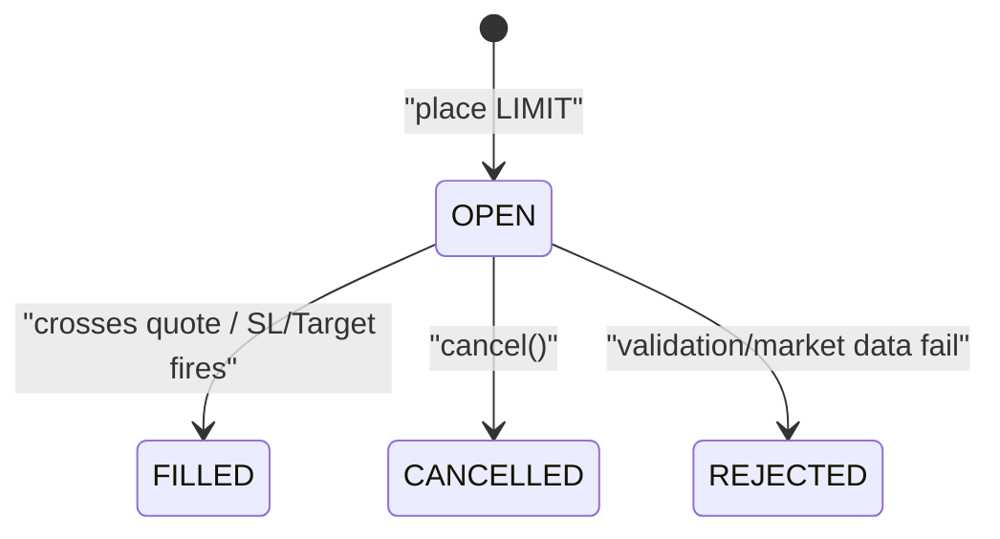
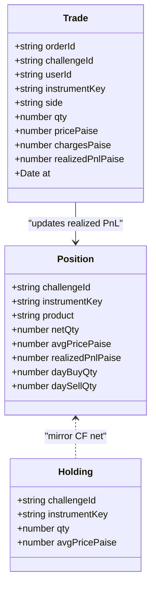
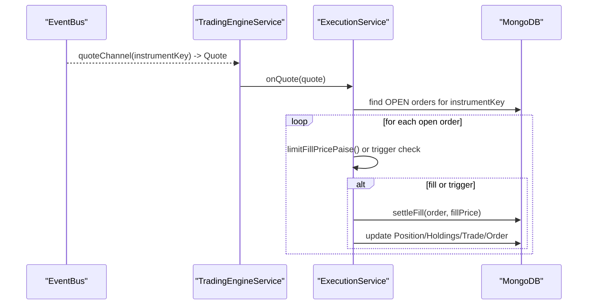
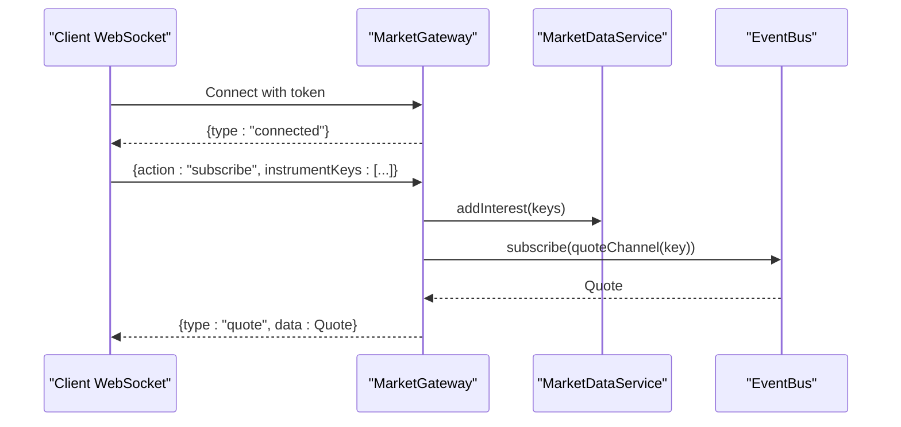
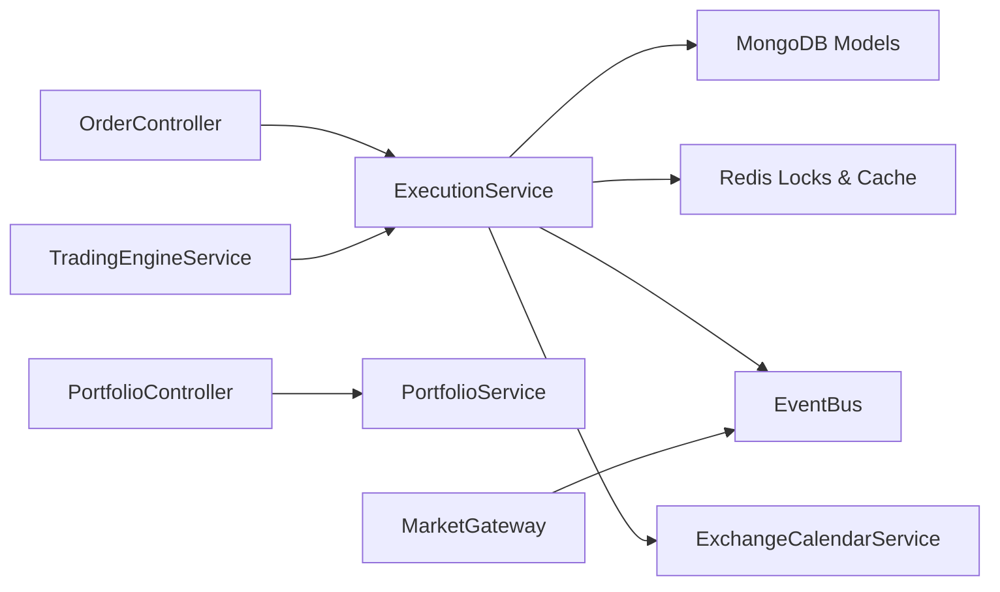

# Trading APIs

<cite>
**Referenced Files in This Document**
- [order.controller.ts](file://backend/apps/api/src/modules/trading/presentation/order.controller.ts)
- [portfolio.controller.ts](file://backend/apps/api/src/modules/trading/presentation/portfolio.controller.ts)
- [order.dtos.ts](file://backend/apps/api/src/modules/trading/presentation/dto/order.dtos.ts)
- [execution.service.ts](file://backend/apps/api/src/modules/trading/application/execution.service.ts)
- [trading-engine.service.ts](file://backend/apps/api/src/modules/trading/application/trading-engine.service.ts)
- [portfolio.service.ts](file://backend/apps/api/src/modules/trading/application/portfolio.service.ts)
- [order.types.ts](file://backend/apps/api/src/modules/trading/domain/order.types.ts)
- [pre-trade.ts](file://backend/apps/api/src/modules/trading/domain/pre-trade.ts)
- [order.schema.ts](file://backend/apps/api/src/modules/trading/infrastructure/schemas/order.schema.ts)
- [position.schema.ts](file://backend/apps/api/src/modules/trading/infrastructure/schemas/position.schema.ts)
- [trade.schema.ts](file://backend/apps/api/src/modules/trading/infrastructure/schemas/trade.schema.ts)
- [holding.schema.ts](file://backend/apps/api/src/modules/trading/infrastructure/schemas/holding.schema.ts)
- [market.gateway.ts](file://backend/apps/api/src/modules/market/presentation/market.gateway.ts)
- [app-exception.ts](file://backend/libs/shared/src/http/app-exception.ts)
</cite>

## Table of Contents
1. Introduction
2. Project Structure
3. Core Components
4. Architecture Overview
5. Detailed Component Analysis
6. Dependency Analysis
7. Performance Considerations
8. Troubleshooting Guide
9. Conclusion
10. Appendices

## Introduction
This document provides comprehensive API documentation for the trading module, covering order placement and management, portfolio tracking, position monitoring, trade history, validation and risk checks, execution simulation logic, error handling, and real-time updates via WebSocket events. It is designed to be accessible to both technical and non-technical users while providing precise schemas, flows, and examples.

## Project Structure
The trading functionality is implemented as a NestJS module with clear separation between presentation (controllers), application (services), domain (types and rules), and infrastructure (schemas). Market data and WebSocket streaming are provided by a dedicated market module.

**Diagram sources**
- [order.controller.ts:23-46](file://backend/apps/api/src/modules/trading/presentation/order.controller.ts#L23-L46)
- [portfolio.controller.ts:5-23](file://backend/apps/api/src/modules/trading/presentation/portfolio.controller.ts#L5-L23)
- [execution.service.ts:31-49](file://backend/apps/api/src/modules/trading/application/execution.service.ts#L31-L49)
- [portfolio.service.ts:14-24](file://backend/apps/api/src/modules/trading/application/portfolio.service.ts#L14-L24)
- [trading-engine.service.ts:16-28](file://backend/apps/api/src/modules/trading/application/trading-engine.service.ts#L16-L28)
- [order.types.ts:1-32](file://backend/apps/api/src/modules/trading/domain/order.types.ts#L1-L32)
- [pre-trade.ts:1-25](file://backend/apps/api/src/modules/trading/domain/pre-trade.ts#L1-L25)
- [order.schema.ts:13-71](file://backend/apps/api/src/modules/trading/infrastructure/schemas/order.schema.ts#L13-L71)
- [position.schema.ts:4-34](file://backend/apps/api/src/modules/trading/infrastructure/schemas/position.schema.ts#L4-L34)
- [holding.schema.ts:4-23](file://backend/apps/api/src/modules/trading/infrastructure/schemas/holding.schema.ts#L4-L23)
- [trade.schema.ts:4-40](file://backend/apps/api/src/modules/trading/infrastructure/schemas/trade.schema.ts#L4-L40)
- [market.gateway.ts:26-42](file://backend/apps/api/src/modules/market/presentation/market.gateway.ts#L26-L42)

**Section sources**
- [order.controller.ts:23-46](file://backend/apps/api/src/modules/trading/presentation/order.controller.ts#L23-L46)
- [portfolio.controller.ts:5-23](file://backend/apps/api/src/modules/trading/presentation/portfolio.controller.ts#L5-L23)
- [execution.service.ts:31-49](file://backend/apps/api/src/modules/trading/application/execution.service.ts#L31-L49)
- [portfolio.service.ts:14-24](file://backend/apps/api/src/modules/trading/application/portfolio.service.ts#L14-L24)
- [trading-engine.service.ts:16-28](file://backend/apps/api/src/modules/trading/application/trading-engine.service.ts#L16-L28)
- [order.types.ts:1-32](file://backend/apps/api/src/modules/trading/domain/order.types.ts#L1-L32)
- [pre-trade.ts:1-25](file://backend/apps/api/src/modules/trading/domain/pre-trade.ts#L1-L25)
- [order.schema.ts:13-71](file://backend/apps/api/src/modules/trading/infrastructure/schemas/order.schema.ts#L13-L71)
- [position.schema.ts:4-34](file://backend/apps/api/src/modules/trading/infrastructure/schemas/position.schema.ts#L4-L34)
- [holding.schema.ts:4-23](file://backend/apps/api/src/modules/trading/infrastructure/schemas/holding.schema.ts#L4-L23)
- [trade.schema.ts:4-40](file://backend/apps/api/src/modules/trading/infrastructure/schemas/trade.schema.ts#L4-L40)
- [market.gateway.ts:26-42](file://backend/apps/api/src/modules/market/presentation/market.gateway.ts#L26-L42)

## Core Components
- OrderController: REST endpoints for placing orders, cancelling open orders, and retrieving the order book.
- PortfolioController: Endpoints for positions, holdings, and recent trades.
- ExecutionService: Virtual execution engine that validates, places, fills, cancels, and settles orders; also handles SL/Target triggers and square-off.
- PortfolioService: Aggregates positions, holdings, and trades with live mark prices and P&L calculations.
- TradingEngineService: Subscribes to quote channels for instruments with open orders and drives tick-based matching and square-off.
- MarketGateway: WebSocket gateway for real-time quotes and subscription management.

Key request/response types:
- PlaceOrderDto: Validates and captures order placement inputs.
- Order status enum: OPEN, FILLED, CANCELLED, REJECTED.
- Trigger: STOP_LOSS or TARGET with price in paise.
- Position view: Includes net quantity, average price, realized/unrealized P&L, and MTM equity.
- Holdings view: Carried-forward positions with invested/current values.
- Trade records: Executed trades with price, charges, and realized P&L.

**Section sources**
- [order.controller.ts:23-46](file://backend/apps/api/src/modules/trading/presentation/order.controller.ts#L23-L46)
- [portfolio.controller.ts:5-23](file://backend/apps/api/src/modules/trading/presentation/portfolio.controller.ts#L5-L23)
- [execution.service.ts:66-144](file://backend/apps/api/src/modules/trading/application/execution.service.ts#L66-L144)
- [portfolio.service.ts:34-88](file://backend/apps/api/src/modules/trading/application/portfolio.service.ts#L34-L88)
- [order.types.ts:1-32](file://backend/apps/api/src/modules/trading/domain/order.types.ts#L1-L32)
- [order.dtos.ts:4-21](file://backend/apps/api/src/modules/trading/presentation/dto/order.dtos.ts#L4-L21)

## Architecture Overview
The system uses a virtual execution engine (VEE) that runs under per-account locks to ensure race-free equity and drawdown math. Orders are validated against pre-trade rules, then either immediately filled (market or crossing limit) or rested (limit). The engine subscribes to quote streams for instruments with open orders, firing SL/Target exits when triggered. Real-time quotes are delivered to clients via WebSocket.

**Diagram sources**
- [order.controller.ts:28-46](file://backend/apps/api/src/modules/trading/presentation/order.controller.ts#L28-L46)
- [execution.service.ts:66-177](file://backend/apps/api/src/modules/trading/application/execution.service.ts#L66-L177)
- [trading-engine.service.ts:39-47](file://backend/apps/api/src/modules/trading/application/trading-engine.service.ts#L39-L47)
- [market.gateway.ts:91-113](file://backend/apps/api/src/modules/market/presentation/market.gateway.ts#L91-L113)

## Detailed Component Analysis

### Order Placement and Management
- Endpoints:
  - POST /orders: Place an order with validation and immediate execution if applicable.
  - DELETE /orders/:orderId: Cancel an open order.
  - GET /orders/:challengeId/book: Retrieve open and recent executed orders.
- Request schema (PlaceOrderDto):
  - challengeId: string (length 6–40)
  - instrumentKey: string (length 3–120)
  - side: BUY | SELL
  - type: MARKET | LIMIT
  - product: INTRADAY | CARRY_FORWARD
  - qty: positive integer
  - limitPricePaise: optional positive integer (required for LIMIT)
  - trigger: optional object with kind STOP_LOSS | TARGET and pricePaise positive integer
- Response:
  - On success: orderId, status (FILLED or OPEN), and optionally filledPricePaise for immediate fills.
  - On failure: HTTP status mapped from domain errors (e.g., UNPROCESSABLE_ENTITY for validation/risk failures, CONFLICT for non-cancellable, NOT_FOUND for missing entities).
- Validation and risk checks:
  - Challenge must be tradable (PENDING/ACTIVE).
  - Market must be open for the segment.
  - Instrument must be enabled and allowed by plan segments.
  - Quantity must respect lot size and freeze limits.
  - LIMIT orders require a positive limit price.
  - Trigger price must be positive.
  - Estimated cost must not exceed available equity (buy-side capital check).
- Execution simulation:
  - Market orders use last traded price with configured slippage to compute fill price.
  - Limit orders are instantly filled if they cross the current quote; otherwise rest as OPEN.
  - SL/Target orders fire when the quote breaches thresholds, converting to market-like fills.

**Diagram sources**
- [order.dtos.ts:4-21](file://backend/apps/api/src/modules/trading/presentation/dto/order.dtos.ts#L4-L21)
- [pre-trade.ts:29-78](file://backend/apps/api/src/modules/trading/domain/pre-trade.ts#L29-L78)
- [execution.service.ts:66-129](file://backend/apps/api/src/modules/trading/application/execution.service.ts#L66-L129)

**Section sources**
- [order.controller.ts:28-46](file://backend/apps/api/src/modules/trading/presentation/order.controller.ts#L28-L46)
- [order.dtos.ts:4-21](file://backend/apps/api/src/modules/trading/presentation/dto/order.dtos.ts#L4-L21)
- [pre-trade.ts:29-78](file://backend/apps/api/src/modules/trading/domain/pre-trade.ts#L29-L78)
- [execution.service.ts:66-129](file://backend/apps/api/src/modules/trading/application/execution.service.ts#L66-L129)

### Order Status Updates and Cancellation
- Status transitions:
  - OPEN: resting limit order awaiting fill.
  - FILLED: executed with recorded price, charges, and realized P&L.
  - CANCELLED: successfully cancelled before fill.
  - REJECTED: failed validation or market data constraints.
- Cancellation:
  - Only OPEN orders can be cancelled; attempts on non-open orders return a conflict error.
- Persistence:
  - Order documents store status, timestamps, and rejection reasons.

**Diagram sources**
- [order.types.ts:5-10](file://backend/apps/api/src/modules/trading/domain/order.types.ts#L5-L10)
- [execution.service.ts:132-144](file://backend/apps/api/src/modules/trading/application/execution.service.ts#L132-L144)
- [order.schema.ts:42-63](file://backend/apps/api/src/modules/trading/infrastructure/schemas/order.schema.ts#L42-L63)

**Section sources**
- [execution.service.ts:132-144](file://backend/apps/api/src/modules/trading/application/execution.service.ts#L132-L144)
- [order.types.ts:5-10](file://backend/apps/api/src/modules/trading/domain/order.types.ts#L5-L10)
- [order.schema.ts:42-63](file://backend/apps/api/src/modules/trading/infrastructure/schemas/order.schema.ts#L42-L63)

### Portfolio Tracking and Position Monitoring
- Endpoints:
  - GET /portfolio/:challengeId/positions: Positions with mark prices and unrealized P&L; includes total unrealized, realized P&L, equity, and MTM equity.
  - GET /portfolio/:challengeId/holdings: Carry-forward holdings with invested/current values and P&L.
  - GET /portfolio/:challengeId/trades: Recent trades sorted by time.
- Data model highlights:
  - Position: netQty, avgPricePaise, realizedPnlPaise, dayBuyQty, daySellQty.
  - Holding: qty, avgPricePaise for overnight carry.
  - Trade: orderId, instrumentKey, side, qty, pricePaise, chargesPaise, realizedPnlPaise, timestamp.

**Diagram sources**
- [position.schema.ts:4-34](file://backend/apps/api/src/modules/trading/infrastructure/schemas/position.schema.ts#L4-L34)
- [holding.schema.ts:4-23](file://backend/apps/api/src/modules/trading/infrastructure/schemas/holding.schema.ts#L4-L23)
- [trade.schema.ts:4-40](file://backend/apps/api/src/modules/trading/infrastructure/schemas/trade.schema.ts#L4-L40)

**Section sources**
- [portfolio.controller.ts:10-23](file://backend/apps/api/src/modules/trading/presentation/portfolio.controller.ts#L10-L23)
- [portfolio.service.ts:43-88](file://backend/apps/api/src/modules/trading/application/portfolio.service.ts#L43-L88)
- [position.schema.ts:4-34](file://backend/apps/api/src/modules/trading/infrastructure/schemas/position.schema.ts#L4-L34)
- [holding.schema.ts:4-23](file://backend/apps/api/src/modules/trading/infrastructure/schemas/holding.schema.ts#L4-L23)
- [trade.schema.ts:4-40](file://backend/apps/api/src/modules/trading/infrastructure/schemas/trade.schema.ts#L4-L40)

### Execution Simulation Logic and Tick Processing
- Quote-driven matching:
  - Engine subscribes to quote channels for instruments with OPEN orders.
  - For each quote, it evaluates open orders:
    - Limit orders: fill if crossing.
    - SL/Target: fire when breached, using market-like fill with slippage.
- Square-off:
  - At market cutoff, intraday positions are auto-flattened via market orders.

**Diagram sources**
- [trading-engine.service.ts:39-47](file://backend/apps/api/src/modules/trading/application/trading-engine.service.ts#L39-L47)
- [execution.service.ts:148-177](file://backend/apps/api/src/modules/trading/application/execution.service.ts#L148-L177)
- [execution.service.ts:181-262](file://backend/apps/api/src/modules/trading/application/execution.service.ts#L181-L262)

**Section sources**
- [trading-engine.service.ts:39-65](file://backend/apps/api/src/modules/trading/application/trading-engine.service.ts#L39-L65)
- [execution.service.ts:148-177](file://backend/apps/api/src/modules/trading/application/execution.service.ts#L148-L177)
- [execution.service.ts:181-262](file://backend/apps/api/src/modules/trading/application/execution.service.ts#L181-L262)

### Real-Time Order Updates via WebSocket Events
- WebSocket endpoint: /ws
- Authentication: JWT token passed in query parameter.
- Subscription model:
  - Clients send subscribe messages with instrumentKeys to join rooms.
  - First subscriber per instrument bumps upstream interest; last leaves drops interest.
  - On join, client receives cached last quote followed by live ticks.
- Events:
  - connected: connection established.
  - quote: live quote payload for subscribed instruments.

**Diagram sources**
- [market.gateway.ts:48-113](file://backend/apps/api/src/modules/market/presentation/market.gateway.ts#L48-L113)
- [market.gateway.ts:125-132](file://backend/apps/api/src/modules/market/presentation/market.gateway.ts#L125-L132)

**Section sources**
- [market.gateway.ts:48-113](file://backend/apps/api/src/modules/market/presentation/market.gateway.ts#L48-L113)
- [market.gateway.ts:125-132](file://backend/apps/api/src/modules/market/presentation/market.gateway.ts#L125-L132)

## Dependency Analysis
- Controllers depend on services for business logic and persistence.
- ExecutionService depends on:
  - MongoDB models for orders, positions, holdings, trades, challenges, ledger, instruments.
  - Redis for locking and quote caching.
  - EventBus for publishing equity updates and subscribing to quotes.
  - ExchangeCalendarService for market open/closed checks and square-off timing.
- TradingEngineService orchestrates subscriptions and periodic square-off.
- PortfolioService aggregates views using live quotes and persisted state.

**Diagram sources**
- [order.controller.ts:23-46](file://backend/apps/api/src/modules/trading/presentation/order.controller.ts#L23-L46)
- [portfolio.controller.ts:5-23](file://backend/apps/api/src/modules/trading/presentation/portfolio.controller.ts#L5-L23)
- [execution.service.ts:31-49](file://backend/apps/api/src/modules/trading/application/execution.service.ts#L31-L49)
- [trading-engine.service.ts:16-28](file://backend/apps/api/src/modules/trading/application/trading-engine.service.ts#L16-L28)
- [market.gateway.ts:26-42](file://backend/apps/api/src/modules/market/presentation/market.gateway.ts#L26-L42)

**Section sources**
- [execution.service.ts:31-49](file://backend/apps/api/src/modules/trading/application/execution.service.ts#L31-L49)
- [trading-engine.service.ts:16-28](file://backend/apps/api/src/modules/trading/application/trading-engine.service.ts#L16-L28)
- [market.gateway.ts:26-42](file://backend/apps/api/src/modules/market/presentation/market.gateway.ts#L26-L42)

## Performance Considerations
- Per-account Redis locks prevent race conditions during equity and position updates.
- Quote caching reduces repeated lookups for pricing.
- Partial indexes optimize queries for open orders and recent trades.
- Batch operations where possible (e.g., upserts for positions and holdings).
- Rate limiting on order placement protects backend resources.

[No sources needed since this section provides general guidance]

## Troubleshooting Guide
Common errors and their meanings:
- CHALLENGE_NOT_TRADABLE: Challenge is not in a tradable state; verify plan activation.
- MARKET_CLOSED: Market is closed for the instrument’s segment; check exchange calendar.
- INSTRUMENT_DISABLED: Instrument is disabled; confirm availability.
- SEGMENT_NOT_ALLOWED: Plan does not allow trading the instrument’s segment; review plan rules.
- INSUFFICIENT_CAPITAL: Estimated order value exceeds available equity; reduce quantity or increase equity.
- FREEZE_QTY_EXCEEDED: Quantity exceeds freeze limit; adjust to within limits.
- NO_MARKET_DATA: No live price available; retry later or choose another instrument.
- NOT_CANCELLABLE: Order cannot be cancelled (not OPEN); check order status.
- LIMIT_PRICE_REQUIRED: Missing or invalid limit price for LIMIT orders; provide a positive price.
- TRIGGER_PRICE_INVALID: Trigger price must be positive; correct the trigger configuration.

HTTP mapping:
- Domain errors map to appropriate HTTP statuses (e.g., UNPROCESSABLE_ENTITY for validation/risk failures, CONFLICT for cancellation conflicts, NOT_FOUND for missing entities).

**Section sources**
- [order.controller.ts:11-21](file://backend/apps/api/src/modules/trading/presentation/order.controller.ts#L11-L21)
- [pre-trade.ts:29-78](file://backend/apps/api/src/modules/trading/domain/pre-trade.ts#L29-L78)
- [app-exception.ts:4-18](file://backend/libs/shared/src/http/app-exception.ts#L4-L18)

## Conclusion
The trading APIs provide a robust virtual execution engine with strong validation, risk controls, and real-time capabilities. Orders are validated against comprehensive pre-trade rules, executed with realistic simulation logic, and tracked through positions, holdings, and trades. Real-time updates are delivered via WebSocket, enabling responsive trading experiences. Error handling is consistent and machine-readable, facilitating reliable client integrations.

[No sources needed since this section summarizes without analyzing specific files]

## Appendices

### API Reference Summary
- Order Placement
  - Method: POST
  - Path: /orders
  - Body: PlaceOrderDto
  - Success: { orderId, status, filledPricePaise? }
  - Errors: Mapped domain errors with appropriate HTTP status
- Order Cancellation
  - Method: DELETE
  - Path: /orders/:orderId
  - Success: true
  - Errors: NOT_CANCELLABLE if order not OPEN
- Order Book
  - Method: GET
  - Path: /orders/:challengeId/book
  - Response: { open, executed }
- Positions
  - Method: GET
  - Path: /portfolio/:challengeId/positions
  - Response: { positions[], totalUnrealizedPaise, equityPaise, realizedPnlPaise, mtmEquityPaise }
- Holdings
  - Method: GET
  - Path: /portfolio/:challengeId/holdings
  - Response: [{ instrumentKey, qty, avgPricePaise, markPricePaise?, investedPaise, currentValuePaise, pnlPaise }]
- Trades
  - Method: GET
  - Path: /portfolio/:challengeId/trades
  - Response: Array of Trade objects

**Section sources**
- [order.controller.ts:28-46](file://backend/apps/api/src/modules/trading/presentation/order.controller.ts#L28-L46)
- [portfolio.controller.ts:10-23](file://backend/apps/api/src/modules/trading/presentation/portfolio.controller.ts#L10-L23)
- [portfolio.service.ts:34-88](file://backend/apps/api/src/modules/trading/application/portfolio.service.ts#L34-L88)
- [order.dtos.ts:4-21](file://backend/apps/api/src/modules/trading/presentation/dto/order.dtos.ts#L4-L21)
- [order.types.ts:1-32](file://backend/apps/api/src/modules/trading/domain/order.types.ts#L1-L32)
- [trade.schema.ts:4-40](file://backend/apps/api/src/modules/trading/infrastructure/schemas/trade.schema.ts#L4-L40)