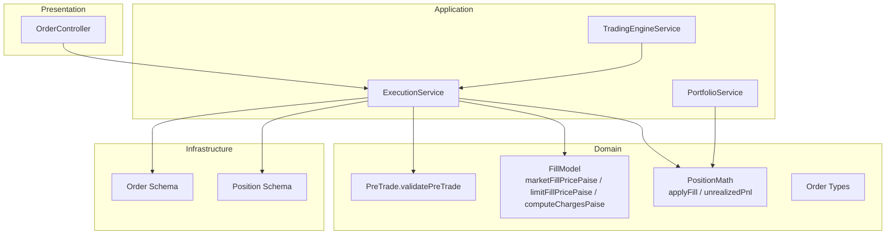
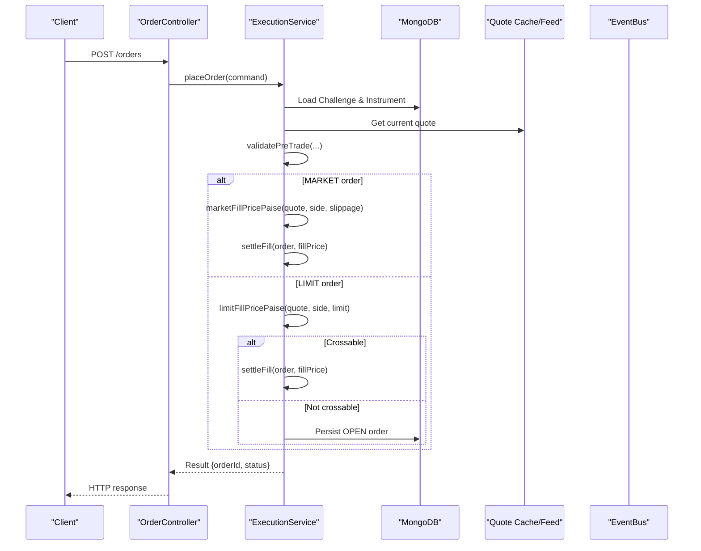
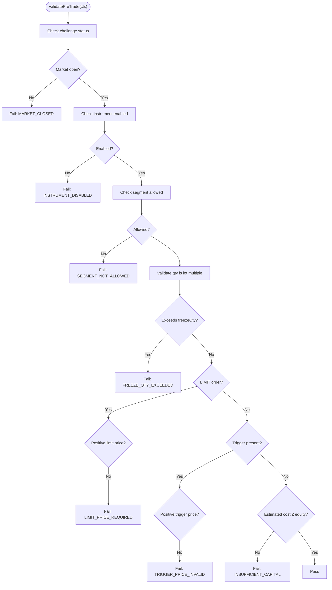
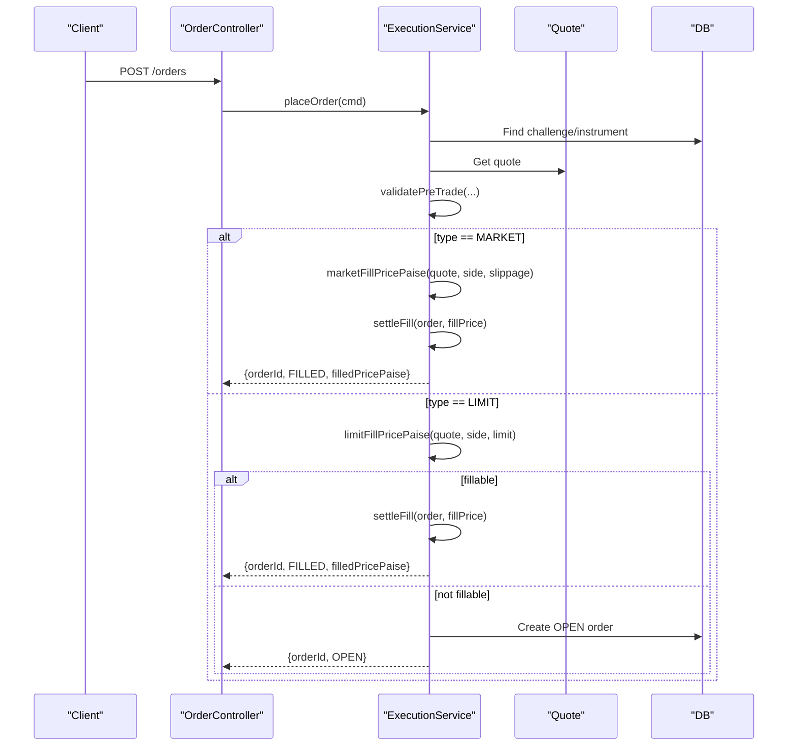
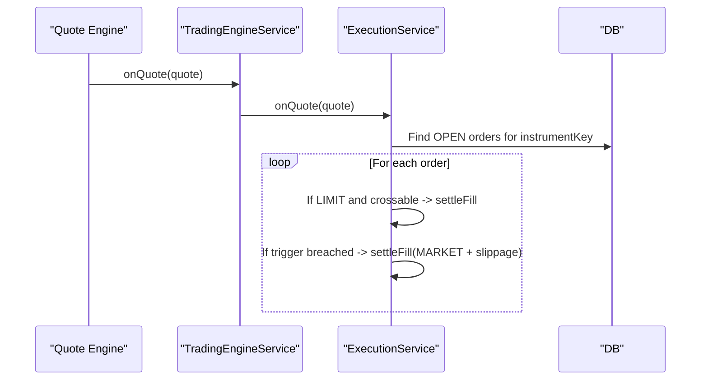
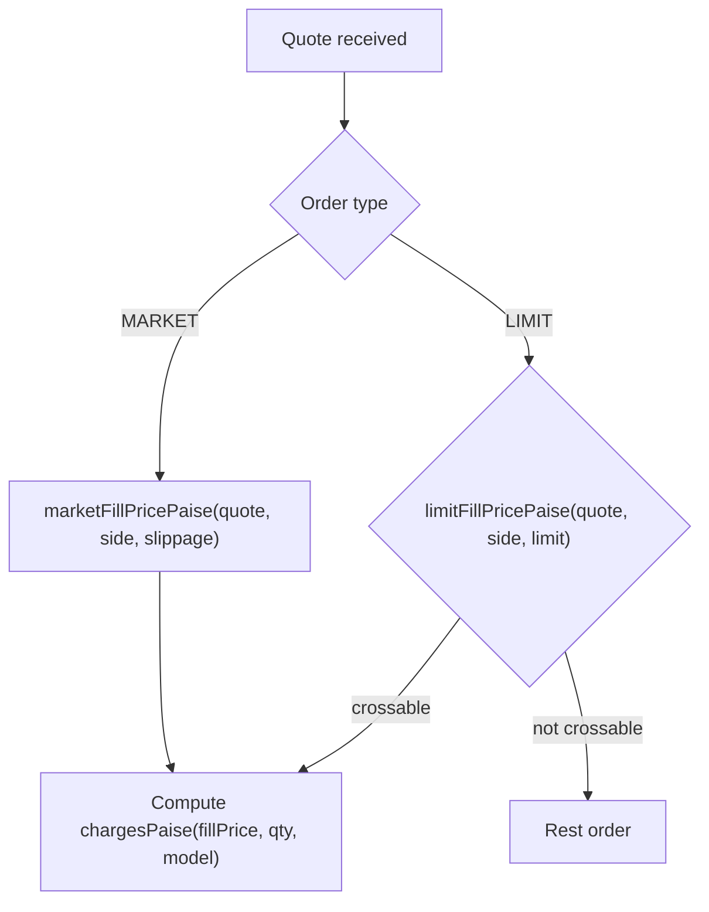
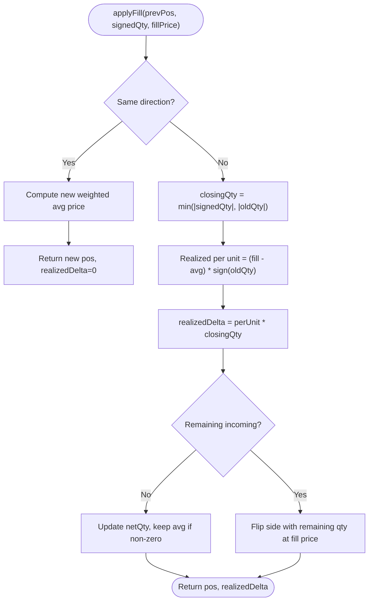
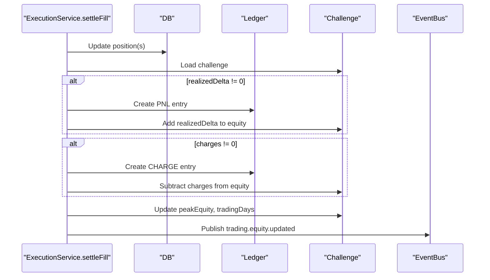
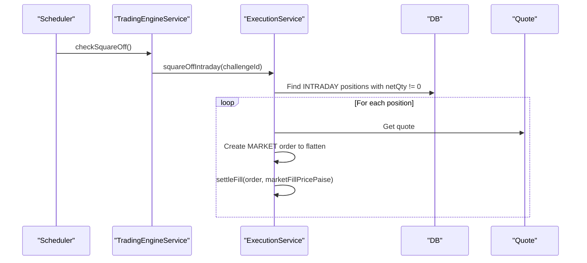
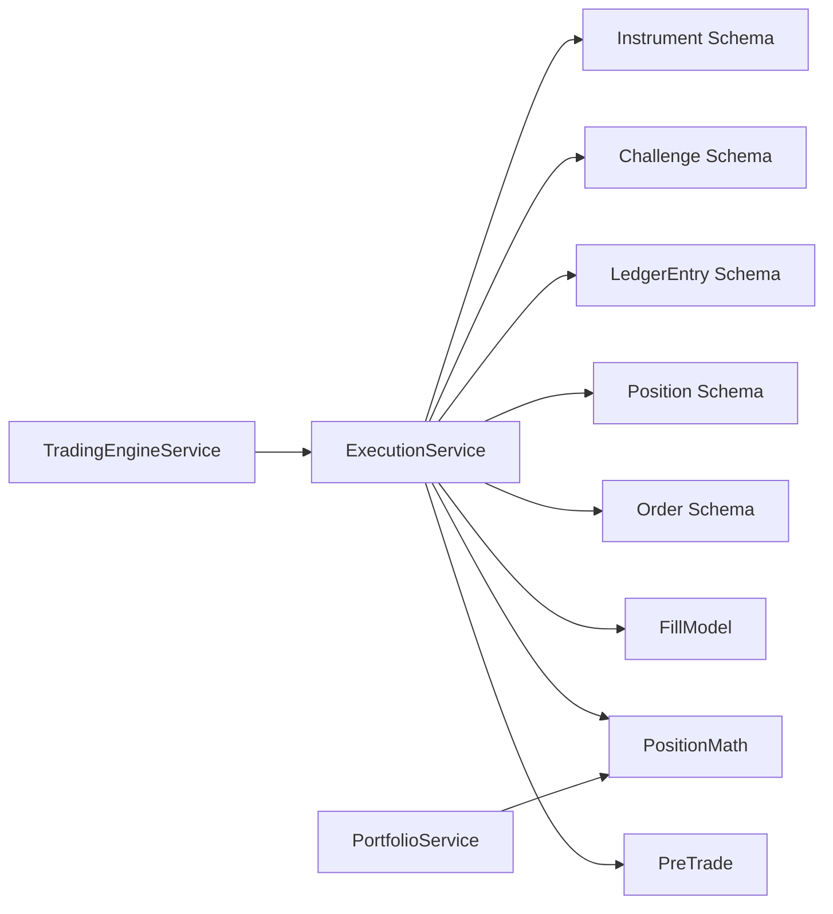

# Trading Workflows

<cite>
**Referenced Files in This Document**
- [pre-trade.ts](file://backend/apps/api/src/modules/trading/domain/pre-trade.ts)
- [fill-model.ts](file://backend/apps/api/src/modules/trading/domain/fill-model.ts)
- [position-math.ts](file://backend/apps/api/src/modules/trading/domain/position-math.ts)
- [order.types.ts](file://backend/apps/api/src/modules/trading/domain/order.types.ts)
- [execution.service.ts](file://backend/apps/api/src/modules/trading/application/execution.service.ts)
- [trading-engine.service.ts](file://backend/apps/api/src/modules/trading/application/trading-engine.service.ts)
- [portfolio.service.ts](file://backend/apps/api/src/modules/trading/application/portfolio.service.ts)
- [order.controller.ts](file://backend/apps/api/src/modules/trading/presentation/order.controller.ts)
- [order.schema.ts](file://backend/apps/api/src/modules/trading/infrastructure/schemas/order.schema.ts)
- [position.schema.ts](file://backend/apps/api/src/modules/trading/infrastructure/schemas/position.schema.ts)
- [pre-trade.spec.ts](file://backend/apps/api/src/modules/trading/__tests__/pre-trade.spec.ts)
- [fill-model.spec.ts](file://backend/apps/api/src/modules/trading/__tests__/fill-model.spec.ts)
- [position-math.spec.ts](file://backend/apps/api/src/modules/trading/__tests__/position-math.spec.ts)
</cite>

## Table of Contents
1. Introduction
2. Project Structure
3. Core Components
4. Architecture Overview
5. Detailed Component Analysis
6. Dependency Analysis
7. Performance Considerations
8. Troubleshooting Guide
9. Conclusion

## Introduction
This document explains the trading workflow and business logic implemented in the backend trading module. It covers pre-trade validation (risk limits, capital availability, market hours, instrument eligibility), order execution flow from placement to fill simulation (price matching, slippage, commissions), position math for realized/unrealized P&L and exposure tracking, and complex scenarios such as multi-leg orders, conditional orders, and automated strategy execution. Edge cases like partial fills, order rejections, and market volatility handling are addressed with concrete references to the codebase.

## Project Structure
The trading functionality is organized by domain, application, infrastructure, and presentation layers:
- Domain: pure functions and types for pre-trade checks, fill models, and position math.
- Application: orchestration services for execution, engine tick loop, and portfolio views.
- Infrastructure: Mongoose schemas for orders, positions, trades, holdings.
- Presentation: REST endpoints for placing/canceling orders and reading book/portfolio.

**Diagram sources**
- [order.controller.ts:23-47](file://backend/apps/api/src/modules/trading/presentation/order.controller.ts#L23-L47)
- [execution.service.ts:31-49](file://backend/apps/api/src/modules/trading/application/execution.service.ts#L31-L49)
- [trading-engine.service.ts:16-28](file://backend/apps/api/src/modules/trading/application/trading-engine.service.ts#L16-L28)
- [pre-trade.ts:33-78](file://backend/apps/api/src/modules/trading/domain/pre-trade.ts#L33-L78)
- [fill-model.ts:14-40](file://backend/apps/api/src/modules/trading/domain/fill-model.ts#L14-L40)
- [position-math.ts:26-72](file://backend/apps/api/src/modules/trading/domain/position-math.ts#L26-L72)
- [order.schema.ts:13-71](file://backend/apps/api/src/modules/trading/infrastructure/schemas/order.schema.ts#L13-L71)
- [position.schema.ts:4-34](file://backend/apps/api/src/modules/trading/infrastructure/schemas/position.schema.ts#L4-L34)

**Section sources**
- [order.controller.ts:23-47](file://backend/apps/api/src/modules/trading/presentation/order.controller.ts#L23-L47)
- [execution.service.ts:31-49](file://backend/apps/api/src/modules/trading/application/execution.service.ts#L31-L49)
- [trading-engine.service.ts:16-28](file://backend/apps/api/src/modules/trading/application/trading-engine.service.ts#L16-L28)

## Core Components
- Pre-trade validation: Validates challenge state, market open status, instrument enablement, segment permissions, lot size compliance, freeze quantity, trigger price sanity, and capital sufficiency.
- Fill model: Computes simulated fill prices for MARKET and LIMIT orders with slippage; computes charges per order using flat fee and turnover bps.
- Position math: Applies fills to signed positions using weighted-average cost; calculates realized delta on reductions/flips and unrealized P&L at mark prices.
- Execution service: Orchestrates order placement, immediate fills, resting limit management, SL/target triggers, equity updates, ledger entries, and square-off.
- Trading engine: Subscribes to quote channels for instruments with open orders, routes ticks to execution, and enforces intraday square-off at cutoff.
- Portfolio service: Provides positions view with MTM and unrealized P&L, holdings view, and recent trades.

**Section sources**
- [pre-trade.ts:33-78](file://backend/apps/api/src/modules/trading/domain/pre-trade.ts#L33-L78)
- [fill-model.ts:14-40](file://backend/apps/api/src/modules/trading/domain/fill-model.ts#L14-L40)
- [position-math.ts:26-72](file://backend/apps/api/src/modules/trading/domain/position-math.ts#L26-L72)
- [execution.service.ts:68-129](file://backend/apps/api/src/modules/trading/application/execution.service.ts#L68-L129)
- [execution.service.ts:149-177](file://backend/apps/api/src/modules/trading/application/execution.service.ts#L149-L177)
- [execution.service.ts:181-262](file://backend/apps/api/src/modules/trading/application/execution.service.ts#L181-L262)
- [execution.service.ts:289-307](file://backend/apps/api/src/modules/trading/application/execution.service.ts#L289-L307)
- [trading-engine.service.ts:39-65](file://backend/apps/api/src/modules/trading/application/trading-engine.service.ts#L39-L65)
- [portfolio.service.ts:43-67](file://backend/apps/api/src/modules/trading/application/portfolio.service.ts#L43-L67)

## Architecture Overview
The system uses a Virtual Execution Engine (VEE) pattern where all account-level mutations are serialized via Redis locks per challenge. The REST API accepts orders, validates them, persists orders, and either settles immediately (for MARKET or crossable LIMIT) or registers resting orders. A background engine subscribes to quotes for instruments with open orders, evaluates limit crosses and SL/target triggers, and squares off intraday positions at market close.

**Diagram sources**
- [order.controller.ts:28-36](file://backend/apps/api/src/modules/trading/presentation/order.controller.ts#L28-L36)
- [execution.service.ts:68-129](file://backend/apps/api/src/modules/trading/application/execution.service.ts#L68-L129)
- [fill-model.ts:14-33](file://backend/apps/api/src/modules/trading/domain/fill-model.ts#L14-L33)
- [pre-trade.ts:33-78](file://backend/apps/api/src/modules/trading/domain/pre-trade.ts#L33-L78)

## Detailed Component Analysis

### Pre-trade Validation
- Validates challenge tradability, market open status, instrument enabled flag, segment permission, lot-size multiple, freeze quantity cap, trigger price positivity, and estimated cost vs equity.
- Returns deterministic failure codes for each check, enabling consistent error handling and UI feedback.

**Diagram sources**
- [pre-trade.ts:33-78](file://backend/apps/api/src/modules/trading/domain/pre-trade.ts#L33-L78)

**Section sources**
- [pre-trade.ts:33-78](file://backend/apps/api/src/modules/trading/domain/pre-trade.ts#L33-L78)
- [pre-trade.spec.ts:19-63](file://backend/apps/api/src/modules/trading/__tests__/pre-trade.spec.ts#L19-L63)

### Order Placement and Immediate Fills
- Place order flow:
  - Loads challenge and instrument, retrieves quote, computes reference price and estimated cost.
  - Runs pre-trade validation.
  - For MARKET orders: computes fill price with slippage and settles immediately; rejects if no market data.
  - For LIMIT orders: attempts immediate fill if crossable; otherwise persists as OPEN.
- Cancellation: Only OPEN orders can be cancelled; protected by account lock.

**Diagram sources**
- [execution.service.ts:68-129](file://backend/apps/api/src/modules/trading/application/execution.service.ts#L68-L129)
- [order.controller.ts:28-36](file://backend/apps/api/src/modules/trading/presentation/order.controller.ts#L28-L36)

**Section sources**
- [execution.service.ts:68-129](file://backend/apps/api/src/modules/trading/application/execution.service.ts#L68-L129)
- [execution.service.ts:132-144](file://backend/apps/api/src/modules/trading/application/execution.service.ts#L132-L144)
- [order.controller.ts:28-41](file://backend/apps/api/src/modules/trading/presentation/order.controller.ts#L28-L41)

### Tick-driven Matching and Conditional Orders
- On each quote, the engine finds OPEN orders for that instrument and processes:
  - LIMIT orders: fill when ask/bid crosses limit price.
  - SL/Target orders: fire when last traded price breaches trigger thresholds based on side and kind.
- Slippage applied to triggered MARKET exits.

**Diagram sources**
- [trading-engine.service.ts:39-47](file://backend/apps/api/src/modules/trading/application/trading-engine.service.ts#L39-L47)
- [execution.service.ts:149-177](file://backend/apps/api/src/modules/trading/application/execution.service.ts#L149-L177)

**Section sources**
- [execution.service.ts:149-177](file://backend/apps/api/src/modules/trading/application/execution.service.ts#L149-L177)
- [trading-engine.service.ts:39-47](file://backend/apps/api/src/modules/trading/application/trading-engine.service.ts#L39-L47)

### Fill Simulation, Slippage, and Charges
- Market fill price:
  - BUY lifts ask; SELL hits bid.
  - Slippage added as basis points against the taker.
- Limit fill price:
  - BUY fills when ask ≤ limit; SELL fills when bid ≥ limit.
- Charges:
  - Flat per-order fee plus turnover-based charge computed from fill price × quantity and configured bps.

**Diagram sources**
- [fill-model.ts:14-40](file://backend/apps/api/src/modules/trading/domain/fill-model.ts#L14-L40)
- [execution.service.ts:114-117](file://backend/apps/api/src/modules/trading/application/execution.service.ts#L114-L117)
- [execution.service.ts:121-127](file://backend/apps/api/src/modules/trading/application/execution.service.ts#L121-L127)

**Section sources**
- [fill-model.ts:14-40](file://backend/apps/api/src/modules/trading/domain/fill-model.ts#L14-L40)
- [fill-model.spec.ts:8-35](file://backend/apps/api/src/modules/trading/__tests__/fill-model.spec.ts#L8-L35)

### Position Math and Exposure Tracking
- applyFill:
  - Same direction: opens or adds to position with weighted-average cost.
  - Opposite direction: realizes P&L on closed quantity; remaining quantity flips side if any.
- unrealizedPnl:
  - Computed as (markPrice - avgPrice) × netQty.
- Persistence:
  - Positions updated with netQty, avgPricePaise, realizedPnlPaise; dayBuyQty/daySellQty incremented.
  - Holdings mirrored for CARRY_FORWARD products.

**Diagram sources**
- [position-math.ts:26-66](file://backend/apps/api/src/modules/trading/domain/position-math.ts#L26-L66)

**Section sources**
- [position-math.ts:26-72](file://backend/apps/api/src/modules/trading/domain/position-math.ts#L26-L72)
- [position-math.spec.ts:3-61](file://backend/apps/api/src/modules/trading/__tests__/position-math.spec.ts#L3-L61)
- [execution.service.ts:181-213](file://backend/apps/api/src/modules/trading/application/execution.service.ts#L181-L213)

### Equity Updates and Ledger
- On each fill:
  - Realized P&L added to challenge equity; charges deducted.
  - Append-only ledger entries created for PNL and CHARGE events.
  - Peak equity tracked; trading days counted by IST date key.
  - Event published for downstream evaluators.

**Diagram sources**
- [execution.service.ts:181-262](file://backend/apps/api/src/modules/trading/application/execution.service.ts#L181-L262)

**Section sources**
- [execution.service.ts:181-262](file://backend/apps/api/src/modules/trading/application/execution.service.ts#L181-L262)

### Square-off and Forced Flattening
- Intraday square-off:
  - Engine runs periodically; at segment cutoff, flattens all INTRADAY positions via MARKET orders with slippage.
- Force flatten:
  - Used by evaluator on FAIL/PASS to close all open positions across products.

**Diagram sources**
- [trading-engine.service.ts:49-65](file://backend/apps/api/src/modules/trading/application/trading-engine.service.ts#L49-L65)
- [execution.service.ts:289-307](file://backend/apps/api/src/modules/trading/application/execution.service.ts#L289-L307)

**Section sources**
- [trading-engine.service.ts:49-65](file://backend/apps/api/src/modules/trading/application/trading-engine.service.ts#L49-L65)
- [execution.service.ts:269-285](file://backend/apps/api/src/modules/trading/application/execution.service.ts#L269-L285)
- [execution.service.ts:289-307](file://backend/apps/api/src/modules/trading/application/execution.service.ts#L289-L307)

### Portfolio Views and MTM
- Positions view:
  - Aggregates positions with live mark prices and computes unrealized P&L per position.
  - Returns total unrealized P&L, equity, realized P&L, and MTM equity.
- Holdings view:
  - Shows CARRY_FORWARD holdings with invested/current values and P&L.

**Section sources**
- [portfolio.service.ts:43-67](file://backend/apps/api/src/modules/trading/application/portfolio.service.ts#L43-L67)
- [portfolio.service.ts:69-84](file://backend/apps/api/src/modules/trading/application/portfolio.service.ts#L69-L84)

## Dependency Analysis
- ExecutionService depends on:
  - Domain: pre-trade validation, fill model, position math.
  - Infrastructure: Order, Position, Trade, Holding, Challenge, LedgerEntry, Instrument schemas.
  - Shared: AppConfigService, EventBus, ExchangeCalendarService, RedisLockService, Redis client.
- TradingEngineService depends on:
  - ExecutionService for quote-driven matching and square-off.
  - EventBus to subscribe to quote channels.
  - ExchangeCalendarService for market hours and square-off timing.
- PortfolioService depends on:
  - Position math for unrealized P&L.
  - Quote cache/feed for mark prices.

**Diagram sources**
- [execution.service.ts:31-49](file://backend/apps/api/src/modules/trading/application/execution.service.ts#L31-L49)
- [trading-engine.service.ts:16-28](file://backend/apps/api/src/modules/trading/application/trading-engine.service.ts#L16-L28)
- [portfolio.service.ts:14-24](file://backend/apps/api/src/modules/trading/application/portfolio.service.ts#L14-L24)

**Section sources**
- [execution.service.ts:31-49](file://backend/apps/api/src/modules/trading/application/execution.service.ts#L31-L49)
- [trading-engine.service.ts:16-28](file://backend/apps/api/src/modules/trading/application/trading-engine.service.ts#L16-L28)
- [portfolio.service.ts:14-24](file://backend/apps/api/src/modules/trading/application/portfolio.service.ts#L14-L24)

## Performance Considerations
- Redis locking per challenge ensures race-free equity and drawdown calculations during concurrent placements and tick processing.
- Quote caching reduces repeated lookups; only subscribed instruments are monitored by the engine.
- Partial index on OPEN orders optimizes matching queries.
- Square-off runs at fixed intervals and only once per trading day per segment cutoff.

[No sources needed since this section provides general guidance]

## Troubleshooting Guide
Common rejection reasons and their causes:
- CHALLENGE_NOT_TRADABLE: Challenge status not ACTIVE/PENDING.
- MARKET_CLOSED: Market closed for the instrument’s segment.
- INSTRUMENT_DISABLED: Instrument flagged as disabled.
- SEGMENT_NOT_ALLOWED: Plan does not permit the instrument’s segment.
- QTY_LOT_MISMATCH: Quantity not a multiple of lot size.
- FREEZE_QTY_EXCEEDED: Quantity exceeds instrument freeze limit.
- LIMIT_PRICE_REQUIRED: Missing or non-positive limit price for LIMIT orders.
- TRIGGER_PRICE_INVALID: Non-positive trigger price.
- INSUFFICIENT_CAPITAL: Estimated order value exceeds available equity.
- NO_MARKET_DATA: MARKET order placed without available quote.

Cancellation errors:
- NOT_CANCELLABLE: Attempted to cancel an order that is not OPEN.

Edge cases handled:
- Partial fills: applyFill supports reducing positions while preserving average cost; realized P&L calculated on closed portion.
- Order rejections: Deterministic codes returned from pre-trade and placement flows; mapped to appropriate HTTP status codes in controller.
- Market volatility: Slippage applied to MARKET fills and triggered exits; limit orders only fill when price conditions are met.

**Section sources**
- [pre-trade.ts:33-78](file://backend/apps/api/src/modules/trading/domain/pre-trade.ts#L33-L78)
- [execution.service.ts:107-117](file://backend/apps/api/src/modules/trading/application/execution.service.ts#L107-L117)
- [execution.service.ts:132-144](file://backend/apps/api/src/modules/trading/application/execution.service.ts#L132-L144)
- [order.controller.ts:11-21](file://backend/apps/api/src/modules/trading/presentation/order.controller.ts#L11-L21)
- [position-math.ts:26-66](file://backend/apps/api/src/modules/trading/domain/position-math.ts#L26-L66)

## Conclusion
The trading module implements a robust virtual execution engine with deterministic pre-trade validation, realistic fill simulation including slippage and charges, and precise position accounting for both realized and unrealized P&L. The architecture separates concerns cleanly across domain, application, and infrastructure layers, ensuring maintainability and testability. Automated square-off and event-driven quote processing provide reliable lifecycle management for orders and positions under market conditions.

[No sources needed since this section summarizes without analyzing specific files]