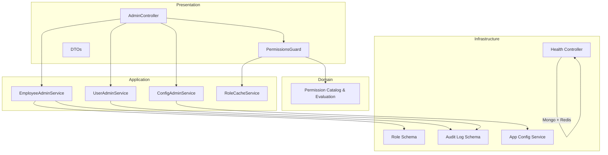
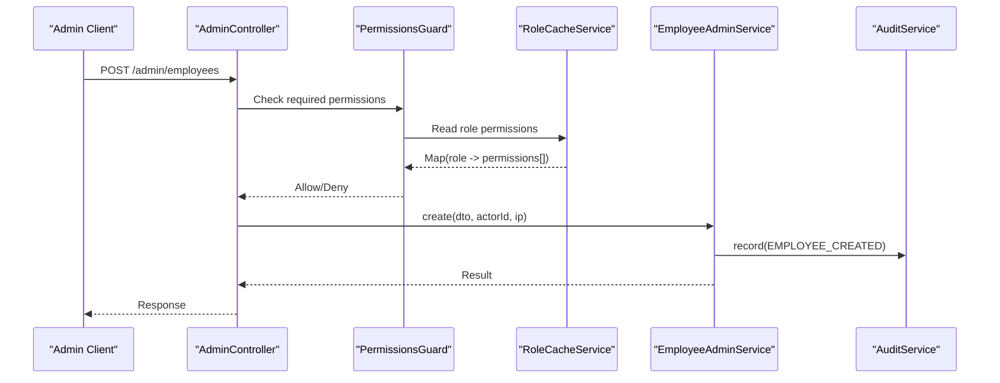
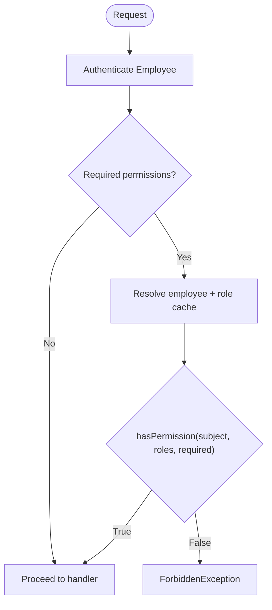
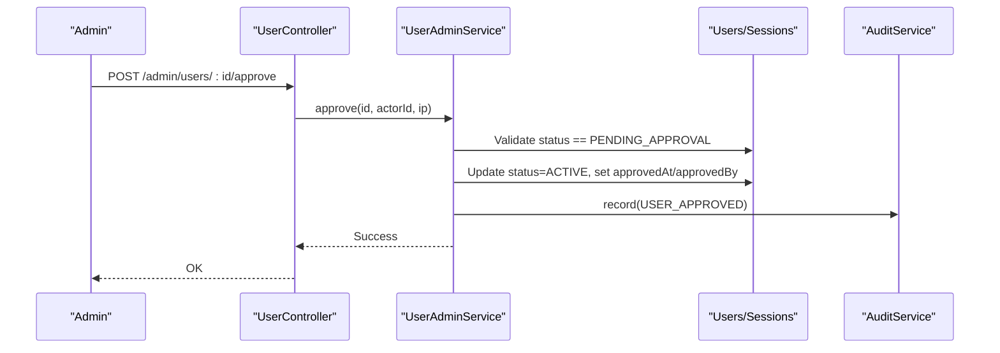
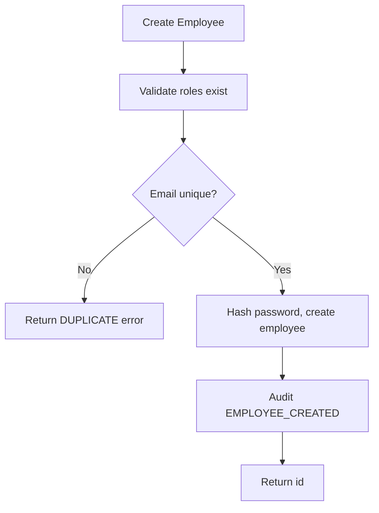
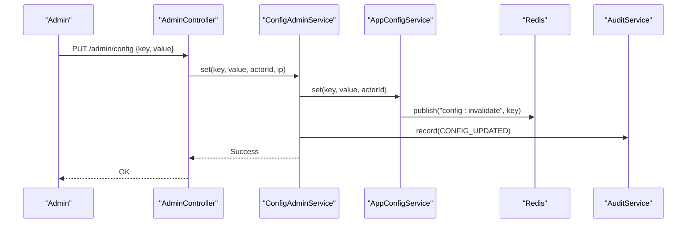
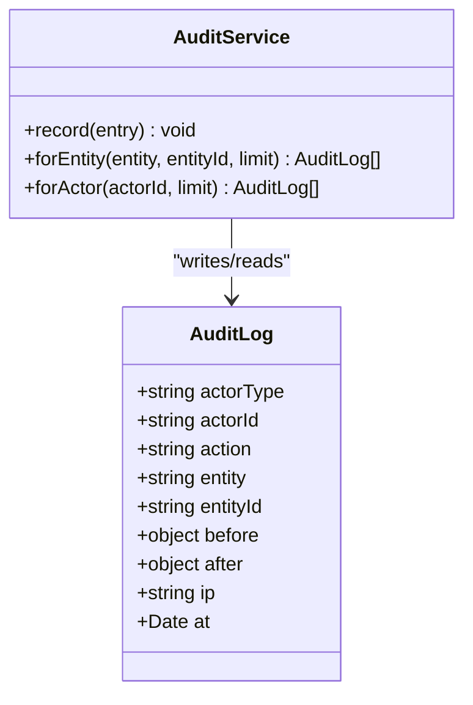
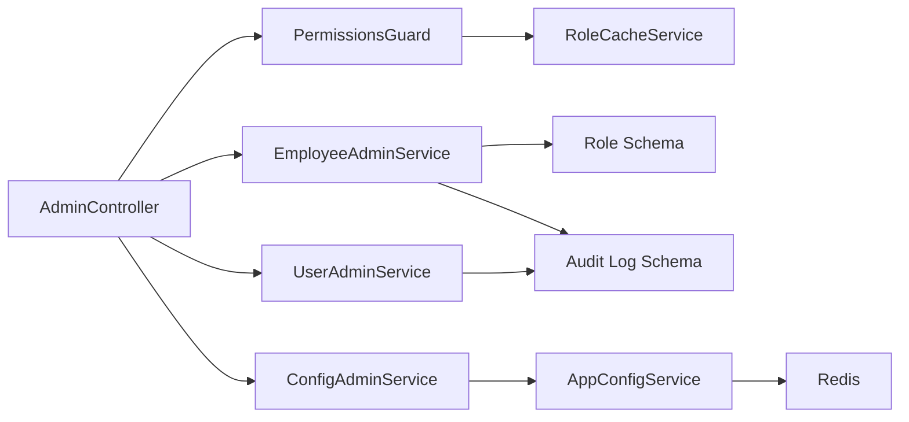

# Administration

<cite>
**Referenced Files in This Document**
- [admin.module.ts](file://backend/apps/api/src/modules/admin/admin.module.ts)
- [admin.controller.ts](file://backend/apps/api/src/modules/admin/presentation/admin.controller.ts)
- [permissions.guard.ts](file://backend/apps/api/src/modules/admin/presentation/permissions.guard.ts)
- [permissions.ts](file://backend/apps/api/src/modules/admin/domain/permissions.ts)
- [employee-admin.service.ts](file://backend/apps/api/src/modules/admin/application/employee-admin.service.ts)
- [user-admin.service.ts](file://backend/apps/api/src/modules/admin/application/user-admin.service.ts)
- [config-admin.service.ts](file://backend/apps/api/src/modules/admin/application/config-admin.service.ts)
- [role-cache.service.ts](file://backend/apps/api/src/modules/admin/application/role-cache.service.ts)
- [role.schema.ts](file://backend/apps/api/src/modules/admin/infrastructure/role.schema.ts)
- [admin.dtos.ts](file://backend/apps/api/src/modules/admin/presentation/dto/admin.dtos.ts)
- [audit.service.ts](file://backend/libs/shared/src/audit/audit.service.ts)
- [audit-log.schema.ts](file://backend/libs/shared/src/audit/audit-log.schema.ts)
- [app-config.service.ts](file://backend/libs/shared/src/config/app-config.service.ts)
- [health.controller.ts](file://backend/libs/shared/src/health/health.controller.ts)
</cite>

## Table of Contents
1. Introduction
2. Project Structure
3. Core Components
4. Architecture Overview
5. Detailed Component Analysis
6. Dependency Analysis
7. Performance Considerations
8. Troubleshooting Guide
9. Conclusion
10. Appendices

## Introduction
This document describes the Administration module that provides secure, permission-gated operations for managing users, employees, roles and permissions, system configuration, audit logs, and health monitoring. It explains how admin API endpoints are protected by role-based guards, how permissions are evaluated, and how all administrative actions are recorded in an immutable audit trail for compliance reporting. It also covers user lifecycle management (approval, rejection, suspension), employee onboarding workflows, role and permission matrix management, and operational configuration tools with real-time propagation across services.

## Project Structure
The Administration module is organized using a layered approach:
- Presentation: Controllers expose REST endpoints; Guards enforce authentication and authorization; DTOs validate inputs.
- Application: Services implement business use cases (employee administration, user administration, configuration administration).
- Domain: Permission catalog and evaluation logic define the security model.
- Infrastructure: Mongoose schemas for roles and audit logs; shared services for configuration and health.

**Diagram sources**
- [admin.controller.ts:30-170](file://backend/apps/api/src/modules/admin/presentation/admin.controller.ts#L30-L170)
- [permissions.guard.ts:18-41](file://backend/apps/api/src/modules/admin/presentation/permissions.guard.ts#L18-L41)
- [employee-admin.service.ts:26-124](file://backend/apps/api/src/modules/admin/application/employee-admin.service.ts#L26-L124)
- [user-admin.service.ts:13-148](file://backend/apps/api/src/modules/admin/application/user-admin.service.ts#L13-L148)
- [config-admin.service.ts:5-37](file://backend/apps/api/src/modules/admin/application/config-admin.service.ts#L5-L37)
- [role-cache.service.ts:12-44](file://backend/apps/api/src/modules/admin/application/role-cache.service.ts#L12-L44)
- [permissions.ts:5-64](file://backend/apps/api/src/modules/admin/domain/permissions.ts#L5-L64)
- [role.schema.ts:4-18](file://backend/apps/api/src/modules/admin/infrastructure/role.schema.ts#L4-L18)
- [audit.service.ts:23-44](file://backend/libs/shared/src/audit/audit.service.ts#L23-L44)
- [audit-log.schema.ts:6-40](file://backend/libs/shared/src/audit/audit-log.schema.ts#L6-L40)
- [app-config.service.ts:18-87](file://backend/libs/shared/src/config/app-config.service.ts#L18-L87)
- [health.controller.ts:19-54](file://backend/libs/shared/src/health/health.controller.ts#L19-L54)

**Section sources**
- [admin.module.ts:16-31](file://backend/apps/api/src/modules/admin/admin.module.ts#L16-L31)

## Core Components
- AdminController: Exposes admin endpoints for employees, users, roles, permissions, configuration, and audit logs. All endpoints require authentication and specific permissions via decorators.
- PermissionsGuard: Enforces fine-grained permissions per endpoint using role cache and per-user allow/deny overrides. Deny wins over any grant.
- EmployeeAdminService: Manages employee CRUD, password resets, role updates, and permission catalogs. Validates roles and permissions against known sets.
- UserAdminService: Provides user listing, detail, approval/rejection, and suspension/unsuspension with full audit logging and session invalidation on suspend.
- ConfigAdminService: Lists and updates business configuration keys with schema validation and audit logging. Uses AppConfigService for persistence and cross-process invalidation.
- RoleCacheService: Maintains an in-memory map of role to permissions, seeded from defaults, refreshed on mutations and periodically.
- AuditService: Immutable audit trail writer and reader with indexes for efficient queries by entity or actor.
- HealthController: Liveness/readiness probe checking MongoDB and Redis availability.

**Section sources**
- [admin.controller.ts:30-170](file://backend/apps/api/src/modules/admin/presentation/admin.controller.ts#L30-L170)
- [permissions.guard.ts:18-41](file://backend/apps/api/src/modules/admin/presentation/permissions.guard.ts#L18-L41)
- [employee-admin.service.ts:26-124](file://backend/apps/api/src/modules/admin/application/employee-admin.service.ts#L26-L124)
- [user-admin.service.ts:13-148](file://backend/apps/api/src/modules/admin/application/user-admin.service.ts#L13-L148)
- [config-admin.service.ts:5-37](file://backend/apps/api/src/modules/admin/application/config-admin.service.ts#L5-L37)
- [role-cache.service.ts:12-44](file://backend/apps/api/src/modules/admin/application/role-cache.service.ts#L12-L44)
- [audit.service.ts:23-44](file://backend/libs/shared/src/audit/audit.service.ts#L23-L44)
- [health.controller.ts:19-54](file://backend/libs/shared/src/health/health.controller.ts#L19-L54)

## Architecture Overview
The admin layer sits behind authentication and authorization. Each request is first authenticated as an employee and then authorized by PermissionsGuard based on required permissions declared per endpoint. The guard resolves the live employee record and evaluates permissions using the role cache and per-user overrides. Business logic resides in application services which persist changes and emit audit records. Configuration changes propagate via Redis to ensure consistency across processes.

**Diagram sources**
- [admin.controller.ts:48-52](file://backend/apps/api/src/modules/admin/presentation/admin.controller.ts#L48-L52)
- [permissions.guard.ts:26-39](file://backend/apps/api/src/modules/admin/presentation/permissions.guard.ts#L26-L39)
- [role-cache.service.ts:36-43](file://backend/apps/api/src/modules/admin/application/role-cache.service.ts#L36-L43)
- [employee-admin.service.ts:40-58](file://backend/apps/api/src/modules/admin/application/employee-admin.service.ts#L40-L58)
- [audit.service.ts:29-35](file://backend/libs/shared/src/audit/audit.service.ts#L29-L35)

## Detailed Component Analysis

### Admin API Endpoints and Permission Matrix
- Employees
  - GET /admin/employees: List employees (requires employees.view)
  - POST /admin/employees: Create employee (requires employees.manage)
  - PATCH /admin/employees/:id: Update employee (requires employees.manage)
  - POST /admin/employees/:id/reset-password: Reset password (requires employees.manage)
  - GET /admin/roles: List roles (requires employees.view)
  - PUT /admin/roles/:key: Update role permissions (requires roles.manage)
  - GET /admin/permissions: Permission catalog (requires employees.view)
- Users
  - GET /admin/users: Paginated list with search and status filter (requires users.view)
  - GET /admin/users/:id: User detail including active sessions and recent logins (requires users.view)
  - POST /admin/users/:id/approve: Approve pending user (requires users.approve)
  - POST /admin/users/:id/reject: Reject pending user (requires users.approve)
  - POST /admin/users/:id/suspend: Suspend user and revoke sessions (requires users.suspend)
  - POST /admin/users/:id/unsuspend: Restore user to prior state (requires users.suspend)
- Configuration
  - GET /admin/config: List configured keys with current values (requires config.manage)
  - PUT /admin/config: Set configuration key value (requires config.manage)
- Audit
  - GET /admin/audit-logs: Query by entity+entityId or actorId (requires audit.view)

All endpoints are guarded by both authentication and PermissionsGuard with RequirePermissions metadata.

**Section sources**
- [admin.controller.ts:40-169](file://backend/apps/api/src/modules/admin/presentation/admin.controller.ts#L40-L169)
- [permissions.guard.ts:18-41](file://backend/apps/api/src/modules/admin/presentation/permissions.guard.ts#L18-L41)
- [permissions.ts:5-64](file://backend/apps/api/src/modules/admin/domain/permissions.ts#L5-L64)

### Security Model and Permission Guards
- Authentication: Requests must be authenticated as an employee before reaching admin endpoints.
- Authorization: PermissionsGuard enforces endpoint-level permissions using:
  - Role grants from RoleCacheService
  - Per-user permAllow and permDeny overrides
  - Deny-wins semantics: explicit deny always blocks access, even if '*' is granted elsewhere
- Role Management: Roles store permission sets; SUPER_ADMIN is locked and cannot be modified. Default roles are seeded at startup.

**Diagram sources**
- [permissions.guard.ts:26-39](file://backend/apps/api/src/modules/admin/presentation/permissions.guard.ts#L26-L39)
- [permissions.ts:52-64](file://backend/apps/api/src/modules/admin/domain/permissions.ts#L52-L64)

**Section sources**
- [permissions.guard.ts:18-41](file://backend/apps/api/src/modules/admin/presentation/permissions.guard.ts#L18-L41)
- [permissions.ts:5-64](file://backend/apps/api/src/modules/admin/domain/permissions.ts#L5-L64)
- [role.schema.ts:4-18](file://backend/apps/api/src/modules/admin/infrastructure/role.schema.ts#L4-L18)
- [role-cache.service.ts:19-43](file://backend/apps/api/src/modules/admin/application/role-cache.service.ts#L19-L43)

### User Management (CRUD and Lifecycle)
- Listing and Detail: Supports filtering by status and searching across email, username, mobile, name. Detail aggregates active sessions and recent login history.
- Approval Workflow: Only pending users can be approved or rejected. Approving sets status to active and clears rejection reason; rejecting sets status to rejected with reason.
- Suspension: Suspends a user and revokes all active sessions. Unsuspension restores the user to the appropriate pre-suspension state based on verification flags and approval timestamp.
- Audit: Every change is recorded with before/after snapshots and IP.

**Diagram sources**
- [admin.controller.ts:118-122](file://backend/apps/api/src/modules/admin/presentation/admin.controller.ts#L118-L122)
- [user-admin.service.ts:53-81](file://backend/apps/api/src/modules/admin/application/user-admin.service.ts#L53-L81)
- [audit.service.ts:29-35](file://backend/libs/shared/src/audit/audit.service.ts#L29-L35)

**Section sources**
- [user-admin.service.ts:22-148](file://backend/apps/api/src/modules/admin/application/user-admin.service.ts#L22-L148)
- [admin.controller.ts:101-145](file://backend/apps/api/src/modules/admin/presentation/admin.controller.ts#L101-L145)

### Employee Administration and Onboarding
- Create Employee: Validates roles exist, ensures unique email, hashes password, sets initial status to ACTIVE, and audits creation.
- Update Employee: Validates roles and permissions; prevents self-lockout (cannot disable or demote own account if holding SUPER_ADMIN); audits changes.
- Password Reset: Hashes and stores new password; audits reset.
- Role Updates: Updates role permissions, refreshes role cache, and audits changes. SUPER_ADMIN role is locked.

**Diagram sources**
- [employee-admin.service.ts:40-58](file://backend/apps/api/src/modules/admin/application/employee-admin.service.ts#L40-L58)

**Section sources**
- [employee-admin.service.ts:26-124](file://backend/apps/api/src/modules/admin/application/employee-admin.service.ts#L26-L124)
- [admin.controller.ts:48-97](file://backend/apps/api/src/modules/admin/presentation/admin.controller.ts#L48-L97)
- [admin.dtos.ts:9-48](file://backend/apps/api/src/modules/admin/presentation/dto/admin.dtos.ts#L9-L48)

### System Configuration Management
- List Config: Returns all registered configuration keys with descriptions, defaults, and current values.
- Set Config: Validates value against key-specific schema, persists to database, updates in-memory cache, publishes invalidation via Redis, and audits change.
- Cross-process Propagation: Other services subscribe to Redis invalidation channel to reload affected keys without restart.

**Diagram sources**
- [admin.controller.ts:155-159](file://backend/apps/api/src/modules/admin/presentation/admin.controller.ts#L155-L159)
- [config-admin.service.ts:21-36](file://backend/apps/api/src/modules/admin/application/config-admin.service.ts#L21-L36)
- [app-config.service.ts:47-60](file://backend/libs/shared/src/config/app-config.service.ts#L47-L60)

**Section sources**
- [config-admin.service.ts:5-37](file://backend/apps/api/src/modules/admin/application/config-admin.service.ts#L5-L37)
- [app-config.service.ts:18-87](file://backend/libs/shared/src/config/app-config.service.ts#L18-L87)
- [admin.controller.ts:149-159](file://backend/apps/api/src/modules/admin/presentation/admin.controller.ts#L149-L159)

### Audit Logging and Compliance Reporting
- Immutable Records: Audit entries are write-once with no update/delete paths in code.
- Queries: Retrieve by entity+entityId or by actorId with time ordering and limits.
- Coverage: User approvals/rejections/suspensions, employee CRUD, role updates, and configuration changes are audited with before/after states and IP addresses.

**Diagram sources**
- [audit-log.schema.ts:6-40](file://backend/libs/shared/src/audit/audit-log.schema.ts#L6-L40)
- [audit.service.ts:23-44](file://backend/libs/shared/src/audit/audit.service.ts#L23-L44)

**Section sources**
- [audit.service.ts:23-44](file://backend/libs/shared/src/audit/audit.service.ts#L23-L44)
- [audit-log.schema.ts:6-40](file://backend/libs/shared/src/audit/audit-log.schema.ts#L6-L40)
- [admin.controller.ts:163-169](file://backend/apps/api/src/modules/admin/presentation/admin.controller.ts#L163-L169)

### System Health Monitoring
- Health Endpoint: Returns ok when both MongoDB and Redis respond; otherwise returns 503 with dependency details. Useful for liveness/readiness probes in containerized deployments.

**Section sources**
- [health.controller.ts:19-54](file://backend/libs/shared/src/health/health.controller.ts#L19-L54)

## Dependency Analysis
- Module Wiring: AdminModule registers controllers, providers, and Mongoose features for roles, employees, users, sessions, and login history. It exports PermissionsGuard and RoleCacheService for reuse.
- Service Dependencies:
  - EmployeeAdminService depends on Employee and Role models, PasswordService, RoleCacheService, and AuditService.
  - UserAdminService depends on User, Session, LoginHistory models and AuditService.
  - ConfigAdminService depends on AppConfigService and AuditService.
  - PermissionsGuard depends on RoleCacheService and Employee model.
- External Integrations:
  - Redis used by AppConfigService for cross-process configuration invalidation.
  - MongoDB used by all services for persistence.

**Diagram sources**
- [admin.module.ts:16-31](file://backend/apps/api/src/modules/admin/admin.module.ts#L16-L31)
- [employee-admin.service.ts:26-34](file://backend/apps/api/src/modules/admin/application/employee-admin.service.ts#L26-L34)
- [user-admin.service.ts:13-20](file://backend/apps/api/src/modules/admin/application/user-admin.service.ts#L13-L20)
- [config-admin.service.ts:5-10](file://backend/apps/api/src/modules/admin/application/config-admin.service.ts#L5-L10)
- [permissions.guard.ts:18-24](file://backend/apps/api/src/modules/admin/presentation/permissions.guard.ts#L18-L24)
- [app-config.service.ts:18-27](file://backend/libs/shared/src/config/app-config.service.ts#L18-L27)

**Section sources**
- [admin.module.ts:16-31](file://backend/apps/api/src/modules/admin/admin.module.ts#L16-L31)

## Performance Considerations
- Role Cache: In-memory map reduces repeated role lookups; refreshed on mutations and every 60 seconds to balance freshness and performance.
- Efficient Queries: User listing uses selective fields and parallel count/query for pagination. Search uses regex filters safely escaped to prevent injection.
- Audit Writes: Non-blocking failure path ensures audit failures do not impact business operations; errors are logged for alerting.
- Config Invalidation: Redis pub/sub enables fast propagation without polling.

[No sources needed since this section provides general guidance]

## Troubleshooting Guide
- Forbidden Access: Ensure the employee has the required permission; check per-user permDeny overrides and role assignments. Verify role cache is up-to-date.
- Duplicate Employee Email: Creation fails with duplicate error; verify uniqueness constraints.
- Unknown Role or Permission: Validation rejects unknown roles or permissions; confirm they exist in the role collection and permission catalog.
- Self-Lockout Prevention: Cannot disable or demote your own account if you hold SUPER_ADMIN; use another admin to adjust.
- Configuration Invalid Value: Set fails if value does not match the key’s schema; review expected types and constraints.
- Health Down: If /health returns 503, check MongoDB and Redis connectivity and credentials.

**Section sources**
- [permissions.guard.ts:26-39](file://backend/apps/api/src/modules/admin/presentation/permissions.guard.ts#L26-L39)
- [employee-admin.service.ts:40-109](file://backend/apps/api/src/modules/admin/application/employee-admin.service.ts#L40-L109)
- [config-admin.service.ts:21-36](file://backend/apps/api/src/modules/admin/application/config-admin.service.ts#L21-L36)
- [health.controller.ts:26-35](file://backend/libs/shared/src/health/health.controller.ts#L26-L35)

## Conclusion
The Administration module provides a robust, secure, and auditable foundation for operational tasks. Its layered design separates concerns between presentation, application, domain, and infrastructure. Role-based permissions with per-user overrides ensure precise access control, while comprehensive audit logging supports compliance and incident response. Configuration management integrates seamlessly with distributed services through Redis-based invalidation, and health monitoring ensures operational visibility.

[No sources needed since this section summarizes without analyzing specific files]

## Appendices

### Example Administrative Operations
- Create an employee with roles and initial password, then assign additional roles or overrides as needed.
- Approve or reject a pending user registration with reasons captured in audit logs.
- Suspend a user to immediately revoke sessions and unsuspend later to restore their previous state.
- Update role permissions and verify immediate effect via the permission catalog and guard behavior.
- Adjust business configuration keys and observe propagation across services via Redis invalidation.
- Query audit logs by entity or actor to investigate changes and generate compliance reports.

[No sources needed since this section provides general guidance]