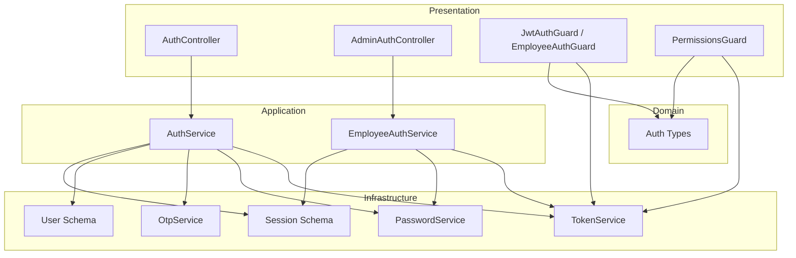
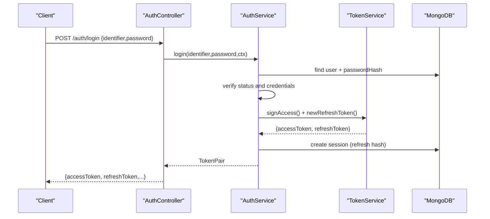
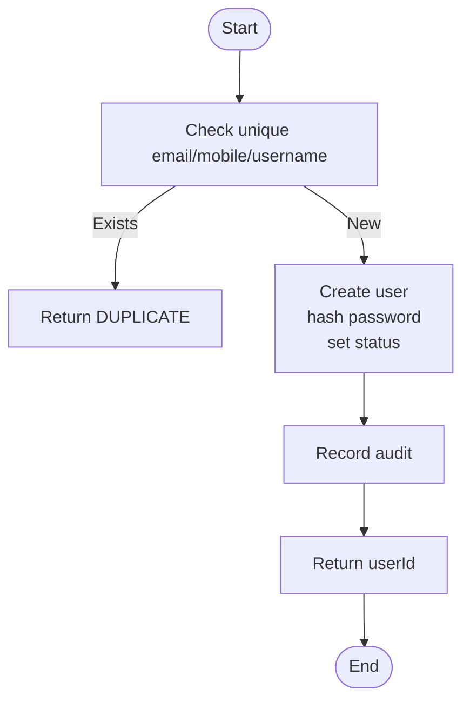
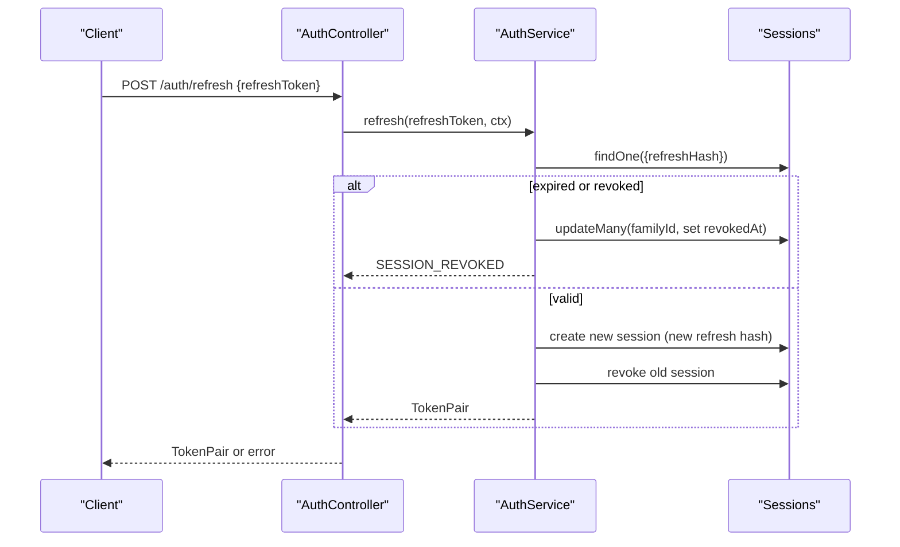
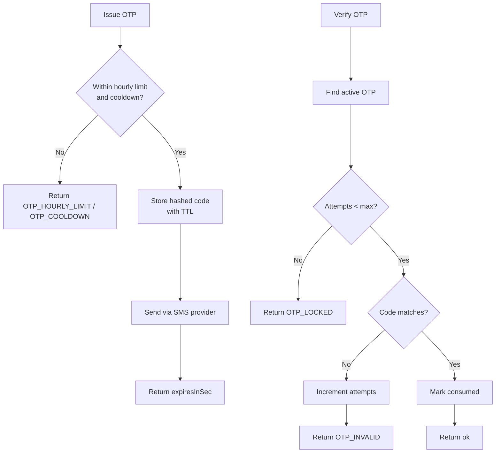
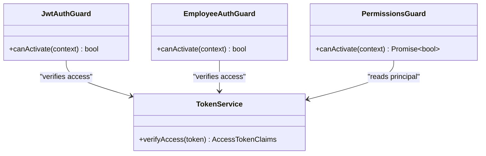
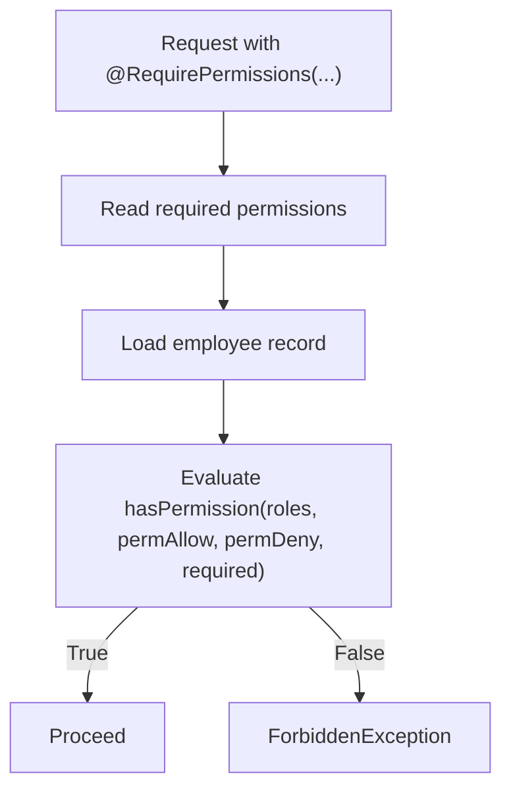
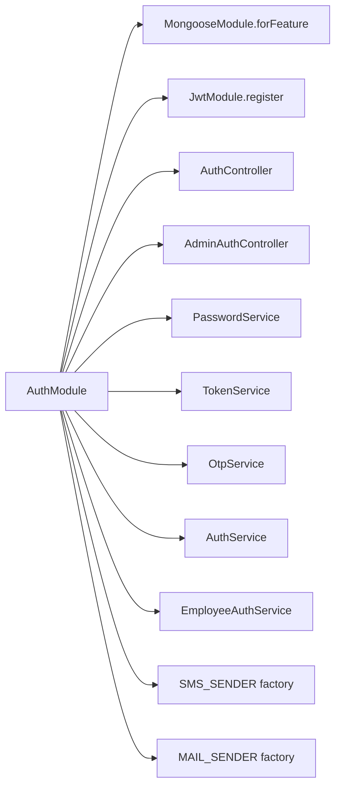

# Authentication & Authorization

<cite>
**Referenced Files in This Document**
- [auth.module.ts](file://backend/apps/api/src/modules/auth/auth.module.ts)
- [auth.controller.ts](file://backend/apps/api/src/modules/auth/presentation/auth.controller.ts)
- [admin-auth.controller.ts](file://backend/apps/api/src/modules/auth/presentation/admin-auth.controller.ts)
- [jwt-auth.guard.ts](file://backend/apps/api/src/modules/auth/presentation/jwt-auth.guard.ts)
- [auth.service.ts](file://backend/apps/api/src/modules/auth/application/auth.service.ts)
- [employee-auth.service.ts](file://backend/apps/api/src/modules/auth/application/employee-auth.service.ts)
- [token.service.ts](file://backend/apps/api/src/modules/auth/infrastructure/token.service.ts)
- [password.service.ts](file://backend/apps/api/src/modules/auth/infrastructure/password.service.ts)
- [otp.service.ts](file://backend/apps/api/src/modules/auth/infrastructure/otp.service.ts)
- [permissions.guard.ts](file://backend/apps/api/src/modules/admin/presentation/permissions.guard.ts)
- [permissions.ts](file://backend/apps/api/src/modules/admin/domain/permissions.ts)
- [user.schema.ts](file://backend/apps/api/src/modules/auth/infrastructure/schemas/user.schema.ts)
- [session.schema.ts](file://backend/apps/api/src/modules/auth/infrastructure/schemas/session.schema.ts)
</cite>

## Table of Contents
1. Introduction
2. Project Structure
3. Core Components
4. Architecture Overview
5. Detailed Component Analysis
6. Dependency Analysis
7. Performance Considerations
8. Troubleshooting Guide
9. Conclusion
10. Appendices

## Introduction
This document explains the Authentication & Authorization module, covering:
- JWT-based authentication for users and employees
- Multi-factor authentication (OTP via SMS and TOTP)
- Session management with refresh token rotation and family revocation
- Role-based access control (RBAC) with permission decorators and guards
- User registration and login flows, password hashing/validation
- Token refresh mechanisms and security guards
- Admin authentication endpoints and permission checking
- Configuration options for providers, rate limiting, and security best practices
- Examples of protected routes, custom guards, and authorization decorators

## Project Structure
The module is organized by layers:
- Presentation: Controllers expose REST endpoints; Guards enforce authentication; Decorators extract current principal
- Application: Services implement business logic for auth flows
- Infrastructure: Schemas, token handling, OTP, password hashing, mail/SMS providers
- Domain: Types and enums used across layers
- Admin RBAC: Permission catalog, role cache, and a guard that enforces permissions on admin endpoints

**Diagram sources**
- [auth.controller.ts:53-138](file://backend/apps/api/src/modules/auth/presentation/auth.controller.ts#L53-L138)
- [admin-auth.controller.ts:24-49](file://backend/apps/api/src/modules/auth/presentation/admin-auth.controller.ts#L24-L49)
- [jwt-auth.guard.ts:10-33](file://backend/apps/api/src/modules/auth/presentation/jwt-auth.guard.ts#L10-L33)
- [permissions.guard.ts:18-41](file://backend/apps/api/src/modules/admin/presentation/permissions.guard.ts#L18-L41)
- [auth.service.ts:28-40](file://backend/apps/api/src/modules/auth/application/auth.service.ts#L28-L40)
- [employee-auth.service.ts:22-36](file://backend/apps/api/src/modules/auth/application/employee-auth.service.ts#L22-L36)
- [token.service.ts:20-32](file://backend/apps/api/src/modules/auth/infrastructure/token.service.ts#L20-L32)
- [password.service.ts:4-24](file://backend/apps/api/src/modules/auth/infrastructure/password.service.ts#L4-L24)
- [otp.service.ts:15-26](file://backend/apps/api/src/modules/auth/infrastructure/otp.service.ts#L15-L26)
- [user.schema.ts:5-67](file://backend/apps/api/src/modules/auth/infrastructure/schemas/user.schema.ts#L5-L67)
- [session.schema.ts:9-41](file://backend/apps/api/src/modules/auth/infrastructure/schemas/session.schema.ts#L9-L41)

**Section sources**
- [auth.module.ts:24-56](file://backend/apps/api/src/modules/auth/auth.module.ts#L24-L56)
- [auth.controller.ts:53-138](file://backend/apps/api/src/modules/auth/presentation/auth.controller.ts#L53-L138)
- [admin-auth.controller.ts:24-49](file://backend/apps/api/src/modules/auth/presentation/admin-auth.controller.ts#L24-L49)

## Core Components
- AuthController: Public user-facing endpoints for register, login, OTP, email verification, password reset, sessions, and logout. Uses strict throttling and maps domain errors to HTTP status codes.
- AdminAuthController: Employee login and TOTP setup/enablement with stricter throttling and MFA enforcement.
- JwtAuthGuard/EmployeeAuthGuard: Extracts Bearer token, verifies RS256 JWT, validates actor type, and attaches principal to request.
- PermissionsGuard: Enforces fine-grained permissions using a decorator and live employee record resolution.
- AuthService: Implements user registration, mobile OTP verification, email verification, login, refresh rotation, logout, password reset, session listing, and login history.
- EmployeeAuthService: Implements employee login with optional TOTP, TOTP provisioning and enablement, and session issuance.
- TokenService: Issues RS256 access tokens and purpose-bound short-lived tokens; manages opaque refresh tokens stored as hashes.
- PasswordService: Argon2id hashing and verification with OWASP-recommended parameters.
- OtpService: Issues and verifies time-limited OTPs with per-hour limits, cooldowns, and attempt caps; integrates with pluggable SMS provider.

**Section sources**
- [auth.controller.ts:53-138](file://backend/apps/api/src/modules/auth/presentation/auth.controller.ts#L53-L138)
- [admin-auth.controller.ts:24-49](file://backend/apps/api/src/modules/auth/presentation/admin-auth.controller.ts#L24-L49)
- [jwt-auth.guard.ts:10-33](file://backend/apps/api/src/modules/auth/presentation/jwt-auth.guard.ts#L10-L33)
- [permissions.guard.ts:18-41](file://backend/apps/api/src/modules/admin/presentation/permissions.guard.ts#L18-L41)
- [auth.service.ts:42-345](file://backend/apps/api/src/modules/auth/application/auth.service.ts#L42-L345)
- [employee-auth.service.ts:38-117](file://backend/apps/api/src/modules/auth/application/employee-auth.service.ts#L38-L117)
- [token.service.ts:20-89](file://backend/apps/api/src/modules/auth/infrastructure/token.service.ts#L20-L89)
- [password.service.ts:4-24](file://backend/apps/api/src/modules/auth/infrastructure/password.service.ts#L4-L24)
- [otp.service.ts:15-75](file://backend/apps/api/src/modules/auth/infrastructure/otp.service.ts#L15-L75)

## Architecture Overview
The system uses layered architecture with clear separation of concerns:
- Controllers handle HTTP concerns (validation, throttling, error mapping)
- Services encapsulate business rules and orchestrate infrastructure
- Infrastructure provides persistence, cryptography, and external integrations
- Domain types define shared contracts

**Diagram sources**
- [auth.controller.ts:86-96](file://backend/apps/api/src/modules/auth/presentation/auth.controller.ts#L86-L96)
- [auth.service.ts:145-216](file://backend/apps/api/src/modules/auth/application/auth.service.ts#L145-L216)
- [token.service.ts:42-80](file://backend/apps/api/src/modules/auth/infrastructure/token.service.ts#L42-L80)
- [session.schema.ts:9-41](file://backend/apps/api/src/modules/auth/infrastructure/schemas/session.schema.ts#L9-L41)

## Detailed Component Analysis

### User Registration and Login Flow
- Registration checks uniqueness, hashes password, sets initial status, records audit event, and returns user ID.
- Mobile OTP flow issues an OTP with TTL and rate limits; verification marks mobile verified and transitions status toward email verification.
- Email verification uses a purpose-bound short-lived token; after verification, status moves to pending approval or active depending on flow.
- Login validates identifier, password, and account status; issues access and refresh tokens; records login and notifies on new device.

**Diagram sources**
- [auth.service.ts:44-81](file://backend/apps/api/src/modules/auth/application/auth.service.ts#L44-L81)
- [password.service.ts:14-24](file://backend/apps/api/src/modules/auth/infrastructure/password.service.ts#L14-L24)

**Section sources**
- [auth.service.ts:44-141](file://backend/apps/api/src/modules/auth/application/auth.service.ts#L44-L141)
- [auth.controller.ts:57-84](file://backend/apps/api/src/modules/auth/presentation/auth.controller.ts#L57-L84)
- [user.schema.ts:5-67](file://backend/apps/api/src/modules/auth/infrastructure/schemas/user.schema.ts#L5-L67)

### Refresh Token Rotation and Family Revocation
- On refresh, the service locates the session by hashed refresh token, checks expiry/revocation, issues a new pair, revokes the old row, and records replacement.
- If a revoked/expired token is presented again, the entire session family is revoked to mitigate token theft.

**Diagram sources**
- [auth.controller.ts:92-96](file://backend/apps/api/src/modules/auth/presentation/auth.controller.ts#L92-L96)
- [auth.service.ts:190-216](file://backend/apps/api/src/modules/auth/application/auth.service.ts#L190-L216)
- [session.schema.ts:9-41](file://backend/apps/api/src/modules/auth/infrastructure/schemas/session.schema.ts#L9-L41)

**Section sources**
- [auth.service.ts:190-232](file://backend/apps/api/src/modules/auth/application/auth.service.ts#L190-L232)
- [token.service.ts:73-84](file://backend/apps/api/src/modules/auth/infrastructure/token.service.ts#L73-L84)

### Multi-Factor Authentication (OTP and TOTP)
- OTP: Rate-limited issuance with per-hour caps, cooldown, TTL, and attempt limits; stored as hashed code with pepper; delivered via pluggable SMS provider.
- TOTP: Employee login can require a TOTP code when enabled; setup generates a secret and otpauth URI; enabling verifies possession before enforcing future logins.

**Diagram sources**
- [otp.service.ts:28-75](file://backend/apps/api/src/modules/auth/infrastructure/otp.service.ts#L28-L75)

**Section sources**
- [otp.service.ts:15-75](file://backend/apps/api/src/modules/auth/infrastructure/otp.service.ts#L15-L75)
- [employee-auth.service.ts:51-60](file://backend/apps/api/src/modules/auth/application/employee-auth.service.ts#L51-L60)
- [employee-auth.service.ts:84-117](file://backend/apps/api/src/modules/auth/application/employee-auth.service.ts#L84-L117)
- [admin-auth.controller.ts:28-48](file://backend/apps/api/src/modules/auth/presentation/admin-auth.controller.ts#L28-L48)

### Password Hashing and Validation
- PasswordService uses Argon2id with memory/time costs aligned to OWASP recommendations.
- Verification safely handles exceptions and returns boolean.

**Section sources**
- [password.service.ts:4-24](file://backend/apps/api/src/modules/auth/infrastructure/password.service.ts#L4-L24)
- [auth.service.ts:145-158](file://backend/apps/api/src/modules/auth/application/auth.service.ts#L145-L158)

### JWT Tokens and Purpose-Bound Tokens
- Access tokens are RS256 signed with configurable TTL and include actor and roles.
- Purpose tokens (email verification, password reset) are short-lived and validated against expected typ.
- Refresh tokens are opaque random strings; only their SHA-256 hash is persisted.

**Section sources**
- [token.service.ts:20-89](file://backend/apps/api/src/modules/auth/infrastructure/token.service.ts#L20-L89)
- [auth.types.ts:24-45](file://backend/apps/api/src/modules/auth/domain/auth.types.ts#L24-L45)

### Security Guards and Protected Routes
- JwtAuthGuard extracts Bearer token, verifies RS256 signature, ensures correct actor type, and attaches principal.
- EmployeeAuthGuard restricts to EMPLOYEE actors.
- PermissionsGuard enforces fine-grained permissions using a decorator and live employee data.

**Diagram sources**
- [jwt-auth.guard.ts:10-33](file://backend/apps/api/src/modules/auth/presentation/jwt-auth.guard.ts#L10-L33)
- [permissions.guard.ts:18-41](file://backend/apps/api/src/modules/admin/presentation/permissions.guard.ts#L18-L41)
- [token.service.ts:51-58](file://backend/apps/api/src/modules/auth/infrastructure/token.service.ts#L51-L58)

**Section sources**
- [jwt-auth.guard.ts:10-33](file://backend/apps/api/src/modules/auth/presentation/jwt-auth.guard.ts#L10-L33)
- [permissions.guard.ts:18-41](file://backend/apps/api/src/modules/admin/presentation/permissions.guard.ts#L18-L41)

### Role-Based Access Control (RBAC)
- Permission catalog defines platform-wide keys and descriptions; default roles map to permission sets.
- hasPermission implements deny-wins semantics combining role grants and per-user allow/deny overrides.
- PermissionsGuard reads required permissions from metadata and evaluates against live employee record and role cache.

**Diagram sources**
- [permissions.guard.ts:26-39](file://backend/apps/api/src/modules/admin/presentation/permissions.guard.ts#L26-L39)
- [permissions.ts:30-64](file://backend/apps/api/src/modules/admin/domain/permissions.ts#L30-L64)

**Section sources**
- [permissions.ts:1-65](file://backend/apps/api/src/modules/admin/domain/permissions.ts#L1-L65)
- [permissions.guard.ts:1-42](file://backend/apps/api/src/modules/admin/presentation/permissions.guard.ts#L1-L42)

### Employee Authentication Endpoints
- AdminAuthController exposes login and TOTP setup/enable endpoints with strict throttling and MFA enforcement.
- EmployeeAuthService validates credentials, enforces TOTP when enabled, and issues tokens with roles.

**Section sources**
- [admin-auth.controller.ts:24-49](file://backend/apps/api/src/modules/auth/presentation/admin-auth.controller.ts#L24-L49)
- [employee-auth.service.ts:38-82](file://backend/apps/api/src/modules/auth/application/employee-auth.service.ts#L38-L82)

### Data Models
- User schema includes identity fields, verification flags, status, KYC status, and referral info.
- Session schema stores principal, actor, hashed refresh token, family grouping, device context, and expiration.

**Section sources**
- [user.schema.ts:5-67](file://backend/apps/api/src/modules/auth/infrastructure/schemas/user.schema.ts#L5-L67)
- [session.schema.ts:9-41](file://backend/apps/api/src/modules/auth/infrastructure/schemas/session.schema.ts#L9-L41)

## Dependency Analysis
Module wiring and exports:
- AuthModule registers Mongoose schemas, JWT module, controllers, services, and pluggable SMS/Mail providers based on configuration.
- Exports TokenService and PasswordService for reuse across modules.

**Diagram sources**
- [auth.module.ts:24-56](file://backend/apps/api/src/modules/auth/auth.module.ts#L24-L56)

**Section sources**
- [auth.module.ts:24-56](file://backend/apps/api/src/modules/auth/auth.module.ts#L24-L56)

## Performance Considerations
- Throttling: Strict rate limits on sensitive endpoints (register, login, OTP, password reset); higher limits for refresh to accommodate client retries.
- OTP limits: Per-hour send caps, cooldown between requests, and per-code attempt limits reduce abuse and brute-force risk.
- Token sizes: Short-lived access tokens minimize exposure window; refresh tokens rotated and stored as hashes to reduce storage and risk.
- Database indexes: Sessions indexed by principalId and expiresAt for efficient queries and TTL cleanup.

[No sources needed since this section provides general guidance]

## Troubleshooting Guide
Common errors and resolutions:
- AUTH_FAILED: Invalid credentials or invalid session; check identifiers, passwords, and session state.
- TOKEN_INVALID: Expired or tampered verification/reset links; reissue via forgot password or resend email.
- SESSION_REVOKED: Reuse of revoked/expired refresh token triggers family revocation; force re-login.
- SUSPENDED/REJECTED/PENDING_APPROVAL: Account lifecycle restrictions; contact support or complete required steps.
- OTP_HOURLY_LIMIT/OTP_COOLDOWN/OTP_LOCKED: Wait for cooldown or request new OTP; avoid rapid retries.
- Insufficient permissions: Ensure employee has required roles/overrides; verify PermissionsGuard usage on endpoints.

**Section sources**
- [auth.controller.ts:25-51](file://backend/apps/api/src/modules/auth/presentation/auth.controller.ts#L25-L51)
- [admin-auth.controller.ts:11-22](file://backend/apps/api/src/modules/auth/presentation/admin-auth.controller.ts#L11-L22)
- [auth.service.ts:151-182](file://backend/apps/api/src/modules/auth/application/auth.service.ts#L151-L182)
- [auth.service.ts:190-216](file://backend/apps/api/src/modules/auth/application/auth.service.ts#L190-L216)
- [otp.service.ts:55-75](file://backend/apps/api/src/modules/auth/infrastructure/otp.service.ts#L55-L75)
- [permissions.guard.ts:26-39](file://backend/apps/api/src/modules/admin/presentation/permissions.guard.ts#L26-L39)

## Conclusion
The module delivers a robust, secure authentication and authorization system with:
- Strong password hashing and JWT-based access control
- Multi-factor support via OTP and TOTP
- Secure session management with refresh rotation and family revocation
- Fine-grained RBAC with live permission evaluation
- Hardened endpoints with rate limiting and comprehensive error handling

[No sources needed since this section summarizes without analyzing specific files]

## Appendices

### API Endpoints Summary
- User endpoints: register, otp/request, otp/verify, email/resend, email/verify, login, refresh, logout, logout-all, password/forgot, password/reset, me, sessions, login-history
- Admin endpoints: admin/auth/login, admin/auth/totp/setup, admin/auth/totp/enable

**Section sources**
- [auth.controller.ts:57-138](file://backend/apps/api/src/modules/auth/presentation/auth.controller.ts#L57-L138)
- [admin-auth.controller.ts:28-48](file://backend/apps/api/src/modules/auth/presentation/admin-auth.controller.ts#L28-L48)

### Configuration Options
- JWT keys: JWT_PRIVATE_KEY_B64, JWT_PUBLIC_KEY_B64
- Token TTLs: auth.accessToken.ttlSeconds, auth.refreshToken.ttlDays
- OTP: auth.otp.ttlSeconds, auth.otp.maxPerHour, auth.otp.resendCooldownSeconds, auth.otp.maxAttempts, OTP_PEPPER
- Providers: SMS_PROVIDER (msg91/console), MAIL_PROVIDER (smtp/console)
- App base URL: APP_BASE_URL
- Encryption: DATA_ENC_SECRET (for encrypted fields like TOTP secret)

**Section sources**
- [token.service.ts:25-32](file://backend/apps/api/src/modules/auth/infrastructure/token.service.ts#L25-L32)
- [token.service.ts:34-40](file://backend/apps/api/src/modules/auth/infrastructure/token.service.ts#L34-L40)
- [otp.service.ts:19-26](file://backend/apps/api/src/modules/auth/infrastructure/otp.service.ts#L19-L26)
- [auth.module.ts:42-53](file://backend/apps/api/src/modules/auth/auth.module.ts#L42-L53)
- [employee-auth.service.ts:33-36](file://backend/apps/api/src/modules/auth/application/employee-auth.service.ts#L33-L36)

### Security Best Practices
- Use RS256 JWTs with short-lived access tokens and rotating refresh tokens
- Store only hashed refresh tokens; never persist raw tokens
- Enforce strong password hashing (Argon2id)
- Apply strict rate limiting on sensitive endpoints
- Implement deny-wins RBAC and evaluate permissions against live data
- Log and audit critical actions (registration, login, config changes, TOTP enablement)
- Notify users on new device sign-ins and credential changes

**Section sources**
- [token.service.ts:42-89](file://backend/apps/api/src/modules/auth/infrastructure/token.service.ts#L42-L89)
- [password.service.ts:4-24](file://backend/apps/api/src/modules/auth/infrastructure/password.service.ts#L4-L24)
- [auth.controller.ts:22-24](file://backend/apps/api/src/modules/auth/presentation/auth.controller.ts#L22-L24)
- [permissions.ts:48-64](file://backend/apps/api/src/modules/admin/domain/permissions.ts#L48-L64)
- [auth.service.ts:318-344](file://backend/apps/api/src/modules/auth/application/auth.service.ts#L318-L344)

### Examples: Protected Routes, Custom Guards, and Authorization Decorators
- Protected route example: GET /auth/me guarded by UserAuthGuard; extracts principal via CurrentPrincipal decorator
- Employee-only route: Use EmployeeAuthGuard to restrict to EMPLOYEE actors
- Permission-decorated endpoint: Apply RequirePermissions('users.approve', 'kyc.review') and PermissionsGuard to enforce fine-grained access

**Section sources**
- [auth.controller.ts:121-125](file://backend/apps/api/src/modules/auth/presentation/auth.controller.ts#L121-L125)
- [jwt-auth.guard.ts:32-33](file://backend/apps/api/src/modules/auth/presentation/jwt-auth.guard.ts#L32-L33)
- [permissions.guard.ts:10-11](file://backend/apps/api/src/modules/admin/presentation/permissions.guard.ts#L10-L11)