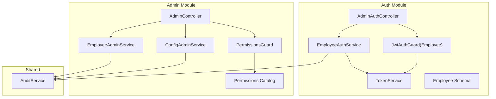
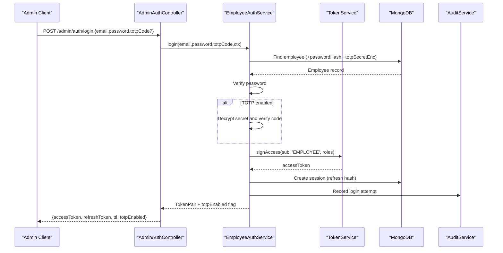
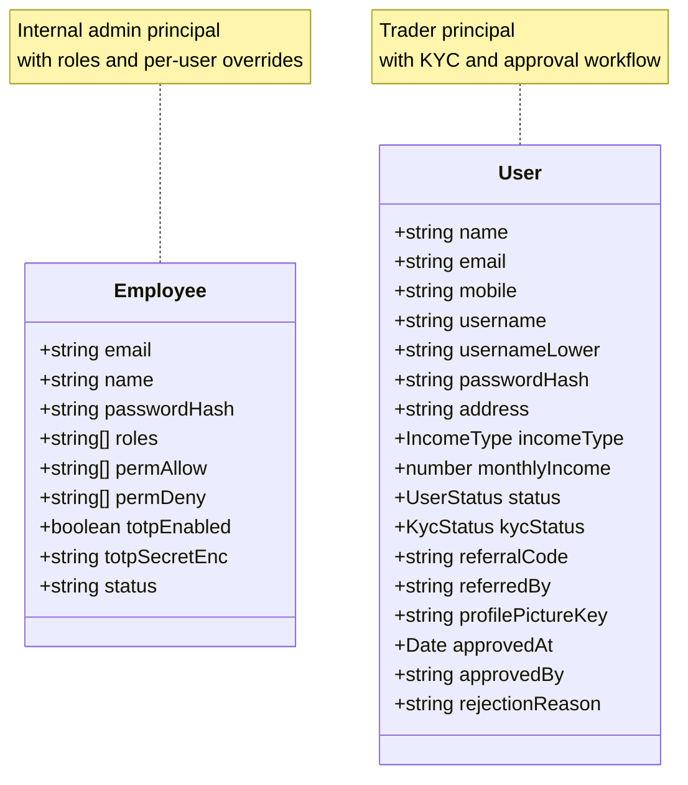
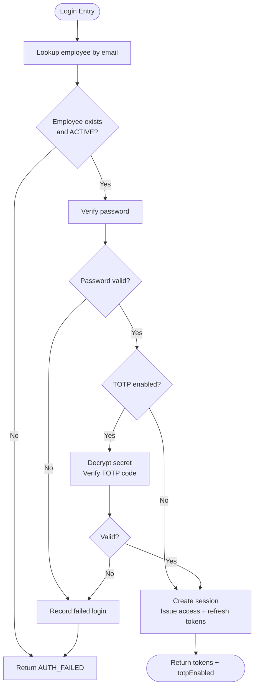
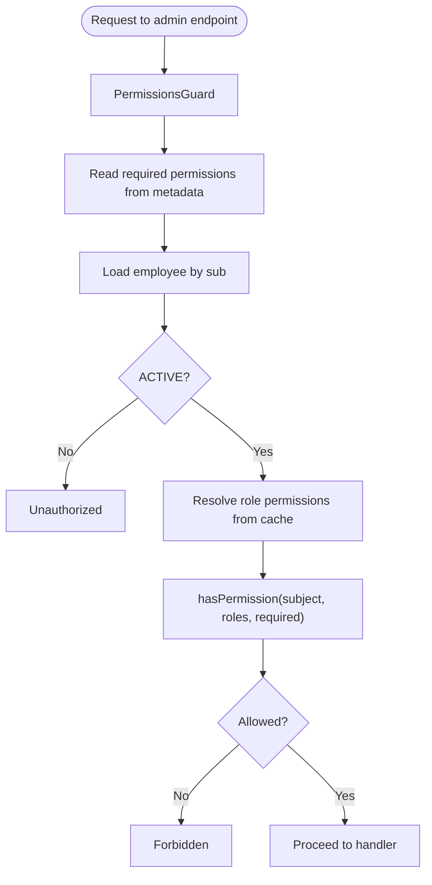
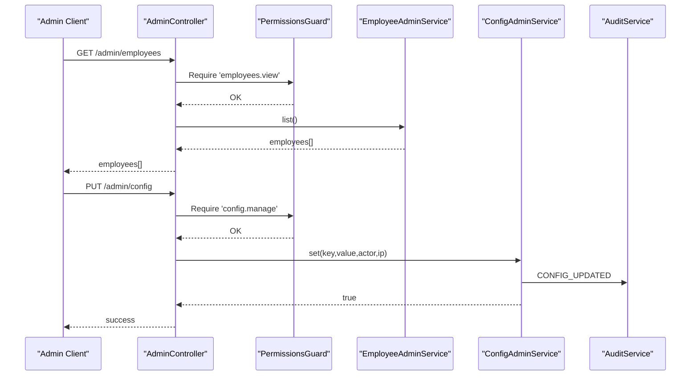
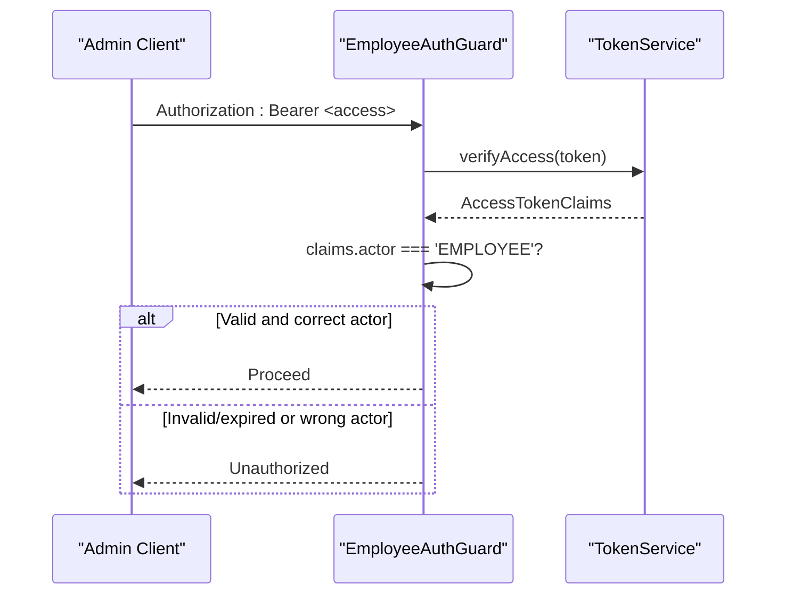
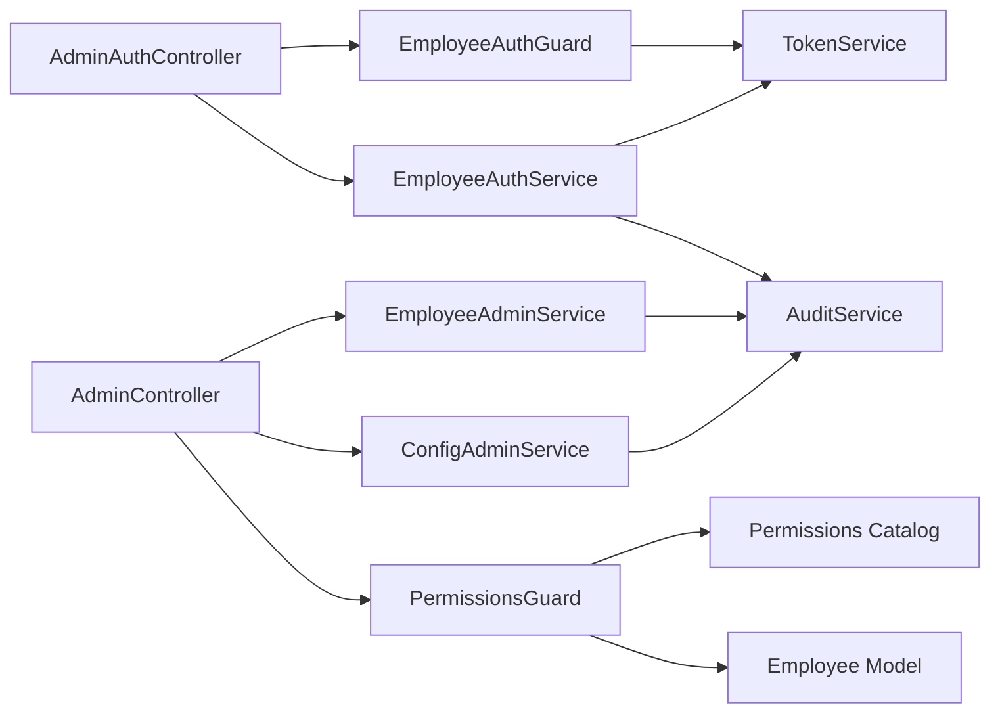

# Employee Authentication

<cite>
**Referenced Files in This Document**
- [employee.schema.ts](file://backend/apps/api/src/modules/auth/infrastructure/schemas/employee.schema.ts)
- [auth.types.ts](file://backend/apps/api/src/modules/auth/domain/auth.types.ts)
- [token.service.ts](file://backend/apps/api/src/modules/auth/infrastructure/token.service.ts)
- [jwt-auth.guard.ts](file://backend/apps/api/src/modules/auth/presentation/jwt-auth.guard.ts)
- [admin-auth.controller.ts](file://backend/apps/api/src/modules/auth/presentation/admin-auth.controller.ts)
- [employee-auth.service.ts](file://backend/apps/api/src/modules/auth/application/employee-auth.service.ts)
- [permissions.ts](file://backend/apps/api/src/modules/admin/domain/permissions.ts)
- [permissions.guard.ts](file://backend/apps/api/src/modules/admin/presentation/permissions.guard.ts)
- [admin.controller.ts](file://backend/apps/api/src/modules/admin/presentation/admin.controller.ts)
- [employee-admin.service.ts](file://backend/apps/api/src/modules/admin/application/employee-admin.service.ts)
- [config-admin.service.ts](file://backend/apps/api/src/modules/admin/application/config-admin.service.ts)
- [audit.service.ts](file://backend/libs/shared/src/audit/audit.service.ts)
- [user.schema.ts](file://backend/apps/api/src/modules/auth/infrastructure/schemas/user.schema.ts)
- [auth.dtos.ts](file://backend/apps/api/src/modules/auth/presentation/dto/auth.dtos.ts)
</cite>

## Table of Contents
1. [Introduction](#introduction)
2. [Project Structure](#project-structure)
3. [Core Components](#core-components)
4. [Architecture Overview](#architecture-overview)
5. [Detailed Component Analysis](#detailed-component-analysis)
6. [Dependency Analysis](#dependency-analysis)
7. [Performance Considerations](#performance-considerations)
8. [Troubleshooting Guide](#troubleshooting-guide)
9. [Conclusion](#conclusion)
10. [Appendices](#appendices)

## Introduction
This document explains the employee authentication system and its separation from regular user authentication. It covers:
- Employee login with optional TOTP enforcement
- Role-based access control (RBAC) for administrative functions
- Admin-only endpoints for employee management, configuration, and audit log access
- Security considerations for administrative access and multi-tenant scenarios

The system uses RS256 JWTs for short-lived access tokens and opaque refresh tokens stored as hashes. Employees are modeled separately from regular users to enforce distinct lifecycle and security policies.

## Project Structure
Employee authentication is implemented under the auth module with admin capabilities exposed via the admin module. Key layers:
- Presentation: controllers for admin auth and admin operations
- Application: services orchestrating business logic (employee auth, employee admin, config admin)
- Domain: permission catalog and role resolution logic
- Infrastructure: schemas, token service, guards, and shared audit service

**Diagram sources**
- [admin-auth.controller.ts:24-49](file://backend/apps/api/src/modules/auth/presentation/admin-auth.controller.ts#L24-L49)
- [employee-auth.service.ts:38-117](file://backend/apps/api/src/modules/auth/application/employee-auth.service.ts#L38-L117)
- [jwt-auth.guard.ts:10-34](file://backend/apps/api/src/modules/auth/presentation/jwt-auth.guard.ts#L10-L34)
- [admin.controller.ts:30-169](file://backend/apps/api/src/modules/admin/presentation/admin.controller.ts#L30-L169)
- [employee-admin.service.ts:27-123](file://backend/apps/api/src/modules/admin/application/employee-admin.service.ts#L27-L123)
- [config-admin.service.ts:6-36](file://backend/apps/api/src/modules/admin/application/config-admin.service.ts#L6-L36)
- [permissions.guard.ts:18-40](file://backend/apps/api/src/modules/admin/presentation/permissions.guard.ts#L18-L40)
- [permissions.ts:1-65](file://backend/apps/api/src/modules/admin/domain/permissions.ts#L1-L65)
- [audit.service.ts:23-44](file://backend/libs/shared/src/audit/audit.service.ts#L23-L44)

**Section sources**
- [admin-auth.controller.ts:24-49](file://backend/apps/api/src/modules/auth/presentation/admin-auth.controller.ts#L24-L49)
- [admin.controller.ts:30-169](file://backend/apps/api/src/modules/admin/presentation/admin.controller.ts#L30-L169)

## Core Components
- Employee schema defines employee identity, roles, per-user allow/deny overrides, TOTP state, and status.
- EmployeeAuthService handles login, TOTP setup/enable, session creation, and login history recording.
- TokenService issues RS256 access tokens and generates hashed refresh tokens.
- JwtAuthGuard enforces actor kind (EMPLOYEE vs USER) and validates access tokens.
- PermissionsCatalog and hasPermission implement RBAC with deny-wins semantics.
- PermissionsGuard enforces required permissions on admin endpoints using live employee data.
- AdminController exposes admin-only endpoints for employees, roles, users, config, and audit logs.
- AuditService records immutable audit events for compliance and traceability.

**Section sources**
- [employee.schema.ts:8-37](file://backend/apps/api/src/modules/auth/infrastructure/schemas/employee.schema.ts#L8-L37)
- [employee-auth.service.ts:38-117](file://backend/apps/api/src/modules/auth/application/employee-auth.service.ts#L38-L117)
- [token.service.ts:21-89](file://backend/apps/api/src/modules/auth/infrastructure/token.service.ts#L21-L89)
- [jwt-auth.guard.ts:10-34](file://backend/apps/api/src/modules/auth/presentation/jwt-auth.guard.ts#L10-L34)
- [permissions.ts:1-65](file://backend/apps/api/src/modules/admin/domain/permissions.ts#L1-L65)
- [permissions.guard.ts:18-40](file://backend/apps/api/src/modules/admin/presentation/permissions.guard.ts#L18-L40)
- [admin.controller.ts:30-169](file://backend/apps/api/src/modules/admin/presentation/admin.controller.ts#L30-L169)
- [audit.service.ts:23-44](file://backend/libs/shared/src/audit/audit.service.ts#L23-L44)

## Architecture Overview
The employee authentication flow is isolated from regular user flows by actor kind and dedicated endpoints. Access tokens carry actor and roles; guards ensure only EMPLOYEE actors reach admin routes. Permissions are enforced at runtime against live employee records.

**Diagram sources**
- [admin-auth.controller.ts:28-32](file://backend/apps/api/src/modules/auth/presentation/admin-auth.controller.ts#L28-L32)
- [employee-auth.service.ts:38-82](file://backend/apps/api/src/modules/auth/application/employee-auth.service.ts#L38-L82)
- [token.service.ts:42-48](file://backend/apps/api/src/modules/auth/infrastructure/token.service.ts#L42-L48)
- [audit.service.ts:29-35](file://backend/libs/shared/src/audit/audit.service.ts#L29-L35)

## Detailed Component Analysis

### Employee Schema and Data Model
- Fields include email, name, passwordHash, roles, permAllow, permDeny, TOTP flags and encrypted secret, and status.
- Status controls active/disabled states; TOTP secret is never stored in plaintext.
- Separation from regular users: User schema models traders with KYC and approval workflows, while Employee schema models internal admins.

**Diagram sources**
- [employee.schema.ts:8-37](file://backend/apps/api/src/modules/auth/infrastructure/schemas/employee.schema.ts#L8-L37)
- [user.schema.ts:5-67](file://backend/apps/api/src/modules/auth/infrastructure/schemas/user.schema.ts#L5-L67)

**Section sources**
- [employee.schema.ts:8-37](file://backend/apps/api/src/modules/auth/infrastructure/schemas/employee.schema.ts#L8-L37)
- [user.schema.ts:5-67](file://backend/apps/api/src/modules/auth/infrastructure/schemas/user.schema.ts#L5-L67)

### Employee Authentication Flow
- Login verifies credentials, enforces TOTP when enabled, creates a session, records login history, and returns an access token and refresh token.
- TOTP setup generates a provisioning URI and stores an encrypted secret; enabling TOTP requires verifying one time-based code and persists the enablement flag.
- The response includes a totpEnabled flag to guide client behavior.

**Diagram sources**
- [employee-auth.service.ts:38-82](file://backend/apps/api/src/modules/auth/application/employee-auth.service.ts#L38-L82)
- [employee-auth.service.ts:84-117](file://backend/apps/api/src/modules/auth/application/employee-auth.service.ts#L84-L117)

**Section sources**
- [employee-auth.service.ts:38-117](file://backend/apps/api/src/modules/auth/application/employee-auth.service.ts#L38-L117)
- [admin-auth.controller.ts:28-49](file://backend/apps/api/src/modules/auth/presentation/admin-auth.controller.ts#L28-L49)
- [auth.dtos.ts:90-105](file://backend/apps/api/src/modules/auth/presentation/dto/auth.dtos.ts#L90-L105)

### Role-Based Access Control (RBAC)
- Permission catalog enumerates all platform-wide permissions.
- Default roles define baseline permission sets; SUPER_ADMIN grants everything.
- Effective permission check combines roles, per-user allow list, and per-user deny list with deny-wins semantics.
- PermissionsGuard reads the live employee record to apply immediate effect of role changes or disablement.

**Diagram sources**
- [permissions.guard.ts:18-40](file://backend/apps/api/src/modules/admin/presentation/permissions.guard.ts#L18-L40)
- [permissions.ts:30-65](file://backend/apps/api/src/modules/admin/domain/permissions.ts#L30-L65)

**Section sources**
- [permissions.ts:1-65](file://backend/apps/api/src/modules/admin/domain/permissions.ts#L1-L65)
- [permissions.guard.ts:18-40](file://backend/apps/api/src/modules/admin/presentation/permissions.guard.ts#L18-L40)

### Admin-Only Endpoints and Responsibilities
- Employee management: list, create, update, reset password, list roles, update role permissions, and permission catalog.
- User administration: list, detail, approve/reject, suspend/unsuspend.
- Configuration: list and set application configuration keys.
- Audit logs: query by entity+entityId or actorId.

**Diagram sources**
- [admin.controller.ts:42-97](file://backend/apps/api/src/modules/admin/presentation/admin.controller.ts#L42-L97)
- [admin.controller.ts:149-169](file://backend/apps/api/src/modules/admin/presentation/admin.controller.ts#L149-L169)
- [employee-admin.service.ts:36-117](file://backend/apps/api/src/modules/admin/application/employee-admin.service.ts#L36-L117)
- [config-admin.service.ts:12-36](file://backend/apps/api/src/modules/admin/application/config-admin.service.ts#L12-L36)
- [permissions.guard.ts:18-40](file://backend/apps/api/src/modules/admin/presentation/permissions.guard.ts#L18-L40)

**Section sources**
- [admin.controller.ts:42-169](file://backend/apps/api/src/modules/admin/presentation/admin.controller.ts#L42-L169)
- [employee-admin.service.ts:36-117](file://backend/apps/api/src/modules/admin/application/employee-admin.service.ts#L36-L117)
- [config-admin.service.ts:12-36](file://backend/apps/api/src/modules/admin/application/config-admin.service.ts#L12-L36)

### Tokenization and Guard Enforcement
- Access tokens are RS256 signed with claims including sub, actor kind, typ, and roles.
- Refresh tokens are opaque random values stored only as SHA-256 hashes with expiry.
- JwtAuthGuard ensures requests to protected routes carry a valid access token and that the actor matches the expected kind (EMPLOYEE for admin routes).

**Diagram sources**
- [jwt-auth.guard.ts:10-34](file://backend/apps/api/src/modules/auth/presentation/jwt-auth.guard.ts#L10-L34)
- [token.service.ts:42-58](file://backend/apps/api/src/modules/auth/infrastructure/token.service.ts#L42-L58)

**Section sources**
- [jwt-auth.guard.ts:10-34](file://backend/apps/api/src/modules/auth/presentation/jwt-auth.guard.ts#L10-L34)
- [token.service.ts:21-89](file://backend/apps/api/src/modules/auth/infrastructure/token.service.ts#L21-L89)
- [auth.types.ts:24-38](file://backend/apps/api/src/modules/auth/domain/auth.types.ts#L24-L38)

### Examples

#### Employee Registration (Admin Workflow)
- An existing admin with appropriate permissions calls the employee creation endpoint to provision a new employee account with initial roles and a temporary password.
- The operation is audited with before/after context where applicable.

**Section sources**
- [admin.controller.ts:48-52](file://backend/apps/api/src/modules/admin/presentation/admin.controller.ts#L48-L52)
- [employee-admin.service.ts:40-58](file://backend/apps/api/src/modules/admin/application/employee-admin.service.ts#L40-L58)

#### Employee Login Workflow
- The admin client posts credentials to the admin login endpoint. If TOTP is enabled, a six-digit code must be provided; otherwise, the server responds indicating TOTP is required.
- On success, the client receives an access token and a refresh token, along with a flag indicating whether TOTP is enabled for future logins.

**Section sources**
- [admin-auth.controller.ts:28-32](file://backend/apps/api/src/modules/auth/presentation/admin-auth.controller.ts#L28-L32)
- [employee-auth.service.ts:38-82](file://backend/apps/api/src/modules/auth/application/employee-auth.service.ts#L38-L82)
- [auth.dtos.ts:90-105](file://backend/apps/api/src/modules/auth/presentation/dto/auth.dtos.ts#L90-L105)

#### Permission Checking Mechanism
- Each admin endpoint declares required permissions via metadata.
- PermissionsGuard resolves the current employee’s roles and overrides, then evaluates effective permissions using deny-wins logic.
- Changes to roles or overrides take effect immediately without waiting for token expiry.

**Section sources**
- [admin.controller.ts:42-97](file://backend/apps/api/src/modules/admin/presentation/admin.controller.ts#L42-L97)
- [permissions.guard.ts:18-40](file://backend/apps/api/src/modules/admin/presentation/permissions.guard.ts#L18-L40)
- [permissions.ts:48-65](file://backend/apps/api/src/modules/admin/domain/permissions.ts#L48-L65)

## Dependency Analysis
- Controllers depend on application services for business logic.
- Services depend on infrastructure components (schemas, token service, audit service).
- Guards depend on token service and employee model to enforce actor kind and permissions.
- Permissions evaluation depends on a role cache and live employee data.

**Diagram sources**
- [admin-auth.controller.ts:24-49](file://backend/apps/api/src/modules/auth/presentation/admin-auth.controller.ts#L24-L49)
- [employee-auth.service.ts:22-36](file://backend/apps/api/src/modules/auth/application/employee-auth.service.ts#L22-L36)
- [jwt-auth.guard.ts:10-34](file://backend/apps/api/src/modules/auth/presentation/jwt-auth.guard.ts#L10-L34)
- [admin.controller.ts:30-169](file://backend/apps/api/src/modules/admin/presentation/admin.controller.ts#L30-L169)
- [employee-admin.service.ts:27-34](file://backend/apps/api/src/modules/admin/application/employee-admin.service.ts#L27-L34)
- [config-admin.service.ts:6-10](file://backend/apps/api/src/modules/admin/application/config-admin.service.ts#L6-L10)
- [permissions.guard.ts:18-24](file://backend/apps/api/src/modules/admin/presentation/permissions.guard.ts#L18-L24)
- [permissions.ts:1-65](file://backend/apps/api/src/modules/admin/domain/permissions.ts#L1-L65)
- [audit.service.ts:23-44](file://backend/libs/shared/src/audit/audit.service.ts#L23-L44)

**Section sources**
- [admin.controller.ts:30-169](file://backend/apps/api/src/modules/admin/presentation/admin.controller.ts#L30-L169)
- [employee-auth.service.ts:22-36](file://backend/apps/api/src/modules/auth/application/employee-auth.service.ts#L22-L36)
- [permissions.guard.ts:18-40](file://backend/apps/api/src/modules/admin/presentation/permissions.guard.ts#L18-L40)

## Performance Considerations
- Token verification is lightweight and stateless; keep access TTL short for faster rotation.
- Refresh token storage uses hashed values to minimize risk and reduce lookup overhead.
- PermissionsGuard reads employee data per request to reflect immediate role changes; consider caching strategies if read load increases significantly.
- Audit writes are fire-and-forget with error logging to avoid impacting request latency.

[No sources needed since this section provides general guidance]

## Troubleshooting Guide
Common issues and resolutions:
- Invalid credentials or inactive employee: Ensure the employee exists, is ACTIVE, and password matches.
- TOTP required or invalid: If TOTP is enabled, provide a valid six-digit code; otherwise, complete TOTP setup and enablement first.
- Insufficient permissions: Verify the employee’s roles and overrides; confirm the endpoint requires the necessary permission.
- Unknown role or permission: Ensure referenced roles exist and permissions are within the catalog.
- Self-lockout prevention: Cannot disable or demote your own account if it would remove critical roles.

**Section sources**
- [employee-auth.service.ts:43-59](file://backend/apps/api/src/modules/auth/application/employee-auth.service.ts#L43-L59)
- [employee-auth.service.ts:99-117](file://backend/apps/api/src/modules/auth/application/employee-auth.service.ts#L99-L117)
- [permissions.guard.ts:26-40](file://backend/apps/api/src/modules/admin/presentation/permissions.guard.ts#L26-L40)
- [employee-admin.service.ts:60-81](file://backend/apps/api/src/modules/admin/application/employee-admin.service.ts#L60-L81)
- [employee-admin.service.ts:94-109](file://backend/apps/api/src/modules/admin/application/employee-admin.service.ts#L94-L109)

## Conclusion
The employee authentication system provides a secure, separated pathway for administrative access with strong controls:
- Distinct employee model and actor kind separate admin flows from user flows.
- Optional but enforceable TOTP adds robust second-factor protection.
- RBAC with deny-wins semantics ensures precise control over admin capabilities.
- Immutable audit logging supports compliance and incident investigation.
- Multi-tenant readiness can be achieved by scoping tenant identifiers into tokens and enforcing tenant checks in guards/services where applicable.

[No sources needed since this section summarizes without analyzing specific files]

## Appendices

### Admin Endpoint Reference
- Employee management:
  - GET /admin/employees
  - POST /admin/employees
  - PATCH /admin/employees/:id
  - POST /admin/employees/:id/reset-password
  - GET /admin/roles
  - PUT /admin/roles/:key
  - GET /admin/permissions
- User administration:
  - GET /admin/users
  - GET /admin/users/:id
  - POST /admin/users/:id/approve
  - POST /admin/users/:id/reject
  - POST /admin/users/:id/suspend
  - POST /admin/users/:id/unsuspend
- Configuration:
  - GET /admin/config
  - PUT /admin/config
- Audit logs:
  - GET /admin/audit-logs

**Section sources**
- [admin.controller.ts:42-169](file://backend/apps/api/src/modules/admin/presentation/admin.controller.ts#L42-L169)

### Security Considerations for Administrative Access and Multi-Tenant Scenarios
- Enforce minimum privilege principle: assign only required roles and use per-user permAllow/permDeny for fine-grained control.
- Always require TOTP for admin accounts; enforce enablement post-first-login.
- Use short-lived access tokens and rotate refresh tokens regularly.
- For multi-tenancy, add tenant context to tokens and validate tenant ownership in guards/services to prevent cross-tenant access.
- Monitor audit logs for anomalous admin activity and configure alerts for sensitive actions like role updates and configuration changes.

[No sources needed since this section provides general guidance]