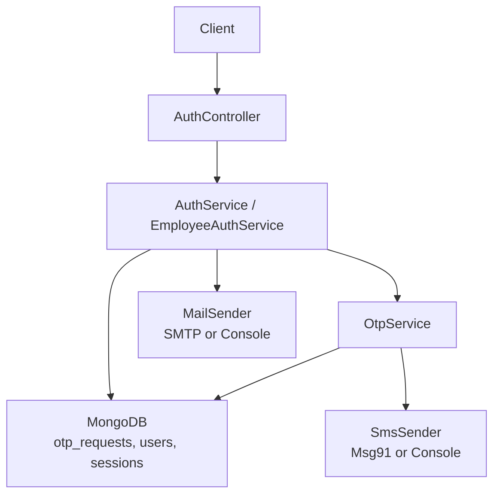
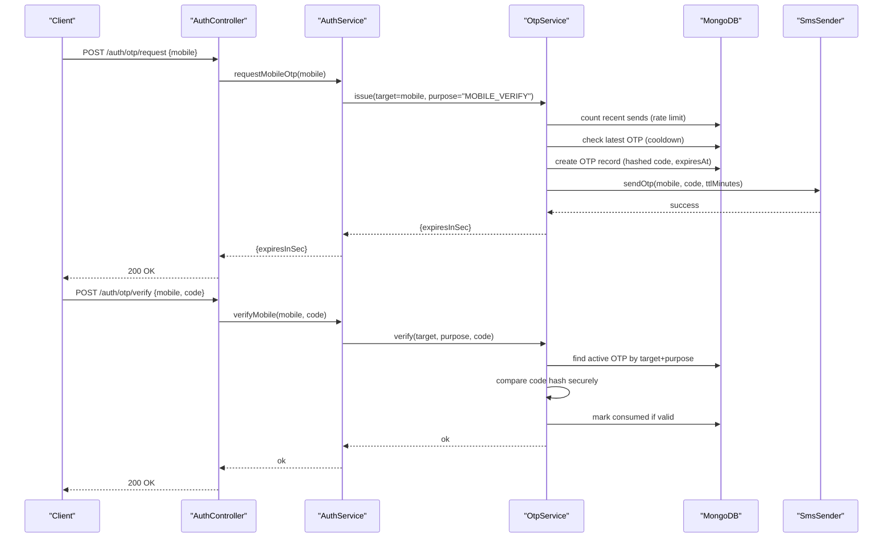
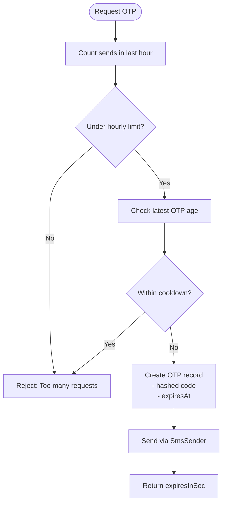
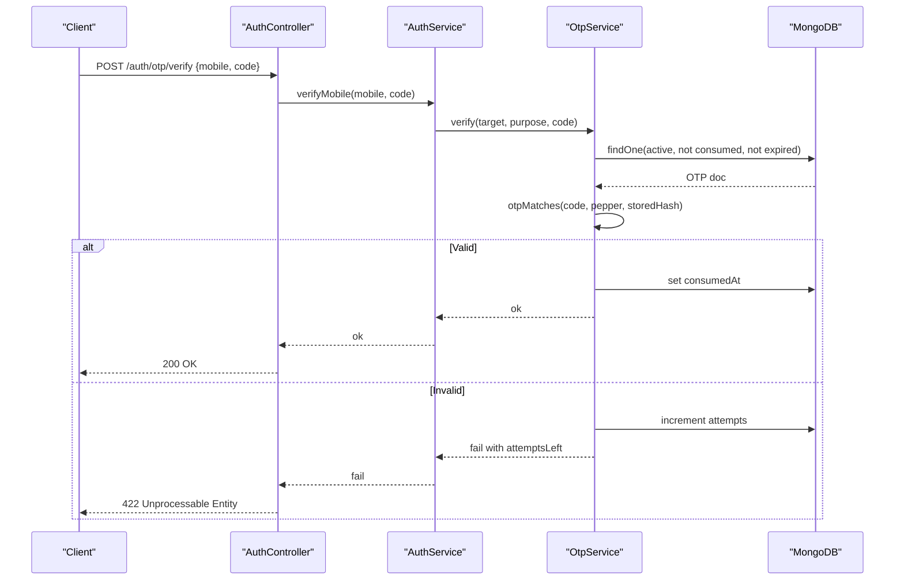
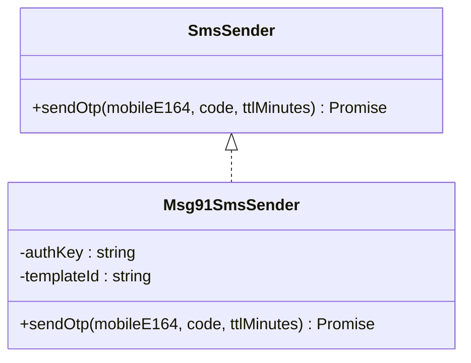
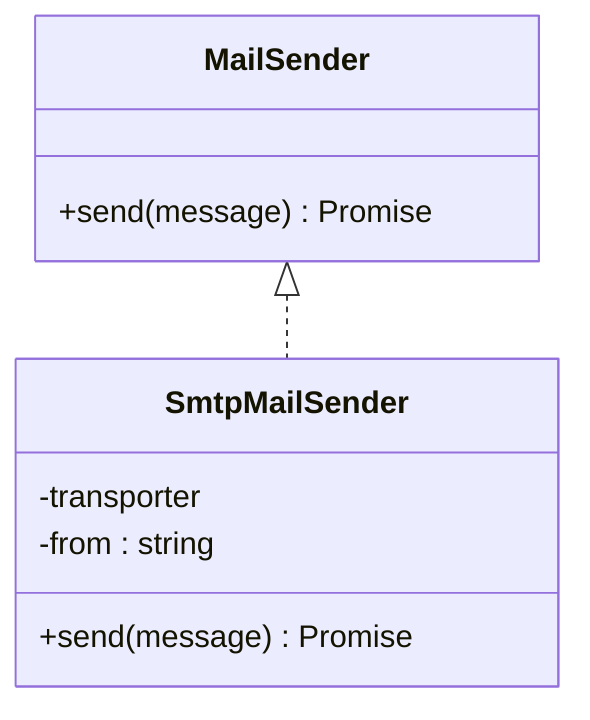
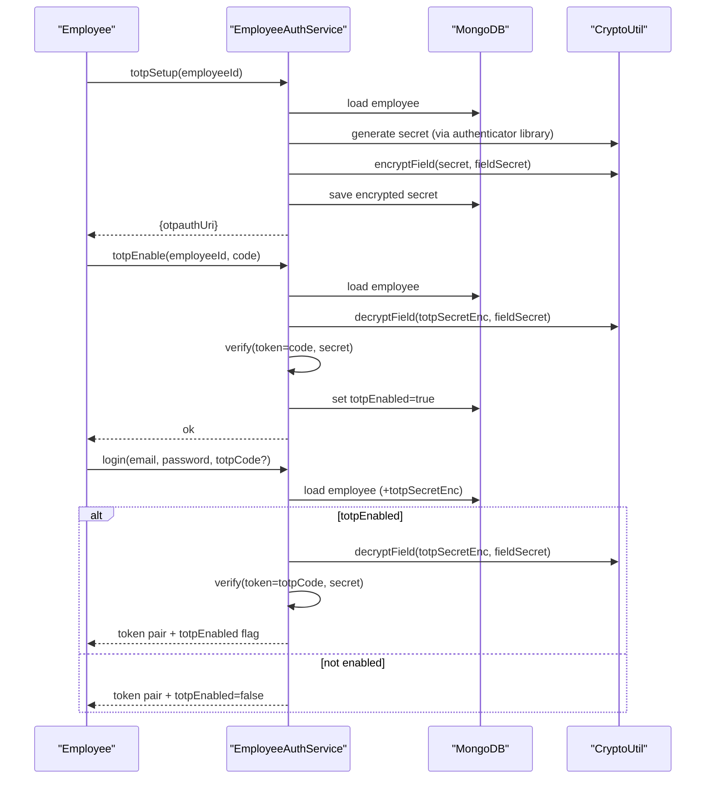
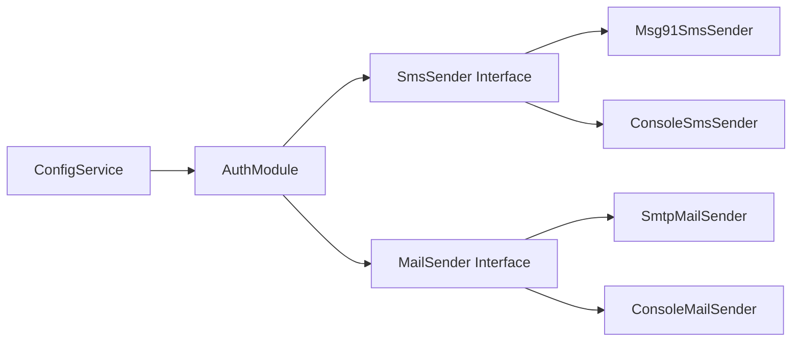

# OTP & TOTP Verification

<cite>
**Referenced Files in This Document**
- [auth.module.ts](file://backend/apps/api/src/modules/auth/auth.module.ts)
- [auth.controller.ts](file://backend/apps/api/src/modules/auth/presentation/auth.controller.ts)
- [auth.service.ts](file://backend/apps/api/src/modules/auth/application/auth.service.ts)
- [otp.service.ts](file://backend/apps/api/src/modules/auth/infrastructure/otp.service.ts)
- [otp.util.ts](file://backend/apps/api/src/modules/auth/infrastructure/otp.util.ts)
- [otp-request.schema.ts](file://backend/apps/api/src/modules/auth/infrastructure/schemas/otp-request.schema.ts)
- [msg91-sms.sender.ts](file://backend/apps/api/src/modules/auth/infrastructure/sms/msg91-sms.sender.ts)
- [sms.port.ts](file://backend/apps/api/src/modules/auth/infrastructure/sms/sms.port.ts)
- [smtp-mail.sender.ts](file://backend/apps/api/src/modules/auth/infrastructure/mail/smtp-mail.sender.ts)
- [mail.port.ts](file://backend/apps/api/src/modules/auth/infrastructure/mail/mail.port.ts)
- [crypto.util.ts](file://backend/apps/api/src/modules/auth/infrastructure/crypto.util.ts)
- [employee-auth.service.ts](file://backend/apps/api/src/modules/auth/application/employee-auth.service.ts)
- [app-config.schema.ts](file://backend/libs/shared/src/config/app-config.schema.ts)
</cite>

## Table of Contents
1. Introduction
2. Project Structure
3. Core Components
4. Architecture Overview
5. Detailed Component Analysis
6. Dependency Analysis
7. Performance Considerations
8. Troubleshooting Guide
9. Conclusion

## Introduction
This document explains the OTP and TOTP verification system used for two-factor authentication (2FA). It covers:
- SMS-based OTP issuance and verification with rate limiting, expiration, and cooldowns
- Email verification flows using SMTP
- Admin 2FA via TOTP, including setup, QR code generation, verification, and backup codes
- Security measures against brute force, replay, and timing attacks
- Integration points with Msg91 SMS and SMTP email providers
- Operational guidance and troubleshooting

## Project Structure
The OTP/TOTP features are implemented under the auth module with a clear separation of concerns:
- Presentation layer exposes REST endpoints for OTP and auth flows
- Application layer orchestrates business logic
- Infrastructure layer implements storage, messaging, and crypto utilities
- Providers are injected via interfaces to support multiple backends (SMS, mail)

**Diagram sources**
- [auth.controller.ts:53-139](file://backend/apps/api/src/modules/auth/presentation/auth.controller.ts#L53-L139)
- [auth.service.ts:28-102](file://backend/apps/api/src/modules/auth/application/auth.service.ts#L28-L102)
- [otp.service.ts:15-76](file://backend/apps/api/src/modules/auth/infrastructure/otp.service.ts#L15-L76)
- [auth.module.ts:24-57](file://backend/apps/api/src/modules/auth/auth.module.ts#L24-L57)

**Section sources**
- [auth.module.ts:24-57](file://backend/apps/api/src/modules/auth/auth.module.ts#L24-L57)
- [auth.controller.ts:53-139](file://backend/apps/api/src/modules/auth/presentation/auth.controller.ts#L53-L139)

## Core Components
- AuthController: Exposes REST endpoints for registration, login, OTP request/verify, email verification, password reset, session management. Applies strict throttling on sensitive endpoints.
- AuthService: Handles user registration, mobile OTP issuance/verification, email verification, login, refresh/logout, password reset, and new device notifications.
- OtpService: Implements OTP lifecycle with TTL, max attempts, hourly limits, resend cooldown; persists hashed OTPs; sends via SmsSender.
- EmployeeAuthService: Implements admin 2FA with TOTP: setup, enable, and mandatory TOTP verification at login.
- Providers:
  - SmsSender interface with Msg91SmsSender implementation
  - MailSender interface with SmtpMailSender implementation
- Crypto utilities: AES-256-GCM field encryption for storing secrets like TOTP secret; secure OTP hashing and comparison.

**Section sources**
- [auth.controller.ts:53-139](file://backend/apps/api/src/modules/auth/presentation/auth.controller.ts#L53-L139)
- [auth.service.ts:28-102](file://backend/apps/api/src/modules/auth/application/auth.service.ts#L28-L102)
- [otp.service.ts:15-76](file://backend/apps/api/src/modules/auth/infrastructure/otp.service.ts#L15-L76)
- [employee-auth.service.ts:38-101](file://backend/apps/api/src/modules/auth/application/employee-auth.service.ts#L38-L101)
- [msg91-sms.sender.ts:1-36](file://backend/apps/api/src/modules/auth/infrastructure/sms/msg91-sms.sender.ts#L1-L36)
- [smtp-mail.sender.ts:1-20](file://backend/apps/api/src/modules/auth/infrastructure/mail/smtp-mail.sender.ts#L1-L20)
- [crypto.util.ts:1-44](file://backend/apps/api/src/modules/auth/infrastructure/crypto.util.ts#L1-L44)

## Architecture Overview
The OTP flow is designed around short-lived, single-use codes stored as hashes, with strict rate limiting and cooldowns. The TOTP flow adds an authenticator app step for admins, with encrypted secret storage and mandatory verification on login when enabled.

**Diagram sources**
- [auth.controller.ts:63-73](file://backend/apps/api/src/modules/auth/presentation/auth.controller.ts#L63-L73)
- [auth.service.ts:83-102](file://backend/apps/api/src/modules/auth/application/auth.service.ts#L83-L102)
- [otp.service.ts:28-74](file://backend/apps/api/src/modules/auth/infrastructure/otp.service.ts#L28-L74)
- [msg91-sms.sender.ts:20-34](file://backend/apps/api/src/modules/auth/infrastructure/sms/msg91-sms.sender.ts#L20-L34)

## Detailed Component Analysis

### OTP Request Lifecycle and Rate Limiting
- Hourly limit: Enforced by counting recent OTP requests per target within the last hour.
- Resend cooldown: Prevents rapid reissuance by checking the most recent OTP creation time.
- TTL: Each OTP has an expiration timestamp; only non-expired, unconsumed records are considered during verification.
- Attempts: A per-record attempt counter prevents brute force; exceeding the configured maximum locks the code until a new OTP is issued.
- Storage: Only a hash of the OTP code is persisted; the plaintext code is never stored.

**Diagram sources**
- [otp.service.ts:28-53](file://backend/apps/api/src/modules/auth/infrastructure/otp.service.ts#L28-L53)

**Section sources**
- [otp.service.ts:28-53](file://backend/apps/api/src/modules/auth/infrastructure/otp.service.ts#L28-L53)
- [otp-request.schema.ts:4-34](file://backend/apps/api/src/modules/auth/infrastructure/schemas/otp-request.schema.ts#L4-L34)

### OTP Verification Flow
- Lookup: Finds the latest active OTP for the given target and purpose that has not expired and is not consumed.
- Comparison: Uses constant-time comparison of hashed values to prevent timing attacks.
- Consumption: On success, marks the OTP as consumed to prevent reuse (replay protection).
- Failure handling: Increments attempts on mismatch; returns remaining attempts.

**Diagram sources**
- [auth.controller.ts:69-73](file://backend/apps/api/src/modules/auth/presentation/auth.controller.ts#L69-L73)
- [auth.service.ts:90-102](file://backend/apps/api/src/modules/auth/application/auth.service.ts#L90-L102)
- [otp.service.ts:55-74](file://backend/apps/api/src/modules/auth/infrastructure/otp.service.ts#L55-L74)
- [otp.util.ts:11-15](file://backend/apps/api/src/modules/auth/infrastructure/otp.util.ts#L11-L15)

**Section sources**
- [otp.service.ts:55-74](file://backend/apps/api/src/modules/auth/infrastructure/otp.service.ts#L55-L74)
- [otp.util.ts:1-16](file://backend/apps/api/src/modules/auth/infrastructure/otp.util.ts#L1-L16)

### SMS Provider Integration (Msg91)
- Configuration: Requires MSG91_AUTH_KEY and MSG91_TEMPLATE_ID.
- Delivery: Sends OTP via Msg91 Flow API with template variable for OTP value.
- Error handling: Logs provider errors and throws to propagate failure up the stack.

**Diagram sources**
- [sms.port.ts:1-6](file://backend/apps/api/src/modules/auth/infrastructure/sms/sms.port.ts#L1-L6)
- [msg91-sms.sender.ts:1-36](file://backend/apps/api/src/modules/auth/infrastructure/sms/msg91-sms.sender.ts#L1-L36)

**Section sources**
- [msg91-sms.sender.ts:1-36](file://backend/apps/api/src/modules/auth/infrastructure/sms/msg91-sms.sender.ts#L1-L36)

### Email Services (SMTP)
- Configuration: Uses SMTP_URL and MAIL_FROM from environment.
- Usage: Sends email verification links and password reset links.
- Fallback: Console mail sender available for development.

**Diagram sources**
- [mail.port.ts:1-13](file://backend/apps/api/src/modules/auth/infrastructure/mail/mail.port.ts#L1-L13)
- [smtp-mail.sender.ts:1-20](file://backend/apps/api/src/modules/auth/infrastructure/mail/smtp-mail.sender.ts#L1-L20)

**Section sources**
- [smtp-mail.sender.ts:1-20](file://backend/apps/api/src/modules/auth/infrastructure/mail/smtp-mail.sender.ts#L1-L20)
- [auth.service.ts:112-141](file://backend/apps/api/src/modules/auth/application/auth.service.ts#L112-L141)

### TOTP Setup, QR Code Generation, and Verification
- Setup: Generates a secret, encrypts it with AES-256-GCM using a field encryption key derived from OTP_PEPPER, and stores the encrypted secret.
- QR Code: Produces an otpauth URI suitable for scanning with authenticator apps.
- Enable: Verifies one code to confirm possession, then enforces TOTP on subsequent logins.
- Login: If TOTP is enabled, requires a valid TOTP code; otherwise fails with a specific error.

**Diagram sources**
- [employee-auth.service.ts:38-101](file://backend/apps/api/src/modules/auth/application/employee-auth.service.ts#L38-L101)
- [crypto.util.ts:9-24](file://backend/apps/api/src/modules/auth/infrastructure/crypto.util.ts#L9-L24)

**Section sources**
- [employee-auth.service.ts:38-101](file://backend/apps/api/src/modules/auth/application/employee-auth.service.ts#L38-L101)
- [crypto.util.ts:1-44](file://backend/apps/api/src/modules/auth/infrastructure/crypto.util.ts#L1-L44)

### Security Measures
- Brute force protection:
  - Per-code attempt limit enforced in OTP verification
  - Strict endpoint throttling on auth and OTP endpoints
- Replay attack prevention:
  - OTPs are marked consumed after successful use
  - TOTP codes are time-bound and single-use by design
- Timing attack mitigation:
  - Constant-time comparison for OTP code matching
- Secure storage:
  - OTP codes stored as SHA-256 hashes with a pepper
  - TOTP secrets encrypted at rest using AES-256-GCM

**Section sources**
- [otp.service.ts:55-74](file://backend/apps/api/src/modules/auth/infrastructure/otp.service.ts#L55-L74)
- [otp.util.ts:11-15](file://backend/apps/api/src/modules/auth/infrastructure/otp.util.ts#L11-L15)
- [auth.controller.ts:22-23](file://backend/apps/api/src/modules/auth/presentation/auth.controller.ts#L22-L23)
- [crypto.util.ts:9-24](file://backend/apps/api/src/modules/auth/infrastructure/crypto.util.ts#L9-L24)

## Dependency Analysis
- Module wiring:
  - SMS_SENDER and MAIL_SENDER are provided via factories selecting Msg91/Console and SMTP/Console based on configuration.
- Data models:
  - otp_requests schema indexes target and createdAt; TTL index auto-cleans expired documents.
- Configuration:
  - App-level config keys drive OTP behavior (TTL, attempts, limits, cooldown).

**Diagram sources**
- [auth.module.ts:24-57](file://backend/apps/api/src/modules/auth/auth.module.ts#L24-L57)

**Section sources**
- [auth.module.ts:24-57](file://backend/apps/api/src/modules/auth/auth.module.ts#L24-L57)
- [otp-request.schema.ts:4-34](file://backend/apps/api/src/modules/auth/infrastructure/schemas/otp-request.schema.ts#L4-L34)
- [app-config.schema.ts:4-19](file://backend/libs/shared/src/config/app-config.schema.ts#L4-L19)

## Performance Considerations
- Database indexing:
  - otp_requests uses compound index on target and createdAt for fast lookups and cooldown checks.
  - TTL index automatically purges expired OTPs.
- Throttling:
  - Strict throttling on sensitive endpoints reduces risk of abuse and protects downstream services.
- Messaging:
  - SMS and email calls are asynchronous from the perspective of the caller; ensure retries and circuit breakers at the provider level if needed.
- Encryption overhead:
  - Field encryption for TOTP secrets is lightweight but should be used judiciously; avoid unnecessary cryptographic operations in hot paths.

[No sources needed since this section provides general guidance]

## Troubleshooting Guide
Common issues and resolutions:
- OTP delivery failures:
  - Verify MSG91_AUTH_KEY and MSG91_TEMPLATE_ID are set correctly.
  - Ensure mobile numbers are in E.164 format without leading plus when sent to provider.
  - Check provider response logs for HTTP status and error bodies.
- OTP verification failures:
  - Confirm the OTP has not expired and has not been consumed.
  - Check attempt counts; if locked, request a new OTP.
  - Validate that the correct pepper is configured and consistent across environments.
- Email link invalid/expired:
  - Email verification and password reset tokens have limited lifetimes; regenerate if expired.
  - Ensure APP_BASE_URL is correctly configured so links resolve properly.
- TOTP setup issues:
  - Ensure the authenticator app supports standard TOTP (RFC 6238).
  - After setup, verify one code before enabling; if failed, re-run setup.
  - If TOTP is enabled, all future logins must include a valid TOTP code.

**Section sources**
- [msg91-sms.sender.ts:20-34](file://backend/apps/api/src/modules/auth/infrastructure/sms/msg91-sms.sender.ts#L20-L34)
- [otp.service.ts:28-74](file://backend/apps/api/src/modules/auth/infrastructure/otp.service.ts#L28-L74)
- [auth.service.ts:112-141](file://backend/apps/api/src/modules/auth/application/auth.service.ts#L112-L141)
- [employee-auth.service.ts:38-101](file://backend/apps/api/src/modules/auth/application/employee-auth.service.ts#L38-L101)

## Conclusion
The OTP and TOTP system combines robust security practices with operational flexibility:
- SMS OTPs are short-lived, hashed, rate-limited, and delivered via configurable providers
- Email verification and password reset flows are integrated with SMTP
- Admin 2FA via TOTP ensures strong authentication for privileged accounts
- Security controls mitigate brute force, replay, and timing attacks
- Clear configuration and modular design simplify deployment and maintenance

[No sources needed since this section summarizes without analyzing specific files]