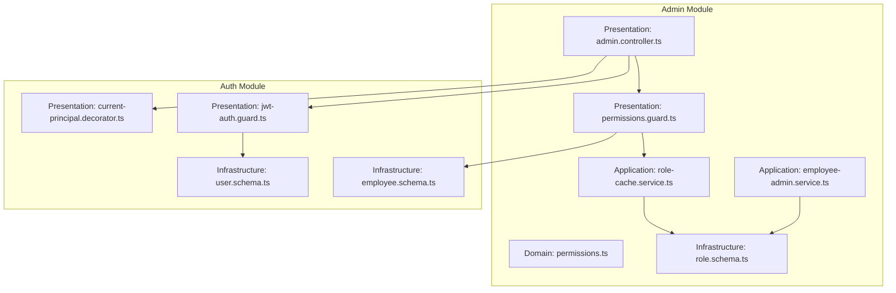
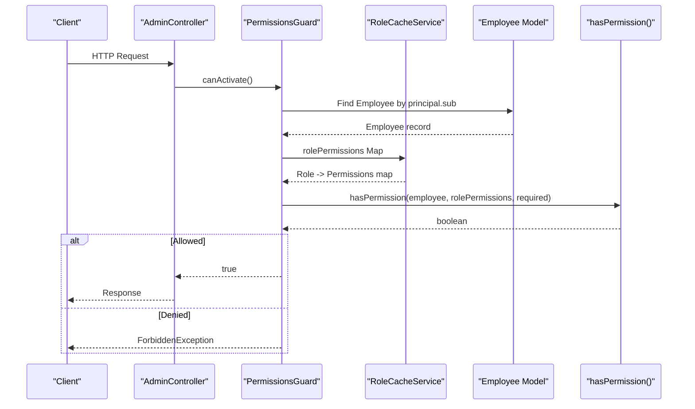
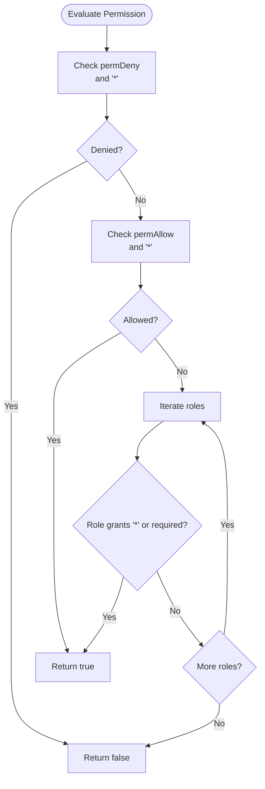
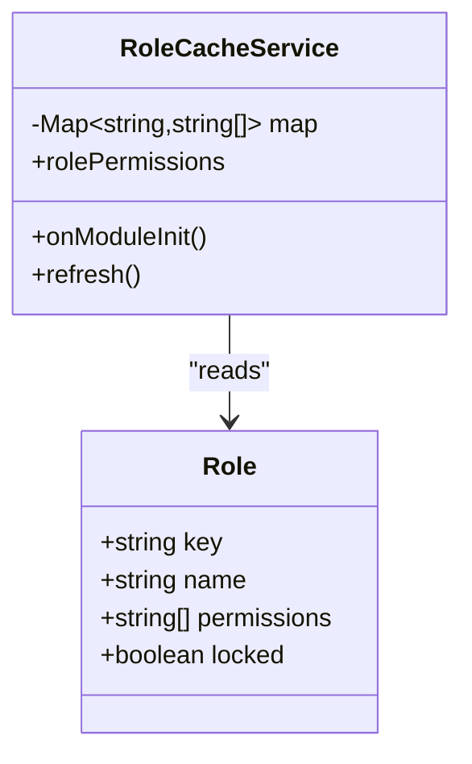
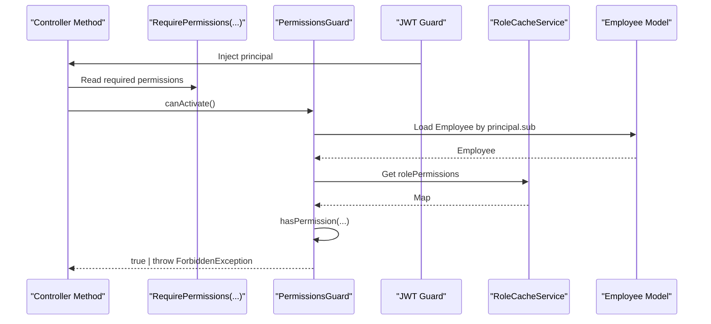
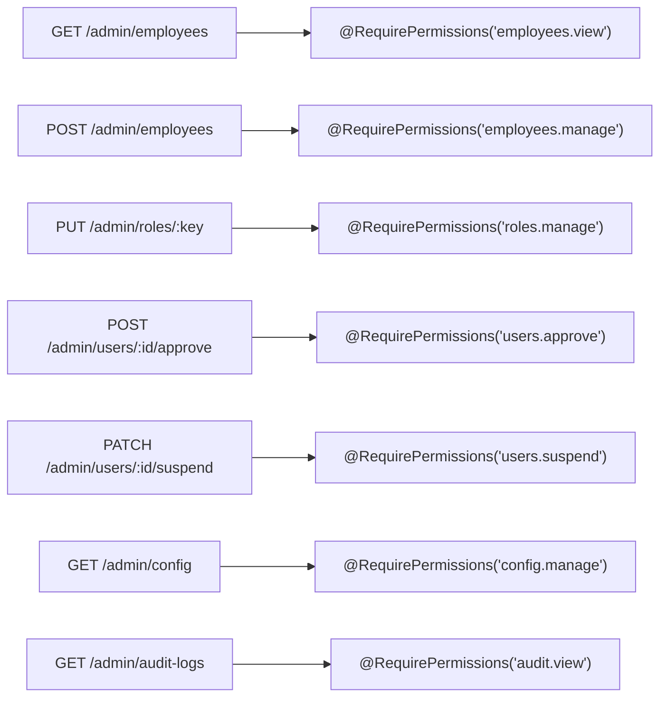
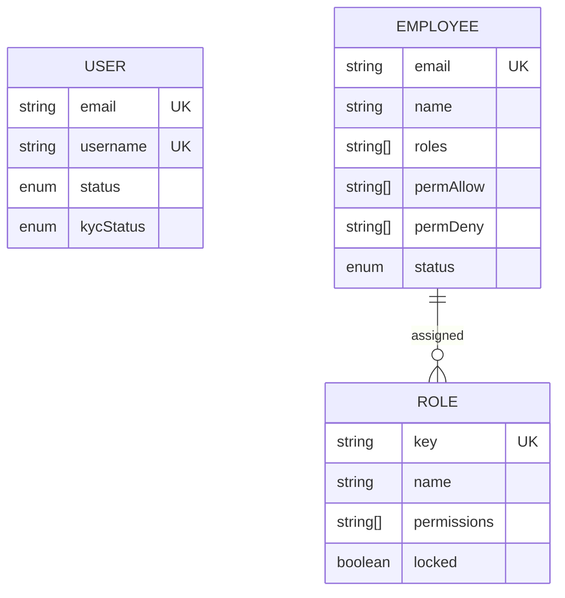
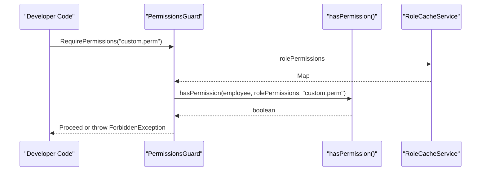
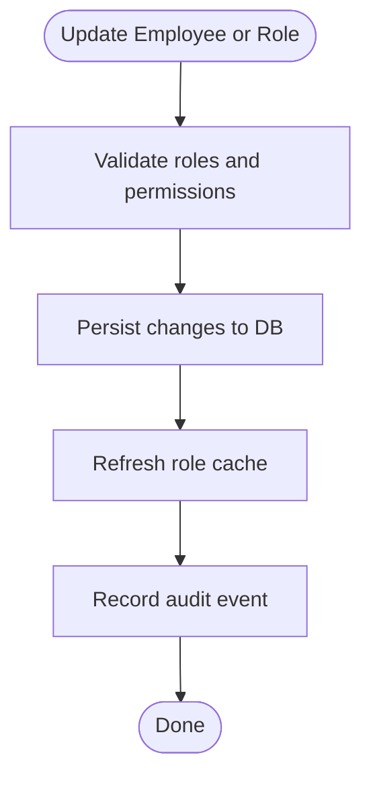
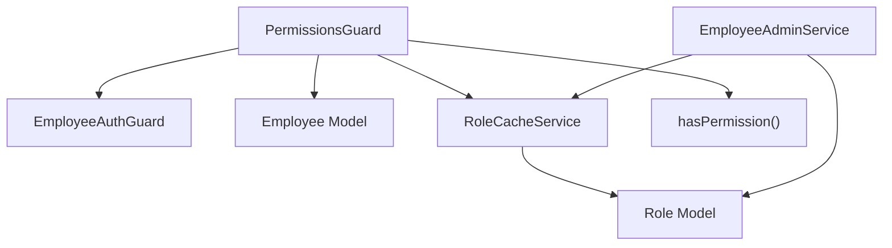

# RBAC & Permissions

<cite>
**Referenced Files in This Document**
- [permissions.ts](file://backend/apps/api/src/modules/admin/domain/permissions.ts)
- [role.schema.ts](file://backend/apps/api/src/modules/admin/infrastructure/role.schema.ts)
- [permissions.guard.ts](file://backend/apps/api/src/modules/admin/presentation/permissions.guard.ts)
- [role-cache.service.ts](file://backend/apps/api/src/modules/admin/application/role-cache.service.ts)
- [admin.controller.ts](file://backend/apps/api/src/modules/admin/presentation/admin.controller.ts)
- [employee-admin.service.ts](file://backend/apps/api/src/modules/admin/application/employee-admin.service.ts)
- [jwt-auth.guard.ts](file://backend/apps/api/src/modules/auth/presentation/jwt-auth.guard.ts)
- [current-principal.decorator.ts](file://backend/apps/api/src/modules/auth/presentation/current-principal.decorator.ts)
- [user.schema.ts](file://backend/apps/api/src/modules/auth/infrastructure/schemas/user.schema.ts)
- [employee.schema.ts](file://backend/apps/api/src/modules/auth/infrastructure/schemas/employee.schema.ts)
- [permissions.spec.ts](file://backend/apps/api/src/modules/admin/__tests__/permissions.spec.ts)
</cite>

## Table of Contents
1. [Introduction](#introduction)
2. [Project Structure](#project-structure)
3. [Core Components](#core-components)
4. [Architecture Overview](#architecture-overview)
5. [Detailed Component Analysis](#detailed-component-analysis)
6. [Dependency Analysis](#dependency-analysis)
7. [Performance Considerations](#performance-considerations)
8. [Troubleshooting Guide](#troubleshooting-guide)
9. [Conclusion](#conclusion)
10. [Appendices](#appendices)

## Introduction
This document explains the Role-Based Access Control (RBAC) and permissions system implemented for the admin module. It covers the permission model, role hierarchy, granular access control via per-user allow/deny overrides, route protection using a guard and decorator-based authorization, dynamic permission evaluation, and performance strategies including caching. It also clarifies the relationships between users, employees, and roles, and provides guidance on creating custom guards, implementing permission checks, and managing role assignments.

## Project Structure
The RBAC implementation is centered in the admin module with supporting pieces in the auth module:
- Domain layer defines the permission catalog, default roles, and the pure permission evaluation function.
- Infrastructure layer defines the Role schema used to persist roles and their permissions.
- Application layer includes a cache service that maintains an in-memory map of role-to-permissions and seeds default roles.
- Presentation layer exposes a guard and decorator to enforce permissions on routes, plus controllers that annotate endpoints with required permissions.
- Auth module provides authentication guards and decorators that establish the current principal and validate tokens before authorization runs.

**Diagram sources**
- [permissions.ts:1-65](file://backend/apps/api/src/modules/admin/domain/permissions.ts#L1-L65)
- [role.schema.ts:1-22](file://backend/apps/api/src/modules/admin/infrastructure/role.schema.ts#L1-L22)
- [role-cache.service.ts:1-45](file://backend/apps/api/src/modules/admin/application/role-cache.service.ts#L1-L45)
- [permissions.guard.ts:1-42](file://backend/apps/api/src/modules/admin/presentation/permissions.guard.ts#L1-L42)
- [admin.controller.ts:1-171](file://backend/apps/api/src/modules/admin/presentation/admin.controller.ts#L1-L171)
- [employee-admin.service.ts:1-125](file://backend/apps/api/src/modules/admin/application/employee-admin.service.ts#L1-L125)
- [jwt-auth.guard.ts:1-34](file://backend/apps/api/src/modules/auth/presentation/jwt-auth.guard.ts#L1-L34)
- [current-principal.decorator.ts:1-17](file://backend/apps/api/src/modules/auth/presentation/current-principal.decorator.ts#L1-L17)
- [employee.schema.ts:1-41](file://backend/apps/api/src/modules/auth/infrastructure/schemas/employee.schema.ts#L1-L41)
- [user.schema.ts:1-71](file://backend/apps/api/src/modules/auth/infrastructure/schemas/user.schema.ts#L1-L71)

**Section sources**
- [permissions.ts:1-65](file://backend/apps/api/src/modules/admin/domain/permissions.ts#L1-L65)
- [role.schema.ts:1-22](file://backend/apps/api/src/modules/admin/infrastructure/role.schema.ts#L1-L22)
- [role-cache.service.ts:1-45](file://backend/apps/api/src/modules/admin/application/role-cache.service.ts#L1-L45)
- [permissions.guard.ts:1-42](file://backend/apps/api/src/modules/admin/presentation/permissions.guard.ts#L1-L42)
- [admin.controller.ts:1-171](file://backend/apps/api/src/modules/admin/presentation/admin.controller.ts#L1-L171)
- [employee-admin.service.ts:1-125](file://backend/apps/api/src/modules/admin/application/employee-admin.service.ts#L1-L125)
- [jwt-auth.guard.ts:1-34](file://backend/apps/api/src/modules/auth/presentation/jwt-auth.guard.ts#L1-L34)
- [current-principal.decorator.ts:1-17](file://backend/apps/api/src/modules/auth/presentation/current-principal.decorator.ts#L1-L17)
- [employee.schema.ts:1-41](file://backend/apps/api/src/modules/auth/infrastructure/schemas/employee.schema.ts#L1-L41)
- [user.schema.ts:1-71](file://backend/apps/api/src/modules/auth/infrastructure/schemas/user.schema.ts#L1-L71)

## Core Components
- Permission catalog and default roles: A centralized list of permission keys and built-in roles with predefined permissions. Includes a wildcard permission for super-admin access.
- Dynamic permission evaluation: A pure function computes effective permissions by combining role grants, per-user allows, and per-user denies with deny-wins semantics.
- Role persistence: A schema stores role keys, names, permissions, and a lock flag to protect privileged roles from modification.
- Role cache: An in-memory map of role-to-permissions refreshed on mutations and periodically to minimize database reads during request handling.
- Route protection: A guard enforces required permissions using metadata set by a decorator; it validates the employee’s active status and resolves permissions against live data and cached role definitions.
- Admin APIs: Controllers expose endpoints for managing employees, roles, users, configuration, and audit logs, each protected by permission requirements.

**Section sources**
- [permissions.ts:1-65](file://backend/apps/api/src/modules/admin/domain/permissions.ts#L1-L65)
- [role.schema.ts:1-22](file://backend/apps/api/src/modules/admin/infrastructure/role.schema.ts#L1-L22)
- [role-cache.service.ts:1-45](file://backend/apps/api/src/modules/admin/application/role-cache.service.ts#L1-L45)
- [permissions.guard.ts:1-42](file://backend/apps/api/src/modules/admin/presentation/permissions.guard.ts#L1-L42)
- [admin.controller.ts:1-171](file://backend/apps/api/src/modules/admin/presentation/admin.controller.ts#L1-L171)

## Architecture Overview
The authorization pipeline ensures that only authenticated employees with sufficient permissions can access protected endpoints. The flow integrates authentication, role caching, and dynamic evaluation.

**Diagram sources**
- [admin.controller.ts:30-97](file://backend/apps/api/src/modules/admin/presentation/admin.controller.ts#L30-L97)
- [permissions.guard.ts:26-40](file://backend/apps/api/src/modules/admin/presentation/permissions.guard.ts#L26-L40)
- [role-cache.service.ts:36-43](file://backend/apps/api/src/modules/admin/application/role-cache.service.ts#L36-L43)
- [permissions.ts:52-64](file://backend/apps/api/src/modules/admin/domain/permissions.ts#L52-L64)

## Detailed Component Analysis

### Permission Model and Evaluation
- Permission catalog: A fixed set of permission keys describing platform capabilities across modules. Includes a wildcard key for super-admin access.
- Default roles: Predefined roles with specific permission sets. One role is locked to prevent modification.
- Effective permission resolution: Combines role grants, per-user allow list, and per-user deny list. Deny always wins, including over wildcard grants. Unknown roles contribute no permissions.

**Diagram sources**
- [permissions.ts:52-64](file://backend/apps/api/src/modules/admin/domain/permissions.ts#L52-L64)

**Section sources**
- [permissions.ts:1-65](file://backend/apps/api/src/modules/admin/domain/permissions.ts#L1-L65)
- [permissions.spec.ts:1-57](file://backend/apps/api/src/modules/admin/__tests__/permissions.spec.ts#L1-L57)

### Role Schema and Management
- Role entity: Stores role key, name, permissions array, and a lock flag to protect critical roles.
- Seeding and updates: On boot, default roles are inserted if missing. Existing roles receive additive grants for newly introduced permissions. Mutations trigger cache refresh.

**Diagram sources**
- [role.schema.ts:4-18](file://backend/apps/api/src/modules/admin/infrastructure/role.schema.ts#L4-L18)
- [role-cache.service.ts:13-43](file://backend/apps/api/src/modules/admin/application/role-cache.service.ts#L13-L43)

**Section sources**
- [role.schema.ts:1-22](file://backend/apps/api/src/modules/admin/infrastructure/role.schema.ts#L1-L22)
- [role-cache.service.ts:1-45](file://backend/apps/api/src/modules/admin/application/role-cache.service.ts#L1-L45)
- [employee-admin.service.ts:94-113](file://backend/apps/api/src/modules/admin/application/employee-admin.service.ts#L94-L113)

### Permissions Guard and Decorator
- Decorator: Marks controller methods or classes with required permissions.
- Guard: Validates the request after authentication, loads the employee, checks active status, and evaluates required permissions using the domain function and cached role data. Throws appropriate exceptions when unauthorized or forbidden.

**Diagram sources**
- [permissions.guard.ts:10-40](file://backend/apps/api/src/modules/admin/presentation/permissions.guard.ts#L10-L40)
- [jwt-auth.guard.ts:10-33](file://backend/apps/api/src/modules/auth/presentation/jwt-auth.guard.ts#L10-L33)
- [admin.controller.ts:30-97](file://backend/apps/api/src/modules/admin/presentation/admin.controller.ts#L30-L97)

**Section sources**
- [permissions.guard.ts:1-42](file://backend/apps/api/src/modules/admin/presentation/permissions.guard.ts#L1-L42)
- [admin.controller.ts:30-97](file://backend/apps/api/src/modules/admin/presentation/admin.controller.ts#L30-L97)

### Admin API Endpoints and Protection
- Protected endpoints: Employee management, role editing, user approvals/suspensions, configuration changes, and audit log queries are annotated with required permissions.
- Global guard usage: The controller applies both authentication and permissions guards at the class level, ensuring all endpoints are secured unless explicitly exempted.

**Diagram sources**
- [admin.controller.ts:42-169](file://backend/apps/api/src/modules/admin/presentation/admin.controller.ts#L42-L169)

**Section sources**
- [admin.controller.ts:30-169](file://backend/apps/api/src/modules/admin/presentation/admin.controller.ts#L30-L169)

### Relationships: Users, Employees, and Roles
- Users: External customers with registration, KYC, and approval workflows. Not directly involved in RBAC.
- Employees: Internal principals who authenticate and hold roles and per-user permission overrides. Used by RBAC.
- Roles: Define baseline permissions; can be extended or restricted per employee via allow/deny lists.

**Diagram sources**
- [user.schema.ts:5-67](file://backend/apps/api/src/modules/auth/infrastructure/schemas/user.schema.ts#L5-L67)
- [employee.schema.ts:8-37](file://backend/apps/api/src/modules/auth/infrastructure/schemas/employee.schema.ts#L8-L37)
- [role.schema.ts:4-18](file://backend/apps/api/src/modules/admin/infrastructure/role.schema.ts#L4-L18)

**Section sources**
- [user.schema.ts:1-71](file://backend/apps/api/src/modules/auth/infrastructure/schemas/user.schema.ts#L1-L71)
- [employee.schema.ts:1-41](file://backend/apps/api/src/modules/auth/infrastructure/schemas/employee.schema.ts#L1-L41)
- [role.schema.ts:1-22](file://backend/apps/api/src/modules/admin/infrastructure/role.schema.ts#L1-L22)

### Creating Custom Guards and Implementing Permission Checks
- Use the provided decorator to mark endpoints with required permissions.
- Apply the permissions guard alongside the authentication guard to enforce checks.
- For custom logic, reuse the domain function to evaluate permissions against the current employee and cached role data.

**Diagram sources**
- [permissions.guard.ts:26-40](file://backend/apps/api/src/modules/admin/presentation/permissions.guard.ts#L26-L40)
- [permissions.ts:52-64](file://backend/apps/api/src/modules/admin/domain/permissions.ts#L52-L64)
- [role-cache.service.ts:36-43](file://backend/apps/api/src/modules/admin/application/role-cache.service.ts#L36-L43)

**Section sources**
- [permissions.guard.ts:1-42](file://backend/apps/api/src/modules/admin/presentation/permissions.guard.ts#L1-L42)
- [permissions.ts:1-65](file://backend/apps/api/src/modules/admin/domain/permissions.ts#L1-L65)

### Managing Role Assignments and Overrides
- Assign roles to employees during creation or update.
- Add per-user allow/deny overrides to fine-tune access beyond role grants.
- Update role permissions via admin APIs; changes propagate immediately through cache refresh.

**Diagram sources**
- [employee-admin.service.ts:60-109](file://backend/apps/api/src/modules/admin/application/employee-admin.service.ts#L60-L109)

**Section sources**
- [employee-admin.service.ts:40-125](file://backend/apps/api/src/modules/admin/application/employee-admin.service.ts#L40-L125)

## Dependency Analysis
- The guard depends on the JWT authentication guard to ensure a valid principal exists.
- The guard depends on the employee model to load the current employee and check active status.
- The guard depends on the role cache to obtain the role-to-permissions mapping efficiently.
- The domain function depends on the subject (roles, allow, deny) and the role cache map to compute effective permissions.
- Admin services depend on the role model and role cache to manage roles and keep caches consistent.

**Diagram sources**
- [permissions.guard.ts:1-42](file://backend/apps/api/src/modules/admin/presentation/permissions.guard.ts#L1-L42)
- [jwt-auth.guard.ts:10-33](file://backend/apps/api/src/modules/auth/presentation/jwt-auth.guard.ts#L10-L33)
- [role-cache.service.ts:1-45](file://backend/apps/api/src/modules/admin/application/role-cache.service.ts#L1-L45)
- [employee-admin.service.ts:1-125](file://backend/apps/api/src/modules/admin/application/employee-admin.service.ts#L1-L125)
- [permissions.ts:52-64](file://backend/apps/api/src/modules/admin/domain/permissions.ts#L52-L64)

**Section sources**
- [permissions.guard.ts:1-42](file://backend/apps/api/src/modules/admin/presentation/permissions.guard.ts#L1-L42)
- [jwt-auth.guard.ts:1-34](file://backend/apps/api/src/modules/auth/presentation/jwt-auth.guard.ts#L1-L34)
- [role-cache.service.ts:1-45](file://backend/apps/api/src/modules/admin/application/role-cache.service.ts#L1-L45)
- [employee-admin.service.ts:1-125](file://backend/apps/api/src/modules/admin/application/employee-admin.service.ts#L1-L125)
- [permissions.ts:52-64](file://backend/apps/api/src/modules/admin/domain/permissions.ts#L52-L64)

## Performance Considerations
- In-memory role cache: Maintains a fast lookup of role-to-permissions, refreshed on every mutation and periodically to avoid frequent database reads.
- Lean queries: Uses lean retrieval for minimal overhead when loading roles and employees.
- Immediate effect: Authorization checks read live employee records, so role changes and overrides take effect without token refresh.
- Deny-wins optimization: Early checks for deny conditions reduce unnecessary role iteration.

[No sources needed since this section provides general guidance]

## Troubleshooting Guide
- Unauthorized requests: Occur when the bearer token is missing, invalid, expired, or actor type mismatch. Ensure the correct guard is applied and the token is valid.
- Forbidden responses: Occur when the employee lacks required permissions or is inactive. Verify the employee’s roles, permAllow, permDeny, and active status.
- Unexpected lockouts: If permDeny includes a wildcard, all permissions are denied. Remove or adjust deny entries to restore access.
- Stale permissions: If role changes do not appear, confirm that the cache was refreshed and that mutations triggered a refresh cycle.

**Section sources**
- [jwt-auth.guard.ts:15-27](file://backend/apps/api/src/modules/auth/presentation/jwt-auth.guard.ts#L15-L27)
- [permissions.guard.ts:26-40](file://backend/apps/api/src/modules/admin/presentation/permissions.guard.ts#L26-L40)
- [permissions.ts:52-64](file://backend/apps/api/src/modules/admin/domain/permissions.ts#L52-L64)

## Conclusion
The RBAC system combines a clear permission catalog, robust role definitions, and flexible per-user overrides to provide granular access control. The guard-based enforcement ensures immediate and accurate authorization decisions, while caching optimizes performance. Administrators can manage roles and employee assignments through secure APIs, and developers can extend protection using decorators and the domain evaluation function.

[No sources needed since this section summarizes without analyzing specific files]

## Appendices

### Examples: Using the System
- Protecting a route:
  - Add the decorator with required permissions to a controller method.
  - Apply both authentication and permissions guards at the controller level.
- Implementing a permission check in code:
  - Retrieve the current employee from the request context.
  - Call the domain function with the employee’s roles, allow, deny lists, and the cached role map to determine access.
- Managing role assignments:
  - Create or update employees with roles and optional allow/deny overrides.
  - Update role permissions via admin APIs; the cache refreshes automatically.

[No sources needed since this section provides general guidance]