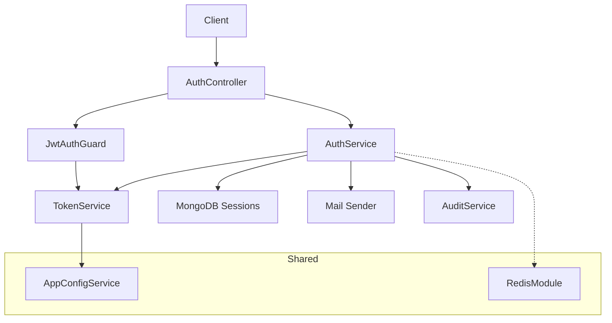
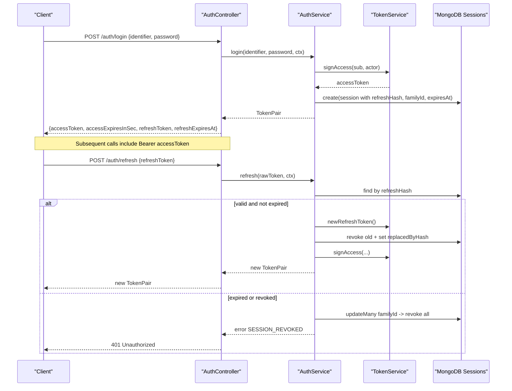
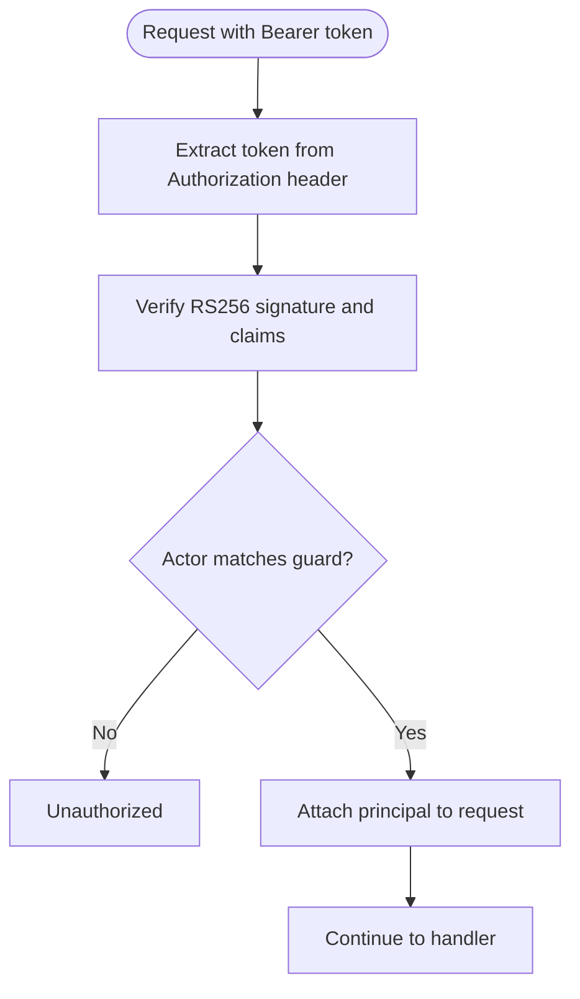
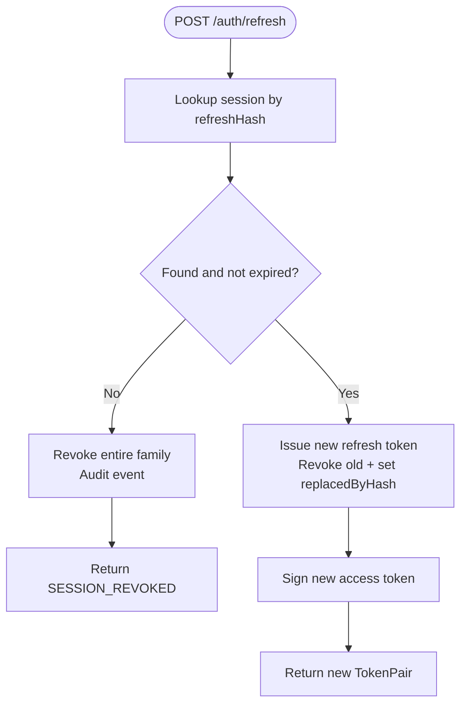
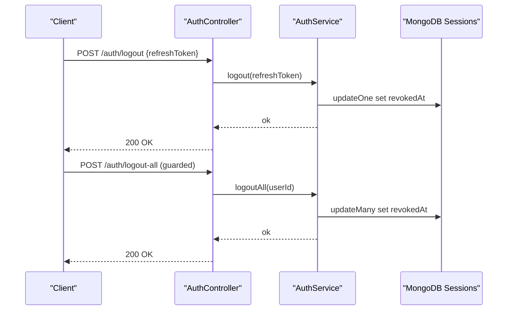
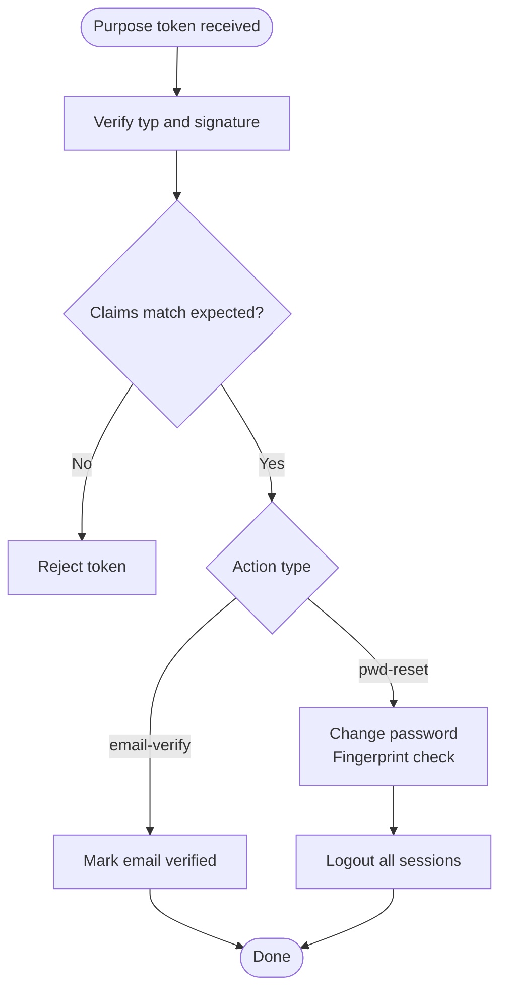
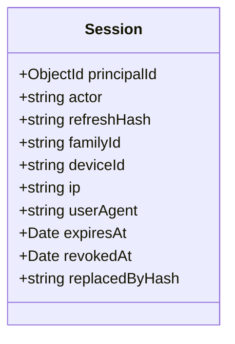
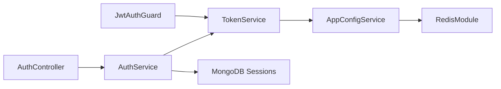

# Session Management

<cite>
**Referenced Files in This Document**
- [auth.controller.ts](file://backend/apps/api/src/modules/auth/presentation/auth.controller.ts)
- [auth.service.ts](file://backend/apps/api/src/modules/auth/application/auth.service.ts)
- [token.service.ts](file://backend/apps/api/src/modules/auth/infrastructure/token.service.ts)
- [jwt-auth.guard.ts](file://backend/apps/api/src/modules/auth/presentation/jwt-auth.guard.ts)
- [session.schema.ts](file://backend/apps\api\src\modules\auth\infrastructure\schemas\session.schema.ts)
- [auth.types.ts](file://backend/apps/api/src/modules/auth/domain/auth.types.ts)
- [current-principal.decorator.ts](file://backend/apps/api/src/modules/auth/presentation/current-principal.decorator.ts)
- [password.service.ts](file://backend/apps/api/src/modules/auth/infrastructure/password.service.ts)
- [refresh-rotation.spec.ts](file://backend/apps/api/src/modules/auth/__tests__/refresh-rotation.spec.ts)
- [token.service.spec.ts](file://backend/apps/api/src/modules/auth/__tests__/token.service.spec.ts)
- [redis.module.ts](file://backend/libs/shared/src/redis/redis.module.ts)
- [app-config.service.ts](file://backend/libs/shared/src/config/app-config.service.ts)
</cite>

## Table of Contents
1. [Introduction](#introduction)
2. [Project Structure](#project-structure)
3. [Core Components](#core-components)
4. [Architecture Overview](#architecture-overview)
5. [Detailed Component Analysis](#detailed-component-analysis)
6. [Dependency Analysis](#dependency-analysis)
7. [Performance Considerations](#performance-considerations)
8. [Troubleshooting Guide](#troubleshooting-guide)
9. [Conclusion](#conclusion)

## Introduction
This document explains the session management system with a focus on JWT token lifecycle, refresh rotation, concurrent sessions, and security controls. It covers how access tokens are created and validated, how opaque refresh tokens are stored and rotated, how logout and revocation work, and how guards protect routes. It also includes performance considerations for high-volume authentication scenarios and scaling strategies using Redis-backed configuration and shared services.

## Project Structure
The session management spans presentation (controllers/guards), application (business logic), infrastructure (JWT and persistence), and shared utilities (Redis, config). Key modules:
- Presentation: AuthController exposes login, refresh, logout endpoints; JwtAuthGuard validates access tokens.
- Application: AuthService orchestrates login, refresh, logout, password reset, and session queries.
- Infrastructure: TokenService handles RS256 JWT signing/verification and opaque refresh token generation/hashing; Session schema persists refresh token metadata.
- Shared: AppConfigService provides runtime configuration (e.g., TTLs); RedisModule provides distributed primitives.

**Diagram sources**
- [auth.controller.ts:53-139](file://backend/apps/api/src/modules/auth/presentation/auth.controller.ts#L53-L139)
- [auth.service.ts:29-346](file://backend/apps/api/src/modules/auth/application/auth.service.ts#L29-L346)
- [token.service.ts:20-90](file://backend/apps/api/src/modules/auth/infrastructure/token.service.ts#L20-L90)
- [jwt-auth.guard.ts:10-34](file://backend/apps/api/src/modules/auth/presentation/jwt-auth.guard.ts#L10-L34)
- [session.schema.ts:9-47](file://backend/apps/api/src/modules/auth/infrastructure/schemas/session.schema.ts#L9-L47)
- [app-config.service.ts:18-88](file://backend/libs/shared/src/config/app-config.service.ts#L18-L88)
- [redis.module.ts:18-38](file://backend/libs/shared/src/redis/redis.module.ts#L18-L38)

**Section sources**
- [auth.controller.ts:53-139](file://backend/apps/api/src/modules/auth/presentation/auth.controller.ts#L53-L139)
- [auth.service.ts:29-346](file://backend/apps/api/src/modules/auth/application/auth.service.ts#L29-L346)
- [token.service.ts:20-90](file://backend/apps/api/src/modules/auth/infrastructure/token.service.ts#L20-L90)
- [jwt-auth.guard.ts:10-34](file://backend/apps/api/src/modules/auth/presentation/jwt-auth.guard.ts#L10-L34)
- [session.schema.ts:9-47](file://backend/apps/api/src/modules/auth/infrastructure/schemas/session.schema.ts#L9-L47)
- [app-config.service.ts:18-88](file://backend/libs/shared/src/config/app-config.service.ts#L18-L88)
- [redis.module.ts:18-38](file://backend/libs/shared/src/redis/redis.module.ts#L18-L38)

## Core Components
- TokenService: Signs and verifies RS256 JWTs for access and purpose tokens; generates opaque refresh tokens and their SHA-256 hashes; derives short password fingerprints to invalidate reset links when passwords change.
- AuthService: Implements login, refresh (with rotation and family revocation on reuse), logout, logout-all, password reset flows, and session listing. Persists refresh token metadata as hashed values and associates them into families for coordinated revocation.
- JwtAuthGuard: Validates Bearer tokens, enforces actor type, and attaches principal to requests.
- Session Schema: Stores per-refresh-token records with family grouping, device/IP/user-agent context, expiration, and revocation markers.
- AuthController: Exposes REST endpoints for registration, OTP, email verification, login, refresh, logout, logout-all, password reset, and user info.
- CurrentPrincipal Decorator: Extracts principal from guarded requests and builds request context (IP, user agent, device ID).
- PasswordService: Argon2id hashing and verification for secure password handling.
- AppConfigService: Provides runtime configuration such as token TTLs and supports distributed invalidation via Redis.

**Section sources**
- [token.service.ts:20-90](file://backend/apps/api/src/modules/auth/infrastructure/token.service.ts#L20-L90)
- [auth.service.ts:145-346](file://backend/apps/api/src/modules/auth/application/auth.service.ts#L145-L346)
- [jwt-auth.guard.ts:10-34](file://backend/apps/api/src/modules/auth/presentation/jwt-auth.guard.ts#L10-L34)
- [session.schema.ts:9-47](file://backend/apps/api/src/modules/auth/infrastructure/schemas/session.schema.ts#L9-L47)
- [auth.controller.ts:53-139](file://backend/apps/api/src/modules/auth/presentation/auth.controller.ts#L53-L139)
- [current-principal.decorator.ts:5-17](file://backend/apps/api/src/modules/auth/presentation/current-principal.decorator.ts#L5-L17)
- [password.service.ts:5-26](file://backend/apps/api/src/modules/auth/infrastructure/password.service.ts#L5-L26)
- [app-config.service.ts:18-88](file://backend/libs/shared/src/config/app-config.service.ts#L18-L88)

## Architecture Overview
The system uses stateless access tokens signed with RS256 and stateful refresh tokens persisted as hashes. Refresh tokens are rotated on each use and grouped by familyId so that any reuse or expiry revokes the entire family, mitigating token theft. Guards enforce actor types and validate tokens on protected routes. Configuration for TTLs is centralized and can be updated at runtime.

**Diagram sources**
- [auth.controller.ts:86-101](file://backend/apps/api/src/modules/auth/presentation/auth.controller.ts#L86-L101)
- [auth.service.ts:145-216](file://backend/apps/api/src/modules/auth/application/auth.service.ts#L145-L216)
- [token.service.ts:42-84](file://backend/apps/api/src/modules/auth/infrastructure/token.service.ts#L42-L84)
- [session.schema.ts:9-47](file://backend/apps/api/src/modules/auth/infrastructure/schemas/session.schema.ts#L9-L47)

## Detailed Component Analysis

### JWT Access Token Lifecycle
- Creation: On successful login, an access token is signed with RS256 including subject, actor kind, and optional roles. TTL is read from configuration.
- Validation: JwtAuthGuard extracts the Bearer token, verifies signature and claims, checks actor type, and attaches principal to the request.
- Expiration: Access tokens are short-lived; clients must refresh before expiry using the refresh endpoint.

**Diagram sources**
- [jwt-auth.guard.ts:10-34](file://backend/apps/api/src/modules/auth/presentation/jwt-auth.guard.ts#L10-L34)
- [token.service.ts:42-58](file://backend/apps/api/src/modules/auth/infrastructure/token.service.ts#L42-L58)
- [auth.types.ts:24-31](file://backend/apps/api/src/modules/auth/domain/auth.types.ts#L24-L31)

**Section sources**
- [jwt-auth.guard.ts:10-34](file://backend/apps/api/src/modules/auth/presentation/jwt-auth.guard.ts#L10-L34)
- [token.service.ts:42-58](file://backend/apps/api/src/modules/auth/infrastructure/token.service.ts#L42-L58)
- [auth.types.ts:24-31](file://backend/apps/api/src/modules/auth/domain/auth.types.ts#L24-L31)

### Refresh Token Rotation and Reuse Detection
- Storage: Refresh tokens are opaque random strings; only their SHA-256 hash is stored alongside familyId, device/IP/user-agent, and expiration.
- Rotation: Each successful refresh revokes the used token and issues a new pair within the same family; the previous row records replacedByHash.
- Theft Mitigation: If a revoked/expired token is presented again, the entire family is revoked and audited, invalidating all concurrent sessions.

**Diagram sources**
- [auth.service.ts:185-216](file://backend/apps/api/src/modules/auth/application/auth.service.ts#L185-L216)
- [session.schema.ts:9-47](file://backend/apps/api/src/modules/auth/infrastructure/schemas/session.schema.ts#L9-L47)
- [token.service.ts:73-84](file://backend/apps/api/src/modules/auth/infrastructure/token.service.ts#L73-L84)

**Section sources**
- [auth.service.ts:185-216](file://backend/apps/api/src/modules/auth/application/auth.service.ts#L185-L216)
- [refresh-rotation.spec.ts:56-114](file://backend/apps/api/src/modules/auth/__tests__/refresh-rotation.spec.ts#L56-L114)
- [session.schema.ts:9-47](file://backend/apps/api/src/modules/auth/infrastructure/schemas/session.schema.ts#L9-L47)

### Logout and Session Cleanup
- Single logout: Marks the specific refresh token as revoked.
- Logout all: Revokes all active sessions for the current user.
- Password reset: Invalidates all sessions for the user after changing credentials.

**Diagram sources**
- [auth.controller.ts:98-107](file://backend/apps/api/src/modules/auth/presentation/auth.controller.ts#L98-L107)
- [auth.service.ts:218-232](file://backend/apps/api/src/modules/auth/application/auth.service.ts#L218-L232)

**Section sources**
- [auth.controller.ts:98-107](file://backend/apps/api/src/modules/auth/presentation/auth.controller.ts#L98-L107)
- [auth.service.ts:218-232](file://backend/apps/api/src/modules/auth/application/auth.service.ts#L218-L232)

### Purpose Tokens (Email Verification and Password Reset)
- Email verification: Short-lived purpose token signed with typ 'email-verify'; verified against user email and status transitions.
- Password reset: Purpose token includes a fingerprint of the current password hash; resetting changes the hash and invalidates existing reset tokens; also logs out all sessions.

**Diagram sources**
- [auth.service.ts:112-141](file://backend/apps/api/src/modules/auth/application/auth.service.ts#L112-L141)
- [auth.service.ts:236-269](file://backend/apps/api/src/modules/auth/application/auth.service.ts#L236-L269)
- [token.service.ts:60-71](file://backend/apps/api/src/modules/auth/infrastructure/token.service.ts#L60-L71)

**Section sources**
- [auth.service.ts:112-141](file://backend/apps/api/src/modules/auth/application/auth.service.ts#L112-L141)
- [auth.service.ts:236-269](file://backend/apps/api/src/modules/auth/application/auth.service.ts#L236-L269)
- [token.service.ts:60-71](file://backend/apps/api/src/modules/auth/infrastructure/token.service.ts#L60-L71)

### Concurrent Sessions Handling
- Each issued refresh token becomes a session row with a familyId linking related tokens.
- Rotation keeps one active token per client interaction while preserving concurrency across devices.
- Any reuse of a revoked token triggers family-wide revocation to protect against theft.

**Diagram sources**
- [session.schema.ts:9-47](file://backend/apps/api/src/modules/auth/infrastructure/schemas/session.schema.ts#L9-L47)

**Section sources**
- [session.schema.ts:9-47](file://backend/apps/api/src/modules/auth/infrastructure/schemas/session.schema.ts#L9-L47)
- [auth.service.ts:185-216](file://backend/apps/api/src/modules/auth/application/auth.service.ts#L185-L216)

### Security Features
- Token Signing: RS256 asymmetric signatures ensure integrity and non-repudiation.
- Expiration Handling: Access tokens have short TTLs; refresh tokens have longer TTLs configured centrally; expired tokens trigger family revocation.
- Blacklist Management: No explicit blacklist table; revocation is implemented via session rows marked with revokedAt and family-level revocation on reuse/expiry.
- Password Security: Argon2id hashing with recommended parameters; reset tokens bound to password fingerprint to auto-expire on credential changes.

**Section sources**
- [token.service.ts:42-84](file://backend/apps/api/src/modules/auth/infrastructure/token.service.ts#L42-L84)
- [auth.service.ts:185-216](file://backend/apps/api/src/modules/auth/application/auth.service.ts#L185-L216)
- [password.service.ts:5-26](file://backend/apps/api/src/modules/auth/infrastructure/password.service.ts#L5-L26)
- [auth.service.ts:236-269](file://backend/apps/api/src/modules/auth/application/auth.service.ts#L236-L269)

## Dependency Analysis
- Controllers depend on services for business logic and on guards for authorization.
- Services depend on TokenService for cryptographic operations and on MongoDB models for persistence.
- TokenService depends on JwtService and AppConfigService for keys and TTLs.
- Guards depend on TokenService for verification and on domain types for actor enforcement.
- Shared Redis module provides distributed configuration invalidation and locking primitives.

**Diagram sources**
- [auth.controller.ts:53-139](file://backend/apps/api/src/modules/auth/presentation/auth.controller.ts#L53-L139)
- [auth.service.ts:29-346](file://backend/apps/api/src/modules/auth/application/auth.service.ts#L29-L346)
- [token.service.ts:20-90](file://backend/apps/api/src/modules/auth/infrastructure/token.service.ts#L20-L90)
- [jwt-auth.guard.ts:10-34](file://backend/apps/api/src/modules/auth/presentation/jwt-auth.guard.ts#L10-L34)
- [app-config.service.ts:18-88](file://backend/libs/shared/src/config/app-config.service.ts#L18-L88)
- [redis.module.ts:18-38](file://backend/libs/shared/src/redis/redis.module.ts#L18-L38)

**Section sources**
- [auth.controller.ts:53-139](file://backend/apps/api/src/modules/auth/presentation/auth.controller.ts#L53-L139)
- [auth.service.ts:29-346](file://backend/apps/api/src/modules/auth/application/auth.service.ts#L29-L346)
- [token.service.ts:20-90](file://backend/apps/api/src/modules/auth/infrastructure/token.service.ts#L20-L90)
- [jwt-auth.guard.ts:10-34](file://backend/apps/api/src/modules/auth/presentation/jwt-auth.guard.ts#L10-L34)
- [app-config.service.ts:18-88](file://backend/libs/shared/src/config/app-config.service.ts#L18-L88)
- [redis.module.ts:18-38](file://backend/libs/shared/src/redis/redis.module.ts#L18-L38)

## Performance Considerations
- Stateless Access Tokens: RS256 verification is fast and does not require database lookups on every request.
- Minimal Database Writes: Refresh rotation writes one update per rotation plus occasional family revocations; indexes on refreshHash, principalId, and expiresAt improve query performance.
- Centralized TTLs: Use AppConfigService to tune access and refresh TTLs without redeployments; hot-path reads are synchronous after boot.
- Rate Limiting: Endpoints are throttled to mitigate brute-force and abuse.
- Distributed Config Invalidation: Redis pub/sub ensures consistent TTL updates across instances.

[No sources needed since this section provides general guidance]

## Troubleshooting Guide
Common errors and resolutions:
- Missing bearer token: Ensure Authorization header contains "Bearer <token>".
- Invalid or expired token: Refresh flow will fail if token is unknown, expired, or revoked; re-login may be required.
- Session revoked: Indicates reuse of a revoked/expired token; entire family was revoked for safety; re-login is necessary.
- Account suspended or pending approval: User status prevents login; contact support or complete verification steps.
- OTP limits: Too many requests; wait for cooldown or reduce frequency.

Operational tips:
- Inspect active sessions and login history via protected endpoints to diagnose device and IP anomalies.
- Use logout-all to clear all sessions after sensitive actions like password resets.

**Section sources**
- [jwt-auth.guard.ts:15-27](file://backend/apps/api/src/modules/auth/presentation/jwt-auth.guard.ts#L15-L27)
- [auth.controller.ts:25-51](file://backend/apps/api/src/modules/auth/presentation/auth.controller.ts#L25-L51)
- [auth.service.ts:185-232](file://backend/apps/api/src/modules/auth/application/auth.service.ts#L185-L232)

## Conclusion
The session management system combines stateless JWT access tokens with stateful, rotated refresh tokens to balance security and usability. Family-based revocation protects against token theft, while centralized configuration and Redis enable scalable, consistent behavior across instances. Guards enforce actor scoping, and comprehensive audit and logging support operational visibility. For high-volume environments, leverage rate limiting, efficient indexing, and short-lived access tokens to minimize load and risk.