# User Authentication

<cite>
**Referenced Files in This Document**
- [auth.module.ts](file://backend/apps/api/src/modules/auth/auth.module.ts)
- [auth.controller.ts](file://backend/apps/api/src/modules/auth/presentation/auth.controller.ts)
- [auth.service.ts](file://backend/apps/api/src/modules/auth/application/auth.service.ts)
- [token.service.ts](file://backend/apps/api/src/modules/auth/infrastructure/token.service.ts)
- [password.service.ts](file://backend/apps/api/src/modules/auth/infrastructure/password.service.ts)
- [otp.service.ts](file://backend/apps/api/src/modules/auth/infrastructure/otp.service.ts)
- [jwt-auth.guard.ts](file://backend/apps/api/src/modules/auth/presentation/jwt-auth.guard.ts)
- [user.schema.ts](file://backend/apps/api/src/modules/auth/infrastructure/schemas/user.schema.ts)
- [session.schema.ts](file://backend/apps/api/src/modules/auth/infrastructure/schemas/session.schema.ts)
- [login-history.schema.ts](file://backend/apps/api/src/modules/auth/infrastructure/schemas/login-history.schema.ts)
- [otp-request.schema.ts](file://backend/apps/api/src/modules/auth/infrastructure/schemas/otp-request.schema.ts)
- [auth.types.ts](file://backend/apps/api/src/modules/auth/domain/auth.types.ts)
- [auth.dtos.ts](file://backend/apps/api/src/modules/auth/presentation/dto/auth.dtos.ts)
</cite>

## Table of Contents
1. [Introduction](#introduction)
2. [Project Structure](#project-structure)
3. [Core Components](#core-components)
4. [Architecture Overview](#architecture-overview)
5. [Detailed Component Analysis](#detailed-component-analysis)
6. [Dependency Analysis](#dependency-analysis)
7. [Performance Considerations](#performance-considerations)
8. [Troubleshooting Guide](#troubleshooting-guide)
9. [Conclusion](#conclusion)
10. [Appendices](#appendices)

## Introduction
This document explains the user authentication system implemented in the backend API module. It covers the complete registration and login flow, email verification, mobile OTP verification, password hashing, JWT access tokens, refresh token rotation, logout mechanisms, profile retrieval, session management, password reset, and security controls such as rate limiting, account status checks, and device notifications.

## Project Structure
The authentication feature is organized under a NestJS module with clear separation of concerns:
- Presentation layer: controllers define HTTP endpoints for register, login, refresh, logout, email/mobile verification, password reset, and profile queries.
- Application layer: business logic orchestrates services for registration, login, token issuance, OTP handling, and auditing.
- Infrastructure layer: data models (Mongoose schemas), token service (JWT), password hashing, OTP storage and sending, and mail/SMS providers.
- Domain layer: shared types for user status, KYC, income type, actor kind, token claims, and request context.

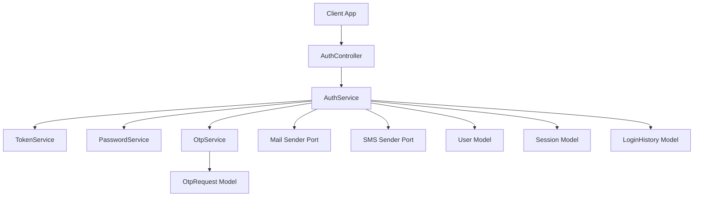

**Diagram sources**
- [auth.controller.ts:53-138](file://backend/apps/api/src/modules/auth/presentation/auth.controller.ts#L53-L138)
- [auth.service.ts:29-345](file://backend/apps/api/src/modules/auth/application/auth.service.ts#L29-L345)
- [token.service.ts:21-89](file://backend/apps/api/src/modules/auth/infrastructure/token.service.ts#L21-L89)
- [password.service.ts:5-25](file://backend/apps/api/src/modules/auth/infrastructure/password.service.ts#L5-L25)
- [otp.service.ts:16-75](file://backend/apps/api/src/modules/auth/infrastructure/otp.service.ts#L16-L75)
- [user.schema.ts:5-71](file://backend/apps/api/src/modules/auth/infrastructure/schemas/user.schema.ts#L5-L71)
- [session.schema.ts:9-47](file://backend/apps/api/src/modules/auth/infrastructure/schemas/session.schema.ts#L9-L47)
- [login-history.schema.ts:4-33](file://backend/apps/api/src/modules/auth/infrastructure/schemas/login-history.schema.ts#L4-L33)
- [otp-request.schema.ts:4-34](file://backend/apps/api/src/modules/auth/infrastructure/schemas/otp-request.schema.ts#L4-L34)

**Section sources**
- [auth.module.ts:24-56](file://backend/apps/api/src/modules/auth/auth.module.ts#L24-L56)
- [auth.controller.ts:53-138](file://backend/apps/api/src/modules/auth/presentation/auth.controller.ts#L53-L138)
- [auth.service.ts:29-345](file://backend/apps/api/src/modules/auth/application/auth.service.ts#L29-L345)

## Core Components
- AuthController: Exposes REST endpoints for authentication flows with strict throttling on sensitive routes and guards for protected endpoints.
- AuthService: Implements registration, email/mobile verification, login, refresh, logout, password reset, and profile/session queries.
- TokenService: Issues RS256 JWT access tokens and purpose-bound short-lived tokens; manages opaque refresh tokens stored as hashes.
- PasswordService: Hashes and verifies passwords using Argon2id with OWASP-recommended parameters.
- OtpService: Issues and verifies SMS OTPs with configurable TTL, cooldown, and attempt limits; stores hashed codes.
- Schemas: User, Session, LoginHistory, and OtpRequest models define persistence structures and indexes.
- Guards: JWT guard validates Bearer tokens and enforces actor type (USER vs EMPLOYEE).

**Section sources**
- [auth.controller.ts:53-138](file://backend/apps/api/src/modules/auth/presentation/auth.controller.ts#L53-L138)
- [auth.service.ts:29-345](file://backend/apps/api/src/modules/auth/application/auth.service.ts#L29-L345)
- [token.service.ts:21-89](file://backend/apps/api/src/modules/auth/infrastructure/token.service.ts#L21-L89)
- [password.service.ts:5-25](file://backend/apps/api/src/modules/auth/infrastructure/password.service.ts#L5-L25)
- [otp.service.ts:16-75](file://backend/apps/api/src/modules/auth/infrastructure/otp.service.ts#L16-L75)
- [user.schema.ts:5-71](file://backend/apps/api/src/modules/auth/infrastructure/schemas/user.schema.ts#L5-L71)
- [session.schema.ts:9-47](file://backend/apps/api/src/modules/auth/infrastructure/schemas/session.schema.ts#L9-L47)
- [login-history.schema.ts:4-33](file://backend/apps/api/src/modules/auth/infrastructure/schemas/login-history.schema.ts#L4-L33)
- [otp-request.schema.ts:4-34](file://backend/apps/api/src/modules/auth/infrastructure/schemas/otp-request.schema.ts#L4-L34)
- [jwt-auth.guard.ts:10-33](file://backend/apps/api/src/modules/auth/presentation/jwt-auth.guard.ts#L10-L33)

## Architecture Overview
The authentication architecture follows a layered design:
- Controllers validate input via DTOs and delegate to services.
- Services coordinate domain operations, persist state, send emails/SMS, and manage tokens.
- Infrastructure provides cryptographic primitives, JWT signing/verification, and persistence via Mongoose.
- Guards enforce authorization at the controller level by validating JWTs and actor types.

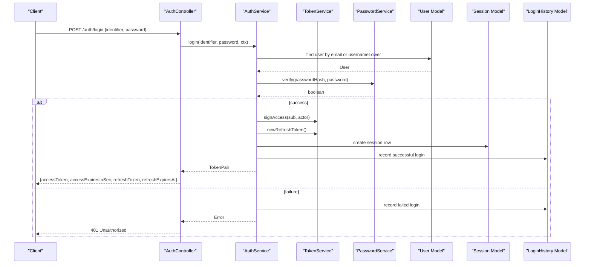

**Diagram sources**
- [auth.controller.ts:86-90](file://backend/apps/api/src/modules/auth/presentation/auth.controller.ts#L86-L90)
- [auth.service.ts:145-183](file://backend/apps/api/src/modules/auth/application/auth.service.ts#L145-L183)
- [token.service.ts:42-49](file://backend/apps/api/src/modules/auth/infrastructure/token.service.ts#L42-L49)
- [password.service.ts:18-24](file://backend/apps/api/src/modules/auth/infrastructure/password.service.ts#L18-L24)
- [session.schema.ts:9-47](file://backend/apps/api/src/modules/auth/infrastructure/schemas/session.schema.ts#L9-L47)
- [login-history.schema.ts:4-33](file://backend/apps/api/src/modules/auth/infrastructure/schemas/login-history.schema.ts#L4-L33)

## Detailed Component Analysis

### Registration Flow
- Input validation: RegisterDto enforces name, email format, mobile E.164 pattern, username rules, strong password policy, address length, income type enum, monthly income range, and optional referral code.
- Duplicate check: The service checks for existing email, mobile, or usernameLower before creating a user.
- Password hashing: Uses Argon2id with memory/time/parallelism tuned for security.
- Status: New users are created with pending approval status; audit records capture registration details.
- Email verification: After mobile verification (if applicable), an email verification link is sent with a purpose-bound JWT valid for 24 hours.

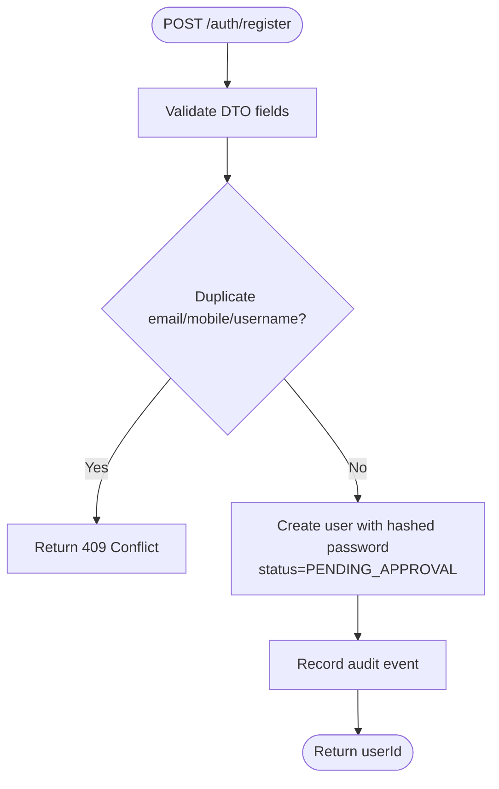

**Diagram sources**
- [auth.controller.ts:57-61](file://backend/apps/api/src/modules/auth/presentation/auth.controller.ts#L57-L61)
- [auth.service.ts:44-81](file://backend/apps/api/src/modules/auth/application/auth.service.ts#L44-L81)
- [password.service.ts:14-16](file://backend/apps/api/src/modules/auth/infrastructure/password.service.ts#L14-L16)
- [user.schema.ts:5-71](file://backend/apps/api/src/modules/auth/infrastructure/schemas/user.schema.ts#L5-L71)
- [auth.dtos.ts:9-41](file://backend/apps/api/src/modules/auth/presentation/dto/auth.dtos.ts#L9-L41)

**Section sources**
- [auth.controller.ts:57-61](file://backend/apps/api/src/modules/auth/presentation/auth.controller.ts#L57-L61)
- [auth.service.ts:44-81](file://backend/apps/api/src/modules/auth/application/auth.service.ts#L44-L81)
- [auth.dtos.ts:9-41](file://backend/apps/api/src/modules/auth/presentation/dto/auth.dtos.ts#L9-L41)
- [password.service.ts:5-25](file://backend/apps/api/src/modules/auth/infrastructure/password.service.ts#L5-L25)
- [user.schema.ts:5-71](file://backend/apps/api/src/modules/auth/infrastructure/schemas/user.schema.ts#L5-L71)

### Mobile OTP Verification
- Request OTP: Validates mobile number and enforces per-hour limits and resend cooldown via OtpService.
- Issue OTP: Generates a secure random code, stores its hash with pepper, sets expiry, and sends via configured SMS provider.
- Verify OTP: Checks latest active OTP, enforces max attempts, marks consumed on success, and updates user mobileVerified and status progression.

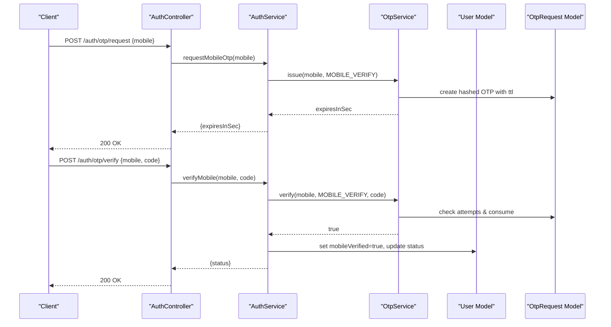

**Diagram sources**
- [auth.controller.ts:63-73](file://backend/apps/api/src/modules/auth/presentation/auth.controller.ts#L63-L73)
- [auth.service.ts:83-102](file://backend/apps/api/src/modules/auth/application/auth.service.ts#L83-L102)
- [otp.service.ts:28-74](file://backend/apps/api/src/modules/auth/infrastructure/otp.service.ts#L28-L74)
- [otp-request.schema.ts:4-34](file://backend/apps/api/src/modules/auth/infrastructure/schemas/otp-request.schema.ts#L4-L34)
- [user.schema.ts:5-71](file://backend/apps/api/src/modules/auth/infrastructure/schemas/user.schema.ts#L5-L71)

**Section sources**
- [auth.controller.ts:63-73](file://backend/apps/api/src/modules/auth/presentation/auth.controller.ts#L63-L73)
- [auth.service.ts:83-102](file://backend/apps/api/src/modules/auth/application/auth.service.ts#L83-L102)
- [otp.service.ts:16-75](file://backend/apps/api/src/modules/auth/infrastructure/otp.service.ts#L16-L75)
- [otp-request.schema.ts:4-34](file://backend/apps/api/src/modules/auth/infrastructure/schemas/otp-request.schema.ts#L4-L34)

### Email Verification
- Resend: Ensures user exists and not already verified; issues a purpose-bound email verification token with 24h TTL.
- Verify: Verifies token purpose and matches email claim; updates emailVerified and transitions status to pending approval if needed.

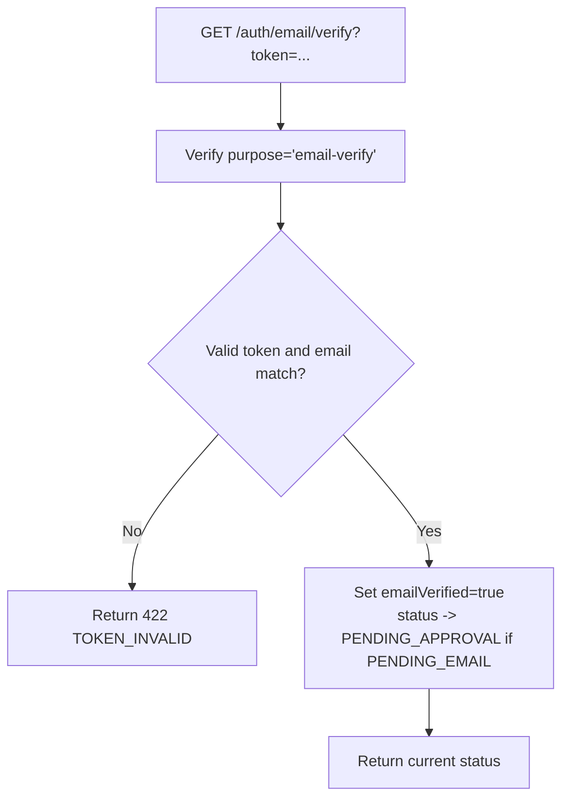

**Diagram sources**
- [auth.controller.ts:81-84](file://backend/apps/api/src/modules/auth/presentation/auth.controller.ts#L81-L84)
- [auth.service.ts:112-141](file://backend/apps/api/src/modules/auth/application/auth.service.ts#L112-L141)
- [token.service.ts:60-71](file://backend/apps/api/src/modules/auth/infrastructure/token.service.ts#L60-L71)

**Section sources**
- [auth.controller.ts:75-84](file://backend/apps/api/src/modules/auth/presentation/auth.controller.ts#L75-L84)
- [auth.service.ts:104-141](file://backend/apps/api/src/modules/auth/application/auth.service.ts#L104-L141)
- [token.service.ts:60-71](file://backend/apps/api/src/modules/auth/infrastructure/token.service.ts#L60-L71)

### Login Flow
- Identifier resolution: Accepts email or username; normalizes to lowercase for lookup.
- Credential verification: Uses Argon2id to compare provided password against stored hash.
- Status checks: Rejects login for SUSPENDED, REJECTED, PENDING_APPROVAL, or non-ACTIVE statuses.
- Token issuance: Creates access token (RS256) and refresh token (opaque, hashed in DB); records session and login history.
- Device notification: If a new device is detected, sends an email alert.

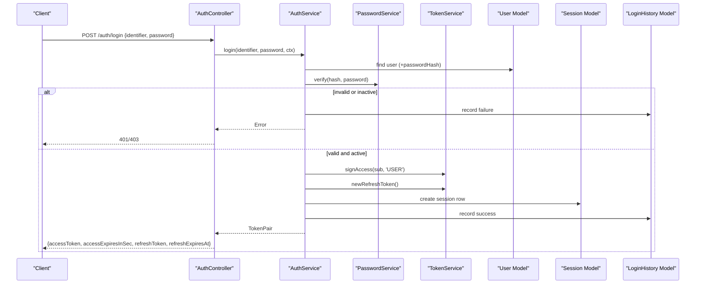

**Diagram sources**
- [auth.controller.ts:86-90](file://backend/apps/api/src/modules/auth/presentation/auth.controller.ts#L86-L90)
- [auth.service.ts:145-183](file://backend/apps/api/src/modules/auth/application/auth.service.ts#L145-L183)
- [token.service.ts:42-49](file://backend/apps/api/src/modules/auth/infrastructure/token.service.ts#L42-L49)
- [password.service.ts:18-24](file://backend/apps/api/src/modules/auth/infrastructure/password.service.ts#L18-L24)
- [session.schema.ts:9-47](file://backend/apps/api/src/modules/auth/infrastructure/schemas/session.schema.ts#L9-L47)
- [login-history.schema.ts:4-33](file://backend/apps/api/src/modules/auth/infrastructure/schemas/login-history.schema.ts#L4-L33)

**Section sources**
- [auth.controller.ts:86-90](file://backend/apps/api/src/modules/auth/presentation/auth.controller.ts#L86-L90)
- [auth.service.ts:145-183](file://backend/apps/api/src/modules/auth/application/auth.service.ts#L145-L183)
- [auth.dtos.ts:63-70](file://backend/apps/api/src/modules/auth/presentation/dto/auth.dtos.ts#L63-L70)

### Refresh Token Rotation
- Lookup: Finds session by hashed refresh token.
- Reuse detection: If presented token is revoked/expired, revokes entire family and returns error.
- Rotation: Issues new access and refresh tokens; marks old session as replaced and revoked.

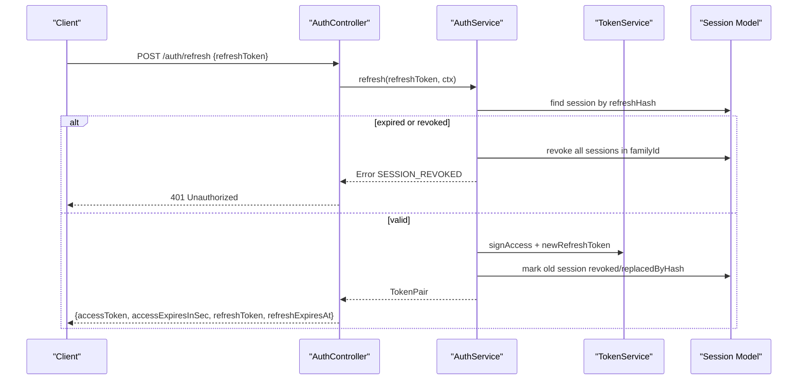

**Diagram sources**
- [auth.controller.ts:92-96](file://backend/apps/api/src/modules/auth/presentation/auth.controller.ts#L92-L96)
- [auth.service.ts:190-216](file://backend/apps/api/src/modules/auth/application/auth.service.ts#L190-L216)
- [token.service.ts:73-84](file://backend/apps/api/src/modules/auth/infrastructure/token.service.ts#L73-L84)
- [session.schema.ts:9-47](file://backend/apps/api/src/modules/auth/infrastructure/schemas/session.schema.ts#L9-L47)

**Section sources**
- [auth.controller.ts:92-96](file://backend/apps/api/src/modules/auth/presentation/auth.controller.ts#L92-L96)
- [auth.service.ts:190-216](file://backend/apps/api/src/modules/auth/application/auth.service.ts#L190-L216)
- [token.service.ts:73-84](file://backend/apps/api/src/modules/auth/infrastructure/token.service.ts#L73-L84)

### Logout and Logout All
- Single logout: Revokes specific session by refresh token hash.
- Logout all: Revokes all active sessions for the authenticated user.

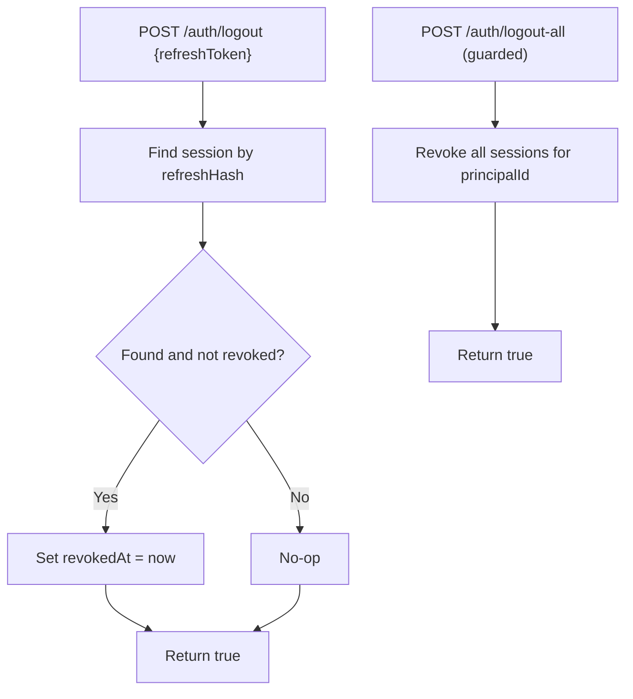

**Diagram sources**
- [auth.controller.ts:98-107](file://backend/apps/api/src/modules/auth/presentation/auth.controller.ts#L98-L107)
- [auth.service.ts:218-232](file://backend/apps/api/src/modules/auth/application/auth.service.ts#L218-L232)
- [session.schema.ts:9-47](file://backend/apps/api/src/modules/auth/infrastructure/schemas/session.schema.ts#L9-L47)

**Section sources**
- [auth.controller.ts:98-107](file://backend/apps/api/src/modules/auth/presentation/auth.controller.ts#L98-L107)
- [auth.service.ts:218-232](file://backend/apps/api/src/modules/auth/application/auth.service.ts#L218-L232)

### Profile Management
- Get me: Returns non-sensitive user profile fields for the authenticated principal.
- Sessions: Lists active sessions with device, IP, user agent, and expiry info.
- Login history: Retrieves recent login attempts with success/failure reasons.

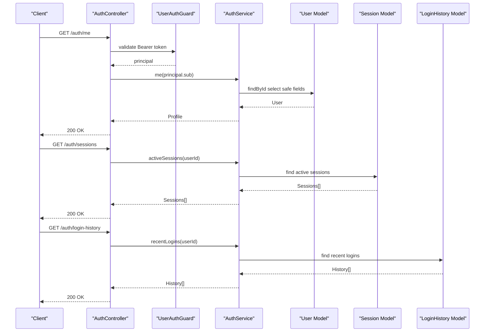

**Diagram sources**
- [auth.controller.ts:121-137](file://backend/apps/api/src/modules/auth/presentation/auth.controller.ts#L121-L137)
- [auth.service.ts:273-294](file://backend/apps/api/src/modules/auth/application/auth.service.ts#L273-L294)
- [jwt-auth.guard.ts:10-33](file://backend/apps/api/src/modules/auth/presentation/jwt-auth.guard.ts#L10-L33)
- [user.schema.ts:5-71](file://backend/apps/api/src/modules/auth/infrastructure/schemas/user.schema.ts#L5-L71)
- [session.schema.ts:9-47](file://backend/apps/api/src/modules/auth/infrastructure/schemas/session.schema.ts#L9-L47)
- [login-history.schema.ts:4-33](file://backend/apps/api/src/modules/auth/infrastructure/schemas/login-history.schema.ts#L4-L33)

**Section sources**
- [auth.controller.ts:121-137](file://backend/apps/api/src/modules/auth/presentation/auth.controller.ts#L121-L137)
- [auth.service.ts:273-294](file://backend/apps/api/src/modules/auth/application/auth.service.ts#L273-L294)
- [jwt-auth.guard.ts:10-33](file://backend/apps/api/src/modules/auth/presentation/jwt-auth.guard.ts#L10-L33)

### Password Reset
- Forgot password: Sends a purpose-bound reset link with a short TTL; always returns success to avoid enumeration.
- Reset password: Verifies token purpose and password fingerprint; updates password hash and revokes all sessions for the user.

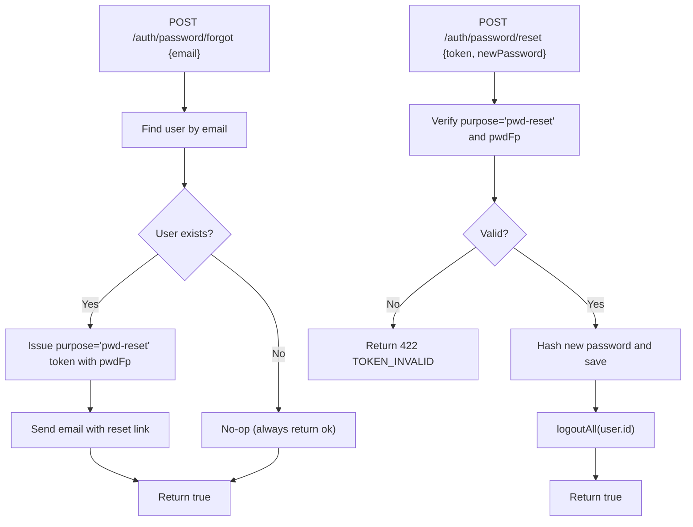

**Diagram sources**
- [auth.controller.ts:109-119](file://backend/apps/api/src/modules/auth/presentation/auth.controller.ts#L109-L119)
- [auth.service.ts:236-269](file://backend/apps/api/src/modules/auth/application/auth.service.ts#L236-L269)
- [token.service.ts:60-71](file://backend/apps/api/src/modules/auth/infrastructure/token.service.ts#L60-L71)

**Section sources**
- [auth.controller.ts:109-119](file://backend/apps/api/src/modules/auth/presentation/auth.controller.ts#L109-L119)
- [auth.service.ts:236-269](file://backend/apps/api/src/modules/auth/application/auth.service.ts#L236-L269)
- [token.service.ts:60-71](file://backend/apps/api/src/modules/auth/infrastructure/token.service.ts#L60-L71)

### Security Measures and Best Practices
- Rate limiting: Strict throttling applied to credential and OTP endpoints to mitigate brute force and abuse.
- Account status enforcement: Login blocked for suspended, rejected, or pending states; requires admin approval and full verification.
- Secure password hashing: Argon2id with OWASP-recommended parameters.
- JWT security: RS256 asymmetric signing; purpose-bound tokens for email verification and password reset; short TTLs.
- Refresh token rotation: Opaque refresh tokens stored as hashes; reuse triggers family-wide revocation to detect theft.
- Device awareness: New device sign-in alerts via email; sessions track device, IP, and user agent.
- Validation: Strong DTO validations for inputs including phone formats, password complexity, and numeric ranges.

**Section sources**
- [auth.controller.ts:22-51](file://backend/apps/api/src/modules/auth/presentation/auth.controller.ts#L22-L51)
- [auth.service.ts:145-183](file://backend/apps/api/src/modules/auth/application/auth.service.ts#L145-L183)
- [password.service.ts:5-25](file://backend/apps/api/src/modules/auth/infrastructure/password.service.ts#L5-L25)
- [token.service.ts:21-89](file://backend/apps/api/src/modules/auth/infrastructure/token.service.ts#L21-L89)
- [auth.dtos.ts:9-88](file://backend/apps/api/src/modules/auth/presentation/dto/auth.dtos.ts#L9-L88)

## Dependency Analysis
The authentication module composes several internal and external dependencies:
- Mongoose models for users, sessions, login history, and OTP requests.
- JWT service for signing and verifying RS256 tokens.
- Config service for environment-specific settings (e.g., base URL, JWT keys, OTP limits).
- Audit service for recording key events.
- Mail and SMS sender ports with pluggable implementations (console or SMTP/Msg91).

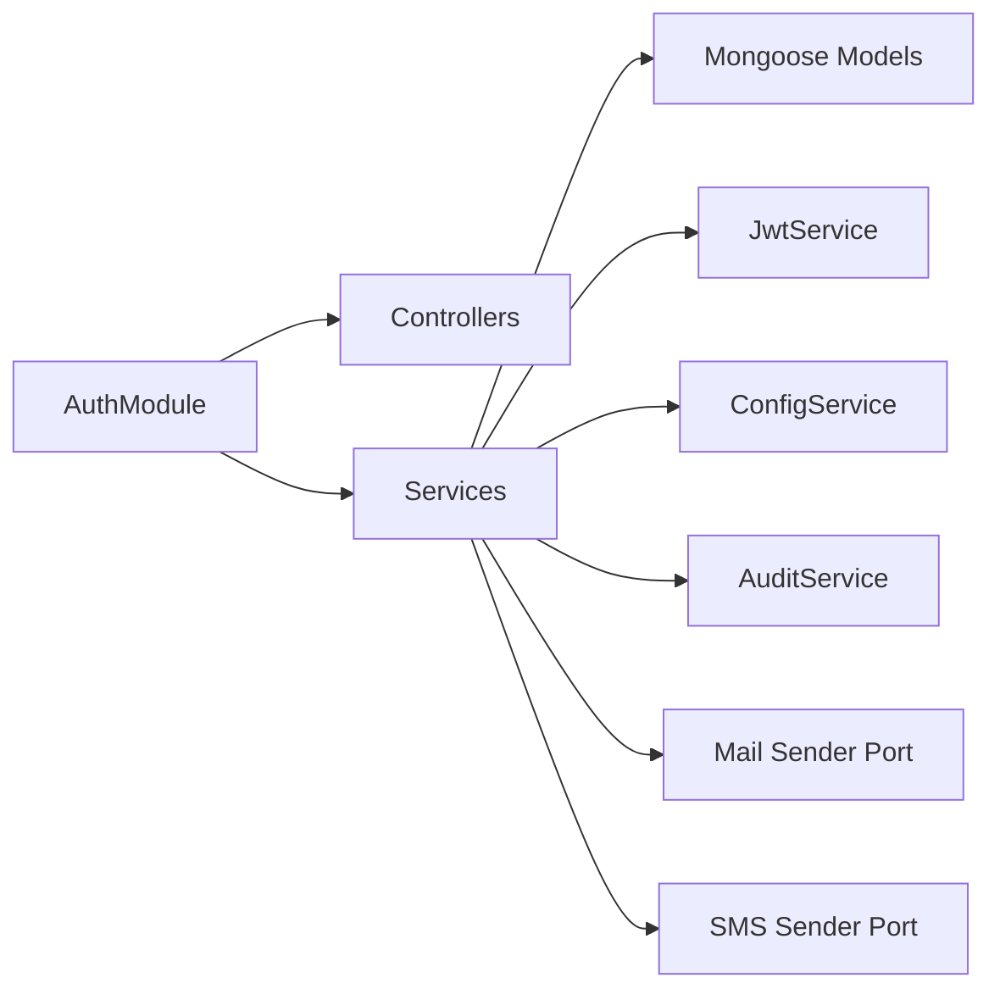

**Diagram sources**
- [auth.module.ts:24-56](file://backend/apps/api/src/modules/auth/auth.module.ts#L24-L56)
- [auth.service.ts:29-40](file://backend/apps/api/src/modules/auth/application/auth.service.ts#L29-L40)

**Section sources**
- [auth.module.ts:24-56](file://backend/apps/api/src/modules/auth/auth.module.ts#L24-L56)
- [auth.service.ts:29-40](file://backend/apps/api/src/modules/auth/application/auth.service.ts#L29-L40)

## Performance Considerations
- Indexing: Session and login history collections include indexes for efficient queries by principalId and timestamps.
- TTL expiration: Session and OTP documents use TTL indexes to automatically expire stale entries.
- Throttling: Strict rate limits protect sensitive endpoints without impacting general performance.
- Selective field projection: Profile retrieval selects only necessary fields to reduce payload size.
- Asynchronous notifications: Email/SMS sending occurs asynchronously relative to core flows to minimize latency.

[No sources needed since this section provides general guidance]

## Troubleshooting Guide
Common errors and their meanings:
- AUTH_FAILED: Invalid credentials or invalid session during refresh.
- SESSION_REVOKED: Refresh token reused after expiration or revocation; indicates potential token theft.
- TOKEN_INVALID: Purpose-bound token (email verification or password reset) is invalid or expired.
- DUPLICATE: Attempted registration with existing email, mobile, or username.
- OTP_HOURLY_LIMIT / OTP_COOLDOWN: Too many OTP requests or too soon after previous request.
- VERIFICATION_PENDING / APPROVAL_PENDING / SUSPENDED / REJECTED: Account state prevents login until resolved.

Resolution steps:
- For AUTH_FAILED: Verify identifier and password; ensure account is ACTIVE.
- For SESSION_REVOKED: Sign in again; consider that token may have been compromised.
- For TOKEN_INVALID: Reissue email verification or password reset links; ensure links are used within TTL.
- For DUPLICATE: Use unique email/mobile/username combinations.
- For OTP limits: Wait for cooldown or retry later; ensure correct mobile number.
- For account state: Complete required verifications or contact support for approval.

**Section sources**
- [auth.controller.ts:25-51](file://backend/apps/api/src/modules/auth/presentation/auth.controller.ts#L25-L51)
- [auth.service.ts:145-269](file://backend/apps/api/src/modules/auth/application/auth.service.ts#L145-L269)
- [otp.service.ts:28-74](file://backend/apps/api/src/modules/auth/infrastructure/otp.service.ts#L28-L74)

## Conclusion
The authentication system implements a robust, secure, and scalable approach to user identity management. It combines strong password hashing, purpose-bound JWTs, rotating refresh tokens, comprehensive validation, and protective measures like throttling and device notifications. The modular design enables easy extension and maintenance while ensuring consistent security across registration, login, verification, and password reset flows.

[No sources needed since this section summarizes without analyzing specific files]

## Appendices

### API Endpoints Summary
- POST /auth/register: Create a new user account.
- POST /auth/otp/request: Request mobile OTP.
- POST /auth/otp/verify: Verify mobile OTP.
- POST /auth/email/resend: Resend email verification link.
- GET /auth/email/verify: Verify email via token.
- POST /auth/login: Authenticate and receive tokens.
- POST /auth/refresh: Rotate refresh token and get new access token.
- POST /auth/logout: Revoke current session.
- POST /auth/logout-all: Revoke all sessions for the user.
- POST /auth/password/forgot: Send password reset link.
- POST /auth/password/reset: Reset password using token.
- GET /auth/me: Retrieve current user profile.
- GET /auth/sessions: List active sessions.
- GET /auth/login-history: View recent login attempts.

**Section sources**
- [auth.controller.ts:53-138](file://backend/apps/api/src/modules/auth/presentation/auth.controller.ts#L53-L138)

### Data Models Overview
- User: Stores identity, verification flags, status, KYC, and referral information.
- Session: Tracks issued refresh tokens, device metadata, and lifecycle.
- LoginHistory: Records login attempts with success/failure details.
- OtpRequest: Stores hashed OTP codes, purposes, and attempt counts.

**Section sources**
- [user.schema.ts:5-71](file://backend/apps/api/src/modules/auth/infrastructure/schemas/user.schema.ts#L5-L71)
- [session.schema.ts:9-47](file://backend/apps/api/src/modules/auth/infrastructure/schemas/session.schema.ts#L9-L47)
- [login-history.schema.ts:4-33](file://backend/apps/api/src/modules/auth/infrastructure/schemas/login-history.schema.ts#L4-L33)
- [otp-request.schema.ts:4-34](file://backend/apps/api/src/modules/auth/infrastructure/schemas/otp-request.schema.ts#L4-L34)