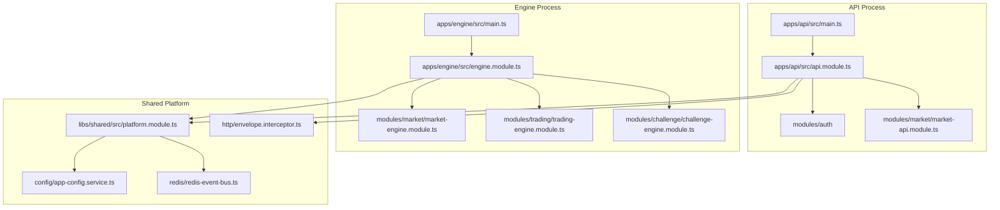
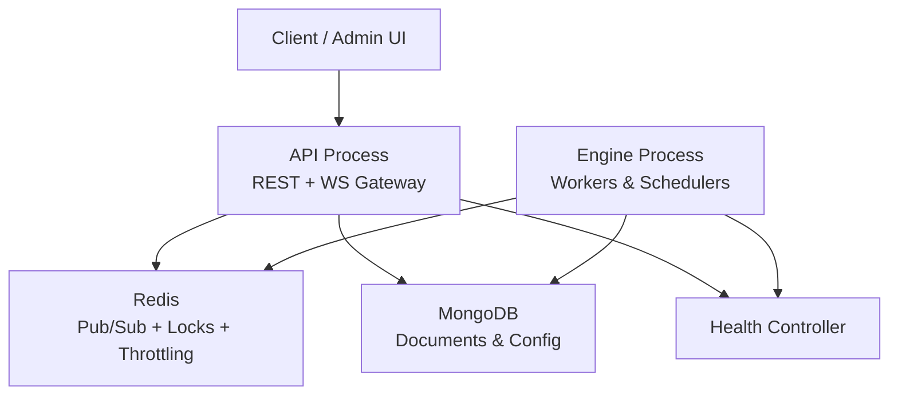
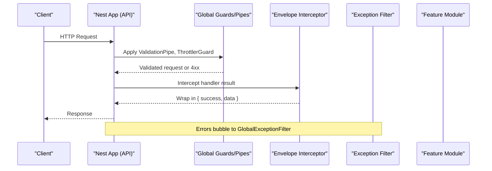
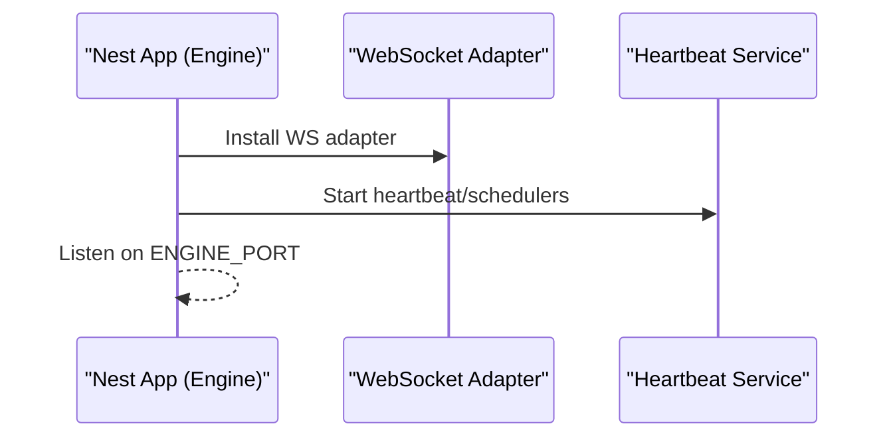
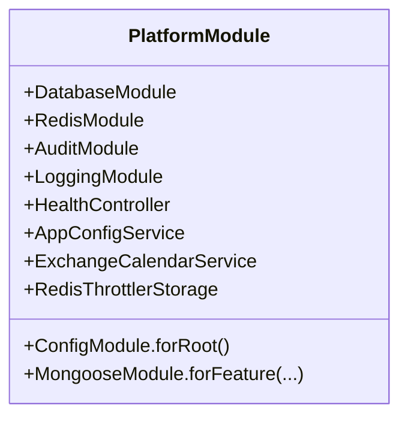
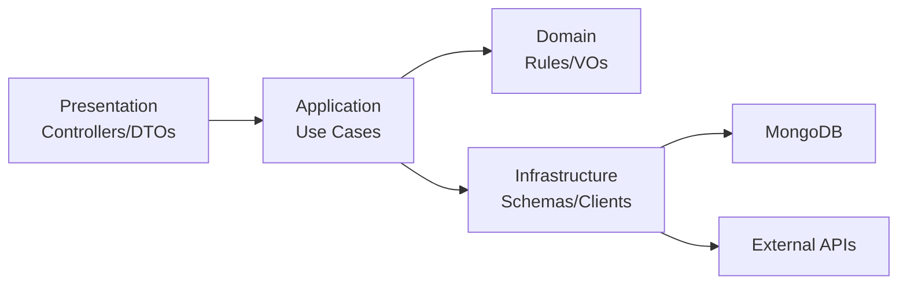
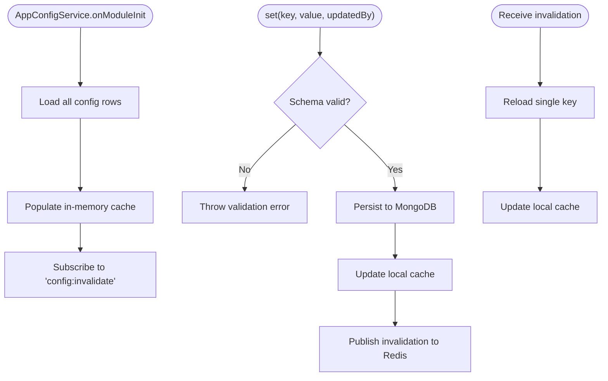
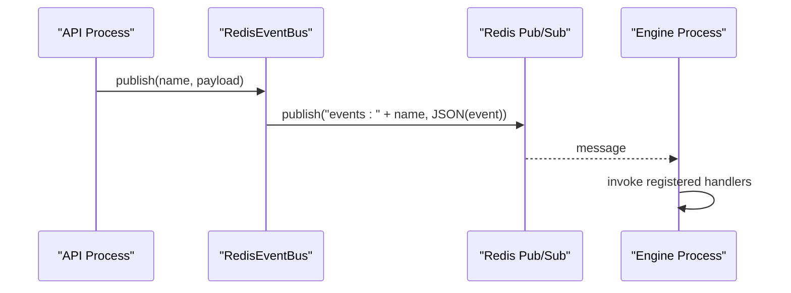
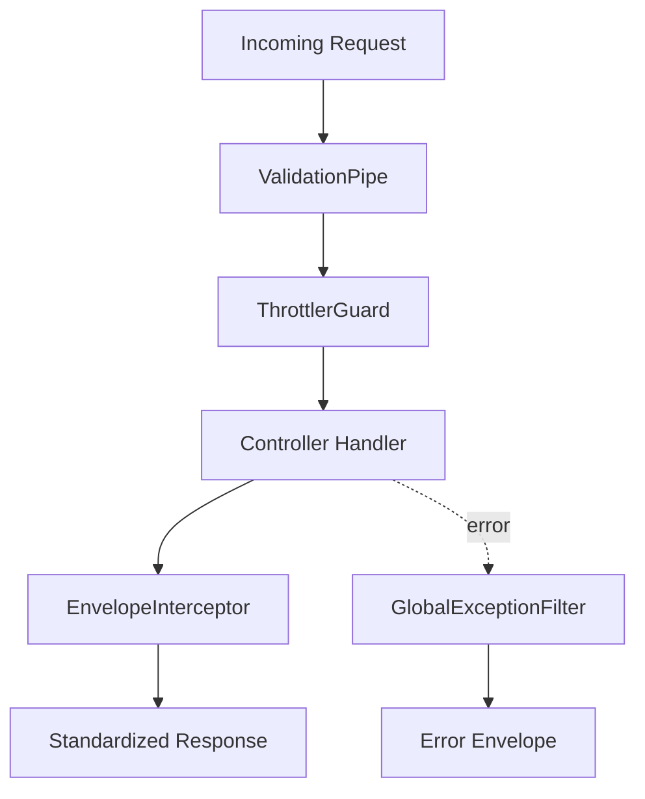
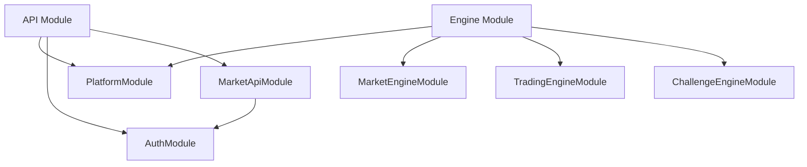

# Backend Services

<cite>
**Referenced Files in This Document**
- [main.ts](file://backend/apps/api/src/main.ts)
- [main.ts](file://backend/apps/engine/src/main.ts)
- [api.module.ts](file://backend/apps/api/src/api.module.ts)
- [engine.module.ts](file://backend/apps/engine/src/engine.module.ts)
- [platform.module.ts](file://backend/libs/shared/src/platform.module.ts)
- [index.ts](file://backend/libs/shared/src/index.ts)
- [app-config.service.ts](file://backend/libs/shared/src/config/app-config.service.ts)
- [envelope.interceptor.ts](file://backend/libs/shared/src/http/envelope.interceptor.ts)
- [redis-event-bus.ts](file://backend/libs/shared/src/redis/redis-event-bus.ts)
- [auth.module.ts](file://backend/apps/api/src/modules/auth/auth.module.ts)
- [market-api.module.ts](file://backend/apps/api/src/modules/market/market-api.module.ts)
</cite>

## Table of Contents
1. Introduction
2. Project Structure
3. Core Components
4. Architecture Overview
5. Detailed Component Analysis
6. Dependency Analysis
7. Performance Considerations
8. Troubleshooting Guide
9. Conclusion
10. Appendices

## Introduction
This document describes the backend services architecture for a NestJS-based modular monolith that separates concerns into two runtime processes:
- API process: HTTP REST surface with controllers, DTOs, guards, interceptors, and feature modules.
- Engine process: Background/event-driven workloads such as market data ingestion, trading engine, challenge evaluation, WebSocket gateway, and schedulers.

Both processes share a common platform library that provides configuration, database connectivity, Redis event bus and locking, audit logging, health checks, rate limiting storage, calendar utilities, and cross-cutting HTTP standards.

The codebase follows domain-driven design within each feature module (domain, application, infrastructure, presentation), uses dependency injection extensively, and enforces consistent error handling and response envelopes across all endpoints.

## Project Structure
At a high level:
- apps/api: NestJS application exposing REST APIs and WebSockets via controllers and gateways.
- apps/engine: NestJS application hosting long-running workers and event consumers.
- libs/shared: Shared platform library consumed by both applications.

**Diagram sources**
- [main.ts:1-26](file://backend/apps/api/src/main.ts#L1-L26)
- [main.ts:1-20](file://backend/apps/engine/src/main.ts#L1-L20)
- [api.module.ts:1-59](file://backend/apps/api/src/api.module.ts#L1-L59)
- [engine.module.ts:1-23](file://backend/apps/engine/src/engine.module.ts#L1-L23)
- [platform.module.ts:1-39](file://backend/libs/shared/src/platform.module.ts#L1-L39)
- [app-config.service.ts:1-88](file://backend/libs/shared/src/config/app-config.service.ts#L1-L88)
- [redis-event-bus.ts:1-65](file://backend/libs/shared/src/redis/redis-event-bus.ts#L1-L65)
- [envelope.interceptor.ts:1-12](file://backend/libs/shared/src/http/envelope.interceptor.ts#L1-L12)

**Section sources**
- [main.ts:1-26](file://backend/apps/api/src/main.ts#L1-L26)
- [main.ts:1-20](file://backend/apps/engine/src/main.ts#L1-L20)
- [api.module.ts:1-59](file://backend/apps/api/src/api.module.ts#L1-L59)
- [engine.module.ts:1-23](file://backend/apps/engine/src/engine.module.ts#L1-L23)
- [platform.module.ts:1-39](file://backend/libs/shared/src/platform.module.ts#L1-L39)
- [index.ts:1-13](file://backend/libs/shared/src/index.ts#L1-L13)

## Core Components
- PlatformModule: Global module wiring environment validation, logging, MongoDB, Redis, audit, business config, exchange calendar, throttler storage, and health controller.
- API Module: Registers global pipes, guards, interceptors, and feature modules; sets up throttling backed by Redis.
- Engine Module: Hosts background engines and shares the same platform capabilities.
- AppConfigService: In-memory cached, DB-backed configuration with Redis pub/sub invalidation for hot-reload across processes.
- RedisEventBus: Fire-and-forget domain event bus over Redis Pub/Sub used to coordinate cross-process behavior.
- EnvelopeInterceptor: Standardizes successful responses into a uniform envelope shape.

Key responsibilities:
- Configuration management with schema validation and distributed invalidation.
- Cross-cutting concerns (logging, audit, rate limiting, health).
- Consistent HTTP contracts and error handling.
- Event-driven coordination between API and Engine processes.

**Section sources**
- [platform.module.ts:1-39](file://backend/libs/shared/src/platform.module.ts#L1-L39)
- [api.module.ts:1-59](file://backend/apps/api/src/api.module.ts#L1-L59)
- [engine.module.ts:1-23](file://backend/apps/engine/src/engine.module.ts#L1-L23)
- [app-config.service.ts:1-88](file://backend/libs/shared/src/config/app-config.service.ts#L1-L88)
- [redis-event-bus.ts:1-65](file://backend/libs/shared/src/redis/redis-event-bus.ts#L1-L65)
- [envelope.interceptor.ts:1-12](file://backend/libs/shared/src/http/envelope.interceptor.ts#L1-L12)

## Architecture Overview
The system is a modular monolith with clear separation of runtime processes and shared platform capabilities. Feature modules encapsulate domain logic, application services, infrastructure adapters, and presentation layers. Cross-cutting concerns are centralized in the shared library.

**Diagram sources**
- [main.ts:1-26](file://backend/apps/api/src/main.ts#L1-L26)
- [main.ts:1-20](file://backend/apps/engine/src/main.ts#L1-L20)
- [platform.module.ts:1-39](file://backend/libs/shared/src/platform.module.ts#L1-L39)

## Detailed Component Analysis

### API Process Bootstrap and Global Middleware Stack
- Bootstraps NestJS with buffered logs and raw body parsing.
- Sets global prefix and security headers.
- Enables CORS from configured origins.
- Registers global throttling guard, envelope interceptor, exception filter, and validation pipe.

**Diagram sources**
- [main.ts:1-26](file://backend/apps/api/src/main.ts#L1-L26)
- [api.module.ts:1-59](file://backend/apps/api/src/api.module.ts#L1-L59)
- [envelope.interceptor.ts:1-12](file://backend/libs/shared/src/http/envelope.interceptor.ts#L1-L12)

**Section sources**
- [main.ts:1-26](file://backend/apps/api/src/main.ts#L1-L26)
- [api.module.ts:1-59](file://backend/apps/api/src/api.module.ts#L1-L59)

### Engine Process Bootstrap and WebSocket Adapter
- Bootstraps NestJS with buffered logs.
- Installs WebSocket adapter for real-time features.
- Enables shutdown hooks and listens on configured port.

**Diagram sources**
- [main.ts:1-20](file://backend/apps/engine/src/main.ts#L1-L20)
- [engine.module.ts:1-23](file://backend/apps/engine/src/engine.module.ts#L1-L23)

**Section sources**
- [main.ts:1-20](file://backend/apps/engine/src/main.ts#L1-L20)
- [engine.module.ts:1-23](file://backend/apps/engine/src/engine.module.ts#L1-L23)

### Shared Platform Module
- Provides global configuration with environment validation.
- Connects to MongoDB and Redis.
- Exposes audit logging, business configuration service, exchange calendar, and throttler storage.
- Exposes a health controller for liveness/readiness probes.

**Diagram sources**
- [platform.module.ts:1-39](file://backend/libs/shared/src/platform.module.ts#L1-L39)

**Section sources**
- [platform.module.ts:1-39](file://backend/libs/shared/src/platform.module.ts#L1-L39)

### Domain-Driven Design Within Modules
Each feature module organizes code into:
- domain: Value objects, types, and pure rules.
- application: Use cases orchestrating domain and infrastructure.
- infrastructure: Data access, external integrations, schemas, clients.
- presentation: Controllers, DTOs, guards, decorators.

Examples:
- Auth module wires JWT, password hashing, OTP, SMS/mail senders, and exposes controllers.
- Market module wires instruments, candles, watchlists, broker integrations, and admin controllers.

**Section sources**
- [auth.module.ts:1-58](file://backend/apps/api/src/modules/auth/auth.module.ts#L1-L58)
- [market-api.module.ts:1-63](file://backend/apps/api/src/modules/market/market-api.module.ts#L1-L63)

### Configuration Management and Hot Reload
- AppConfigService maintains an in-memory cache of configuration entries persisted in MongoDB.
- On startup, it loads all keys and subscribes to a Redis channel for invalidation.
- Updates validate values against registered schemas, persist changes, update cache, and publish invalidation so other instances reload the key.

**Diagram sources**
- [app-config.service.ts:1-88](file://backend/libs/shared/src/config/app-config.service.ts#L1-L88)

**Section sources**
- [app-config.service.ts:1-88](file://backend/libs/shared/src/config/app-config.service.ts#L1-L88)

### Event Bus Across Processes
- RedisEventBus implements a simple EventBus using Redis Pub/Sub.
- Events include name, payload, eventId, and occurredAt timestamp.
- Handlers are registered per event name; messages are parsed and dispatched asynchronously.
- Used to coordinate state transitions and trigger background work across API and Engine processes.

**Diagram sources**
- [redis-event-bus.ts:1-65](file://backend/libs/shared/src/redis/redis-event-bus.ts#L1-L65)

**Section sources**
- [redis-event-bus.ts:1-65](file://backend/libs/shared/src/redis/redis-event-bus.ts#L1-L65)

### HTTP Standards and Error Handling
- EnvelopeInterceptor wraps successful responses into a standard envelope shape.
- GlobalExceptionFilter (from shared) centralizes error mapping and logging.
- ValidationPipe strips unknown fields and enforces DTO shapes to reduce injection surfaces.
- Throttling is applied globally via ThrottlerGuard with Redis-backed storage.

**Diagram sources**
- [api.module.ts:1-59](file://backend/apps/api/src/api.module.ts#L1-L59)
- [envelope.interceptor.ts:1-12](file://backend/libs/shared/src/http/envelope.interceptor.ts#L1-L12)

**Section sources**
- [api.module.ts:1-59](file://backend/apps/api/src/api.module.ts#L1-L59)
- [envelope.interceptor.ts:1-12](file://backend/libs/shared/src/http/envelope.interceptor.ts#L1-L12)

### Testing Strategy
- Unit tests: Co-located under __tests__ directories within modules (e.g., auth, market, plans, trading, kernel, calendar, http, config). These verify pure domain logic, utilities, and service behavior in isolation.
- Integration/e2e tests: Located under test/e2e with a shared app factory and setup script. They exercise full request/response flows, including authentication, market operations, purchases, RBAC/KYC scenarios, and trading replay.

Recommended practices:
- Isolate external dependencies with mocks/stubs for Redis, MongoDB, and third-party providers.
- Use test fixtures for seeds and deterministic state.
- Assert on standardized response envelopes and error structures.

**Section sources**
- [jest.setup.ts](file://backend/test/jest.setup.ts)
- [app.factory.ts](file://backend/test/e2e/app.factory.ts)
- [setup-e2e.ts](file://backend/test/e2e/setup-e2e.ts)

## Dependency Analysis
- API depends on PlatformModule for shared services and imports feature modules.
- Engine depends on PlatformModule and imports engine-specific modules that reuse shared infrastructure.
- Both processes depend on Redis for eventing, caching, and throttling; MongoDB for persistence and configuration.
- Feature modules may depend on other modules (e.g., MarketApiModule depends on AuthModule and AdminModule).

**Diagram sources**
- [api.module.ts:1-59](file://backend/apps/api/src/api.module.ts#L1-L59)
- [engine.module.ts:1-23](file://backend/apps/engine/src/engine.module.ts#L1-L23)
- [auth.module.ts:1-58](file://backend/apps/api/src/modules/auth/auth.module.ts#L1-L58)
- [market-api.module.ts:1-63](file://backend/apps/api/src/modules/market/market-api.module.ts#L1-L63)
- [platform.module.ts:1-39](file://backend/libs/shared/src/platform.module.ts#L1-L39)

**Section sources**
- [api.module.ts:1-59](file://backend/apps/api/src/api.module.ts#L1-L59)
- [engine.module.ts:1-23](file://backend/apps/engine/src/engine.module.ts#L1-L23)
- [auth.module.ts:1-58](file://backend/apps/api/src/modules/auth/auth.module.ts#L1-L58)
- [market-api.module.ts:1-63](file://backend/apps/api/src/modules/market/market-api.module.ts#L1-L63)
- [platform.module.ts:1-39](file://backend/libs/shared/src/platform.module.ts#L1-L39)

## Performance Considerations
- Buffered logs during bootstrap reduce startup overhead.
- In-memory configuration cache avoids repeated DB reads on hot paths; invalidation ensures eventual consistency.
- Redis-backed throttling prevents abuse while keeping limits distributed.
- Separating CPU-bound or long-running tasks into the Engine process keeps the API responsive.
- Use WebSocket adapter only where needed to minimize resource usage.

[No sources needed since this section provides general guidance]

## Troubleshooting Guide
- Health checks: The platform exposes a health controller for liveness/readiness probes; ensure it responds correctly in container orchestration environments.
- Configuration issues: If a config key is missing or invalid, AppConfigService falls back to defaults and warns; verify schema definitions and stored values.
- Event bus problems: Malformed events or failed handlers are logged; check Redis connectivity and subscription channels.
- Rate limiting: If requests are unexpectedly throttled, inspect Redis storage and throttle settings.
- CORS and prefixes: Verify configured origins and global prefix exclusions if clients cannot reach endpoints.

**Section sources**
- [platform.module.ts:1-39](file://backend/libs/shared/src/platform.module.ts#L1-L39)
- [app-config.service.ts:1-88](file://backend/libs/shared/src/config/app-config.service.ts#L1-L88)
- [redis-event-bus.ts:1-65](file://backend/libs/shared/src/redis/redis-event-bus.ts#L1-L65)

## Conclusion
The backend is a well-structured modular monolith with clear separation between API and Engine processes, unified by a shared platform layer. It applies domain-driven design within feature modules, leverages dependency injection, and enforces consistent HTTP contracts and error handling. Configuration is robust with schema validation and distributed invalidation, and cross-process coordination is achieved through a Redis-backed event bus. This architecture supports scalability, maintainability, and operational reliability.

[No sources needed since this section summarizes without analyzing specific files]

## Appendices

### Environment and Configuration Keys
- API_PORT: Port for the API process.
- ENGINE_PORT: Port for the Engine process.
- CORS_ORIGINS: Comma-separated list of allowed origins.
- SMS_PROVIDER / MAIL_PROVIDER: Select implementations for notifications.
- Additional business configuration keys are managed via AppConfigService with schema validation.

**Section sources**
- [main.ts:1-26](file://backend/apps/api/src/main.ts#L1-L26)
- [main.ts:1-20](file://backend/apps/engine/src/main.ts#L1-L20)
- [app-config.service.ts:1-88](file://backend/libs/shared/src/config/app-config.service.ts#L1-L88)

### Monitoring and Observability
- Logging: Centralized via platform logging module.
- Health: Health controller exposed by PlatformModule.
- Metrics: Integrate with your preferred metrics library at the process level.
- Tracing: Add correlation IDs in middleware and propagate across events.

**Section sources**
- [platform.module.ts:1-39](file://backend/libs/shared/src/platform.module.ts#L1-L39)