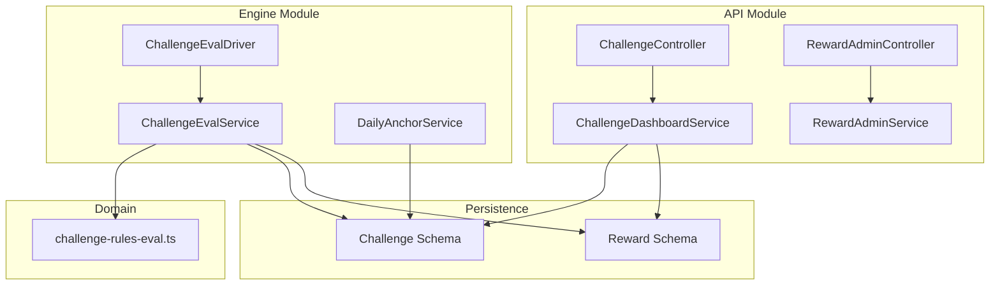
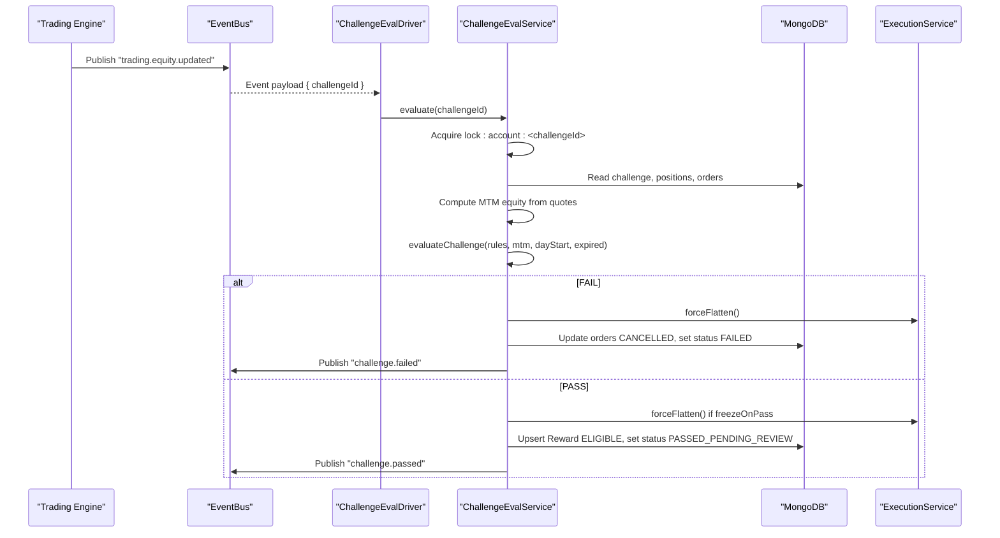
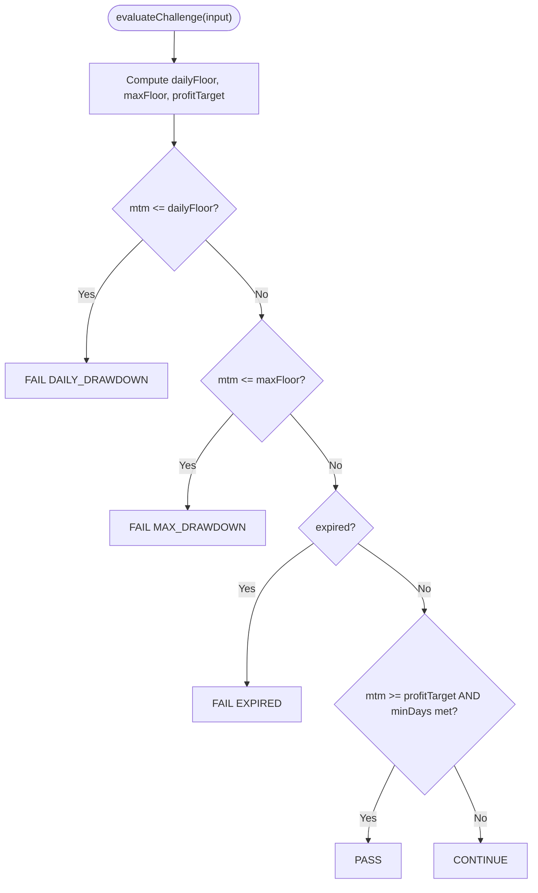
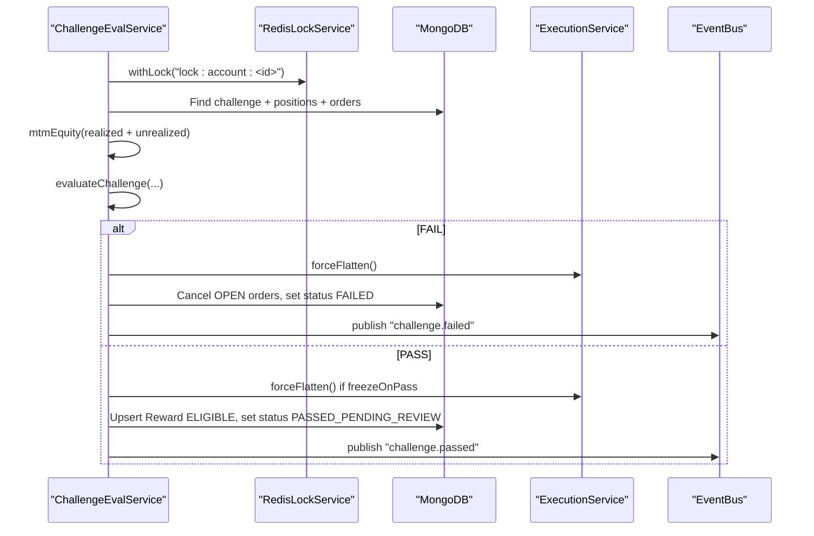
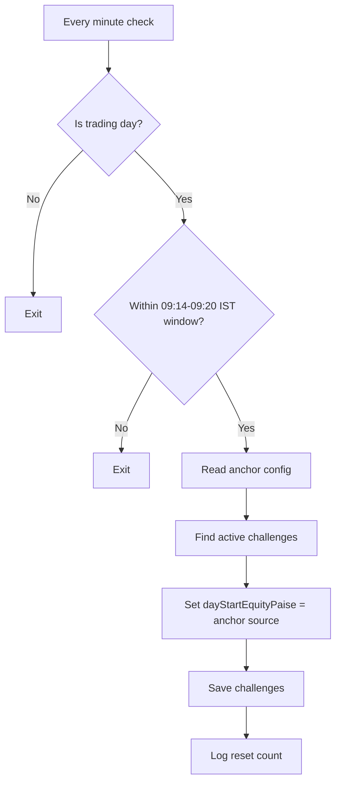
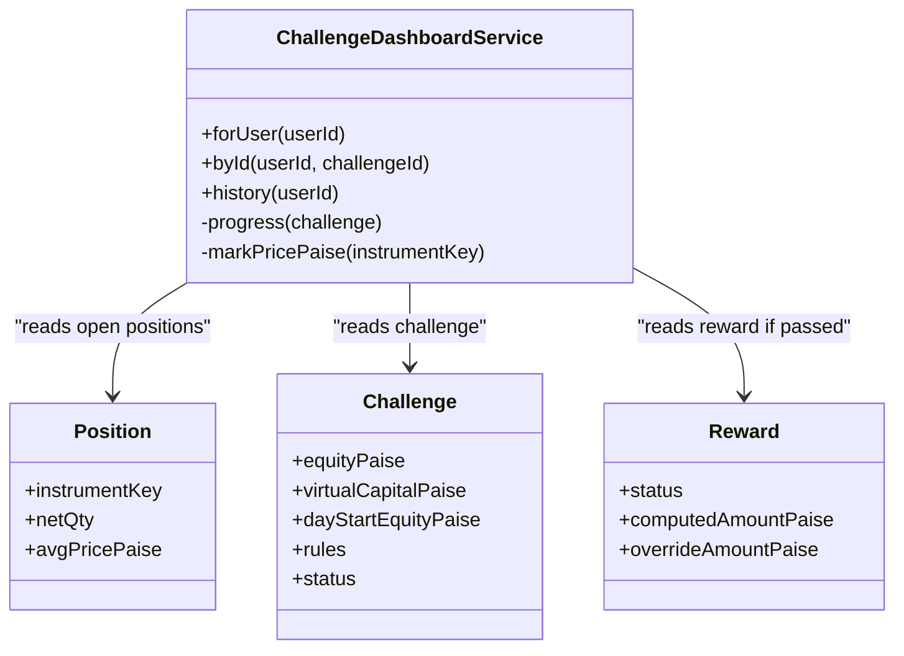
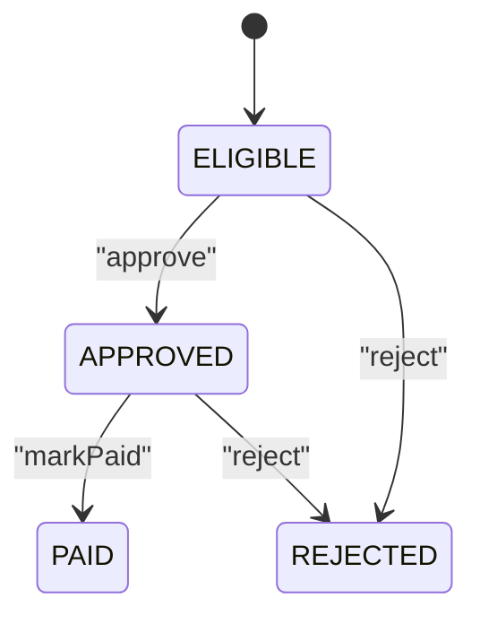
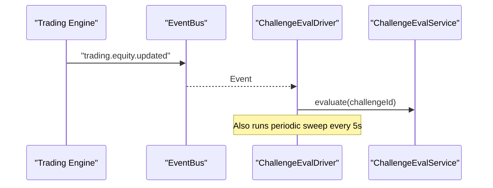
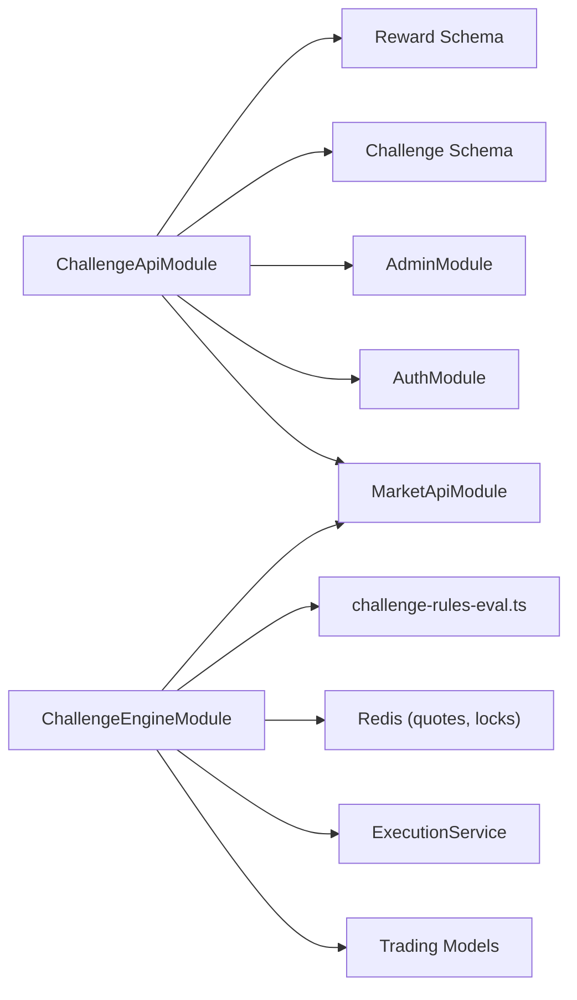

# Challenge & Rewards System

<cite>
**Referenced Files in This Document**
- [challenge-api.module.ts](file://backend/apps/api/src/modules/challenge/challenge-api.module.ts)
- [challenge-engine.module.ts](file://backend/apps/api/src/modules/challenge/challenge-engine.module.ts)
- [challenge.controller.ts](file://backend/apps/api/src/modules/challenge/presentation/challenge.controller.ts)
- [reward-admin.controller.ts](file://backend/apps/api/src/modules/challenge/presentation/reward-admin.controller.ts)
- [challenge-dashboard.service.ts](file://backend/apps/api/src/modules/challenge/application/challenge-dashboard.service.ts)
- [reward-admin.service.ts](file://backend/apps/api/src/modules/challenge/application/reward-admin.service.ts)
- [challenge-eval.service.ts](file://backend/apps/api/src/modules/challenge/application/challenge-eval.service.ts)
- [challenge-eval.driver.ts](file://backend/apps/api/src/modules/challenge/application/challenge-eval.driver.ts)
- [daily-anchor.service.ts](file://backend/apps/api/src/modules/challenge/application/daily-anchor.service.ts)
- [challenge-rules-eval.ts](file://backend/apps/api/src/modules/challenge/domain/challenge-rules-eval.ts)
- [reward.schema.ts](file://backend/apps/api/src/modules/challenge/infrastructure/schemas/reward.schema.ts)
- [challenge.schema.ts](file://backend/apps/api/src/modules/plans/infrastructure/schemas/challenge.schema.ts)
- [P6-challenge-reward.md](file://docs/P6-challenge-reward.md)
</cite>

## Table of Contents
1. [Introduction](#introduction)
2. [Project Structure](#project-structure)
3. [Core Components](#core-components)
4. [Architecture Overview](#architecture-overview)
5. [Detailed Component Analysis](#detailed-component-analysis)
6. [Dependency Analysis](#dependency-analysis)
7. [Performance Considerations](#performance-considerations)
8. [Troubleshooting Guide](#troubleshooting-guide)
9. [Conclusion](#conclusion)
10. [Appendices](#appendices)

## Introduction
This document describes the Challenge & Rewards System that powers a gamified trading evaluation framework. It covers challenge creation and management, real-time performance scoring, rule-based evaluation, daily anchor calculations, achievement tracking via rewards, dashboard services for monitoring progress, admin controls for reward management, and automated distribution workflows. It also explains integration points with trading events and how real-time progress updates are produced.

## Project Structure
The system is split into two NestJS modules:
- API module exposing user-facing endpoints (dashboard) and admin endpoints (reward queue and actions).
- Engine module running the real-time evaluator, event-driven driver, and daily anchor job.

**Diagram sources**
- [challenge-api.module.ts:14-27](file://backend/apps/api/src/modules/challenge/challenge-api.module.ts#L14-L27)
- [challenge-engine.module.ts:11-18](file://backend/apps/api/src/modules/challenge/challenge-engine.module.ts#L11-L18)
- [challenge.controller.ts:8-34](file://backend/apps/api/src/modules/challenge/presentation/challenge.controller.ts#L8-L34)
- [reward-admin.controller.ts:23-56](file://backend/apps/api/src/modules/challenge/presentation/reward-admin.controller.ts#L23-L56)
- [challenge-dashboard.service.ts:14-21](file://backend/apps/api/src/modules/challenge/application/challenge-dashboard.service.ts#L14-L21)
- [reward-admin.service.ts:9-15](file://backend/apps/api/src/modules/challenge/application/reward-admin.service.ts#L9-L15)
- [challenge-eval.driver.ts:14-22](file://backend/apps/api/src/modules/challenge/application/challenge-eval.driver.ts#L14-L22)
- [challenge-eval.service.ts:23-37](file://backend/apps/api/src/modules/challenge/application/challenge-eval.service.ts#L23-L37)
- [daily-anchor.service.ts:13-22](file://backend/apps/api/src/modules/challenge/application/daily-anchor.service.ts#L13-L22)
- [challenge-rules-eval.ts:15-33](file://backend/apps/api/src/modules/challenge/domain/challenge-rules-eval.ts#L15-L33)
- [challenge.schema.ts:23-70](file://backend/apps/api/src/modules/plans/infrastructure/schemas/challenge.schema.ts#L23-L70)
- [reward.schema.ts:20-50](file://backend/apps/api/src/modules/challenge/infrastructure/schemas/reward.schema.ts#L20-L50)

**Section sources**
- [challenge-api.module.ts:14-27](file://backend/apps/api/src/modules/challenge/challenge-api.module.ts#L14-L27)
- [challenge-engine.module.ts:11-18](file://backend/apps/api/src/modules/challenge/challenge-engine.module.ts#L11-L18)

## Core Components
- Rule engine: Pure function evaluating CONTINUE, PASS, or FAIL based on snapshotted rules, MTM equity, daily anchor, trading days, and expiry.
- Real-time evaluator: Computes MTM equity, applies locks to avoid race conditions, transitions challenge status, flattens positions when needed, and creates reward records.
- Daily anchor service: Resets daily drawdown floor at market open using configured anchor source.
- Dashboard service: Reads current challenge progress, computes MTM equity, profit target usage, drawdown usage, and reward status.
- Admin reward service: Queues eligible rewards, approves/rejects/marks paid, enforces state transitions, and audits decisions.
- Event-driven driver: Subscribes to trading equity updates and runs periodic sweeps to evaluate active challenges.

**Section sources**
- [challenge-rules-eval.ts:35-66](file://backend/apps/api/src/modules/challenge/domain/challenge-rules-eval.ts#L35-L66)
- [challenge-eval.service.ts:43-131](file://backend/apps/api/src/modules/challenge/application/challenge-eval.service.ts#L43-L131)
- [daily-anchor.service.ts:29-44](file://backend/apps/api/src/modules/challenge/application/daily-anchor.service.ts#L29-L44)
- [challenge-dashboard.service.ts:23-96](file://backend/apps/api/src/modules/challenge/application/challenge-dashboard.service.ts#L23-L96)
- [reward-admin.service.ts:17-92](file://backend/apps/api/src/modules/challenge/application/reward-admin.service.ts#L17-L92)
- [challenge-eval.driver.ts:24-38](file://backend/apps/api/src/modules/challenge/application/challenge-eval.driver.ts#L24-L38)

## Architecture Overview
The system integrates with the trading engine through domain events and shared Redis for quotes and locking. The evaluator runs under an account-level lock to ensure consistency between fills and rule checks.

**Diagram sources**
- [challenge-eval.driver.ts:24-38](file://backend/apps/api/src/modules/challenge/application/challenge-eval.driver.ts#L24-L38)
- [challenge-eval.service.ts:57-131](file://backend/apps/api/src/modules/challenge/application/challenge-eval.service.ts#L57-L131)
- [challenge-rules-eval.ts:35-66](file://backend/apps/api/src/modules/challenge/domain/challenge-rules-eval.ts#L35-L66)

## Detailed Component Analysis

### Rule Engine (Pure Evaluation)
- Inputs: snapshotted rules, virtual capital, MTM equity, daily anchor, trading days count, expiry flag.
- Decision order: daily drawdown → max drawdown → expiry → profit target with minimum trading days.
- Reward computation: percentage of net profit above capital; never negative.

**Diagram sources**
- [challenge-rules-eval.ts:35-66](file://backend/apps/api/src/modules/challenge/domain/challenge-rules-eval.ts#L35-L66)

**Section sources**
- [challenge-rules-eval.ts:15-66](file://backend/apps/api/src/modules/challenge/domain/challenge-rules-eval.ts#L15-L66)

### Real-Time Evaluator
- Locking: Uses per-account lock to serialize evaluations with fill processing.
- MTM Equity: Aggregates realized equity plus unrealized P&L from open positions using cached quotes.
- Side Effects: On fail, flattens positions and cancels open orders; on pass, optionally flattens and sets reward to ELIGIBLE.
- Events: Publishes challenge.failed and challenge.passed for downstream systems.

**Diagram sources**
- [challenge-eval.service.ts:39-131](file://backend/apps/api/src/modules/challenge/application/challenge-eval.service.ts#L39-L131)

**Section sources**
- [challenge-eval.service.ts:17-131](file://backend/apps/api/src/modules/challenge/application/challenge-eval.service.ts#L17-L131)

### Daily Anchor Service
- Runs once per trading day shortly before market open.
- Resets dayStartEquityPaise based on configuration: previous day close or initial capital.
- Updates all active challenges’ anchors.

**Diagram sources**
- [daily-anchor.service.ts:29-44](file://backend/apps/api/src/modules/challenge/application/daily-anchor.service.ts#L29-L44)

**Section sources**
- [daily-anchor.service.ts:7-44](file://backend/apps/api/src/modules/challenge/application/daily-anchor.service.ts#L7-L44)

### Dashboard Services
- Provides current challenge progress, history, and detail views.
- Computes MTM equity by summing unrealized P&L across open positions using cached quotes.
- Exposes profit target progress, drawdown usage percentages, remaining days, and reward status.

**Diagram sources**
- [challenge-dashboard.service.ts:14-106](file://backend/apps/api/src/modules/challenge/application/challenge-dashboard.service.ts#L14-L106)

**Section sources**
- [challenge-dashboard.service.ts:23-96](file://backend/apps/api/src/modules/challenge/application/challenge-dashboard.service.ts#L23-L96)

### Admin Reward Management
- Queues eligible rewards with pagination and filters.
- Approves, rejects, or marks rewards paid with strict state transitions and audit logging.
- On approval, finalizes challenge status to PASSED.

**Diagram sources**
- [reward.schema.ts:4-9](file://backend/apps/api/src/modules/challenge/infrastructure/schemas/reward.schema.ts#L4-L9)
- [reward-admin.service.ts:37-86](file://backend/apps/api/src/modules/challenge/application/reward-admin.service.ts#L37-L86)

**Section sources**
- [reward-admin.service.ts:17-92](file://backend/apps/api/src/modules/challenge/application/reward-admin.service.ts#L17-L92)
- [reward-admin.controller.ts:23-56](file://backend/apps/api/src/modules/challenge/presentation/reward-admin.controller.ts#L23-L56)

### Event-Driven Driver
- Subscribes to trading.equity.updated to trigger immediate evaluation after any fill.
- Runs a 5-second sweep over active challenges to catch drawdown breaches from moving open positions without new fills.

**Diagram sources**
- [challenge-eval.driver.ts:24-38](file://backend/apps/api/src/modules/challenge/application/challenge-eval.driver.ts#L24-L38)

**Section sources**
- [challenge-eval.driver.ts:8-38](file://backend/apps/api/src/modules/challenge/application/challenge-eval.driver.ts#L8-L38)

## Dependency Analysis
- API module depends on Mongoose schemas for Challenge and Reward, Auth/Admin guards, and Market API for quotes.
- Engine module depends on Trading models, ExecutionService, Market API, and shared Redis for caching and locking.
- Domain layer is pure and decoupled from I/O, enabling robust testing and deterministic behavior.

**Diagram sources**
- [challenge-api.module.ts:14-27](file://backend/apps/api/src/modules/challenge/challenge-api.module.ts#L14-L27)
- [challenge-engine.module.ts:11-18](file://backend/apps/api/src/modules/challenge/challenge-engine.module.ts#L11-L18)
- [challenge-rules-eval.ts:15-33](file://backend/apps/api/src/modules/challenge/domain/challenge-rules-eval.ts#L15-L33)

**Section sources**
- [challenge-api.module.ts:14-27](file://backend/apps/api/src/modules/challenge/challenge-api.module.ts#L14-L27)
- [challenge-engine.module.ts:11-18](file://backend/apps/api/src/modules/challenge/challenge-engine.module.ts#L11-L18)

## Performance Considerations
- Locking: Per-account lock prevents interleaving between fill processing and evaluation, ensuring consistent MTM equity reads.
- Quote caching: Uses Redis-cached last traded prices to compute unrealized P&L efficiently.
- Periodic sweep: Evaluates active challenges every 5 seconds to detect drawdown breaches from price movements without new trades.
- Minimal DB writes: Only writes on state transitions (status changes, reward upserts), reducing contention.

[No sources needed since this section provides general guidance]

## Troubleshooting Guide
- Challenge not activating: Ensure first evaluation occurs; PENDING transitions to ACTIVE on first evaluation.
- Drawdown false positives: Verify daily anchor reset timing and quote cache availability for instruments.
- Reward not appearing: Confirm challenge status reached PASSED_PENDING_REVIEW and reward upsert occurred; check admin queue.
- Admin actions blocked: Validate allowed state transitions and permissions; review audit logs for decision reasons.

**Section sources**
- [challenge-eval.service.ts:64-131](file://backend/apps/api/src/modules/challenge/application/challenge-eval.service.ts#L64-L131)
- [daily-anchor.service.ts:29-44](file://backend/apps/api/src/modules/challenge/application/daily-anchor.service.ts#L29-L44)
- [reward-admin.service.ts:56-86](file://backend/apps/api/src/modules/challenge/application/reward-admin.service.ts#L56-L86)

## Conclusion
The Challenge & Rewards System combines a pure rule engine, real-time evaluation, and robust admin workflows to deliver a reliable gamified trading evaluation experience. It ensures fairness through accurate MTM equity and daily anchors, protects integrity via locking and deterministic side effects, and provides clear visibility through dashboards and audited reward management.

[No sources needed since this section summarizes without analyzing specific files]

## Appendices

### Configuration Points
- Daily drawdown anchor source: Determines whether daily floor resets to previous day close or initial capital.
- Freeze on pass: Controls whether positions are flattened and orders cancelled upon passing.
- Profit target, drawdown limits, minimum trading days, expiry days, reward percentage: Defined in snapshotted rules per challenge.

**Section sources**
- [daily-anchor.service.ts:37-41](file://backend/apps/api/src/modules/challenge/application/daily-anchor.service.ts#L37-L41)
- [challenge-eval.service.ts:107-111](file://backend/apps/api/src/modules/challenge/application/challenge-eval.service.ts#L107-L111)
- [challenge.schema.ts:6-15](file://backend/apps/api/src/modules/plans/infrastructure/schemas/challenge.schema.ts#L6-L15)

### API Summary
- User endpoints: Current challenge, history, detail, and reward status.
- Admin endpoints: Reward queue, detail, approve, reject, mark paid.

**Section sources**
- [challenge.controller.ts:16-34](file://backend/apps/api/src/modules/challenge/presentation/challenge.controller.ts#L16-L34)
- [reward-admin.controller.ts:28-56](file://backend/apps/api/src/modules/challenge/presentation/reward-admin.controller.ts#L28-L56)
- [P6-challenge-reward.md:34-50](file://docs/P6-challenge-reward.md#L34-L50)