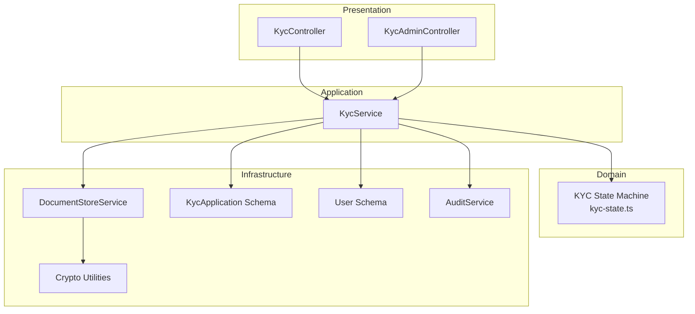
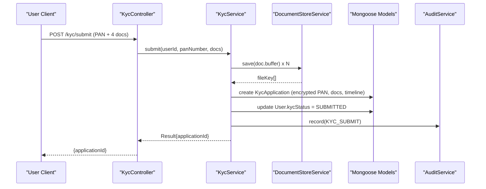
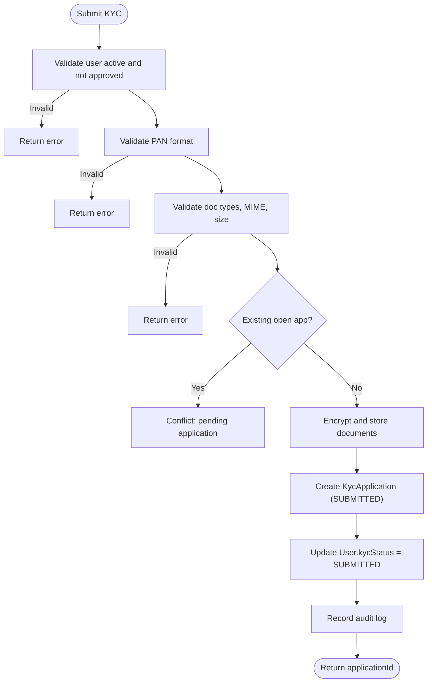
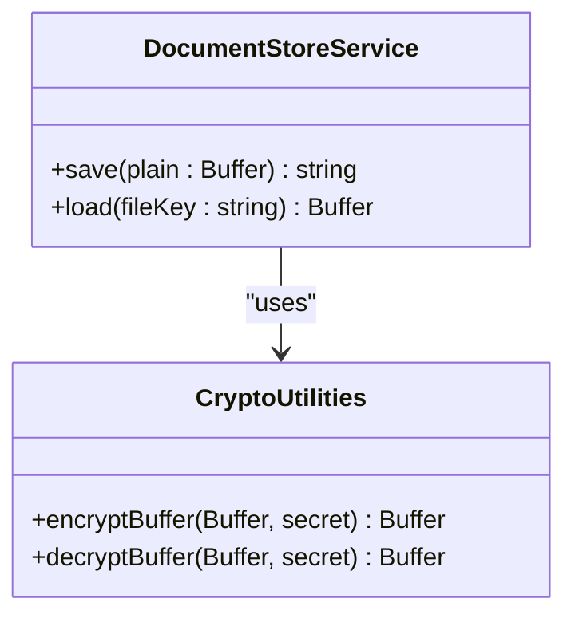
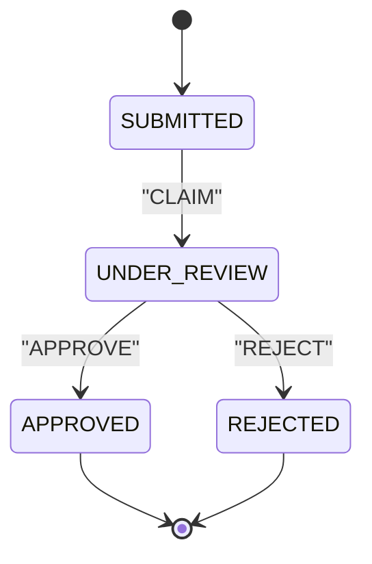
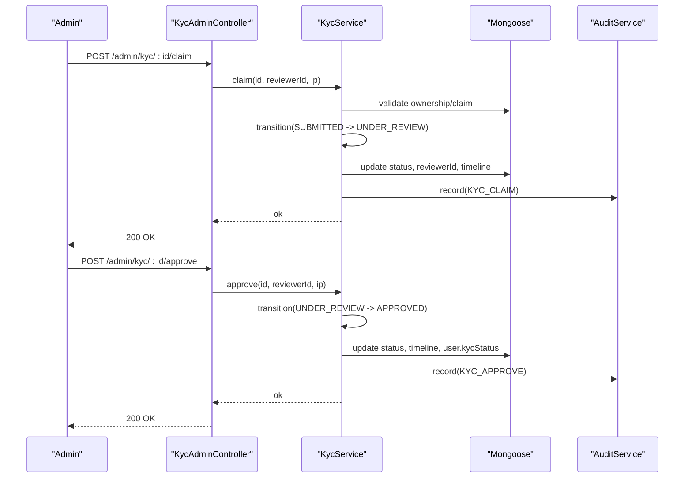
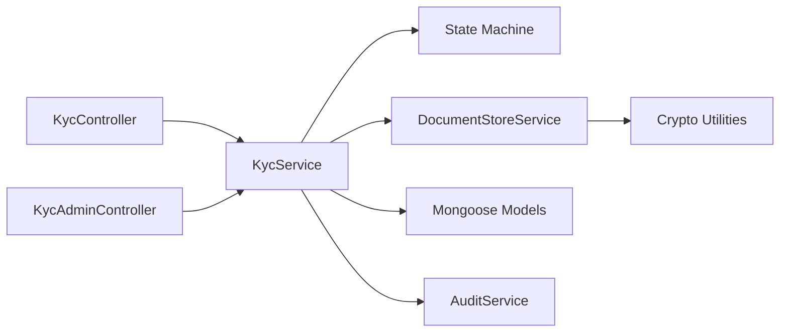

# KYC & Compliance

<cite>
**Referenced Files in This Document**
- [kyc.module.ts](file://backend/apps/api/src/modules/kyc/kyc.module.ts)
- [kyc.service.ts](file://backend/apps/api/src/modules/kyc/application/kyc.service.ts)
- [kyc-state.ts](file://backend/apps/api/src/modules/kyc/domain/kyc-state.ts)
- [document-store.service.ts](file://backend/apps/api/src/modules/kyc/infrastructure/document-store.service.ts)
- [kyc-application.schema.ts](file://backend/apps/api/src/modules/kyc/infrastructure/kyc-application.schema.ts)
- [kyc.controller.ts](file://backend/apps/api/src/modules/kyc/presentation/kyc.controller.ts)
- [kyc-admin.controller.ts](file://backend/apps/api/src/modules/kyc/presentation/kyc-admin.controller.ts)
- [kyc.dtos.ts](file://backend/apps/api/src/modules/kyc/presentation/dto/kyc.dtos.ts)
- [crypto.util.ts](file://backend/apps/api/src/modules/auth/infrastructure/crypto.util.ts)
- [user.schema.ts](file://backend/apps/api/src/modules/auth/infrastructure/schemas/user.schema.ts)
- [audit.service.ts](file://backend/libs/shared/src/audit/audit.service.ts)
- [audit-log.schema.ts](file://backend/libs/shared/src/audit/audit-log.schema.ts)
- [kyc-state.spec.ts](file://backend/apps/api/src/modules/kyc/__tests__/kyc-state.spec.ts)
- [document-crypto.spec.ts](file://backend/apps/api/src/modules/kyc/__tests__/document-crypto.spec.ts)
</cite>

## Table of Contents
1. Introduction
2. Project Structure
3. Core Components
4. Architecture Overview
5. Detailed Component Analysis
6. Dependency Analysis
7. Performance Considerations
8. Troubleshooting Guide
9. Conclusion

## Introduction
This document describes the KYC & Compliance module that enables users to submit identity documents, supports secure storage and encryption, enforces a strict state machine for review workflows, and provides an admin interface for claim, approve, and reject actions with full audit logging. It also covers validation rules, privacy controls, and data retention considerations derived from the implementation.

## Project Structure
The KYC module follows a layered architecture:
- Presentation: REST controllers for user and admin endpoints
- Application: Business logic orchestrating submission, review, and status updates
- Domain: Pure state machine and shared constants for document types and limits
- Infrastructure: Mongoose schemas, encrypted file store, and integration with auth and audit services

**Diagram sources**
- [kyc.controller.ts:37-63](file://backend/apps/api/src/modules/kyc/presentation/kyc.controller.ts#L37-L63)
- [kyc-admin.controller.ts:27-79](file://backend/apps/api/src/modules/kyc/presentation/kyc-admin.controller.ts#L27-L79)
- [kyc.service.ts:29-189](file://backend/apps/api/src/modules/kyc/application/kyc.service.ts#L29-L189)
- [kyc-state.ts:1-35](file://backend/apps/api/src/modules/kyc/domain/kyc-state.ts#L1-L35)
- [document-store.service.ts:1-38](file://backend/apps/api/src/modules/kyc/infrastructure/document-store.service.ts#L1-L38)
- [kyc-application.schema.ts:38-70](file://backend/apps/api/src/modules/kyc/infrastructure/kyc-application.schema.ts#L38-L70)
- [user.schema.ts:43-47](file://backend/apps/api/src/modules/auth/infrastructure/schemas/user.schema.ts#L43-L47)
- [audit.service.ts:23-44](file://backend/libs/shared/src/audit/audit.service.ts#L23-L44)
- [crypto.util.ts:1-44](file://backend/apps/api/src/modules/auth/infrastructure/crypto.util.ts#L1-L44)

**Section sources**
- [kyc.module.ts:1-25](file://backend/apps/api/src/modules/kyc/kyc.module.ts#L1-L25)

## Core Components
- KycController: User-facing endpoints to check KYC status and submit PAN plus required documents with rate limiting and file size enforcement.
- KycAdminController: Admin endpoints to list queue, view details, stream documents securely, and perform claim/approve/reject with permission checks.
- KycService: Orchestrates validation, encryption, persistence, state transitions, user KYC status synchronization, and audit recording.
- DocumentStoreService: Encrypts and stores files on disk under a controlled directory; returns opaque keys.
- KYC State Machine: Enforces legal transitions (SUBMITTED → UNDER_REVIEW → APPROVED/REJECTED).
- Schemas: KycApplication stores application metadata, encrypted PAN, document references, reviewer info, rejection reason, and timeline. User schema tracks overall KYC status.
- AuditService: Immutable audit trail for compliance reporting.

Key responsibilities and interactions are detailed in subsequent sections.

**Section sources**
- [kyc.controller.ts:37-63](file://backend/apps/api/src/modules/kyc/presentation/kyc.controller.ts#L37-L63)
- [kyc-admin.controller.ts:27-79](file://backend/apps/api/src/modules/kyc/presentation/kyc-admin.controller.ts#L27-L79)
- [kyc.service.ts:29-189](file://backend/apps/api/src/modules/kyc/application/kyc.service.ts#L29-L189)
- [document-store.service.ts:1-38](file://backend/apps/api/src/modules/kyc/infrastructure/document-store.service.ts#L1-L38)
- [kyc-state.ts:1-35](file://backend/apps/api/src/modules/kyc/domain/kyc-state.ts#L1-L35)
- [kyc-application.schema.ts:38-70](file://backend/apps/api/src/modules/kyc/infrastructure/kyc-application.schema.ts#L38-L70)
- [user.schema.ts:43-47](file://backend/apps/api/src/modules/auth/infrastructure/schemas/user.schema.ts#L43-L47)
- [audit.service.ts:23-44](file://backend/libs/shared/src/audit/audit.service.ts#L23-L44)

## Architecture Overview
The system separates concerns across layers and integrates with authentication, authorization, and audit subsystems.

**Diagram sources**
- [kyc.controller.ts:47-63](file://backend/apps/api/src/modules/kyc/presentation/kyc.controller.ts#L47-L63)
- [kyc.service.ts:55-109](file://backend/apps/api/src/modules/kyc/application/kyc.service.ts#L55-L109)
- [document-store.service.ts:23-30](file://backend/apps/api/src/modules/kyc/infrastructure/document-store.service.ts#L23-L30)
- [kyc-application.schema.ts:38-70](file://backend/apps/api/src/modules/kyc/infrastructure/kyc-application.schema.ts#L38-L70)
- [audit.service.ts:29-35](file://backend/libs/shared/src/audit/audit.service.ts#L29-L35)

## Detailed Component Analysis

### User Verification Workflow
- Validation:
  - User must be active and not already approved for KYC.
  - PAN format is validated server-side and via DTO.
  - Required documents: PAN, ID_PROOF, ADDRESS_PROOF, SELFIE.
  - Allowed MIME types: JPEG, PNG, PDF; max file size enforced by interceptor.
- Submission:
  - Documents are encrypted at rest and stored; only opaque keys are persisted.
  - A new KycApplication is created with status SUBMITTED and a timeline entry.
  - User.kycStatus is updated to SUBMITTED.
  - An audit record is written for the submission event.

**Diagram sources**
- [kyc.controller.ts:47-63](file://backend/apps/api/src/modules/kyc/presentation/kyc.controller.ts#L47-L63)
- [kyc.service.ts:55-109](file://backend/apps/api/src/modules/kyc/application/kyc.service.ts#L55-L109)
- [kyc.dtos.ts:4-7](file://backend/apps/api/src/modules/kyc/presentation/dto/kyc.dtos.ts#L4-L7)
- [kyc-state.ts:30-35](file://backend/apps/api/src/modules/kyc/domain/kyc-state.ts#L30-L35)

**Section sources**
- [kyc.controller.ts:42-63](file://backend/apps/api/src/modules/kyc/presentation/kyc.controller.ts#L42-L63)
- [kyc.service.ts:55-109](file://backend/apps/api/src/modules/kyc/application/kyc.service.ts#L55-L109)
- [kyc.dtos.ts:4-7](file://backend/apps/api/src/modules/kyc/presentation/dto/kyc.dtos.ts#L4-L7)
- [kyc-state.ts:30-35](file://backend/apps/api/src/modules/kyc/domain/kyc-state.ts#L30-L35)

### Document Upload and Processing
- File handling:
  - Interceptor enforces per-field upload limits and total file count.
  - Each uploaded file is passed to the service with type, buffer, MIME, and size.
- Storage:
  - Files are AES-256-GCM encrypted before writing to disk under a controlled directory.
  - Opaque UUID-based keys are returned and stored in the application document.
- Retrieval:
  - Admin can stream documents securely; responses disable caching and set safe content disposition.

**Diagram sources**
- [document-store.service.ts:1-38](file://backend/apps/api/src/modules/kyc/infrastructure/document-store.service.ts#L1-L38)
- [crypto.util.ts:26-43](file://backend/apps/api/src/modules/auth/infrastructure/crypto.util.ts#L26-L43)

**Section sources**
- [kyc.controller.ts:47-63](file://backend/apps/api/src/modules/kyc/presentation/kyc.controller.ts#L47-L63)
- [document-store.service.ts:23-36](file://backend/apps/api/src/modules/kyc/infrastructure/document-store.service.ts#L23-L36)
- [crypto.util.ts:26-43](file://backend/apps/api/src/modules/auth/infrastructure/crypto.util.ts#L26-L43)
- [kyc-admin.controller.ts:44-55](file://backend/apps/api/src/modules/kyc/presentation/kyc-admin.controller.ts#L44-L55)

### Compliance Checking and Status Management
- State machine:
  - Legal transitions: SUBMITTED → UNDER_REVIEW (CLAIM), UNDER_REVIEW → APPROVED or REJECTED.
  - Terminal states (APPROVED, REJECTED) reject further actions.
- Enforcement:
  - Service calls a pure transition function to prevent illegal state changes.
  - On action success, application status is updated, timeline extended, and user.kycStatus synchronized.
- Queue and detail:
  - Admin can paginate applications filtered by status and fetch full details including user info.

**Diagram sources**
- [kyc-state.ts:3-28](file://backend/apps/api/src/modules/kyc/domain/kyc-state.ts#L3-L28)
- [kyc.service.ts:152-187](file://backend/apps/api/src/modules/kyc/application/kyc.service.ts#L152-L187)

**Section sources**
- [kyc-state.ts:3-28](file://backend/apps/api/src/modules/kyc/domain/kyc-state.ts#L3-L28)
- [kyc.service.ts:113-187](file://backend/apps/api/src/modules/kyc/application/kyc.service.ts#L113-L187)
- [kyc-admin.controller.ts:32-79](file://backend/apps/api/src/modules/kyc/presentation/kyc-admin.controller.ts#L32-L79)

### Admin Review Process, Approval Workflows, and Rejection Handling
- Permissions:
  - Admin endpoints require employee authentication and specific permissions.
- Claim:
  - Prevents concurrent claims; ensures only one reviewer handles an application while under review.
- Approve/Reject:
  - Updates application status, sets rejection reason if applicable, records timeline, syncs user.kycStatus, and writes audit logs.
- Document viewing:
  - Streams encrypted documents with no-store cache headers and inline disposition.

**Diagram sources**
- [kyc-admin.controller.ts:57-79](file://backend/apps/api/src/modules/kyc/presentation/kyc-admin.controller.ts#L57-L79)
- [kyc.service.ts:140-187](file://backend/apps/api/src/modules/kyc/application/kyc.service.ts#L140-L187)
- [kyc-state.ts:12-28](file://backend/apps/api/src/modules/kyc/domain/kyc-state.ts#L12-L28)
- [audit.service.ts:29-35](file://backend/libs/shared/src/audit/audit.service.ts#L29-L35)

**Section sources**
- [kyc-admin.controller.ts:27-79](file://backend/apps/api/src/modules/kyc/presentation/kyc-admin.controller.ts#L27-L79)
- [kyc.service.ts:140-187](file://backend/apps/api/src/modules/kyc/application/kyc.service.ts#L140-L187)
- [kyc-state.ts:12-28](file://backend/apps/api/src/modules/kyc/domain/kyc-state.ts#L12-L28)

### Secure Document Handling, Privacy Controls, and Data Retention
- Encryption at rest:
  - Field-level encryption for PAN using AES-256-GCM with a secret-derived key.
  - Binary encryption for document blobs using the same algorithm and secret.
- Storage safety:
  - Files stored under a dedicated directory with restrictive permissions.
  - Opaque UUID-based paths prevent leaking user or document context from filenames.
  - Path normalization prevents traversal attacks when loading.
- Privacy controls:
  - Responses for document streaming disable caching.
  - Encrypted fields are excluded from default queries where appropriate.
- Data retention:
  - The codebase persists applications and audit logs indefinitely unless external lifecycle policies are applied. No explicit deletion routines are present in this module.

**Section sources**
- [crypto.util.ts:9-24](file://backend/apps/api/src/modules/auth/infrastructure/crypto.util.ts#L9-L24)
- [crypto.util.ts:26-43](file://backend/apps/api/src/modules/auth/infrastructure/crypto.util.ts#L26-L43)
- [document-store.service.ts:8-36](file://backend/apps/api/src/modules/kyc/infrastructure/document-store.service.ts#L8-L36)
- [kyc-application.schema.ts:46-48](file://backend/apps/api/src/modules/kyc/infrastructure/kyc-application.schema.ts#L46-L48)
- [kyc-admin.controller.ts:44-55](file://backend/apps/api/src/modules/kyc/presentation/kyc-admin.controller.ts#L44-L55)

### Integration with External Verification Services
- Current implementation does not call external verification providers.
- The design allows future extension by adding service calls within KycService after document validation or during review phases.

[No sources needed since this section summarizes current behavior without analyzing specific files]

### Document Validation Rules
- Required document types: PAN, ID_PROOF, ADDRESS_PROOF, SELFIE.
- Allowed MIME types: image/jpeg, image/png, application/pdf.
- Max file size: 5 MB enforced by interceptor and validated in service.
- PAN format: Server-side regex and DTO matcher ensure ABCDE1234F pattern.

**Section sources**
- [kyc-state.ts:30-35](file://backend/apps/api/src/modules/kyc/domain/kyc-state.ts#L30-L35)
- [kyc.controller.ts:47-63](file://backend/apps/api/src/modules/kyc/presentation/kyc.controller.ts#L47-L63)
- [kyc.service.ts:64-80](file://backend/apps/api/src/modules/kyc/application/kyc.service.ts#L64-L80)
- [kyc.dtos.ts:4-7](file://backend/apps/api/src/modules/kyc/presentation/dto/kyc.dtos.ts#L4-L7)

### Audit Logging for Regulatory Compliance
- Immutable audit trail:
  - Write-once records with actor type, actor id, action, entity, entity id, before/after snapshots, and IP.
  - Failures to write audit logs do not abort business operations but are logged loudly.
- KYC events:
  - Claims, approvals, and rejections are recorded with contextual before/after status and reasons.

**Section sources**
- [audit.service.ts:17-44](file://backend/libs/shared/src/audit/audit.service.ts#L17-L44)
- [audit-log.schema.ts:6-41](file://backend/libs/shared/src/audit/audit-log.schema.ts#L6-L41)
- [kyc.service.ts:183-186](file://backend/apps/api/src/modules/kyc/application/kyc.service.ts#L183-L186)

## Dependency Analysis
The KYC module depends on authentication, authorization, database, and audit subsystems.

**Diagram sources**
- [kyc.module.ts:12-23](file://backend/apps/api/src/modules/kyc/kyc.module.ts#L12-L23)
- [kyc.controller.ts:37-63](file://backend/apps/api/src/modules/kyc/presentation/kyc.controller.ts#L37-L63)
- [kyc-admin.controller.ts:27-79](file://backend/apps/api/src/modules/kyc/presentation/kyc-admin.controller.ts#L27-L79)
- [kyc.service.ts:29-189](file://backend/apps/api/src/modules/kyc/application/kyc.service.ts#L29-L189)
- [document-store.service.ts:1-38](file://backend/apps/api/src/modules/kyc/infrastructure/document-store.service.ts#L1-L38)
- [audit.service.ts:23-44](file://backend/libs/shared/src/audit/audit.service.ts#L23-L44)
- [crypto.util.ts:1-44](file://backend/apps/api/src/modules/auth/infrastructure/crypto.util.ts#L1-L44)

**Section sources**
- [kyc.module.ts:12-23](file://backend/apps/api/src/modules/kyc/kyc.module.ts#L12-L23)

## Performance Considerations
- Rate limiting:
  - Submit endpoint is throttled to reduce abuse.
- Database indexing:
  - Queries on status and createdAt are optimized with indexes.
  - Unique partial index ensures one live application per user.
- I/O:
  - Document encryption adds CPU overhead; consider batching or background processing for large volumes.
- Caching:
  - Document responses explicitly avoid caching to protect sensitive data.

[No sources needed since this section provides general guidance]

## Troubleshooting Guide
Common errors and their causes:
- Invalid PAN format: Ensure input matches expected pattern; DTO and server-side checks will reject mismatches.
- Missing or invalid documents: Verify all four required documents are provided with allowed MIME types and within size limits.
- Pending application conflict: Only one non-terminal application is allowed per user; existing submissions block new ones until terminal.
- Claim conflicts: If an application is already claimed by another reviewer, attempts to claim again will fail.
- Illegal state transitions: Actions like approving or rejecting a submitted application without claiming first are blocked by the state machine.
- Audit write failures: Non-fatal; check logs for audit write errors and investigate downstream issues.

Validation and tests:
- State machine tests confirm correct transitions and error codes.
- Encryption tests verify round-trip integrity, uniqueness, tamper detection, and key sensitivity.

**Section sources**
- [kyc.service.ts:55-109](file://backend/apps/api/src/modules/kyc/application/kyc.service.ts#L55-L109)
- [kyc.service.ts:152-187](file://backend/apps/api/src/modules/kyc/application/kyc.service.ts#L152-L187)
- [kyc-state.spec.ts:1-37](file://backend/apps/api/src/modules/kyc/__tests__/kyc-state.spec.ts#L1-L37)
- [document-crypto.spec.ts:1-29](file://backend/apps/api/src/modules/kyc/__tests__/document-crypto.spec.ts#L1-L29)
- [audit.service.ts:29-35](file://backend/libs/shared/src/audit/audit.service.ts#L29-L35)

## Conclusion
The KYC & Compliance module implements a robust, secure, and auditable workflow for user verification. It enforces strict validation, encrypts sensitive data at rest, manages KYC progression through a pure state machine, and exposes both user and admin APIs with strong access controls. While external verification integrations are not implemented, the modular design allows future extensions. Operational safeguards include rate limiting, indexing, immutable audit trails, and privacy-preserving response headers.